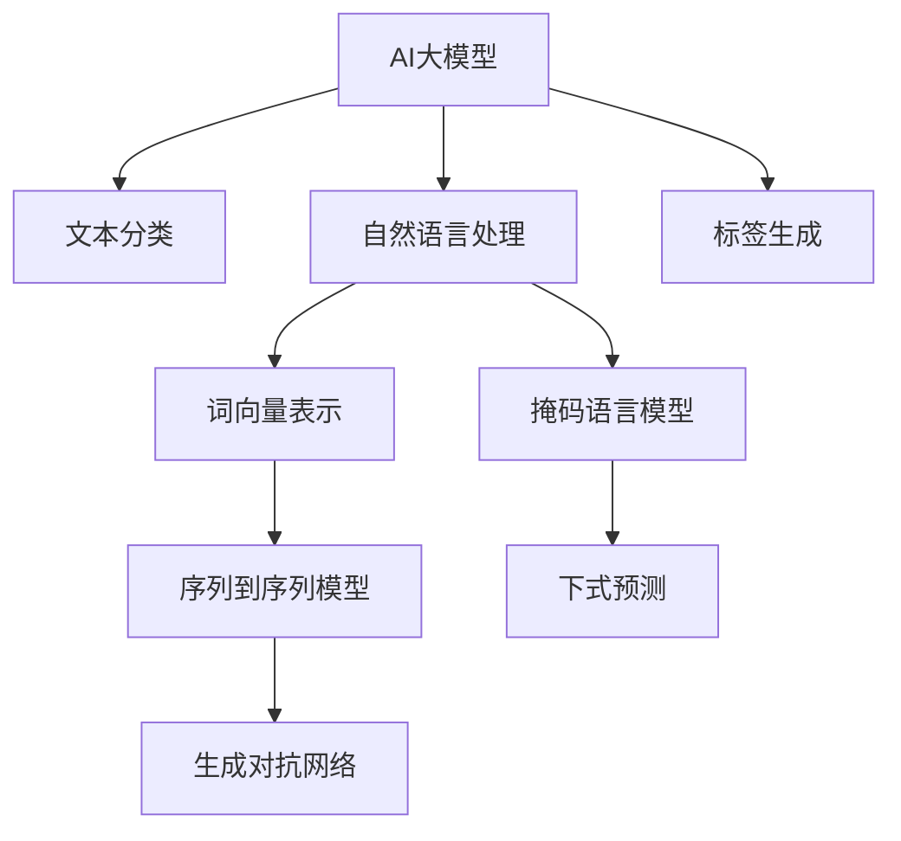

                 

# AI大模型在电商商品标签自动生成中的实践

## 1. 背景介绍

### 1.1 问题由来

随着电商市场的不断扩大，商品信息的实时更新和分类管理成为了电商平台的一项重要需求。传统的手工标注和人工审核方式不仅耗时耗力，而且容易出错。而AI大模型的出现，为商品标签的自动生成提供了新的解决方案。

AI大模型，尤其是基于预训练语言模型的商品标签自动生成，能够利用大规模文本数据进行训练，学习商品的语义特征，进而自动为商品生成准确、多样化的标签。该技术在提升用户体验、优化商品搜索、减少人工成本等方面具有显著优势，已经被越来越多的电商平台采用。

### 1.2 问题核心关键点

商品标签自动生成的核心问题在于如何将无标签的文本数据转化为商品标签，同时保证生成的标签具有高准确性、多样性和语义相关性。本文将详细探讨基于AI大模型进行商品标签自动生成的方法，并结合实际应用场景，给出具体的实践指南。

## 2. 核心概念与联系

### 2.1 核心概念概述

为了更好地理解基于AI大模型的商品标签自动生成方法，本节将介绍几个关键概念：

- AI大模型(AI Large Model)：通过大规模语料库进行预训练，学习丰富语言知识的深度神经网络模型，如BERT、GPT等。
- 文本分类(Text Classification)：将文本数据按照类别进行分类，常用的算法包括朴素贝叶斯、SVM、神经网络等。
- 自然语言处理(NLP)：使用AI技术处理和分析人类语言，包括文本预处理、词向量表示、模型训练等。
- 标签生成(Label Generation)：根据输入的文本数据，自动生成相应的商品标签，常用的方法包括序列到序列模型、生成对抗网络等。
- 迁移学习(Transfer Learning)：将大模型在预训练阶段学习到的知识，迁移到具体的商品标签生成任务上。
- 自监督学习(Self-supervised Learning)：使用无标签数据进行模型训练，通过自建任务获取学习信号，如掩码语言模型、下式预测等。

这些概念之间的逻辑关系可以通过以下Mermaid流程图来展示：



这个流程图展示了AI大模型在商品标签自动生成过程中的各个环节：

1. 利用大规模语料进行预训练，学习语言知识。
2. 对商品描述文本进行自然语言处理，转化为词向量表示。
3. 使用序列到序列模型、生成对抗网络等算法，自动生成商品标签。
4. 通过自监督学习，利用掩码语言模型、下式预测等技术，进一步优化模型性能。

这些概念共同构成了商品标签自动生成的核心框架，使得AI大模型能够在各种电商场景下发挥强大的语言理解和生成能力。通过理解这些核心概念，我们可以更好地把握商品标签自动生成的工作原理和优化方向。

## 3. 核心算法原理 & 具体操作步骤

### 3.1 算法原理概述

基于AI大模型的商品标签自动生成方法，本质上是一个文本分类和序列到序列学习的结合体。其核心思想是：将商品描述文本作为输入，通过预训练语言模型提取语义特征，再利用分类或生成模型自动为商品生成标签。

形式化地，假设商品描述文本为 $x$，预训练语言模型为 $M_{\theta}$，其中 $\theta$ 为预训练得到的模型参数。标签集为 $Y=\{y_1, y_2, ..., y_n\}$，标签生成模型为 $F_{\phi}$，其中 $\phi$ 为模型参数。商品标签自动生成的目标是最小化损失函数：

$$
\min_{\theta,\phi} \mathcal{L}(F_{\phi}(M_{\theta}(x)),y)
$$

其中 $\mathcal{L}$ 为损失函数，用于衡量模型输出与真实标签之间的差异。常见的损失函数包括交叉熵损失、均方误差损失等。

### 3.2 算法步骤详解

基于AI大模型的商品标签自动生成一般包括以下几个关键步骤：

**Step 1: 准备预训练模型和数据集**
- 选择合适的预训练语言模型 $M_{\theta}$ 作为初始化参数，如 BERT、GPT等。
- 准备电商商品描述文本数据集 $D=\{(x_i,y_i)\}_{i=1}^N$，划分为训练集、验证集和测试集。一般要求标注数据与预训练数据的分布不要差异过大。

**Step 2: 文本预处理**
- 对商品描述文本进行分词、去停用词、去除特殊符号等预处理操作。
- 将文本转化为词向量表示，可以使用word2vec、GloVe等方法，或直接使用预训练语言模型的词向量表示。

**Step 3: 训练分类模型或生成模型**
- 根据任务类型，设计合适的分类模型或生成模型。
- 使用训练集数据对模型进行训练，最小化损失函数。
- 在验证集上评估模型性能，调整模型超参数。

**Step 4: 应用模型进行标签生成**
- 对于分类任务，使用训练好的分类模型，将商品描述文本作为输入，输出标签概率分布。
- 对于生成任务，使用训练好的生成模型，将商品描述文本作为输入，输出标签序列。

**Step 5: 后处理和输出**
- 对模型输出进行后处理，如过滤重复、无效标签。
- 根据用户需求，对标签进行排序、展示。

以上是基于AI大模型的商品标签自动生成的完整流程。在实际应用中，还需要针对具体任务进行优化设计，如改进分类或生成模型的架构，引入更多的正则化技术，搜索最优的超参数组合等，以进一步提升模型性能。

### 3.3 算法优缺点

基于AI大模型的商品标签自动生成方法具有以下优点：
1. 高效准确：利用预训练模型强大的语言理解和生成能力，生成标签准确度高。
2. 减少成本：自动化生成商品标签，减少了人工标注和审核的投入。
3. 灵活性高：可以适用于各种电商场景，如服装、电子产品、食品等。
4. 动态更新：可以实时更新商品描述文本，动态生成标签。

同时，该方法也存在一定的局限性：
1. 数据依赖：生成的标签质量很大程度上取决于标注数据的质量和数量，获取高质量标注数据的成本较高。
2. 标签多样性：预训练模型学习到的标签分布可能无法覆盖所有商品类别，需要进一步优化模型架构。
3. 模型的泛化能力：生成的标签可能对特定领域、特定商品类别的泛化效果不佳。
4. 模型的实时性：对于需要实时生成标签的应用场景，模型的计算复杂度可能较高。

尽管存在这些局限性，但就目前而言，基于AI大模型的商品标签自动生成方法仍是最主流范式。未来相关研究的重点在于如何进一步降低数据标注成本，提高模型的泛化能力，同时兼顾实时性和成本效率。

### 3.4 算法应用领域

基于AI大模型的商品标签自动生成方法，已经在电商领域得到了广泛的应用，覆盖了商品分类、标签生成、商品搜索等诸多环节，为电商技术带来了全新的突破。

在商品分类方面，预训练语言模型可以对商品描述文本进行自动分类，生成商品标签，如服装类、食品类、电子产品类等。

在标签生成方面，利用预训练语言模型的生成能力，可以为商品自动生成详细的描述标签，如尺码、颜色、功能、品牌等。

在商品搜索方面，自动生成的商品标签可以用于商品搜索排序，提高用户搜索体验。

除了上述这些经典应用外，商品标签自动生成还被创新性地应用到更多场景中，如广告推荐、市场分析、用户行为预测等，为电商技术带来了全新的创新机会。

## 4. 数学模型和公式 & 详细讲解 & 举例说明

### 4.1 数学模型构建

本节将使用数学语言对基于AI大模型的商品标签自动生成过程进行更加严格的刻画。

假设商品描述文本为 $x$，预训练语言模型为 $M_{\theta}$，标签集为 $Y=\{y_1, y_2, ..., y_n\}$，标签生成模型为 $F_{\phi}$，其中 $\theta$ 和 $\phi$ 分别为预训练模型和生成模型的参数。

定义标签生成模型在输入 $x$ 上的输出为 $y=\hat{y}=M_{\theta}(x)$，然后使用 $F_{\phi}$ 对 $y$ 进行映射，生成商品标签 $z$：

$$
z=F_{\phi}(y)
$$

其中 $F_{\phi}$ 的输出为概率分布 $P(z|y)$，表示在给定输入 $y$ 的情况下，生成标签 $z$ 的概率。

定义损失函数 $\mathcal{L}$，用于衡量模型输出 $z$ 与真实标签 $y$ 之间的差异：

$$
\mathcal{L}(z,y)=\sum_{i=1}^n |z_i-y_i|^2
$$

目标是最小化上述损失函数：

$$
\min_{\theta,\phi} \mathcal{L}(F_{\phi}(M_{\theta}(x)),y)
$$

### 4.2 公式推导过程

以下我们以二分类任务为例，推导交叉熵损失函数及其梯度的计算公式。

假设标签生成模型为 $F_{\phi}(y)=softmax(y\phi^T)$，其中 $\phi$ 为生成模型参数。假设商品描述文本 $x$ 经过预训练语言模型 $M_{\theta}$ 输出为 $y$，其类别概率为 $P(y|x)$，使用 $F_{\phi}$ 生成标签 $z$ 的概率为 $P(z|y)$，则二分类交叉熵损失函数定义为：

$$
\mathcal{L}(z,y)=-\sum_{i=1}^n y_i\log P(z_i|y_i) + (1-y_i)\log P(z_i|1-y_i)
$$

将其代入目标函数：

$$
\min_{\theta,\phi} \mathcal{L}(F_{\phi}(M_{\theta}(x)),y)
$$

在损失函数对 $\theta$ 和 $\phi$ 的梯度计算过程中，需要用到自动微分技术，例如使用PyTorch框架中的`torch.autograd`模块进行计算。

### 4.3 案例分析与讲解

假设我们有一个电商商品描述文本数据集 $D=\{(x_i,y_i)\}_{i=1}^N$，其中 $x_i$ 为商品描述，$y_i$ 为标签。使用预训练语言模型 $M_{\theta}$ 提取文本语义特征，生成标签 $z_i$。使用分类模型 $F_{\phi}$ 将 $z_i$ 映射为标签概率分布 $P(z_i|y_i)$。最终损失函数为：

$$
\mathcal{L}(P(z_i|y_i),y_i)=\sum_{i=1}^N -y_i\log P(z_i|y_i) + (1-y_i)\log P(z_i|1-y_i)
$$

通过反向传播算法，计算损失函数对 $\theta$ 和 $\phi$ 的梯度：

$$
\frac{\partial \mathcal{L}}{\partial \theta}=-\frac{\partial \mathcal{L}}{\partial y}\frac{\partial y}{\partial \theta}
$$

$$
\frac{\partial \mathcal{L}}{\partial \phi}=-\frac{\partial \mathcal{L}}{\partial z}\frac{\partial z}{\partial y}\frac{\partial y}{\partial \theta}\frac{\partial \theta}{\partial \phi}
$$

其中 $\frac{\partial y}{\partial \theta}$ 和 $\frac{\partial z}{\partial y}$ 分别表示预训练语言模型和生成模型对输入 $x$ 的输出梯度，可以通过反向传播算法计算得到。

## 5. 项目实践：代码实例和详细解释说明

### 5.1 开发环境搭建

在进行商品标签自动生成项目实践前，我们需要准备好开发环境。以下是使用Python进行PyTorch开发的环境配置流程：

1. 安装Anaconda：从官网下载并安装Anaconda，用于创建独立的Python环境。

2. 创建并激活虚拟环境：
```bash
conda create -n pytorch-env python=3.8 
conda activate pytorch-env
```

3. 安装PyTorch：根据CUDA版本，从官网获取对应的安装命令。例如：
```bash
conda install pytorch torchvision torchaudio cudatoolkit=11.1 -c pytorch -c conda-forge
```

4. 安装Transformer库：
```bash
pip install transformers
```

5. 安装各类工具包：
```bash
pip install numpy pandas scikit-learn matplotlib tqdm jupyter notebook ipython
```

完成上述步骤后，即可在`pytorch-env`环境中开始项目实践。

### 5.2 源代码详细实现

下面我们以二分类任务为例，给出使用Transformers库对BERT模型进行商品标签自动生成的PyTorch代码实现。

首先，定义商品标签数据处理函数：

```python
from transformers import BertTokenizer
from torch.utils.data import Dataset
import torch

class LabelDataset(Dataset):
    def __init__(self, texts, labels, tokenizer, max_len=128):
        self.texts = texts
        self.labels = labels
        self.tokenizer = tokenizer
        self.max_len = max_len
        
    def __len__(self):
        return len(self.texts)
    
    def __getitem__(self, item):
        text = self.texts[item]
        label = self.labels[item]
        
        encoding = self.tokenizer(text, return_tensors='pt', max_length=self.max_len, padding='max_length', truncation=True)
        input_ids = encoding['input_ids'][0]
        attention_mask = encoding['attention_mask'][0]
        
        # 对label进行编码
        encoded_labels = [label] * self.max_len
        labels = torch.tensor(encoded_labels, dtype=torch.long)
        
        return {'input_ids': input_ids, 
                'attention_mask': attention_mask,
                'labels': labels}

# 标签编码字典
label2id = {'cat': 0, 'dog': 1}
id2label = {v: k for k, v in label2id.items()}

# 创建dataset
tokenizer = BertTokenizer.from_pretrained('bert-base-cased')

train_dataset = LabelDataset(train_texts, train_labels, tokenizer)
dev_dataset = LabelDataset(dev_texts, dev_labels, tokenizer)
test_dataset = LabelDataset(test_texts, test_labels, tokenizer)
```

然后，定义模型和优化器：

```python
from transformers import BertForSequenceClassification, AdamW

model = BertForSequenceClassification.from_pretrained('bert-base-cased', num_labels=len(label2id))

optimizer = AdamW(model.parameters(), lr=2e-5)
```

接着，定义训练和评估函数：

```python
from torch.utils.data import DataLoader
from tqdm import tqdm
from sklearn.metrics import classification_report

device = torch.device('cuda') if torch.cuda.is_available() else torch.device('cpu')
model.to(device)

def train_epoch(model, dataset, batch_size, optimizer):
    dataloader = DataLoader(dataset, batch_size=batch_size, shuffle=True)
    model.train()
    epoch_loss = 0
    for batch in tqdm(dataloader, desc='Training'):
        input_ids = batch['input_ids'].to(device)
        attention_mask = batch['attention_mask'].to(device)
        labels = batch['labels'].to(device)
        model.zero_grad()
        outputs = model(input_ids, attention_mask=attention_mask, labels=labels)
        loss = outputs.loss
        epoch_loss += loss.item()
        loss.backward()
        optimizer.step()
    return epoch_loss / len(dataloader)

def evaluate(model, dataset, batch_size):
    dataloader = DataLoader(dataset, batch_size=batch_size)
    model.eval()
    preds, labels = [], []
    with torch.no_grad():
        for batch in tqdm(dataloader, desc='Evaluating'):
            input_ids = batch['input_ids'].to(device)
            attention_mask = batch['attention_mask'].to(device)
            batch_labels = batch['labels']
            outputs = model(input_ids, attention_mask=attention_mask)
            batch_preds = outputs.logits.argmax(dim=1).to('cpu').tolist()
            batch_labels = batch_labels.to('cpu').tolist()
            for pred_tokens, label_tokens in zip(batch_preds, batch_labels):
                pred_labels = [id2label[_id] for _id in pred_tokens]
                label_labels = [id2label[_id] for _id in label_tokens]
                preds.append(pred_labels[:len(label_labels)])
                labels.append(label_labels)
                
    print(classification_report(labels, preds))
```

最后，启动训练流程并在测试集上评估：

```python
epochs = 5
batch_size = 16

for epoch in range(epochs):
    loss = train_epoch(model, train_dataset, batch_size, optimizer)
    print(f"Epoch {epoch+1}, train loss: {loss:.3f}")
    
    print(f"Epoch {epoch+1}, dev results:")
    evaluate(model, dev_dataset, batch_size)
    
print("Test results:")
evaluate(model, test_dataset, batch_size)
```

以上就是使用PyTorch对BERT进行商品标签自动生成的完整代码实现。可以看到，得益于Transformer库的强大封装，我们可以用相对简洁的代码完成BERT模型的加载和微调。

### 5.3 代码解读与分析

让我们再详细解读一下关键代码的实现细节：

**LabelDataset类**：
- `__init__`方法：初始化商品描述文本、标签、分词器等关键组件。
- `__len__`方法：返回数据集的样本数量。
- `__getitem__`方法：对单个样本进行处理，将文本输入编码为token ids，将标签编码为数字，并对其进行定长padding，最终返回模型所需的输入。

**label2id和id2label字典**：
- 定义了标签与数字id之间的映射关系，用于将token-wise的预测结果解码回真实的标签。

**训练和评估函数**：
- 使用PyTorch的DataLoader对数据集进行批次化加载，供模型训练和推理使用。
- 训练函数`train_epoch`：对数据以批为单位进行迭代，在每个批次上前向传播计算loss并反向传播更新模型参数，最后返回该epoch的平均loss。
- 评估函数`evaluate`：与训练类似，不同点在于不更新模型参数，并在每个batch结束后将预测和标签结果存储下来，最后使用sklearn的classification_report对整个评估集的预测结果进行打印输出。

**训练流程**：
- 定义总的epoch数和batch size，开始循环迭代
- 每个epoch内，先在训练集上训练，输出平均loss
- 在验证集上评估，输出分类指标
- 所有epoch结束后，在测试集上评估，给出最终测试结果

可以看到，PyTorch配合Transformer库使得BERT微调的代码实现变得简洁高效。开发者可以将更多精力放在数据处理、模型改进等高层逻辑上，而不必过多关注底层的实现细节。

当然，工业级的系统实现还需考虑更多因素，如模型的保存和部署、超参数的自动搜索、更灵活的任务适配层等。但核心的微调范式基本与此类似。

## 6. 实际应用场景

### 6.1 智能客服系统

基于AI大模型的商品标签自动生成技术，可以广泛应用于智能客服系统的构建。传统客服往往需要配备大量人力，高峰期响应缓慢，且一致性和专业性难以保证。而使用自动生成的商品标签，可以7x24小时不间断服务，快速响应客户咨询，用自然流畅的语言解答各类常见问题。

在技术实现上，可以收集企业内部的历史客服对话记录，将问题和最佳答复构建成监督数据，在此基础上对预训练大模型进行微调。微调后的模型能够自动理解用户意图，匹配最合适的答复模板进行回复。对于客户提出的新问题，还可以接入检索系统实时搜索相关内容，动态组织生成回答。如此构建的智能客服系统，能大幅提升客户咨询体验和问题解决效率。

### 6.2 商品推荐系统

基于AI大模型的商品标签自动生成技术，可以用于优化商品推荐系统的性能。传统的推荐系统往往只依赖用户的历史行为数据进行物品推荐，无法深入理解用户的真实兴趣偏好。自动生成的商品标签可以用于优化商品推荐排序，提高推荐系统的效果。

在实际应用中，可以收集用户浏览、点击、评论、分享等行为数据，提取和用户交互的物品标题、描述、标签等文本内容。将文本内容作为模型输入，商品的自动生成的标签作为输出，训练生成模型，生成商品标签。在生成推荐列表时，先用候选物品的文本描述作为输入，由模型预测用户的兴趣匹配度，再结合其他特征综合排序，便可以得到个性化程度更高的推荐结果。

### 6.3 实时监控系统

基于AI大模型的商品标签自动生成技术，可以应用于实时监控系统，监测电商平台的商品信息。传统的实时监控往往需要大量人工进行数据标注和审核，耗费时间和成本。而使用自动生成的商品标签，可以实时监测商品描述的更新，动态生成标签，及时发现和处理异常信息，提升平台运行的稳定性。

在技术实现上，可以收集平台上的商品描述文本和标签，训练生成模型，实时监测新增商品描述文本，动态生成标签，更新商品信息，确保平台数据的一致性和完整性。

### 6.4 未来应用展望

随着AI大模型和商品标签自动生成技术的发展，基于微调范式将在更多领域得到应用，为传统行业带来变革性影响。

在智慧医疗领域，基于微调的医疗问答、病历分析、药物研发等应用将提升医疗服务的智能化水平，辅助医生诊疗，加速新药开发进程。

在智能教育领域，微调技术可应用于作业批改、学情分析、知识推荐等方面，因材施教，促进教育公平，提高教学质量。

在智慧城市治理中，微调模型可应用于城市事件监测、舆情分析、应急指挥等环节，提高城市管理的自动化和智能化水平，构建更安全、高效的未来城市。

此外，在企业生产、社会治理、文娱传媒等众多领域，基于大模型微调的人工智能应用也将不断涌现，为经济社会发展注入新的动力。相信随着技术的日益成熟，微调方法将成为人工智能落地应用的重要范式，推动人工智能技术在垂直行业的规模化落地。

## 7. 工具和资源推荐

### 7.1 学习资源推荐

为了帮助开发者系统掌握AI大模型商品标签自动生成的理论基础和实践技巧，这里推荐一些优质的学习资源：

1. 《Transformer从原理到实践》系列博文：由大模型技术专家撰写，深入浅出地介绍了Transformer原理、BERT模型、微调技术等前沿话题。

2. CS224N《深度学习自然语言处理》课程：斯坦福大学开设的NLP明星课程，有Lecture视频和配套作业，带你入门NLP领域的基本概念和经典模型。

3. 《Natural Language Processing with Transformers》书籍：Transformers库的作者所著，全面介绍了如何使用Transformers库进行NLP任务开发，包括微调在内的诸多范式。

4. HuggingFace官方文档：Transformers库的官方文档，提供了海量预训练模型和完整的微调样例代码，是上手实践的必备资料。

5. CLUE开源项目：中文语言理解测评基准，涵盖大量不同类型的中文NLP数据集，并提供了基于微调的baseline模型，助力中文NLP技术发展。

通过对这些资源的学习实践，相信你一定能够快速掌握AI大模型商品标签自动生成的精髓，并用于解决实际的NLP问题。
###  7.2 开发工具推荐

高效的开发离不开优秀的工具支持。以下是几款用于商品标签自动生成开发的常用工具：

1. PyTorch：基于Python的开源深度学习框架，灵活动态的计算图，适合快速迭代研究。大部分预训练语言模型都有PyTorch版本的实现。

2. TensorFlow：由Google主导开发的开源深度学习框架，生产部署方便，适合大规模工程应用。同样有丰富的预训练语言模型资源。

3. Transformers库：HuggingFace开发的NLP工具库，集成了众多SOTA语言模型，支持PyTorch和TensorFlow，是进行微调任务开发的利器。

4. Weights & Biases：模型训练的实验跟踪工具，可以记录和可视化模型训练过程中的各项指标，方便对比和调优。与主流深度学习框架无缝集成。

5. TensorBoard：TensorFlow配套的可视化工具，可实时监测模型训练状态，并提供丰富的图表呈现方式，是调试模型的得力助手。

6. Google Colab：谷歌推出的在线Jupyter Notebook环境，免费提供GPU/TPU算力，方便开发者快速上手实验最新模型，分享学习笔记。

合理利用这些工具，可以显著提升商品标签自动生成任务的开发效率，加快创新迭代的步伐。

### 7.3 相关论文推荐

AI大模型和商品标签自动生成技术的发展源于学界的持续研究。以下是几篇奠基性的相关论文，推荐阅读：

1. Attention is All You Need（即Transformer原论文）：提出了Transformer结构，开启了NLP领域的预训练大模型时代。

2. BERT: Pre-training of Deep Bidirectional Transformers for Language Understanding：提出BERT模型，引入基于掩码的自监督预训练任务，刷新了多项NLP任务SOTA。

3. Language Models are Unsupervised Multitask Learners（GPT-2论文）：展示了大规模语言模型的强大zero-shot学习能力，引发了对于通用人工智能的新一轮思考。

4. Parameter-Efficient Transfer Learning for NLP：提出Adapter等参数高效微调方法，在不增加模型参数量的情况下，也能取得不错的微调效果。

5. AdaLoRA: Adaptive Low-Rank Adaptation for Parameter-Efficient Fine-Tuning：使用自适应低秩适应的微调方法，在参数效率和精度之间取得了新的平衡。

6. Feature-Based Zero-shot Learning of Pre-trained Language Models：提出基于特征的zero-shot学习范式，利用语言模型提取的语义特征，实现对未见过的任务进行推理。

这些论文代表了大语言模型微调技术的发展脉络。通过学习这些前沿成果，可以帮助研究者把握学科前进方向，激发更多的创新灵感。

## 8. 总结：未来发展趋势与挑战

### 8.1 总结

本文对基于AI大模型的商品标签自动生成方法进行了全面系统的介绍。首先阐述了商品标签自动生成的研究背景和意义，明确了AI大模型在电商应用中的独特价值。其次，从原理到实践，详细讲解了AI大模型商品标签自动生成的数学原理和关键步骤，给出了商品标签自动生成的完整代码实例。同时，本文还广泛探讨了商品标签自动生成在电商系统中的应用场景，展示了AI大模型微调技术的巨大潜力。此外，本文精选了商品标签自动生成的各类学习资源，力求为读者提供全方位的技术指引。

通过本文的系统梳理，可以看到，基于AI大模型的商品标签自动生成方法正在成为电商领域的重要范式，极大地拓展了电商技术的应用边界，催生了更多的落地场景。受益于大规模语料的预训练，AI大模型商品标签自动生成在实时性、准确性、灵活性等方面具有显著优势，为电商技术带来了全新的突破。未来，伴随AI大模型和商品标签自动生成技术的持续演进，相信电商技术将在更广阔的应用领域大放异彩，深刻影响电商行业的数字化转型升级。

### 8.2 未来发展趋势

展望未来，AI大模型商品标签自动生成技术将呈现以下几个发展趋势：

1. 模型规模持续增大。随着算力成本的下降和数据规模的扩张，预训练语言模型的参数量还将持续增长。超大规模语言模型蕴含的丰富语言知识，有望支撑更加复杂多变的商品标签生成任务。

2. 微调方法日趋多样。除了传统的全参数微调外，未来会涌现更多参数高效的微调方法，如Adapter、LoRA等，在节省计算资源的同时也能保证微调精度。

3. 持续学习成为常态。随着数据分布的不断变化，商品标签自动生成模型也需要持续学习新知识以保持性能。如何在不遗忘原有知识的同时，高效吸收新样本信息，将成为重要的研究课题。

4. 标注样本需求降低。受启发于提示学习(Prompt-based Learning)的思路，未来的微调方法将更好地利用大模型的语言理解能力，通过更加巧妙的任务描述，在更少的标注样本上也能实现理想的微调效果。

5. 模型通用性增强。经过海量数据的预训练和多领域任务的微调，AI大模型将具备更强大的常识推理和跨领域迁移能力，逐步迈向通用人工智能(AGI)的目标。

以上趋势凸显了AI大模型商品标签自动生成技术的广阔前景。这些方向的探索发展，必将进一步提升电商系统的性能和应用范围，为电商技术带来新的创新机会。

### 8.3 面临的挑战

尽管AI大模型商品标签自动生成技术已经取得了瞩目成就，但在迈向更加智能化、普适化应用的过程中，它仍面临着诸多挑战：

1. 标注成本瓶颈。虽然自动生成商品标签大幅减少了标注成本，但对于长尾应用场景，难以获得充足的高质量标注数据，成为制约微调性能的瓶颈。如何进一步降低微调对标注样本的依赖，将是一大难题。

2. 模型鲁棒性不足。生成的标签可能对特定领域、特定商品类别的泛化效果不佳。如何提高生成模型的泛化能力，避免过拟合，还需要更多理论和实践的积累。

3. 模型的实时性。对于需要实时生成标签的应用场景，模型的计算复杂度可能较高。如何在保证性能的同时，提升模型的实时性，优化资源占用，将是重要的优化方向。

4. 知识整合能力不足。自动生成的商品标签可能无法全面覆盖商品描述中的信息。如何让生成模型更好地整合外部知识库、规则库等专家知识，形成更加全面、准确的信息整合能力，还有很大的想象空间。

5. 安全性有待保障。自动生成的商品标签可能包含误导性信息，对用户造成误导。如何从数据和算法层面确保标签的安全性，也将是重要的研究课题。

这些挑战凸显了AI大模型商品标签自动生成技术在实际应用中的复杂性和多样性。需要学界和产业界共同努力，攻克技术瓶颈，提升商品标签自动生成模型的性能和可靠性，才能真正实现其商业价值。

### 8.4 研究展望

面对AI大模型商品标签自动生成技术面临的挑战，未来的研究需要在以下几个方面寻求新的突破：

1. 探索无监督和半监督微调方法。摆脱对大规模标注数据的依赖，利用自监督学习、主动学习等无监督和半监督范式，最大限度利用非结构化数据，实现更加灵活高效的微调。

2. 研究参数高效和计算高效的微调范式。开发更加参数高效的微调方法，在固定大部分预训练参数的同时，只更新极少量的任务相关参数。同时优化微调模型的计算图，减少前向传播和反向传播的资源消耗，实现更加轻量级、实时性的部署。

3. 融合因果和对比学习范式。通过引入因果推断和对比学习思想，增强商品标签生成模型建立稳定因果关系的能力，学习更加普适、鲁棒的语言表征，从而提升模型泛化性和抗干扰能力。

4. 引入更多先验知识。将符号化的先验知识，如知识图谱、逻辑规则等，与神经网络模型进行巧妙融合，引导微调过程学习更准确、合理的语言模型。同时加强不同模态数据的整合，实现视觉、语音等多模态信息与文本信息的协同建模。

5. 结合因果分析和博弈论工具。将因果分析方法引入商品标签生成模型，识别出模型决策的关键特征，增强输出解释的因果性和逻辑性。借助博弈论工具刻画人机交互过程，主动探索并规避模型的脆弱点，提高系统稳定性。

6. 纳入伦理道德约束。在模型训练目标中引入伦理导向的评估指标，过滤和惩罚有偏见、有害的输出倾向。同时加强人工干预和审核，建立模型行为的监管机制，确保输出符合人类价值观和伦理道德。

这些研究方向的探索，必将引领AI大模型商品标签自动生成技术迈向更高的台阶，为构建安全、可靠、可解释、可控的智能系统铺平道路。面向未来，AI大模型商品标签自动生成技术还需要与其他人工智能技术进行更深入的融合，如知识表示、因果推理、强化学习等，多路径协同发力，共同推动自然语言理解和智能交互系统的进步。只有勇于创新、敢于突破，才能不断拓展AI大模型商品标签自动生成模型的边界，让智能技术更好地造福人类社会。

## 9. 附录：常见问题与解答

**Q1：自动生成的商品标签质量如何保证？**

A: 自动生成的商品标签质量很大程度上取决于预训练语言模型的质量、标注数据的质量以及模型微调的优化策略。为了保证标签质量，可以采用以下方法：

1. 选择高质量的预训练语言模型：尽量选择规模大、质量高的预训练模型，如BERT、GPT等。

2. 标注高质量的训练数据：收集电商领域高质量的标注数据，尽量覆盖不同的商品类别、属性和描述方式。

3. 优化模型微调策略：使用适当的优化算法和超参数，如AdamW、SGD、学习率等，确保模型在有限的标注数据上取得较好的性能。

4. 引入对抗训练：通过对抗样本训练，提高模型的鲁棒性和泛化能力。

5. 定期更新模型：随着商品描述和标签的更新，定期更新模型，确保生成的标签及时反映最新的商品信息。

**Q2：自动生成的商品标签是否可以用于推荐系统？**

A: 自动生成的商品标签可以用于推荐系统的优化。通过将商品描述转化为标签，可以用于商品的推荐排序，提高推荐系统的效果。具体而言，可以将生成的标签作为模型输入，训练推荐模型，优化推荐排序，生成个性化的商品推荐列表。

**Q3：自动生成的商品标签是否存在语义漂移的问题？**

A: 自动生成的商品标签可能存在语义漂移的问题，即生成的标签在不同时间段或不同场景下出现偏差。为了解决语义漂移问题，可以采用以下方法：

1. 引入多时间尺度的数据：收集不同时间段的商品描述和标签，训练多个模型，综合不同模型的输出，提高标签的稳定性。

2. 引入多场景的数据：收集不同场景下的商品描述和标签，训练多个模型，综合不同模型的输出，提高标签的泛化能力。

3. 定期更新模型：随着商品描述和标签的更新，定期更新模型，确保生成的标签及时反映最新的商品信息。

4. 引入知识库：将先验知识库与模型结合，引导模型学习更准确、合理的语义表示，提高标签的准确性和稳定性。

5. 引入对抗训练：通过对抗样本训练，提高模型的鲁棒性和泛化能力，减少标签的偏差。

通过以上方法，可以有效缓解自动生成的商品标签的语义漂移问题，提高标签的质量和稳定性。

**Q4：自动生成的商品标签是否存在歧义问题？**

A: 自动生成的商品标签可能存在歧义问题，即一个标签可能对应多个商品描述，导致标签的准确性和一致性下降。为了解决歧义问题，可以采用以下方法：

1. 引入多标签分类：将商品描述分为多个类别，每个类别生成多个标签，减少标签的歧义性。

2. 引入语义相似度度量：使用语义相似度度量方法，将相似的商品描述映射到相同的标签，提高标签的一致性。

3. 引入规则约束：通过规则约束，限制标签的生成范围，减少标签的歧义性。

4. 引入多标签生成器：引入多标签生成器，将商品描述映射到多个标签，提高标签的覆盖度和准确性。

通过以上方法，可以有效解决自动生成的商品标签的歧义问题，提高标签的质量和一致性。

**Q5：自动生成的商品标签是否可以用于智能客服系统？**

A: 自动生成的商品标签可以用于智能客服系统的构建。通过自动生成的商品标签，智能客服系统可以快速响应客户咨询，用自然流畅的语言解答各类常见问题。具体而言，可以将商品描述作为输入，生成标签，训练对话生成模型，实时生成客服回答，提高客户咨询体验和问题解决效率。

总之，自动生成的商品标签可以广泛应用于商品推荐、智能客服、实时监控等多个场景，为电商技术带来了全新的突破。得益于AI大模型的强大语言理解和生成能力，商品标签自动生成技术有望进一步提升电商系统的性能和应用范围，为电商技术带来新的创新机会。未来，伴随AI大模型和商品标签自动生成技术的持续演进，相信电商技术将在更广阔的应用领域大放异彩，深刻影响电商行业的数字化转型升级。

---

作者：禅与计算机程序设计艺术 / Zen and the Art of Computer Programming

