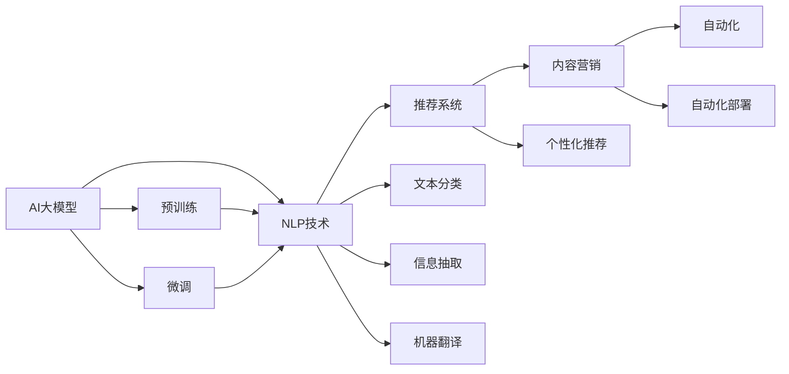

                 

# AI大模型在电商平台内容营销自动化中的应用

> 关键词：AI大模型、内容营销、自动化、电商平台、自然语言处理(NLP)、推荐系统、模型微调、数据驱动

## 1. 背景介绍

随着互联网电商市场的快速增长，电商平台已成为品牌与消费者之间重要的互动窗口。其内容营销自动化程度直接影响用户体验和平台转化率，传统的搜索引擎优化(SEO)、邮件营销、社交媒体广告等手段已难以满足消费者对个性化、精准化信息的需求。而AI大模型的出现，为电商平台内容营销自动化带来了新的突破，通过高效自然语言处理(NLP)、推荐系统等技术，实现内容的自动生成、优化与个性化推荐，大大提升用户满意度和平台收益。

## 2. 核心概念与联系

### 2.1 核心概念概述

为更好地理解AI大模型在电商平台内容营销自动化中的应用，本节将介绍几个核心概念及其相互联系：

- **AI大模型(AI Large Model)**：即通过大规模数据预训练的深度学习模型，具备强大的泛化能力和学习潜力。如GPT、BERT、XLNet等。
- **自然语言处理(NLP)**：研究如何使计算机理解和生成自然语言的技术，包括文本分类、信息抽取、机器翻译等。
- **推荐系统(Recommendation System)**：根据用户行为、商品特征等，为用户推荐个性化内容的技术。
- **内容营销(Content Marketing)**：通过有价值的内容吸引、引导用户，并促进品牌与消费者互动的策略。
- **自动化(Automation)**：利用AI技术自动完成内容的生成、优化和推荐，提升营销效率和效果。

这些概念之间存在密切联系：AI大模型通过预训练获得丰富的语言知识，利用NLP技术生成和理解自然语言，结合推荐系统个性化推荐，最终通过自动化手段实现内容营销的目标。下面通过一个Mermaid流程图来展示它们之间的关系：



## 3. 核心算法原理 & 具体操作步骤

### 3.1 算法原理概述

基于AI大模型的电商平台内容营销自动化，主要包括以下几个步骤：

1. **数据收集与预处理**：收集电商平台的用户行为数据、商品描述、评论、用户反馈等，进行清洗、标注和标准化处理。
2. **大模型预训练**：使用大规模无标签文本数据对AI大模型进行预训练，获取通用的语言表示。
3. **模型微调**：针对特定内容营销任务，对预训练模型进行微调，优化模型性能。
4. **内容生成与推荐**：利用微调后的模型自动生成高质量内容，结合推荐系统进行个性化推荐，提升用户转化率。
5. **自动化部署与监测**：将模型和推荐系统集成到电商平台，实现自动化内容生成与推荐，并实时监测和优化。

### 3.2 算法步骤详解

**Step 1: 数据收集与预处理**

- **数据来源**：电商平台的用户行为数据、商品描述、评论、用户反馈等。
- **数据预处理**：数据清洗、去重、标准化、标注等，以适配后续模型训练。
- **数据划分**：划分为训练集、验证集和测试集，保证模型在未见数据上的泛化能力。

**Step 2: 大模型预训练**

- **预训练数据集**：选择合适的数据集，如Wikipedia、维基百科、在线新闻、商品描述等。
- **预训练模型**：使用Transformer架构的AI大模型，如GPT、BERT、XLNet等。
- **预训练任务**：选择掩码语言模型、自回归语言模型等任务，进行预训练。

**Step 3: 模型微调**

- **微调数据集**：根据具体任务选择标注数据集，如商品描述分类、用户评论情感分析、个性化推荐等。
- **微调模型**：对预训练模型进行微调，优化模型在特定任务上的性能。
- **微调目标**：如交叉熵损失、均方误差损失等，最小化模型预测与真实标签之间的差异。

**Step 4: 内容生成与推荐**

- **内容生成**：利用微调后的模型自动生成商品描述、广告文案、用户评论等。
- **个性化推荐**：结合用户行为数据和商品特征，生成个性化推荐内容。
- **优化与迭代**：通过A/B测试、用户反馈等手段不断优化内容生成和推荐策略。

**Step 5: 自动化部署与监测**

- **集成部署**：将内容生成与推荐系统集成到电商平台，实现自动化流程。
- **实时监测**：通过实时数据分析，监测模型性能和用户反馈，进行优化调整。

### 3.3 算法优缺点

基于AI大模型的电商平台内容营销自动化具有以下优点：

- **提升内容生成效率**：AI大模型可以自动生成高质量内容，大大提升内容创作的效率和规模。
- **增强推荐效果**：结合推荐系统，能够生成更加个性化、精准的推荐内容，提升用户满意度和转化率。
- **降低人工成本**：通过自动化处理，减少人工干预，降低内容营销的人力成本。
- **快速响应变化**：模型能够实时学习和适应用户行为变化，快速更新推荐内容，提升平台的竞争力。

但该方法也存在以下缺点：

- **数据依赖性强**：模型的效果很大程度上依赖于数据的质量和量，获取高质量标注数据的成本较高。
- **泛化能力有限**：对于新领域或长尾商品，预训练模型可能无法很好地适应，微调效果有限。
- **模型复杂度高**：AI大模型参数量巨大，推理速度较慢，计算资源需求高。
- **可解释性差**：AI大模型通常被视为"黑盒"，难以解释内部决策过程，不利于理解和管理。

尽管存在这些局限性，AI大模型在电商平台内容营销自动化中仍展现出巨大的潜力和应用前景。未来相关研究将重点放在如何优化模型结构、提升数据处理效率、增强模型解释性等方面。

### 3.4 算法应用领域

AI大模型在电商平台内容营销自动化中的应用，已广泛应用于以下多个领域：

- **商品描述生成**：自动生成商品描述，提升商品展示效果和用户体验。
- **广告文案创作**：自动创作高质量广告文案，提升广告点击率和转化率。
- **个性化推荐**：根据用户行为和商品特征，生成个性化推荐内容，提高用户满意度。
- **用户评论生成**：自动生成用户评论，促进社区互动和内容丰富度。
- **搜索优化**：自动优化搜索引擎关键词，提升搜索排名和用户满意度。

除了以上应用外，AI大模型还可应用于商品评价、问答、客服等环节，为电商平台提供全方位的智能化服务。

## 4. 数学模型和公式 & 详细讲解 & 举例说明

### 4.1 数学模型构建

在电商平台内容营销自动化中，常用的数学模型包括文本分类、情感分析、推荐系统等。下面以文本分类为例，介绍模型的数学构建和推导。

设电商平台商品描述为 $\text{x} \in \mathbb{R}^d$，类别标签为 $y \in \{1,2,...,k\}$。文本分类的目标是将商品描述分类到正确的类别。常用的模型包括全连接神经网络、卷积神经网络(CNN)、循环神经网络(RNN)等。

本文以Transformer模型为例，其输入和输出为：

$$
x_i \rightarrow h_i \rightarrow y
$$

其中 $h_i$ 表示模型在 $i$ 时刻的隐藏状态，$y$ 为模型预测的类别标签。

### 4.2 公式推导过程

Transformer模型的数学推导过程比较复杂，但关键步骤包括自注意力机制、多头注意力机制、位置编码等。这里以Transformer的编码器结构为例，介绍其基本原理。

Transformer的编码器由多个自注意力层和前馈神经网络层组成，每个自注意力层包含3个子层：

1. **查询-键-值注意力机制**：计算自注意力权重，对输入进行加权求和，输出自注意力结果。

$$
\text{Q}_i = \text{W}_Q \text{x}_i
$$

$$
\text{K}_i = \text{W}_K \text{x}_i
$$

$$
\text{V}_i = \text{W}_V \text{x}_i
$$

$$
\text{Attention}_i = \text{softmax}(\frac{\text{Q}_i \text{K}_i^T}{\sqrt{d_k}})
$$

$$
\text{C}_i = \text{Attention}_i \text{V}_i
$$

2. **多头注意力机制**：将多个查询-键-值注意力层的输出进行拼接，增强模型的表征能力。

$$
\text{H}_i = [\text{C}_i, \text{C}_{i-1}, ..., \text{C}_{i-k}]
$$

3. **位置编码**：加入位置编码，引入时间信息，提高模型的语义理解能力。

$$
\text{x}_i = \text{Attention}_i + \text{PositionalEncoding}_i
$$

### 4.3 案例分析与讲解

假设某电商平台有 $k=3$ 类商品：服装、电子产品、书籍。收集到 $N$ 个商品描述 $\text{x}_i$，将其进行标注 $y_i \in \{1,2,3\}$。

首先，将商品描述转换为词向量 $\text{x}_i \rightarrow \text{TokenEmbedding}$，并通过嵌入矩阵 $\text{W}_Q, \text{W}_K, \text{W}_V$ 进行线性变换，得到查询向量 $\text{Q}_i$、键向量 $\text{K}_i$ 和值向量 $\text{V}_i$。

然后，计算自注意力权重 $\text{Attention}_i$，对值向量进行加权求和得到自注意力结果 $\text{C}_i$。

接着，通过多头注意力机制将多个自注意力层的输出拼接得到隐藏状态 $\text{H}_i$，并加入位置编码 $\text{PositionalEncoding}_i$。

最后，通过全连接层 $\text{W}_O$ 进行分类，输出预测结果 $\text{y}_i$。

整个过程中，Transformer模型通过自注意力机制捕捉商品描述中的关键信息，通过位置编码引入时间信息，通过多头注意力机制增强模型的表征能力，最终通过全连接层进行分类，得到商品分类的预测结果。

## 5. 项目实践：代码实例和详细解释说明

### 5.1 开发环境搭建

在进行电商平台内容营销自动化开发前，我们需要准备好开发环境。以下是使用Python进行PyTorch开发的环境配置流程：

1. 安装Anaconda：从官网下载并安装Anaconda，用于创建独立的Python环境。

2. 创建并激活虚拟环境：
```bash
conda create -n pytorch-env python=3.8 
conda activate pytorch-env
```

3. 安装PyTorch：根据CUDA版本，从官网获取对应的安装命令。例如：
```bash
conda install pytorch torchvision torchaudio cudatoolkit=11.1 -c pytorch -c conda-forge
```

4. 安装Transformers库：
```bash
pip install transformers
```

5. 安装各类工具包：
```bash
pip install numpy pandas scikit-learn matplotlib tqdm jupyter notebook ipython
```

完成上述步骤后，即可在`pytorch-env`环境中开始开发实践。

### 5.2 源代码详细实现

下面我们以电商平台商品描述分类任务为例，给出使用Transformers库对BERT模型进行微调的PyTorch代码实现。

首先，定义商品描述分类任务的数据处理函数：

```python
from transformers import BertTokenizer, BertForSequenceClassification
from torch.utils.data import Dataset
import torch

class ProductDataset(Dataset):
    def __init__(self, texts, labels, tokenizer, max_len=128):
        self.texts = texts
        self.labels = labels
        self.tokenizer = tokenizer
        self.max_len = max_len
        
    def __len__(self):
        return len(self.texts)
    
    def __getitem__(self, item):
        text = self.texts[item]
        label = self.labels[item]
        
        encoding = self.tokenizer(text, return_tensors='pt', max_length=self.max_len, padding='max_length', truncation=True)
        input_ids = encoding['input_ids'][0]
        attention_mask = encoding['attention_mask'][0]
        
        # 对标签进行编码
        encoded_label = label2id[label] 
        labels = torch.tensor(encoded_label, dtype=torch.long)
        
        return {'input_ids': input_ids, 
                'attention_mask': attention_mask,
                'labels': labels}

# 标签与id的映射
label2id = {'服装': 0, '电子产品': 1, '书籍': 2, '其它': 3}
id2label = {v: k for k, v in label2id.items()}

# 创建dataset
tokenizer = BertTokenizer.from_pretrained('bert-base-cased')

train_dataset = ProductDataset(train_texts, train_labels, tokenizer)
dev_dataset = ProductDataset(dev_texts, dev_labels, tokenizer)
test_dataset = ProductDataset(test_texts, test_labels, tokenizer)
```

然后，定义模型和优化器：

```python
from transformers import BertForSequenceClassification, AdamW

model = BertForSequenceClassification.from_pretrained('bert-base-cased', num_labels=len(label2id))

optimizer = AdamW(model.parameters(), lr=2e-5)
```

接着，定义训练和评估函数：

```python
from torch.utils.data import DataLoader
from tqdm import tqdm
from sklearn.metrics import classification_report

device = torch.device('cuda') if torch.cuda.is_available() else torch.device('cpu')
model.to(device)

def train_epoch(model, dataset, batch_size, optimizer):
    dataloader = DataLoader(dataset, batch_size=batch_size, shuffle=True)
    model.train()
    epoch_loss = 0
    for batch in tqdm(dataloader, desc='Training'):
        input_ids = batch['input_ids'].to(device)
        attention_mask = batch['attention_mask'].to(device)
        labels = batch['labels'].to(device)
        model.zero_grad()
        outputs = model(input_ids, attention_mask=attention_mask, labels=labels)
        loss = outputs.loss
        epoch_loss += loss.item()
        loss.backward()
        optimizer.step()
    return epoch_loss / len(dataloader)

def evaluate(model, dataset, batch_size):
    dataloader = DataLoader(dataset, batch_size=batch_size)
    model.eval()
    preds, labels = [], []
    with torch.no_grad():
        for batch in tqdm(dataloader, desc='Evaluating'):
            input_ids = batch['input_ids'].to(device)
            attention_mask = batch['attention_mask'].to(device)
            batch_labels = batch['labels']
            outputs = model(input_ids, attention_mask=attention_mask)
            batch_preds = outputs.logits.argmax(dim=2).to('cpu').tolist()
            batch_labels = batch_labels.to('cpu').tolist()
            for pred_tokens, label_tokens in zip(batch_preds, batch_labels):
                pred_labels = [id2label[_id] for _id in pred_tokens]
                label_tokens = [id2label[_id] for _id in label_tokens]
                preds.append(pred_labels[:len(label_tokens)])
                labels.append(label_tokens)
                
    print(classification_report(labels, preds))
```

最后，启动训练流程并在测试集上评估：

```python
epochs = 5
batch_size = 16

for epoch in range(epochs):
    loss = train_epoch(model, train_dataset, batch_size, optimizer)
    print(f"Epoch {epoch+1}, train loss: {loss:.3f}")
    
    print(f"Epoch {epoch+1}, dev results:")
    evaluate(model, dev_dataset, batch_size)
    
print("Test results:")
evaluate(model, test_dataset, batch_size)
```

以上就是使用PyTorch对BERT进行电商平台商品描述分类任务微调的完整代码实现。可以看到，得益于Transformers库的强大封装，我们可以用相对简洁的代码完成BERT模型的加载和微调。

### 5.3 代码解读与分析

让我们再详细解读一下关键代码的实现细节：

**ProductDataset类**：
- `__init__`方法：初始化文本、标签、分词器等关键组件。
- `__len__`方法：返回数据集的样本数量。
- `__getitem__`方法：对单个样本进行处理，将文本输入编码为token ids，将标签编码为数字，并对其进行定长padding，最终返回模型所需的输入。

**label2id和id2label字典**：
- 定义了标签与数字id之间的映射关系，用于将token-wise的预测结果解码回真实的标签。

**训练和评估函数**：
- 使用PyTorch的DataLoader对数据集进行批次化加载，供模型训练和推理使用。
- 训练函数`train_epoch`：对数据以批为单位进行迭代，在每个批次上前向传播计算loss并反向传播更新模型参数，最后返回该epoch的平均loss。
- 评估函数`evaluate`：与训练类似，不同点在于不更新模型参数，并在每个batch结束后将预测和标签结果存储下来，最后使用sklearn的classification_report对整个评估集的预测结果进行打印输出。

**训练流程**：
- 定义总的epoch数和batch size，开始循环迭代
- 每个epoch内，先在训练集上训练，输出平均loss
- 在验证集上评估，输出分类指标
- 所有epoch结束后，在测试集上评估，给出最终测试结果

可以看到，PyTorch配合Transformers库使得BERT微调的代码实现变得简洁高效。开发者可以将更多精力放在数据处理、模型改进等高层逻辑上，而不必过多关注底层的实现细节。

当然，工业级的系统实现还需考虑更多因素，如模型的保存和部署、超参数的自动搜索、更灵活的任务适配层等。但核心的微调范式基本与此类似。

## 6. 实际应用场景

### 6.1 智能客服系统

基于AI大模型的智能客服系统，能够自动理解用户咨询，生成个性化的回答，并实时更新知识库。对于电商平台来说，利用智能客服系统，可以大幅度提升用户满意度，减少人力成本。

在技术实现上，可以收集客服对话数据，将其进行标注，作为微调数据。利用微调后的模型自动生成客服回答，并通过对话管理引擎，实现自然语言理解和生成。

### 6.2 个性化推荐系统

电商平台通过个性化推荐系统，能够为用户推荐符合其兴趣的商品，提高用户购买率。利用AI大模型对用户行为数据进行建模，生成高质量的推荐内容。

在微调过程中，可以收集用户的浏览、点击、评价等行为数据，将其转化为模型输入。同时，通过用户反馈不断优化模型，生成更加个性化的推荐内容。

### 6.3 商品评价分析

商品评价分析是电商平台监控商品质量的重要手段。利用AI大模型对用户评价进行分类和情感分析，可以及时发现问题商品，优化商品质量。

在微调过程中，可以收集用户对商品的质量评价、满意度等文本数据，进行情感分析分类。利用分类结果，识别出质量问题商品，并及时采取措施。

### 6.4 未来应用展望

随着AI大模型的不断发展，其应用于电商平台内容营销自动化的潜力将进一步释放。未来，AI大模型将融合更多前沿技术，如因果推理、强化学习等，为电商平台带来更多智能化应用。

1. **多模态融合**：结合文本、图片、视频等多模态数据，提升推荐内容的丰富度和多样性。
2. **自适应推荐**：利用强化学习技术，实时调整推荐策略，优化用户体验。
3. **跨平台协同**：整合多个平台的数据和推荐系统，提升跨平台内容营销的效果。
4. **深度情感分析**：结合深度学习技术，实现更准确的情感分类和情感预测。
5. **动态内容生成**：利用生成对抗网络(GAN)等技术，自动生成高质量的动态内容，提升用户体验。

这些应用将使AI大模型在电商平台内容营销自动化中发挥更大的作用，为消费者提供更加精准、个性化、高满意度的服务体验。

## 7. 工具和资源推荐

### 7.1 学习资源推荐

为了帮助开发者系统掌握AI大模型在电商平台内容营销自动化的理论基础和实践技巧，这里推荐一些优质的学习资源：

1. **《深度学习》书籍**：Ian Goodfellow等人所著，系统介绍了深度学习的理论基础和实际应用，涵盖NLP、推荐系统等多个领域。
2. **《自然语言处理入门》书籍**：斯坦福大学Yoav Goldberg所著，全面介绍了NLP的核心概念和技术，从文本预处理到深度学习模型，循序渐进。
3. **CS229《机器学习》课程**：斯坦福大学Andrew Ng等人开设的机器学习经典课程，深入浅出地介绍了机器学习理论和技术，涵盖了回归、分类、聚类等多个主题。
4. **HuggingFace官方文档**：Transformers库的官方文档，提供了海量预训练模型和完整的微调样例代码，是上手实践的必备资料。
5. **Kaggle竞赛**：参与Kaggle的NLP和推荐系统竞赛，实际应用所学知识，提升技能。

通过对这些资源的学习实践，相信你一定能够快速掌握AI大模型在电商平台内容营销自动化的精髓，并用于解决实际的NLP问题。

### 7.2 开发工具推荐

高效的开发离不开优秀的工具支持。以下是几款用于AI大模型在电商平台内容营销自动化开发的常用工具：

1. **Jupyter Notebook**：交互式编程环境，支持Python代码的运行和结果展示，适合快速迭代开发。
2. **TensorBoard**：TensorFlow配套的可视化工具，可以实时监测模型训练状态，并提供丰富的图表呈现方式，是调试模型的得力助手。
3. **PyTorch Lightning**：基于PyTorch的模型训练框架，支持自动化的超参数搜索和模型部署，适合大规模模型训练和应用。
4. **TorchServe**：PyTorch的模型服务框架，可以将训练好的模型部署为Web服务，方便API调用和集成。
5. **AWS SageMaker**：亚马逊提供的云服务，支持AI模型的训练、部署和优化，提供强大的弹性计算资源和可视化工具。

合理利用这些工具，可以显著提升AI大模型在电商平台内容营销自动化的开发效率，加快创新迭代的步伐。

### 7.3 相关论文推荐

AI大模型和电商平台内容营销自动化的发展源于学界的持续研究。以下是几篇奠基性的相关论文，推荐阅读：

1. **Attention is All You Need**：提出Transformer结构，开启了NLP领域的预训练大模型时代。

2. **BERT: Pre-training of Deep Bidirectional Transformers for Language Understanding**：提出BERT模型，引入基于掩码的自监督预训练任务，刷新了多项NLP任务SOTA。

3. **E-commerce Trusted Product Recommendation with Natural Language**：利用NLP技术对用户评论进行情感分析，生成个性化推荐内容，提升电商平台的推荐效果。

4. **An Efficient Neural Text Classification Model for E-commerce Product Descriptions**：提出基于Transformer的商品描述分类模型，显著提升了电商平台的商品信息质量。

5. **A Survey on Deep Learning for Recommendation Systems**：系统回顾了深度学习在推荐系统中的应用，包括基于文本、图像、知识图谱等多模态推荐方法。

这些论文代表了大模型和电商平台内容营销自动化的发展脉络。通过学习这些前沿成果，可以帮助研究者把握学科前进方向，激发更多的创新灵感。

## 8. 总结：未来发展趋势与挑战

### 8.1 总结

本文对AI大模型在电商平台内容营销自动化的应用进行了全面系统的介绍。首先阐述了AI大模型和电商平台内容营销自动化的研究背景和意义，明确了内容营销自动化在电商平台的重要性。其次，从原理到实践，详细讲解了AI大模型的预训练、微调、应用流程，给出了完整的代码实例和分析。同时，本文还广泛探讨了AI大模型在智能客服、个性化推荐、商品评价等多个电商应用中的具体实现。

通过本文的系统梳理，可以看到，AI大模型在电商平台内容营销自动化中展现了强大的潜力和应用前景。其通过高效自然语言处理、推荐系统等技术，实现了内容的自动生成、优化与个性化推荐，提升了用户满意度和平台转化率，展示了AI大模型在电商领域的广泛应用。

### 8.2 未来发展趋势

展望未来，AI大模型在电商平台内容营销自动化将呈现以下几个发展趋势：

1. **模型规模持续增大**：预训练语言模型的参数量将持续增长，超大规模语言模型蕴含的丰富语言知识，有望支撑更加复杂多变的下游任务。
2. **微调方法日趋多样**：开发更多参数高效的微调方法，如Adapter、Prefix等，在固定大部分预训练参数的同时，只更新极少量的任务相关参数。
3. **多模态融合**：结合文本、图片、视频等多模态数据，提升推荐内容的丰富度和多样性。
4. **自适应推荐**：利用强化学习技术，实时调整推荐策略，优化用户体验。
5. **动态内容生成**：利用生成对抗网络(GAN)等技术，自动生成高质量的动态内容，提升用户体验。

这些趋势将进一步推动AI大模型在电商平台内容营销自动化中的应用，为消费者提供更加精准、个性化、高满意度的服务体验。

### 8.3 面临的挑战

尽管AI大模型在电商平台内容营销自动化中展现出巨大的潜力和应用前景，但在迈向更加智能化、普适化应用的过程中，仍面临诸多挑战：

1. **数据依赖性强**：模型的效果很大程度上依赖于数据的质量和量，获取高质量标注数据的成本较高。
2. **泛化能力有限**：对于新领域或长尾商品，预训练模型可能无法很好地适应，微调效果有限。
3. **模型鲁棒性不足**：模型面对域外数据时，泛化性能往往大打折扣。
4. **计算资源需求高**：超大规模语言模型推理速度较慢，计算资源需求高。
5. **可解释性差**：AI大模型通常被视为"黑盒"，难以解释内部决策过程。

尽管存在这些局限性，AI大模型在电商平台内容营销自动化中仍展现出巨大的潜力和应用前景。未来相关研究需要在模型优化、数据处理、资源优化、解释性增强等方面进行突破。

### 8.4 研究展望

面对AI大模型在电商平台内容营销自动化所面临的挑战，未来的研究需要在以下几个方面寻求新的突破：

1. **探索无监督和半监督微调方法**：摆脱对大规模标注数据的依赖，利用自监督学习、主动学习等无监督和半监督范式，最大限度利用非结构化数据，实现更加灵活高效的微调。
2. **研究参数高效和计算高效的微调范式**：开发更加参数高效的微调方法，在固定大部分预训练参数的同时，只更新极少量的任务相关参数。
3. **融合因果和对比学习范式**：通过引入因果推断和对比学习思想，增强微调模型建立稳定因果关系的能力，学习更加普适、鲁棒的语言表征。
4. **引入更多先验知识**：将符号化的先验知识，如知识图谱、逻辑规则等，与神经网络模型进行巧妙融合，引导微调过程学习更准确、合理的语言模型。
5. **结合因果分析和博弈论工具**：将因果分析方法引入微调模型，识别出模型决策的关键特征，增强输出解释的因果性和逻辑性。

这些研究方向的探索，必将引领AI大模型在电商平台内容营销自动化技术迈向更高的台阶，为构建安全、可靠、可解释、可控的智能系统铺平道路。面向未来，AI大模型和电商平台内容营销自动化的研究需要不断探索和创新，共同推动自然语言理解和智能交互系统的进步。

## 9. 附录：常见问题与解答

**Q1：AI大模型在电商平台内容营销自动化是否需要标注数据？**

A: AI大模型在电商平台内容营销自动化中，通常需要标注数据进行微调。标注数据的质量和数量会直接影响模型效果。尽管无监督和半监督学习技术在逐步发展，但目前标注数据的获取仍然是获取高质量模型的一个关键步骤。

**Q2：如何选择合适的标注数据集？**

A: 标注数据集的选择应考虑电商平台的业务特点和用户需求。可以参考用户的购买行为、浏览记录、评价等信息，选择与业务相关的标注数据集。同时，标注数据集的规模应尽量大，以提高模型的泛化能力。

**Q3：微调过程中如何处理长尾商品？**

A: 对于长尾商品，可以利用多任务学习等技术，结合多个相关的标注数据集进行微调，提高模型的泛化能力。同时，可以设计更加多样化的标注任务，涵盖更多长尾商品的特征，提升模型对长尾商品的识别能力。

**Q4：如何应对域外数据带来的泛化问题？**

A: 可以使用对抗样本生成、数据增强等技术，提高模型对域外数据的鲁棒性。同时，可以设计多语言训练等技术，提升模型对不同语言环境下的泛化能力。

**Q5：如何优化计算资源消耗？**

A: 可以通过梯度累积、混合精度训练等技术，优化模型的计算效率。同时，可以采用模型裁剪、模型压缩等技术，减小模型的参数量和计算量，提高推理速度。

这些技术结合使用，可以显著提升AI大模型在电商平台内容营销自动化的计算效率，降低资源消耗。

**Q6：如何提升模型解释性？**

A: 可以通过特征重要性分析、部分可解释模型等技术，提升模型的可解释性。同时，可以结合符号化的先验知识，增强模型的解释性，使其能够更好地应用于电商平台的实际场景中。

---

作者：禅与计算机程序设计艺术 / Zen and the Art of Computer Programming

