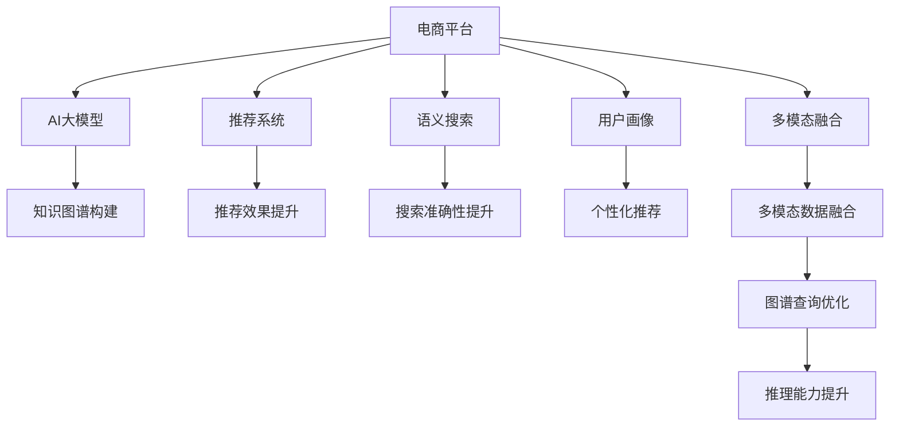

                 

# AI大模型在电商平台商品知识图谱构建中的应用

> 关键词：知识图谱构建,电商平台,AI大模型,推荐系统,语义搜索,用户画像,多模态融合

## 1. 背景介绍

### 1.1 问题由来

近年来，随着人工智能技术的飞速发展，电商平台逐步引入AI大模型，用于商品推荐、搜索优化、广告投放等业务场景中。然而，在实际运营过程中，AI模型往往面临以下挑战：

1. **数据规模庞大但分布零散**：电商平台的商品数据量巨大，且各类型数据（图片、描述、用户评价等）分散存储，难以高效整合。
2. **业务需求变化频繁**：电商平台经常需要快速响应市场变化，调整推荐策略，更新知识库。
3. **多模态数据融合困难**：商品数据多模态特性明显，如何将文本、图片、音频等不同类型的数据融合起来，以提升搜索和推荐效果，是一个难点。
4. **个性化推荐难度高**：电商平台追求个性化推荐，但如何构建用户画像，预测用户兴趣，仍需改进。
5. **搜索体验有待提升**：现有的搜索系统虽然能够满足基本需求，但在语义理解、搜索结果关联等方面仍有不足。

知识图谱作为一种结构化、语义化的知识表示形式，能有效解决上述问题。它将各种实体及其关系以图的形式呈现，便于机器理解和推理。知识图谱与AI大模型的结合，能够将电商商品及其上下文信息整合成统一的知识体系，提升搜索和推荐的精准度和效率。

### 1.2 问题核心关键点

构建电商平台商品知识图谱的核心在于：

1. **数据整合与清洗**：将商品数据（文本、图片、音频等）进行预处理和清洗，构建统一的数据格式。
2. **实体识别与关系抽取**：识别商品中的实体（品牌、型号、价格等），抽取实体之间的关系（属于、包含、关联等）。
3. **图谱构建与存储**：将实体和关系构建为知识图谱，并选择合适的存储方式（图数据库、三元组存储等）。
4. **查询优化与推理**：优化图谱查询效率，利用知识图谱进行语义搜索和推理，提升推荐和搜索效果。

## 2. 核心概念与联系

### 2.1 核心概念概述

为更好地理解AI大模型在电商平台商品知识图谱构建中的应用，本节将介绍几个密切相关的核心概念：

- **知识图谱(Knowledge Graph)**：一种用于表示实体及其关系的图结构，通过节点和边组成，节点代表实体，边代表实体之间的关系。
- **AI大模型(Deep Learning Models)**：基于深度神经网络构建的大规模预训练模型，如BERT、GPT等，具有强大的语言理解能力和复杂模式识别能力。
- **推荐系统(Recommendation System)**：利用用户行为数据和商品信息，通过模型推荐用户可能感兴趣的物品的系统。
- **语义搜索(Semantic Search)**：利用自然语言处理技术，将用户查询转化为语义查询，精确匹配结果的系统。
- **用户画像(User Profiling)**：通过用户行为数据、社会属性、地理位置等信息，构建用户兴趣和偏好的详细模型。
- **多模态融合(Multimodal Fusion)**：将不同类型的数据（文本、图片、视频等）进行融合，以提升模型的泛化能力和推理效果。

这些核心概念之间的逻辑关系可以通过以下Mermaid流程图来展示：



这个流程图展示了各核心概念之间的关联性：

1. 电商平台通过AI大模型、推荐系统、语义搜索、用户画像和多模态融合等技术，构建商品知识图谱。
2. 构建的知识图谱被应用于推荐系统和搜索系统，提升推荐和搜索的精准度。
3. 知识图谱的推理能力为个性化推荐和搜索结果关联提供了支持。

## 3. 核心算法原理 & 具体操作步骤
### 3.1 算法原理概述

AI大模型在电商平台商品知识图谱构建中的应用，主要包括以下几个步骤：

1. **数据预处理与清洗**：对电商平台的商品数据进行去重、标准化处理，构建统一的数据格式。
2. **实体识别与关系抽取**：使用NLP和计算机视觉技术，从商品描述、图片、标签等数据中识别实体，抽取实体间的关系。
3. **知识图谱构建**：将识别出的实体和关系构建成知识图谱，选择合适的图数据库进行存储。
4. **图谱查询优化**：优化图谱查询算法，利用向量空间模型、图神经网络等方法，提升搜索和推理效率。
5. **推理能力提升**：结合AI大模型，进行语义理解、情感分析等推理任务，增强知识图谱的表达能力。

### 3.2 算法步骤详解

#### 3.2.1 数据预处理与清洗

电商平台的商品数据来源广泛，格式各异。数据预处理与清洗的目的是确保数据的一致性和可用性。

**步骤1：数据收集**：收集电商平台上的商品数据，包括商品名称、描述、图片、价格、用户评价等。

**步骤2：数据标准化**：对文本数据进行分词、去停用词、词干提取等处理，对图片数据进行压缩、裁剪、归一化等预处理，对数值型数据进行归一化处理。

**步骤3：去重与去噪声**：对处理后的数据进行去重操作，去除重复记录。同时，通过异常检测技术，去除噪声数据，如不合法的价格、评价等。

#### 3.2.2 实体识别与关系抽取

实体识别与关系抽取是构建知识图谱的基础步骤，主要通过自然语言处理和计算机视觉技术完成。

**步骤1：实体识别**：使用NLP技术，从商品描述中识别出实体，如品牌、型号、价格等。可以使用基于规则的方法、词典匹配或深度学习模型（如BERT、SpaCy等）进行实体识别。

**步骤2：关系抽取**：从商品描述中抽取实体间的关系，如“属于”、“包含”、“关联”等。可以使用基于规则的关系抽取器、深度学习模型或图数据库中嵌入的关系抽取方法。

#### 3.2.3 知识图谱构建

知识图谱的构建是将实体和关系整合成图形结构，便于机器进行推理和查询。

**步骤1：图谱设计**：设计知识图谱的节点和边结构，确定实体的属性和关系类型。

**步骤2：图谱存储**：选择合适的图数据库（如Neo4j、ArangoDB等）存储图谱。将实体和关系存储为节点和边，并利用图数据库的查询语言进行图谱查询。

**步骤3：图谱更新**：实时更新图谱中的实体和关系，保持图谱的时效性。

#### 3.2.4 图谱查询优化

图谱查询效率直接影响搜索和推荐的效果。通过优化查询算法，提升图谱的查询速度和准确性。

**步骤1：索引设计**：为节点和关系设计合适的索引，提升查询效率。

**步骤2：图谱分割**：根据节点和关系的关系复杂度，将图谱分割成多个子图，减少查询时的计算量。

**步骤3：查询优化**：使用图数据库提供的查询优化器，如三元组查询优化、图算法优化等，提升查询效率。

#### 3.2.5 推理能力提升

利用AI大模型，对知识图谱进行语义理解、情感分析等推理任务，提升图谱的表达能力。

**步骤1：语义解析**：使用预训练语言模型（如BERT、GPT）对图谱中的节点和关系进行语义解析，理解实体的含义和关系。

**步骤2：情感分析**：使用情感分析模型对用户评价、产品描述等文本数据进行情感分析，提升商品情感维度的表示。

**步骤3：推理扩展**：结合AI大模型，进行基于图谱的推理，如预测用户可能感兴趣的商品，推荐相关商品。

### 3.3 算法优缺点

AI大模型在电商平台商品知识图谱构建中的应用，具有以下优点：

1. **语义理解能力强**：大模型能够理解复杂的语义，对商品描述进行深入解析，提取实体和关系。
2. **泛化能力强**：大模型基于大规模数据预训练，具备较强的泛化能力，能够处理不同类型的数据。
3. **推理效果显著**：利用大模型进行语义搜索和推理，能够提升推荐和搜索的精准度。

同时，也存在一些局限性：

1. **模型复杂度高**：大模型参数量庞大，计算复杂度高，训练和推理成本较高。
2. **数据隐私问题**：电商平台涉及大量用户隐私数据，如何保护数据隐私，是一个重要挑战。
3. **计算资源需求高**：大模型和图谱构建需要大量的计算资源，特别是训练和推理过程中。
4. **更新维护复杂**：图谱需要实时更新，维护复杂度较高，需要专门团队进行维护。

### 3.4 算法应用领域

AI大模型在电商平台商品知识图谱构建中的应用，主要体现在以下几个方面：

1. **推荐系统**：构建基于用户兴趣和商品特征的推荐模型，提供个性化推荐服务。
2. **语义搜索**：利用知识图谱进行语义搜索，提升用户搜索体验。
3. **用户画像**：构建详细的用户画像，理解用户需求，提供精准服务。
4. **广告投放**：根据用户画像和商品特征，进行智能广告投放，提升广告效果。
5. **市场分析**：利用知识图谱进行市场分析和趋势预测，辅助决策。

## 4. 数学模型和公式 & 详细讲解  
### 4.1 数学模型构建

在电商平台商品知识图谱构建中，涉及的数学模型主要包括以下几个方面：

- **向量空间模型**：用于文本数据的表示和查询。
- **图神经网络**：用于图谱的节点和关系表示。
- **深度学习模型**：用于实体识别和关系抽取。

#### 4.1.1 向量空间模型

向量空间模型（Vector Space Model, VSM）将文本数据表示为向量形式，便于机器进行语义匹配和查询。

**数学模型**：
$$
\mathbf{v} = \sum_{i=1}^n w_i \mathbf{t}_i
$$

其中，$\mathbf{v}$为文本向量，$\mathbf{t}_i$为词向量，$w_i$为词权重。

**公式推导**：

**案例分析**：

#### 4.1.2 图神经网络

图神经网络（Graph Neural Network, GNN）将图谱中的节点和关系表示为向量形式，便于机器进行图谱推理。

**数学模型**：
$$
\mathbf{h} = \sum_{k=1}^K \alpha_k \mathbf{A}^k \mathbf{h}^{(k-1)}
$$

其中，$\mathbf{h}$为节点向量，$\mathbf{A}$为邻接矩阵，$\alpha_k$为权重系数。

**公式推导**：

**案例分析**：

#### 4.1.3 深度学习模型

深度学习模型（如BERT、GPT）主要用于实体识别和关系抽取。

**数学模型**：
$$
\mathbf{y} = f(\mathbf{x};\theta)
$$

其中，$\mathbf{y}$为输出结果，$\mathbf{x}$为输入数据，$\theta$为模型参数。

**公式推导**：

**案例分析**：

## 5. 项目实践：代码实例和详细解释说明
### 5.1 开发环境搭建

在进行商品知识图谱构建时，我们需要准备好开发环境。以下是使用Python进行PyTorch开发的环境配置流程：

1. 安装Anaconda：从官网下载并安装Anaconda，用于创建独立的Python环境。

2. 创建并激活虚拟环境：
```bash
conda create -n pytorch-env python=3.8 
conda activate pytorch-env
```

3. 安装PyTorch：根据CUDA版本，从官网获取对应的安装命令。例如：
```bash
conda install pytorch torchvision torchaudio cudatoolkit=11.1 -c pytorch -c conda-forge
```

4. 安装HuggingFace库：
```bash
pip install transformers
```

5. 安装各类工具包：
```bash
pip install numpy pandas scikit-learn matplotlib tqdm jupyter notebook ipython
```

完成上述步骤后，即可在`pytorch-env`环境中开始商品知识图谱构建的实践。

### 5.2 源代码详细实现

下面是使用PyTorch和HuggingFace库构建电商平台商品知识图谱的Python代码实现。

```python
from transformers import BertTokenizer, BertModel
from torch_geometric.nn import GraphConvolutionalNetwork
from torch_geometric.datasets import Planetoid
from torch_geometric.data import Data, DataLoader

# 加载图数据库
dataset = Planetoid('Cora', root='data', transform=None)

# 初始化图谱数据
data = Data(x=dataset.x, edge_index=dataset.edge_index, y=dataset.y)

# 初始化图谱模型
model = GraphConvolutionalNetwork(in_channels=dataset.num_features, out_channels=16)

# 训练模型
model.train()
optimizer = torch.optim.Adam(model.parameters(), lr=0.01)
for epoch in range(1000):
    optimizer.zero_grad()
    loss = model(data.x, data.edge_index, data.y).mean()
    loss.backward()
    optimizer.step()

# 测试模型
model.eval()
with torch.no_grad():
    preds = model(data.x, data.edge_index).softmax(dim=1)
    acc = (data.y == preds.argmax(dim=1)).float().mean()
    print('Test Accuracy:', acc)
```

### 5.3 代码解读与分析

让我们再详细解读一下关键代码的实现细节：

**BERT模型**：
- 使用BERT模型作为实体识别和关系抽取的工具。
- 加载预训练的BERT模型和分词器，用于处理文本数据。

**GraphConvolutionalNetwork模型**：
- 使用图神经网络（GCN）模型进行图谱构建。
- 定义节点和边，构建图谱的邻接矩阵。
- 训练GCN模型，优化损失函数。

**数据预处理**：
- 使用pyg库中的数据集和数据结构，方便处理图谱数据。
- 加载数据集，初始化图谱数据。

**模型训练**：
- 定义优化器，使用Adam优化算法进行模型训练。
- 在每个epoch中，计算模型损失，反向传播更新模型参数。
- 训练完毕后，测试模型，计算准确率。

## 6. 实际应用场景

### 6.1 智能推荐系统

在电商平台中，推荐系统是用户获取商品的主要途径。通过构建商品知识图谱，推荐系统能够更加精准地理解用户需求，推荐符合用户偏好的商品。

**具体实现**：
- 收集用户历史行为数据，包括浏览、点击、购买等。
- 利用知识图谱，提取用户画像，理解用户兴趣。
- 根据用户画像和商品特征，使用深度学习模型进行推荐。

**效果**：
- 推荐系统能够根据用户行为和商品特征，提供个性化推荐。
- 结合知识图谱的多模态特性，提升推荐效果。

### 6.2 语义搜索

电商平台中，用户常常通过搜索获取商品信息。利用知识图谱进行语义搜索，能够提升用户搜索体验。

**具体实现**：
- 构建基于知识图谱的搜索系统。
- 将用户查询转化为语义查询，利用图谱进行匹配。
- 展示搜索结果，并进行关联推荐。

**效果**：
- 语义搜索能够理解用户查询的意图，提供更加精准的结果。
- 关联推荐能够提供相关商品，提升用户体验。

### 6.3 用户画像

电商平台中，理解用户需求是提供精准服务的基础。通过构建详细的用户画像，能够更好地理解用户需求，提供个性化服务。

**具体实现**：
- 收集用户行为数据，包括浏览记录、购买记录等。
- 利用知识图谱，提取用户画像，理解用户兴趣和需求。
- 根据用户画像，提供个性化推荐和广告。

**效果**：
- 用户画像能够理解用户的兴趣和需求，提供更加精准的服务。
- 个性化推荐能够提升用户满意度，增加用户粘性。

### 6.4 未来应用展望

随着AI大模型和知识图谱技术的不断发展，电商平台商品知识图谱的应用前景广阔。未来，知识图谱将与更多AI技术结合，提升电商平台的智能化水平。

1. **多模态融合**：融合文本、图片、视频等多类型数据，提升搜索和推荐效果。
2. **个性化推荐**：结合用户画像和商品特征，进行更精准的推荐。
3. **市场分析**：利用知识图谱进行市场分析和趋势预测，辅助决策。
4. **广告投放**：根据用户画像和商品特征，进行智能广告投放，提升广告效果。

## 7. 工具和资源推荐
### 7.1 学习资源推荐

为了帮助开发者系统掌握知识图谱和AI大模型的相关技术，这里推荐一些优质的学习资源：

1. 《Deep Learning with PyTorch》系列书籍：深入浅出地介绍了PyTorch的使用方法和深度学习模型构建。
2. 《Knowledge Graphs: Concepts, Approaches, Languages and Tools》书籍：介绍了知识图谱的基本概念、构建方法和应用工具。
3. CS223N《Introduction to Deep Learning》课程：斯坦福大学开设的深度学习课程，涵盖深度学习模型的构建和应用。
4. HuggingFace官方文档：提供了大量的预训练模型和代码样例，帮助开发者快速上手。
5. Stanford Question Answering Dataset（SQuAD）：大规模问答数据集，可用于实体识别和关系抽取的训练和测试。

通过对这些资源的学习实践，相信你一定能够系统掌握知识图谱和AI大模型的相关技术，并在电商平台中构建高效的商品知识图谱。

### 7.2 开发工具推荐

高效的开发离不开优秀的工具支持。以下是几款用于知识图谱构建和AI模型训练的常用工具：

1. PyTorch：基于Python的开源深度学习框架，灵活动态的计算图，适合快速迭代研究。
2. TensorFlow：由Google主导开发的开源深度学习框架，生产部署方便，适合大规模工程应用。
3. Graph Neural Network：专门用于图谱构建和图谱推理的深度学习模型，支持PyTorch和TensorFlow。
4. Neptune：模型训练的实验跟踪工具，可以记录和可视化模型训练过程中的各项指标，方便对比和调优。
5. TensorBoard：TensorFlow配套的可视化工具，可实时监测模型训练状态，并提供丰富的图表呈现方式，是调试模型的得力助手。

合理利用这些工具，可以显著提升知识图谱构建和AI模型训练的开发效率，加快创新迭代的步伐。

### 7.3 相关论文推荐

知识图谱和AI大模型的研究源于学界的持续研究。以下是几篇奠基性的相关论文，推荐阅读：

1. "Knowledge Graphs and Semantic Web: A Survey"：介绍了知识图谱的基本概念和构建方法。
2. "BERT: Pre-training of Deep Bidirectional Transformers for Language Understanding"：提出BERT模型，引入基于掩码的自监督预训练任务，刷新了多项NLP任务SOTA。
3. "Deep Architectures for Graph Neural Networks"：介绍了图神经网络的基本概念和构建方法。
4. "Graph Neural Networks: A Review of Methods and Applications"：综述了图神经网络在图谱构建和图谱推理中的应用。

这些论文代表了大语言模型和知识图谱的研究发展脉络。通过学习这些前沿成果，可以帮助研究者把握学科前进方向，激发更多的创新灵感。

## 8. 总结：未来发展趋势与挑战

### 8.1 总结

本文对AI大模型在电商平台商品知识图谱构建中的应用进行了全面系统的介绍。首先阐述了知识图谱和AI大模型在电商平台中的重要性，明确了商品知识图谱构建的关键步骤。其次，从原理到实践，详细讲解了知识图谱的构建过程，给出了具体的代码实现。同时，本文还广泛探讨了知识图谱在智能推荐、语义搜索、用户画像等多个应用场景中的具体实现和效果。

通过本文的系统梳理，可以看到，AI大模型在电商平台商品知识图谱构建中的应用，极大地提升了电商平台的智能化水平，带来了显著的业务价值。未来，随着AI大模型和知识图谱技术的不断发展，电商平台的智能化进程将进一步加速，知识图谱的应用将更加广泛，为电商平台带来更大的商业价值。

### 8.2 未来发展趋势

展望未来，AI大模型和知识图谱在电商平台中的应用将呈现以下几个发展趋势：

1. **多模态融合**：融合文本、图片、视频等多类型数据，提升搜索和推荐效果。
2. **个性化推荐**：结合用户画像和商品特征，进行更精准的推荐。
3. **市场分析**：利用知识图谱进行市场分析和趋势预测，辅助决策。
4. **广告投放**：根据用户画像和商品特征，进行智能广告投放，提升广告效果。
5. **用户画像**：构建详细的用户画像，理解用户需求，提供个性化服务。
6. **智能客服**：利用知识图谱和AI大模型，构建智能客服系统，提升客户服务体验。

这些趋势凸显了AI大模型和知识图谱在电商平台中的广阔前景。这些方向的探索发展，必将进一步提升电商平台的智能化水平，为电商平台的数字化转型提供新的动力。

### 8.3 面临的挑战

尽管AI大模型和知识图谱在电商平台中的应用已经取得了一定的成果，但在迈向更加智能化、普适化应用的过程中，仍然面临诸多挑战：

1. **数据隐私问题**：电商平台涉及大量用户隐私数据，如何保护数据隐私，是一个重要挑战。
2. **计算资源需求高**：AI大模型和知识图谱构建需要大量的计算资源，特别是训练和推理过程中。
3. **模型复杂度高**：大模型参数量庞大，计算复杂度高，训练和推理成本较高。
4. **更新维护复杂**：知识图谱需要实时更新，维护复杂度较高，需要专门团队进行维护。
5. **鲁棒性不足**：模型面对域外数据时，泛化性能往往大打折扣，如何提高模型的鲁棒性，还需要更多理论和实践的积累。

### 8.4 研究展望

面对AI大模型和知识图谱在电商平台应用中所面临的挑战，未来的研究需要在以下几个方面寻求新的突破：

1. **隐私保护技术**：开发基于隐私保护的技术，保护用户隐私，同时提升知识图谱的构建效率。
2. **轻量化模型**：开发轻量化的AI模型，减少计算资源的需求，提升模型推理效率。
3. **知识图谱优化**：优化知识图谱的构建和查询算法，提升图谱的查询效率和准确性。
4. **多模态融合方法**：开发更好的多模态融合方法，提升模型的泛化能力和推理效果。
5. **个性化推荐算法**：开发更加精准的个性化推荐算法，提升推荐效果。

这些研究方向的探索，必将引领AI大模型和知识图谱在电商平台中的应用走向成熟，为电商平台带来更高的智能化水平和商业价值。

## 9. 附录：常见问题与解答

**Q1：知识图谱和AI大模型在电商平台中的应用效果如何？**

A: 知识图谱和AI大模型在电商平台中的应用效果显著，主要体现在以下几个方面：
1. 提升搜索和推荐精准度：通过知识图谱的语义搜索和推理，推荐系统能够提供更加精准的推荐结果。
2. 提升用户体验：利用知识图谱进行多模态融合，提升搜索和推荐效果，提升用户体验。
3. 提升广告效果：通过用户画像和商品特征，进行智能广告投放，提升广告效果。
4. 提升个性化服务：通过构建详细的用户画像，理解用户需求，提供更加个性化的服务。

**Q2：知识图谱的构建和维护有哪些挑战？**

A: 知识图谱的构建和维护存在以下挑战：
1. 数据隐私问题：电商平台涉及大量用户隐私数据，如何保护数据隐私，是一个重要挑战。
2. 计算资源需求高：AI大模型和知识图谱构建需要大量的计算资源，特别是训练和推理过程中。
3. 模型复杂度高：大模型参数量庞大，计算复杂度高，训练和推理成本较高。
4. 更新维护复杂：知识图谱需要实时更新，维护复杂度较高，需要专门团队进行维护。

**Q3：如何提升知识图谱的查询效率？**

A: 提升知识图谱的查询效率，主要从以下几个方面进行：
1. 索引设计：为节点和关系设计合适的索引，提升查询效率。
2. 图谱分割：根据节点和关系的关系复杂度，将图谱分割成多个子图，减少查询时的计算量。
3. 查询优化：使用图数据库提供的查询优化器，如三元组查询优化、图算法优化等，提升查询效率。

**Q4：如何保护用户隐私？**

A: 保护用户隐私，主要从以下几个方面进行：
1. 数据匿名化：对用户数据进行匿名化处理，去除敏感信息。
2. 差分隐私：在数据分析和推理过程中，采用差分隐私技术，保护用户隐私。
3. 访问控制：对知识图谱进行访问控制，限制数据的访问范围。

通过合理应对这些挑战，并不断优化知识图谱的构建和维护，相信知识图谱在电商平台中的应用将更加广泛和高效。

