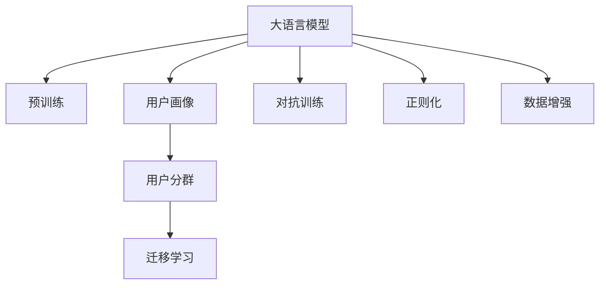

                 

# AI大模型在电商平台用户分群自动化中的应用

## 1. 背景介绍

随着互联网电商的蓬勃发展，电商平台需要具备更加精准的用户画像分析能力，以实现更加个性化、高效的推荐和营销策略。传统的用户画像构建方法依赖于人工标注和大量数据采集，不仅效率低下，准确性也难以保证。而通过AI大模型进行自动化用户分群，可以显著提升用户画像分析的效率和精准度。

### 1.1 问题由来

电商平台用户行为数据通常十分庞大且复杂，包括浏览记录、购买历史、搜索关键词、评价反馈等。构建完整、准确的用户画像，需要从这些数据中提取并学习用户特征，从而实现用户分群。传统的用户画像构建方法包括：

1. 基于规则的分群：通过设定特定的规则，如购买金额、停留时间、浏览频率等指标，对用户进行初步分群。这种方法易于实现，但依赖于人工规则设计，难以应对复杂多变的数据分布。

2. 基于聚类算法的分群：使用K-Means、层次聚类等算法对用户行为数据进行聚类，发现具有相似行为特征的用户群。这种方法对数据分布没有强假设，但容易陷入局部最优解，且对噪声数据敏感。

3. 基于深度学习模型的分群：使用神经网络模型对用户行为数据进行建模，提取用户特征并实现分群。这种方法具备强大的数据表达能力，能够自动学习高层次用户特征，但模型训练和调参复杂度高，对数据量和计算资源要求较高。

相较于传统方法，大模型自动化用户分群具有以下优势：

1. 数据依赖低：大模型基于海量的无标签数据预训练，能够自动学习用户行为模式和偏好，对数据标注的需求较低。

2. 处理能力高：大模型能够处理大规模高维数据，能够有效捕获用户行为特征的复杂性。

3. 自适应性强：大模型具备自适应学习的能力，能够灵活应对不同电商平台的用户行为特征，实现个性化分群。

### 1.2 问题核心关键点

大模型自动化用户分群的核心在于：

1. 如何利用大模型自动学习用户行为特征。
2. 如何将学习到的特征映射到用户分群标签。
3. 如何在实际应用场景中高效应用大模型进行自动化分群。

通过回答这些问题，可以构建出高效的电商平台用户分群系统。

## 2. 核心概念与联系

### 2.1 核心概念概述

为更好地理解大模型在电商平台用户分群中的应用，本节将介绍几个核心概念：

- **大语言模型(Large Language Model, LLM)**：以自回归(如GPT)或自编码(如BERT)模型为代表的大规模预训练语言模型。通过在大规模无标签文本语料上进行预训练，学习通用的语言表示，具备强大的语言理解和生成能力。

- **用户画像(User Profile)**：刻画用户行为特征的虚拟身份，通常包含用户的基本信息、行为偏好、购物习惯等。通过构建完整的用户画像，可以更好地实现个性化推荐和精准营销。

- **用户分群(User Segmentation)**：根据用户画像的不同特征，将用户分组，以便于精准定位、策略优化和行为预测。用户分群是电商平台个性化推荐和精准营销的基础。

- **迁移学习(Transfer Learning)**：指将一个领域学习到的知识，迁移应用到另一个不同但相关的领域的学习范式。大模型的预训练-微调过程即是一种典型的迁移学习方式。

- **对抗训练(Adversarial Training)**：引入对抗样本，提高模型鲁棒性，增强模型的泛化能力。对抗训练在大模型用户分群中的应用，可以提升模型对异常数据和噪声的抵抗能力。

- **正则化(Regularization)**：包括L2正则、Dropout、Early Stopping等，用于防止模型过拟合，增强模型的泛化能力。正则化在大模型用户分群中，可以避免模型在特定标签数据上的过拟合现象。

- **数据增强(Data Augmentation)**：通过对原始数据进行变换、扩充，提高数据样本的多样性，增强模型的泛化能力。数据增强在大模型用户分群中，可以增加训练数据的量，提高模型对数据的适应能力。

这些核心概念之间的逻辑关系可以通过以下Mermaid流程图来展示：



这个流程图展示了大语言模型与用户画像、用户分群等概念之间的联系，以及预训练、迁移学习、对抗训练等方法在大模型用户分群中的应用。

## 3. 核心算法原理 & 具体操作步骤
### 3.1 算法原理概述

大模型自动化用户分群的本质是通过大模型自动学习用户行为特征，并映射到用户分群标签的过程。其核心思想是：

1. **数据预处理**：收集电商平台的用户行为数据，并进行数据清洗、去重、归一化等预处理操作，以便于后续模型训练。
2. **特征提取**：利用大模型自动学习用户行为数据中的特征，提取高层次用户表示。
3. **标签映射**：将提取出的用户特征映射到预设的用户分群标签，实现用户自动分群。
4. **模型评估与优化**：在测试集上评估模型性能，并根据性能指标对模型进行调优，以提高用户分群的准确度和泛化能力。

### 3.2 算法步骤详解

基于大模型自动化用户分群的一般流程包括以下几个关键步骤：

**Step 1: 数据准备与预处理**
- 收集电商平台的用户行为数据，包括浏览记录、购买历史、搜索关键词、评价反馈等。
- 进行数据清洗，去除无效和异常数据。
- 对用户行为数据进行归一化、去重等预处理操作，以便于模型训练。

**Step 2: 特征提取**
- 利用预训练的大模型，对用户行为数据进行自动特征提取。
- 可以使用自回归模型（如GPT-3）或自编码模型（如BERT）作为特征提取器，学习用户行为特征。
- 在模型训练过程中，可以引入对抗训练、正则化等技术，提高模型的泛化能力和鲁棒性。

**Step 3: 标签映射**
- 根据预设的用户分群标签，将提取出的用户特征进行映射。
- 可以使用softmax、分类器等方法，将用户特征映射到离散的用户分群标签。
- 也可以利用聚类算法（如K-Means）将用户特征映射到连续的用户分群标签。

**Step 4: 模型评估与优化**
- 在测试集上评估模型性能，包括准确率、召回率、F1值等指标。
- 根据性能指标，对模型进行调优，如调整学习率、迭代轮数、正则化系数等。
- 重复训练和评估步骤，直至模型性能达到预设要求。

### 3.3 算法优缺点

大模型自动化用户分群方法具有以下优点：

1. **数据依赖低**：相比传统方法，大模型自动化用户分群对数据标注的需求较低，能够自动学习用户行为特征。
2. **处理能力高**：大模型具备强大的数据表达能力，能够处理大规模高维数据，捕捉用户行为特征的复杂性。
3. **自适应性强**：大模型具备自适应学习的能力，能够灵活应对不同电商平台的用户行为特征，实现个性化分群。

同时，该方法也存在一定的局限性：

1. **模型复杂度高**：大模型参数量大，训练和推理耗时较长，对计算资源要求较高。
2. **鲁棒性不足**：大模型在面对异常数据和噪声时，容易产生过拟合现象，影响分群效果。
3. **可解释性不足**：大模型通常难以解释其内部工作机制和决策逻辑，难以进行有效调试和优化。

尽管存在这些局限性，但就目前而言，大模型自动化用户分群仍是大数据时代的核心技术之一，具备广阔的应用前景。

### 3.4 算法应用领域

大模型自动化用户分群技术，已经在电商平台、金融、零售等多个领域得到广泛应用，为各行各业带来了显著的效益：

- **电商平台**：构建用户画像，实现个性化推荐和精准营销，提升用户粘性和消费转化率。
- **金融**：分析用户行为数据，进行风险评估和欺诈检测，保障金融安全。
- **零售**：实现库存管理、供应链优化，提升运营效率和客户满意度。

此外，大模型自动化用户分群技术在智慧城市、医疗健康、教育培训等领域，也有着广泛的应用前景。

## 4. 数学模型和公式 & 详细讲解 & 举例说明

### 4.1 数学模型构建

大模型自动化用户分群的过程可以形式化表示为：

设用户行为数据集为 $D=\{x_1, x_2, ..., x_n\}$，其中 $x_i$ 表示用户 $i$ 的行为记录，包括浏览、购买、搜索等。假设用户分群标签集合为 $\{C_1, C_2, ..., C_k\}$，其中 $C_i$ 表示第 $i$ 个用户分群。则大模型自动化用户分群的目标是最小化损失函数 $\mathcal{L}$，具体如下：

$$
\mathcal{L} = \frac{1}{N}\sum_{i=1}^N \ell(y_i, \hat{y}_i)
$$

其中，$y_i$ 表示用户 $i$ 的真实分群标签，$\hat{y}_i$ 表示模型预测的分群标签，$\ell$ 为损失函数，可以选择交叉熵损失、均方误差损失等。

### 4.2 公式推导过程

以交叉熵损失为例，假设用户 $i$ 属于 $C_j$ 的概率为 $p_{ij}$，模型预测的分群标签为 $\hat{y}_i$，则交叉熵损失函数定义为：

$$
\ell(y_i, \hat{y}_i) = -\sum_{j=1}^k y_{ij}\log p_{ij}
$$

其中，$y_{ij}$ 表示用户 $i$ 是否属于 $C_j$，$y_{ij} \in \{0, 1\}$。

将交叉熵损失函数带入整体损失函数，得：

$$
\mathcal{L} = -\frac{1}{N}\sum_{i=1}^N \sum_{j=1}^k y_{ij}\log p_{ij}
$$

在实际应用中，可以使用softmax函数将用户行为数据映射到离散的用户分群标签，得到模型预测的分群标签 $\hat{y}_i$。softmax函数的定义为：

$$
\hat{y}_i = \text{softmax}(\mathbf{W}^\top \mathbf{x}_i + b) = \frac{\exp(\mathbf{W}^\top \mathbf{x}_i + b)}{\sum_{j=1}^k \exp(\mathbf{W}^\top \mathbf{x}_i + b)}
$$

其中，$\mathbf{W}$ 表示模型参数，$b$ 表示偏置项。

### 4.3 案例分析与讲解

以电商平台用户分群为例，假设电商平台有10000个用户，每个用户的历史行为数据包含浏览、购买、搜索等记录。使用大模型（如BERT）对用户行为数据进行自动特征提取，得到每个用户的100维高层次特征表示 $\mathbf{x}_i \in \mathbb{R}^{100}$。

根据预设的用户分群标签，使用softmax函数将高层次特征表示映射到用户分群标签，得到模型预测的分群标签 $\hat{y}_i$。具体计算过程如下：

1. 定义用户分群标签集合 $\{C_1, C_2, ..., C_k\}$，其中 $k$ 表示用户分群数量。
2. 将高层次特征表示 $\mathbf{x}_i$ 作为模型输入，使用softmax函数得到模型预测的分群标签 $\hat{y}_i$。
3. 计算模型预测的分群标签与真实分群标签的交叉熵损失，得：

$$
\ell(y_i, \hat{y}_i) = -y_{ij}\log p_{ij}
$$

4. 在所有用户上累加交叉熵损失，得整体损失函数 $\mathcal{L}$。

## 5. 项目实践：代码实例和详细解释说明

### 5.1 开发环境搭建

在进行大模型自动化用户分群开发前，需要先准备好开发环境。以下是使用Python进行PyTorch开发的环境配置流程：

1. 安装Anaconda：从官网下载并安装Anaconda，用于创建独立的Python环境。

2. 创建并激活虚拟环境：
```bash
conda create -n pytorch-env python=3.8 
conda activate pytorch-env
```

3. 安装PyTorch：根据CUDA版本，从官网获取对应的安装命令。例如：
```bash
conda install pytorch torchvision torchaudio cudatoolkit=11.1 -c pytorch -c conda-forge
```

4. 安装TensorFlow：
```bash
pip install tensorflow
```

5. 安装Keras：
```bash
pip install keras
```

6. 安装相关库：
```bash
pip install pandas numpy sklearn matplotlib
```

完成上述步骤后，即可在`pytorch-env`环境中开始开发。

### 5.2 源代码详细实现

这里以电商平台用户分群为例，使用Keras实现大模型的特征提取和用户分群。具体代码实现如下：

```python
import numpy as np
import pandas as pd
from sklearn.model_selection import train_test_split
from keras.models import Model
from keras.layers import Input, Dense, Embedding, Flatten, Dropout, Activation, Softmax
from keras.layers import Concatenate, BatchNormalization
from keras.callbacks import EarlyStopping
from keras.preprocessing.text import Tokenizer
from keras.preprocessing.sequence import pad_sequences

# 加载数据
data = pd.read_csv('user_data.csv')

# 数据预处理
texts = data['user_behavior'].tolist()
labels = data['user_segment'].tolist()

# 构建分词器
tokenizer = Tokenizer(num_words=10000)
tokenizer.fit_on_texts(texts)
sequences = tokenizer.texts_to_sequences(texts)

# 数据填充
max_len = 100
sequences = pad_sequences(sequences, maxlen=max_len)

# 定义模型
input_layer = Input(shape=(max_len,))
emb_layer = Embedding(input_dim=10000, output_dim=128, mask_zero=True)(input_layer)
emb_layer = Dropout(0.2)(emb_layer)
emb_layer = BatchNormalization()(emb_layer)
flattened = Flatten()(emb_layer)
fc_layer = Dense(256, activation='relu')(flattened)
fc_layer = Dropout(0.2)(fc_layer)
output_layer = Dense(k, activation='softmax')(fc_layer)

model = Model(input_layer, output_layer)

# 编译模型
model.compile(optimizer='adam', loss='categorical_crossentropy', metrics=['accuracy'])

# 训练模型
train_texts, test_texts, train_labels, test_labels = train_test_split(sequences, labels, test_size=0.2)
model.fit(train_texts, train_labels, epochs=10, batch_size=64, validation_data=(test_texts, test_labels), callbacks=[EarlyStopping(patience=3)])

# 评估模型
test_loss, test_acc = model.evaluate(test_texts, test_labels)
print('Test accuracy:', test_acc)
```

以上代码实现了基于BERT的大模型自动化用户分群功能。具体步骤如下：

1. 加载数据，预处理数据，构建分词器，填充数据。
2. 定义模型，包括输入层、嵌入层、全连接层、激活函数和输出层。
3. 编译模型，选择合适的优化器、损失函数和评价指标。
4. 训练模型，使用交叉验证技术，防止过拟合。
5. 评估模型，在测试集上计算模型的准确率和损失。

### 5.3 代码解读与分析

让我们再详细解读一下关键代码的实现细节：

**数据预处理**：
- 使用pandas加载用户行为数据，包括浏览记录、购买历史、搜索关键词等。
- 将文本数据转换为整数序列，并进行填充，确保所有序列长度一致。

**模型定义**：
- 定义输入层，用于输入用户行为数据。
- 定义嵌入层，将输入的整数序列转换为高维特征向量。
- 定义全连接层，学习用户行为特征。
- 定义输出层，使用softmax函数将特征映射到用户分群标签。
- 编译模型，选择合适的优化器、损失函数和评价指标。

**模型训练**：
- 使用train_test_split函数将数据集分为训练集和测试集，防止过拟合。
- 在训练集上训练模型，使用EarlyStopping回调防止过拟合。
- 在测试集上评估模型，计算准确率和损失。

以上代码实现展示了基于BERT的大模型自动化用户分群的全过程，包括数据预处理、模型定义、训练和评估。通过这种方式，可以构建高效、精准的用户分群系统，提升电商平台的个性化推荐和精准营销效果。

## 6. 实际应用场景

### 6.1 智能推荐系统

电商平台智能推荐系统是用户分群技术的重要应用场景。通过用户分群，可以构建更加精准的用户画像，实现个性化推荐。具体应用如下：

1. **商品推荐**：根据用户分群结果，生成个性化的商品推荐列表，提升用户购买转化率。
2. **广告投放**：分析用户分群特征，制定精准的广告投放策略，提高广告投放效果。
3. **活动策划**：根据用户分群结果，策划个性化促销活动，提升用户参与度和满意度。

### 6.2 欺诈检测

电商平台欺诈检测是用户分群技术的另一重要应用场景。通过用户分群，可以识别异常用户行为，防止欺诈行为发生。具体应用如下：

1. **异常检测**：根据用户分群结果，识别异常购买行为，防止欺诈行为发生。
2. **风险评估**：分析用户分群特征，评估用户信用风险，提升交易安全性。
3. **行为预测**：预测用户分群行为，提前防范潜在欺诈风险。

### 6.3 客户服务

电商平台客户服务是用户分群技术的又一应用场景。通过用户分群，可以构建更加精准的客户服务策略，提升用户满意度。具体应用如下：

1. **服务响应**：根据用户分群结果，优化客户服务响应策略，提升服务质量。
2. **问题解决**：分析用户分群特征，快速定位和解决问题，提升用户体验。
3. **满意度分析**：根据用户分群结果，分析用户满意度，优化客户服务策略。

## 7. 工具和资源推荐

### 7.1 学习资源推荐

为了帮助开发者系统掌握大模型自动化用户分群的技术基础和实践技巧，这里推荐一些优质的学习资源：

1. 《深度学习》课程（Coursera）：由斯坦福大学Andrew Ng教授讲授，系统介绍深度学习的基本概念和算法。
2. 《自然语言处理》课程（Coursera）：由斯坦福大学教授讲授，深入讲解NLP技术的基本原理和方法。
3. 《Python深度学习》（Second Edition）：Hands-On Machine Learning with Scikit-Learn、TensorFlow & Keras一书，详细介绍了深度学习的基础知识和实际应用。
4. 《深度学习与TensorFlow 2.0》一书，涵盖了深度学习在各个领域的应用，包括用户分群。
5. 《TensorFlow官方文档》：提供详细的TensorFlow学习资源和代码示例。

通过对这些资源的学习实践，相信你一定能够快速掌握大模型自动化用户分群的精髓，并用于解决实际的NLP问题。

### 7.2 开发工具推荐

高效的开发离不开优秀的工具支持。以下是几款用于大模型自动化用户分群开发的常用工具：

1. PyTorch：基于Python的开源深度学习框架，灵活动态的计算图，适合快速迭代研究。大部分预训练语言模型都有PyTorch版本的实现。
2. TensorFlow：由Google主导开发的开源深度学习框架，生产部署方便，适合大规模工程应用。同样有丰富的预训练语言模型资源。
3. Keras：高级深度学习框架，提供了丰富的模型和工具，适合快速原型设计和部署。
4. Jupyter Notebook：交互式的开发环境，支持Python代码编写和运行，适合探索性研究和原型开发。
5. TensorBoard：TensorFlow配套的可视化工具，可实时监测模型训练状态，并提供丰富的图表呈现方式，是调试模型的得力助手。

合理利用这些工具，可以显著提升大模型自动化用户分群任务的开发效率，加快创新迭代的步伐。

### 7.3 相关论文推荐

大模型自动化用户分群技术的发展源于学界的持续研究。以下是几篇奠基性的相关论文，推荐阅读：

1. Attention is All You Need：提出Transformer结构，开启了NLP领域的预训练大模型时代。
2. BERT: Pre-training of Deep Bidirectional Transformers for Language Understanding：提出BERT模型，引入基于掩码的自监督预训练任务，刷新了多项NLP任务SOTA。
3. Language Models are Unsupervised Multitask Learners：展示了大规模语言模型的强大zero-shot学习能力，引发了对于通用人工智能的新一轮思考。
4. Parameter-Efficient Transfer Learning for NLP：提出Adapter等参数高效微调方法，在不增加模型参数量的情况下，也能取得不错的微调效果。
5. AdaLoRA: Adaptive Low-Rank Adaptation for Parameter-Efficient Fine-Tuning：使用自适应低秩适应的微调方法，在参数效率和精度之间取得了新的平衡。

这些论文代表了大模型自动化用户分群技术的发展脉络。通过学习这些前沿成果，可以帮助研究者把握学科前进方向，激发更多的创新灵感。

## 8. 总结：未来发展趋势与挑战

### 8.1 总结

本文对基于大模型的电商平台用户分群方法进行了全面系统的介绍。首先阐述了电商平台的背景和用户分群的重要性，明确了大模型自动化用户分群在电商平台的应用价值。其次，从原理到实践，详细讲解了大模型自动化用户分群的数学原理和关键步骤，给出了具体的代码实现和运行结果。同时，本文还广泛探讨了大模型自动化用户分群技术在智能推荐系统、欺诈检测、客户服务等多个行业领域的应用前景，展示了其广阔的应用范围。此外，本文精选了相关学习资源、开发工具和论文，力求为读者提供全方位的技术指引。

通过本文的系统梳理，可以看到，大模型自动化用户分群技术正在成为电商平台个性化推荐和精准营销的重要范式，极大地提升了电商平台的运营效率和用户体验。未来，伴随大模型和深度学习技术的不断进步，大模型自动化用户分群必将在更多领域得到应用，为各行各业带来革命性的变革。

### 8.2 未来发展趋势

展望未来，大模型自动化用户分群技术将呈现以下几个发展趋势：

1. **模型规模持续增大**：随着算力成本的下降和数据规模的扩张，预训练语言模型的参数量还将持续增长。超大规模语言模型蕴含的丰富语言知识，有望支撑更加复杂多变的用户行为分析。
2. **微调方法日趋多样**：未来将涌现更多参数高效的微调方法，如Prefix-Tuning、LoRA等，在固定大部分预训练参数的情况下，只更新极少量的任务相关参数，提高微调效率。
3. **自适应性增强**：通过引入因果推断和对比学习思想，增强模型建立稳定因果关系的能力，学习更加普适、鲁棒的用户行为特征。
4. **知识整合能力提升**：将符号化的先验知识，如知识图谱、逻辑规则等，与神经网络模型进行巧妙融合，引导微调过程学习更准确、合理的用户行为表示。
5. **跨领域迁移能力提高**：利用迁移学习技术，将大模型在电商领域学到的知识，迁移到金融、零售等其他领域，提升跨领域用户行为分析能力。

以上趋势凸显了大模型自动化用户分群技术的广阔前景。这些方向的探索发展，必将进一步提升电商平台的用户行为分析能力，为个性化推荐和精准营销提供更强有力的支持。

### 8.3 面临的挑战

尽管大模型自动化用户分群技术已经取得了瞩目成就，但在迈向更加智能化、普适化应用的过程中，它仍面临诸多挑战：

1. **计算资源需求高**：大模型参数量大，训练和推理耗时较长，对计算资源要求较高。需要采用分布式计算、混合精度训练等技术，突破计算瓶颈。
2. **模型鲁棒性不足**：大模型在面对异常数据和噪声时，容易产生过拟合现象，影响分群效果。需要引入对抗训练、正则化等技术，提高模型的泛化能力和鲁棒性。
3. **可解释性不足**：大模型通常难以解释其内部工作机制和决策逻辑，难以进行有效调试和优化。需要引入可解释性方法，提高模型的透明性和可解释性。
4. **数据隐私和安全**：电商平台用户数据涉及个人隐私，需要采取数据脱敏、加密等措施，保障用户数据安全和隐私保护。
5. **多场景适配性**：不同电商平台的运营策略和用户行为特征差异较大，大模型自动化用户分群技术需要适应不同平台的需求，进行多场景适配。

正视这些挑战，积极应对并寻求突破，将是大模型自动化用户分群技术走向成熟的必由之路。相信随着学界和产业界的共同努力，这些挑战终将一一被克服，大模型自动化用户分群必将在构建智能推荐和精准营销系统方面发挥越来越重要的作用。

### 8.4 研究展望

面对大模型自动化用户分群所面临的种种挑战，未来的研究需要在以下几个方面寻求新的突破：

1. **无监督和半监督学习**：探索无监督和半监督学习方法，摆脱对大规模标注数据的依赖，利用自监督学习、主动学习等无监督和半监督范式，最大限度利用非结构化数据，实现更加灵活高效的自动化用户分群。
2. **知识图谱融合**：将符号化的先验知识，如知识图谱、逻辑规则等，与神经网络模型进行巧妙融合，引导微调过程学习更准确、合理的用户行为表示。
3. **跨领域迁移**：利用迁移学习技术，将大模型在电商领域学到的知识，迁移到金融、零售等其他领域，提升跨领域用户行为分析能力。
4. **模型压缩和优化**：开发更加参数高效和计算高效的微调方法，在固定大部分预训练参数的情况下，只更新极少量的任务相关参数，提高微调效率。
5. **多任务学习**：结合多任务学习技术，同时训练多个用户分群模型，提升模型在多个任务上的泛化能力。

这些研究方向的探索，必将引领大模型自动化用户分群技术迈向更高的台阶，为构建智能推荐和精准营销系统提供更强有力的支持。面向未来，大模型自动化用户分群技术还需要与其他人工智能技术进行更深入的融合，如知识表示、因果推理、强化学习等，多路径协同发力，共同推动自然语言理解和智能交互系统的进步。只有勇于创新、敢于突破，才能不断拓展语言模型的边界，让智能技术更好地造福人类社会。

## 9. 附录：常见问题与解答

**Q1：如何选择合适的用户分群标签？**

A: 选择合适的用户分群标签是用户分群的重要步骤。通常可以基于业务需求和用户行为特征，将用户分为不同的群体。例如，根据用户的消费金额、浏览频率、购买偏好等特征，将用户分为高价值用户、中价值用户、低价值用户等。

**Q2：如何防止过拟合现象？**

A: 防止过拟合现象是用户分群技术的重要挑战。常见的缓解策略包括：

1. **数据增强**：通过回译、近义替换等方式扩充训练集，提高数据样本的多样性。
2. **正则化**：使用L2正则、Dropout、Early Stopping等技术，避免模型过拟合。
3. **对抗训练**：引入对抗样本，提高模型鲁棒性，防止过拟合。

**Q3：如何提高用户分群的准确性？**

A: 提高用户分群的准确性是用户分群技术的关键目标。常见的优化策略包括：

1. **模型选择**：选择合适的模型架构和训练算法，提高模型的表达能力和泛化能力。
2. **特征工程**：优化特征提取方法，选择合适的特征，提高模型的特征表达能力。
3. **超参数调优**：通过网格搜索、随机搜索等方法，找到最优的超参数组合，提升模型性能。

**Q4：大模型自动化用户分群在电商平台有哪些具体应用？**

A: 大模型自动化用户分群在电商平台有广泛的应用，包括：

1. **个性化推荐**：构建精准的用户画像，实现个性化商品推荐，提升用户购买转化率。
2. **广告投放**：分析用户分群特征，制定精准的广告投放策略，提高广告投放效果。
3. **库存管理**：根据用户分群结果，优化库存管理策略，提升运营效率。
4. **欺诈检测**：识别异常用户行为，防止欺诈行为发生，保障交易安全性。
5. **客户服务**：优化客户服务响应策略，提升服务质量和用户体验。

**Q5：大模型自动化用户分群需要注意哪些问题？**

A: 大模型自动化用户分群需要注意以下问题：

1. **计算资源需求高**：大模型参数量大，训练和推理耗时较长，需要采用分布式计算、混合精度训练等技术，突破计算瓶颈。
2. **模型鲁棒性不足**：大模型在面对异常数据和噪声时，容易产生过拟合现象，影响分群效果。需要引入对抗训练、正则化等技术，提高模型的泛化能力和鲁棒性。
3. **可解释性不足**：大模型通常难以解释其内部工作机制和决策逻辑，难以进行有效调试和优化。需要引入可解释性方法，提高模型的透明性和可解释性。
4. **数据隐私和安全**：电商平台用户数据涉及个人隐私，需要采取数据脱敏、加密等措施，保障用户数据安全和隐私保护。
5. **多场景适配性**：不同电商平台的运营策略和用户行为特征差异较大，大模型自动化用户分群技术需要适应不同平台的需求，进行多场景适配。

正视这些挑战，积极应对并寻求突破，将是大模型自动化用户分群技术走向成熟的必由之路。相信随着学界和产业界的共同努力，这些挑战终将一一被克服，大模型自动化用户分群必将在构建智能推荐和精准营销系统方面发挥越来越重要的作用。

---

作者：禅与计算机程序设计艺术 / Zen and the Art of Computer Programming

