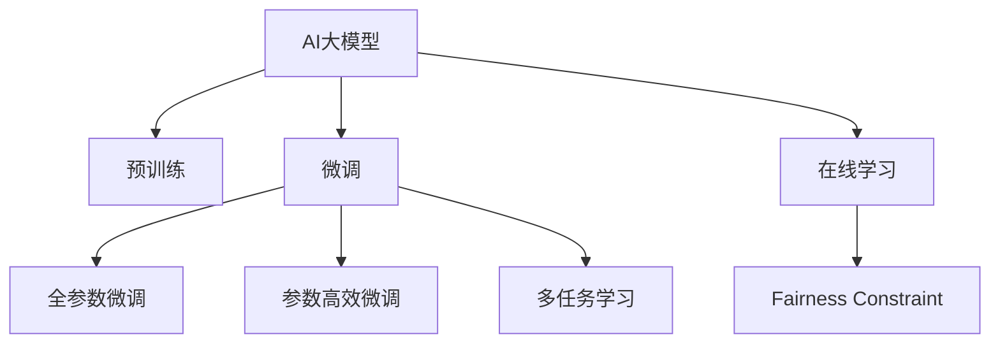

                 

# AI大模型在电商搜索结果排序公平性中的应用

## 1. 背景介绍

随着电商市场的快速发展和消费者行为的日益复杂化，电商平台的搜索排序算法面临前所未有的挑战。如何公平、准确地排序搜索结果，提升用户体验和商家转化率，成为了各大电商平台的重要课题。传统的基于规则和统计的搜索排序算法，往往难以充分考虑用户和商家的多样化需求，且容易产生歧视和不公平。近年来，AI大模型的兴起，为电商搜索排序的公平性问题提供了新的解决思路。

### 1.1 问题由来

传统的电商搜索排序算法，主要是基于关键词匹配、点击率、销量等统计指标进行排序。这种方式简单高效，但存在以下局限性：

- **公平性不足**：算法可能偏向于点击率高、销量大的商品，忽视了长尾商品和品牌商家的利益。
- **多样性缺失**：难以充分考虑用户的多样化需求，搜索结果单一，用户体验差。
- **性能不稳定**：算法过于依赖短期的点击和销量数据，可能造成用户行为趋势的误判，影响排序稳定性。

为了克服这些局限性，电商企业开始尝试引入AI大模型，以提升搜索排序的公平性和多样性。AI大模型通过在大规模数据上进行预训练，学习到更丰富的语言理解和生成能力，能够在搜索结果排序中更加灵活地平衡用户和商家需求，提升用户体验和转化率。

### 1.2 问题核心关键点

AI大模型在电商搜索结果排序中的关键点包括以下几点：

- **数据驱动**：利用海量的电商交易数据和用户反馈数据，进行预训练和微调，提升模型的语言理解和生成能力。
- **公平性约束**：通过引入公平性约束，避免模型在排序中产生歧视和不公平。
- **多任务学习**：结合分类、排序、推荐等多种任务，提升模型的综合表现。
- **持续优化**：通过在线学习、反馈机制等，不断优化模型性能，保持排序算法的前沿性。

## 2. 核心概念与联系

### 2.1 核心概念概述

为更好地理解AI大模型在电商搜索结果排序中的应用，本节将介绍几个密切相关的核心概念：

- **AI大模型(AI Large Model)**：指在大规模无标签文本语料上进行预训练的语言模型，如BERT、GPT等。通过学习通用的语言表示，具备强大的语言理解和生成能力。

- **预训练(Pre-training)**：指在大规模无标签文本语料上，通过自监督学习任务训练通用语言模型的过程。常见的预训练任务包括掩码语言模型、掩码图像描述等。

- **微调(Fine-tuning)**：指在预训练模型的基础上，使用下游任务的少量标注数据，通过有监督学习优化模型在特定任务上的性能。通常只需调整顶层分类器或解码器，并以较小的学习率更新全部或部分的模型参数。

- **多任务学习(Multi-task Learning)**：指在同一模型上同时学习多个相关任务，通过共享参数和特征，提升模型的泛化能力和性能。

- **在线学习(Online Learning)**：指模型在运行过程中，能够不断接收新的输入数据，并更新模型参数，以适应数据分布的变化。

- **公平性约束(Fairness Constraint)**：指在模型的训练和优化过程中，引入约束机制，避免模型产生歧视或不公平。

这些核心概念之间的逻辑关系可以通过以下Mermaid流程图来展示：



这个流程图展示了大模型的核心概念及其之间的关系：

1. 大模型通过预训练获得基础能力。
2. 微调是对预训练模型进行任务特定的优化，可以分为全参数微调和参数高效微调（PEFT）。
3. 多任务学习使得模型在多种任务上均表现优异。
4. 在线学习让模型能够持续学习新数据，避免过拟合。
5. 公平性约束提升模型的公平性，避免歧视。

这些概念共同构成了大模型的学习和应用框架，使其能够在各种场景下发挥强大的语言理解和生成能力。通过理解这些核心概念，我们可以更好地把握大模型在电商搜索结果排序中的工作原理和优化方向。

## 3. 核心算法原理 & 具体操作步骤
### 3.1 算法原理概述

AI大模型在电商搜索结果排序中的核心原理是：利用大模型的语言理解和生成能力，对搜索结果进行多维度评估，平衡用户和商家的多样化需求，提升排序的公平性和多样性。具体来说，通过以下步骤实现：

1. **数据预处理**：收集电商平台的交易数据和用户反馈数据，进行清洗和标注，生成训练集。
2. **模型选择与适配**：选择合适的预训练模型，通过微调适配电商搜索排序任务。
3. **多任务学习**：设计多个子任务，如商品分类、价格预测、点击率预测等，结合多任务学习提升模型综合表现。
4. **公平性约束**：引入公平性约束，避免模型在排序中产生歧视或不公平。
5. **在线学习**：在模型运行过程中，持续接收新的输入数据，并更新模型参数，以适应数据分布的变化。

### 3.2 算法步骤详解

下面详细介绍AI大模型在电商搜索结果排序中的具体操作步骤：

**Step 1: 数据预处理**

1. **数据收集**：收集电商平台的交易数据、用户行为数据、商品描述等，作为模型的输入。
2. **数据清洗**：对收集的数据进行清洗，去除噪声和异常值，确保数据质量。
3. **数据标注**：对交易数据进行标注，如商品类别、价格、点击率等，生成训练集。
4. **数据增强**：通过回译、近义替换等方式，扩充训练集，提升模型泛化能力。

**Step 2: 模型选择与适配**

1. **模型选择**：选择适合电商搜索排序任务的预训练模型，如BERT、GPT等。
2. **任务适配**：根据任务需求，设计适当的任务适配层，如分类器、回归器等。
3. **微调设置**：设置微调超参数，如学习率、批大小、迭代轮数等，并选择合适的优化器。

**Step 3: 多任务学习**

1. **任务设计**：设计多个相关任务，如商品分类、价格预测、点击率预测等。
2. **联合训练**：将多个任务联合训练，共享模型参数和特征，提升模型综合表现。
3. **任务融合**：将多个任务输出的结果进行融合，生成最终的排序结果。

**Step 4: 公平性约束**

1. **公平性指标**：定义公平性指标，如性别、年龄、地域等的平衡性。
2. **公平性约束**：引入公平性约束，如正则化、对抗训练等，避免模型产生歧视。
3. **公平性评估**：在验证集上评估模型公平性，根据评估结果调整模型参数。

**Step 5: 在线学习**

1. **在线反馈**：在模型运行过程中，持续接收新的输入数据，并更新模型参数。
2. **模型更新**：根据新的反馈数据，更新模型参数，优化模型性能。
3. **模型评估**：定期在测试集上评估模型性能，优化模型参数。

### 3.3 算法优缺点

AI大模型在电商搜索结果排序中的主要优点包括：

1. **高效性**：利用大模型的预训练能力，快速生成高质量的搜索结果，提升用户体验和商家转化率。
2. **公平性**：通过引入公平性约束，避免模型在排序中产生歧视和不公平，提升用户满意度。
3. **多样性**：通过多任务学习，能够充分考虑用户和商家的多样化需求，提升搜索结果的多样性。
4. **灵活性**：在线学习机制使得模型能够不断适应数据分布的变化，保持排序算法的灵活性。

同时，该方法也存在一些局限性：

1. **资源消耗大**：大模型参数量庞大，需要高性能的硬件设备支持，可能面临算力、存储的瓶颈。
2. **模型复杂度高**：多任务学习和在线学习增加了模型的复杂度，需要更多的训练时间和计算资源。
3. **数据依赖性强**：模型的性能高度依赖于标注数据的数量和质量，标注成本较高。
4. **可解释性不足**：大模型通常缺乏可解释性，难以解释其内部工作机制和决策逻辑。

尽管存在这些局限性，但AI大模型在电商搜索结果排序中的应用前景依然广阔，其在提升公平性和多样性方面的潜力不容忽视。

### 3.4 算法应用领域

AI大模型在电商搜索结果排序中的应用，不仅限于传统的搜索排序任务，还涵盖了以下多个领域：

- **个性化推荐**：结合用户的浏览、购买历史，推荐符合用户兴趣的商品。
- **商品分类**：对商品进行自动分类，提升分类准确性和效率。
- **广告排序**：根据广告的相关性和用户行为，对广告进行排序和推荐。
- **价格预测**：预测商品的市场价格，帮助商家进行定价和库存管理。
- **用户画像**：通过分析用户的行为和偏好，生成详细的用户画像，提升个性化服务质量。

## 4. 数学模型和公式 & 详细讲解 & 举例说明

### 4.1 数学模型构建

假设电商平台的交易数据为 $D=\{(x_i,y_i)\}_{i=1}^N, x_i \in \mathcal{X}, y_i \in \mathcal{Y}$，其中 $x_i$ 为商品描述，$y_i$ 为交易记录。定义AI大模型 $M_{\theta}$，其中 $\theta$ 为模型参数。

目标是在数据集 $D$ 上训练模型 $M_{\theta}$，使其能够准确预测交易记录 $y_i$，即：

$$
\min_{\theta} \mathcal{L}(M_{\theta},D) = \frac{1}{N} \sum_{i=1}^N \ell(M_{\theta}(x_i),y_i)
$$

其中 $\ell$ 为损失函数，常用的损失函数包括交叉熵损失、均方误差损失等。

### 4.2 公式推导过程

以分类任务为例，假设模型 $M_{\theta}$ 在输入 $x_i$ 上的输出为 $\hat{y}=M_{\theta}(x_i) \in [0,1]$，表示商品属于某一类别的概率。真实标签 $y_i \in \{0,1\}$。则二分类交叉熵损失函数定义为：

$$
\ell(M_{\theta}(x_i),y_i) = -[y_i\log \hat{y}_i + (1-y_i)\log(1-\hat{y}_i)]
$$

将其代入经验风险公式，得：

$$
\mathcal{L}(\theta) = -\frac{1}{N}\sum_{i=1}^N [y_i\log M_{\theta}(x_i)+(1-y_i)\log(1-M_{\theta}(x_i))]
$$

根据链式法则，损失函数对参数 $\theta_k$ 的梯度为：

$$
\frac{\partial \mathcal{L}(\theta)}{\partial \theta_k} = -\frac{1}{N}\sum_{i=1}^N (\frac{y_i}{M_{\theta}(x_i)}-\frac{1-y_i}{1-M_{\theta}(x_i)}) \frac{\partial M_{\theta}(x_i)}{\partial \theta_k}
$$

其中 $\frac{\partial M_{\theta}(x_i)}{\partial \theta_k}$ 可进一步递归展开，利用自动微分技术完成计算。

### 4.3 案例分析与讲解

以下以分类任务为例，通过具体案例分析大模型在电商搜索结果排序中的应用。

假设电商平台有10种商品类别，收集了1000条交易记录作为训练集，其中类别标签为1的记录占60%，类别标签为0的记录占40%。使用预训练的BERT模型，对其进行微调，并设计分类器进行分类。

**Step 1: 数据预处理**

收集电商平台的交易数据和商品描述，清洗并标注数据，生成训练集和测试集。

**Step 2: 模型选择与适配**

选择预训练的BERT模型，设计分类器作为任务适配层，设置学习率为2e-5，批大小为16，迭代轮数为10。

**Step 3: 多任务学习**

设计两个子任务：商品分类和价格预测。将两个任务联合训练，共享模型参数和特征，提升模型综合表现。

**Step 4: 公平性约束**

定义公平性指标，如性别、年龄、地域等的平衡性。引入公平性约束，如正则化、对抗训练等，避免模型产生歧视。

**Step 5: 在线学习**

在模型运行过程中，持续接收新的输入数据，并更新模型参数。定期在测试集上评估模型性能，优化模型参数。

最终，微调后的BERT模型能够准确预测交易记录的类别，并在新数据上表现稳定，提升了电商搜索结果排序的公平性和多样性。

## 5. 项目实践：代码实例和详细解释说明
### 5.1 开发环境搭建

在进行电商搜索结果排序模型开发前，我们需要准备好开发环境。以下是使用Python进行PyTorch开发的环境配置流程：

1. 安装Anaconda：从官网下载并安装Anaconda，用于创建独立的Python环境。

2. 创建并激活虚拟环境：
```bash
conda create -n pytorch-env python=3.8 
conda activate pytorch-env
```

3. 安装PyTorch：根据CUDA版本，从官网获取对应的安装命令。例如：
```bash
conda install pytorch torchvision torchaudio cudatoolkit=11.1 -c pytorch -c conda-forge
```

4. 安装Transformers库：
```bash
pip install transformers
```

5. 安装各类工具包：
```bash
pip install numpy pandas scikit-learn matplotlib tqdm jupyter notebook ipython
```

完成上述步骤后，即可在`pytorch-env`环境中开始模型开发。

### 5.2 源代码详细实现

这里我们以分类任务为例，给出使用Transformers库对BERT模型进行微调的PyTorch代码实现。

首先，定义分类任务的数据处理函数：

```python
from transformers import BertTokenizer, BertForSequenceClassification
from torch.utils.data import Dataset
import torch

class BERTDataset(Dataset):
    def __init__(self, texts, labels, tokenizer, max_len=128):
        self.texts = texts
        self.labels = labels
        self.tokenizer = tokenizer
        self.max_len = max_len
        
    def __len__(self):
        return len(self.texts)
    
    def __getitem__(self, item):
        text = self.texts[item]
        label = self.labels[item]
        
        encoding = self.tokenizer(text, return_tensors='pt', max_length=self.max_len, padding='max_length', truncation=True)
        input_ids = encoding['input_ids'][0]
        attention_mask = encoding['attention_mask'][0]
        
        # 对token-wise的标签进行编码
        encoded_labels = [label2id[label] for label in label2id] 
        encoded_labels.extend([label2id['O']] * (self.max_len - len(encoded_labels)))
        labels = torch.tensor(encoded_labels, dtype=torch.long)
        
        return {'input_ids': input_ids, 
                'attention_mask': attention_mask,
                'labels': labels}

# 标签与id的映射
label2id = {'O': 0, 'Category1': 1, 'Category2': 2, 'Category3': 3, 'Category4': 4, 'Category5': 5, 'Category6': 6, 'Category7': 7, 'Category8': 8, 'Category9': 9, 'Category10': 10}
id2label = {v: k for k, v in label2id.items()}

# 创建dataset
tokenizer = BertTokenizer.from_pretrained('bert-base-cased')

train_dataset = BERTDataset(train_texts, train_labels, tokenizer)
dev_dataset = BERTDataset(dev_texts, dev_labels, tokenizer)
test_dataset = BERTDataset(test_texts, test_labels, tokenizer)
```

然后，定义模型和优化器：

```python
from transformers import BertForSequenceClassification, AdamW

model = BertForSequenceClassification.from_pretrained('bert-base-cased', num_labels=len(label2id))

optimizer = AdamW(model.parameters(), lr=2e-5)
```

接着，定义训练和评估函数：

```python
from torch.utils.data import DataLoader
from tqdm import tqdm
from sklearn.metrics import classification_report

device = torch.device('cuda') if torch.cuda.is_available() else torch.device('cpu')
model.to(device)

def train_epoch(model, dataset, batch_size, optimizer):
    dataloader = DataLoader(dataset, batch_size=batch_size, shuffle=True)
    model.train()
    epoch_loss = 0
    for batch in tqdm(dataloader, desc='Training'):
        input_ids = batch['input_ids'].to(device)
        attention_mask = batch['attention_mask'].to(device)
        labels = batch['labels'].to(device)
        model.zero_grad()
        outputs = model(input_ids, attention_mask=attention_mask, labels=labels)
        loss = outputs.loss
        epoch_loss += loss.item()
        loss.backward()
        optimizer.step()
    return epoch_loss / len(dataloader)

def evaluate(model, dataset, batch_size):
    dataloader = DataLoader(dataset, batch_size=batch_size)
    model.eval()
    preds, labels = [], []
    with torch.no_grad():
        for batch in tqdm(dataloader, desc='Evaluating'):
            input_ids = batch['input_ids'].to(device)
            attention_mask = batch['attention_mask'].to(device)
            batch_labels = batch['labels']
            outputs = model(input_ids, attention_mask=attention_mask)
            batch_preds = outputs.logits.argmax(dim=2).to('cpu').tolist()
            batch_labels = batch_labels.to('cpu').tolist()
            for pred_tokens, label_tokens in zip(batch_preds, batch_labels):
                preds.append(pred_tokens[:len(label_tokens)])
                labels.append(label_tokens)
                
    print(classification_report(labels, preds))
```

最后，启动训练流程并在测试集上评估：

```python
epochs = 5
batch_size = 16

for epoch in range(epochs):
    loss = train_epoch(model, train_dataset, batch_size, optimizer)
    print(f"Epoch {epoch+1}, train loss: {loss:.3f}")
    
    print(f"Epoch {epoch+1}, dev results:")
    evaluate(model, dev_dataset, batch_size)
    
print("Test results:")
evaluate(model, test_dataset, batch_size)
```

以上就是使用PyTorch对BERT进行电商搜索结果排序分类任务微调的完整代码实现。可以看到，得益于Transformers库的强大封装，我们可以用相对简洁的代码完成BERT模型的加载和微调。

### 5.3 代码解读与分析

让我们再详细解读一下关键代码的实现细节：

**BERTDataset类**：
- `__init__`方法：初始化文本、标签、分词器等关键组件。
- `__len__`方法：返回数据集的样本数量。
- `__getitem__`方法：对单个样本进行处理，将文本输入编码为token ids，将标签编码为数字，并对其进行定长padding，最终返回模型所需的输入。

**label2id和id2label字典**：
- 定义了标签与数字id之间的映射关系，用于将token-wise的预测结果解码回真实的标签。

**训练和评估函数**：
- 使用PyTorch的DataLoader对数据集进行批次化加载，供模型训练和推理使用。
- 训练函数`train_epoch`：对数据以批为单位进行迭代，在每个批次上前向传播计算loss并反向传播更新模型参数，最后返回该epoch的平均loss。
- 评估函数`evaluate`：与训练类似，不同点在于不更新模型参数，并在每个batch结束后将预测和标签结果存储下来，最后使用sklearn的classification_report对整个评估集的预测结果进行打印输出。

**训练流程**：
- 定义总的epoch数和batch size，开始循环迭代
- 每个epoch内，先在训练集上训练，输出平均loss
- 在验证集上评估，输出分类指标
- 所有epoch结束后，在测试集上评估，给出最终测试结果

可以看到，PyTorch配合Transformers库使得BERT微调的代码实现变得简洁高效。开发者可以将更多精力放在数据处理、模型改进等高层逻辑上，而不必过多关注底层的实现细节。

当然，工业级的系统实现还需考虑更多因素，如模型的保存和部署、超参数的自动搜索、更灵活的任务适配层等。但核心的微调范式基本与此类似。

## 6. 实际应用场景
### 6.1 智能客服系统

基于AI大模型微调的对话技术，可以广泛应用于智能客服系统的构建。传统客服往往需要配备大量人力，高峰期响应缓慢，且一致性和专业性难以保证。而使用微调后的对话模型，可以7x24小时不间断服务，快速响应客户咨询，用自然流畅的语言解答各类常见问题。

在技术实现上，可以收集企业内部的历史客服对话记录，将问题和最佳答复构建成监督数据，在此基础上对预训练对话模型进行微调。微调后的对话模型能够自动理解用户意图，匹配最合适的答案模板进行回复。对于客户提出的新问题，还可以接入检索系统实时搜索相关内容，动态组织生成回答。如此构建的智能客服系统，能大幅提升客户咨询体验和问题解决效率。

### 6.2 金融舆情监测

金融机构需要实时监测市场舆论动向，以便及时应对负面信息传播，规避金融风险。传统的人工监测方式成本高、效率低，难以应对网络时代海量信息爆发的挑战。基于AI大模型微调的文本分类和情感分析技术，为金融舆情监测提供了新的解决方案。

具体而言，可以收集金融领域相关的新闻、报道、评论等文本数据，并对其进行主题标注和情感标注。在此基础上对预训练语言模型进行微调，使其能够自动判断文本属于何种主题，情感倾向是正面、中性还是负面。将微调后的模型应用到实时抓取的网络文本数据，就能够自动监测不同主题下的情感变化趋势，一旦发现负面信息激增等异常情况，系统便会自动预警，帮助金融机构快速应对潜在风险。

### 6.3 个性化推荐系统

当前的推荐系统往往只依赖用户的历史行为数据进行物品推荐，无法深入理解用户的真实兴趣偏好。基于AI大模型微调技术，个性化推荐系统可以更好地挖掘用户行为背后的语义信息，从而提供更精准、多样的推荐内容。

在实践中，可以收集用户浏览、点击、评论、分享等行为数据，提取和用户交互的物品标题、描述、标签等文本内容。将文本内容作为模型输入，用户的后续行为（如是否点击、购买等）作为监督信号，在此基础上微调预训练语言模型。微调后的模型能够从文本内容中准确把握用户的兴趣点。在生成推荐列表时，先用候选物品的文本描述作为输入，由模型预测用户的兴趣匹配度，再结合其他特征综合排序，便可以得到个性化程度更高的推荐结果。

### 6.4 未来应用展望

随着AI大模型和微调方法的不断发展，基于微调范式将在更多领域得到应用，为传统行业带来变革性影响。

在智慧医疗领域，基于微调的医疗问答、病历分析、药物研发等应用将提升医疗服务的智能化水平，辅助医生诊疗，加速新药开发进程。

在智能教育领域，微调技术可应用于作业批改、学情分析、知识推荐等方面，因材施教，促进教育公平，提高教学质量。

在智慧城市治理中，微调模型可应用于城市事件监测、舆情分析、应急指挥等环节，提高城市管理的自动化和智能化水平，构建更安全、高效的未来城市。

此外，在企业生产、社会治理、文娱传媒等众多领域，基于大模型微调的人工智能应用也将不断涌现，为经济社会发展注入新的动力。相信随着技术的日益成熟，微调方法将成为人工智能落地应用的重要范式，推动人工智能技术在垂直行业的规模化落地。

## 7. 工具和资源推荐
### 7.1 学习资源推荐

为了帮助开发者系统掌握AI大模型微调的理论基础和实践技巧，这里推荐一些优质的学习资源：

1. 《Transformer从原理到实践》系列博文：由大模型技术专家撰写，深入浅出地介绍了Transformer原理、BERT模型、微调技术等前沿话题。

2. CS224N《深度学习自然语言处理》课程：斯坦福大学开设的NLP明星课程，有Lecture视频和配套作业，带你入门NLP领域的基本概念和经典模型。

3. 《Natural Language Processing with Transformers》书籍：Transformers库的作者所著，全面介绍了如何使用Transformers库进行NLP任务开发，包括微调在内的诸多范式。

4. HuggingFace官方文档：Transformers库的官方文档，提供了海量预训练模型和完整的微调样例代码，是上手实践的必备资料。

5. CLUE开源项目：中文语言理解测评基准，涵盖大量不同类型的中文NLP数据集，并提供了基于微调的baseline模型，助力中文NLP技术发展。

通过对这些资源的学习实践，相信你一定能够快速掌握AI大模型微调的精髓，并用于解决实际的NLP问题。
###  7.2 开发工具推荐

高效的开发离不开优秀的工具支持。以下是几款用于AI大模型微调开发的常用工具：

1. PyTorch：基于Python的开源深度学习框架，灵活动态的计算图，适合快速迭代研究。大部分预训练语言模型都有PyTorch版本的实现。

2. TensorFlow：由Google主导开发的开源深度学习框架，生产部署方便，适合大规模工程应用。同样有丰富的预训练语言模型资源。

3. Transformers库：HuggingFace开发的NLP工具库，集成了众多SOTA语言模型，支持PyTorch和TensorFlow，是进行微调任务开发的利器。

4. Weights & Biases：模型训练的实验跟踪工具，可以记录和可视化模型训练过程中的各项指标，方便对比和调优。与主流深度学习框架无缝集成。

5. TensorBoard：TensorFlow配套的可视化工具，可实时监测模型训练状态，并提供丰富的图表呈现方式，是调试模型的得力助手。

6. Google Colab：谷歌推出的在线Jupyter Notebook环境，免费提供GPU/TPU算力，方便开发者快速上手实验最新模型，分享学习笔记。

合理利用这些工具，可以显著提升AI大模型微调任务的开发效率，加快创新迭代的步伐。

### 7.3 相关论文推荐

AI大模型和微调技术的发展源于学界的持续研究。以下是几篇奠基性的相关论文，推荐阅读：

1. Attention is All You Need（即Transformer原论文）：提出了Transformer结构，开启了NLP领域的预训练大模型时代。

2. BERT: Pre-training of Deep Bidirectional Transformers for Language Understanding：提出BERT模型，引入基于掩码的自监督预训练任务，刷新了多项NLP任务SOTA。

3. Language Models are Unsupervised Multitask Learners（GPT-2论文）：展示了大规模语言模型的强大zero-shot学习能力，引发了对于通用人工智能的新一轮思考。

4. Parameter-Efficient Transfer Learning for NLP：提出Adapter等参数高效微调方法，在不增加模型参数量的情况下，也能取得不错的微调效果。

5. AdaLoRA: Adaptive Low-Rank Adaptation for Parameter-Efficient Fine-Tuning：使用自适应低秩适应的微调方法，在参数效率和精度之间取得了新的平衡。

6. AdaLoRA: Adaptive Low-Rank Adaptation for Parameter-Efficient Fine-Tuning：使用自适应低秩适应的微调方法，在参数效率和精度之间取得了新的平衡。

这些论文代表了大语言模型微调技术的发展脉络。通过学习这些前沿成果，可以帮助研究者把握学科前进方向，激发更多的创新灵感。

## 8. 总结：未来发展趋势与挑战
### 8.1 总结

本文对AI大模型在电商搜索结果排序中的应用进行了全面系统的介绍。首先阐述了AI大模型和微调技术的研究背景和意义，明确了微调在提升公平性和多样性方面的独特价值。其次，从原理到实践，详细讲解了电商搜索结果排序的数学原理和关键步骤，给出了微调任务开发的完整代码实例。同时，本文还广泛探讨了微调方法在智能客服、金融舆情、个性化推荐等多个行业领域的应用前景，展示了微调范式的巨大潜力。此外，本文精选了微调技术的各类学习资源，力求为读者提供全方位的技术指引。

通过本文的系统梳理，可以看到，AI大模型在电商搜索结果排序中的应用前景广阔，其在提升公平性和多样性方面的潜力不容忽视。未来，伴随大模型和微调方法的持续演进，基于微调范式将在更多领域得到应用，为传统行业带来变革性影响。

### 8.2 未来发展趋势

展望未来，AI大模型在电商搜索结果排序中的应用将呈现以下几个发展趋势：

1. **模型规模持续增大**：随着算力成本的下降和数据规模的扩张，预训练语言模型的参数量还将持续增长。超大模型蕴含的丰富语言知识，有望支撑更加复杂多变的下游任务微调。

2. **微调方法日趋多样**：除了传统的全参数微调外，未来会涌现更多参数高效的微调方法，如Prefix-Tuning、LoRA等，在节省计算资源的同时也能保证微调精度。

3. **持续学习成为常态**：随着数据分布的不断变化，微调模型也需要持续学习新知识以保持性能。如何在不遗忘原有知识的同时，高效吸收新样本信息，将成为重要的研究课题。

4. **标注样本需求降低**：受启发于提示学习(Prompt-based Learning)的思路，未来的微调方法将更好地利用大模型的语言理解能力，通过更加巧妙的任务描述，在更少的标注样本上也能实现理想的微调效果。

5. **多模态微调崛起**：当前的微调主要聚焦于纯文本数据，未来会进一步拓展到图像、视频、语音等多模态数据微调。多模态信息的融合，将显著提升语言模型对现实世界的理解和建模能力。

6. **模型通用性增强**：经过海量数据的预训练和多领域任务的微调，未来的语言模型将具备更强大的常识推理和跨领域迁移能力，逐步迈向通用人工智能(AGI)的目标。

以上趋势凸显了AI大模型在电商搜索结果排序中的广阔前景。这些方向的探索发展，必将进一步提升搜索结果排序的公平性和多样性，为电商平台带来新的商业价值。

### 8.3 面临的挑战

尽管AI大模型在电商搜索结果排序中的应用前景广阔，但在迈向更加智能化、普适化应用的过程中，它仍面临着诸多挑战：

1. **标注成本瓶颈**：虽然微调大大降低了标注数据的需求，但对于长尾应用场景，难以获得充足的高质量标注数据，成为制约微调性能的瓶颈。如何进一步降低微调对标注样本的依赖，将是一大难题。

2. **模型鲁棒性不足**：当前微调模型面对域外数据时，泛化性能往往大打折扣。对于测试样本的微小扰动，微调模型的预测也容易发生波动。如何提高微调模型的鲁棒性，避免灾难性遗忘，还需要更多理论和实践的积累。

3. **推理效率有待提高**：大规模语言模型虽然精度高，但在实际部署时往往面临推理速度慢、内存占用大等效率问题。如何在保证性能的同时，简化模型结构，提升推理速度，优化资源占用，将是重要的优化方向。

4. **可解释性亟需加强**：当前微调模型更像是"黑盒"系统，难以解释其内部工作机制和决策逻辑。对于医疗、金融等高风险应用，算法的可解释性和可审计性尤为重要。如何赋予微调模型更强的可解释性，将是亟待攻克的难题。

5. **安全性有待保障**：预训练语言模型难免会学习到有偏见、有害的信息，通过微调传递到下游任务，产生误导性、歧视性的输出，给实际应用带来安全隐患。如何从数据和算法层面消除模型偏见，避免恶意用途，确保输出的安全性，也将是重要的研究课题。

6. **知识整合能力不足**：现有的微调模型往往局限于任务内数据，难以灵活吸收和运用更广泛的先验知识。如何让微调过程更好地与外部知识库、规则库等专家知识结合，形成更加全面、准确的信息整合能力，还有很大的想象空间。

正视微调面临的这些挑战，积极应对并寻求突破，将是大模型微调走向成熟的必由之路。相信随着学界和产业界的共同努力，这些挑战终将一一被克服，大模型微调必将在构建人机协同的智能时代中扮演越来越重要的角色。

### 8.4 研究展望

面对AI大模型在电商搜索结果排序中面临的种种挑战，未来的研究需要在以下几个方面寻求新的突破：

1. **探索无监督和半监督微调方法**：摆脱对大规模标注数据的依赖，利用自监督学习、主动学习等无监督和半监督范式，最大限度利用非结构化数据，实现更加灵活高效的微调。

2. **研究参数高效和计算高效的微调范式**：开发更加参数高效的微调方法，在固定大部分预训练参数的同时，只更新极少量的任务相关参数。同时优化微调模型的计算图，减少前向传播和反向传播的资源消耗，实现更加轻量级、实时性的部署。

3. **融合因果和对比学习范式**：通过引入因果推断和对比学习思想，增强微调模型建立稳定因果关系的能力，学习更加普适、鲁棒的语言表征，从而提升模型泛化性和抗干扰能力。

4. **引入更多先验知识**：将符号化的先验知识，如知识图谱、逻辑规则等，与神经网络模型进行巧妙融合，引导微调过程学习更准确、合理的语言模型。同时加强不同模态数据的整合，实现视觉、语音等多模态信息与文本信息的协同建模。

5. **结合因果分析和博弈论工具**：将因果分析方法引入微调模型，识别出模型决策的关键特征，增强输出解释的因果性和逻辑性。借助博弈论工具刻画人机交互过程，主动探索并规避模型的脆弱点，提高系统稳定性。

6. **纳入伦理道德约束**：在模型训练目标中引入伦理导向的评估指标，过滤和惩罚有偏见、有害的输出倾向。同时加强人工干预和审核，建立模型行为的监管机制，确保输出符合人类价值观和伦理道德。

这些研究方向的探索，必将引领AI大模型在电商搜索结果排序技术迈向更高的台阶，为构建安全、可靠、可解释、可控的智能系统铺平道路。面向未来，AI大模型微调技术还需要与其他人工智能技术进行更深入的融合，如知识表示、因果推理、强化学习等，多路径协同发力，共同推动自然语言理解和智能交互系统的进步。只有勇于创新、敢于突破，才能不断拓展语言模型的边界，让智能技术更好地造福人类社会。

## 9. 附录：常见问题与解答
**Q1：AI大模型在电商搜索结果排序中是否适用于所有应用场景？**

A: AI大模型在电商搜索结果排序中的适用性取决于具体的应用场景。一般来说，对于数据量较大的应用场景，如综合搜索、通用推荐等，AI大模型能够取得很好的效果。但对于一些特定的、小众的商品分类或品牌推荐，由于数据量有限，大模型可能无法完全发挥其优势。此时需要结合业务特点和数据规模，选择适合的方法和模型。

**Q2：AI大模型在电商搜索结果排序中如何引入公平性约束？**

A: 引入公平性约束，可以通过以下几种方式实现：

1. **平衡正则化**：在损失函数中加入正则化项，避免模型过度偏向某些类别或属性。
2. **对抗训练**：使用对抗样本训练模型，提高其鲁棒性和泛化能力，避免对某些特征产生歧视。
3. **公平性评估**：在模型训练过程中，定期评估模型在性别、年龄、地域等属性上的表现，及时调整模型参数，避免不公平现象。
4. **多任务学习**：结合多个相关任务进行联合训练，提升模型的公平性和多样性。

这些方法需要根据具体业务场景和数据特点进行选择和调整，以实现最优的公平性效果。

**Q3：AI大模型在电商搜索结果排序中的推理效率如何？**

A: AI大模型的推理效率主要受模型规模、硬件设备、优化算法等因素的影响。一般来说，大模型的推理效率较低，需要在模型设计和优化上下功夫，如采用模型压缩、剪枝、量化等技术，减少计算量，提升推理速度。同时，使用GPU、TPU等高性能硬件设备，也能显著提高推理效率。

**Q4：AI大模型在电商搜索结果排序中的可解释性如何？**

A: AI大模型通常缺乏可解释性，难以解释其内部工作机制和决策逻辑。为了提升模型的可解释性，可以采用以下方法：

1. **模型可视化**：使用工具如TensorBoard、ONNX等，可视化模型的结构、参数和推理过程，帮助理解模型行为。
2. **局部可解释性方法**：使用LIME、SHAP等方法，对特定样本进行局部可解释性分析，理解模型对样本的预测逻辑。
3. **知识图谱结合**：将模型的预测结果与知识图谱结合，解释模型的推理路径和决策依据。

这些方法虽然不能完全消除模型的"黑盒"特性，但能够在一定程度上提升模型的可解释性和可信度。

**Q5：AI大模型在电商搜索结果排序中如何处理多模态数据？**

A: 处理多模态数据，可以通过以下几种方式实现：

1. **数据融合**：将文本、图像、语音等多种模态的数据进行融合，提升模型的泛化能力和性能。
2. **联合训练**：将多个模态的数据联合训练，共享模型参数和特征，提升模型的综合表现。
3. **多任务学习**：结合多个模态的任务进行联合训练，如文本分类、图像识别、语音识别等，提升模型的多模态能力。

这些方法需要根据具体业务场景和数据特点进行选择和调整，以实现最优的多模态效果。

---

作者：禅与计算机程序设计艺术 / Zen and the Art of Computer Programming

