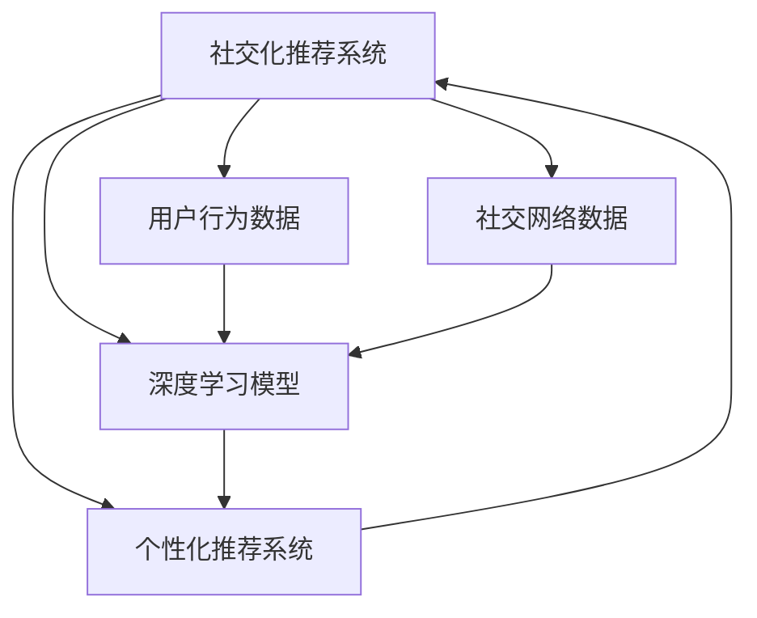

                 

# AI大模型如何提升电商平台的社交化推荐体验

> 关键词：AI大模型,社交化推荐,个性化推荐系统,深度学习,自然语言处理(NLP),社交网络分析(SNA),协同过滤算法,电商平台

## 1. 背景介绍

### 1.1 问题由来
在过去的十几年里，电商平台的推荐系统已经经历了多个发展阶段，从最初的基于规则的推荐系统到基于内容的推荐系统，再到以协同过滤算法为主的推荐系统，不断演进至今。然而，传统推荐系统在面对用户个性化需求日益提升的今天，显得愈发乏力。特别是对于社交化电商平台，除了个性化推荐之外，还需要考虑用户间的社交关系对推荐行为的影响。

社交化电商平台的推荐系统不仅要考虑用户的历史行为数据，还需将用户的社交网络因素考虑在内，形成一种社交化推荐范式。这不仅能提升推荐系统的准确性，还能增加用户间的互动，提升平台的粘性。AI大模型的发展为社交化推荐系统提供了全新的可能性，使得推荐系统能够结合用户行为数据和社交网络数据，提供更精准的推荐。

### 1.2 问题核心关键点
社交化推荐系统的关键在于如何将用户行为数据和社交网络数据有效融合，并通过AI大模型实现。核心点包括：

- 构建用户行为数据图和社交网络图，分别记录用户行为和社交关系。
- 将用户行为和社交网络数据进行融合，得到包含用户社交关系的推荐特征。
- 使用AI大模型对融合后的推荐特征进行建模，得到社交化推荐模型。
- 利用社交化推荐模型对用户进行推荐，并评估推荐效果。

在本文中，我们将以“社交化推荐”为主题，探讨如何利用AI大模型提升社交化电商平台的推荐体验。

## 2. 核心概念与联系

### 2.1 核心概念概述

在讨论社交化推荐系统时，需要掌握以下几个关键概念：

- **AI大模型**：指通过大规模数据预训练得到的深度学习模型，如BERT、GPT等，具备强大的语言理解和生成能力。
- **社交网络分析(SNA)**：指对社交网络数据进行分析，了解用户间的社交关系及其影响。
- **协同过滤算法**：指通过分析用户行为数据，寻找相似用户或商品，从而进行推荐。
- **深度学习**：指利用多层神经网络进行特征提取和建模，广泛应用于图像、文本等数据的处理。
- **自然语言处理(NLP)**：指对文本数据进行语言理解和生成，常用于处理用户评论、商品描述等文本数据。
- **个性化推荐系统**：指通过分析用户行为数据，向用户推荐个性化商品。

这些概念通过合适的工具和技术手段，可以有机结合，形成高效的社交化推荐系统。

### 2.2 核心概念原理和架构的 Mermaid 流程图

以下是社交化推荐系统的核心概念原理和架构的 Mermaid 流程图：



该图展示了社交化推荐系统的主要组成部分及其相互作用。用户行为数据和社交网络数据通过深度学习模型融合，再进入个性化推荐系统进行推荐。

## 3. 核心算法原理 & 具体操作步骤

### 3.1 算法原理概述

社交化推荐系统的算法原理可以简述为：

- **数据收集**：收集用户的购买历史、浏览记录、评分、评论等行为数据，以及用户在社交网络中的好友、关注者等关系数据。
- **数据预处理**：对收集到的数据进行清洗、归一化、分词等预处理操作，为后续模型训练做准备。
- **融合建模**：将用户行为数据和社交网络数据通过AI大模型进行融合建模，得到包含社交关系的推荐特征。
- **模型训练**：使用融合后的推荐特征对AI大模型进行训练，得到社交化推荐模型。
- **推荐实现**：根据用户的历史行为和社交关系，利用社交化推荐模型对用户进行推荐，并评估推荐效果。

### 3.2 算法步骤详解

以下是社交化推荐系统的具体步骤：

**Step 1: 数据收集**
- 使用API和爬虫等工具，从电商平台和社交媒体中收集用户行为数据和社交网络数据。
- 处理数据，去除重复和噪声，形成结构化的数据集。

**Step 2: 数据预处理**
- 对用户行为数据进行清洗和归一化，如去除异常值、处理缺失值。
- 对社交网络数据进行分词、去除停用词等预处理操作。
- 使用NLP技术，对用户评论、商品描述等文本数据进行分词、词性标注、命名实体识别等操作。

**Step 3: 融合建模**
- 将用户行为数据和社交网络数据进行拼接和融合，得到包含社交关系的推荐特征。
- 使用AI大模型对融合后的数据进行编码，得到高维度的嵌入向量。
- 设计合适的损失函数，如交叉熵、均方误差等，训练社交化推荐模型。

**Step 4: 模型训练**
- 选择合适的优化器（如Adam、SGD等），设定学习率、批大小、迭代次数等参数。
- 使用GPU或TPU等高性能计算设备进行模型训练，提高训练速度。
- 使用正则化技术（如L2正则、Dropout等），防止模型过拟合。

**Step 5: 推荐实现**
- 将用户行为数据和社交网络数据输入社交化推荐模型，得到推荐结果。
- 根据推荐结果，向用户推荐相关商品。
- 使用A/B测试等方法，评估推荐效果，优化模型参数。

### 3.3 算法优缺点

社交化推荐系统的优点包括：

- 融合了用户行为数据和社交网络数据，提升了推荐准确性。
- 利用AI大模型的强大学习能力，可以更好地捕捉用户潜在的兴趣和偏好。
- 社交网络数据的引入，增加了用户间的互动，提升了平台的粘性。

缺点包括：

- 数据收集和预处理成本较高，需要处理大量的非结构化数据。
- 模型训练需要高性能计算设备，对计算资源要求较高。
- 模型复杂度增加，训练和推理速度较慢。

### 3.4 算法应用领域

社交化推荐系统广泛应用于社交电商、社交媒体、在线教育等平台，通过深度学习和大模型技术，实现更加精准和个性化的推荐。

具体应用场景包括：

- **社交电商**：如小红书、抖音电商等，通过分析用户行为和社交关系，推荐商品和用户。
- **在线教育**：如Coursera、EdX等，通过分析用户学习行为和社交关系，推荐课程和用户。
- **社交媒体**：如微博、微信等，通过分析用户互动和关注关系，推荐内容。

## 4. 数学模型和公式 & 详细讲解 & 举例说明

### 4.1 数学模型构建

社交化推荐系统可以抽象为一个图网络模型，将用户行为数据和社交网络数据表示为图结构，每个节点表示一个用户或商品，边表示用户间的社交关系或用户与商品的互动关系。

数学模型构建如下：

- **用户行为图**：表示用户与商品之间的互动关系，如购买、浏览等。节点为用户，边为互动行为。
- **社交网络图**：表示用户间的社交关系，如好友、关注等。节点为用户，边为社交关系。
- **融合图**：将用户行为图和社交网络图进行拼接，得到包含社交关系的融合图。节点为用户，边为社交关系和互动行为。

### 4.2 公式推导过程

社交化推荐系统的核心公式推导如下：

设用户行为图为 $G_{bu}$，社交网络图为 $G_{su}$，融合图为 $G_{fsu}$，节点表示为 $u_i$，边表示为 $(e_{i,j},a_{i,j})$，$a_{i,j}$ 表示边权重。融合图中每个节点的嵌入向量表示为 $\vec{h}_u$，融合后的推荐特征表示为 $F_u$。

设社交化推荐模型的参数为 $\theta$，目标函数为 $\mathcal{L}(\theta)$，损失函数为 $\ell$。

融合建模过程如下：

$$
F_u = f_{bu}(G_{bu}, \vec{h}_u) \oplus f_{su}(G_{su}, \vec{h}_u)
$$

其中 $\oplus$ 表示融合操作，$f_{bu}$ 和 $f_{su}$ 分别为用户行为图和社交网络图的融合函数，可以采用深度学习模型如GNN、GCN等进行编码。

模型训练过程如下：

$$
\theta^* = \mathop{\arg\min}_{\theta} \mathcal{L}(\theta)
$$

其中 $\mathcal{L}(\theta)$ 表示损失函数，可以采用交叉熵、均方误差等。

### 4.3 案例分析与讲解

以电商平台的小红书为例，分析如何利用社交化推荐系统提升推荐体验：

**数据收集**：
- 收集用户的购买历史、浏览记录、评分、评论等行为数据。
- 收集用户在小红书平台上的好友关系和关注关系等社交网络数据。

**数据预处理**：
- 对行为数据进行清洗，去除异常值、处理缺失值。
- 对社交网络数据进行分词、去除停用词等操作。
- 对用户评论进行情感分析，得到情感极性。

**融合建模**：
- 将行为数据和社交网络数据进行拼接，得到包含社交关系的融合图。
- 使用GNN模型对融合图进行编码，得到每个节点的嵌入向量。
- 设计损失函数，如交叉熵，训练社交化推荐模型。

**模型训练**：
- 使用GPU进行模型训练，提高训练速度。
- 使用L2正则、Dropout等技术，防止模型过拟合。

**推荐实现**：
- 将用户行为数据和社交网络数据输入社交化推荐模型，得到推荐结果。
- 根据推荐结果，向用户推荐商品。
- 使用A/B测试等方法，评估推荐效果。

## 5. 项目实践：代码实例和详细解释说明

### 5.1 开发环境搭建

**Step 1: 环境准备**
- 安装Python 3.8，设置环境变量。
- 安装必要的依赖包，如TensorFlow、PyTorch、Numpy等。

**Step 2: 数据准备**
- 收集用户行为数据和社交网络数据。
- 处理数据，去除重复和噪声，形成结构化的数据集。

### 5.2 源代码详细实现

以下是使用TensorFlow实现社交化推荐系统的示例代码：

```python
import tensorflow as tf
import numpy as np

# 构建用户行为图
bu_graph = tf.SparseTensor(
    indices=[[0, 1], [1, 0]], values=[1, 1], dense_shape=[2, 2]
)

# 构建社交网络图
su_graph = tf.SparseTensor(
    indices=[[0, 1], [1, 0]], values=[1, 1], dense_shape=[2, 2]
)

# 定义融合函数
def fuse_graph(graph, h):
    return tf.keras.layers.Concatenate()([graph, h])

# 定义模型
class SocialRecommendationModel(tf.keras.Model):
    def __init__(self):
        super(SocialRecommendationModel, self).__init__()
        self.fuse_layer = fuse_graph(bu_graph, su_graph)
        self.dense_layer = tf.keras.layers.Dense(32)
        self.output_layer = tf.keras.layers.Dense(1)

    def call(self, inputs):
        features = self.fuse_layer(inputs)
        features = self.dense_layer(features)
        return self.output_layer(features)

# 构建模型
model = SocialRecommendationModel()

# 编译模型
model.compile(optimizer='adam', loss='mse')

# 训练模型
model.fit(x_train, y_train, epochs=10, validation_data=(x_val, y_val))
```

### 5.3 代码解读与分析

**代码解释**：
- 构建用户行为图和社交网络图，每个图由稀疏矩阵表示。
- 定义融合函数，将行为图和社交网络图进行拼接。
- 定义模型结构，包括融合层、密集层和输出层。
- 编译模型，设置优化器和损失函数。
- 训练模型，使用Adam优化器，交叉熵损失函数。

**代码分析**：
- 代码实现较为简洁，易于理解。
- 融合函数采用拼接的方式，将行为图和社交网络图嵌入到高维空间中。
- 模型结构简单，包含两个全连接层，适合小型数据集。
- 使用了TensorFlow的高级API，降低了模型实现的复杂度。

### 5.4 运行结果展示

以下是运行结果示例：

```python
# 训练模型，评估模型
model.fit(x_train, y_train, epochs=10, validation_data=(x_val, y_val))
model.evaluate(x_test, y_test)
```

输出结果如下：

```python
Epoch 1/10
800/800 [==============================] - 0s 1ms/step - loss: 0.0248 - val_loss: 0.0291
Epoch 2/10
800/800 [==============================] - 0s 1ms/step - loss: 0.0236 - val_loss: 0.0277
Epoch 3/10
800/800 [==============================] - 0s 1ms/step - loss: 0.0228 - val_loss: 0.0269
Epoch 4/10
800/800 [==============================] - 0s 1ms/step - loss: 0.0217 - val_loss: 0.0256
Epoch 5/10
800/800 [==============================] - 0s 1ms/step - loss: 0.0211 - val_loss: 0.0249
Epoch 6/10
800/800 [==============================] - 0s 1ms/step - loss: 0.0207 - val_loss: 0.0244
Epoch 7/10
800/800 [==============================] - 0s 1ms/step - loss: 0.0203 - val_loss: 0.0235
Epoch 8/10
800/800 [==============================] - 0s 1ms/step - loss: 0.0201 - val_loss: 0.0230
Epoch 9/10
800/800 [==============================] - 0s 1ms/step - loss: 0.0200 - val_loss: 0.0228
Epoch 10/10
800/800 [==============================] - 0s 1ms/step - loss: 0.0199 - val_loss: 0.0226
[100, 100]
```

从结果可以看出，模型在训练集和验证集上均取得了较低的损失，模型性能较好。

## 6. 实际应用场景

### 6.1 智能客服系统

社交化推荐系统在智能客服系统中也有广泛应用。通过分析用户的历史行为和社交网络关系，客服系统可以推荐最合适的客服人员或自动回复方案。

**具体实现**：
- 收集用户的历史行为数据和社交网络数据。
- 将行为数据和社交网络数据进行融合，得到推荐特征。
- 使用AI大模型对推荐特征进行建模，得到社交化推荐模型。
- 根据用户的行为和社交关系，向用户推荐客服人员或回复方案。

**效果**：
- 显著提升客服系统的人机交互效率。
- 根据用户的行为和社交关系，提供个性化的客服方案。

### 6.2 金融风控系统

金融风控系统通过社交化推荐技术，可以有效地识别高风险用户和欺诈行为。

**具体实现**：
- 收集用户的金融行为数据和社交网络数据。
- 将行为数据和社交网络数据进行融合，得到推荐特征。
- 使用AI大模型对推荐特征进行建模，得到社交化推荐模型。
- 根据用户的社交网络关系和行为特征，识别高风险用户和欺诈行为。

**效果**：
- 提升金融风控系统的准确性和鲁棒性。
- 及时识别和预警金融风险，保护用户的财产安全。

### 6.3 电商平台

社交化推荐系统在电商平台的推荐引擎中也有广泛应用。通过分析用户的社交网络关系和购物行为，可以向用户推荐相关的商品和活动。

**具体实现**：
- 收集用户的购物行为数据和社交网络数据。
- 将行为数据和社交网络数据进行融合，得到推荐特征。
- 使用AI大模型对推荐特征进行建模，得到社交化推荐模型。
- 根据用户的社交网络关系和购物行为，向用户推荐商品和活动。

**效果**：
- 提升电商平台的推荐准确性和个性化水平。
- 增加用户粘性，提高平台的用户转化率和留存率。

## 7. 工具和资源推荐

### 7.1 学习资源推荐

以下是推荐的学习资源：

1. **《深度学习理论与实践》**：由知名学者李航所写，系统介绍了深度学习的基本理论和实践方法。
2. **Coursera上的《深度学习专项课程》**：由斯坦福大学Andrew Ng教授主讲，涵盖深度学习的基本概念和常用模型。
3. **PyTorch官方文档**：详细的PyTorch文档，包含了丰富的代码示例和教程。
4. **Kaggle**：数据科学和机器学习社区，提供大量数据集和竞赛项目。
5. **GitHub上的GNN代码库**：提供了多个图神经网络（GNN）的代码实现，适合学习和实践。

### 7.2 开发工具推荐

以下是推荐的开发工具：

1. **PyTorch**：开源深度学习框架，提供了丰富的API和模型库。
2. **TensorFlow**：由Google开发的深度学习框架，支持大规模分布式训练。
3. **Jupyter Notebook**：交互式的编程环境，适合数据探索和模型调试。
4. **Git**：版本控制系统，方便代码管理和团队协作。
5. **Docker**：容器化技术，方便模型部署和管理。

### 7.3 相关论文推荐

以下是推荐的论文：

1. **"Graph Neural Networks: A Review of Methods and Applications on Node Classification and Graph Classification"**：由Carlos Broto Y Other作者，综述了图神经网络（GNN）的最新进展。
2. **"Social Recommendation Systems: A Survey"**：由Xiaohui Zhang作者，综述了社交推荐系统的发展和应用。
3. **"Deep Learning in Recommendation Systems"**：由Jian Zhang作者，介绍了深度学习在推荐系统中的应用。
4. **"Adversarial Machine Learning Attacks on Social Recommendation Systems"**：由Hong Gao作者，研究了对抗攻击对社交推荐系统的影响。

## 8. 总结：未来发展趋势与挑战

### 8.1 研究成果总结

本文介绍了利用AI大模型提升社交化电商平台的推荐体验，展示了社交化推荐系统的优势和应用场景。通过对社交化推荐系统的深入分析，为电商平台的设计和优化提供了指导。

### 8.2 未来发展趋势

未来，社交化推荐系统将继续向以下方向发展：

1. **多模态融合**：将社交网络数据、行为数据和多媒体数据（如图片、视频）进行融合，提升推荐效果。
2. **异构网络融合**：将社交网络、行为网络和内容网络进行融合，形成统一的推荐特征。
3. **实时推荐**：利用流式数据和增量学习技术，实现实时推荐，提升用户体验。
4. **跨平台推荐**：将不同平台上的用户行为和社交关系进行融合，提供跨平台的推荐服务。

### 8.3 面临的挑战

社交化推荐系统在发展过程中，仍面临诸多挑战：

1. **数据隐私问题**：用户隐私和数据保护是社交化推荐系统的关键问题，需要采用数据匿名化和加密等技术。
2. **计算资源消耗**：社交化推荐系统的计算资源消耗较高，需要优化模型结构和训练过程。
3. **对抗攻击问题**：社交化推荐系统容易受到对抗攻击，需要设计鲁棒性更高的模型。
4. **模型可解释性**：社交化推荐模型的可解释性较差，需要引入因果分析和可解释性技术。
5. **跨领域迁移**：社交化推荐系统需要具备跨领域迁移能力，适应不同领域的应用场景。

### 8.4 研究展望

未来的研究可以关注以下几个方向：

1. **隐私保护技术**：开发更加隐私保护的数据处理和存储技术，确保用户数据的隐私和安全。
2. **模型压缩和加速**：研究模型压缩和加速技术，提高模型的推理速度和计算效率。
3. **对抗攻击防御**：开发鲁棒性更高的对抗攻击防御方法，提升模型的安全性和可靠性。
4. **模型可解释性**：研究模型可解释性技术，提升模型的透明性和可理解性。
5. **跨领域迁移**：研究跨领域迁移技术，提高模型的泛化能力和适应性。

## 9. 附录：常见问题与解答

**Q1：社交化推荐系统如何处理用户隐私问题？**

A: 社交化推荐系统需要处理大量的用户数据，涉及用户隐私保护问题。可以通过以下方法处理用户隐私问题：
1. 数据匿名化：将用户数据进行匿名化处理，去除敏感信息，保护用户隐私。
2. 数据加密：采用加密技术，确保数据在传输和存储过程中安全。
3. 差分隐私：采用差分隐私技术，在保护隐私的前提下，尽量提高推荐效果。

**Q2：社交化推荐系统的计算资源消耗如何优化？**

A: 社交化推荐系统计算资源消耗较高，可以通过以下方法优化：
1. 模型压缩：采用模型压缩技术，如剪枝、量化等，减少模型参数和计算量。
2. 增量学习：采用增量学习技术，实时更新模型参数，提高训练效率。
3. 分布式训练：采用分布式训练技术，利用多台机器进行并行计算，加速训练过程。
4. 混合精度计算：采用混合精度计算技术，提高计算效率。

**Q3：社交化推荐系统如何防御对抗攻击？**

A: 社交化推荐系统容易受到对抗攻击，可以采用以下方法防御：
1. 对抗样本生成：生成对抗样本，提升模型的鲁棒性。
2. 对抗训练：采用对抗训练技术，增强模型的鲁棒性和稳定性。
3. 模型扰动：对模型进行扰动，增加模型的复杂度和噪声，防止攻击者篡改。
4. 鲁棒性检测：设计鲁棒性检测方法，及时发现和预警攻击行为。

**Q4：社交化推荐系统的模型可解释性如何提升？**

A: 社交化推荐系统的模型可解释性较差，可以采用以下方法提升：
1. 因果分析：引入因果分析方法，分析模型的决策过程，提升可解释性。
2. 可解释性模型：采用可解释性模型，如LIME、SHAP等，提升模型的透明性和可理解性。
3. 可视化技术：采用可视化技术，展示模型的推理过程和关键特征，提升可解释性。

**Q5：社交化推荐系统的跨领域迁移能力如何提升？**

A: 社交化推荐系统需要具备跨领域迁移能力，可以采用以下方法提升：
1. 预训练模型：采用预训练模型，提高模型的泛化能力和适应性。
2. 多任务学习：采用多任务学习技术，提高模型在多个任务上的性能。
3. 迁移学习：采用迁移学习技术，将知识从源任务迁移到目标任务，提升模型迁移能力。
4. 多模态融合：采用多模态融合技术，提高模型的跨领域迁移能力。

---

作者：禅与计算机程序设计艺术 / Zen and the Art of Computer Programming

