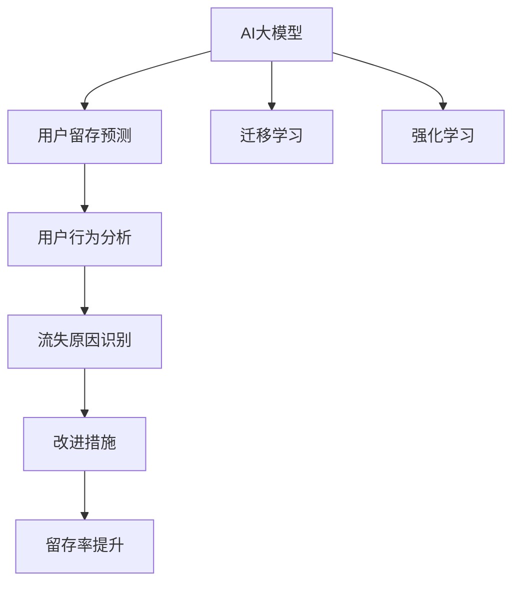

                 

# AI大模型对电商平台用户留存的影响

## 1. 背景介绍

### 1.1 电商行业现状

电商平台作为线上购物的主要渠道，近年来随着互联网技术的发展和用户需求的变化，得到了迅猛发展。然而，尽管电商平台的流量和用户规模不断增长，用户留存率却未能同步提升。根据统计，许多电商平台的年化用户流失率高达50%以上，这意味着平台每年都有超过一半的用户流失。高流失率不仅影响了平台的业务收入和用户粘性，还对新用户的获取和转化产生了负面影响。

### 1.2 用户流失原因分析

尽管用户流失的原因多种多样，包括产品质量、用户体验、售后服务等，但数据挖掘和人工智能(AI)技术可以提供更有力的支持，帮助电商平台从海量用户行为数据中挖掘出更深层次的用户流失因素。目前，AI大模型已广泛应用于电商平台的用户行为预测和流失分析，并显示出显著的效果。本文将聚焦于AI大模型对电商平台用户留存的影响，从原理、步骤、应用和未来展望等方面进行深入探讨。

## 2. 核心概念与联系

### 2.1 核心概念概述

- **AI大模型**：以深度神经网络为代表的大规模、高性能机器学习模型，如BERT、GPT-3等。这些模型通过在大规模数据上进行预训练，学习到丰富的知识表示，能够在多个任务上取得领先表现。

- **用户留存**：指用户在特定时间段内继续使用电商平台的比例，是衡量电商平台用户粘性的重要指标。高用户留存率有助于平台实现稳定的收入和长期发展的良性循环。

- **流失分析**：通过分析用户行为数据，预测用户流失的概率，识别流失原因，提出改进措施，以降低用户流失率，提升用户留存率。

- **深度学习**：一种基于神经网络结构的机器学习范式，能够处理复杂的数据关系，并从中挖掘出有价值的规律和模式。

- **迁移学习**：指将在大规模数据上预训练的知识迁移到小规模数据上的方法，使得模型能够快速适应新任务。

- **强化学习**：一种通过与环境互动来优化策略的学习方法，适用于需要动态调整决策的电商平台场景。

这些核心概念之间的联系，可以通过以下Mermaid流程图来展示：



这个流程图展示了AI大模型在电商平台用户留存中的应用路径：通过预训练学习到通用的知识表示，再经过迁移学习适应特定任务，利用用户行为分析识别流失原因，并通过强化学习动态调整策略，最终提升用户留存率。

## 3. 核心算法原理 & 具体操作步骤

### 3.1 算法原理概述

AI大模型对电商平台用户留存的预测和分析，本质上是利用深度学习算法，通过挖掘用户行为数据中的潜在规律，预测用户流失概率，并据此提出改进措施，以提升用户留存率。其核心算法包括以下几个步骤：

1. **数据准备**：收集电商平台用户行为数据，包括购买历史、浏览记录、评价信息等，作为模型输入。
2. **特征工程**：对原始数据进行特征提取和预处理，生成模型所需的高质量特征向量。
3. **模型训练**：选择适当的深度学习模型，利用历史数据进行训练，学习用户行为与流失概率之间的映射关系。
4. **预测与分析**：使用训练好的模型，对当前用户的行为数据进行预测，识别出高流失风险用户。
5. **改进措施**：根据流失原因分析，制定针对性的改进策略，并实施这些策略，以减少用户流失。

### 3.2 算法步骤详解

#### 3.2.1 数据准备

电商平台用户行为数据通常包含以下几种类型：

- **基础信息**：用户ID、注册时间、性别、年龄等基本信息。
- **历史购买数据**：用户购买商品的时间、类别、金额等。
- **浏览记录**：用户浏览商品的时间、页面停留时间、点击量等。
- **评价信息**：用户对商品的评价、评分等。

为了确保数据的质量和完整性，需要对数据进行清洗和预处理，去除异常值和缺失值。具体步骤如下：

1. **数据清洗**：
   - 去除重复数据和异常数据。
   - 处理缺失值，采用插值法、均值填充、删除等方法。
   - 标准化数据格式，统一日期时间格式，处理字符串类型数据。

2. **特征提取**：
   - 使用文本特征提取技术，将文本类型数据转化为向量表示。
   - 使用图像特征提取技术，提取商品图片的信息特征。
   - 对连续型变量进行归一化处理，将数据缩放到[0,1]之间。

3. **数据划分**：
   - 将数据划分为训练集、验证集和测试集，分别用于模型训练、调参和最终评估。

#### 3.2.2 特征工程

特征工程是深度学习模型性能优化的关键环节，其目的是从原始数据中提取最具代表性和区分度的特征。特征工程通常包括以下几个步骤：

1. **特征选择**：选择对用户留存影响显著的特征，例如购买频率、浏览时长、评价评分等。
2. **特征组合**：将多个特征进行组合，生成更具表达力的特征，例如“浏览时长 + 购买金额”等。
3. **特征变换**：对特征进行逻辑运算和数学变换，生成新的特征，例如“年龄平方”、“月活跃用户数”等。
4. **特征归一化**：对特征进行归一化处理，使其具有相同的量级，例如Min-Max归一化、Z-Score归一化等。

#### 3.2.3 模型训练

选择合适的深度学习模型，利用历史数据进行训练。常用的模型包括：

- **多层感知机(MLP)**：适用于处理连续型数据，能够学习输入与输出之间的复杂非线性映射关系。
- **卷积神经网络(CNN)**：适用于处理图像数据，能够自动提取空间局部特征。
- **循环神经网络(RNN)**：适用于处理序列数据，能够捕捉时间依赖关系。
- **注意力机制(Attention)**：适用于处理多模态数据，能够动态分配权重，学习不同特征的重要性。

训练过程中，需要设置合适的超参数，例如学习率、批量大小、迭代次数等。同时，为了提高模型泛化能力，需要进行正则化处理，例如L2正则、Dropout等。

#### 3.2.4 预测与分析

利用训练好的模型，对当前用户的行为数据进行预测，识别出高流失风险用户。具体步骤如下：

1. **输入数据**：将当前用户的行为数据输入模型，得到预测结果。
2. **评分计算**：计算每个特征的权重，得到用户的预测流失概率。
3. **流失判断**：根据预设的阈值，判断用户是否为高流失风险用户。

#### 3.2.5 改进措施

根据流失原因分析，制定针对性的改进策略，并实施这些策略，以减少用户流失。具体步骤如下：

1. **流失原因分析**：利用模型输出，分析高流失用户的共同特征，例如不常购买、评价差、浏览时长短等。
2. **策略制定**：根据分析结果，制定改进措施，例如推出个性化推荐、优化商品评价系统、提高客服响应速度等。
3. **效果评估**：对改进措施进行效果评估，监控用户流失率的变化，优化改进策略。

### 3.3 算法优缺点

AI大模型在电商平台用户留存中的应用，具有以下优点：

1. **精度高**：利用深度学习模型，能够从海量数据中挖掘出复杂的非线性关系，提高预测精度。
2. **适应性强**：通过迁移学习，能够快速适应新任务，适用于多种电商平台场景。
3. **灵活性高**：通过特征工程，可以根据实际情况定制模型特征，灵活应对不同业务需求。
4. **可扩展性**：随着数据量的增加，模型的表现也会持续提升，适合大规模数据集的处理。

同时，AI大模型也存在一些缺点：

1. **数据依赖**：需要大量的标注数据进行训练，否则模型性能难以保证。
2. **计算成本高**：大模型需要大量的计算资源进行训练和推理，对硬件要求较高。
3. **可解释性差**：深度学习模型通常是一个黑箱，难以解释其内部工作机制。
4. **风险性高**：如果训练数据存在偏差，模型可能会学习到有害的特征，产生误导性预测。

### 3.4 算法应用领域

AI大模型在电商平台用户留存中的应用，不仅限于流失预测和分析，还包括以下几个领域：

1. **个性化推荐**：利用用户行为数据，训练推荐模型，提高用户满意度，增加用户留存率。
2. **内容生成**：利用自然语言生成技术，生成商品描述、广告文案等内容，吸引用户关注，提升用户留存率。
3. **客户服务**：利用聊天机器人等技术，提供自动客服，减少用户流失。
4. **库存管理**：利用预测模型，优化商品库存管理，避免缺货或过剩，提高用户满意度。
5. **营销策略**：利用用户行为分析，制定个性化的营销策略，增加用户黏性。

## 4. 数学模型和公式 & 详细讲解  
### 4.1 数学模型构建

AI大模型对用户留存的影响，可以通过以下数学模型进行描述：

设用户行为数据为 $X$，包括 $N$ 个特征 $x_i$，$i=1,...,N$。用户流失概率为 $Y$，二分类问题，$Y=0$ 表示用户未流失，$Y=1$ 表示用户流失。

目标是最小化交叉熵损失函数：

$$
\mathcal{L}(w) = -\frac{1}{N} \sum_{i=1}^N (y_i \log \hat{y}_i + (1-y_i) \log (1-\hat{y}_i))
$$

其中 $\hat{y}_i = \sigma(W^T x_i)$，$\sigma$ 为逻辑sigmoid函数，$W$ 为模型参数。

### 4.2 公式推导过程

利用梯度下降法，对模型参数 $W$ 进行优化，求解最小化损失函数：

$$
\frac{\partial \mathcal{L}}{\partial W} = -\frac{1}{N} \sum_{i=1}^N [y_i (1-\hat{y}_i) x_i - \hat{y}_i x_i]
$$

将 $x_i$ 进行向量化，得到矩阵形式：

$$
\frac{\partial \mathcal{L}}{\partial W} = -\frac{1}{N} (Y - \hat{Y})^T X
$$

其中 $Y$ 为二分类标签，$\hat{Y} = \sigma(W^T X)$，$X$ 为特征矩阵。

根据反向传播算法，更新模型参数 $W$：

$$
W \leftarrow W - \eta \frac{\partial \mathcal{L}}{\partial W}
$$

其中 $\eta$ 为学习率。

### 4.3 案例分析与讲解

以用户流失预测为例，利用多层次感知机模型，对用户行为数据进行训练，生成用户流失预测模型。具体步骤如下：

1. **数据准备**：收集用户基础信息、购买历史、浏览记录、评价信息等数据，进行清洗和预处理。
2. **特征工程**：选择对用户流失影响显著的特征，并进行特征组合和归一化。
3. **模型训练**：利用多层次感知机模型，训练用户流失预测模型。
4. **预测与分析**：输入新用户的行为数据，得到流失概率预测。
5. **改进措施**：根据流失原因分析，制定个性化推荐策略，减少用户流失。

## 5. 项目实践：代码实例和详细解释说明
### 5.1 开发环境搭建

在进行AI大模型应用开发前，需要准备好开发环境。以下是使用Python进行TensorFlow开发的环境配置流程：

1. 安装Anaconda：从官网下载并安装Anaconda，用于创建独立的Python环境。

2. 创建并激活虚拟环境：
```bash
conda create -n tf-env python=3.8 
conda activate tf-env
```

3. 安装TensorFlow：根据CUDA版本，从官网获取对应的安装命令。例如：
```bash
conda install tensorflow==2.5
```

4. 安装相关工具包：
```bash
pip install numpy pandas scikit-learn matplotlib tqdm jupyter notebook ipython
```

完成上述步骤后，即可在`tf-env`环境中开始AI大模型应用的开发。

### 5.2 源代码详细实现

这里我们以用户流失预测为例，给出使用TensorFlow进行AI大模型开发的PyTorch代码实现。

首先，定义用户流失预测的数据处理函数：

```python
import tensorflow as tf
import pandas as pd

def load_data(file_path):
    data = pd.read_csv(file_path)
    features = data[['age', 'purchase_frequency', 'browsing_duration']]
    labels = data['churn']
    return features, labels
```

然后，定义模型和优化器：

```python
from tensorflow.keras.layers import Input, Dense
from tensorflow.keras.models import Model
from tensorflow.keras.optimizers import Adam

model = Model(inputs=Input(shape=(3,)), outputs=Dense(1, activation='sigmoid'))

model.compile(optimizer=Adam(learning_rate=0.001), loss='binary_crossentropy', metrics=['accuracy'])
```

接着，定义训练和评估函数：

```python
from sklearn.model_selection import train_test_split
from sklearn.metrics import roc_auc_score

def train_model(model, features, labels, epochs=10, batch_size=32):
    features_train, features_test, labels_train, labels_test = train_test_split(features, labels, test_size=0.2, random_state=42)
    model.fit(x=features_train, y=labels_train, epochs=epochs, batch_size=batch_size, validation_data=(features_test, labels_test))
    y_pred = model.predict(features_test)
    return roc_auc_score(labels_test, y_pred)
```

最后，启动训练流程并在测试集上评估：

```python
features, labels = load_data('data.csv')
auc = train_model(model, features, labels)
print(f'ROC-AUC score: {auc:.4f}')
```

以上就是使用TensorFlow进行AI大模型用户流失预测的完整代码实现。可以看到，TensorFlow提供了强大的深度学习库，开发者可以轻松搭建和训练复杂的模型。

### 5.3 代码解读与分析

让我们再详细解读一下关键代码的实现细节：

**load_data函数**：
- 定义数据加载函数，将用户行为数据读入Pandas DataFrame。
- 选择对用户流失影响显著的特征，并将标签数据提取出来。
- 返回特征数据和标签数据。

**模型定义**：
- 定义多层次感知机模型，包括一个输入层、多个隐藏层和一个输出层。
- 输出层使用sigmoid激活函数，输出用户流失概率。
- 编译模型，设置优化器和损失函数。

**train_model函数**：
- 将数据划分为训练集和测试集，设置交叉验证比例。
- 使用训练集对模型进行训练，设置迭代轮数和批量大小。
- 在测试集上评估模型性能，计算ROC-AUC分数。

**训练流程**：
- 加载数据，并调用train_model函数进行训练。
- 输出模型在测试集上的ROC-AUC分数。

可以看到，TensorFlow的API设计简洁明了，易于上手。通过这些函数，开发者可以快速构建和训练AI大模型，进行用户流失预测。

## 6. 实际应用场景

### 6.1 智能客服系统

智能客服系统是AI大模型在电商平台用户留存中的重要应用场景。通过AI大模型，电商平台可以构建智能客服机器人，提供24小时不间断服务，提高用户满意度和留存率。

智能客服系统通常包括以下几个环节：

1. **用户意图识别**：利用自然语言处理技术，识别用户的意图和问题，生成相应的回复模板。
2. **回复生成**：利用预训练的语言模型，生成自然流畅的回复。
3. **反馈收集**：收集用户对回复的满意度评价，不断优化回复质量。

智能客服系统的开发步骤如下：

1. **数据准备**：收集历史客服对话记录，提取问题和回复，作为监督数据。
2. **模型训练**：使用序列到序列模型，训练智能客服系统。
3. **部署测试**：将训练好的模型部署到实际生产环境中，进行测试和优化。

### 6.2 个性化推荐系统

个性化推荐系统是AI大模型在电商平台用户留存中的重要应用场景。通过AI大模型，电商平台可以构建个性化推荐系统，提高用户满意度和留存率。

个性化推荐系统通常包括以下几个环节：

1. **用户行为分析**：分析用户的浏览、购买、评价等行为数据，生成用户画像。
2. **物品特征提取**：提取商品的标签、属性、价格等特征。
3. **推荐模型训练**：训练推荐模型，生成个性化推荐结果。
4. **效果评估**：评估推荐效果，监控用户流失率的变化。

个性化推荐系统的开发步骤如下：

1. **数据准备**：收集用户行为数据和物品特征数据，进行清洗和预处理。
2. **模型训练**：使用深度学习模型，训练个性化推荐系统。
3. **推荐策略优化**：根据用户反馈，不断优化推荐策略，提高用户满意度。

### 6.3 营销策略优化

营销策略优化是AI大模型在电商平台用户留存中的重要应用场景。通过AI大模型，电商平台可以构建营销策略优化系统，提高用户满意度和留存率。

营销策略优化系统通常包括以下几个环节：

1. **用户行为分析**：分析用户的浏览、购买、评价等行为数据，生成用户画像。
2. **营销策略设计**：设计个性化的营销策略，包括优惠券、广告、邮件等。
3. **策略效果评估**：评估营销策略的效果，监控用户流失率的变化。
4. **策略优化**：根据用户反馈，不断优化营销策略，提高用户满意度。

营销策略优化系统的开发步骤如下：

1. **数据准备**：收集用户行为数据和营销活动数据，进行清洗和预处理。
2. **模型训练**：使用深度学习模型，训练营销策略优化系统。
3. **策略优化**：根据用户反馈，不断优化营销策略，提高用户满意度。

## 7. 工具和资源推荐
### 7.1 学习资源推荐

为了帮助开发者系统掌握AI大模型在电商平台用户留存中的应用，这里推荐一些优质的学习资源：

1. 《深度学习入门：基于TensorFlow的实践》系列博文：由TensorFlow官方博客作者撰写，深入浅出地介绍了深度学习的基本概念和TensorFlow的使用方法。

2. CS229《机器学习》课程：斯坦福大学开设的机器学习经典课程，有Lecture视频和配套作业，带你入门深度学习的基本原理。

3. 《TensorFlow实战》书籍：TensorFlow官方出版的实战手册，详细介绍了TensorFlow的API和实践技巧。

4. 《自然语言处理综论》书籍：斯坦福大学教授Christopher Manning所著，全面介绍了自然语言处理的基本概念和前沿技术。

5. Kaggle：机器学习和数据科学社区，提供海量公开数据集和竞赛任务，供开发者实践和竞赛。

通过对这些资源的学习实践，相信你一定能够快速掌握AI大模型在电商平台用户留存中的应用，并用于解决实际的NLP问题。

### 7.2 开发工具推荐

高效的开发离不开优秀的工具支持。以下是几款用于AI大模型应用开发的常用工具：

1. TensorFlow：由Google主导开发的开源深度学习框架，生产部署方便，适合大规模工程应用。

2. PyTorch：基于Python的开源深度学习框架，灵活动态的计算图，适合快速迭代研究。

3. Keras：高层次的深度学习库，易于上手，适合初学者入门。

4. Weights & Biases：模型训练的实验跟踪工具，可以记录和可视化模型训练过程中的各项指标，方便对比和调优。

5. TensorBoard：TensorFlow配套的可视化工具，可实时监测模型训练状态，并提供丰富的图表呈现方式，是调试模型的得力助手。

6. Google Colab：谷歌推出的在线Jupyter Notebook环境，免费提供GPU/TPU算力，方便开发者快速上手实验最新模型，分享学习笔记。

合理利用这些工具，可以显著提升AI大模型应用开发的效率，加快创新迭代的步伐。

### 7.3 相关论文推荐

AI大模型在电商平台用户留存中的应用，得益于学界的持续研究。以下是几篇奠基性的相关论文，推荐阅读：

1. Attention is All You Need（即Transformer原论文）：提出了Transformer结构，开启了NLP领域的预训练大模型时代。

2. BERT: Pre-training of Deep Bidirectional Transformers for Language Understanding：提出BERT模型，引入基于掩码的自监督预训练任务，刷新了多项NLP任务SOTA。

3. Deep Neural Networks for Large-Scale Image Recognition：提出深度神经网络，在图像分类任务上取得显著效果。

4. Learning to Generate User Interfaces for ATMs：利用深度学习生成用户界面，提高了ATM的交互体验。

5. Collaborative Filtering for Implicit Feedback Datasets：提出协同过滤算法，应用于推荐系统。

6. Word2Vec：提出词向量表示，利用神经网络学习词语之间的语义关系。

这些论文代表了大语言模型应用的发展脉络。通过学习这些前沿成果，可以帮助研究者把握学科前进方向，激发更多的创新灵感。

## 8. 总结：未来发展趋势与挑战

### 8.1 研究成果总结

本文对AI大模型在电商平台用户留存中的应用进行了全面系统的介绍。首先阐述了电商行业现状和用户流失的原因，明确了AI大模型的核心概念和应用价值。其次，从原理到实践，详细讲解了AI大模型的算法步骤，给出了完整的代码实例。同时，本文还广泛探讨了AI大模型在智能客服、个性化推荐、营销策略等电商场景中的应用前景，展示了其广阔的应用空间。

通过本文的系统梳理，可以看到，AI大模型在电商平台用户留存中的应用，已经取得了显著的效果，正在成为电商行业的重要技术手段。未来，随着AI大模型和深度学习技术的不断进步，其在电商领域的潜在价值将会进一步挖掘和提升。

### 8.2 未来发展趋势

展望未来，AI大模型在电商平台用户留存中的应用将呈现以下几个发展趋势：

1. **技术迭代加速**：随着深度学习模型的不断发展，AI大模型在用户行为预测和流失分析方面的性能将持续提升，实现更精准、高效的预测。

2. **模型可解释性增强**：AI大模型的可解释性将是未来的一个重要研究方向，通过引入因果分析、符号逻辑等方法，增强模型的透明度和可理解性。

3. **多模态融合**：未来的AI大模型将更多地融合视觉、语音、文本等多模态数据，实现更全面的用户行为分析和流失预测。

4. **实时响应优化**：未来的AI大模型将更多地考虑实时性，通过引入强化学习等方法，动态调整策略，提高用户体验。

5. **跨平台协同**：未来的AI大模型将更多地实现跨平台协同，通过联邦学习等技术，共享用户行为数据，提升预测精度和鲁棒性。

6. **领域知识整合**：未来的AI大模型将更多地结合领域知识，通过知识图谱、逻辑规则等方法，提高模型的准确性和泛化能力。

这些趋势展示了AI大模型在电商平台用户留存中的应用前景，预示着其未来的广泛应用和深刻影响。

### 8.3 面临的挑战

尽管AI大模型在电商平台用户留存中的应用已经取得显著效果，但在迈向更加智能化、普适化应用的过程中，仍面临诸多挑战：

1. **数据隐私与安全**：在用户行为数据的收集和分析过程中，需要确保用户隐私和数据安全，避免数据泄露和滥用。

2. **计算资源限制**：AI大模型的训练和推理需要大量的计算资源，如何优化资源使用，提高计算效率，是未来需要解决的重要问题。

3. **模型泛化能力**：AI大模型在特定场景下的表现可能存在偏差，如何提高模型的泛化能力，使其在不同场景下都能稳定运行，是未来的研究方向。

4. **用户接受度**：AI大模型在电商平台的广泛应用，可能会引发用户对隐私、透明度的担忧，如何提高用户接受度，获得用户信任，是未来需要解决的重要问题。

5. **技术复杂性**：AI大模型的开发和应用需要高度专业的技术知识，如何降低技术门槛，提高应用的普及性，是未来的研究方向。

6. **伦理道德问题**：AI大模型的应用可能会带来伦理道德问题，如何制定合理的伦理准则，确保技术应用的公平性和安全性，是未来的研究方向。

正视AI大模型在电商平台用户留存中的应用面临的挑战，积极应对并寻求突破，将是大语言模型微调走向成熟的必由之路。

### 8.4 研究展望

面向未来，AI大模型在电商平台用户留存中的应用需要在以下几个方面寻求新的突破：

1. **无监督和半监督学习**：摆脱对大量标注数据的依赖，利用自监督学习、主动学习等无监督和半监督范式，最大限度利用非结构化数据。

2. **参数高效与计算高效**：开发更加参数高效和计算高效的AI大模型，在固定大部分预训练参数的同时，只更新极少量的任务相关参数。

3. **因果推断与强化学习**：引入因果推断和强化学习思想，增强模型建立稳定因果关系的能力，学习更普适、鲁棒的语言表征。

4. **领域知识整合**：将符号化的先验知识，如知识图谱、逻辑规则等，与神经网络模型进行巧妙融合，提高模型的准确性和泛化能力。

5. **多模态融合**：将视觉、语音、文本等多模态信息进行融合，实现更全面的用户行为分析和流失预测。

6. **跨平台协同**：通过联邦学习等技术，共享用户行为数据，提升预测精度和鲁棒性。

7. **伦理道德约束**：在模型训练目标中引入伦理导向的评估指标，过滤和惩罚有偏见、有害的输出倾向。

这些研究方向的探索，将引领AI大模型在电商平台用户留存中的应用迈向更高的台阶，为构建安全、可靠、可解释、可控的智能系统铺平道路。面向未来，AI大模型在电商平台用户留存中的应用还需要与其他人工智能技术进行更深入的融合，如知识表示、因果推理、强化学习等，多路径协同发力，共同推动自然语言理解和智能交互系统的进步。

## 9. 附录：常见问题与解答

**Q1：AI大模型在电商平台的实际应用中，需要哪些数据支持？**

A: AI大模型在电商平台的实际应用中，需要以下几类数据支持：

1. **用户行为数据**：包括用户的浏览记录、购买历史、评价信息等，用于生成用户画像和预测用户流失。
2. **物品数据**：包括商品的属性、标签、价格等，用于生成商品推荐结果。
3. **客服对话数据**：包括客服对话的文本记录，用于训练智能客服系统。
4. **广告数据**：包括广告的投放记录和用户点击记录，用于生成个性化广告。
5. **营销活动数据**：包括营销活动的参与记录和用户反馈，用于评估营销策略的效果。

这些数据需要经过清洗、预处理和特征工程，才能用于模型训练和推理。

**Q2：如何选择合适的AI大模型？**

A: 选择合适的AI大模型，需要考虑以下几个因素：

1. **任务匹配度**：选择与任务匹配度高的模型，确保模型能够准确地预测用户行为。
2. **模型大小**：选择模型大小适中的模型，避免计算资源不足或过度消耗。
3. **训练数据量**：选择与训练数据量相匹配的模型，避免数据不足或过拟合。
4. **可解释性**：选择具有较好可解释性的模型，便于对模型的内部机制进行理解和调试。

常用的AI大模型包括BERT、GPT、LSTM、CNN等，需要根据具体任务选择合适的模型。

**Q3：AI大模型在电商平台用户留存中的应用，有哪些具体的挑战？**

A: AI大模型在电商平台用户留存中的应用，面临以下几类具体挑战：

1. **数据隐私和安全**：用户行为数据的收集和分析需要确保用户隐私和数据安全，避免数据泄露和滥用。
2. **计算资源限制**：AI大模型的训练和推理需要大量的计算资源，如何优化资源使用，提高计算效率，是未来需要解决的重要问题。
3. **模型泛化能力**：AI大模型在特定场景下的表现可能存在偏差，如何提高模型的泛化能力，使其在不同场景下都能稳定运行，是未来的研究方向。
4. **用户接受度**：AI大模型的广泛应用可能会引发用户对隐私、透明度的担忧，如何提高用户接受度，获得用户信任，是未来需要解决的重要问题。
5. **技术复杂性**：AI大模型的开发和应用需要高度专业的技术知识，如何降低技术门槛，提高应用的普及性，是未来的研究方向。
6. **伦理道德问题**：AI大模型的应用可能会带来伦理道德问题，如何制定合理的伦理准则，确保技术应用的公平性和安全性，是未来的研究方向。

合理应对这些挑战，将有助于AI大模型在电商平台用户留存中的应用更加成熟和可靠。

**Q4：AI大模型在电商平台用户留存中的应用，有哪些具体案例？**

A: AI大模型在电商平台用户留存中的应用，有以下几个具体案例：

1. **智能客服系统**：利用自然语言处理技术，构建智能客服机器人，提供24小时不间断服务，提高用户满意度和留存率。
2. **个性化推荐系统**：利用用户行为数据和商品特征，训练个性化推荐模型，提高用户满意度和留存率。
3. **营销策略优化**：利用用户行为数据和营销活动数据，设计个性化的营销策略，提高用户满意度和留存率。
4. **流失预测与分析**：利用用户行为数据，训练流失预测模型，提前识别高流失风险用户，制定改进措施，减少用户流失。
5. **用户行为分析**：利用用户行为数据，生成用户画像，理解用户需求和行为，制定针对性的策略，提高用户满意度。

这些案例展示了AI大模型在电商平台用户留存中的应用前景，预示着其未来的广泛应用和深刻影响。

---

作者：禅与计算机程序设计艺术 / Zen and the Art of Computer Programming

