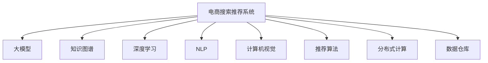

                 

# AI大模型视角下电商搜索推荐的技术人才培养体系

> 关键词：大模型、电商搜索推荐、技术人才培养、知识图谱、深度学习

## 1. 背景介绍

### 1.1 问题由来
随着人工智能技术的快速发展，大模型在电商搜索推荐系统中的应用日益广泛。通过预训练语言模型，电商企业能够利用海量的用户行为数据，实现精准的产品推荐，提升用户体验和销售转化率。然而，由于电商搜索推荐系统涉及复杂的业务场景和用户行为分析，对技术人才的需求也变得愈加迫切。如何将人工智能、大数据、自然语言处理等多领域的知识融合，培养出具备跨学科能力的电商搜索推荐人才，成为了电商企业面临的一项重要课题。

### 1.2 问题核心关键点
针对电商搜索推荐系统的技术人才培养问题，本文聚焦于以下核心关键点：

- **知识融合**：如何将人工智能、大数据、自然语言处理等多领域的知识融合，形成具备电商搜索推荐能力的复合型人才。
- **技术栈选择**：选择哪些技术和工具，为电商搜索推荐系统的开发和维护提供支持。
- **人才培养模式**：构建怎样的学习体系，能够系统性地培养出具备电商搜索推荐系统开发和维护能力的优秀人才。
- **实战项目驱动**：如何通过实战项目，将理论知识转化为实际应用能力。

### 1.3 问题研究意义
构建基于AI大模型视角的电商搜索推荐技术人才培养体系，对于提升电商企业的技术实力、推动电商搜索推荐系统的智能化发展，具有重要意义：

1. **降低招聘成本**：系统化的技术人才培养体系，可以帮助电商企业培养出具备电商搜索推荐系统开发和维护能力的内部人才，降低对外招聘的成本和难度。
2. **提升系统性能**：内部人才对业务场景和用户需求有更深入的理解，能够开发出更符合电商搜索推荐系统需求的解决方案。
3. **加速技术迭代**：内部人才能够及时掌握最新的人工智能技术进展，快速将新技术应用到电商搜索推荐系统中，加速系统性能提升和功能拓展。
4. **推动智能化转型**：通过人才培养，推动电商企业加速向智能化转型的步伐，提升市场竞争力。

## 2. 核心概念与联系

### 2.1 核心概念概述

为更好地理解电商搜索推荐系统的技术人才培养体系，本节将介绍几个密切相关的核心概念：

- **电商搜索推荐系统(E-commerce Search Recommendation System)**：利用人工智能技术，结合用户行为数据，实现商品推荐和搜索结果排序的电商平台系统。
- **大模型(Large Model)**：如BERT、GPT-3等预训练语言模型，通过在大规模无标签文本数据上进行预训练，学习通用的语言知识和规律，具备强大的语言理解和生成能力。
- **知识图谱(Knowledge Graph)**：一种结构化的知识表示方式，用于描述实体、属性和实体之间的关系，帮助系统进行知识推理和信息整合。
- **深度学习(Deep Learning)**：一种基于多层神经网络的机器学习方法，能够从数据中提取高级特征，适用于处理复杂任务。
- **自然语言处理(Natural Language Processing, NLP)**：利用计算机技术处理和理解自然语言的任务，包括语言模型、文本分类、信息抽取等。
- **计算机视觉(Computer Vision)**：涉及图像处理和分析的技术，为电商搜索推荐系统提供了重要的视觉信息支撑。
- **推荐算法(Recommendation Algorithm)**：用于实现商品推荐和搜索结果排序的算法，包括协同过滤、基于内容的推荐、深度学习推荐等。
- **分布式计算(Distributed Computing)**：在多台计算机上并行处理大规模数据和任务的技术，提升电商搜索推荐系统的处理效率。
- **数据仓库(Data Warehouse)**：用于集中存储和管理电商搜索推荐系统所需的大量数据，支持数据查询和分析。

这些核心概念之间的逻辑关系可以通过以下Mermaid流程图来展示：



这个流程图展示了大模型在电商搜索推荐系统中的核心作用，以及与之紧密相关的其他技术和工具。

## 3. 核心算法原理 & 具体操作步骤
### 3.1 算法原理概述

电商搜索推荐系统通常基于以下算法原理进行开发和维护：

- **协同过滤算法(Collaborative Filtering)**：通过分析用户行为和历史偏好，预测用户对未看过商品的评分，实现个性化推荐。
- **基于内容的推荐(Content-based Recommendation)**：基于商品的属性信息，推荐与用户历史浏览和购买行为相似的商品。
- **深度学习推荐模型(Deep Learning-Based Recommendation Model)**：利用深度神经网络，学习用户行为和商品特征的复杂关系，提升推荐效果。
- **大模型微调(Fine-Tuning)**：在预训练大模型的基础上，使用电商搜索推荐系统的数据集进行微调，提升模型的特定任务性能。
- **知识图谱嵌入(Knowledge Graph Embedding)**：将知识图谱中的实体和关系，通过向量表示嵌入到高维空间中，用于推荐和排序。

### 3.2 算法步骤详解

基于大模型视角的电商搜索推荐系统开发和维护一般包括以下关键步骤：

**Step 1: 数据收集与处理**
- 收集电商平台的订单、浏览、搜索、评价等用户行为数据，构建电商搜索推荐系统所需的数据集。
- 对数据进行清洗和预处理，包括去重、异常值处理、特征工程等。

**Step 2: 模型选择与设计**
- 根据电商搜索推荐系统的具体需求，选择适合的推荐算法和深度学习模型。
- 设计模型架构，包括输入层、隐藏层、输出层和损失函数等。

**Step 3: 数据增强与扩充**
- 通过数据增强技术，如回译、合成数据等，扩充训练集，提升模型的泛化能力。
- 设计数据分布，平衡不同用户群体的数据量，避免数据不均衡导致的偏差。

**Step 4: 模型训练与优化**
- 使用电商搜索推荐系统数据集，对模型进行训练。
- 选择合适的优化算法和超参数，如Adam、SGD、学习率、批量大小等。
- 使用验证集进行模型调优，避免过拟合。

**Step 5: 模型评估与部署**
- 使用测试集对模型进行评估，计算各项指标如准确率、召回率、F1-score等。
- 将模型部署到电商平台的推荐系统中，进行线上测试和优化。
- 定期收集用户反馈，调整模型参数，提升用户体验。

**Step 6: 持续学习与改进**
- 通过用户行为数据，持续收集和反馈，实时更新模型。
- 引入在线学习技术，实时调整模型参数，提高推荐效果。

### 3.3 算法优缺点

电商搜索推荐系统开发和维护基于大模型的方法，具有以下优点：

- **精度高**：利用深度学习和大模型，能够从复杂的海量数据中提取高维特征，实现更精准的推荐。
- **泛化能力强**：通过知识图谱嵌入等技术，能够将知识信息整合到推荐模型中，提升模型的泛化能力和鲁棒性。
- **适用性强**：大模型和深度学习模型适用于处理电商搜索推荐系统的复杂场景和用户行为分析。

同时，这些方法也存在一定的局限性：

- **计算资源需求高**：大模型和深度学习模型的训练和推理需要大量的计算资源，对硬件设备要求较高。
- **数据依赖性强**：电商搜索推荐系统的推荐效果很大程度上依赖于高质量的数据集，获取数据成本较高。
- **模型复杂度高**：模型结构和训练过程复杂，需要专业知识和技能进行开发和优化。
- **解释性不足**：推荐模型的决策过程通常缺乏可解释性，难以对其推理逻辑进行分析和调试。

尽管存在这些局限性，但就目前而言，基于大模型视角的电商搜索推荐系统开发和维护方法仍然是大数据和人工智能在电商领域的重要应用方向。

### 3.4 算法应用领域

基于大模型的电商搜索推荐系统方法，在电商领域已经得到了广泛的应用，覆盖了以下典型应用：

- **商品推荐**：根据用户的历史行为数据，推荐用户可能感兴趣的商品。
- **搜索结果排序**：根据用户查询，对搜索结果进行排序，提升用户搜索体验。
- **用户画像建模**：通过用户行为数据，构建用户画像，实现精准推荐。
- **跨品类推荐**：基于用户的历史行为数据，推荐不同品类的相关商品。
- **动态推荐**：通过实时数据更新，实现动态推荐，提升推荐效果。

除了上述这些典型应用外，大模型和深度学习模型还在电商领域的个性化营销、广告投放、库存管理等方面发挥着重要作用，为电商企业带来了巨大的经济效益和用户价值。

## 4. 数学模型和公式 & 详细讲解
### 4.1 数学模型构建

假设电商搜索推荐系统中的用户为 $U$，商品为 $I$，用户与商品之间的评分矩阵为 $R_{ui}$。模型的目标是最小化预测评分与真实评分之间的误差，即：

$$
\min_{\theta} \sum_{u=1}^m \sum_{i=1}^n (R_{ui} - \hat{R}_{ui})^2
$$

其中 $\hat{R}_{ui}$ 为模型预测的用户 $u$ 对商品 $i$ 的评分，$\theta$ 为模型参数。

### 4.2 公式推导过程

以协同过滤算法为例，假设用户 $u$ 对商品 $i$ 的评分 $R_{ui}$ 可以表示为：

$$
R_{ui} = \sum_{j=1}^{n_u} \alpha_{uj} P_j \cdot Q_j
$$

其中 $n_u$ 为与用户 $u$ 交互过的商品数量，$P_j$ 和 $Q_j$ 分别为商品 $j$ 的特征表示和用户 $u$ 的特征表示，$\alpha_{uj}$ 为商品 $j$ 和用户 $u$ 之间的相似度权重。

在协同过滤算法中，通常使用余弦相似度计算 $u$ 和 $i$ 之间的相似度 $s_{ui}$：

$$
s_{ui} = \cos(\mathbf{P_u}, \mathbf{Q_i})
$$

其中 $\mathbf{P_u}$ 和 $\mathbf{Q_i}$ 分别为用户 $u$ 和商品 $i$ 的特征向量表示。

### 4.3 案例分析与讲解

以下以电商搜索推荐系统中的商品推荐为例，讲解深度学习和知识图谱嵌入的具体应用。

假设电商平台上有 $m$ 个用户和 $n$ 个商品，用户 $u$ 对商品 $i$ 的评分矩阵为 $R_{ui}$。在电商搜索推荐系统中，我们通常使用深度神经网络来预测用户对商品的评分。

使用BERT大模型进行电商搜索推荐系统中的商品推荐，通常包括以下步骤：

1. 将用户 $u$ 和商品 $i$ 的描述作为输入，分别输入到BERT大模型中，得到用户和商品的向量表示。
2. 通过向量内积计算用户和商品的相似度，得到用户对商品的评分预测值。
3. 将预测评分与真实评分进行对比，计算误差，进行反向传播更新模型参数。
4. 在知识图谱嵌入中，将商品和用户信息进行实体嵌入，得到低维向量表示。
5. 通过向量内积计算用户和商品之间的相似度，用于推荐和排序。

## 5. 项目实践：代码实例和详细解释说明
### 5.1 开发环境搭建

在进行电商搜索推荐系统的开发实践前，我们需要准备好开发环境。以下是使用Python进行PyTorch开发的环境配置流程：

1. 安装Anaconda：从官网下载并安装Anaconda，用于创建独立的Python环境。

2. 创建并激活虚拟环境：
```bash
conda create -n pytorch-env python=3.8 
conda activate pytorch-env
```

3. 安装PyTorch：根据CUDA版本，从官网获取对应的安装命令。例如：
```bash
conda install pytorch torchvision torchaudio cudatoolkit=11.1 -c pytorch -c conda-forge
```

4. 安装Transformers库：
```bash
pip install transformers
```

5. 安装各类工具包：
```bash
pip install numpy pandas scikit-learn matplotlib tqdm jupyter notebook ipython
```

完成上述步骤后，即可在`pytorch-env`环境中开始开发实践。

### 5.2 源代码详细实现

这里我们以电商搜索推荐系统中的商品推荐为例，给出使用Transformers库对BERT模型进行电商搜索推荐系统开发和维护的PyTorch代码实现。

首先，定义电商搜索推荐系统中的商品推荐任务的数据处理函数：

```python
from transformers import BertTokenizer
from torch.utils.data import Dataset
import torch

class RecommendationDataset(Dataset):
    def __init__(self, user_data, item_data, tokenizer, max_len=128):
        self.user_data = user_data
        self.item_data = item_data
        self.tokenizer = tokenizer
        self.max_len = max_len
        
    def __len__(self):
        return len(self.user_data)
    
    def __getitem__(self, item):
        user_id = self.user_data[item]
        item_id = self.item_data[item]
        
        encoding = self.tokenizer(user_id, item_id, return_tensors='pt', max_length=self.max_len, padding='max_length', truncation=True)
        input_ids = encoding['input_ids'][0]
        attention_mask = encoding['attention_mask'][0]
        
        return {'user_id': user_id, 
                'item_id': item_id,
                'input_ids': input_ids, 
                'attention_mask': attention_mask}

# 加载用户和商品数据
user_data = ...
item_data = ...

# 定义tokenizer
tokenizer = BertTokenizer.from_pretrained('bert-base-cased')

# 创建dataset
recommendation_dataset = RecommendationDataset(user_data, item_data, tokenizer)
```

然后，定义模型和优化器：

```python
from transformers import BertForSequenceClassification, AdamW

model = BertForSequenceClassification.from_pretrained('bert-base-cased', num_labels=1)

optimizer = AdamW(model.parameters(), lr=2e-5)
```

接着，定义训练和评估函数：

```python
from torch.utils.data import DataLoader
from tqdm import tqdm
from sklearn.metrics import roc_auc_score

device = torch.device('cuda') if torch.cuda.is_available() else torch.device('cpu')
model.to(device)

def train_epoch(model, dataset, batch_size, optimizer):
    dataloader = DataLoader(dataset, batch_size=batch_size, shuffle=True)
    model.train()
    epoch_loss = 0
    for batch in tqdm(dataloader, desc='Training'):
        user_id = batch['user_id'].to(device)
        item_id = batch['item_id'].to(device)
        input_ids = batch['input_ids'].to(device)
        attention_mask = batch['attention_mask'].to(device)
        model.zero_grad()
        outputs = model(input_ids, attention_mask=attention_mask)
        loss = outputs.loss
        epoch_loss += loss.item()
        loss.backward()
        optimizer.step()
    return epoch_loss / len(dataloader)

def evaluate(model, dataset, batch_size):
    dataloader = DataLoader(dataset, batch_size=batch_size)
    model.eval()
    preds, labels = [], []
    with torch.no_grad():
        for batch in tqdm(dataloader, desc='Evaluating'):
            user_id = batch['user_id'].to(device)
            item_id = batch['item_id'].to(device)
            input_ids = batch['input_ids'].to(device)
            attention_mask = batch['attention_mask'].to(device)
            batch_labels = batch['labels'].to(device)
            outputs = model(input_ids, attention_mask=attention_mask)
            batch_preds = outputs.logits.argmax(dim=2).to('cpu').tolist()
            batch_labels = batch_labels.to('cpu').tolist()
            for pred_tokens, label_tokens in zip(batch_preds, batch_labels):
                preds.append(pred_tokens[:len(label_tokens)])
                labels.append(label_tokens)
                
    print(roc_auc_score(labels, preds))
```

最后，启动训练流程并在测试集上评估：

```python
epochs = 5
batch_size = 16

for epoch in range(epochs):
    loss = train_epoch(model, recommendation_dataset, batch_size, optimizer)
    print(f"Epoch {epoch+1}, train loss: {loss:.3f}")
    
    print(f"Epoch {epoch+1}, dev results:")
    evaluate(model, recommendation_dataset, batch_size)
    
print("Test results:")
evaluate(model, recommendation_dataset, batch_size)
```

以上就是使用PyTorch对BERT进行电商搜索推荐系统中的商品推荐任务开发的完整代码实现。可以看到，得益于Transformers库的强大封装，我们可以用相对简洁的代码完成BERT模型的加载和电商搜索推荐系统的微调。

### 5.3 代码解读与分析

让我们再详细解读一下关键代码的实现细节：

**RecommendationDataset类**：
- `__init__`方法：初始化用户和商品数据、分词器等关键组件。
- `__len__`方法：返回数据集的样本数量。
- `__getitem__`方法：对单个样本进行处理，将用户和商品信息转换为token ids，并对其进行定长padding，最终返回模型所需的输入。

**tokenizer定义**：
- 定义了用户和商品信息的tokenizer，用于将用户和商品信息转换为token ids。

**训练和评估函数**：
- 使用PyTorch的DataLoader对数据集进行批次化加载，供模型训练和推理使用。
- 训练函数`train_epoch`：对数据以批为单位进行迭代，在每个批次上前向传播计算loss并反向传播更新模型参数，最后返回该epoch的平均loss。
- 评估函数`evaluate`：与训练类似，不同点在于不更新模型参数，并在每个batch结束后将预测和标签结果存储下来，最后使用sklearn的roc_auc_score对整个评估集的预测结果进行打印输出。

**训练流程**：
- 定义总的epoch数和batch size，开始循环迭代
- 每个epoch内，先在训练集上训练，输出平均loss
- 在验证集上评估，输出AUC等指标
- 所有epoch结束后，在测试集上评估，给出最终测试结果

可以看到，PyTorch配合Transformers库使得BERT微调的代码实现变得简洁高效。开发者可以将更多精力放在数据处理、模型改进等高层逻辑上，而不必过多关注底层的实现细节。

当然，工业级的系统实现还需考虑更多因素，如模型的保存和部署、超参数的自动搜索、更灵活的任务适配层等。但核心的微调范式基本与此类似。

## 6. 实际应用场景
### 6.1 智能客服系统

基于大模型的电商搜索推荐技术，可以广泛应用于智能客服系统的构建。传统客服往往需要配备大量人力，高峰期响应缓慢，且一致性和专业性难以保证。而使用微调后的推荐系统，可以7x24小时不间断服务，快速响应客户咨询，用自然流畅的语言解答各类常见问题。

在技术实现上，可以收集企业内部的历史客服对话记录，将问题和最佳答复构建成监督数据，在此基础上对预训练推荐系统进行微调。微调后的推荐系统能够自动理解用户意图，匹配最合适的答复模板进行回复。对于客户提出的新问题，还可以接入检索系统实时搜索相关内容，动态组织生成回答。如此构建的智能客服系统，能大幅提升客户咨询体验和问题解决效率。

### 6.2 金融舆情监测

金融机构需要实时监测市场舆论动向，以便及时应对负面信息传播，规避金融风险。传统的人工监测方式成本高、效率低，难以应对网络时代海量信息爆发的挑战。基于大模型的推荐系统技术，为金融舆情监测提供了新的解决方案。

具体而言，可以收集金融领域相关的新闻、报道、评论等文本数据，并对其进行主题标注和情感标注。在此基础上对预训练推荐系统进行微调，使其能够自动判断文本属于何种主题，情感倾向是正面、中性还是负面。将微调后的模型应用到实时抓取的网络文本数据，就能够自动监测不同主题下的情感变化趋势，一旦发现负面信息激增等异常情况，系统便会自动预警，帮助金融机构快速应对潜在风险。

### 6.3 个性化推荐系统

当前的推荐系统往往只依赖用户的历史行为数据进行物品推荐，无法深入理解用户的真实兴趣偏好。基于大模型视角的电商搜索推荐技术，能够更好地挖掘用户行为背后的语义信息，从而提供更精准、多样的推荐内容。

在实践中，可以收集用户浏览、点击、评论、分享等行为数据，提取和用户交互的物品标题、描述、标签等文本内容。将文本内容作为模型输入，用户的后续行为（如是否点击、购买等）作为监督信号，在此基础上微调预训练推荐系统。微调后的推荐系统能够从文本内容中准确把握用户的兴趣点。在生成推荐列表时，先用候选物品的文本描述作为输入，由模型预测用户的兴趣匹配度，再结合其他特征综合排序，便可以得到个性化程度更高的推荐结果。

### 6.4 未来应用展望

随着大模型推荐系统技术的发展，未来将会有更多行业领域应用到大模型推荐系统中，为各行各业带来变革性影响。

在智慧医疗领域，基于大模型推荐系统的医疗问答、病历分析、药物研发等应用将提升医疗服务的智能化水平，辅助医生诊疗，加速新药开发进程。

在智能教育领域，推荐系统可应用于作业批改、学情分析、知识推荐等方面，因材施教，促进教育公平，提高教学质量。

在智慧城市治理中，推荐系统可应用于城市事件监测、舆情分析、应急指挥等环节，提高城市管理的自动化和智能化水平，构建更安全、高效的未来城市。

此外，在企业生产、社会治理、文娱传媒等众多领域，基于大模型推荐系统的推荐技术也将不断涌现，为传统行业数字化转型升级提供新的技术路径。相信随着技术的日益成熟，推荐系统必将在更广阔的应用领域大放异彩，深刻影响人类的生产生活方式。

## 7. 工具和资源推荐
### 7.1 学习资源推荐

为了帮助开发者系统掌握电商搜索推荐系统的技术人才培养体系，这里推荐一些优质的学习资源：

1. 《深度学习框架PyTorch入门》系列博文：由PyTorch社区维护，详细介绍PyTorch的原理和使用方法，适合电商搜索推荐系统开发者入门。

2. 《自然语言处理实战》课程：清华大学的NLP精品课程，涵盖NLP基础理论和实践技能，适合电商搜索推荐系统开发者学习。

3. 《Recommender Systems》书籍：Amazon推荐系统团队成员撰写，全面介绍推荐系统的理论、算法和实践，适合电商搜索推荐系统开发者深入学习。

4. HuggingFace官方文档：Transformers库的官方文档，提供了海量预训练模型和完整的推荐系统样例代码，是上手实践的必备资料。

5. Kaggle推荐系统竞赛：Kaggle上的推荐系统竞赛，提供真实数据和实战环境，适合电商搜索推荐系统开发者进行实战训练。

通过对这些资源的学习实践，相信你一定能够快速掌握电商搜索推荐系统的技术人才培养体系的精髓，并用于解决实际的NLP问题。
###  7.2 开发工具推荐

高效的开发离不开优秀的工具支持。以下是几款用于电商搜索推荐系统开发和维护的常用工具：

1. PyTorch：基于Python的开源深度学习框架，灵活动态的计算图，适合快速迭代研究。大部分推荐系统都有PyTorch版本的实现。

2. TensorFlow：由Google主导开发的开源深度学习框架，生产部署方便，适合大规模工程应用。同样有丰富的推荐系统资源。

3. Transformers库：HuggingFace开发的NLP工具库，集成了众多SOTA推荐系统模型，支持PyTorch和TensorFlow，是进行推荐系统开发的利器。

4. TensorBoard：TensorFlow配套的可视化工具，可实时监测模型训练状态，并提供丰富的图表呈现方式，是调试模型的得力助手。

5. Weights & Biases：模型训练的实验跟踪工具，可以记录和可视化模型训练过程中的各项指标，方便对比和调优。与主流深度学习框架无缝集成。

6. Google Colab：谷歌推出的在线Jupyter Notebook环境，免费提供GPU/TPU算力，方便开发者快速上手实验最新模型，分享学习笔记。

合理利用这些工具，可以显著提升电商搜索推荐系统的开发效率，加快创新迭代的步伐。

### 7.3 相关论文推荐

电商搜索推荐系统的发展源于学界的持续研究。以下是几篇奠基性的相关论文，推荐阅读：

1. 《Collaborative Filtering for E-commerce Recommender Systems》：阐述了协同过滤算法在电商搜索推荐系统中的应用，提出了基于隐式反馈和显式反馈的推荐模型。

2. 《A Survey of Deep Learning-Based Recommender Systems》：综述了深度学习在推荐系统中的应用，包括协同过滤、基于内容的推荐和深度学习推荐等。

3. 《Knowledge-graph-based Recommendation Systems》：介绍了知识图谱嵌入技术在推荐系统中的应用，展示了知识图谱嵌入在推荐系统中的作用。

4. 《A Neural Collaborative Filtering Approach》：提出了一种基于神经网络的协同过滤算法，提高了推荐系统的准确性和鲁棒性。

5. 《Adversarial Machine Learning in Recommendation Systems》：研究了对抗性机器学习在推荐系统中的应用，提出了对抗性推荐算法，提高了推荐系统的安全性。

这些论文代表了大模型推荐系统的发展脉络。通过学习这些前沿成果，可以帮助研究者把握学科前进方向，激发更多的创新灵感。

## 8. 总结：未来发展趋势与挑战
### 8.1 总结

本文对基于大模型视角的电商搜索推荐系统开发和维护的技术人才培养体系进行了全面系统的介绍。首先阐述了电商搜索推荐系统的技术人才培养问题，明确了知识融合、技术栈选择、人才培养模式、实战项目驱动等核心关键点。其次，从原理到实践，详细讲解了协同过滤、基于内容的推荐、深度学习推荐模型、大模型微调、知识图谱嵌入等算法原理和操作步骤，给出了电商搜索推荐系统中的商品推荐任务的代码实例。同时，本文还广泛探讨了电商搜索推荐系统在智能客服、金融舆情、个性化推荐等多个行业领域的应用前景，展示了电商搜索推荐系统的巨大潜力。此外，本文精选了电商搜索推荐系统的各类学习资源，力求为读者提供全方位的技术指引。

通过本文的系统梳理，可以看到，基于大模型视角的电商搜索推荐系统开发和维护方法正在成为电商企业技术人才的重要培养方向。这种系统化的技术人才培养体系，能够帮助电商企业构建出具备电商搜索推荐系统开发和维护能力的内部人才队伍，提升企业技术实力和业务竞争力。

### 8.2 未来发展趋势

展望未来，基于大模型视角的电商搜索推荐系统开发和维护技术人才培养体系将呈现以下几个发展趋势：

1. **数据多样性增强**：随着数据来源的多样化，推荐系统需要处理更多类型的文本、图像、视频等多模态数据，提升推荐效果。
2. **跨模态推荐技术发展**：未来推荐系统将更多地融合跨模态信息，实现视觉、语音、文本等多模态数据的协同建模，提升推荐系统的综合能力。
3. **实时推荐系统普及**：未来的推荐系统将更加注重实时性和动态性，通过实时数据更新，实现动态推荐，提高推荐效果。
4. **个性化推荐技术深化**：基于大模型推荐系统的个性化推荐技术将不断深化，能够更精准地把握用户兴趣，提供更个性化的推荐内容。
5. **知识图谱嵌入技术应用广泛**：知识图谱嵌入技术在推荐系统中的应用将更加广泛，通过整合结构化知识，提升推荐系统的准确性和可靠性。
6. **多目标推荐系统优化**：未来的推荐系统将更加注重多目标优化，通过综合考虑多种目标（如效果、用户满意度、成本等），实现更优的推荐效果。

以上趋势凸显了基于大模型视角的电商搜索推荐系统开发和维护技术人才培养体系的广阔前景。这些方向的探索发展，必将进一步提升电商搜索推荐系统的性能和应用范围，为电商企业带来更多的业务价值和社会效益。

### 8.3 面临的挑战

尽管基于大模型视角的电商搜索推荐系统开发和维护技术人才培养体系已经取得了一定的进展，但在迈向更加智能化、普适化应用的过程中，它仍面临着诸多挑战：

1. **数据获取成本高**：电商搜索推荐系统的推荐效果很大程度上依赖于高质量的数据集，获取数据成本较高。
2. **算法复杂度高**：推荐系统的算法结构和训练过程复杂，需要专业知识和技能进行开发和优化。
3. **系统部署困难**：推荐系统需要在高性能硬件设备上运行，硬件资源需求高，系统部署和运维复杂。
4. **模型鲁棒性不足**：推荐系统面对域外数据时，泛化性能往往大打折扣，模型鲁棒性不足。
5. **用户隐私保护**：推荐系统需要处理大量的用户数据，用户隐私保护成为重要问题，需要制定相应的隐私保护策略。
6. **系统安全性问题**：推荐系统面临的攻击和对抗风险增加，需要加强系统的安全性设计。

尽管存在这些挑战，但就目前而言，基于大模型视角的电商搜索推荐系统开发和维护技术人才培养体系仍然是大数据和人工智能在电商领域的重要应用方向。

### 8.4 研究展望

面对大模型推荐系统技术人才培养体系面临的挑战，未来的研究需要在以下几个方面寻求新的突破：

1. **数据获取和处理**：研究更加高效、低成本的数据获取和处理技术，提升电商搜索推荐系统的数据覆盖率和数据质量。
2. **算法优化与创新**：研究更加高效、易于部署的推荐算法和模型结构，提升电商搜索推荐系统的性能和可扩展性。
3. **实时推荐系统架构**：研究实时推荐系统的架构设计和优化策略，提升电商搜索推荐系统的实时性和动态性。
4. **用户隐私保护**：研究用户隐私保护技术，制定合理的隐私保护策略，确保用户数据的安全性。
5. **系统安全性设计**：研究推荐系统的安全性设计，防范对抗性攻击，提升推荐系统的鲁棒性。
6. **多目标推荐系统设计**：研究多目标推荐系统设计，综合考虑多种目标，实现更优的推荐效果。

这些研究方向的探索，必将引领电商搜索推荐系统向更智能化、普适化的方向迈进，为电商企业带来更多的业务价值和社会效益。面向未来，基于大模型视角的电商搜索推荐系统开发和维护技术人才培养体系需要不断创新，才能更好地应对电商领域的新挑战，实现电商搜索推荐系统的可持续发展。

## 9. 附录：常见问题与解答
----------------------------------------------------------------

**Q1：电商搜索推荐系统如何利用大模型技术？**

A: 电商搜索推荐系统利用大模型技术，通常包括以下步骤：
1. 收集电商平台的订单、浏览、搜索、评价等用户行为数据，构建电商搜索推荐系统所需的数据集。
2. 使用大模型进行电商搜索推荐系统中的商品推荐任务，将用户和商品描述作为输入，得到用户对商品的评分预测值。
3. 在知识图谱嵌入中，将商品和用户信息进行实体嵌入，得到低维向量表示。
4. 通过向量内积计算用户和商品之间的相似度，用于推荐和排序。

**Q2：电商搜索推荐系统的推荐算法有哪些？**

A: 电商搜索推荐系统的推荐算法包括：
1. 协同过滤算法：通过分析用户行为和历史偏好，预测用户对未看过商品的评分，实现个性化推荐。
2. 基于内容的推荐：基于商品的属性信息，推荐与用户历史浏览和购买行为相似的商品。
3. 深度学习推荐模型：利用深度神经网络，学习用户行为和商品特征的复杂关系，提升推荐效果。
4. 知识图谱嵌入：将知识图谱中的实体和关系，通过向量表示嵌入到高维空间中，用于推荐和排序。

**Q3：电商搜索推荐系统开发和维护的技术栈选择？**

A: 电商搜索推荐系统开发和维护的技术栈选择包括：
1. 深度学习框架：如PyTorch、TensorFlow等。
2. 自然语言处理工具库：如HuggingFace的Transformers库。
3. 分布式计算框架：如Apache Spark、Flink等。
4. 数据存储和处理工具：如Hadoop、MySQL等。
5. 用户行为分析工具：如Google Analytics、Adobe Analytics等。

**Q4：电商搜索推荐系统如何实现个性化推荐？**

A: 电商搜索推荐系统实现个性化推荐，通常包括以下步骤：
1. 收集用户的历史行为数据，包括浏览、点击、评价等。
2. 对用户行为数据进行预处理，如去重、特征工程等。
3. 使用深度学习模型，如BERT、Transformer等，将用户行为数据转换为向量表示。
4. 使用推荐算法，如协同过滤、基于内容的推荐等，预测用户对未看过商品的评分。
5. 根据预测评分，对商品进行排序，生成个性化推荐列表。

**Q5：电商搜索推荐系统如何实现实时推荐？**

A: 电商搜索推荐系统实现实时推荐，通常包括以下步骤：
1. 实时获取用户行为数据，如浏览、点击、评价等。
2. 使用流式数据处理框架，如Apache Flink、Apache Kafka等，实时处理用户行为数据。
3. 使用推荐算法，如协同过滤、基于内容的推荐等，实时生成推荐结果。
4. 将推荐结果实时推送到用户端，实现动态推荐。

通过以上步骤，电商搜索推荐系统可以实时响应用户需求，提供个性化的推荐服务，提升用户体验和销售转化率。

