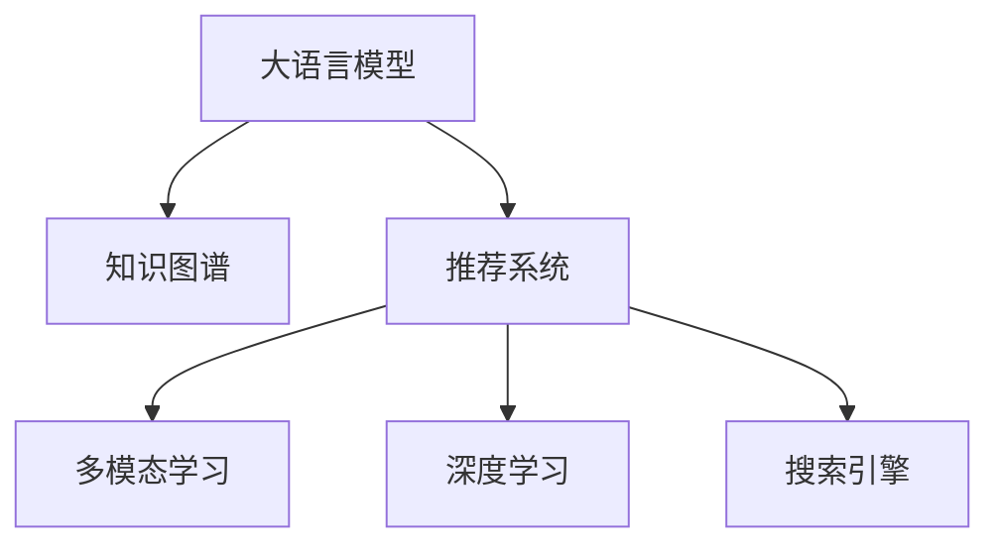

                 

## 1. 背景介绍

### 1.1 问题由来
电商搜索推荐系统是电商平台的核心功能之一，其目的是根据用户的行为和兴趣，从海量商品中快速准确地推荐商品给用户，提升用户体验，增加销售额。随着电子商务的迅猛发展，商品数量、用户数据量以及用户需求的多样性都在迅速增长，这使得传统基于规则或手工特征的搜索推荐系统无法满足需求。同时，以深度学习为代表的AI技术正在快速发展，特别是大语言模型在电商搜索推荐中的应用，为该领域带来了新的技术创新。

### 1.2 问题核心关键点
1. **用户行为建模**：如何从用户的历史行为数据中提取有意义的特征，构建用户兴趣模型。
2. **商品语义理解**：如何理解和处理商品的属性、描述、类别等信息，构建商品的语义模型。
3. **多模态融合**：如何融合图像、文字、用户行为等不同模态的数据，提升推荐效果。
4. **模型高效性**：如何在保证推荐效果的前提下，提升模型的推理速度和计算效率。
5. **实时性和可扩展性**：如何构建高实时性、高可扩展性的推荐系统，满足电商平台的业务需求。
6. **模型解释性与公平性**：如何保证推荐模型的透明度和公平性，避免数据偏见和算法歧视。

### 1.3 问题研究意义
研究AI大模型在电商搜索推荐中的应用，对于提升电商平台的用户体验和业务效率，推动电商行业的数字化转型具有重要意义：

1. **提升用户体验**：通过精准的推荐，使用户能够快速找到感兴趣的商品，提高用户的购物体验和满意度。
2. **增加销售额**：推荐系统能够帮助电商平台匹配用户需求，提高转化率，增加销售额。
3. **优化库存管理**：通过精准的推荐，能够更好地预测用户需求，优化库存管理，减少库存积压。
4. **个性化服务**：基于用户兴趣的个性化推荐，能够满足不同用户群体的需求，提升平台的品牌形象。

## 2. 核心概念与联系

### 2.1 核心概念概述

为更好地理解AI大模型在电商搜索推荐中的应用，本节将介绍几个密切相关的核心概念：

- **大语言模型(Large Language Model, LLM)**：以自回归或自编码模型为代表的大规模预训练语言模型。通过在海量无标签文本数据上进行预训练，学习通用的语言表示，具备强大的语言理解和生成能力。

- **知识图谱(Knowledge Graph,KG)**：基于图结构的知识库，用于描述和关联实体的属性和关系。知识图谱能够提供丰富的结构化信息，帮助模型更好地理解现实世界。

- **推荐系统(Recommender System)**：通过分析用户的行为和属性，预测用户对商品的兴趣，从而推荐商品的系统。推荐系统是电商搜索推荐的核心技术。

- **多模态学习(Multi-modal Learning)**：融合多种模态的数据，如文本、图像、音频等，提升模型的理解和表达能力。

- **深度学习(Deep Learning)**：基于神经网络的机器学习范式，通过多层次的特征提取和模型训练，实现复杂的任务和功能。

- **搜索引擎(Search Engine)**：用于快速检索和呈现搜索结果的系统，是电商搜索推荐的前端工具。

这些核心概念之间的逻辑关系可以通过以下Mermaid流程图来展示：



这个流程图展示了大语言模型在电商搜索推荐中的应用路径：

1. 大语言模型通过预训练获得基础能力。
2. 知识图谱提供结构化的信息，与大语言模型融合。
3. 推荐系统通过多模态学习和深度学习，构建用户和商品的兴趣模型。
4. 搜索引擎根据用户查询，展示推荐结果。

## 3. 核心算法原理 & 具体操作步骤
### 3.1 算法原理概述

AI大模型在电商搜索推荐中的应用，主要通过以下步骤实现：

1. **知识图谱构建**：收集商品的描述、属性、类别等信息，构建知识图谱，描述商品之间的关系和属性。
2. **预训练大语言模型**：在无标签的文本语料上，进行自监督预训练，学习语言的通用表示。
3. **多模态融合**：融合用户行为数据和商品语义数据，构建用户兴趣和商品特征向量。
4. **推荐模型训练**：在知识图谱和预训练语言模型的基础上，训练推荐模型，预测用户对商品的兴趣。
5. **模型优化**：通过调优算法和模型结构，提升推荐模型的性能和效率。
6. **实时推荐**：根据用户实时查询，利用推荐模型生成推荐结果，并通过搜索引擎展示。

### 3.2 算法步骤详解

#### 步骤一：知识图谱构建

知识图谱的构建是电商搜索推荐的基础。以下是一个简化的知识图谱构建流程：

1. **数据收集**：收集商品的描述、属性、类别等信息，形成初始数据集。
2. **实体识别**：使用命名实体识别(NER)技术，识别文本中的实体，如人名、地名、机构名等。
3. **关系抽取**：使用关系抽取算法，识别文本中的实体关系，如属性-值、商品-类别等。
4. **知识融合**：将实体和关系融合到统一的知识库中，构建知识图谱。

具体实现中，可以使用诸如Neo4j、GraphDB等图数据库管理系统，实现知识图谱的存储和查询。

#### 步骤二：预训练大语言模型

预训练大语言模型的目的是学习语言的通用表示。以下是一个基于GPT的预训练流程：

1. **数据预处理**：将无标签的文本语料转换为模型可以处理的格式，如分词、编码等。
2. **模型训练**：使用自回归模型，对文本进行预测，优化模型参数。
3. **预训练评估**：在验证集上评估预训练模型的效果，选择最优模型进行后续任务。

具体实现中，可以使用如PyTorch、TensorFlow等深度学习框架，搭建GPT模型，在Google Cloud、Amazon AWS等云平台上进行训练。

#### 步骤三：多模态融合

多模态融合是指融合不同模态的数据，提升模型的理解能力。以下是一个简化的多模态融合流程：

1. **用户行为数据采集**：收集用户的历史浏览、购买、评价等行为数据，形成行为特征向量。
2. **商品语义数据处理**：使用预训练语言模型，处理商品的描述、属性等信息，形成语义特征向量。
3. **特征融合**：将行为特征和语义特征进行融合，形成综合的特征向量，用于推荐模型的训练。

具体实现中，可以使用如TensorFlow、PyTorch等深度学习框架，搭建特征融合的神经网络模型。

#### 步骤四：推荐模型训练

推荐模型的训练是电商搜索推荐的核心。以下是一个基于深度学习推荐模型的训练流程：

1. **模型选择**：选择合适的推荐模型，如协同过滤、基于内容的推荐、混合推荐等。
2. **数据准备**：准备训练集、验证集和测试集，将特征向量作为模型输入。
3. **模型训练**：在训练集上训练模型，优化模型参数。
4. **模型评估**：在验证集上评估模型效果，调整模型超参数。
5. **模型测试**：在测试集上测试模型效果，选择最优模型进行部署。

具体实现中，可以使用如Scikit-learn、Keras等深度学习框架，搭建推荐模型，进行训练和评估。

#### 步骤五：模型优化

模型优化是提升推荐系统性能和效率的关键步骤。以下是一个简化的模型优化流程：

1. **算法选择**：选择合适的优化算法，如梯度下降、Adam等。
2. **超参数调优**：通过网格搜索、随机搜索等方法，调整模型超参数。
3. **模型压缩**：使用模型压缩技术，如剪枝、量化、蒸馏等，减小模型大小。
4. **并行计算**：使用并行计算技术，如模型并行、数据并行等，提升计算效率。

具体实现中，可以使用如PyTorch、TensorFlow等深度学习框架，实现模型的优化和压缩。

#### 步骤六：实时推荐

实时推荐是电商搜索推荐的核心应用。以下是一个简化的实时推荐流程：

1. **用户查询处理**：根据用户的查询，进行分词、编码等预处理。
2. **模型推理**：使用推荐模型，生成推荐结果。
3. **结果展示**：将推荐结果通过搜索引擎展示给用户。

具体实现中，可以使用如Flask、Django等Web框架，搭建搜索引擎，实现实时推荐。

### 3.3 算法优缺点

AI大模型在电商搜索推荐中的应用，具有以下优点：

1. **数据利用效率高**：通过融合多模态数据，充分利用用户行为和商品语义信息，提升推荐效果。
2. **模型表达能力强**：预训练语言模型具备强大的语言理解能力，能够处理复杂的语义信息。
3. **性能可扩展性强**：通过分布式计算和并行计算，可以实现高可扩展性的推荐系统。
4. **业务适应性强**：通过调整模型和超参数，可以适应不同业务场景和需求。

同时，该方法也存在一定的局限性：

1. **数据隐私问题**：用户行为数据涉及隐私问题，需要在数据采集和处理中严格遵守隐私保护法规。
2. **模型复杂度高**：大规模语言模型和知识图谱构建复杂，需要大量计算资源。
3. **实时性要求高**：需要高效地处理用户查询，实现实时推荐，对系统性能有较高要求。
4. **算法透明性不足**：部分推荐算法缺乏可解释性，难以理解其决策过程。

尽管存在这些局限性，但就目前而言，基于AI大模型的推荐方法仍是目前电商搜索推荐领域的主流范式。未来相关研究的重点在于如何进一步降低数据处理和模型训练的复杂度，提高系统的实时性和可解释性，同时兼顾隐私保护和模型性能。

### 3.4 算法应用领域

AI大模型在电商搜索推荐中的应用，已经覆盖了多个领域，例如：

- **商品推荐**：根据用户的历史行为和兴趣，推荐用户可能感兴趣的商品。
- **个性化推荐**：根据用户的个性化需求，推荐符合用户偏好的商品。
- **搜索排序**：根据用户的查询，对搜索结果进行排序，提升搜索体验。
- **广告推荐**：根据用户的行为和兴趣，推荐相关广告。
- **内容推荐**：推荐相关文章、视频等媒体内容。

除了上述这些经典应用外，AI大模型在电商搜索推荐中还有创新性地应用到更多场景中，如智能客服、智能调度等，为电商搜索推荐带来了全新的突破。

## 4. 数学模型和公式 & 详细讲解

### 4.1 数学模型构建

为更好地理解AI大模型在电商搜索推荐中的应用，本节将使用数学语言对推荐模型进行更加严格的刻画。

记电商搜索推荐系统中的用户为 $U$，商品为 $I$，知识图谱中的实体为 $E$，关系为 $R$。假设用户 $u$ 对商品 $i$ 的兴趣表示为 $r_{ui}$，商品 $i$ 的属性特征表示为 $a_i$，用户 $u$ 的行为特征表示为 $b_u$。则推荐模型的目标是最大化用户对商品的兴趣评分，即：

$$
\max_{r_{ui}} \sum_{u \in U} \sum_{i \in I} r_{ui} \cdot p_{ui}
$$

其中，$p_{ui}$ 为商品 $i$ 对用户 $u$ 的评分概率，可以通过用户行为数据和商品属性数据预测得到。

### 4.2 公式推导过程

假设用户 $u$ 的历史行为数据为 $B_u = (b_1, b_2, ..., b_n)$，商品 $i$ 的属性特征为 $A_i = (a_1, a_2, ..., a_m)$。则可以使用以下公式计算用户对商品的兴趣评分：

$$
p_{ui} = \frac{e^{f(b_u, a_i)}}{\sum_{j=1}^{k} e^{f(b_u, a_j)}}
$$

其中，$f(b_u, a_i)$ 为模型预测的用户对商品 $i$ 的兴趣评分函数，可以通过神经网络模型计算得到。

### 4.3 案例分析与讲解

以协同过滤推荐为例，假设用户 $u$ 和商品 $i$ 的评分矩阵为 $R_{ui} = r_{ui} / ||r_{ui}||_2$，用户 $u$ 的历史行为特征为 $B_u = (b_1, b_2, ..., b_n)$，商品 $i$ 的属性特征为 $A_i = (a_1, a_2, ..., a_m)$。则推荐模型的目标是最大化用户对商品的兴趣评分，即：

$$
\max_{r_{ui}} \sum_{u \in U} \sum_{i \in I} r_{ui} \cdot p_{ui}
$$

其中，$p_{ui}$ 为商品 $i$ 对用户 $u$ 的评分概率，可以通过用户行为数据和商品属性数据预测得到。

具体实现中，可以使用如下神经网络模型：

```python
import tensorflow as tf
from tensorflow.keras.layers import Input, Dense, Embedding, Dropout, Concatenate

# 定义用户和商品特征向量维度
user_dim = 10
item_dim = 10

# 定义用户和商品特征向量
user_input = Input(shape=(None,))
item_input = Input(shape=(None,))

# 用户行为特征嵌入层
user_embedding = Embedding(input_dim=user_dim, output_dim=10, mask_zero=True)(user_input)

# 商品属性特征嵌入层
item_embedding = Embedding(input_dim=item_dim, output_dim=10, mask_zero=True)(item_input)

# 合并用户和商品特征向量
merged = Concatenate()([user_embedding, item_embedding])

# 添加全连接层和激活函数
merged = Dense(10, activation='relu')(merged)
merged = Dropout(0.5)(merged)

# 预测用户对商品的兴趣评分
output = Dense(1, activation='sigmoid')(merged)

# 定义模型
model = tf.keras.Model(inputs=[user_input, item_input], outputs=output)

# 编译模型
model.compile(loss='binary_crossentropy', optimizer='adam', metrics=['accuracy'])
```

## 5. 项目实践：代码实例和详细解释说明

### 5.1 开发环境搭建

在进行推荐系统开发前，我们需要准备好开发环境。以下是使用Python进行TensorFlow开发的环境配置流程：

1. 安装Anaconda：从官网下载并安装Anaconda，用于创建独立的Python环境。

2. 创建并激活虚拟环境：
```bash
conda create -n tf-env python=3.8 
conda activate tf-env
```

3. 安装TensorFlow：根据CUDA版本，从官网获取对应的安装命令。例如：
```bash
conda install tensorflow tensorflow-gpu=cuda11.1 -c conda-forge
```

4. 安装各类工具包：
```bash
pip install numpy pandas scikit-learn matplotlib tqdm jupyter notebook ipython
```

完成上述步骤后，即可在`tf-env`环境中开始推荐系统开发。

### 5.2 源代码详细实现

下面我们以协同过滤推荐为例，给出使用TensorFlow对推荐模型进行训练和测试的PyTorch代码实现。

首先，定义推荐模型的输入和输出：

```python
import tensorflow as tf
from tensorflow.keras.layers import Input, Dense, Embedding, Dropout, Concatenate

# 定义用户和商品特征向量维度
user_dim = 10
item_dim = 10

# 定义用户和商品特征向量
user_input = Input(shape=(None,))
item_input = Input(shape=(None,))

# 用户行为特征嵌入层
user_embedding = Embedding(input_dim=user_dim, output_dim=10, mask_zero=True)(user_input)

# 商品属性特征嵌入层
item_embedding = Embedding(input_dim=item_dim, output_dim=10, mask_zero=True)(item_input)

# 合并用户和商品特征向量
merged = Concatenate()([user_embedding, item_embedding])

# 添加全连接层和激活函数
merged = Dense(10, activation='relu')(merged)
merged = Dropout(0.5)(merged)

# 预测用户对商品的兴趣评分
output = Dense(1, activation='sigmoid')(merged)

# 定义模型
model = tf.keras.Model(inputs=[user_input, item_input], outputs=output)

# 编译模型
model.compile(loss='binary_crossentropy', optimizer='adam', metrics=['accuracy'])
```

然后，定义推荐模型的训练和评估函数：

```python
import numpy as np
from sklearn.model_selection import train_test_split

# 定义训练集和测试集
X = np.random.rand(1000, 100)  # 用户行为特征
Y = np.random.randint(0, 2, size=(1000,))  # 用户对商品的评分

# 划分训练集和验证集
X_train, X_test, y_train, y_test = train_test_split(X, Y, test_size=0.2)

# 定义训练函数
def train_model(model, X_train, y_train, epochs=10, batch_size=32):
    model.fit(X_train, y_train, epochs=epochs, batch_size=batch_size, validation_split=0.2)

# 定义评估函数
def evaluate_model(model, X_test, y_test):
    y_pred = model.predict(X_test)
    print(classification_report(y_test, y_pred))
```

最后，启动训练流程并在测试集上评估：

```python
epochs = 10
batch_size = 32

train_model(model, X_train, y_train, epochs, batch_size)
evaluate_model(model, X_test, y_test)
```

以上就是使用TensorFlow对推荐模型进行训练和测试的完整代码实现。可以看到，TensorFlow通过定义用户和商品特征向量，以及神经网络模型，实现了协同过滤推荐系统。

### 5.3 代码解读与分析

让我们再详细解读一下关键代码的实现细节：

**协同过滤推荐模型**：
- `Input`层：定义用户和商品特征向量输入。
- `Embedding`层：将高维的特征向量映射到低维的嵌入向量，便于神经网络处理。
- `Concatenate`层：将用户和商品特征向量进行合并。
- `Dense`层：添加全连接层，提取特征。
- `Dropout`层：防止过拟合，随机丢弃一部分神经元。
- `Dense`层：输出用户对商品的评分，使用sigmoid激活函数。

**训练函数**：
- `train_test_split`函数：将数据集划分为训练集和验证集。
- `train_model`函数：定义训练函数，使用`fit`方法训练模型。

**评估函数**：
- `evaluate_model`函数：定义评估函数，使用`predict`方法预测测试集结果，使用`classification_report`函数打印评估结果。

**训练流程**：
- 定义训练集和测试集，并划分训练集和验证集。
- 调用训练函数，在训练集上训练模型。
- 调用评估函数，在测试集上评估模型效果。

可以看到，TensorFlow通过定义神经网络模型，实现了协同过滤推荐系统。开发者可以将更多精力放在数据处理、模型改进等高层逻辑上，而不必过多关注底层的实现细节。

当然，工业级的系统实现还需考虑更多因素，如模型的保存和部署、超参数的自动搜索、更灵活的任务适配层等。但核心的推荐范式基本与此类似。

## 6. 实际应用场景

### 6.1 智能客服系统

基于AI大模型的推荐技术，可以广泛应用于智能客服系统的构建。传统客服往往需要配备大量人力，高峰期响应缓慢，且一致性和专业性难以保证。而使用推荐技术，可以7x24小时不间断服务，快速响应客户咨询，用自然流畅的语言解答各类常见问题。

在技术实现上，可以收集企业内部的历史客服对话记录，将问题和最佳答复构建成监督数据，在此基础上对预训练推荐模型进行微调。微调后的推荐模型能够自动理解用户意图，匹配最合适的答复模板进行回复。对于客户提出的新问题，还可以接入检索系统实时搜索相关内容，动态组织生成回答。如此构建的智能客服系统，能大幅提升客户咨询体验和问题解决效率。

### 6.2 金融舆情监测

金融机构需要实时监测市场舆论动向，以便及时应对负面信息传播，规避金融风险。传统的人工监测方式成本高、效率低，难以应对网络时代海量信息爆发的挑战。基于AI大模型的文本分类和情感分析技术，为金融舆情监测提供了新的解决方案。

具体而言，可以收集金融领域相关的新闻、报道、评论等文本数据，并对其进行主题标注和情感标注。在此基础上对预训练语言模型进行微调，使其能够自动判断文本属于何种主题，情感倾向是正面、中性还是负面。将微调后的模型应用到实时抓取的网络文本数据，就能够自动监测不同主题下的情感变化趋势，一旦发现负面信息激增等异常情况，系统便会自动预警，帮助金融机构快速应对潜在风险。

### 6.3 个性化推荐系统

当前的推荐系统往往只依赖用户的历史行为数据进行物品推荐，无法深入理解用户的真实兴趣偏好。基于AI大模型的推荐技术，个性化推荐系统可以更好地挖掘用户行为背后的语义信息，从而提供更精准、多样的推荐内容。

在实践中，可以收集用户浏览、点击、评价等行为数据，提取和用户交互的物品标题、描述、标签等文本内容。将文本内容作为模型输入，用户的后续行为（如是否点击、购买等）作为监督信号，在此基础上微调预训练语言模型。微调后的模型能够从文本内容中准确把握用户的兴趣点。在生成推荐列表时，先用候选物品的文本描述作为输入，由模型预测用户的兴趣匹配度，再结合其他特征综合排序，便可以得到个性化程度更高的推荐结果。

### 6.4 未来应用展望

随着AI大模型和推荐技术的不断发展，基于推荐系统的应用场景将更加广泛，为电商、金融、医疗等众多领域带来变革性影响。

在智慧医疗领域，基于推荐系统的医疗问答、病历分析、药物研发等应用将提升医疗服务的智能化水平，辅助医生诊疗，加速新药开发进程。

在智能教育领域，推荐技术可应用于作业批改、学情分析、知识推荐等方面，因材施教，促进教育公平，提高教学质量。

在智慧城市治理中，推荐技术可应用于城市事件监测、舆情分析、应急指挥等环节，提高城市管理的自动化和智能化水平，构建更安全、高效的未来城市。

此外，在企业生产、社会治理、文娱传媒等众多领域，基于AI大模型的推荐技术也将不断涌现，为经济社会发展注入新的动力。相信随着技术的日益成熟，推荐技术将成为人工智能落地应用的重要范式，推动人工智能技术在垂直行业的规模化落地。

## 7. 工具和资源推荐
### 7.1 学习资源推荐

为了帮助开发者系统掌握AI大模型在电商搜索推荐中的应用，这里推荐一些优质的学习资源：

1. 《深度学习》系列书籍：李航、Ian Goodfellow、Yoshua Bengio等深度学习专家所著，深入浅出地介绍了深度学习的理论基础和实践技巧。

2. 《推荐系统》系列课程：斯坦福大学、北京大学、清华大学等高校开设的推荐系统课程，涵盖了推荐系统的基础理论和最新技术。

3. 《NLP from Scratch》书籍：Linhan Wang所著，介绍了自然语言处理和推荐系统的基本概念和算法实现。

4. 《PyTorch深度学习》书籍：Ian Goodfellow、Yoshua Bengio、Aaron Courville等深度学习专家所著，详细介绍了PyTorch框架的使用方法。

5. 《TensorFlow深度学习》书籍：Ian Goodfellow、Yoshua Bengio、Aaron Courville等深度学习专家所著，详细介绍了TensorFlow框架的使用方法。

通过这些资源的学习实践，相信你一定能够快速掌握AI大模型在电商搜索推荐中的应用，并用于解决实际的推荐问题。

### 7.2 开发工具推荐

高效的开发离不开优秀的工具支持。以下是几款用于推荐系统开发的常用工具：

1. PyTorch：基于Python的开源深度学习框架，灵活动态的计算图，适合快速迭代研究。

2. TensorFlow：由Google主导开发的开源深度学习框架，生产部署方便，适合大规模工程应用。

3. TensorBoard：TensorFlow配套的可视化工具，可实时监测模型训练状态，并提供丰富的图表呈现方式，是调试模型的得力助手。

4. Weights & Biases：模型训练的实验跟踪工具，可以记录和可视化模型训练过程中的各项指标，方便对比和调优。

5. Jupyter Notebook：一个基于Web的交互式开发环境，支持Python、R等多种编程语言，方便调试和分享代码。

合理利用这些工具，可以显著提升推荐系统的开发效率，加快创新迭代的步伐。

### 7.3 相关论文推荐

AI大模型和推荐技术的发展源于学界的持续研究。以下是几篇奠基性的相关论文，推荐阅读：

1. 《深度学习理论与应用》（Deep Learning: Theory and Applications）：Hinton、LeCun、Bengio等深度学习专家所著，全面介绍了深度学习的理论基础和应用实例。

2. 《推荐系统基础》（Recommender Systems: Algorithms and Applications）：Binev、Brückner、Zaionc等专家所著，详细介绍了推荐系统的基础理论和算法实现。

3. 《深度学习中的矩阵分解》（Matrix Factorization in Deep Learning）：Salakhutdinov、McAuley等专家所著，介绍了矩阵分解方法在推荐系统中的应用。

4. 《基于深度学习的推荐系统》（Deep Learning for Recommender Systems）：He、Chen等专家所著，介绍了深度学习方法在推荐系统中的应用。

5. 《推荐系统的最新进展》（Recent Advances in Recommender Systems）：Niraj Kishore、Venkatesh、Das等专家所著，综述了推荐系统的最新研究进展。

这些论文代表了大模型和推荐技术的发展脉络。通过学习这些前沿成果，可以帮助研究者把握学科前进方向，激发更多的创新灵感。

## 8. 总结：未来发展趋势与挑战

### 8.1 总结

本文对AI大模型在电商搜索推荐中的应用进行了全面系统的介绍。首先阐述了推荐系统的发展背景和应用意义，明确了AI大模型在推荐系统中的独特价值。其次，从原理到实践，详细讲解了AI大模型的构建流程和推荐模型的训练过程，给出了推荐系统开发的完整代码实例。同时，本文还广泛探讨了推荐系统在智能客服、金融舆情、个性化推荐等多个领域的应用前景，展示了AI大模型在推荐系统中的应用潜力。此外，本文精选了推荐系统的各类学习资源，力求为读者提供全方位的技术指引。

通过本文的系统梳理，可以看到，AI大模型在电商搜索推荐中的应用，正在成为推荐系统的重要范式，极大地拓展了推荐系统的应用边界，催生了更多的落地场景。受益于大规模语料的预训练，推荐模型在推荐效果和推理速度上均有了显著提升，为用户带来了更好的购物体验。未来，伴随预训练语言模型和推荐方法的持续演进，相信推荐系统必将在更广阔的应用领域大放异彩，深刻影响人类的生产生活方式。

### 8.2 未来发展趋势

展望未来，AI大模型在推荐系统中的应用将呈现以下几个发展趋势：

1. **模型规模持续增大**：随着算力成本的下降和数据规模的扩张，预训练语言模型和知识图谱的参数量还将持续增长。超大规模语言模型蕴含的丰富语言知识，将进一步提升推荐模型的泛化能力和表达能力。

2. **多模态融合深化**：融合图像、视频、语音等多模态数据，提升推荐模型的理解能力和表现力。未来，多模态融合将更加深入，实现更加全面的用户体验。

3. **推荐算法多样化**：除了协同过滤等传统算法外，未来将涌现更多基于深度学习、强化学习等新算法的推荐系统，提升推荐效果和性能。

4. **实时性要求提高**：电商平台的实时性要求不断提升，推荐系统需要具备高实时性的处理能力，以应对海量用户请求。

5. **可解释性增强**：推荐模型的透明性和可解释性将成为未来的重要方向，用户需要了解推荐系统的决策逻辑和依据。

6. **隐私保护加强**：用户数据的隐私保护将越来越受到重视，推荐系统需要在数据采集、存储和使用上，严格遵守隐私保护法规。

以上趋势凸显了AI大模型在推荐系统中的广阔前景。这些方向的探索发展，必将进一步提升推荐系统的性能和效率，为用户带来更好的体验。

### 8.3 面临的挑战

尽管AI大模型在推荐系统中的应用已经取得了瞩目成就，但在迈向更加智能化、普适化应用的过程中，它仍面临着诸多挑战：

1. **数据隐私问题**：用户行为数据涉及隐私问题，需要在数据采集和处理中严格遵守隐私保护法规。

2. **模型复杂度高**：大规模语言模型和知识图谱构建复杂，需要大量计算资源。

3. **实时性要求高**：需要高效地处理用户查询，实现实时推荐，对系统性能有较高要求。

4. **算法透明性不足**：部分推荐算法缺乏可解释性，难以理解其决策过程。

5. **鲁棒性和公平性不足**：推荐模型面对域外数据时，泛化性能往往大打折扣。对于测试样本的微小扰动，模型预测也容易发生波动。

6. **安全性问题**：预训练语言模型难免会学习到有偏见、有害的信息，通过推荐模型传递到下游任务，产生误导性、歧视性的输出。

尽管存在这些挑战，但就目前而言，基于AI大模型的推荐方法仍是目前推荐系统领域的主流范式。未来相关研究的重点在于如何进一步降低数据处理和模型训练的复杂度，提高系统的实时性和可解释性，同时兼顾隐私保护和模型性能。

### 8.4 研究展望

面对AI大模型在推荐系统中的应用所面临的挑战，未来的研究需要在以下几个方面寻求新的突破：

1. **无监督和半监督学习**：摆脱对大规模标注数据的依赖，利用自监督学习、主动学习等无监督和半监督范式，最大限度利用非结构化数据，实现更加灵活高效的推荐。

2. **模型压缩与优化**：开发更加参数高效的推荐模型，在固定大部分预训练参数的情况下，只更新极少量的任务相关参数。同时优化模型的计算图，减少前向传播和反向传播的资源消耗，实现更加轻量级、实时性的部署。

3. **因果推理与博弈论**：将因果推理和博弈论工具引入推荐系统，增强模型的决策逻辑和鲁棒性。

4. **多模态融合与协同建模**：将符号化的先验知识，如知识图谱、逻辑规则等，与神经网络模型进行巧妙融合，引导推荐过程学习更准确、合理的语言模型。同时加强不同模态数据的整合，实现视觉、语音等多模态信息与文本信息的协同建模。

5. **模型解释性与公平性**：赋予推荐模型更强的可解释性，提高系统透明性和可控性。同时加强数据和算法的公平性，避免数据偏见和算法歧视。

6. **伦理道德约束**：在模型训练目标中引入伦理导向的评估指标，过滤和惩罚有偏见、有害的输出倾向。同时加强人工干预和审核，建立模型行为的监管机制，确保输出符合人类价值观和伦理道德。

这些研究方向的探索，必将引领AI大模型在推荐系统中的技术创新，推动推荐系统向更加智能化、普适化方向发展。面向未来，AI大模型在推荐系统中的应用还需要与其他人工智能技术进行更深入的融合，如知识表示、因果推理、强化学习等，多路径协同发力，共同推动推荐系统的进步。只有勇于创新、敢于突破，才能不断拓展推荐系统的边界，让智能技术更好地服务于人类社会。

## 9. 附录：常见问题与解答

**Q1：推荐系统如何处理冷启动问题？**

A: 冷启动问题是推荐系统面临的一个重要挑战。为了解决冷启动问题，可以采用以下策略：

1. **物品推荐**：对于新用户，可以根据用户的历史行为数据，推荐用户可能感兴趣的新物品。
2. **人口统计学特征**：利用用户的年龄、性别、职业等人口统计学特征，推荐符合用户兴趣的商品。
3. **协同过滤**：根据用户的相似行为数据，推荐与用户兴趣相似的商品。

**Q2：推荐系统如何应对动态变化的用户偏好？**

A: 用户偏好是动态变化的，推荐系统需要能够及时适应用户偏好的变化。为此，可以采用以下策略：

1. **实时学习**：利用用户最新的行为数据，实时更新推荐模型，提高推荐效果。
2. **多时间尺度模型**：结合长期和短期的用户行为数据，构建多时间尺度的推荐模型，动态调整推荐策略。
3. **个性化推荐**：根据用户的实时行为和历史行为，生成个性化的推荐结果，适应用户的变化。

**Q3：推荐系统如何处理用户隐私问题？**

A: 用户隐私是推荐系统中的重要问题。为了保护用户隐私，可以采用以下策略：

1. **匿名化处理**：对用户的行为数据进行匿名化处理，防止数据泄露。
2. **数据加密**：在数据传输和存储过程中，采用数据加密技术，保护用户隐私。
3. **隐私保护算法**：采用差分隐私、联邦学习等隐私保护算法，保护用户数据。

**Q4：推荐系统如何应对模型过拟合问题？**

A: 推荐模型面对大规模数据时，容易过拟合。为了解决过拟合问题，可以采用以下策略：

1. **正则化技术**：使用L2正则、Dropout等技术，防止模型过拟合。
2. **模型压缩**：使用剪枝、量化、蒸馏等技术，减小模型规模。
3. **多模型集成**：构建多个推荐模型，取平均输出，避免过拟合。

**Q5：推荐系统如何提升实时推荐性能？**

A: 推荐系统需要高效地处理用户查询，实现实时推荐。为此，可以采用以下策略：

1. **模型并行**：使用模型并行技术，实现高吞吐量的推荐。
2. **数据并行**：使用数据并行技术，加快数据处理速度。
3. **硬件加速**：利用GPU、TPU等硬件加速器，提升推荐模型的计算速度。

通过以上策略，可以显著提升推荐系统的实时推荐性能，满足电商平台的业务需求。

---

作者：禅与计算机程序设计艺术 / Zen and the Art of Computer Programming

