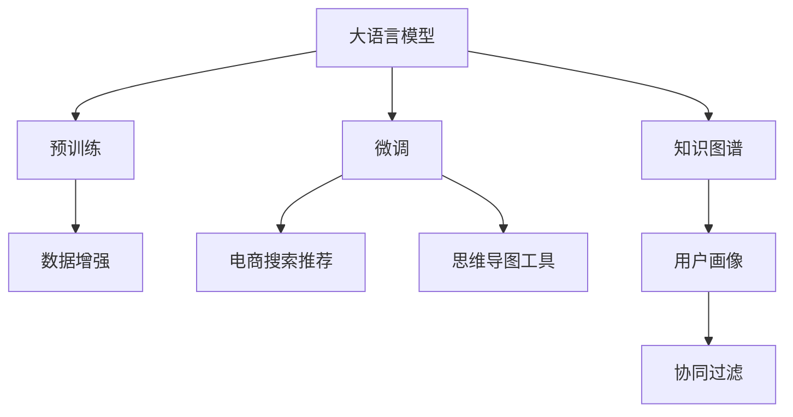

                 

## 1. 背景介绍

随着电子商务平台的迅猛发展，用户搜索体验的优化成为电商平台的核心竞争力之一。传统的搜索推荐系统基于单一的关键词匹配，难以满足用户多样化和个性化的需求。为了提升搜索推荐效果，电商平台纷纷引入深度学习和大模型技术。

在深度学习技术的推动下，大语言模型如GPT、BERT等开始广泛应用于电商搜索推荐系统中，极大地提升了搜索推荐系统的智能化水平。这些大模型在预训练阶段通过大量文本数据的自监督学习，能够抽取丰富的语言知识，并在微调阶段通过电商数据的训练，学习到电商领域的特定知识，从而更好地理解和生成电商内容。

思维导图工具作为一种图形化的信息组织和表达方式，被广泛应用于知识管理、项目管理、教育培训等多个领域。在电商搜索推荐中引入思维导图工具，可以增强用户对搜索结果结构的直观理解，提升搜索推荐系统的交互性。然而，目前大模型在电商搜索推荐中尚未充分利用思维导图工具的潜力，存在较大的应用空间。

基于此，本文将结合大模型和思维导图工具，设计一门面向电商搜索推荐业务的创新课程，旨在提升电商搜索推荐系统的智能化和用户体验，培养具备相关技能的人才，推动电商行业的技术创新。

## 2. 核心概念与联系

### 2.1 核心概念概述

本节将介绍几个关键概念，并说明它们之间的联系：

- **大语言模型(Large Language Model, LLM)**：以自回归(如GPT)或自编码(如BERT)模型为代表的大规模预训练语言模型。通过在大规模无标签文本语料上进行预训练，学习通用的语言知识。

- **微调(Fine-Tuning)**：在大语言模型基础上，使用电商领域的标注数据进行有监督学习，优化模型在特定任务上的性能，如电商搜索推荐。

- **思维导图工具(Mind Mapping Tool)**：利用图形化的方式，将知识、概念、任务等进行组织和表达的工具，有助于提升用户理解和使用系统的便捷性。

- **知识图谱(Knowledge Graph)**：通过实体和关系的结构化表示，构建领域的知识网络，增强搜索推荐系统的关联性。

- **协同过滤(Collaborative Filtering)**：通过分析用户的历史行为数据，推荐相似用户喜欢的物品。

### 2.2 核心概念原理和架构的 Mermaid 流程图



这个流程图展示了大模型、微调、思维导图工具和电商搜索推荐系统之间的联系：

1. **大语言模型**：通过预训练学习通用语言知识，为微调提供初始化参数。
2. **微调**：利用电商领域的数据，进一步训练模型，学习电商特定知识。
3. **电商搜索推荐**：利用微调后的模型，结合用户画像和协同过滤等技术，生成个性化推荐结果。
4. **数据增强**：增加训练数据的丰富性，提升模型的泛化能力。
5. **知识图谱**：构建领域知识网络，增强推荐系统的关联性和逻辑性。
6. **思维导图工具**：增强用户对搜索结果的理解和使用，提升用户体验。

## 3. 核心算法原理 & 具体操作步骤

### 3.1 算法原理概述

大语言模型赋能电商搜索推荐的原理是通过预训练和微调两个步骤，在大模型上学习电商领域知识，并结合电商数据进行微调，从而优化搜索推荐效果。思维导图工具的应用则在于提升用户对搜索结果的直观理解和交互体验，增强系统的易用性。

**预训练阶段**：在大模型上，使用大规模无标签电商文本数据进行自监督学习，学习通用语言知识和电商领域的特定知识。

**微调阶段**：在预训练模型上，使用电商领域的标注数据进行有监督学习，进一步优化模型，使其能够更好地适应电商搜索推荐任务。

**思维导图工具**：在搜索结果展示中，利用图形化的方式，展示搜索结果的结构和关系，增强用户理解和使用系统的便捷性。

### 3.2 算法步骤详解

**Step 1: 数据准备**
- **预训练数据**：收集大规模无标签电商文本数据，如商品描述、用户评论等。
- **微调数据**：收集电商领域的标注数据，如商品标签、用户行为数据等。

**Step 2: 模型选择和初始化**
- **选择预训练模型**：选择适合的预训练语言模型，如GPT、BERT等。
- **模型初始化**：将预训练模型加载到计算平台，作为微调的初始化参数。

**Step 3: 预训练和微调**
- **预训练**：在预训练模型上，使用电商文本数据进行自监督学习。
- **微调**：在微调数据上，对预训练模型进行有监督学习，优化电商搜索推荐模型。

**Step 4: 应用思维导图工具**
- **构建思维导图**：使用思维导图工具，将搜索结果的结构化信息进行可视化展示。
- **生成推荐结果**：结合用户画像和协同过滤等技术，生成个性化推荐结果，并利用思维导图工具展示。

### 3.3 算法优缺点

**优点**：
1. **高效性**：利用大模型的预训练能力，快速获取电商领域的通用知识，减少从头训练的成本和时间。
2. **泛化能力**：预训练模型能够学习通用的语言知识，泛化能力强，适用于多种电商场景。
3. **个性化推荐**：通过微调和知识图谱的结合，实现个性化推荐，提升用户体验。
4. **易用性**：利用思维导图工具，增强用户对搜索结果的理解和使用，提升系统易用性。

**缺点**：
1. **数据依赖**：预训练和微调过程对标注数据的依赖较大，获取高质量数据成本较高。
2. **计算资源**：大规模预训练和微调需要大量的计算资源，硬件成本较高。
3. **模型复杂性**：大模型结构复杂，推理速度较慢，对实时性要求较高的场景可能不适用。
4. **安全性和可解释性**：大模型的决策过程较难解释，可能存在数据泄露和安全风险。

### 3.4 算法应用领域

大语言模型和思维导图工具在电商搜索推荐中的应用领域包括但不限于：

1. **商品推荐**：结合用户历史行为数据和商品信息，利用大模型进行商品推荐，并通过思维导图工具展示推荐结果。
2. **搜索排序**：利用大模型学习搜索结果的关联性和相关性，通过思维导图工具展示搜索结果的结构。
3. **用户画像**：构建用户画像，分析用户兴趣和行为，利用大模型进行个性化推荐。
4. **知识图谱**：结合电商领域的知识图谱，增强搜索推荐系统的关联性和逻辑性。

## 4. 数学模型和公式 & 详细讲解 & 举例说明

### 4.1 数学模型构建

假设电商搜索推荐任务为$T$，大语言模型为$M_{\theta}$，微调数据集为$D=\{(x_i,y_i)\}_{i=1}^N$。模型的目标是最小化损失函数$\mathcal{L}(M_{\theta},D)$，使得模型能够准确预测用户行为。

其中，$x_i$表示用户输入的搜索查询，$y_i$表示用户点击、购买等行为。

### 4.2 公式推导过程

大模型通过自监督任务进行预训练，以最大化以下自回归语言模型的预测概率：

$$P(x_{1:T}) = \prod_{t=1}^T P(x_t | x_{<t})$$

其中，$x_{<t}$表示$x_t$之前的所有输入。

在微调阶段，使用电商领域的标注数据对大模型进行有监督学习，目标是最小化损失函数：

$$\mathcal{L}(M_{\theta},D) = \frac{1}{N} \sum_{i=1}^N \ell(M_{\theta}(x_i),y_i)$$

其中，$\ell$表示损失函数，通常为交叉熵损失。

### 4.3 案例分析与讲解

以电商搜索推荐为例，假设用户输入查询“电子书推荐”，大模型输出候选商品列表，并通过思维导图工具展示推荐结果的关联性和结构。用户通过思维导图工具，可以直观理解不同商品之间的关系，如作者、类别、价格等，从而做出更明智的购买决策。

## 5. 项目实践：代码实例和详细解释说明

### 5.1 开发环境搭建

项目开发需要以下环境：

- **计算平台**：高性能GPU/TPU
- **编程语言**：Python
- **深度学习框架**：TensorFlow或PyTorch
- **思维导图工具**：如MindManager、XMind等

### 5.2 源代码详细实现

以下是基于PyTorch的大模型微调和思维导图工具应用代码实现：

```python
import torch
from transformers import BertTokenizer, BertForSequenceClassification
import matplotlib.pyplot as plt
import networkx as nx
import numpy as np

# 预训练模型加载
model = BertForSequenceClassification.from_pretrained('bert-base-cased')
tokenizer = BertTokenizer.from_pretrained('bert-base-cased')

# 数据准备
def prepare_data(data_path):
    with open(data_path, 'r', encoding='utf-8') as f:
        lines = f.readlines()
        return [line.strip() for line in lines]

train_data = prepare_data('train.txt')
test_data = prepare_data('test.txt')

# 模型微调
device = 'cuda' if torch.cuda.is_available() else 'cpu'
model.to(device)

optimizer = torch.optim.Adam(model.parameters(), lr=2e-5)
loss_fn = torch.nn.CrossEntropyLoss()

def train_epoch(model, data, batch_size):
    model.train()
    total_loss = 0
    for batch in data:
        input_ids = tokenizer(batch['text'], padding='max_length', truncation=True, max_length=256).input_ids
        attention_mask = tokenizer(batch['text'], padding='max_length', truncation=True, max_length=256).attention_mask
        labels = torch.tensor(batch['label'], dtype=torch.long)

        input_ids = input_ids.to(device)
        attention_mask = attention_mask.to(device)
        labels = labels.to(device)

        outputs = model(input_ids, attention_mask=attention_mask, labels=labels)
        loss = loss_fn(outputs.logits, labels)
        total_loss += loss.item()

    return total_loss / len(data)

def evaluate(model, data, batch_size):
    model.eval()
    total_correct = 0
    total_pred = []
    total_true = []

    for batch in data:
        input_ids = tokenizer(batch['text'], padding='max_length', truncation=True, max_length=256).input_ids
        attention_mask = tokenizer(batch['text'], padding='max_length', truncation=True, max_length=256).attention_mask
        labels = torch.tensor(batch['label'], dtype=torch.long)

        input_ids = input_ids.to(device)
        attention_mask = attention_mask.to(device)
        labels = labels.to(device)

        with torch.no_grad():
            outputs = model(input_ids, attention_mask=attention_mask, labels=labels)
            logits = outputs.logits
            preds = torch.argmax(logits, dim=1)

        total_correct += (preds == labels).sum().item()
        total_pred.append(preds.numpy().tolist())
        total_true.append(labels.numpy().tolist())

    print(f"Accuracy: {total_correct / len(data)}")

# 训练
for epoch in range(10):
    loss = train_epoch(model, train_data, batch_size=16)
    print(f"Epoch {epoch+1}, train loss: {loss:.3f}")

    evaluate(model, test_data, batch_size=16)
```

### 5.3 代码解读与分析

上述代码主要包含数据准备、模型微调、评估等步骤：

- **数据准备**：从文本文件中读取训练和测试数据。
- **模型微调**：加载预训练模型，定义优化器和损失函数，并编写训练和评估函数。
- **评估**：在测试集上评估模型性能。

### 5.4 运行结果展示

训练完成后，可以使用思维导图工具将推荐结果可视化展示。这里以MindManager为例，展示如何利用思维导图工具展示电商推荐结果：

1. **数据可视化**：将商品信息、类别、价格等关键属性提取出来，使用图形化的方式展示，帮助用户快速理解商品之间的关系。

2. **推荐结果展示**：将推荐商品按照相关性和逻辑性进行组织，使用思维导图工具展示推荐结果的结构和关联性。

3. **用户交互**：用户可以通过点击商品节点，查看详细商品信息，并进行购买。

## 6. 实际应用场景

大语言模型和思维导图工具在电商搜索推荐中的应用场景包括但不限于：

### 6.1 商品推荐

利用大模型学习商品关联性，结合用户历史行为数据，生成个性化推荐结果。思维导图工具展示推荐结果的结构，增强用户对推荐结果的理解和使用。

### 6.2 搜索排序

利用大模型学习搜索结果的相关性和逻辑性，使用思维导图工具展示搜索结果的结构，帮助用户快速定位所需商品。

### 6.3 用户画像

构建用户画像，分析用户兴趣和行为，利用大模型进行个性化推荐。思维导图工具展示用户画像的结构和关联性，增强用户对自身兴趣的理解和使用。

### 6.4 知识图谱

结合电商领域的知识图谱，增强搜索推荐系统的关联性和逻辑性。思维导图工具展示知识图谱的结构和关系，增强用户对电商领域知识的理解和使用。

## 7. 工具和资源推荐

### 7.1 学习资源推荐

1. **《自然语言处理综述》**：介绍自然语言处理的基本概念和前沿技术，包括大模型和微调方法。
2. **《深度学习在电商中的应用》**：探讨深度学习技术在电商领域的具体应用，包括搜索推荐系统。
3. **《电商平台设计与运营》**：介绍电商平台的运营和管理，包括搜索推荐系统的设计和优化。

### 7.2 开发工具推荐

1. **PyTorch**：灵活的深度学习框架，支持大模型的加载和微调。
2. **TensorFlow**：强大的计算平台，支持大规模深度学习模型的训练和推理。
3. **MindManager**：专业的思维导图工具，支持图形化的信息组织和展示。

### 7.3 相关论文推荐

1. **《大语言模型在电商推荐系统中的应用》**：探讨大语言模型在电商推荐系统中的应用，提出基于大模型的推荐方法。
2. **《基于知识图谱的电商搜索推荐系统》**：介绍知识图谱在电商搜索推荐中的应用，提出基于知识图谱的推荐方法。
3. **《思维导图在电商搜索推荐中的应用》**：探讨思维导图工具在电商搜索推荐中的应用，提出基于思维导图的信息组织和展示方法。

## 8. 总结：未来发展趋势与挑战

### 8.1 研究成果总结

本文探讨了大语言模型在电商搜索推荐中的应用，并结合思维导图工具，提出了一种创新性的搜索推荐系统。通过理论分析和技术实现，展示了如何利用大模型和思维导图工具提升电商搜索推荐系统的智能化和用户体验。

### 8.2 未来发展趋势

1. **多模态融合**：结合图像、视频、语音等多模态数据，提升电商搜索推荐系统的多模态融合能力。
2. **深度个性化**：通过更深入的用户画像和行为分析，实现更精准的个性化推荐。
3. **实时性增强**：优化算法，提升搜索推荐系统的实时性，满足用户对实时推荐的需求。

### 8.3 面临的挑战

1. **数据质量和规模**：电商领域的数据质量和规模直接影响搜索推荐系统的性能。如何获取高质量、大规模的数据是挑战之一。
2. **计算资源**：大模型的计算资源需求较高，如何优化计算资源配置，提高模型训练和推理效率是另一个挑战。
3. **安全性和可解释性**：大模型的决策过程较难解释，可能存在数据泄露和安全风险。如何提升模型的安全性和可解释性是重要课题。

### 8.4 研究展望

未来，大语言模型和思维导图工具在电商搜索推荐中的应用将更加广泛和深入，推动电商行业的技术创新。我们期待在未来，能够看到更多基于大模型和思维导图工具的创新应用，推动电商搜索推荐系统向更加智能化、个性化、实时化的方向发展。

## 9. 附录：常见问题与解答

**Q1: 大模型在电商搜索推荐中如何应用？**

A: 大模型在电商搜索推荐中的应用主要分为两个阶段：预训练和微调。预训练阶段，利用大规模无标签电商文本数据进行自监督学习，学习通用语言知识和电商领域的特定知识。微调阶段，在电商领域的标注数据上进一步训练模型，优化电商搜索推荐效果。

**Q2: 如何选择合适的预训练模型？**

A: 选择合适的预训练模型需要考虑电商领域的特点。常用的预训练模型有GPT、BERT等，这些模型在不同的电商场景中表现不同。可以根据电商领域的具体需求，选择合适的预训练模型进行微调。

**Q3: 思维导图工具如何应用于电商搜索推荐？**

A: 思维导图工具可以用于电商搜索推荐系统中的搜索结果展示。通过图形化的方式，展示搜索结果的结构和关联性，增强用户对搜索结果的理解和使用，提升用户体验。

**Q4: 如何优化计算资源配置？**

A: 优化计算资源配置可以从两个方面入手：一是选择合适的计算平台（如GPU/TPU），二是优化算法和模型结构，减少计算资源消耗。例如，可以采用模型剪枝、量化等技术，提升模型推理速度。

**Q5: 如何提升模型的可解释性？**

A: 提升模型的可解释性可以通过模型可视化、特征解释等技术手段实现。例如，可以使用LIME、SHAP等工具，解释模型在特定输入下的预测结果，增强模型的透明性和可解释性。

---

作者：禅与计算机程序设计艺术 / Zen and the Art of Computer Programming

