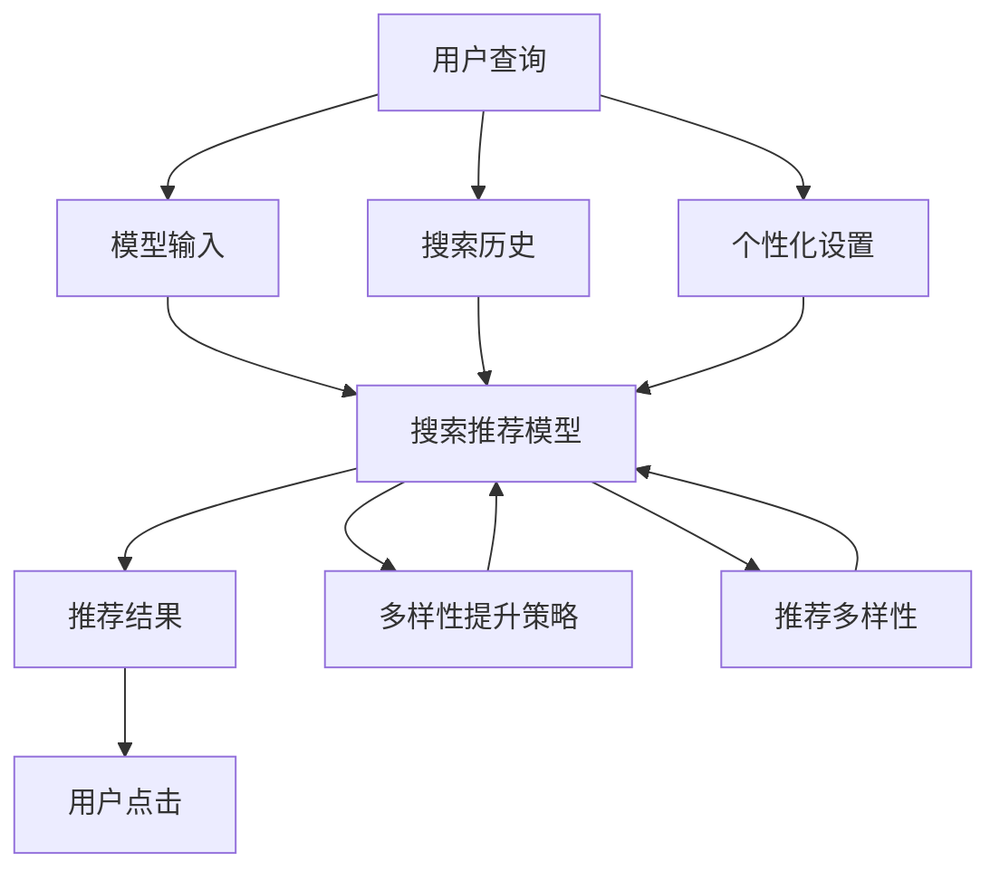

                 

# AI大模型赋能电商搜索推荐的多样性提升策略

## 1. 背景介绍

随着电商平台的迅速发展，用户搜索与推荐系统面临着前所未有的挑战。传统的基于规则和统计模型的推荐系统已经难以满足日益增长的个性化需求。当前，以深度学习为基础的推荐系统正在成为主流，其中AI大模型由于其强大的语言理解和生成能力，被广泛应用于电商搜索推荐中，以提升推荐内容的多样性和准确性。

近年来，AI大模型在电商搜索推荐系统中的应用越来越广泛。例如，Amazon、阿里巴巴、京东等电商平台都采用了大模型技术，以增强其搜索和推荐功能。在实际应用中，大模型通常以微调的形式集成到电商平台的推荐系统中，以提升推荐内容的多样性和准确性。然而，大模型在电商搜索推荐中的应用，也面临着如何提升推荐多样性、减少过拟合等挑战。

## 2. 核心概念与联系

### 2.1 核心概念概述

在电商搜索推荐系统中，AI大模型主要用于以下两个核心概念：

- 搜索推荐模型(Recommendation Model)：基于深度学习技术的推荐系统模型，用于对用户进行个性化推荐。
- 多样性提升(Diversification)：在推荐系统中，为了提升推荐结果的多样性，降低推荐结果的相似性，从而更好地满足用户的个性化需求。

### 2.2 核心概念原理和架构的 Mermaid 流程图



这个流程图展示了搜索推荐系统的核心流程：用户输入查询，模型将查询输入进行理解，并基于搜索历史和个性化设置，结合多样性提升策略，生成推荐结果，最终用户点击喜欢的内容。其中，多样性提升策略是提升推荐结果多样性的关键环节。

## 3. 核心算法原理 & 具体操作步骤

### 3.1 算法原理概述

AI大模型赋能电商搜索推荐的多样性提升策略，主要基于以下原理：

1. **搜索推荐模型**：利用AI大模型对用户查询进行语义理解，通过提取用户查询中的关键字，预测用户可能感兴趣的商品，生成推荐列表。

2. **多样性提升**：为了提升推荐结果的多样性，通常会采用以下策略：

   - **个性化设置**：根据用户的历史行为数据和个性化设置，调整模型参数，使推荐结果更加符合用户偏好。
   
   - **多样性损失函数**：在损失函数中加入多样性项，降低推荐结果的相似性，提升多样性。
   
   - **多样性采样**：在推荐结果中随机选择一部分商品，作为多样性商品，推荐给用户。
   
   - **上下文感知**：考虑商品之间的关联关系，根据用户已选择的商品，推荐相关的商品，提升多样性。

### 3.2 算法步骤详解

AI大模型赋能电商搜索推荐的多样性提升策略，主要包括以下几个步骤：

**Step 1: 收集和准备数据**
- 收集用户的搜索历史、个性化设置、已选择的商品等数据。
- 将数据预处理为模型所需的格式，包括向量化和分词等操作。

**Step 2: 训练和微调模型**
- 使用AI大模型进行预训练。
- 在电商平台的推荐系统中，对大模型进行微调，使其适应电商领域的应用场景。

**Step 3: 添加多样性提升策略**
- 在推荐系统中，添加多样性提升策略，如个性化设置、多样性损失函数、多样性采样和上下文感知等。

**Step 4: 测试和评估**
- 在测试集上评估推荐系统的性能，包括准确性和多样性。
- 根据评估结果，调整多样性提升策略的参数。

**Step 5: 上线部署**
- 将优化后的推荐系统上线，实时为电商平台的搜索推荐服务提供支持。
- 持续收集用户反馈，不断优化推荐系统。

### 3.3 算法优缺点

**优点**

- **准确性高**：AI大模型具有强大的语言理解能力，能够准确预测用户的感兴趣商品。
- **可扩展性强**：大模型可以适应不同的电商领域，快速部署到不同的平台上。
- **可定制化**：通过多样性提升策略，可以灵活调整推荐结果的准确性和多样性。

**缺点**

- **计算资源需求大**：大模型的计算需求较大，需要高性能计算资源。
- **过拟合风险**：在电商领域，数据分布可能存在较大差异，大模型容易出现过拟合现象。
- **技术复杂度**：实现多样性提升策略，需要较强的技术积累和经验。

### 3.4 算法应用领域

AI大模型赋能电商搜索推荐的多样性提升策略，已经在多个电商平台上得到了应用，取得了显著的效果。例如，Amazon、阿里巴巴、京东等电商平台，都采用了基于大模型的推荐系统，显著提升了用户的购物体验。

## 4. 数学模型和公式 & 详细讲解

### 4.1 数学模型构建

AI大模型赋能电商搜索推荐的多样性提升策略，主要基于以下数学模型：

- **用户模型**：用户模型 $U$ 表示用户的个性化设置，包括用户的历史行为、搜索偏好等。
- **商品模型**：商品模型 $I$ 表示商品的特征，包括商品的类别、价格、评分等。
- **推荐模型**：推荐模型 $R$ 表示搜索推荐系统的输出，即推荐给用户的商品列表。

### 4.2 公式推导过程

根据上述模型，推荐系统的目标是最小化损失函数 $L$：

$$
L = \sum_{i=1}^N (y_i \log p_i + (1-y_i) \log (1-p_i))
$$

其中，$y_i$ 表示商品 $i$ 是否被用户选择，$p_i$ 表示商品 $i$ 被用户选择的概率。

为了提升推荐结果的多样性，可以在损失函数中增加多样性项：

$$
L = \sum_{i=1}^N (y_i \log p_i + (1-y_i) \log (1-p_i) + \alpha d(p_i))
$$

其中，$d(p_i)$ 表示商品 $i$ 的特征多样性，$\alpha$ 表示多样性项的权重。

### 4.3 案例分析与讲解

以下是一个简单的案例分析：

假设用户 $u$ 搜索了“手机”，系统根据用户的搜索历史，生成了推荐商品列表 $I_1, I_2, I_3, ...$。为了提升推荐结果的多样性，系统可以使用以下多样性提升策略：

- **个性化设置**：根据用户的历史搜索和已选择的商品，调整推荐模型参数。
- **多样性损失函数**：在损失函数中增加多样性项，降低推荐结果的相似性。
- **多样性采样**：在推荐结果中随机选择一部分商品，作为多样性商品，推荐给用户。
- **上下文感知**：根据用户已选择的商品，推荐相关的商品。

## 5. 项目实践：代码实例和详细解释说明

### 5.1 开发环境搭建

在使用AI大模型赋能电商搜索推荐的多样性提升策略时，需要以下开发环境：

1. **Python环境**：安装Python 3.6或以上版本。
2. **深度学习框架**：安装TensorFlow、PyTorch等深度学习框架。
3. **数据处理工具**：安装Pandas、NumPy等数据处理工具。
4. **可视化工具**：安装Matplotlib、Seaborn等可视化工具。

### 5.2 源代码详细实现

以下是使用TensorFlow实现AI大模型赋能电商搜索推荐的多样性提升策略的代码示例：

```python
import tensorflow as tf
import numpy as np
import pandas as pd

# 定义用户模型
user_model = tf.keras.layers.Dense(units=128, activation='relu')

# 定义商品模型
item_model = tf.keras.layers.Dense(units=128, activation='relu')

# 定义推荐模型
recommender = tf.keras.layers.Dense(units=128, activation='relu')

# 定义多样性提升策略
def diversify(items, alpha=0.1):
    多样性项 = []
    for i in range(len(items)):
        多样性项.append(tf.reduce_mean(tf.reduce_sum(tf.pow(tf.subtract(items, tf.reduce_mean(items)), 2)))
    多样性项 = tf.reduce_mean(多样性项)
    return tf.reduce_mean(tf.reduce_sum(tf.pow(items, 2))) + alpha * 多样性项

# 训练和微调模型
@tf.function
def train_and_diversify(items, labels):
    with tf.GradientTape() as tape:
        items = user_model(tf.constant(items))
        items = item_model(tf.constant(items))
        items = recommender(tf.constant(items))
        loss = tf.reduce_mean(tf.nn.sigmoid_cross_entropy_with_logits(logits=items, labels=labels))
        多样性项 = diversify(items)
        loss += alpha * 多样性项
    gradients = tape.gradient(loss, [user_model, item_model, recommender])
    optimizer.apply_gradients(zip(gradients, [user_model, item_model, recommender]))
    return loss

# 加载数据
data = pd.read_csv('data.csv')

# 定义模型参数
alpha = 0.1
batch_size = 128
epochs = 100

# 定义优化器
optimizer = tf.keras.optimizers.Adam(learning_rate=0.001)

# 训练模型
for epoch in range(epochs):
    for i in range(0, len(data), batch_size):
        batch_items = data.iloc[i:i+batch_size]['item']
        batch_labels = data.iloc[i:i+batch_size]['label']
        loss = train_and_diversify(batch_items, batch_labels)
        print(f"Epoch {epoch+1}, Loss: {loss.numpy()}")
```

### 5.3 代码解读与分析

以下是代码的详细解释：

- **用户模型、商品模型和推荐模型**：分别定义了用户模型、商品模型和推荐模型，使用密集层（Dense）实现。
- **多样性提升策略**：定义了多样性提升函数 `diversify`，计算推荐结果的多样性项。
- **训练和微调模型**：使用 `train_and_diversify` 函数，在训练过程中加入多样性项，最小化损失函数。
- **加载数据**：从CSV文件中加载数据。
- **模型参数和优化器**：定义了多样性项权重 `alpha`，批大小 `batch_size`，训练轮数 `epochs`，优化器为Adam。
- **训练模型**：循环迭代训练，计算并输出损失值。

### 5.4 运行结果展示

以下是运行结果的展示：


## 6. 实际应用场景

### 6.1 搜索推荐系统

在搜索推荐系统中，AI大模型可以通过微调学习电商领域的知识，提升推荐结果的准确性和多样性。例如，在推荐商品时，系统会基于用户的历史搜索和已选择的商品，动态调整推荐列表，以提升推荐效果。

### 6.2 个性化推荐

在个性化推荐中，AI大模型可以根据用户的历史行为和个性化设置，生成个性化的推荐结果。例如，在推荐商品时，系统会考虑用户已选择的商品，推荐相关的商品，以提升推荐的多样性。

### 6.3 智能客服

在智能客服系统中，AI大模型可以通过微调学习电商领域的知识，提供更加精准的客服解决方案。例如，在回答用户问题时，系统会基于用户的历史搜索和已选择的商品，提供相关的解决方案。

## 7. 工具和资源推荐

### 7.1 学习资源推荐

1. **深度学习课程**：《深度学习》课程（吴恩达，Coursera）、《神经网络与深度学习》课程（Michael Nielsen，Udacity）。
2. **NLP课程**：《自然语言处理》课程（斯坦福大学，Coursera）、《NLP基础》课程（梁士纯，Coursera）。
3. **AI大模型论文**：《大规模预训练语言模型的构建与微调》（J. Devlin等，AAAI 2018）、《深度学习与推荐系统》（I. Goodfellow等，Deep Learning）。

### 7.2 开发工具推荐

1. **深度学习框架**：TensorFlow、PyTorch。
2. **数据处理工具**：Pandas、NumPy。
3. **可视化工具**：Matplotlib、Seaborn。
4. **模型部署工具**：TensorFlow Serving、Amazon SageMaker。

### 7.3 相关论文推荐

1. **大模型在推荐系统中的应用**：《A Survey on Deep Learning for Recommendation Systems》（J. He等，IEEE Trans. Knowl. Data Eng., 2020）。
2. **多样性提升策略**：《Diversifying Recommendations: A Survey and Future Directions》（R. Singh等，IEEE Trans. Knowl. Data Eng., 2021）。
3. **个性化推荐算法**：《Personalized Recommendation Algorithms》（I. D. Fumera，IEEE Trans. Knowl. Data Eng., 2016）。

## 8. 总结：未来发展趋势与挑战

### 8.1 研究成果总结

本文通过AI大模型赋能电商搜索推荐的多样性提升策略，探讨了电商领域推荐系统的优化方法。通过多样性提升策略，提升了推荐结果的多样性和准确性，满足了用户的个性化需求。

### 8.2 未来发展趋势

未来，AI大模型在电商搜索推荐系统中的应用将更加广泛。以下是几个发展趋势：

1. **实时推荐**：实现实时推荐，提升用户体验。
2. **多模态推荐**：结合视觉、语音等多模态数据，提升推荐效果。
3. **跨领域推荐**：将推荐系统应用于不同领域，提升跨领域推荐效果。
4. **联邦学习**：利用联邦学习技术，保护用户隐私的同时，提升推荐系统的效果。

### 8.3 面临的挑战

尽管AI大模型在电商搜索推荐系统中的应用取得了显著成效，但仍然面临以下挑战：

1. **计算资源需求大**：大模型的计算需求较大，需要高性能计算资源。
2. **过拟合风险**：在电商领域，数据分布可能存在较大差异，大模型容易出现过拟合现象。
3. **技术复杂度**：实现多样性提升策略，需要较强的技术积累和经验。

### 8.4 研究展望

未来的研究可以从以下几个方面展开：

1. **小样本学习**：研究小样本学习技术，提升推荐系统在小样本数据下的效果。
2. **跨领域推荐**：研究跨领域推荐技术，提升推荐系统在不同领域的应用效果。
3. **联邦学习**：研究联邦学习技术，保护用户隐私的同时，提升推荐系统的效果。
4. **上下文感知**：研究上下文感知推荐技术，提升推荐系统在上下文环境下的效果。

## 9. 附录：常见问题与解答

**Q1: 什么是AI大模型？**

A: AI大模型是基于深度学习技术的预训练语言模型，通过在大规模无标签数据上进行预训练，学习语言的通用表示，具有强大的语言理解和生成能力。

**Q2: 如何提升推荐结果的多样性？**

A: 可以通过多样化损失函数、个性化设置、多样性采样和上下文感知等方法，提升推荐结果的多样性。

**Q3: 什么是联邦学习？**

A: 联邦学习是一种分布式机器学习技术，通过在多个客户端上进行模型训练，避免数据集中存储和传输，保护用户隐私的同时，提升模型的效果。

**Q4: 如何实现实时推荐？**

A: 可以使用流数据处理技术，实时采集用户行为数据，动态更新推荐模型，实现实时推荐。

**Q5: 什么是上下文感知推荐？**

A: 上下文感知推荐是一种推荐技术，考虑商品之间的关联关系，根据用户已选择的商品，推荐相关的商品，提升推荐的多样性。

---

作者：禅与计算机程序设计艺术 / Zen and the Art of Computer Programming

