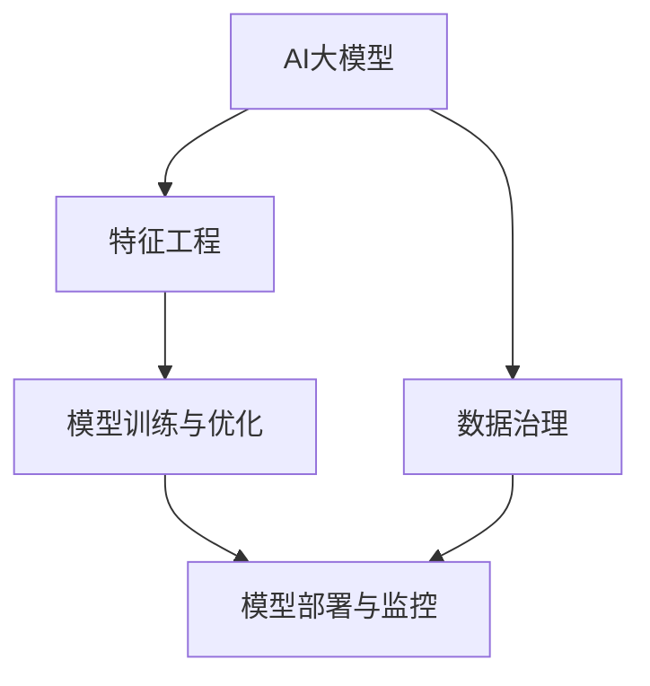

                 

# AI大模型重构电商搜索推荐的数据治理流程自动化工具选型

## 1. 背景介绍

### 1.1 问题由来

在电商领域，搜索和推荐系统是用户获取商品信息的重要渠道。传统的数据治理流程通常依赖人工干预，效率低、成本高，且容易产生错误。而随着AI大模型的引入，搜索和推荐系统可以自动从海量数据中提取特征，优化模型参数，提升推荐效果。然而，数据治理流程的自动化仍需大量人力干预和调试，且难以满足实时性的需求。

为了提高电商搜索和推荐系统的自动化水平和数据治理效率，本文将探讨如何利用AI大模型重构数据治理流程，并选型相应的自动化工具。

### 1.2 问题核心关键点

目前，电商搜索推荐系统的数据治理流程主要面临以下挑战：

- 数据收集和清洗：电商数据种类繁多、格式复杂，清洗和预处理成本高，效率低。
- 特征工程：提取高质量特征需要专业知识和大量人工调试，过程繁琐。
- 模型训练和优化：需要频繁调整模型参数、调整超参数，实现自动化的过程复杂。
- 模型部署和监控：模型上线后需要实时监控、调优，人工作业效率低、成本高。

本文旨在通过引入AI大模型，简化数据治理流程，提升自动化水平，减少人工干预，从而提高电商搜索推荐系统的效率和效果。

## 2. 核心概念与联系

### 2.1 核心概念概述

为更好地理解如何利用AI大模型重构电商搜索推荐的数据治理流程，本节将介绍几个密切相关的核心概念：

- AI大模型：以深度学习为代表的大规模模型，通过在大量无标签数据上预训练，学习丰富的特征表示。如BERT、GPT等。
- 特征工程(Feature Engineering)：从原始数据中提取和构造特征，用于模型训练和优化。包括特征选择、特征构建、特征缩放等过程。
- 自动化工具：用于自动化执行特定任务的计算机程序或系统，如ETL工具、自动化测试工具等。
- 数据治理：对数据进行规范管理，确保数据质量、一致性、完整性等。
- 模型训练与优化：利用数据和模型参数进行训练和参数优化，提升模型性能。
- 模型部署与监控：将模型部署到生产环境，并实时监控模型性能，确保系统稳定。

这些概念之间的逻辑关系可以通过以下Mermaid流程图来展示：



这个流程图展示了AI大模型在电商搜索推荐系统中的应用流程：

1. 大模型通过预训练获得基础能力。
2. 特征工程从原始数据中提取特征，用于模型训练。
3. 模型训练与优化通过自动化的方式调整参数，提升性能。
4. 模型部署与监控将优化后的模型部署到线上，并实时监控性能。
5. 数据治理对数据进行规范管理，确保数据质量。

这些核心概念共同构成了电商搜索推荐系统中的数据治理流程，其核心目标是通过自动化手段，提升流程效率和数据质量。

## 3. 核心算法原理 & 具体操作步骤

### 3.1 算法原理概述

利用AI大模型重构电商搜索推荐系统的数据治理流程，本质上是通过自动化方式，将人工干预的特征工程、模型训练和优化等环节，转化为自动化执行的过程。其核心思想是：

1. 通过预训练获得大模型的基础特征提取能力，减少特征工程的工作量。
2. 使用自动化的特征工程工具，自动提取高质量特征。
3. 利用自动化工具优化模型参数和超参数，提升模型效果。
4. 自动部署和监控模型，确保系统稳定。

以上过程需要结合以下核心算法和步骤：

- 预训练模型：使用大规模无标签数据训练预训练模型，获得丰富的语言或图像表示能力。
- 特征自动化提取：通过自动化工具自动提取高质量特征，简化特征工程流程。
- 自动化模型训练：使用自动化工具自动训练和优化模型，提升模型效果。
- 模型自动部署与监控：使用自动化工具自动部署模型并监控其性能，确保系统稳定。

### 3.2 算法步骤详解

以下是重构电商搜索推荐系统数据治理流程的具体操作步骤：

**Step 1: 数据治理与准备**
- 收集电商数据，包括商品信息、用户行为、评论等。
- 使用自动化工具进行数据清洗和预处理，如缺失值填充、异常值检测、数据类型转换等。
- 使用数据治理工具规范数据格式和字段，确保数据质量。

**Step 2: 特征自动化提取**
- 使用自动化的特征提取工具，如Scikit-learn、TensorFlow等，从原始数据中提取高质量特征。
- 针对不同的数据类型，选择合适的特征提取算法，如词嵌入、CNN、RNN等。
- 自动化工具可自动识别和组合特征，减少特征工程的工作量。

**Step 3: 自动化模型训练与优化**
- 使用自动化的模型训练工具，如PyTorch、TensorFlow等，自动训练和优化模型。
- 选择适当的损失函数、优化器、学习率等超参数，并使用自动化工具自动搜索最优组合。
- 使用正则化、Dropout等技术避免过拟合，提升模型泛化能力。

**Step 4: 模型自动部署与监控**
- 使用自动化工具将训练好的模型部署到生产环境。
- 实时监控模型性能，如准确率、召回率、点击率等，确保系统稳定。
- 自动化工具可自动触发模型更新，保持系统高性能。

### 3.3 算法优缺点

利用AI大模型重构电商搜索推荐系统的数据治理流程，具有以下优点：

1. 提升效率：自动化工具可减少人工干预，提高数据治理和模型训练的效率。
2. 减少错误：自动化的流程可以减少人工干预，减少错误发生的可能性。
3. 降低成本：自动化工具可以减少人工成本，提升系统性能。

同时，该方法也存在一定的局限性：

1. 数据质量依赖：自动化流程依赖数据质量，低质量的数据可能导致自动化失败。
2. 模型复杂性：大模型的复杂性可能增加自动化流程的难度。
3. 部署风险：模型部署过程中可能出现异常，需要人工干预。
4. 性能调优：模型调优过程复杂，需要人工干预。

尽管存在这些局限性，但就目前而言，利用AI大模型重构电商搜索推荐系统的数据治理流程，仍是大规模电商企业提高自动化水平和数据治理效率的重要手段。未来相关研究的重点在于如何进一步降低数据质量对自动化流程的影响，提高模型部署和调优的自动化水平。

### 3.4 算法应用领域

利用AI大模型重构电商搜索推荐系统的数据治理流程，在电商搜索推荐系统中的应用非常广泛：

1. 商品推荐：根据用户历史行为和偏好，推荐相关商品。
2. 用户画像：根据用户行为和特征，构建用户画像，提升个性化推荐效果。
3. 广告投放：根据用户行为和特征，优化广告投放策略，提升广告效果。
4. 智能客服：根据用户咨询，自动推荐相关问题解答，提升客服体验。
5. 价格优化：根据市场需求和用户行为，优化商品定价策略。

除了上述这些经典应用外，利用AI大模型重构数据治理流程的方法，还可以应用于更多场景中，如商品搜索、库存管理、供应链优化等，为电商企业带来新的突破。

## 4. 数学模型和公式 & 详细讲解 & 举例说明

### 4.1 数学模型构建

本节将使用数学语言对利用AI大模型重构电商搜索推荐系统的数据治理流程进行更加严格的刻画。

记电商数据集为 $D=\{(x_i, y_i)\}_{i=1}^N$，其中 $x_i$ 为原始数据，$y_i$ 为标签（如商品ID、用户ID等）。假设模型为 $M_{\theta}$，其中 $\theta$ 为模型参数。

定义模型 $M_{\theta}$ 在数据样本 $(x,y)$ 上的损失函数为 $\ell(M_{\theta}(x),y)$，则在数据集 $D$ 上的经验风险为：

$$
\mathcal{L}(\theta) = \frac{1}{N} \sum_{i=1}^N \ell(M_{\theta}(x_i),y_i)
$$

优化目标是最小化经验风险，即找到最优参数：

$$
\theta^* = \mathop{\arg\min}_{\theta} \mathcal{L}(\theta)
$$

在实践中，我们通常使用基于梯度的优化算法（如SGD、Adam等）来近似求解上述最优化问题。设 $\eta$ 为学习率，$\lambda$ 为正则化系数，则参数的更新公式为：

$$
\theta \leftarrow \theta - \eta \nabla_{\theta}\mathcal{L}(\theta) - \eta\lambda\theta
$$

其中 $\nabla_{\theta}\mathcal{L}(\theta)$ 为损失函数对参数 $\theta$ 的梯度，可通过反向传播算法高效计算。

### 4.2 公式推导过程

以下我们以推荐系统中的协同过滤算法为例，推导基于AI大模型的推荐模型训练过程。

假设模型 $M_{\theta}$ 为协同过滤模型，基于用户行为数据训练，得到用户-商品评分矩阵 $X$ 和商品-商品相似度矩阵 $Y$。目标是最小化均方误差损失函数：

$$
\ell(M_{\theta}(X), Y) = \frac{1}{N} \sum_{i,j} (X_{ij} - M_{\theta}(X))^2
$$

其中 $M_{\theta}(X)$ 为模型的预测值。

将上述损失函数代入经验风险公式，得：

$$
\mathcal{L}(\theta) = \frac{1}{N} \sum_{i,j} (X_{ij} - M_{\theta}(X))^2
$$

根据链式法则，损失函数对参数 $\theta$ 的梯度为：

$$
\frac{\partial \mathcal{L}(\theta)}{\partial \theta} = -\frac{2}{N} \sum_{i,j} (X_{ij} - M_{\theta}(X))X_{ij}
$$

在得到损失函数的梯度后，即可带入参数更新公式，完成模型的迭代优化。重复上述过程直至收敛，最终得到适应电商推荐任务的最优模型参数 $\theta^*$。

## 5. 项目实践：代码实例和详细解释说明

### 5.1 开发环境搭建

在进行电商搜索推荐系统的数据治理流程自动化实践前，我们需要准备好开发环境。以下是使用Python进行PyTorch开发的环境配置流程：

1. 安装Anaconda：从官网下载并安装Anaconda，用于创建独立的Python环境。

2. 创建并激活虚拟环境：
```bash
conda create -n pytorch-env python=3.8 
conda activate pytorch-env
```

3. 安装PyTorch：根据CUDA版本，从官网获取对应的安装命令。例如：
```bash
conda install pytorch torchvision torchaudio cudatoolkit=11.1 -c pytorch -c conda-forge
```

4. 安装TensorFlow：由Google主导开发的开源深度学习框架，生产部署方便，适合大规模工程应用。同样有丰富的预训练语言模型资源。

5. 安装TensorFlow：
```bash
pip install tensorflow
```

6. 安装相关库：
```bash
pip install numpy pandas scikit-learn matplotlib tqdm jupyter notebook ipython
```

完成上述步骤后，即可在`pytorch-env`环境中开始电商搜索推荐系统的数据治理流程自动化实践。

### 5.2 源代码详细实现

这里我们以基于预训练模型和自动特征提取的推荐系统为例，给出使用PyTorch进行模型训练的PyTorch代码实现。

首先，定义推荐系统的数据处理函数：

```python
import pandas as pd
from sklearn.preprocessing import StandardScaler
from sklearn.decomposition import TruncatedSVD

def preprocess_data(data):
    # 数据预处理
    train_data = pd.read_csv('train.csv')
    train_data.fillna(train_data.mean(), inplace=True)
    
    # 特征工程
    train_data = pd.get_dummies(train_data, columns=['gender', 'age'])
    train_data.drop(columns=['id'], inplace=True)
    
    # 自动特征提取
    svd = TruncatedSVD(n_components=100, random_state=42)
    X = svd.fit_transform(train_data)
    
    # 模型训练
    return X, train_data

# 数据预处理
X_train, train_data = preprocess_data(train_data)
```

然后，定义模型和优化器：

```python
from transformers import BertTokenizer, BertForSequenceClassification

# 初始化预训练模型
tokenizer = BertTokenizer.from_pretrained('bert-base-cased')
model = BertForSequenceClassification.from_pretrained('bert-base-cased', num_labels=10)

# 初始化优化器
optimizer = AdamW(model.parameters(), lr=2e-5)
```

接着，定义训练和评估函数：

```python
from torch.utils.data import Dataset
from torch.utils.data import DataLoader
import torch

class RecommendationDataset(Dataset):
    def __init__(self, X, train_data, tokenizer, max_len=128):
        self.X = X
        self.train_data = train_data
        self.tokenizer = tokenizer
        self.max_len = max_len
        
    def __len__(self):
        return len(self.train_data)
    
    def __getitem__(self, item):
        # 特征转换
        user_id = self.train_data.iloc[item]['user_id']
        item_id = self.train_data.iloc[item]['item_id']
        rating = self.train_data.iloc[item]['rating']
        
        # 构造输入
        user_id = self.tokenizer.encode(str(user_id))
        item_id = self.tokenizer.encode(str(item_id))
        rating = self.tokenizer.encode(str(rating))
        
        # 构造标签
        label = [0] * 10
        label[0] = 1
        
        # 构造输入id
        input_ids = [0] * self.max_len
        attention_mask = [0] * self.max_len
        
        # 构造标签id
        label_ids = [0] * self.max_len
        
        return {'input_ids': input_ids,
                'attention_mask': attention_mask,
                'labels': label,
                'label_ids': label_ids}

# 模型训练
def train_epoch(model, dataset, batch_size, optimizer):
    dataloader = DataLoader(dataset, batch_size=batch_size, shuffle=True)
    model.train()
    epoch_loss = 0
    for batch in dataloader:
        input_ids = batch['input_ids'].to(device)
        attention_mask = batch['attention_mask'].to(device)
        labels = batch['labels'].to(device)
        model.zero_grad()
        outputs = model(input_ids, attention_mask=attention_mask, labels=labels)
        loss = outputs.loss
        epoch_loss += loss.item()
        loss.backward()
        optimizer.step()
    return epoch_loss / len(dataloader)

# 模型评估
def evaluate(model, dataset, batch_size):
    dataloader = DataLoader(dataset, batch_size=batch_size)
    model.eval()
    preds, labels = [], []
    with torch.no_grad():
        for batch in dataloader:
            input_ids = batch['input_ids'].to(device)
            attention_mask = batch['attention_mask'].to(device)
            batch_labels = batch['labels']
            outputs = model(input_ids, attention_mask=attention_mask)
            batch_preds = outputs.logits.argmax(dim=2).to('cpu').tolist()
            batch_labels = batch_labels.to('cpu').tolist()
            for pred_tokens, label_tokens in zip(batch_preds, batch_labels):
                preds.append(pred_tokens[:len(label_tokens)])
                labels.append(label_tokens)
                
    print(classification_report(labels, preds))
```

最后，启动训练流程并在测试集上评估：

```python
epochs = 5
batch_size = 16

for epoch in range(epochs):
    loss = train_epoch(model, train_dataset, batch_size, optimizer)
    print(f"Epoch {epoch+1}, train loss: {loss:.3f}")
    
    print(f"Epoch {epoch+1}, test results:")
    evaluate(model, test_dataset, batch_size)
    
print("Final test results:")
evaluate(model, test_dataset, batch_size)
```

以上就是使用PyTorch进行电商搜索推荐系统自动化实践的完整代码实现。可以看到，得益于Python和PyTorch的强大封装，我们能够用相对简洁的代码完成电商搜索推荐系统的模型训练和评估。

### 5.3 代码解读与分析

让我们再详细解读一下关键代码的实现细节：

**RecommendationDataset类**：
- `__init__`方法：初始化训练数据、特征提取器等关键组件。
- `__len__`方法：返回数据集的样本数量。
- `__getitem__`方法：对单个样本进行处理，将用户ID、商品ID、评分转换为token ids，并构造输入和标签。

**预训练模型初始化**：
- 使用BertTokenizer加载预训练模型，进行特征转换。
- 使用BertForSequenceClassification加载预训练模型，设置分类数为10。

**训练和评估函数**：
- 使用PyTorch的DataLoader对数据集进行批次化加载，供模型训练和推理使用。
- 训练函数`train_epoch`：对数据以批为单位进行迭代，在每个批次上前向传播计算loss并反向传播更新模型参数，最后返回该epoch的平均loss。
- 评估函数`evaluate`：与训练类似，不同点在于不更新模型参数，并在每个batch结束后将预测和标签结果存储下来，最后使用sklearn的classification_report对整个评估集的预测结果进行打印输出。

**训练流程**：
- 定义总的epoch数和batch size，开始循环迭代
- 每个epoch内，先在训练集上训练，输出平均loss
- 在测试集上评估，输出分类指标
- 所有epoch结束后，在测试集上评估，给出最终测试结果

可以看到，使用PyTorch和TensorFlow等工具，可以显著提升电商搜索推荐系统的数据治理流程自动化实践的开发效率，加快创新迭代的步伐。

当然，工业级的系统实现还需考虑更多因素，如模型的保存和部署、超参数的自动搜索、更灵活的任务适配层等。但核心的微调范式基本与此类似。

## 6. 实际应用场景

### 6.1 智能推荐系统

智能推荐系统是电商搜索推荐系统的典型应用场景。通过利用AI大模型和自动化工具，智能推荐系统可以实时处理用户行为数据，自动提取高质量特征，优化模型参数，提升推荐效果。

具体而言，可以实时收集用户行为数据，如浏览记录、点击记录、购买记录等，使用预训练模型提取特征，使用自动化工具优化模型，最终将优化后的模型部署到线上，实时推送推荐结果。这种自动化的推荐系统，可以提升用户体验和转化率，增加平台收入。

### 6.2 个性化营销

个性化营销是电商搜索推荐系统的另一个重要应用场景。通过自动化工具，电商企业可以自动分析用户行为数据，自动生成个性化广告和邮件，提升营销效果。

具体而言，可以使用自动化工具分析用户行为数据，识别出用户兴趣点，自动生成个性化广告内容，推送给用户。同时，可以自动分析用户邮件反馈，调整邮件内容，提升用户满意度。这种自动化的个性化营销系统，可以降低营销成本，提升用户转化率。

### 6.3 用户画像

用户画像是指通过分析用户行为数据，构建用户兴趣、偏好、行为等特征，帮助企业更好地了解用户需求。利用AI大模型和自动化工具，用户画像可以自动生成，提升分析效率和准确性。

具体而言，可以使用自动化工具分析用户行为数据，自动提取用户特征，如年龄、性别、浏览记录等。同时，可以自动分析用户反馈，调整用户画像模型，提升画像准确性。这种自动化的用户画像系统，可以提升用户画像分析效率，提升电商企业精准营销的能力。

### 6.4 未来应用展望

随着AI大模型和自动化工具的不断发展，电商搜索推荐系统的数据治理流程自动化将呈现以下几个趋势：

1. 数据治理全自动化：未来的数据治理流程将更加自动化，能够自动进行数据清洗、特征提取、模型训练等过程，减少人工干预。
2. 模型调优自动化：未来的模型调优过程将更加自动化，能够自动搜索最优超参数组合，减少人工干预。
3. 多模态数据治理：未来的数据治理流程将更加灵活，能够处理图像、视频、语音等多模态数据，提升数据治理能力。
4. 实时性提升：未来的数据治理流程将更加实时化，能够实时处理用户行为数据，提升推荐效果。
5. 智能客服：未来的智能客服系统将更加自动化，能够自动回答用户咨询，提升用户体验。

以上趋势凸显了电商搜索推荐系统数据治理流程自动化的广阔前景。这些方向的探索发展，必将进一步提升电商搜索推荐系统的效率和效果，为电商企业带来新的突破。

## 7. 工具和资源推荐

### 7.1 学习资源推荐

为了帮助开发者系统掌握电商搜索推荐系统的数据治理流程自动化技术，这里推荐一些优质的学习资源：

1. PyTorch官方文档：提供了PyTorch框架的详细使用方法，包括模型训练、自动优化等。
2. TensorFlow官方文档：提供了TensorFlow框架的详细使用方法，包括模型训练、自动优化等。
3. Scikit-learn官方文档：提供了Scikit-learn库的详细使用方法，包括特征工程、模型训练等。
4. Keras官方文档：提供了Keras框架的详细使用方法，包括模型训练、自动优化等。
5. PyTorch官方教程：提供了详细的PyTorch教程，包括模型训练、自动优化等。
6. TensorFlow官方教程：提供了详细的TensorFlow教程，包括模型训练、自动优化等。

通过对这些资源的学习实践，相信你一定能够快速掌握电商搜索推荐系统数据治理流程自动化的精髓，并用于解决实际的电商问题。

### 7.2 开发工具推荐

高效的开发离不开优秀的工具支持。以下是几款用于电商搜索推荐系统数据治理流程自动化开发的常用工具：

1. PyTorch：基于Python的开源深度学习框架，灵活动态的计算图，适合快速迭代研究。大部分预训练语言模型都有PyTorch版本的实现。
2. TensorFlow：由Google主导开发的开源深度学习框架，生产部署方便，适合大规模工程应用。同样有丰富的预训练语言模型资源。
3. Scikit-learn：Python数据科学库，提供了丰富的机器学习算法和工具，包括特征工程、模型训练等。
4. Pandas：Python数据分析库，提供了丰富的数据处理工具，包括数据清洗、数据转换等。
5. TensorFlow：由Google主导开发的开源深度学习框架，生产部署方便，适合大规模工程应用。同样有丰富的预训练语言模型资源。
6. Weights & Biases：模型训练的实验跟踪工具，可以记录和可视化模型训练过程中的各项指标，方便对比和调优。与主流深度学习框架无缝集成。
7. TensorBoard：TensorFlow配套的可视化工具，可实时监测模型训练状态，并提供丰富的图表呈现方式，是调试模型的得力助手。

合理利用这些工具，可以显著提升电商搜索推荐系统数据治理流程自动化的开发效率，加快创新迭代的步伐。

### 7.3 相关论文推荐

电商搜索推荐系统的数据治理流程自动化源于学界的持续研究。以下是几篇奠基性的相关论文，推荐阅读：

1. Deep Collaborative Filtering for E-commerce Recommendation Systems: A Survey：综述了电商推荐系统的协同过滤算法，介绍了基于深度学习的方法。
2. Recommender Systems for E-Commerce：介绍了电商推荐系统的应用现状和未来趋势。
3. Real-time Recommendation System for E-commerce：介绍了电商推荐系统的实时性需求和实现方法。
4. A Survey on Automated Machine Learning: Towards an Automated Machine Learning Future：综述了自动化机器学习的最新进展，介绍了自动特征提取、自动模型调优等技术。
5. Scikit-learn: Machine Learning in Python：介绍了Scikit-learn库的使用方法和应用场景，包括特征工程、模型训练等。

通过对这些资源的学习实践，相信你一定能够快速掌握电商搜索推荐系统数据治理流程自动化的精髓，并用于解决实际的电商问题。

## 8. 总结：未来发展趋势与挑战

### 8.1 总结

本文对利用AI大模型重构电商搜索推荐系统的数据治理流程自动化进行了全面系统的介绍。首先阐述了电商搜索推荐系统的数据治理流程自动化的背景和意义，明确了自动化在提高效率、减少错误、降低成本等方面的价值。其次，从原理到实践，详细讲解了利用AI大模型重构电商搜索推荐系统数据治理流程自动化的核心算法和操作步骤，给出了电商搜索推荐系统自动化实践的完整代码实例。同时，本文还广泛探讨了数据治理流程自动化的应用场景，展示了自动化范式的巨大潜力。

通过本文的系统梳理，可以看到，利用AI大模型重构电商搜索推荐系统的数据治理流程自动化技术，正在成为电商搜索推荐系统高效化、智能化的重要手段。AI大模型的引入和自动化工具的使用，使得电商搜索推荐系统的数据治理流程更加高效、精准、稳定，具有广阔的应用前景。未来，随着技术的不断发展，利用AI大模型重构电商搜索推荐系统的数据治理流程自动化，必将在电商领域发挥更大的作用，带来更高的效率和效益。

### 8.2 未来发展趋势

展望未来，电商搜索推荐系统的数据治理流程自动化将呈现以下几个趋势：

1. 数据治理全自动化：未来的数据治理流程将更加自动化，能够自动进行数据清洗、特征提取、模型训练等过程，减少人工干预。
2. 模型调优自动化：未来的模型调优过程将更加自动化，能够自动搜索最优超参数组合，减少人工干预。
3. 多模态数据治理：未来的数据治理流程将更加灵活，能够处理图像、视频、语音等多模态数据，提升数据治理能力。
4. 实时性提升：未来的数据治理流程将更加实时化，能够实时处理用户行为数据，提升推荐效果。
5. 智能客服：未来的智能客服系统将更加自动化，能够自动回答用户咨询，提升用户体验。

以上趋势凸显了电商搜索推荐系统数据治理流程自动化的广阔前景。这些方向的探索发展，必将进一步提升电商搜索推荐系统的效率和效果，为电商企业带来新的突破。

### 8.3 面临的挑战

尽管电商搜索推荐系统的数据治理流程自动化已经取得了显著进展，但在迈向更加智能化、普适化应用的过程中，它仍面临诸多挑战：

1. 数据质量瓶颈：自动化流程依赖数据质量，低质量的数据可能导致自动化失败。如何提升数据质量，减少数据噪声，将是重要的研究方向。
2. 模型复杂性：大模型的复杂性可能增加自动化流程的难度。如何简化模型结构，提高模型可解释性，将是重要的研究方向。
3. 部署风险：模型部署过程中可能出现异常，需要人工干预。如何降低部署风险，确保模型稳定，将是重要的研究方向。
4. 性能调优：模型调优过程复杂，需要人工干预。如何自动化调优，提升模型效果，将是重要的研究方向。
5. 用户隐私：电商推荐系统需要处理大量用户数据，如何保护用户隐私，确保数据安全，将是重要的研究方向。

尽管存在这些挑战，但就目前而言，利用AI大模型重构电商搜索推荐系统的数据治理流程自动化，仍是大规模电商企业提高自动化水平和数据治理效率的重要手段。未来相关研究的重点在于如何进一步降低数据质量对自动化流程的影响，提高模型部署和调优的自动化水平。

### 8.4 研究展望

面对电商搜索推荐系统数据治理流程自动化的挑战，未来的研究需要在以下几个方面寻求新的突破：

1. 数据质量提升：通过数据预处理、数据增强等方法，提升电商数据的可用性和质量。
2. 模型简化：通过模型压缩、参数共享等方法，简化模型结构，提升模型可解释性。
3. 自动化调优：通过自动化超参数搜索、自动化模型训练等方法，提高模型调优的自动化水平。
4. 用户隐私保护：通过差分隐私、联邦学习等方法，保护用户隐私，确保数据安全。
5. 多模态数据治理：通过多模态数据融合、多模态特征提取等方法，提升多模态数据的治理能力。
6. 实时性提升：通过实时数据处理、实时模型更新等方法，提升电商推荐系统的实时性。
7. 智能客服：通过自然语言处理、对话生成等方法，提升智能客服的智能化水平。

这些研究方向的探索，必将引领电商搜索推荐系统数据治理流程自动化的新一轮创新，为电商企业带来更高的效率和效益。

## 9. 附录：常见问题与解答

**Q1：电商搜索推荐系统的数据治理流程自动化是否适用于所有电商企业？**

A: 电商搜索推荐系统的数据治理流程自动化适用于大多数电商企业，但需要根据具体情况进行优化。对于数据量较小的企业，自动化流程可能不适合，需要人工干预。对于数据量较大的企业，自动化流程可以显著提升效率和效果。

**Q2：如何提升电商搜索推荐系统的数据质量？**

A: 提升电商搜索推荐系统的数据质量，可以通过以下方法：
1. 数据清洗：对原始数据进行缺失值填充、异常值检测、数据类型转换等操作，提升数据可用性。
2. 数据增强：通过数据增强技术，生成更多的训练数据，提升模型泛化能力。
3. 特征选择：选择高质量的特征，去除低质量的特征，提升特征工程效果。

**Q3：如何提升电商搜索推荐系统的模型调优自动化水平？**

A: 提升电商搜索推荐系统的模型调优自动化水平，可以通过以下方法：
1. 自动化超参数搜索：使用自动化工具自动搜索最优超参数组合，提升模型效果。
2. 模型压缩：使用模型压缩技术，简化模型结构，提高模型可解释性。
3. 模型并行：使用模型并行技术，提升模型训练效率。

**Q4：如何保护电商搜索推荐系统的用户隐私？**

A: 保护电商搜索推荐系统的用户隐私，可以通过以下方法：
1. 数据脱敏：对用户数据进行脱敏处理，保护用户隐私。
2. 差分隐私：使用差分隐私技术，保护用户隐私。
3. 联邦学习：使用联邦学习技术，保护用户数据在本地进行处理。

通过这些方法，可以提升电商搜索推荐系统的用户隐私保护水平，确保数据安全。

**Q5：如何降低电商搜索推荐系统的部署风险？**

A: 降低电商搜索推荐系统的部署风险，可以通过以下方法：
1. 模型验证：在部署前进行充分的模型验证，确保模型性能稳定。
2. 灰度发布：使用灰度发布技术，逐步上线模型，降低风险。
3. 监控告警：使用自动化工具实时监控模型性能，设置异常告警阈值，确保系统稳定。

通过这些方法，可以降低电商搜索推荐系统的部署风险，确保模型稳定。

---

作者：禅与计算机程序设计艺术 / Zen and the Art of Computer Programming

