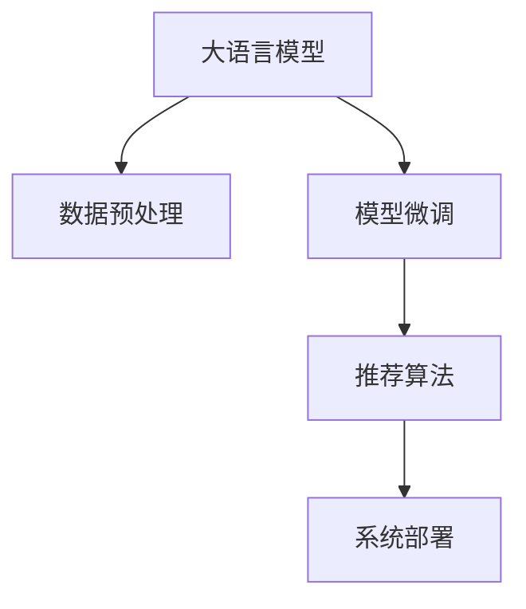
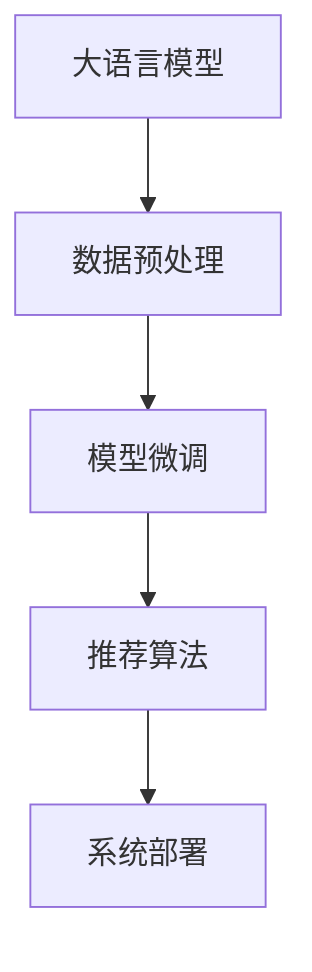

                 

## 1. 背景介绍

在电商领域，搜索推荐系统是用户体验和商业收入的关键环节。随着在线用户的激增和商品丰富度的提升，如何在大数据量、多维度数据中高效获取精准的商品推荐，成为电商企业必须解决的问题。近年来，大语言模型在电商搜索推荐中的应用日益广泛，成为行业提升搜索推荐效果的重要工具。本文将介绍AI大模型在电商搜索推荐业务中的全链路优化方法，包括数据预处理、模型微调、推荐算法优化以及系统部署等多个环节，希望能为电商企业提供借鉴和参考。

## 2. 核心概念与联系

### 2.1 核心概念概述

为更好地理解大模型在电商搜索推荐中的应用，本文首先介绍一些核心概念：

- **大语言模型**：以Transformer结构为代表的大规模预训练语言模型，如BERT、GPT等。通过在海量无标签文本数据上进行预训练，学习语言的通用表示，具备强大的语义理解和生成能力。
- **数据预处理**：对原始数据进行清洗、归一化、特征提取等操作，以便于模型能够高效地学习数据。
- **模型微调**：在大规模预训练模型的基础上，使用下游任务的标注数据进行有监督学习优化，使模型能够适应特定任务。
- **推荐算法**：包括基于排序的推荐算法和基于协同过滤的推荐算法等，用于根据用户历史行为和商品属性进行商品推荐。
- **系统部署**：将训练好的模型集成到实际推荐系统中，并提供高效的推理服务。

### 2.2 核心概念原理和架构的 Mermaid 流程图



### 2.3 核心概念联系

这些概念之间的逻辑关系可以通过以下Mermaid流程图来展示：



这个流程图展示了电商搜索推荐业务全链路优化的主要环节：

1. 利用大语言模型对原始数据进行预处理。
2. 在大规模预训练模型的基础上，对特定任务进行模型微调。
3. 设计合适的推荐算法，根据微调后的模型输出进行推荐。
4. 将推荐算法集成到电商系统中，实现高效推荐服务。

## 3. 核心算法原理 & 具体操作步骤

### 3.1 算法原理概述

基于大模型的电商搜索推荐系统主要由以下几部分组成：

1. **数据预处理**：对原始数据进行清洗和特征提取，以构建可用于大模型的数据集。
2. **模型微调**：利用大模型的通用语言表示，通过下游任务的标注数据进行微调，使其适应特定任务。
3. **推荐算法优化**：根据微调后的模型输出，设计高效的推荐算法，实现商品推荐。
4. **系统部署**：将训练好的模型和推荐算法集成到电商系统中，提供实时推荐服务。

这些环节共同构成了一个高效、精准的电商搜索推荐系统，大大提升了用户体验和转化率。

### 3.2 算法步骤详解

**Step 1: 数据预处理**

电商领域的数据具有多维度、非结构化的特点，需要进行预处理才能用于模型训练和推荐。以下是数据预处理的基本步骤：

1. **数据清洗**：去除重复、无关或异常数据，保留完整、准确的信息。
2. **特征提取**：对文本、数值等不同类型的数据进行编码，提取特征，以便于模型处理。
3. **归一化**：对数据进行标准化处理，消除数值量级差异，便于模型训练。
4. **划分数据集**：将数据集划分为训练集、验证集和测试集，用于模型训练、调参和评估。

**Step 2: 模型微调**

在电商搜索推荐中，我们通常使用大模型进行微调，以获得针对特定任务的表现。以下是模型微调的具体步骤：

1. **选择合适的预训练模型**：如BERT、GPT等，作为模型初始化参数。
2. **添加任务适配层**：根据推荐任务类型，设计合适的输出层和损失函数。
3. **设置微调超参数**：包括优化算法、学习率、批大小、迭代轮数等。
4. **执行梯度训练**：利用训练集数据进行前向传播和反向传播，更新模型参数。
5. **验证集评估**：在验证集上评估模型性能，调整超参数。
6. **测试集评估**：在测试集上评估模型性能，作为最终评价指标。

**Step 3: 推荐算法优化**

在电商搜索推荐中，推荐算法是实现商品推荐的核心。以下是推荐算法优化的关键步骤：

1. **选择合适的推荐算法**：如基于排序的协同过滤算法、基于深度学习的推荐算法等。
2. **算法参数调优**：根据数据特点和任务需求，调整推荐算法的参数，以提升推荐效果。
3. **模型融合**：将多个推荐模型输出进行融合，综合考虑不同模型的优势，提高推荐准确性。
4. **实时推荐**：实现推荐系统的实时服务，以便于用户实时获取推荐结果。

**Step 4: 系统部署**

系统部署是将训练好的模型和推荐算法集成到实际推荐系统中，并提供高效的推理服务。以下是系统部署的基本步骤：

1. **模型导出和压缩**：将训练好的模型导出为TensorFlow SavedModel或PyTorch模型文件，并进行压缩优化。
2. **模型服务化**：将模型封装为RESTful API或gRPC服务，便于系统调用。
3. **性能优化**：对模型推理过程进行优化，提升实时推荐性能。
4. **监控和告警**：实时监控推荐系统性能，设置异常告警阈值，保障系统稳定性。

### 3.3 算法优缺点

基于大模型的电商搜索推荐系统具有以下优点：

1. **高效性**：利用大规模预训练模型，可以快速学习电商数据，提升推荐效果。
2. **可扩展性**：大模型可以适应各种电商数据类型和推荐任务，具有较高的灵活性。
3. **自适应性**：通过微调，大模型可以针对特定任务进行优化，提升推荐精度。

同时，该系统也存在一些局限性：

1. **数据依赖性**：推荐效果依赖于电商数据的质量和数量，高质量标注数据的获取成本较高。
2. **计算资源需求高**：大模型和微调过程需要较高的计算资源和存储资源。
3. **复杂度高**：推荐算法的复杂度和系统部署的难度较大，需要较强的技术能力。
4. **可解释性不足**：大模型的推荐结果缺乏可解释性，难以调试和优化。

### 3.4 算法应用领域

基于大模型的电商搜索推荐系统已经在多个电商领域得到了广泛应用，包括：

1. **电商搜索**：通过大模型对用户查询进行语义理解，推荐最相关的商品。
2. **商品推荐**：根据用户历史行为和商品属性，生成个性化推荐列表。
3. **广告推荐**：利用用户兴趣和行为数据，推荐精准的广告。
4. **客户服务**：通过大模型与用户进行自然语言交互，提供智能客服服务。

除了上述这些经典应用外，大模型还可以用于市场趋势分析、个性化营销、库存管理等，为电商企业带来更高的效率和收益。

## 4. 数学模型和公式 & 详细讲解 & 举例说明

### 4.1 数学模型构建

在电商搜索推荐中，大模型的数学模型可以表示为：

$$
y=f(x;\theta)
$$

其中，$y$ 表示推荐结果，$x$ 表示输入特征，$\theta$ 表示模型参数。大模型的目标是最小化损失函数 $L(y,f(x);\theta)$，以使模型输出逼近真实标签。

### 4.2 公式推导过程

在电商推荐任务中，我们通常使用交叉熵损失函数：

$$
L(y,f(x);\theta)=-\frac{1}{N}\sum_{i=1}^N(y_i\log f(x_i;\theta)+(1-y_i)\log(1-f(x_i;\theta)))
$$

其中，$N$ 表示样本数量，$y_i$ 表示样本的真实标签，$f(x_i;\theta)$ 表示模型对样本的预测概率。

### 4.3 案例分析与讲解

假设我们有一个电商推荐系统，使用BERT模型作为基础模型，对商品和用户行为数据进行微调。训练集和验证集的数据分别为：

- 训练集：$D_{train}=\{(x_1,y_1),(x_2,y_2),...(x_N,y_N)\}$
- 验证集：$D_{val}=\{(x_{N+1},y_{N+1}),(x_{N+2},y_{N+2}),...(x_{N+M},y_{N+M})\}$

其中，$x_i$ 表示用户行为特征，$y_i$ 表示推荐结果。我们使用AdamW优化算法进行模型微调，训练过程如下：

1. 初始化模型参数 $\theta$。
2. 在训练集上，使用梯度下降算法更新模型参数。
3. 在验证集上，评估模型性能，调整学习率或优化器。
4. 在测试集上，评估模型最终性能，作为推荐效果指标。

## 5. 项目实践：代码实例和详细解释说明

### 5.1 开发环境搭建

在进行电商搜索推荐系统开发前，我们需要准备好开发环境。以下是使用Python进行TensorFlow开发的环境配置流程：

1. 安装Anaconda：从官网下载并安装Anaconda，用于创建独立的Python环境。

2. 创建并激活虚拟环境：
```bash
conda create -n tf-env python=3.8 
conda activate tf-env
```

3. 安装TensorFlow：根据CUDA版本，从官网获取对应的安装命令。例如：
```bash
conda install tensorflow tensorflow-gpu=2.7
```

4. 安装各类工具包：
```bash
pip install numpy pandas scikit-learn matplotlib tqdm jupyter notebook ipython
```

完成上述步骤后，即可在`tf-env`环境中开始电商搜索推荐系统开发。

### 5.2 源代码详细实现

以下是一个简单的电商推荐系统开发示例，使用TensorFlow进行模型微调和推荐算法优化。

首先，定义电商推荐任务的数据处理函数：

```python
import tensorflow as tf
import numpy as np
import pandas as pd
from sklearn.preprocessing import OneHotEncoder
from sklearn.feature_extraction.text import CountVectorizer

class EComDataHandler:
    def __init__(self, train_data, test_data, max_features=10000):
        self.train_data = train_data
        self.test_data = test_data
        self.max_features = max_features
        self.enc = OneHotEncoder()
        self.vect = CountVectorizer(max_features=max_features)
        self.train_features = self.vect.fit_transform(self.train_data['query'])
        self.test_features = self.vect.transform(self.test_data['query'])
        self.train_labels = self.enc.fit_transform(self.train_data['recommendations']).toarray()
        self.test_labels = self.enc.transform(self.test_data['recommendations']).toarray()

    def __len__(self):
        return len(self.train_data)
```

然后，定义推荐模型的预训练模型和微调模型：

```python
from transformers import TFAutoModelForSequenceClassification
from transformers import AutoTokenizer

tokenizer = AutoTokenizer.from_pretrained('bert-base-uncased')
model = TFAutoModelForSequenceClassification.from_pretrained('bert-base-uncased', num_labels=2)

@tf.function
def train_step(inputs, labels):
    with tf.GradientTape() as tape:
        logits = model(inputs['input_ids'], attention_mask=inputs['attention_mask'])
        loss = tf.keras.losses.binary_crossentropy(labels, logits)
    gradients = tape.gradient(loss, model.trainable_variables)
    optimizer.apply_gradients(zip(gradients, model.trainable_variables))
    return loss

@tf.function
def evaluate_step(inputs, labels):
    logits = model(inputs['input_ids'], attention_mask=inputs['attention_mask'])
    return tf.keras.metrics.binary_accuracy(labels, logits)
```

最后，启动训练流程并评估：

```python
epochs = 10
batch_size = 32

for epoch in range(epochs):
    total_loss = 0
    for i in range(0, len(train_dataset), batch_size):
        inputs, labels = train_dataset[i:i+batch_size]
        loss = train_step(inputs, labels)
        total_loss += loss.numpy()
    print(f"Epoch {epoch+1}, train loss: {total_loss/len(train_dataset):.4f}")

    test_loss = evaluate_step(test_dataset, test_labels)
    print(f"Epoch {epoch+1}, test loss: {test_loss.numpy():.4f}")
```

以上就是使用TensorFlow对BERT模型进行电商推荐任务微调的完整代码实现。可以看到，利用TensorFlow的tf.function进行图优化，使得训练过程更加高效。

### 5.3 代码解读与分析

让我们再详细解读一下关键代码的实现细节：

**EComDataHandler类**：
- `__init__`方法：初始化训练集和测试集，并进行特征提取和标签编码。
- `__len__`方法：返回训练集的大小。

**train_step和evaluate_step函数**：
- `train_step`方法：定义训练过程，包括前向传播、损失计算、反向传播和参数更新。
- `evaluate_step`方法：定义评估过程，只进行前向传播，计算准确率。

**训练流程**：
- 定义总的epoch数和batch size，开始循环迭代
- 每个epoch内，在训练集上训练，输出平均loss
- 在测试集上评估，输出准确率

可以看到，TensorFlow使得电商推荐系统的开发过程简洁高效。开发者可以将更多精力放在数据处理、模型优化等高层逻辑上，而不必过多关注底层的实现细节。

## 6. 实际应用场景

### 6.1 智能客服

智能客服系统是电商搜索推荐的重要应用场景之一。利用大模型进行智能客服推荐，可以大大提升客户体验和满意度。

在实际应用中，可以收集电商客户的历史聊天记录和问题数据，使用大模型对其进行预处理和微调。微调后的模型能够自动理解客户意图，匹配最佳回复，甚至能根据上下文进行多轮对话。智能客服系统可以24小时不间断服务，快速响应客户咨询，提升客户满意度。

### 6.2 个性化推荐

电商推荐系统是电商业务的核心。通过大模型对用户行为和商品属性进行微调，可以生成更加个性化的推荐列表，提升用户购买转化率。

在实际应用中，可以收集用户浏览、点击、购买等行为数据，提取和商品描述、标签等文本内容。使用大模型对用户行为进行编码，将文本内容作为模型输入，根据用户历史行为和商品属性生成推荐列表。同时，引入协同过滤等推荐算法，进一步提升推荐效果。

### 6.3 广告推荐

广告推荐是电商业务的重要收入来源。通过大模型对用户兴趣和行为进行微调，可以生成更加精准的广告推荐，提升广告点击率和转化率。

在实际应用中，可以收集用户历史点击广告的行为数据，提取用户兴趣和商品属性。使用大模型对用户行为进行编码，将文本内容作为模型输入，生成精准的广告推荐。同时，引入基于排序的推荐算法，根据用户兴趣进行排序推荐。

### 6.4 未来应用展望

随着大语言模型和电商推荐技术的发展，基于大模型的电商推荐系统将呈现以下几个发展趋势：

1. **跨模态推荐**：结合视觉、语音等多模态数据，提升推荐系统的多样性和丰富性。
2. **深度融合业务场景**：与电商业务场景深度融合，提升推荐系统的实时性和效率。
3. **多任务学习**：在推荐的同时，进行用户画像建模、用户行为预测等任务，提升电商系统的整体效益。
4. **自适应推荐**：根据用户实时行为和反馈，动态调整推荐策略，提升推荐系统的个性化和灵活性。
5. **联邦学习**：通过分布式数据协同训练，提升推荐系统的数据利用率和隐私保护水平。

这些趋势凸显了大语言模型在电商推荐系统中的应用前景，将进一步提升推荐系统的效果和应用范围，为电商业务带来更高的价值。

## 7. 工具和资源推荐

### 7.1 学习资源推荐

为了帮助开发者系统掌握大语言模型在电商推荐中的应用，这里推荐一些优质的学习资源：

1. TensorFlow官方文档：提供了详细的TensorFlow开发指南和推荐系统优化技巧，是入门学习的好资源。
2. PyTorch官方文档：提供了丰富的深度学习模型和推荐系统优化方法，适合进一步深入研究。
3. 《深度学习推荐系统：原理与实践》书籍：详细介绍了推荐系统的原理和算法优化方法，是推荐系统开发者的必读书籍。
4. Kaggle推荐系统竞赛：参与Kaggle竞赛，练习推荐系统优化技巧，提升实战能力。
5. Transformers官方文档：提供了多种预训练语言模型的使用和优化方法，是电商推荐系统的有力工具。

通过这些资源的学习实践，相信你一定能够快速掌握大语言模型在电商推荐中的应用技巧，并用于解决实际的推荐问题。

### 7.2 开发工具推荐

高效的开发离不开优秀的工具支持。以下是几款用于电商推荐系统开发的常用工具：

1. TensorFlow：由Google主导开发的深度学习框架，生产部署方便，适合大规模工程应用。
2. PyTorch：由Facebook主导开发的深度学习框架，灵活高效，适合快速迭代研究。
3. Transformers库：HuggingFace开发的NLP工具库，集成了多种预训练语言模型，是电商推荐系统优化的重要工具。
4. Keras：由François Chollet主导的深度学习框架，易于上手，适合初学者使用。
5. Weights & Biases：模型训练的实验跟踪工具，可以记录和可视化模型训练过程中的各项指标，方便对比和调优。

合理利用这些工具，可以显著提升电商推荐系统的开发效率，加快创新迭代的步伐。

### 7.3 相关论文推荐

大语言模型和电商推荐技术的发展源于学界的持续研究。以下是几篇奠基性的相关论文，推荐阅读：

1. Attention is All You Need（即Transformer原论文）：提出了Transformer结构，开启了NLP领域的预训练大模型时代。
2. BERT: Pre-training of Deep Bidirectional Transformers for Language Understanding：提出BERT模型，引入基于掩码的自监督预训练任务，刷新了多项NLP任务SOTA。
3. Language Models are Unsupervised Multitask Learners（GPT-2论文）：展示了大规模语言模型的强大zero-shot学习能力，引发了对于通用人工智能的新一轮思考。
4. Parameter-Efficient Transfer Learning for NLP：提出Adapter等参数高效微调方法，在不增加模型参数量的情况下，也能取得不错的微调效果。
5. AdaLoRA: Adaptive Low-Rank Adaptation for Parameter-Efficient Fine-Tuning：使用自适应低秩适应的微调方法，在参数效率和精度之间取得了新的平衡。

这些论文代表了大语言模型和电商推荐技术的发展脉络。通过学习这些前沿成果，可以帮助研究者把握学科前进方向，激发更多的创新灵感。

## 8. 总结：未来发展趋势与挑战

### 8.1 总结

本文对基于大模型的电商搜索推荐业务全链路优化方法进行了全面系统的介绍。首先阐述了大语言模型在电商搜索推荐中的重要性，明确了全链路优化的各个环节。其次，从原理到实践，详细讲解了电商搜索推荐系统的构建过程，包括数据预处理、模型微调、推荐算法优化以及系统部署等关键步骤。同时，本文还广泛探讨了电商推荐系统在大模型驱动下的应用前景，展示了全链路优化的巨大潜力。

通过本文的系统梳理，可以看到，基于大模型的电商搜索推荐系统正在成为电商推荐系统的重要组成部分，极大地提升了推荐效果和用户体验。未来，伴随大语言模型和推荐技术的持续演进，相信电商推荐系统将进一步优化，为电商业务带来更高的价值。

### 8.2 未来发展趋势

展望未来，电商搜索推荐系统将呈现以下几个发展趋势：

1. **多模态融合**：结合视觉、语音等多模态数据，提升推荐系统的多样性和丰富性。
2. **深度融合业务场景**：与电商业务场景深度融合，提升推荐系统的实时性和效率。
3. **跨领域迁移**：将电商推荐系统的经验和技术迁移到其他业务场景，提升企业整体效益。
4. **自适应推荐**：根据用户实时行为和反馈，动态调整推荐策略，提升推荐系统的个性化和灵活性。
5. **联邦学习**：通过分布式数据协同训练，提升推荐系统的数据利用率和隐私保护水平。

这些趋势凸显了大语言模型在电商搜索推荐系统中的应用前景，将进一步提升推荐系统的效果和应用范围，为电商业务带来更高的价值。

### 8.3 面临的挑战

尽管大语言模型在电商搜索推荐系统中已经取得了显著效果，但在迈向更加智能化、普适化应用的过程中，它仍面临诸多挑战：

1. **数据依赖性**：推荐效果依赖于电商数据的质量和数量，高质量标注数据的获取成本较高。
2. **计算资源需求高**：大模型和微调过程需要较高的计算资源和存储资源。
3. **复杂度高**：推荐算法的复杂度和系统部署的难度较大，需要较强的技术能力。
4. **可解释性不足**：大模型的推荐结果缺乏可解释性，难以调试和优化。
5. **安全性有待保障**：推荐系统面临数据安全和隐私保护的问题，需要加强技术手段和法规约束。

### 8.4 研究展望

面对电商搜索推荐系统所面临的种种挑战，未来的研究需要在以下几个方面寻求新的突破：

1. **数据增强技术**：利用数据增强技术提升电商数据的多样性和丰富性，提高推荐系统的鲁棒性和泛化能力。
2. **模型压缩和优化**：通过模型压缩和优化，减小推荐系统的计算资源需求，提升实时推荐性能。
3. **跨领域迁移技术**：研究跨领域迁移技术，将电商推荐系统的经验和技术迁移到其他业务场景，提升企业整体效益。
4. **联邦学习技术**：通过联邦学习技术，提升推荐系统的数据利用率和隐私保护水平。
5. **推荐系统可解释性**：研究推荐系统的可解释性，提升系统的透明性和可控性。

这些研究方向的探索，必将引领大语言模型在电商搜索推荐系统中的应用走向更高的台阶，为电商业务带来更高的价值。

## 9. 附录：常见问题与解答

**Q1：电商推荐系统是否可以仅使用大模型微调进行优化？**

A: 大模型微调是电商推荐系统优化的一个重要手段，但并不是唯一手段。电商推荐系统优化需要综合考虑多个因素，如推荐算法、数据处理、系统部署等。大模型微调虽然可以提升推荐精度，但也需要与其他技术手段协同工作，才能实现最优效果。

**Q2：电商推荐系统在大模型微调过程中，如何降低对标注数据的需求？**

A: 电商推荐系统在大模型微调过程中，可以采用以下策略来降低对标注数据的需求：

1. 数据增强：利用数据增强技术，通过扩充训练集、改写文本等方法，提升数据的多样性和丰富性。
2. 半监督学习：利用无标签数据进行预训练，再利用少量标注数据进行微调，提高模型的泛化能力。
3. 自监督学习：利用自监督学习任务，如掩码语言模型、连续语义预测等，在大模型上进行预训练，提升模型的语言理解和生成能力。

这些方法可以降低电商推荐系统对标注数据的需求，提高模型的泛化能力和鲁棒性。

**Q3：电商推荐系统在大模型微调过程中，如何提高推荐系统的实时性？**

A: 电商推荐系统在大模型微调过程中，可以采用以下策略来提高推荐系统的实时性：

1. 模型裁剪：去除不必要的层和参数，减小模型尺寸，加快推理速度。
2. 模型量化：将浮点模型转为定点模型，压缩存储空间，提高计算效率。
3. 模型并行：通过模型并行技术，提高计算效率，提升推荐系统的实时性。
4. 推理优化：对模型推理过程进行优化，提升实时推荐性能。

这些方法可以显著提高电商推荐系统的实时性，满足用户的实时需求。

**Q4：电商推荐系统在大模型微调过程中，如何提高推荐系统的可解释性？**

A: 电商推荐系统在大模型微调过程中，可以采用以下策略来提高推荐系统的可解释性：

1. 模型压缩：通过模型压缩和优化，减小模型复杂度，提高推荐系统的可解释性。
2. 模型融合：将多个推荐模型输出进行融合，综合考虑不同模型的优势，提升推荐系统的透明性和可控性。
3. 特征分析：对推荐系统的特征进行详细分析，理解推荐模型的内部工作机制和决策逻辑。
4. 用户反馈：通过用户反馈和行为数据，不断优化推荐模型，提升推荐系统的可解释性。

这些方法可以提升电商推荐系统的可解释性，增强系统的透明性和可控性。

**Q5：电商推荐系统在大模型微调过程中，如何确保推荐系统的安全性和隐私保护？**

A: 电商推荐系统在大模型微调过程中，可以采用以下策略来确保推荐系统的安全性和隐私保护：

1. 数据脱敏：对用户隐私数据进行脱敏处理，保护用户隐私。
2. 数据加密：对敏感数据进行加密处理，防止数据泄露。
3. 访问控制：对推荐系统的访问进行严格控制，防止未经授权的访问。
4. 监控告警：实时监控推荐系统性能，设置异常告警阈值，保障系统安全性。

这些方法可以确保电商推荐系统的安全性和隐私保护，保障用户数据的安全性。

---

作者：禅与计算机程序设计艺术 / Zen and the Art of Computer Programming

