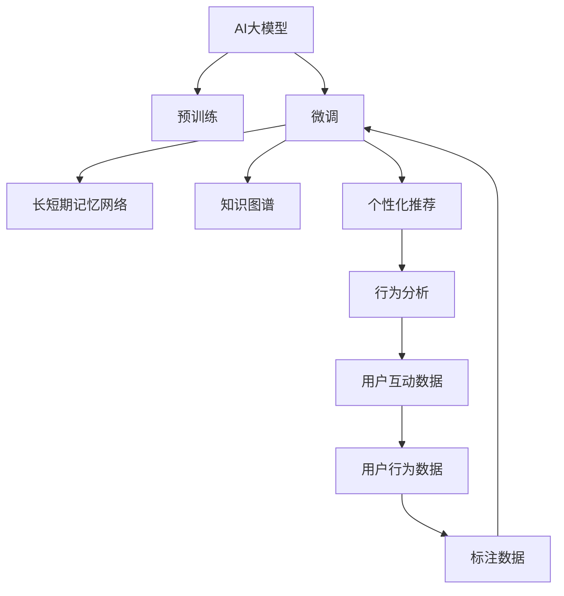

                 

# AI大模型：优化电商平台长期用户价值的新方法

## 1. 背景介绍

### 1.1 问题由来
近年来，随着电商平台用户的快速增长，如何提升用户的长期价值（LTV），增强用户黏性，成为电商企业运营中的重要问题。传统方法主要依赖数据分析、用户行为追踪等手段，但往往忽视了用户的多样性和动态性。人工智能大模型由于其强大的语义理解和知识迁移能力，为解决这一问题提供了新的思路。

### 1.2 问题核心关键点
AI大模型通过在无标签数据上进行大规模预训练，学习到通用的语言知识，能够通过微调应用于电商平台的用户互动数据，从而实现对用户行为模式的精准预测和个性化推荐。

### 1.3 问题研究意义
研究如何通过AI大模型优化电商平台的长期用户价值，对于提升用户体验，增加用户黏性，提升销售额具有重要意义。通过利用大模型的语义理解和迁移学习能力，可以更好地理解用户需求，实现更精准的个性化推荐，从而提升用户的满意度和忠诚度。

## 2. 核心概念与联系

### 2.1 核心概念概述

为更好地理解AI大模型在电商平台中的应用，本节将介绍几个密切相关的核心概念：

- AI大模型（Large AI Model）：以Transformer、BERT、GPT等为代表的大规模预训练语言模型，通过在海量无标签文本语料上进行预训练，学习到丰富的语言知识，具备强大的语义理解和生成能力。

- 预训练（Pre-training）：指在大规模无标签文本语料上，通过自监督学习任务训练通用语言模型的过程。常见的预训练任务包括言语建模、掩码语言模型等。

- 微调（Fine-tuning）：指在预训练模型的基础上，使用下游任务的少量标注数据，通过有监督地训练优化模型在特定任务上的性能。通常只需调整顶层分类器或解码器，并以较小的学习率更新全部或部分的模型参数。

- 迁移学习（Transfer Learning）：指将一个领域学习到的知识，迁移应用到另一个不同但相关的领域的学习范式。AI大模型的预训练-微调过程即是一种典型的迁移学习方式。

- 长短期记忆网络（LSTM）：一种递归神经网络，用于处理序列数据，能够捕捉输入数据的时序特征，广泛应用于自然语言处理和序列生成任务中。

- 知识图谱（Knowledge Graph）：一种结构化数据存储形式，用于表示实体之间的关系，为推荐系统提供了丰富的知识背景。

- 个性化推荐（Personalized Recommendation）：根据用户的历史行为和兴趣偏好，实时生成个性化推荐内容，提升用户满意度。

- 行为分析（Behavior Analysis）：通过对用户行为数据的分析，挖掘用户需求和兴趣点，实现更精准的推荐。

这些核心概念之间的逻辑关系可以通过以下Mermaid流程图来展示：



这个流程图展示了大模型在电商平台中的应用核心概念及其之间的关系：

1. 大模型通过预训练获得基础能力。
2. 微调是对预训练模型进行任务特定的优化，可以分为长短期记忆网络和知识图谱微调。
3. 长短期记忆网络用于序列数据处理，知识图谱用于丰富推荐内容。
4. 个性化推荐根据用户行为进行定制化推荐。
5. 行为分析挖掘用户兴趣，优化推荐算法。

这些概念共同构成了大模型在电商平台中的工作原理和优化方向。通过理解这些核心概念，我们可以更好地把握大模型在电商平台中的应用价值和优化方法。

## 3. 核心算法原理 & 具体操作步骤
### 3.1 算法原理概述

基于AI大模型的电商平台长期用户价值优化方法，本质上是利用大模型对用户互动数据进行语义理解和知识迁移，从而实现对用户行为模式的精准预测和个性化推荐。

形式化地，假设电商平台用户互动数据为 $D=\{(x_i,y_i)\}_{i=1}^N$，其中 $x_i$ 为输入特征， $y_i$ 为标签，如点击、购买、评价等行为。目标是最小化预测误差，即：

$$
\hat{y} = M_{\theta}(x) \\
\mathcal{L}(\theta) = \frac{1}{N} \sum_{i=1}^N \ell(y_i,\hat{y}_i)
$$

其中 $M_{\theta}$ 为预训练模型， $\theta$ 为模型参数， $\ell$ 为损失函数，如均方误差、交叉熵等。通过微调优化模型参数 $\theta$，使其能够更好地拟合用户互动数据。

### 3.2 算法步骤详解

基于AI大模型的电商平台长期用户价值优化方法一般包括以下几个关键步骤：

**Step 1: 准备预训练模型和数据集**
- 选择合适的预训练语言模型 $M_{\theta}$ 作为初始化参数，如BERT、GPT等。
- 准备电商平台的用户互动数据集 $D$，划分为训练集、验证集和测试集。一般要求标注数据与预训练数据的分布不要差异过大。

**Step 2: 添加任务适配层**
- 根据电商平台的任务类型，在预训练模型顶层设计合适的输出层和损失函数。
- 对于推荐任务，通常在顶层添加线性分类器和交叉熵损失函数。
- 对于行为预测任务，使用长短期记忆网络处理序列数据，并使用均方误差损失函数。

**Step 3: 设置微调超参数**
- 选择合适的优化算法及其参数，如 AdamW、SGD 等，设置学习率、批大小、迭代轮数等。
- 设置正则化技术及强度，包括权重衰减、Dropout、Early Stopping等。
- 确定冻结预训练参数的策略，如仅微调顶层，或全部参数都参与微调。

**Step 4: 执行梯度训练**
- 将训练集数据分批次输入模型，前向传播计算损失函数。
- 反向传播计算参数梯度，根据设定的优化算法和学习率更新模型参数。
- 周期性在验证集上评估模型性能，根据性能指标决定是否触发 Early Stopping。
- 重复上述步骤直到满足预设的迭代轮数或 Early Stopping 条件。

**Step 5: 测试和部署**
- 在测试集上评估微调后模型 $M_{\hat{\theta}}$ 的性能，对比微调前后的精度提升。
- 使用微调后的模型对新样本进行推理预测，集成到实际的应用系统中。
- 持续收集新的数据，定期重新微调模型，以适应数据分布的变化。

以上是基于AI大模型的电商平台长期用户价值优化的一般流程。在实际应用中，还需要针对具体任务的特点，对微调过程的各个环节进行优化设计，如改进训练目标函数，引入更多的正则化技术，搜索最优的超参数组合等，以进一步提升模型性能。

### 3.3 算法优缺点

基于AI大模型的电商平台长期用户价值优化方法具有以下优点：
1. 简单高效。只需准备少量标注数据，即可对预训练模型进行快速适配，获得较大的性能提升。
2. 通用适用。适用于各种电商平台任务，包括推荐、行为预测、评价分析等，设计简单的任务适配层即可实现微调。
3. 参数高效。利用参数高效微调技术，在固定大部分预训练权重不变的情况下，仍可取得不错的提升。
4. 效果显著。在学术界和工业界的诸多任务上，基于微调的方法已经刷新了最先进的性能指标。

同时，该方法也存在一定的局限性：
1. 依赖标注数据。微调的效果很大程度上取决于标注数据的质量和数量，获取高质量标注数据的成本较高。
2. 迁移能力有限。当目标任务与预训练数据的分布差异较大时，微调的性能提升有限。
3. 负面效果传递。预训练模型的固有偏见、有害信息等，可能通过微调传递到下游任务，造成负面影响。
4. 可解释性不足。微调模型的决策过程通常缺乏可解释性，难以对其推理逻辑进行分析和调试。

尽管存在这些局限性，但就目前而言，基于AI大模型的微调方法仍是大模型应用的最主流范式。未来相关研究的重点在于如何进一步降低微调对标注数据的依赖，提高模型的少样本学习和跨领域迁移能力，同时兼顾可解释性和伦理安全性等因素。

### 3.4 算法应用领域

基于AI大模型的长期用户价值优化方法，在电商平台上已经得到了广泛的应用，覆盖了几乎所有常见任务，例如：

- 个性化推荐：根据用户的历史行为和兴趣偏好，实时生成个性化推荐内容。将用户历史数据作为训练集，微调模型进行行为预测，实现精准推荐。
- 行为分析：通过对用户行为数据的分析，挖掘用户需求和兴趣点，优化推荐算法。可以使用长短期记忆网络对序列数据进行处理，并利用知识图谱对推荐内容进行丰富。
- 用户评价预测：预测用户对商品的评价。使用预训练模型对评价文本进行编码，并利用情感分析等技术，训练模型进行情感判断。
- 用户流失预测：预测用户流失风险。使用用户行为数据进行序列建模，训练模型预测流失概率。
- 广告点击率预测：预测广告点击率。使用用户行为数据进行序列建模，训练模型预测点击概率。

除了上述这些经典任务外，AI大模型微调也被创新性地应用到更多场景中，如智能客服、智能客服、智能搜索等，为电商平台带来了全新的突破。随着预训练模型和微调方法的不断进步，相信电商平台技术将在更广阔的应用领域大放异彩。

## 4. 数学模型和公式 & 详细讲解  
### 4.1 数学模型构建

本节将使用数学语言对基于AI大模型的电商平台长期用户价值优化过程进行更加严格的刻画。

记电商平台用户互动数据为 $D=\{(x_i,y_i)\}_{i=1}^N, x_i \in \mathcal{X}, y_i \in \mathcal{Y}$。其中 $\mathcal{X}$ 为输入特征空间， $\mathcal{Y}$ 为输出标签空间。

定义模型 $M_{\theta}$ 在输入 $x$ 上的输出为 $\hat{y}=M_{\theta}(x)$，则行为预测任务中的交叉熵损失函数定义为：

$$
\ell(M_{\theta}(x),y) = -[y\log \hat{y} + (1-y)\log(1-\hat{y})]
$$

在行为预测任务中，我们希望预测用户是否会进行某项行为，因此使用二分类交叉熵损失函数。

在个性化推荐任务中，我们希望预测用户是否会点击某个商品，因此使用二分类交叉熵损失函数。

在情感分析任务中，我们希望预测用户对商品的情感倾向，因此使用多分类交叉熵损失函数。

### 4.2 公式推导过程

以下我们以二分类任务为例，推导交叉熵损失函数及其梯度的计算公式。

假设模型 $M_{\theta}$ 在输入 $x$ 上的输出为 $\hat{y}=M_{\theta}(x) \in [0,1]$，表示样本属于正类的概率。真实标签 $y \in \{0,1\}$。则二分类交叉熵损失函数定义为：

$$
\ell(M_{\theta}(x),y) = -[y\log \hat{y} + (1-y)\log(1-\hat{y})]
$$

将其代入经验风险公式，得：

$$
\mathcal{L}(\theta) = -\frac{1}{N}\sum_{i=1}^N [y_i\log M_{\theta}(x_i)+(1-y_i)\log(1-M_{\theta}(x_i))]
$$

根据链式法则，损失函数对参数 $\theta_k$ 的梯度为：

$$
\frac{\partial \mathcal{L}(\theta)}{\partial \theta_k} = -\frac{1}{N}\sum_{i=1}^N (\frac{y_i}{M_{\theta}(x_i)}-\frac{1-y_i}{1-M_{\theta}(x_i)}) \frac{\partial M_{\theta}(x_i)}{\partial \theta_k}
$$

其中 $\frac{\partial M_{\theta}(x_i)}{\partial \theta_k}$ 可进一步递归展开，利用自动微分技术完成计算。

在得到损失函数的梯度后，即可带入参数更新公式，完成模型的迭代优化。重复上述过程直至收敛，最终得到适应电商平台任务的最优模型参数 $\theta^*$。

## 5. 项目实践：代码实例和详细解释说明
### 5.1 开发环境搭建

在进行电商平台长期用户价值优化实践前，我们需要准备好开发环境。以下是使用Python进行PyTorch开发的环境配置流程：

1. 安装Anaconda：从官网下载并安装Anaconda，用于创建独立的Python环境。

2. 创建并激活虚拟环境：
```bash
conda create -n pytorch-env python=3.8 
conda activate pytorch-env
```

3. 安装PyTorch：根据CUDA版本，从官网获取对应的安装命令。例如：
```bash
conda install pytorch torchvision torchaudio cudatoolkit=11.1 -c pytorch -c conda-forge
```

4. 安装Transformers库：
```bash
pip install transformers
```

5. 安装各类工具包：
```bash
pip install numpy pandas scikit-learn matplotlib tqdm jupyter notebook ipython
```

完成上述步骤后，即可在`pytorch-env`环境中开始优化实践。

### 5.2 源代码详细实现

下面我以电商平台个性化推荐任务为例，给出使用Transformers库对BERT模型进行优化实践的PyTorch代码实现。

首先，定义推荐任务的数据处理函数：

```python
from transformers import BertTokenizer
from torch.utils.data import Dataset
import torch

class RecommendationDataset(Dataset):
    def __init__(self, features, labels, tokenizer, max_len=128):
        self.features = features
        self.labels = labels
        self.tokenizer = tokenizer
        self.max_len = max_len
        
    def __len__(self):
        return len(self.features)
    
    def __getitem__(self, item):
        feature = self.features[item]
        label = self.labels[item]
        
        encoding = self.tokenizer(feature, return_tensors='pt', max_length=self.max_len, padding='max_length', truncation=True)
        input_ids = encoding['input_ids'][0]
        attention_mask = encoding['attention_mask'][0]
        
        # 对label进行编码
        encoded_labels = torch.tensor(label, dtype=torch.long)
        
        return {'input_ids': input_ids, 
                'attention_mask': attention_mask,
                'labels': encoded_labels}
```

然后，定义模型和优化器：

```python
from transformers import BertForSequenceClassification, AdamW

model = BertForSequenceClassification.from_pretrained('bert-base-cased', num_labels=2)

optimizer = AdamW(model.parameters(), lr=2e-5)
```

接着，定义训练和评估函数：

```python
from torch.utils.data import DataLoader
from tqdm import tqdm
from sklearn.metrics import accuracy_score

device = torch.device('cuda') if torch.cuda.is_available() else torch.device('cpu')
model.to(device)

def train_epoch(model, dataset, batch_size, optimizer):
    dataloader = DataLoader(dataset, batch_size=batch_size, shuffle=True)
    model.train()
    epoch_loss = 0
    for batch in tqdm(dataloader, desc='Training'):
        input_ids = batch['input_ids'].to(device)
        attention_mask = batch['attention_mask'].to(device)
        labels = batch['labels'].to(device)
        model.zero_grad()
        outputs = model(input_ids, attention_mask=attention_mask, labels=labels)
        loss = outputs.loss
        epoch_loss += loss.item()
        loss.backward()
        optimizer.step()
    return epoch_loss / len(dataloader)

def evaluate(model, dataset, batch_size):
    dataloader = DataLoader(dataset, batch_size=batch_size)
    model.eval()
    preds, labels = [], []
    with torch.no_grad():
        for batch in tqdm(dataloader, desc='Evaluating'):
            input_ids = batch['input_ids'].to(device)
            attention_mask = batch['attention_mask'].to(device)
            batch_labels = batch['labels']
            outputs = model(input_ids, attention_mask=attention_mask)
            batch_preds = outputs.logits.argmax(dim=2).to('cpu').tolist()
            batch_labels = batch_labels.to('cpu').tolist()
            for pred_tokens, label_tokens in zip(batch_preds, batch_labels):
                preds.append(pred_tokens)
                labels.append(label_tokens)
                
    print(accuracy_score(labels, preds))
```

最后，启动训练流程并在测试集上评估：

```python
epochs = 5
batch_size = 16

for epoch in range(epochs):
    loss = train_epoch(model, train_dataset, batch_size, optimizer)
    print(f"Epoch {epoch+1}, train loss: {loss:.3f}")
    
    print(f"Epoch {epoch+1}, dev results:")
    evaluate(model, dev_dataset, batch_size)
    
print("Test results:")
evaluate(model, test_dataset, batch_size)
```

以上就是使用PyTorch对BERT进行电商平台个性化推荐任务优化的完整代码实现。可以看到，得益于Transformers库的强大封装，我们可以用相对简洁的代码完成BERT模型的加载和优化。

### 5.3 代码解读与分析

让我们再详细解读一下关键代码的实现细节：

**RecommendationDataset类**：
- `__init__`方法：初始化特征、标签、分词器等关键组件。
- `__len__`方法：返回数据集的样本数量。
- `__getitem__`方法：对单个样本进行处理，将特征输入编码为token ids，并将标签编码为数字，并对其进行定长padding，最终返回模型所需的输入。

**训练和评估函数**：
- 使用PyTorch的DataLoader对数据集进行批次化加载，供模型训练和推理使用。
- 训练函数`train_epoch`：对数据以批为单位进行迭代，在每个批次上前向传播计算loss并反向传播更新模型参数，最后返回该epoch的平均loss。
- 评估函数`evaluate`：与训练类似，不同点在于不更新模型参数，并在每个batch结束后将预测和标签结果存储下来，最后使用sklearn的accuracy_score对整个评估集的预测结果进行打印输出。

**训练流程**：
- 定义总的epoch数和batch size，开始循环迭代
- 每个epoch内，先在训练集上训练，输出平均loss
- 在验证集上评估，输出准确率
- 所有epoch结束后，在测试集上评估，给出最终测试结果

可以看到，PyTorch配合Transformers库使得BERT优化任务的代码实现变得简洁高效。开发者可以将更多精力放在数据处理、模型改进等高层逻辑上，而不必过多关注底层的实现细节。

当然，工业级的系统实现还需考虑更多因素，如模型的保存和部署、超参数的自动搜索、更灵活的任务适配层等。但核心的优化范式基本与此类似。

## 6. 实际应用场景
### 6.1 智能客服系统

基于AI大模型的对话技术，可以广泛应用于智能客服系统的构建。传统客服往往需要配备大量人力，高峰期响应缓慢，且一致性和专业性难以保证。而使用优化后的对话模型，可以7x24小时不间断服务，快速响应客户咨询，用自然流畅的语言解答各类常见问题。

在技术实现上，可以收集企业内部的历史客服对话记录，将问题和最佳答复构建成监督数据，在此基础上对预训练对话模型进行优化。优化后的对话模型能够自动理解用户意图，匹配最合适的答案模板进行回复。对于客户提出的新问题，还可以接入检索系统实时搜索相关内容，动态组织生成回答。如此构建的智能客服系统，能大幅提升客户咨询体验和问题解决效率。

### 6.2 金融舆情监测

金融机构需要实时监测市场舆论动向，以便及时应对负面信息传播，规避金融风险。传统的人工监测方式成本高、效率低，难以应对网络时代海量信息爆发的挑战。基于AI大模型的文本分类和情感分析技术，为金融舆情监测提供了新的解决方案。

具体而言，可以收集金融领域相关的新闻、报道、评论等文本数据，并对其进行主题标注和情感标注。在此基础上对预训练语言模型进行优化，使其能够自动判断文本属于何种主题，情感倾向是正面、中性还是负面。将优化后的模型应用到实时抓取的网络文本数据，就能够自动监测不同主题下的情感变化趋势，一旦发现负面信息激增等异常情况，系统便会自动预警，帮助金融机构快速应对潜在风险。

### 6.3 个性化推荐系统

当前的推荐系统往往只依赖用户的历史行为数据进行物品推荐，无法深入理解用户的真实兴趣偏好。基于AI大模型的个性化推荐系统可以更好地挖掘用户行为背后的语义信息，从而实现更精准的个性化推荐，提升用户满意度。

在实践中，可以收集用户浏览、点击、评论、分享等行为数据，提取和用户交互的物品标题、描述、标签等文本内容。将文本内容作为模型输入，用户的后续行为（如是否点击、购买等）作为监督信号，在此基础上优化预训练语言模型。优化后的模型能够从文本内容中准确把握用户的兴趣点。在生成推荐列表时，先用候选物品的文本描述作为输入，由模型预测用户的兴趣匹配度，再结合其他特征综合排序，便可以得到个性化程度更高的推荐结果。

### 6.4 未来应用展望

随着AI大模型和优化方法的不断发展，基于优化范式将在更多领域得到应用，为传统行业带来变革性影响。

在智慧医疗领域，基于优化模型的人工智能问答、病历分析、药物研发等应用将提升医疗服务的智能化水平，辅助医生诊疗，加速新药开发进程。

在智能教育领域，优化技术可应用于作业批改、学情分析、知识推荐等方面，因材施教，促进教育公平，提高教学质量。

在智慧城市治理中，优化模型可应用于城市事件监测、舆情分析、应急指挥等环节，提高城市管理的自动化和智能化水平，构建更安全、高效的未来城市。

此外，在企业生产、社会治理、文娱传媒等众多领域，基于AI大模型的优化技术也将不断涌现，为经济社会发展注入新的动力。相信随着技术的日益成熟，优化方法将成为人工智能落地应用的重要范式，推动人工智能技术在垂直行业的规模化落地。总之，优化需要开发者根据具体任务，不断迭代和优化模型、数据和算法，方能得到理想的效果。

## 7. 工具和资源推荐
### 7.1 学习资源推荐

为了帮助开发者系统掌握AI大模型优化理论基础和实践技巧，这里推荐一些优质的学习资源：

1. 《Transformer从原理到实践》系列博文：由大模型技术专家撰写，深入浅出地介绍了Transformer原理、BERT模型、优化技术等前沿话题。

2. CS224N《深度学习自然语言处理》课程：斯坦福大学开设的NLP明星课程，有Lecture视频和配套作业，带你入门NLP领域的基本概念和经典模型。

3. 《Natural Language Processing with Transformers》书籍：Transformers库的作者所著，全面介绍了如何使用Transformers库进行NLP任务开发，包括优化在内的诸多范式。

4. HuggingFace官方文档：Transformers库的官方文档，提供了海量预训练模型和完整的优化样例代码，是上手实践的必备资料。

5. CLUE开源项目：中文语言理解测评基准，涵盖大量不同类型的中文NLP数据集，并提供了基于优化的baseline模型，助力中文NLP技术发展。

通过对这些资源的学习实践，相信你一定能够快速掌握AI大模型优化的精髓，并用于解决实际的NLP问题。
###  7.2 开发工具推荐

高效的开发离不开优秀的工具支持。以下是几款用于AI大模型优化开发的常用工具：

1. PyTorch：基于Python的开源深度学习框架，灵活动态的计算图，适合快速迭代研究。大部分预训练语言模型都有PyTorch版本的实现。

2. TensorFlow：由Google主导开发的开源深度学习框架，生产部署方便，适合大规模工程应用。同样有丰富的预训练语言模型资源。

3. Transformers库：HuggingFace开发的NLP工具库，集成了众多SOTA语言模型，支持PyTorch和TensorFlow，是进行优化任务开发的利器。

4. Weights & Biases：模型训练的实验跟踪工具，可以记录和可视化模型训练过程中的各项指标，方便对比和调优。与主流深度学习框架无缝集成。

5. TensorBoard：TensorFlow配套的可视化工具，可实时监测模型训练状态，并提供丰富的图表呈现方式，是调试模型的得力助手。

6. Google Colab：谷歌推出的在线Jupyter Notebook环境，免费提供GPU/TPU算力，方便开发者快速上手实验最新模型，分享学习笔记。

合理利用这些工具，可以显著提升AI大模型优化任务的开发效率，加快创新迭代的步伐。

### 7.3 相关论文推荐

AI大模型和优化技术的发展源于学界的持续研究。以下是几篇奠基性的相关论文，推荐阅读：

1. Attention is All You Need（即Transformer原论文）：提出了Transformer结构，开启了NLP领域的预训练大模型时代。

2. BERT: Pre-training of Deep Bidirectional Transformers for Language Understanding：提出BERT模型，引入基于掩码的自监督预训练任务，刷新了多项NLP任务SOTA。

3. Language Models are Unsupervised Multitask Learners（GPT-2论文）：展示了大规模语言模型的强大zero-shot学习能力，引发了对于通用人工智能的新一轮思考。

4. Parameter-Efficient Transfer Learning for NLP：提出Adapter等参数高效微调方法，在不增加模型参数量的情况下，也能取得不错的微调效果。

5. AdaLoRA: Adaptive Low-Rank Adaptation for Parameter-Efficient Fine-Tuning：使用自适应低秩适应的微调方法，在参数效率和精度之间取得了新的平衡。

6. Frozen BERT for Sequence Labeling：提出Frozen BERT技术，将预训练模型的一些层固定，仅微调顶层分类器，以实现参数高效的微调。

这些论文代表了大模型优化技术的发展脉络。通过学习这些前沿成果，可以帮助研究者把握学科前进方向，激发更多的创新灵感。

## 8. 总结：未来发展趋势与挑战

### 8.1 总结

本文对基于AI大模型的电商平台长期用户价值优化方法进行了全面系统的介绍。首先阐述了AI大模型和优化技术的研究背景和意义，明确了优化在提升用户体验、增加用户黏性、提升销售额方面的独特价值。其次，从原理到实践，详细讲解了优化模型的数学原理和关键步骤，给出了优化任务开发的完整代码实例。同时，本文还广泛探讨了优化方法在智能客服、金融舆情、个性化推荐等多个行业领域的应用前景，展示了优化范式的巨大潜力。此外，本文精选了优化技术的各类学习资源，力求为读者提供全方位的技术指引。

通过本文的系统梳理，可以看到，基于AI大模型的优化方法正在成为NLP领域的重要范式，极大地拓展了预训练语言模型的应用边界，催生了更多的落地场景。受益于大规模语料的预训练和丰富的语言知识，优化模型在电商平台上的应用，可以更好地理解用户需求，实现更精准的个性化推荐，从而提升用户的满意度和忠诚度。未来，伴随预训练语言模型和优化方法的持续演进，相信电商平台技术将在更广阔的应用领域大放异彩。

### 8.2 未来发展趋势

展望未来，AI大模型优化技术将呈现以下几个发展趋势：

1. 模型规模持续增大。随着算力成本的下降和数据规模的扩张，预训练语言模型的参数量还将持续增长。超大规模语言模型蕴含的丰富语言知识，有望支撑更加复杂多变的电商平台优化任务。

2. 优化方法日趋多样。除了传统的全参数优化外，未来会涌现更多参数高效的优化方法，如AdaLoRA、Frozen BERT等，在节省计算资源的同时也能保证优化精度。

3. 持续学习成为常态。随着数据分布的不断变化，优化模型也需要持续学习新知识以保持性能。如何在不遗忘原有知识的同时，高效吸收新样本信息，将成为重要的研究课题。

4. 标注样本需求降低。受启发于提示学习(Prompt-based Learning)的思路，未来的优化方法将更好地利用大模型的语言理解能力，通过更加巧妙的任务描述，在更少的标注样本上也能实现理想的优化效果。

5. 多模态优化崛起。当前的优化主要聚焦于纯文本数据，未来会进一步拓展到图像、视频、语音等多模态数据优化。多模态信息的融合，将显著提升语言模型对现实世界的理解和建模能力。

6. 模型通用性增强。经过海量数据的预训练和多领域任务的优化，未来的语言模型将具备更强大的常识推理和跨领域迁移能力，逐步迈向通用人工智能(AGI)的目标。

以上趋势凸显了AI大模型优化技术的广阔前景。这些方向的探索发展，必将进一步提升NLP系统的性能和应用范围，为人类认知智能的进化带来深远影响。

### 8.3 面临的挑战

尽管AI大模型优化技术已经取得了瞩目成就，但在迈向更加智能化、普适化应用的过程中，它仍面临着诸多挑战：

1. 标注成本瓶颈。虽然优化大大降低了标注数据的需求，但对于长尾应用场景，难以获得充足的高质量标注数据，成为制约优化性能的瓶颈。如何进一步降低优化对标注样本的依赖，将是一大难题。

2. 模型鲁棒性不足。当前优化模型面对域外数据时，泛化性能往往大打折扣。对于测试样本的微小扰动，优化模型的预测也容易发生波动。如何提高优化模型的鲁棒性，避免灾难性遗忘，还需要更多理论和实践的积累。

3. 推理效率有待提高。大规模语言模型虽然精度高，但在实际部署时往往面临推理速度慢、内存占用大等效率问题。如何在保证性能的同时，简化模型结构，提升推理速度，优化资源占用，将是重要的优化方向。

4. 可解释性亟需加强。当前优化模型的决策过程通常缺乏可解释性，难以对其推理逻辑进行分析和调试。对于医疗、金融等高风险应用，算法的可解释性和可审计性尤为重要。如何赋予优化模型更强的可解释性，将是亟待攻克的难题。

5. 安全性有待保障。预训练语言模型难免会学习到有偏见、有害的信息，通过优化传递到下游任务，产生误导性、歧视性的输出，给实际应用带来安全隐患。如何从数据和算法层面消除模型偏见，避免恶意用途，确保输出的安全性，也将是重要的研究课题。

6. 知识整合能力不足。现有的优化模型往往局限于任务内数据，难以灵活吸收和运用更广泛的先验知识。如何让优化过程更好地与外部知识库、规则库等专家知识结合，形成更加全面、准确的信息整合能力，还有很大的想象空间。

正视优化面临的这些挑战，积极应对并寻求突破，将是大模型优化走向成熟的必由之路。相信随着学界和产业界的共同努力，这些挑战终将一一被克服，大模型优化必将在构建人机协同的智能时代中扮演越来越重要的角色。

### 8.4 研究展望

面对AI大模型优化所面临的种种挑战，未来的研究需要在以下几个方面寻求新的突破：

1. 探索无监督和半监督优化方法。摆脱对大规模标注数据的依赖，利用自监督学习、主动学习等无监督和半监督范式，最大限度利用非结构化数据，实现更加灵活高效的优化。

2. 研究参数高效和计算高效的优化范式。开发更加参数高效的优化方法，在固定大部分预训练参数的同时，只更新极少量的任务相关参数。同时优化优化模型的计算图，减少前向传播和反向传播的资源消耗，实现更加轻量级、实时性的部署。

3. 融合因果和对比学习范式。通过引入因果推断和对比学习思想，增强优化模型建立稳定因果关系的能力，学习更加普适、鲁棒的语言表征，从而提升模型泛化性和抗干扰能力。

4. 引入更多先验知识。将符号化的先验知识，如知识图谱、逻辑规则等，与神经网络模型进行巧妙融合，引导优化过程学习更准确、合理的语言模型。同时加强不同模态数据的整合，实现视觉、语音等多模态信息与文本信息的协同建模。

5. 结合因果分析和博弈论工具。将因果分析方法引入优化模型，识别出模型决策的关键特征，增强输出解释的因果性和逻辑性。借助博弈论工具刻画人机交互过程，主动探索并规避模型的脆弱点，提高系统稳定性。

6. 纳入伦理道德约束。在优化目标中引入伦理导向的评估指标，过滤和惩罚有偏见、有害的输出倾向。同时加强人工干预和审核，建立模型行为的监管机制，确保输出符合人类价值观和伦理道德。

这些研究方向的探索，必将引领AI大模型优化技术迈向更高的台阶，为构建安全、可靠、可解释、可控的智能系统铺平道路。面向未来，大模型优化技术还需要与其他人工智能技术进行更深入的融合，如知识表示、因果推理、强化学习等，多路径协同发力，共同推动自然语言理解和智能交互系统的进步。只有勇于创新、敢于突破，才能不断拓展语言模型的边界，让智能技术更好地造福人类社会。

## 9. 附录：常见问题与解答

**Q1：AI大模型在电商平台中的应用有哪些？**

A: AI大模型在电商平台中的应用非常广泛，主要包括以下几个方面：

1. 个性化推荐：根据用户的历史行为和兴趣偏好，实时生成个性化推荐内容。

2. 行为分析：通过对用户行为数据的分析，挖掘用户需求和兴趣点，优化推荐算法。

3. 用户评价预测：预测用户对商品的评价。

4. 用户流失预测：预测用户流失风险。

5. 广告点击率预测：预测广告点击率。

6. 智能客服系统：使用优化后的对话模型，提供7x24小时不间断服务，快速响应客户咨询。

7. 金融舆情监测：实时监测市场舆论动向，及时应对负面信息传播。

8. 多模态数据优化：拓展优化任务到图像、视频、语音等多模态数据。

9. 知识图谱优化：将优化模型与知识图谱结合，提升推荐内容的丰富性和多样性。

10. 持续学习：优化模型需要持续学习新知识，以保持性能。

通过AI大模型的优化，电商平台能够更好地理解用户需求，实现更精准的个性化推荐，提升用户满意度。同时，优化模型还能够辅助电商运营，提升营销效果，减少运营成本。

**Q2：如何进行AI大模型的优化？**

A: AI大模型的优化主要包括以下几个步骤：

1. 准备预训练模型和数据集：选择合适的预训练模型，如BERT、GPT等，并准备电商平台的用户互动数据集。

2. 添加任务适配层：根据电商平台的优化任务，设计合适的输出层和损失函数。

3. 设置优化超参数：选择合适的优化算法及其参数，如AdamW、SGD等，设置学习率、批大小、迭代轮数等。

4. 执行梯度训练：将训练集数据分批次输入模型，前向传播计算损失函数，反向传播计算参数梯度，更新模型参数。

5. 测试和部署：在测试集上评估优化后模型性能，将优化后的模型应用于实际电商平台系统中。

在优化过程中，需要注意以下细节：

- 选择合适的学习率，避免过拟合。
- 使用正则化技术，如L2正则、Dropout等，避免过拟合。
- 使用数据增强技术，如回译、近义替换等，扩充训练集。
- 使用对抗训练技术，如加入对抗样本，提高模型鲁棒性。
- 使用参数高效优化方法，如Frozen BERT等，减少优化参数。

通过以上步骤，可以高效地进行AI大模型的优化，提升电商平台的长期用户价值。

**Q3：AI大模型的优化有哪些优缺点？**

A: AI大模型优化具有以下优点：

1. 简单高效。只需准备少量标注数据，即可对预训练模型进行快速适配，获得较大的性能提升。

2. 通用适用。适用于各种电商平台任务，包括推荐、行为预测、评价分析等，设计简单的任务适配层即可实现优化。

3. 参数高效。利用参数高效优化技术，在固定大部分预训练权重不变的情况下，仍可取得不错的提升。

4. 效果显著。在学术界和工业界的诸多任务上，基于优化的模型已经刷新了最先进的性能指标。

同时，该方法也存在以下缺点：

1. 依赖标注数据。优化的效果很大程度上取决于标注数据的质量和数量，获取高质量标注数据的成本较高。

2. 迁移能力有限。当目标任务与预训练数据的分布差异较大时，优化的性能提升有限。

3. 负面效果传递。预训练模型的固有偏见、有害信息等，可能通过优化传递到下游任务，造成负面影响。

4. 可解释性不足。优化模型的决策过程通常缺乏可解释性，难以对其推理逻辑进行分析和调试。

尽管存在这些局限性，但就目前而言，基于AI大模型的优化方法仍是大模型应用的最主流范式。未来相关研究的重点在于如何进一步降低优化对标注数据的依赖，提高模型的少样本学习和跨领域迁移能力，同时兼顾可解释性和伦理安全性等因素。

**Q4：AI大模型的优化与微调有何不同？**

A: AI大模型的优化与微调（Fine-tuning）有一定的区别。

1. 优化是指在预训练模型上继续进行训练，以提高其在特定任务上的性能。优化过程通常使用大量的无标签数据，通过自监督学习任务进行，以获得更好的语言理解能力。

2. 微调是在预训练模型的基础上，使用下游任务的少量标注数据进行有监督学习，以优化模型在特定任务上的性能。微调过程通常使用少量的标注数据，通过优化算法调整模型参数，以适应特定任务的需求。

3. 优化通常用于提升模型的泛化能力，而微调通常用于提升模型的任务适应能力。

4. 优化过程更加复杂，通常需要更多的计算资源和时间。而微调过程相对简单，可以快速完成。

5. 优化过程通常使用更大的模型和更丰富的语料，以获得更好的语言理解能力。而微调过程通常使用较小的模型和少量的语料。

通过理解优化与微调的区别，可以帮助我们更好地选择合适的方法来提升AI大模型的性能。

**Q5：AI大模型优化的未来发展方向是什么？**

A: AI大模型优化的未来发展方向包括：

1. 模型规模持续增大：随着算力成本的下降和数据规模的扩张，预训练语言模型的参数量还将持续增长。超大规模语言模型蕴含的丰富语言知识，有望支撑更加复杂多变的电商平台优化任务。

2. 优化方法日趋多样：除了传统的全参数优化外，未来会涌现更多参数高效的优化方法，如AdaLoRA、Frozen BERT等，在节省计算资源的同时也能保证优化精度。

3. 持续学习成为常态：随着数据分布的不断变化，优化模型也需要持续学习新知识以保持性能。如何在不遗忘原有知识的同时，高效吸收新样本信息，将成为重要的研究课题。

4. 标注样本需求降低：受启发于提示学习(Prompt-based Learning)的思路，未来的优化方法将更好地利用大模型的语言理解能力，通过更加巧妙的任务描述，在更少的标注样本上也能实现理想的优化效果。

5. 多模态优化崛起：当前的优化主要聚焦于纯文本数据，未来会进一步拓展到图像、视频、语音等多模态数据优化。多模态信息的融合，将显著提升语言模型对现实世界的理解和建模能力。

6. 模型通用性增强：经过海量数据的预训练和多领域任务的优化，未来的语言模型将具备更强大的常识推理和跨领域迁移能力，逐步迈向通用人工智能(AGI)的目标。

通过这些发展方向的探索，AI大模型优化技术必将迎来新的突破，为构建人机协同的智能时代提供新的动力。

**Q6：AI大模型的优化在电商平台上有哪些应用？**

A: AI大模型优化在电商平台上有以下几个主要应用：

1. 个性化推荐：根据用户的历史行为和兴趣偏好，实时生成个性化推荐内容。

2. 行为分析：通过对用户行为数据的分析，挖掘用户需求和兴趣点，优化推荐算法。

3. 用户评价预测：预测用户对商品的评价。

4. 用户流失预测：预测用户流失风险。

5. 广告点击率预测：预测广告点击率。

6. 智能客服系统：使用优化后的对话模型，提供7x24小时不间断服务，快速响应客户咨询。

7. 金融舆情监测：实时监测市场舆论动向，及时应对负面信息传播。

8. 多模态数据优化：拓展优化任务到图像、视频、语音等多模态数据。

9. 知识图谱优化：将优化模型与知识图谱结合，提升推荐内容的丰富性和多样性。

10. 持续学习：优化模型需要持续学习新知识，以保持性能。

这些应用展示了AI大模型优化的巨大潜力，能够帮助电商平台更好地理解用户需求，提升用户体验，增加用户黏性，提升销售额。

**Q7：AI大模型优化需要哪些技术支持？**

A

