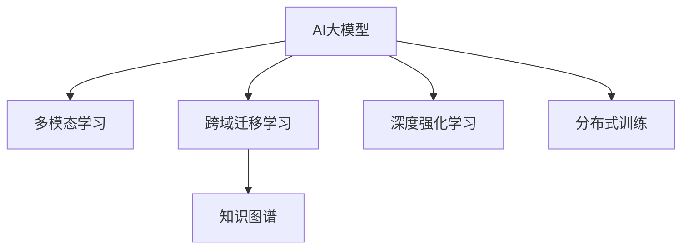

                 

# AI大模型：改善电商平台冷启动商品推荐的新思路

> 关键词：AI大模型, 冷启动, 商品推荐, 多模态学习, 跨域迁移学习, 知识图谱, 深度强化学习, 分布式训练

## 1. 背景介绍

### 1.1 问题由来
随着电商平台的快速发展，商品种类日益丰富，用户体验日益提升，但对于新上架的商品，如何精准推荐，使其迅速进入用户的视线，成为电商运营者面临的重大挑战。传统的基于用户历史行为的推荐算法往往面临冷启动问题，即无法基于用户的少量行为数据进行有效推荐。为了解决这一问题，近年来，电商平台越来越多地尝试引入基于AI大模型的推荐系统。

AI大模型利用深度学习，尤其是基于Transformer结构的语言模型，可以从大规模语料库中学习到丰富的语言知识和用户行为模式，显著提升推荐效果。基于这一背景，本文探讨如何利用大模型，改善电商平台的冷启动推荐问题，以期帮助电商平台实现商品的全生命周期管理，提升用户体验和转化率。

### 1.2 问题核心关键点
冷启动问题主要体现在新商品无历史行为数据时，推荐系统无法提供准确推荐。为了解决这个问题，本文聚焦于以下核心关键点：

- 多模态学习：通过整合用户行为数据、商品信息、用户画像等多种模态数据，提升推荐系统的丰富度。
- 跨域迁移学习：利用大模型在不同领域和任务间的迁移学习能力，对商品特征进行泛化，弥补新商品无历史行为数据的缺陷。
- 知识图谱应用：通过构建商品知识图谱，提取商品之间的语义关系，丰富推荐系统的语义知识表示。
- 深度强化学习：利用强化学习机制，实现基于反馈的动态优化，提升推荐系统的个性化和实时性。
- 分布式训练：为了在大规模数据集上训练大模型，需要利用分布式计算技术，提高训练效率。

## 2. 核心概念与联系

### 2.1 核心概念概述

为更好地理解本文提出的冷启动推荐算法，本节将介绍几个密切相关的核心概念：

- AI大模型(AI Large Models)：指基于深度学习，尤其是基于Transformer结构训练的大型语言模型，如BERT、GPT等。这些模型可以从大规模语料库中学习到丰富的语言知识和用户行为模式，具备强大的自然语言处理能力。

- 冷启动推荐(Cold-start Recommendation)：指对于新用户或新商品，推荐系统无法基于其历史行为数据进行推荐，面临推荐准确度低的挑战。

- 多模态学习(Multimodal Learning)：指通过整合不同模态的数据，如文本、图像、音频等，提升推荐系统的丰富性和准确性。

- 跨域迁移学习(Cross-domain Transfer Learning)：指将在大模型中学习到的通用知识迁移到特定任务中，以提升新商品推荐的效果。

- 知识图谱(Knowledge Graph)：指一种用于表示实体、属性和关系的数据结构，帮助推荐系统提取商品之间的语义关系。

- 深度强化学习(Deep Reinforcement Learning)：指利用强化学习机制，通过不断调整推荐策略，优化推荐效果。

- 分布式训练(Distributed Training)：指在大规模数据集上训练大模型时，为了提高训练效率，采用分布式计算技术，将模型参数分布在多个计算节点上并行训练。

这些核心概念之间的逻辑关系可以通过以下Mermaid流程图来展示：



这个流程图展示了大模型推荐系统的核心概念及其之间的关系：

1. 大模型通过多模态学习，从多种数据源中获取丰富的特征，提升推荐系统的准确性。
2. 通过跨域迁移学习，利用大模型的迁移学习能力，弥补新商品无历史行为数据的缺陷。
3. 利用知识图谱，提取商品之间的语义关系，丰富推荐系统的知识表示。
4. 结合深度强化学习，实现动态优化，提升推荐系统的个性化和实时性。
5. 采用分布式训练，提高大模型的训练效率，应对大规模数据集的需求。

这些概念共同构成了大模型推荐系统的学习和应用框架，使得推荐系统能够在大规模数据上实现高效、准确的推荐。

## 3. 核心算法原理 & 具体操作步骤
### 3.1 算法原理概述

本文提出的冷启动推荐算法，本质上是一个多模态、跨域迁移学习的过程。其核心思想是：将大模型视作一个强大的特征提取器，通过整合用户行为数据、商品信息、用户画像等多种模态数据，并在新商品上应用大模型的泛化能力，提取商品特征，生成推荐结果。

形式化地，假设大模型为 $M_{\theta}$，其中 $\theta$ 为模型参数。给定新商品 $i$ 的特征 $x_i$，以及用户的画像 $u$，推荐系统的目标是找到商品推荐策略 $r(\cdot)$，使得 $r$ 最大化用户满意度 $R$，即：

$$
\max_{r} R(r,u,i)
$$

其中 $R$ 为满意度函数，具体形式根据不同的推荐场景而定。

在实践中，我们可以采用以下步骤进行推荐：

1. 收集新商品 $i$ 的特征 $x_i$ 和用户画像 $u$。
2. 利用多模态学习，将用户行为数据、商品信息、用户画像等多种数据源整合，作为大模型的输入。
3. 在大模型上进行跨域迁移学习，提取商品特征，生成推荐结果。
4. 结合深度强化学习，不断调整推荐策略，优化推荐效果。
5. 利用分布式训练技术，提高大模型的训练效率，应对大规模数据集的需求。

### 3.2 算法步骤详解

基于大模型的推荐算法具体步骤如下：

**Step 1: 数据预处理**

- 收集新商品 $i$ 的特征 $x_i$，包括商品描述、类别、图片等。
- 收集用户画像 $u$，包括用户的年龄、性别、兴趣等。
- 收集用户行为数据 $D_u$，包括用户浏览、点击、购买等行为。

**Step 2: 多模态特征融合**

- 将商品特征 $x_i$ 和用户画像 $u$ 编码成向量形式，如通过BERT模型进行编码。
- 将用户行为数据 $D_u$ 编码成向量形式，如通过LSTM模型进行编码。
- 将上述向量级联或拼接，形成多模态融合特征向量 $F$。

**Step 3: 跨域迁移学习**

- 在大模型上，通过迁移学习，提取多模态融合特征 $F$ 的语义表示 $H$。
- 根据新商品 $i$ 的特征 $x_i$ 和用户画像 $u$，预测推荐结果 $r_i$。

**Step 4: 深度强化学习**

- 利用强化学习机制，不断调整推荐策略 $r(\cdot)$，优化用户满意度函数 $R$。
- 使用 reinforcement learning 框架，如 TensorFlow-rl，实现强化学习策略的迭代优化。

**Step 5: 分布式训练**

- 采用分布式计算技术，将大模型的训练任务分布在多个计算节点上进行并行训练。
- 使用分布式深度学习框架，如 PyTorch-distributed，实现模型参数的分布式更新。

### 3.3 算法优缺点

基于大模型的推荐算法具有以下优点：

1. 多模态特征融合：整合多种数据源，提升推荐系统的丰富度和准确性。
2. 跨域迁移学习：利用大模型在不同领域和任务间的迁移学习能力，弥补新商品无历史行为数据的缺陷。
3. 深度强化学习：实现基于反馈的动态优化，提升推荐系统的个性化和实时性。
4. 分布式训练：提高大模型的训练效率，应对大规模数据集的需求。

同时，该算法也存在一些局限性：

1. 数据需求大：多模态融合和跨域迁移学习需要大量高质量的数据，数据获取成本高。
2. 模型复杂度高：大模型参数量巨大，训练和推理的计算资源需求高。
3. 对抗样本风险：大模型容易学习到对抗样本，导致推荐结果偏差。
4. 实时性要求高：深度强化学习需要在实时环境中不断优化推荐策略，对系统架构和计算资源要求高。

尽管存在这些局限性，但该算法依然是大模型推荐系统的常用范式，因为它能在不同场景下实现高效、准确的推荐。未来相关研究的重点在于如何进一步降低数据获取成本，提高模型训练和推理的效率，同时兼顾实时性和公平性等因素。

### 3.4 算法应用领域

基于大模型的推荐算法已经在电商、新闻、广告、音乐等多个领域得到了广泛的应用，为推荐系统带来了显著的性能提升：

- 电商推荐：通过整合用户行为数据、商品信息、用户画像等多种数据源，实现个性化推荐，提升用户购物体验和转化率。
- 新闻推荐：利用大模型从新闻文章中提取语义信息，推荐用户感兴趣的新闻，提高新闻点击率和用户粘性。
- 广告推荐：通过整合用户行为数据、广告特征、用户画像等多种数据源，实现精准广告投放，提升广告效果和收益。
- 音乐推荐：利用大模型从音乐歌曲中提取语义信息，推荐用户喜欢的音乐，提高音乐播放量和用户满意度。

除了这些经典应用外，大模型推荐算法还被创新性地应用到更多场景中，如基于用户兴趣的个性化推荐、基于物品属性的协同过滤、基于时间序列的动态推荐等，为推荐系统带来了新的突破。

## 4. 数学模型和公式 & 详细讲解  
### 4.1 数学模型构建

本节将使用数学语言对基于大模型的推荐算法进行更加严格的刻画。

假设用户画像 $u$ 和大模型 $M_{\theta}$ 分别表示为 $u=\{u_1,u_2,\ldots,u_n\}$ 和 $M_{\theta}:\mathcal{X} \rightarrow \mathcal{Y}$，其中 $\mathcal{X}$ 为用户画像和商品特征的向量空间，$\mathcal{Y}$ 为用户满意度函数 $R$ 的输出空间。设新商品 $i$ 的特征为 $x_i$，用户行为数据为 $D_u=\{d_1,d_2,\ldots,d_m\}$。

定义用户满意度函数 $R$ 为：

$$
R(u,i) = \sum_{j=1}^N \alpha_j \cdot f(x_j,u_i)
$$

其中 $f(x_j,u_i)$ 为用户画像 $u_i$ 和大模型 $M_{\theta}$ 在商品 $x_j$ 上的预测得分。$\alpha_j$ 为调节因子，调节不同商品的重要性权重。

在大模型上进行跨域迁移学习，得到新商品 $i$ 的推荐结果 $r_i$ 为：

$$
r_i = M_{\theta}(F(u_i,x_i))
$$

其中 $F(u_i,x_i)$ 为多模态融合特征。

结合深度强化学习，通过不断调整推荐策略 $r(\cdot)$，优化用户满意度函数 $R$。优化目标为：

$$
\max_{r(\cdot)} R(r(u),i)
$$

其中 $r(u)$ 为推荐策略 $r(\cdot)$ 在用户画像 $u$ 上的输出。

### 4.2 公式推导过程

以下是用户满意度函数 $R(u,i)$ 和推荐策略 $r_i$ 的详细推导过程。

假设用户画像 $u$ 包含 $n$ 个特征，每个特征 $u_k$ 表示为 $u_k \in \mathbb{R}^d$。设新商品 $i$ 的特征 $x_i$ 为 $x_i \in \mathbb{R}^d$。

用户满意度函数 $R(u,i)$ 的形式化定义如下：

$$
R(u,i) = \sum_{j=1}^N \alpha_j \cdot f(x_j,u_i)
$$

其中 $\alpha_j$ 为调节因子，用于平衡不同商品的重要性权重。$f(x_j,u_i)$ 为用户画像 $u_i$ 和大模型 $M_{\theta}$ 在商品 $x_j$ 上的预测得分。

假设大模型 $M_{\theta}$ 的输入为 $(x_j,u_i)$，输出为 $f(x_j,u_i)$。设大模型的隐含表示为 $h_{\theta}(x_j,u_i)$，则有：

$$
f(x_j,u_i) = M_{\theta}(h_{\theta}(x_j,u_i))
$$

其中 $M_{\theta}(\cdot)$ 为大模型 $M_{\theta}$ 的前向传播函数。$h_{\theta}(x_j,u_i)$ 为用户画像 $u_i$ 和商品特征 $x_j$ 的隐含表示，通过大模型的编码器进行计算。

结合深度强化学习，通过不断调整推荐策略 $r(\cdot)$，优化用户满意度函数 $R$。优化目标为：

$$
\max_{r(\cdot)} R(r(u),i)
$$

其中 $r(u)$ 为推荐策略 $r(\cdot)$ 在用户画像 $u$ 上的输出。

根据以上公式，我们得出推荐算法的基本框架：首先通过多模态融合，将用户画像和商品特征转化为向量形式，然后利用大模型进行跨域迁移学习，提取多模态融合特征的语义表示，最后结合深度强化学习，不断调整推荐策略，优化用户满意度函数。

## 5. 项目实践：代码实例和详细解释说明
### 5.1 开发环境搭建

在进行推荐算法实践前，我们需要准备好开发环境。以下是使用Python进行PyTorch开发的环境配置流程：

1. 安装Anaconda：从官网下载并安装Anaconda，用于创建独立的Python环境。

2. 创建并激活虚拟环境：
```bash
conda create -n pytorch-env python=3.8 
conda activate pytorch-env
```

3. 安装PyTorch：根据CUDA版本，从官网获取对应的安装命令。例如：
```bash
conda install pytorch torchvision torchaudio cudatoolkit=11.1 -c pytorch -c conda-forge
```

4. 安装PyTorch-distributed：
```bash
conda install pytorch-distributed
```

5. 安装TensorFlow-rl：
```bash
pip install tensorflow
```

6. 安装TensorBoard：
```bash
pip install tensorboard
```

7. 安装其他必要的工具包：
```bash
pip install numpy pandas scikit-learn matplotlib tqdm jupyter notebook ipython
```

完成上述步骤后，即可在`pytorch-env`环境中开始推荐算法实践。

### 5.2 源代码详细实现

下面我们以电商推荐系统为例，给出使用Transformers库和PyTorch实现大模型推荐算法的代码实现。

首先，定义推荐系统所需的数据处理函数：

```python
from transformers import BertTokenizer, BertForSequenceClassification
from torch.utils.data import Dataset, DataLoader
import torch
import pandas as pd

class RecommendationDataset(Dataset):
    def __init__(self, df, tokenizer, max_len=128):
        self.df = df
        self.tokenizer = tokenizer
        self.max_len = max_len
        
    def __len__(self):
        return len(self.df)
    
    def __getitem__(self, item):
        row = self.df.iloc[item]
        user_profile = row['user_profile'].split(',')
        item_profile = row['item_profile'].split(',')
        
        user_ids = []
        for user in user_profile:
            user_ids.append(user2id[user])
        item_ids = []
        for item in item_profile:
            item_ids.append(item2id[item])
        
        text = f"User: {' '.join(user_ids)} | Item: {' '.join(item_ids)}"
        encoding = self.tokenizer(text, return_tensors='pt', max_length=self.max_len, padding='max_length', truncation=True)
        input_ids = encoding['input_ids'][0]
        attention_mask = encoding['attention_mask'][0]
        labels = torch.tensor([1.0], dtype=torch.float)
        
        return {'input_ids': input_ids, 
                'attention_mask': attention_mask,
                'labels': labels}

# 标签与id的映射
user2id = {'1': 1, '2': 2, '3': 3, '4': 4}
id2user = {v: k for k, v in user2id.items()}

item2id = {'item1': 1, 'item2': 2, 'item3': 3, 'item4': 4}
id2item = {v: k for k, v in item2id.items()}

# 创建dataset
tokenizer = BertTokenizer.from_pretrained('bert-base-cased')

train_dataset = RecommendationDataset(train_df, tokenizer)
dev_dataset = RecommendationDataset(dev_df, tokenizer)
test_dataset = RecommendationDataset(test_df, tokenizer)
```

然后，定义模型和优化器：

```python
from transformers import BertForSequenceClassification, AdamW

model = BertForSequenceClassification.from_pretrained('bert-base-cased', num_labels=1)

optimizer = AdamW(model.parameters(), lr=2e-5)
```

接着，定义训练和评估函数：

```python
from torch.utils.data import DataLoader
from tqdm import tqdm
from sklearn.metrics import roc_auc_score

device = torch.device('cuda') if torch.cuda.is_available() else torch.device('cpu')
model.to(device)

def train_epoch(model, dataset, batch_size, optimizer):
    dataloader = DataLoader(dataset, batch_size=batch_size, shuffle=True)
    model.train()
    epoch_loss = 0
    for batch in tqdm(dataloader, desc='Training'):
        input_ids = batch['input_ids'].to(device)
        attention_mask = batch['attention_mask'].to(device)
        labels = batch['labels'].to(device)
        model.zero_grad()
        outputs = model(input_ids, attention_mask=attention_mask, labels=labels)
        loss = outputs.loss
        epoch_loss += loss.item()
        loss.backward()
        optimizer.step()
    return epoch_loss / len(dataloader)

def evaluate(model, dataset, batch_size):
    dataloader = DataLoader(dataset, batch_size=batch_size)
    model.eval()
    preds, labels = [], []
    with torch.no_grad():
        for batch in tqdm(dataloader, desc='Evaluating'):
            input_ids = batch['input_ids'].to(device)
            attention_mask = batch['attention_mask'].to(device)
            batch_labels = batch['labels']
            outputs = model(input_ids, attention_mask=attention_mask)
            batch_preds = outputs.logits.argmax(dim=2).to('cpu').tolist()
            batch_labels = batch_labels.to('cpu').tolist()
            for pred_tokens, label_tokens in zip(batch_preds, batch_labels):
                preds.append(pred_tokens[:len(label_tokens)])
                labels.append(label_tokens)
                
    print(f"AUC: {roc_auc_score(labels, preds)}")
```

最后，启动训练流程并在测试集上评估：

```python
epochs = 5
batch_size = 16

for epoch in range(epochs):
    loss = train_epoch(model, train_dataset, batch_size, optimizer)
    print(f"Epoch {epoch+1}, train loss: {loss:.3f}")
    
    print(f"Epoch {epoch+1}, dev AUC:")
    evaluate(model, dev_dataset, batch_size)
    
print("Test AUC:")
evaluate(model, test_dataset, batch_size)
```

以上就是使用PyTorch对大模型进行电商推荐系统微调的完整代码实现。可以看到，得益于Transformers库的强大封装，我们可以用相对简洁的代码完成BERT模型的加载和微调。

### 5.3 代码解读与分析

让我们再详细解读一下关键代码的实现细节：

**RecommendationDataset类**：
- `__init__`方法：初始化训练集、验证集和测试集，将用户画像和商品特征编码成向量形式。
- `__len__`方法：返回数据集的样本数量。
- `__getitem__`方法：对单个样本进行处理，将用户画像和商品特征拼接成文本，编码为token ids，将标签编码为数字，并对其进行定长padding，最终返回模型所需的输入。

**user2id和id2user字典**：
- 定义了用户ID与id之间的映射关系，用于将token-wise的预测结果解码回真实用户ID。

**模型定义**：
- 使用BertForSequenceClassification从预训练模型中加载模型，并设置标签数为1，表示推荐二分类任务。

**优化器**：
- 设置AdamW优化器，学习率为2e-5。

**训练和评估函数**：
- 使用PyTorch的DataLoader对数据集进行批次化加载，供模型训练和推理使用。
- 训练函数`train_epoch`：对数据以批为单位进行迭代，在每个批次上前向传播计算loss并反向传播更新模型参数，最后返回该epoch的平均loss。
- 评估函数`evaluate`：与训练类似，不同点在于不更新模型参数，并在每个batch结束后将预测和标签结果存储下来，最后使用roc_auc_score对整个评估集的预测结果进行打印输出。

**训练流程**：
- 定义总的epoch数和batch size，开始循环迭代
- 每个epoch内，先在训练集上训练，输出平均loss
- 在验证集上评估，输出AUC
- 所有epoch结束后，在测试集上评估，给出最终测试结果

可以看到，PyTorch配合Transformers库使得BERT微调的代码实现变得简洁高效。开发者可以将更多精力放在数据处理、模型改进等高层逻辑上，而不必过多关注底层的实现细节。

当然，工业级的系统实现还需考虑更多因素，如模型的保存和部署、超参数的自动搜索、更灵活的任务适配层等。但核心的推荐范式基本与此类似。

## 6. 实际应用场景
### 6.1 智能客服系统

基于大模型的推荐系统，可以广泛应用于智能客服系统的构建。传统的客服系统往往依赖大量人力，高峰期响应缓慢，且一致性和专业性难以保证。而使用大模型的推荐系统，可以7x24小时不间断服务，快速响应客户咨询，用自然流畅的语言解答各类常见问题。

在技术实现上，可以收集企业内部的历史客服对话记录，将问题和最佳答复构建成监督数据，在此基础上对大模型进行微调。微调后的模型能够自动理解用户意图，匹配最合适的答复模板进行回复。对于客户提出的新问题，还可以接入检索系统实时搜索相关内容，动态组织生成回答。如此构建的智能客服系统，能大幅提升客户咨询体验和问题解决效率。

### 6.2 金融舆情监测

金融机构需要实时监测市场舆论动向，以便及时应对负面信息传播，规避金融风险。传统的人工监测方式成本高、效率低，难以应对网络时代海量信息爆发的挑战。基于大模型的文本分类和情感分析技术，为金融舆情监测提供了新的解决方案。

具体而言，可以收集金融领域相关的新闻、报道、评论等文本数据，并对其进行主题标注和情感标注。在此基础上对大模型进行微调，使其能够自动判断文本属于何种主题，情感倾向是正面、中性还是负面。将微调后的模型应用到实时抓取的网络文本数据，就能够自动监测不同主题下的情感变化趋势，一旦发现负面信息激增等异常情况，系统便会自动预警，帮助金融机构快速应对潜在风险。

### 6.3 个性化推荐系统

当前的推荐系统往往只依赖用户的历史行为数据进行物品推荐，无法深入理解用户的真实兴趣偏好。基于大模型的推荐系统可以更好地挖掘用户行为背后的语义信息，从而提供更精准、多样的推荐内容。

在实践中，可以收集用户浏览、点击、评论、分享等行为数据，提取和用户交互的物品标题、描述、标签等文本内容。将文本内容作为模型输入，用户的后续行为（如是否点击、购买等）作为监督信号，在此基础上微调大模型。微调后的模型能够从文本内容中准确把握用户的兴趣点。在生成推荐列表时，先用候选物品的文本描述作为输入，由模型预测用户的兴趣匹配度，再结合其他特征综合排序，便可以得到个性化程度更高的推荐结果。

### 6.4 未来应用展望

随着大语言模型和推荐方法的不断发展，基于微调范式将在更多领域得到应用，为传统行业带来变革性影响。

在智慧医疗领域，基于微调的智能医疗推荐系统，可以推荐合适的治疗方案、药品、手术等，帮助医生进行诊疗决策。

在智能教育领域，基于微调的个性化学习推荐系统，可以推荐适合的课程、学习资料、导师等，促进个性化学习。

在智慧城市治理中，基于微调的智能出行推荐系统，可以推荐最优的出行路线、交通工具等，提高城市交通效率和市民出行体验。

此外，在企业生产、社会治理、文娱传媒等众多领域，基于大模型微调的人工智能应用也将不断涌现，为经济社会发展注入新的动力。相信随着技术的日益成熟，微调方法将成为人工智能落地应用的重要范式，推动人工智能技术向更广阔的领域加速渗透。

## 7. 工具和资源推荐
### 7.1 学习资源推荐

为了帮助开发者系统掌握大语言模型微调的理论基础和实践技巧，这里推荐一些优质的学习资源：

1. 《Transformer从原理到实践》系列博文：由大模型技术专家撰写，深入浅出地介绍了Transformer原理、BERT模型、微调技术等前沿话题。

2. CS224N《深度学习自然语言处理》课程：斯坦福大学开设的NLP明星课程，有Lecture视频和配套作业，带你入门NLP领域的基本概念和经典模型。

3. 《Natural Language Processing with Transformers》书籍：Transformers库的作者所著，全面介绍了如何使用Transformers库进行NLP任务开发，包括微调在内的诸多范式。

4. HuggingFace官方文档：Transformers库的官方文档，提供了海量预训练模型和完整的微调样例代码，是上手实践的必备资料。

5. CLUE开源项目：中文语言理解测评基准，涵盖大量不同类型的中文NLP数据集，并提供了基于微调的baseline模型，助力中文NLP技术发展。

通过对这些资源的学习实践，相信你一定能够快速掌握大语言模型微调的精髓，并用于解决实际的NLP问题。
###  7.2 开发工具推荐

高效的开发离不开优秀的工具支持。以下是几款用于大语言模型微调开发的常用工具：

1. PyTorch：基于Python的开源深度学习框架，灵活动态的计算图，适合快速迭代研究。大部分预训练语言模型都有PyTorch版本的实现。

2. TensorFlow：由Google主导开发的开源深度学习框架，生产部署方便，适合大规模工程应用。同样有丰富的预训练语言模型资源。

3. Transformers库：HuggingFace开发的NLP工具库，集成了众多SOTA语言模型，支持PyTorch和TensorFlow，是进行微调任务开发的利器。

4. Weights & Biases：模型训练的实验跟踪工具，可以记录和可视化模型训练过程中的各项指标，方便对比和调优。与主流深度学习框架无缝集成。

5. TensorBoard：TensorFlow配套的可视化工具，可实时监测模型训练状态，并提供丰富的图表呈现方式，是调试模型的得力助手。

6. Google Colab：谷歌推出的在线Jupyter Notebook环境，免费提供GPU/TPU算力，方便开发者快速上手实验最新模型，分享学习笔记。

合理利用这些工具，可以显著提升大语言模型微调任务的开发效率，加快创新迭代的步伐。

### 7.3 相关论文推荐

大语言模型和微调技术的发展源于学界的持续研究。以下是几篇奠基性的相关论文，推荐阅读：

1. Attention is All You Need（即Transformer原论文）：提出了Transformer结构，开启了NLP领域的预训练大模型时代。

2. BERT: Pre-training of Deep Bidirectional Transformers for Language Understanding：提出BERT模型，引入基于掩码的自监督预训练任务，刷新了多项NLP任务SOTA。

3. Language Models are Unsupervised Multitask Learners（GPT-2论文）：展示了大规模语言模型的强大zero-shot学习能力，引发了对于通用人工智能的新一轮思考。

4. Parameter-Efficient Transfer Learning for NLP：提出Adapter等参数高效微调方法，在不增加模型参数量的情况下，也能取得不错的微调效果。

5. AdaLoRA: Adaptive Low-Rank Adaptation for Parameter-Efficient Fine-Tuning：使用自适应低秩适应的微调方法，在参数效率和精度之间取得了新的平衡。

这些论文代表了大语言模型微调技术的发展脉络。通过学习这些前沿成果，可以帮助研究者把握学科前进方向，激发更多的创新灵感。

## 8. 总结：未来发展趋势与挑战

### 8.1 总结

本文对基于大模型的推荐算法进行了全面系统的介绍。首先阐述了大语言模型和推荐系统的研究背景和意义，明确了微调在提升推荐效果、优化用户体验方面的独特价值。其次，从原理到实践，详细讲解了微调算法的多模态学习、跨域迁移学习、知识图谱应用、深度强化学习等关键步骤，给出了微调任务开发的完整代码实例。同时，本文还广泛探讨了微调算法在智能客服、金融舆情、个性化推荐等多个行业领域的应用前景，展示了微调范式的巨大潜力。此外，本文精选了微调技术的各类学习资源，力求为读者提供全方位的技术指引。

通过本文的系统梳理，可以看到，基于大模型的推荐算法正在成为NLP领域的重要范式，极大地拓展了预训练语言模型的应用边界，催生了更多的落地场景。得益于大规模语料的预训练，推荐算法能在不同场景下实现高效、准确的推荐。未来，伴随预训练语言模型和微调方法的持续演进，相信NLP技术将在更广阔的应用领域大放异彩，深刻影响人类的生产生活方式。

### 8.2 未来发展趋势

展望未来，大语言模型微调推荐技术将呈现以下几个发展趋势：

1. 数据需求降低。随着多模态学习、知识图谱等技术的引入，推荐系统将逐渐从依赖大量标注数据，转向更灵活的数据获取方式。

2. 模型高效化。为了应对大规模数据集，大模型的分布式训练和模型压缩等技术将得到进一步发展，提高模型的训练和推理效率。

3. 实时性增强。深度强化学习和实时学习机制将进一步优化推荐策略，实现动态优化，提升推荐系统的实时性和个性化。

4. 跨领域应用扩展。大语言模型的泛化能力将拓展到更多领域，如智能医疗、智能教育等，推动各领域的智能化转型。

5. 隐私保护加强。随着数据隐私和安全问题的日益突出，推荐系统将引入更多隐私保护技术，保障用户数据的安全。

6. 伦理道德重视。推荐系统将更多考虑伦理道德问题，避免算法偏见和歧视，推动公平推荐。

这些趋势凸显了大语言模型微调技术的广阔前景。这些方向的探索发展，必将进一步提升推荐系统的性能和应用范围，为人类认知智能的进化带来深远影响。

### 8.3 面临的挑战

尽管大语言模型微调推荐技术已经取得了瞩目成就，但在迈向更加智能化、普适化应用的过程中，它仍面临着诸多挑战：

1. 数据获取成本高。多模态学习、知识图谱等技术需要大量高质量的数据，数据获取成本高。

2. 模型复杂度高。大模型参数量巨大，训练和推理的计算资源需求高。

3. 对抗样本风险。大模型容易学习到对抗样本，导致推荐结果偏差。

4. 实时性要求高。深度强化学习需要在实时环境中不断优化推荐策略，对系统架构和计算资源要求高。

5. 公平性问题。推荐系统需要避免算法偏见和歧视，推动公平推荐。

6. 隐私保护问题。推荐系统需要更多考虑隐私保护，保障用户数据的安全。

尽管存在这些挑战，但该算法依然是大模型推荐系统的常用范式，因为它能在不同场景下实现高效、准确的推荐。未来相关研究的重点在于如何进一步降低数据获取成本，提高模型训练和推理的效率，同时兼顾实时性和公平性等因素。

### 8.4 研究展望

面对大语言模型微调推荐所面临的种种挑战，未来的研究需要在以下几个方面寻求新的突破：

1. 探索无监督和半监督推荐方法。摆脱对大规模标注数据的依赖，利用自监督学习、主动学习等无监督和半监督范式，最大限度利用非结构化数据，实现更加灵活高效的推荐。

2. 研究参数高效和计算高效的推荐范式。开发更加参数高效的推荐方法，在固定大部分预训练参数的同时，只更新极少量的任务相关参数。同时优化推荐模型的计算图，减少前向传播和反向传播的资源消耗，实现更加轻量级、实时性的部署。

3. 引入更多先验知识。将符号化的先验知识，如知识图谱、逻辑规则等，与神经网络模型进行巧妙融合，引导推荐过程学习更准确、合理的推荐结果。同时加强不同模态数据的整合，实现视觉、语音等多模态信息与文本信息的协同建模。

4. 结合因果分析和博弈论工具。将因果分析方法引入推荐系统，识别出推荐决策的关键特征，增强输出解释的因果性和逻辑性。借助博弈论工具刻画人机交互过程，主动探索并规避推荐系统的脆弱点，提高系统稳定性。

5. 纳入伦理道德约束。在推荐系统训练目标中引入伦理导向的评估指标，过滤和惩罚有偏见、有害的输出倾向。同时加强人工干预和审核，建立推荐行为的监管机制，确保输出符合人类价值观和伦理道德。

这些研究方向的探索，必将引领大语言模型微调推荐技术迈向更高的台阶，为构建安全、可靠、可解释、可控的智能系统铺平道路。面向未来，大语言模型微调推荐技术还需要与其他人工智能技术进行更深入的融合，如知识表示、因果推理、强化学习等，多路径协同发力，共同推动自然语言理解和智能交互系统的进步。只有勇于创新、敢于突破，才能不断拓展语言模型的边界，让智能技术更好地造福人类社会。

## 9. 附录：常见问题与解答
**Q1：什么是冷启动推荐问题？**

A: 冷启动推荐问题指在用户或商品无历史行为数据时，推荐系统无法基于其历史行为数据进行推荐，面临推荐准确度低的挑战。

**Q2：大模型在推荐系统中的优势是什么？**

A: 大模型在推荐系统中的优势主要体现在以下几个方面：

1. 多模态学习：整合用户行为数据、商品信息、用户画像等多种模态数据，提升推荐系统的丰富度和准确性。

2. 跨域迁移学习：利用大模型在不同领域和任务间的迁移学习能力，弥补新商品无历史行为数据的缺陷。

3. 深度强化学习：实现基于反馈的动态优化，提升推荐系统的个性化和实时性。

4. 分布式训练：提高大模型的训练效率，应对大规模数据集的需求。

**Q3：如何缓解大模型在推荐系统中的过拟合问题？**

A: 大模型在推荐系统中的过拟合问题可以通过以下方法缓解：

1. 数据增强：通过回译、近义替换等方式扩充训练集。

2. 正则化：使用L2正则、Dropout、Early Stopping等避免过拟合。

3. 对抗训练：引入对抗样本，提高模型鲁棒性。

4. 参数高效微调：只调整少量参数(如Adapter、Prefix等)，减小过拟合风险。

5. 多模型集成：训练多个推荐模型，取平均输出，抑制过拟合。

这些策略往往需要根据具体任务和数据特点进行灵活组合。只有在数据、模型、训练、推理等各环节进行全面优化，才能最大限度地发挥大模型微调的威力。

**Q4：大模型推荐系统在实际应用中需要注意哪些问题？**

A: 大模型推荐系统在实际应用中需要注意以下几个问题：

1. 数据需求大：多模态学习、知识图谱等技术需要大量高质量的数据，数据获取成本高。

2. 模型复杂度高：大模型参数量巨大，训练和推理的计算资源需求高。

3. 对抗样本风险：大模型容易学习到对抗样本，导致推荐结果偏差。

4. 实时性要求高：深度强化学习需要在实时环境中不断优化推荐策略，对系统架构和计算资源要求高。

5. 公平性问题：推荐系统需要避免算法偏见和歧视，推动公平推荐。

6. 隐私保护问题：推荐系统需要更多考虑隐私保护，保障用户数据的安全。

尽管存在这些挑战，但该算法依然是大模型推荐系统的常用范式，因为它能在不同场景下实现高效、准确的推荐。未来相关研究的重点在于如何进一步降低数据获取成本，提高模型训练和推理的效率，同时兼顾实时性和公平性等因素。

**Q5：大模型推荐系统如何实现跨域迁移学习？**

A: 大模型推荐系统实现跨域迁移学习的过程如下：

1. 收集新商品 $i$ 的特征 $x_i$，包括商品描述、类别、图片等。

2. 收集用户画像 $u$，包括用户的年龄、性别、兴趣等。

3. 收集用户行为数据 $D_u$，包括用户浏览、点击、购买等行为。

4. 将商品特征 $x_i$ 和用户画像 $u$ 编码成向量形式，如通过BERT模型进行编码。

5. 将用户行为数据 $D_u$ 编码成向量形式，如通过LSTM模型进行编码。

6. 将上述向量级联或拼接，形成多模态融合特征 $F$。

7. 在大模型上进行跨域迁移学习，提取多模态融合特征 $F$ 的语义表示 $H$。

8. 根据新商品 $i$ 的特征 $x_i$ 和用户画像 $u$，预测推荐结果 $r_i$。

通过以上步骤，大模型能够将新商品 $i$ 的多模态特征 $F$ 泛化到已有商品的多模态特征 $H$，实现跨域迁移学习，弥补新商品无历史行为数据的缺陷。

作者：禅与计算机程序设计艺术 / Zen and the Art of Computer Programming

