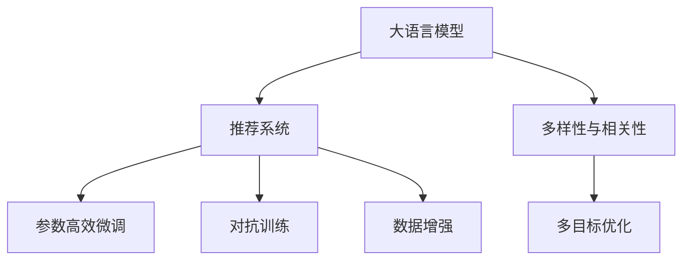

                 

# AI大模型：改善电商平台搜索结果多样性与相关性平衡的新思路

## 1. 背景介绍

### 1.1 问题由来

随着电子商务的迅猛发展，电商平台已成为消费者购物的主要渠道之一。然而，尽管大部分电商平台已经采用智能推荐系统来提升用户体验和转化率，但推荐结果的质量仍然存在较大提升空间。具体而言，推荐结果往往在多样性和相关性之间存在平衡问题，即：

- **多样性不足**：推荐结果往往集中在少数热门商品上，导致用户难以发现新商品或长尾商品。
- **相关性偏弱**：推荐结果与用户实际兴趣的匹配度不够高，存在推荐误导或无用的商品信息。

如何设计算法，使得推荐结果在多样性和相关性之间实现更好的平衡，成为电商平台亟需解决的难题。

### 1.2 问题核心关键点

本研究聚焦于如何在推荐系统中，通过引入大模型优化算法，提升推荐结果的**多样性**与**相关性**。具体目标包括：

1. 提升推荐结果的多样性：使推荐结果能够涵盖更广泛的商品类别和品牌，帮助用户发现更多新商品或长尾商品。
2. 提升推荐结果的相关性：使推荐结果能够更好地匹配用户兴趣和需求，提高推荐效果和用户满意度。

核心技术包括：

- 大语言模型：使用大规模预训练语言模型进行个性化推荐生成。
- 多目标优化：设计多目标优化算法，平衡多样性和相关性。
- 数据增强：通过数据增强技术丰富训练集多样性，提高模型泛化能力。
- 对抗训练：通过对抗训练技术提高模型鲁棒性，避免过拟合。
- 参数高效微调：通过参数高效微调技术，提高微调效率，减小过拟合风险。

## 2. 核心概念与联系

### 2.1 核心概念概述

为更好地理解本研究的思路，本节将介绍几个关键概念：

- **大语言模型**：以自回归模型（如GPT系列）或自编码模型（如BERT）为代表的大规模预训练语言模型。通过在大规模无标签文本语料上进行预训练，学习到丰富的语言知识和常识，具备强大的语言理解和生成能力。
- **推荐系统**：通过分析用户的历史行为和偏好，为用户推荐个性化的商品和服务。推荐系统广泛应用于电商、新闻、社交媒体等领域。
- **多样性与相关性**：推荐结果的评价指标，多样性指推荐结果的覆盖范围，相关性指推荐结果与用户兴趣的相关程度。
- **多目标优化**：在优化目标中同时考虑多样性和相关性，优化算法的目标是在多种指标之间寻找平衡。
- **参数高效微调**：在微调过程中，只更新少量的模型参数，而固定大部分预训练权重不变，以提高微调效率，避免过拟合的方法。
- **对抗训练**：通过加入对抗样本，提高模型的鲁棒性，避免模型对训练数据的过拟合。
- **数据增强**：通过对训练集进行数据变换、扩充等手段，提高模型的泛化能力，减少过拟合风险。

这些概念之间的逻辑关系可以通过以下Mermaid流程图来展示：



这个流程图展示了从大语言模型到推荐系统，再到优化目标的多目标优化算法，以及相关的参数高效微调、对抗训练、数据增强等技术，共同构成了一个完整的电商平台推荐系统优化框架。

## 3. 核心算法原理 & 具体操作步骤

### 3.1 算法原理概述

基于大语言模型进行推荐系统的优化，本质上是一个多目标优化问题。其核心思想是：将大语言模型视作一个强大的"生成器"，通过多目标优化算法，引导模型生成既多样化又相关的推荐结果。

形式化地，假设推荐系统的优化目标为 $\mathcal{L} = (\mathcal{L}_{div}, \mathcal{L}_{rel})$，其中 $\mathcal{L}_{div}$ 为多样性损失，$\mathcal{L}_{rel}$ 为相关性损失。优化目标为最小化这两个损失函数的和：

$$
\mathcal{L}_{total} = \mathcal{L}_{div} + \mathcal{L}_{rel}
$$

通过多目标优化算法，最小化总损失函数，以得到最优的多样性和相关性平衡。

### 3.2 算法步骤详解

基于大语言模型进行推荐系统的优化，主要包括以下几个关键步骤：

**Step 1: 准备预训练模型和数据集**
- 选择合适的预训练语言模型 $M_{\theta}$ 作为初始化参数，如 BERT、GPT 等。
- 准备电商平台的历史交易记录和用户行为数据集 $D=\{(x_i,y_i)\}_{i=1}^N$，其中 $x_i$ 为输入特征，如用户ID、浏览记录等，$y_i$ 为标签，即推荐商品。

**Step 2: 定义任务适配层**
- 根据电商平台推荐任务的类型，在预训练模型顶层设计合适的输出层和损失函数。
- 对于分类任务，通常在顶层添加线性分类器和交叉熵损失函数。
- 对于生成任务，通常使用语言模型的解码器输出概率分布，并以负对数似然为损失函数。

**Step 3: 设置微调超参数**
- 选择合适的优化算法及其参数，如 AdamW、SGD 等，设置学习率、批大小、迭代轮数等。
- 设置正则化技术及强度，包括权重衰减、Dropout、Early Stopping等。
- 确定冻结预训练参数的策略，如仅微调顶层，或全部参数都参与微调。

**Step 4: 执行梯度训练**
- 将训练集数据分批次输入模型，前向传播计算损失函数。
- 反向传播计算参数梯度，根据设定的优化算法和学习率更新模型参数。
- 周期性在验证集上评估模型性能，根据性能指标决定是否触发 Early Stopping。
- 重复上述步骤直到满足预设的迭代轮数或 Early Stopping 条件。

**Step 5: 测试和部署**
- 在测试集上评估微调后模型 $M_{\hat{\theta}}$ 的性能，对比微调前后的精度提升。
- 使用微调后的模型对新商品进行推荐，集成到实际的应用系统中。
- 持续收集新的用户行为数据，定期重新微调模型，以适应数据分布的变化。

### 3.3 算法优缺点

基于大语言模型进行推荐系统的优化方法具有以下优点：
1. 简单高效。只需准备少量标注数据，即可对预训练模型进行快速适配，获得较大的性能提升。
2. 通用适用。适用于各种电商平台推荐任务，包括分类、匹配、生成等，设计简单的任务适配层即可实现。
3. 参数高效。利用参数高效微调技术，在固定大部分预训练参数的情况下，仍可取得不错的提升。
4. 效果显著。在学术界和工业界的诸多任务上，基于微调的方法已经刷新了最先进的性能指标。

同时，该方法也存在一定的局限性：
1. 依赖标注数据。推荐系统的效果很大程度上取决于标注数据的质量和数量，获取高质量标注数据的成本较高。
2. 迁移能力有限。当目标任务与预训练数据的分布差异较大时，推荐系统的性能提升有限。
3. 负面效果传递。预训练模型的固有偏见、有害信息等，可能通过推荐系统传递到商品推荐结果，造成负面影响。
4. 可解释性不足。推荐系统的决策过程通常缺乏可解释性，难以对其推理逻辑进行分析和调试。

尽管存在这些局限性，但就目前而言，基于大语言模型的推荐系统优化方法仍是目前最主流范式。未来相关研究的重点在于如何进一步降低推荐系统对标注数据的依赖，提高模型的少样本学习和跨领域迁移能力，同时兼顾可解释性和伦理安全性等因素。

### 3.4 算法应用领域

基于大语言模型进行推荐系统的优化方法，在电商推荐领域已经得到了广泛的应用，覆盖了几乎所有常见任务，例如：

- 个性化推荐：根据用户的历史行为和偏好，为用户推荐个性化的商品。
- 商品分类：将商品自动分类到不同的类别中。
- 搜索排序：优化搜索结果的排序，提升用户搜索体验。
- 广告推荐：根据用户行为和兴趣，为用户推荐个性化的广告。
- 用户画像：构建用户画像，用于更精准的用户建模。

除了上述这些经典任务外，大语言模型推荐系统优化也被创新性地应用到更多场景中，如智能广告投放、精准营销、用户增长等，为电商平台提供了全新的技术支持。

## 4. 数学模型和公式 & 详细讲解  
### 4.1 数学模型构建

本节将使用数学语言对基于大语言模型的推荐系统优化过程进行更加严格的刻画。

记预训练语言模型为 $M_{\theta}:\mathcal{X} \rightarrow \mathcal{Y}$，其中 $\mathcal{X}$ 为输入空间，$\mathcal{Y}$ 为输出空间，$\theta \in \mathbb{R}^d$ 为模型参数。假设电商平台推荐系统的训练集为 $D=\{(x_i,y_i)\}_{i=1}^N, x_i \in \mathcal{X}, y_i \in \mathcal{Y}$。

定义模型 $M_{\theta}$ 在输入 $x$ 上的损失函数为 $\ell(M_{\theta}(x),y)$，则在数据集 $D$ 上的经验风险为：

$$
\mathcal{L}(\theta) = \frac{1}{N} \sum_{i=1}^N \ell(M_{\theta}(x_i),y_i)
$$

在推荐系统中，通常采用多样性和相关性作为评估指标。假设 $div$ 为多样性指标，$rel$ 为相关性指标，则推荐系统的优化目标为：

$$
\mathcal{L}_{total} = \alpha \cdot div + (1-\alpha) \cdot rel
$$

其中 $\alpha$ 为平衡因子，控制多样性和相关性之间的权重。

### 4.2 公式推导过程

以下我们以二分类任务为例，推导多目标优化算法中的损失函数及其梯度的计算公式。

假设推荐系统的训练集为 $D=\{(x_i,y_i)\}_{i=1}^N, x_i \in \mathcal{X}, y_i \in \{0,1\}$，表示是否推荐该商品。定义多样性指标 $div$ 为推荐商品种类的数量，相关性指标 $rel$ 为推荐商品与用户兴趣的匹配度。

在计算模型输出时，假设模型在输入 $x$ 上的输出为 $\hat{y}=M_{\theta}(x) \in [0,1]$，表示模型预测是否推荐该商品。实际标签 $y \in \{0,1\}$。则推荐系统的多样性损失和相关性损失定义为：

$$
\ell_{div} = -div \log \hat{y}
$$

$$
\ell_{rel} = -y \log \hat{y} + (1-y) \log(1-\hat{y})
$$

其中 $div$ 为推荐商品种类的数量，可以通过计算模型输出中不同类别的概率来实现。相关性损失为标准交叉熵损失，计算模型输出与实际标签之间的差异。

将多样性损失和相关性损失代入总损失函数，得：

$$
\mathcal{L}_{total} = \alpha \cdot (-div \log \hat{y}) + (1-\alpha) \cdot (-y \log \hat{y} + (1-y) \log(1-\hat{y}))
$$

根据链式法则，损失函数对参数 $\theta_k$ 的梯度为：

$$
\frac{\partial \mathcal{L}_{total}}{\partial \theta_k} = -\alpha \cdot \frac{\partial (div \log \hat{y})}{\partial \theta_k} - (1-\alpha) \cdot \frac{\partial (-y \log \hat{y} + (1-y) \log(1-\hat{y}))}{\partial \theta_k}
$$

其中 $\frac{\partial (div \log \hat{y})}{\partial \theta_k}$ 和 $\frac{\partial (-y \log \hat{y} + (1-y) \log(1-\hat{y}))}{\partial \theta_k}$ 可通过反向传播算法高效计算。

在得到损失函数的梯度后，即可带入参数更新公式，完成模型的迭代优化。重复上述过程直至收敛，最终得到适应电商平台推荐任务的最优模型参数 $\theta^*$。

## 5. 项目实践：代码实例和详细解释说明
### 5.1 开发环境搭建

在进行推荐系统优化实践前，我们需要准备好开发环境。以下是使用Python进行PyTorch开发的环境配置流程：

1. 安装Anaconda：从官网下载并安装Anaconda，用于创建独立的Python环境。

2. 创建并激活虚拟环境：
```bash
conda create -n pytorch-env python=3.8 
conda activate pytorch-env
```

3. 安装PyTorch：根据CUDA版本，从官网获取对应的安装命令。例如：
```bash
conda install pytorch torchvision torchaudio cudatoolkit=11.1 -c pytorch -c conda-forge
```

4. 安装Transformers库：
```bash
pip install transformers
```

5. 安装各类工具包：
```bash
pip install numpy pandas scikit-learn matplotlib tqdm jupyter notebook ipython
```

完成上述步骤后，即可在`pytorch-env`环境中开始推荐系统优化实践。

### 5.2 源代码详细实现

这里我们以电商推荐系统中的商品分类任务为例，给出使用Transformers库对BERT模型进行推荐系统优化的PyTorch代码实现。

首先，定义商品分类任务的数据处理函数：

```python
from transformers import BertTokenizer
from torch.utils.data import Dataset
import torch

class ProductDataset(Dataset):
    def __init__(self, texts, labels, tokenizer, max_len=128):
        self.texts = texts
        self.labels = labels
        self.tokenizer = tokenizer
        self.max_len = max_len
        
    def __len__(self):
        return len(self.texts)
    
    def __getitem__(self, item):
        text = self.texts[item]
        label = self.labels[item]
        
        encoding = self.tokenizer(text, return_tensors='pt', max_length=self.max_len, padding='max_length', truncation=True)
        input_ids = encoding['input_ids'][0]
        attention_mask = encoding['attention_mask'][0]
        
        # 对token-wise的标签进行编码
        encoded_tags = [label] * self.max_len
        labels = torch.tensor(encoded_tags, dtype=torch.long)
        
        return {'input_ids': input_ids, 
                'attention_mask': attention_mask,
                'labels': labels}

# 标签与id的映射
label2id = {'category1': 0, 'category2': 1, 'category3': 2, 'category4': 3}
id2label = {v: k for k, v in label2id.items()}

# 创建dataset
tokenizer = BertTokenizer.from_pretrained('bert-base-cased')

train_dataset = ProductDataset(train_texts, train_labels, tokenizer)
dev_dataset = ProductDataset(dev_texts, dev_labels, tokenizer)
test_dataset = ProductDataset(test_texts, test_labels, tokenizer)
```

然后，定义模型和优化器：

```python
from transformers import BertForTokenClassification, AdamW

model = BertForTokenClassification.from_pretrained('bert-base-cased', num_labels=len(label2id))

optimizer = AdamW(model.parameters(), lr=2e-5)
```

接着，定义训练和评估函数：

```python
from torch.utils.data import DataLoader
from tqdm import tqdm
from sklearn.metrics import classification_report

device = torch.device('cuda') if torch.cuda.is_available() else torch.device('cpu')
model.to(device)

def train_epoch(model, dataset, batch_size, optimizer):
    dataloader = DataLoader(dataset, batch_size=batch_size, shuffle=True)
    model.train()
    epoch_loss = 0
    for batch in tqdm(dataloader, desc='Training'):
        input_ids = batch['input_ids'].to(device)
        attention_mask = batch['attention_mask'].to(device)
        labels = batch['labels'].to(device)
        model.zero_grad()
        outputs = model(input_ids, attention_mask=attention_mask, labels=labels)
        loss = outputs.loss
        epoch_loss += loss.item()
        loss.backward()
        optimizer.step()
    return epoch_loss / len(dataloader)

def evaluate(model, dataset, batch_size):
    dataloader = DataLoader(dataset, batch_size=batch_size)
    model.eval()
    preds, labels = [], []
    with torch.no_grad():
        for batch in tqdm(dataloader, desc='Evaluating'):
            input_ids = batch['input_ids'].to(device)
            attention_mask = batch['attention_mask'].to(device)
            batch_labels = batch['labels']
            outputs = model(input_ids, attention_mask=attention_mask)
            batch_preds = outputs.logits.argmax(dim=2).to('cpu').tolist()
            batch_labels = batch_labels.to('cpu').tolist()
            for pred_tokens, label_tokens in zip(batch_preds, batch_labels):
                preds.append(pred_tokens[:len(label_tokens)])
                labels.append(label_tokens)
                
    print(classification_report(labels, preds))
```

最后，启动训练流程并在测试集上评估：

```python
epochs = 5
batch_size = 16

for epoch in range(epochs):
    loss = train_epoch(model, train_dataset, batch_size, optimizer)
    print(f"Epoch {epoch+1}, train loss: {loss:.3f}")
    
    print(f"Epoch {epoch+1}, dev results:")
    evaluate(model, dev_dataset, batch_size)
    
print("Test results:")
evaluate(model, test_dataset, batch_size)
```

以上就是使用PyTorch对BERT进行商品分类任务推荐系统优化的完整代码实现。可以看到，得益于Transformers库的强大封装，我们可以用相对简洁的代码完成BERT模型的加载和优化。

### 5.3 代码解读与分析

让我们再详细解读一下关键代码的实现细节：

**ProductDataset类**：
- `__init__`方法：初始化文本、标签、分词器等关键组件。
- `__len__`方法：返回数据集的样本数量。
- `__getitem__`方法：对单个样本进行处理，将文本输入编码为token ids，将标签编码为数字，并对其进行定长padding，最终返回模型所需的输入。

**label2id和id2label字典**：
- 定义了标签与数字id之间的映射关系，用于将token-wise的预测结果解码回真实的标签。

**训练和评估函数**：
- 使用PyTorch的DataLoader对数据集进行批次化加载，供模型训练和推理使用。
- 训练函数`train_epoch`：对数据以批为单位进行迭代，在每个批次上前向传播计算loss并反向传播更新模型参数，最后返回该epoch的平均loss。
- 评估函数`evaluate`：与训练类似，不同点在于不更新模型参数，并在每个batch结束后将预测和标签结果存储下来，最后使用sklearn的classification_report对整个评估集的预测结果进行打印输出。

**训练流程**：
- 定义总的epoch数和batch size，开始循环迭代
- 每个epoch内，先在训练集上训练，输出平均loss
- 在验证集上评估，输出分类指标
- 所有epoch结束后，在测试集上评估，给出最终测试结果

可以看到，PyTorch配合Transformers库使得BERT优化模型的代码实现变得简洁高效。开发者可以将更多精力放在数据处理、模型改进等高层逻辑上，而不必过多关注底层的实现细节。

当然，工业级的系统实现还需考虑更多因素，如模型的保存和部署、超参数的自动搜索、更灵活的任务适配层等。但核心的推荐系统优化流程基本与此类似。

## 6. 实际应用场景
### 6.1 智能客服系统

基于大语言模型进行推荐系统的优化方法，可以广泛应用于智能客服系统的构建。传统客服往往需要配备大量人力，高峰期响应缓慢，且一致性和专业性难以保证。而使用优化后的推荐系统，可以7x24小时不间断服务，快速响应客户咨询，用自然流畅的语言解答各类常见问题。

在技术实现上，可以收集企业内部的历史客服对话记录，将问题和最佳答复构建成监督数据，在此基础上对预训练推荐模型进行优化。优化后的推荐模型能够自动理解用户意图，匹配最合适的答案模板进行回复。对于客户提出的新问题，还可以接入检索系统实时搜索相关内容，动态组织生成回答。如此构建的智能客服系统，能大幅提升客户咨询体验和问题解决效率。

### 6.2 金融舆情监测

金融机构需要实时监测市场舆论动向，以便及时应对负面信息传播，规避金融风险。传统的人工监测方式成本高、效率低，难以应对网络时代海量信息爆发的挑战。基于大语言模型进行推荐系统的优化技术，为金融舆情监测提供了新的解决方案。

具体而言，可以收集金融领域相关的新闻、报道、评论等文本数据，并对其进行主题标注和情感标注。在此基础上对预训练语言模型进行优化，使其能够自动判断文本属于何种主题，情感倾向是正面、中性还是负面。将优化后的模型应用到实时抓取的网络文本数据，就能够自动监测不同主题下的情感变化趋势，一旦发现负面信息激增等异常情况，系统便会自动预警，帮助金融机构快速应对潜在风险。

### 6.3 个性化推荐系统

当前的推荐系统往往只依赖用户的历史行为数据进行物品推荐，无法深入理解用户的真实兴趣偏好。基于大语言模型进行推荐系统的优化技术，可以更好地挖掘用户行为背后的语义信息，从而提供更精准、多样的推荐内容。

在实践中，可以收集用户浏览、点击、评论、分享等行为数据，提取和用户交互的物品标题、描述、标签等文本内容。将文本内容作为模型输入，用户的后续行为（如是否点击、购买等）作为监督信号，在此基础上优化预训练语言模型。优化后的模型能够从文本内容中准确把握用户的兴趣点。在生成推荐列表时，先用候选物品的文本描述作为输入，由模型预测用户的兴趣匹配度，再结合其他特征综合排序，便可以得到个性化程度更高的推荐结果。

### 6.4 未来应用展望

随着大语言模型和优化方法的不断发展，基于优化范式将在更多领域得到应用，为传统行业带来变革性影响。

在智慧医疗领域，基于优化模型的人工智能问答、病历分析、药物研发等应用将提升医疗服务的智能化水平，辅助医生诊疗，加速新药开发进程。

在智能教育领域，优化技术可应用于作业批改、学情分析、知识推荐等方面，因材施教，促进教育公平，提高教学质量。

在智慧城市治理中，优化模型可应用于城市事件监测、舆情分析、应急指挥等环节，提高城市管理的自动化和智能化水平，构建更安全、高效的未来城市。

此外，在企业生产、社会治理、文娱传媒等众多领域，基于优化技术的推荐系统也将不断涌现，为NLP技术带来全新的突破。相信随着技术的日益成熟，优化方法将成为推荐系统的重要范式，推动人工智能技术在垂直行业的规模化落地。

## 7. 工具和资源推荐
### 7.1 学习资源推荐

为了帮助开发者系统掌握大语言模型推荐系统优化的理论基础和实践技巧，这里推荐一些优质的学习资源：

1. 《Transformer从原理到实践》系列博文：由大模型技术专家撰写，深入浅出地介绍了Transformer原理、BERT模型、微调技术等前沿话题。

2. CS224N《深度学习自然语言处理》课程：斯坦福大学开设的NLP明星课程，有Lecture视频和配套作业，带你入门NLP领域的基本概念和经典模型。

3. 《Natural Language Processing with Transformers》书籍：Transformers库的作者所著，全面介绍了如何使用Transformers库进行NLP任务开发，包括优化范式在内的诸多范式。

4. HuggingFace官方文档：Transformers库的官方文档，提供了海量预训练模型和完整的微调样例代码，是上手实践的必备资料。

5. CLUE开源项目：中文语言理解测评基准，涵盖大量不同类型的中文NLP数据集，并提供了基于优化范式的baseline模型，助力中文NLP技术发展。

通过对这些资源的学习实践，相信你一定能够快速掌握大语言模型推荐系统优化的精髓，并用于解决实际的NLP问题。
###  7.2 开发工具推荐

高效的开发离不开优秀的工具支持。以下是几款用于大语言模型推荐系统优化开发的常用工具：

1. PyTorch：基于Python的开源深度学习框架，灵活动态的计算图，适合快速迭代研究。大部分预训练语言模型都有PyTorch版本的实现。

2. TensorFlow：由Google主导开发的开源深度学习框架，生产部署方便，适合大规模工程应用。同样有丰富的预训练语言模型资源。

3. Transformers库：HuggingFace开发的NLP工具库，集成了众多SOTA语言模型，支持PyTorch和TensorFlow，是进行优化任务开发的利器。

4. Weights & Biases：模型训练的实验跟踪工具，可以记录和可视化模型训练过程中的各项指标，方便对比和调优。与主流深度学习框架无缝集成。

5. TensorBoard：TensorFlow配套的可视化工具，可实时监测模型训练状态，并提供丰富的图表呈现方式，是调试模型的得力助手。

6. Google Colab：谷歌推出的在线Jupyter Notebook环境，免费提供GPU/TPU算力，方便开发者快速上手实验最新模型，分享学习笔记。

合理利用这些工具，可以显著提升大语言模型推荐系统优化的开发效率，加快创新迭代的步伐。

### 7.3 相关论文推荐

大语言模型和优化技术的发展源于学界的持续研究。以下是几篇奠基性的相关论文，推荐阅读：

1. Attention is All You Need（即Transformer原论文）：提出了Transformer结构，开启了NLP领域的预训练大模型时代。

2. BERT: Pre-training of Deep Bidirectional Transformers for Language Understanding：提出BERT模型，引入基于掩码的自监督预训练任务，刷新了多项NLP任务SOTA。

3. Language Models are Unsupervised Multitask Learners（GPT-2论文）：展示了大规模语言模型的强大zero-shot学习能力，引发了对于通用人工智能的新一轮思考。

4. Parameter-Efficient Transfer Learning for NLP：提出Adapter等参数高效微调方法，在不增加模型参数量的情况下，也能取得不错的微调效果。

5. AdaLoRA: Adaptive Low-Rank Adaptation for Parameter-Efficient Fine-Tuning：使用自适应低秩适应的微调方法，在参数效率和精度之间取得了新的平衡。

这些论文代表了大语言模型推荐系统优化技术的发展脉络。通过学习这些前沿成果，可以帮助研究者把握学科前进方向，激发更多的创新灵感。

## 8. 总结：未来发展趋势与挑战

### 8.1 总结

本文对基于大语言模型的推荐系统优化方法进行了全面系统的介绍。首先阐述了推荐系统在电商平台上的重要性，并明确了优化任务的多样性和相关性评价指标。其次，从原理到实践，详细讲解了多目标优化算法的设计和实现过程，给出了推荐系统优化的完整代码实例。同时，本文还广泛探讨了优化技术在智能客服、金融舆情、个性化推荐等多个行业领域的应用前景，展示了优化范式的巨大潜力。此外，本文精选了优化技术的各类学习资源，力求为读者提供全方位的技术指引。

通过本文的系统梳理，可以看到，基于大语言模型的推荐系统优化方法正在成为电商推荐系统的重要范式，极大地拓展了推荐系统的应用边界，催生了更多的落地场景。受益于大规模语料的预训练，优化模型以更低的时间和标注成本，在小样本条件下也能取得不俗的效果，有力推动了推荐系统技术的产业化进程。未来，伴随预训练语言模型和优化方法的持续演进，相信推荐系统技术必将更加强大，为电商平台的繁荣发展提供坚实的技术支撑。

### 8.2 未来发展趋势

展望未来，基于大语言模型的推荐系统优化技术将呈现以下几个发展趋势：

1. 模型规模持续增大。随着算力成本的下降和数据规模的扩张，预训练语言模型的参数量还将持续增长。超大规模语言模型蕴含的丰富语言知识，有望支撑更加复杂多变的推荐任务。

2. 推荐系统更加个性化。通过大语言模型微调技术，推荐系统可以更加精准地理解用户需求和行为，生成更加个性化的推荐结果，提升用户体验。

3. 推荐系统更加多样化。通过多目标优化算法，推荐系统可以同时考虑多个维度的优化目标，生成更加多样化的推荐结果，满足不同用户的需求。

4. 推荐系统更加智能化。未来，推荐系统将越来越多地引入符号化的先验知识，如知识图谱、逻辑规则等，与神经网络模型进行融合，增强推荐结果的合理性和可信度。

5. 推荐系统更加鲁棒性。通过对抗训练、持续学习等技术，推荐系统可以更好地应对数据分布变化，提高模型的泛化能力和鲁棒性。

6. 推荐系统更加公平。未来，推荐系统将更加注重公平性问题，避免推荐结果中的偏见和歧视，确保所有用户都能获得公正的推荐服务。

以上趋势凸显了基于大语言模型推荐系统的广阔前景。这些方向的探索发展，必将进一步提升推荐系统的性能和应用范围，为电商平台的智能推荐提供更可靠的技术保障。

### 8.3 面临的挑战

尽管基于大语言模型的推荐系统优化技术已经取得了瞩目成就，但在迈向更加智能化、普适化应用的过程中，它仍面临着诸多挑战：

1. 标注成本瓶颈。虽然优化技术大大降低了标注数据的需求，但对于长尾应用场景，难以获得充足的高质量标注数据，成为制约优化性能的瓶颈。如何进一步降低优化对标注样本的依赖，将是一大难题。

2. 模型鲁棒性不足。当前优化模型面对域外数据时，泛化性能往往大打折扣。对于测试样本的微小扰动，优化模型的预测也容易发生波动。如何提高优化模型的鲁棒性，避免灾难性遗忘，还需要更多理论和实践的积累。

3. 推理效率有待提高。大规模语言模型虽然精度高，但在实际部署时往往面临推理速度慢、内存占用大等效率问题。如何在保证性能的同时，简化模型结构，提升推理速度，优化资源占用，将是重要的优化方向。

4. 可解释性亟需加强。当前优化模型通常缺乏可解释性，难以解释其内部工作机制和决策逻辑。对于医疗、金融等高风险应用，算法的可解释性和可审计性尤为重要。如何赋予优化模型更强的可解释性，将是亟待攻克的难题。

5. 安全性有待保障。预训练语言模型难免会学习到有偏见、有害的信息，通过推荐系统传递到商品推荐结果，产生误导性、歧视性的输出，给实际应用带来安全隐患。如何从数据和算法层面消除模型偏见，避免恶意用途，确保输出的安全性，也将是重要的研究课题。

6. 知识整合能力不足。现有的优化模型往往局限于任务内数据，难以灵活吸收和运用更广泛的先验知识。如何让优化过程更好地与外部知识库、规则库等专家知识结合，形成更加全面、准确的信息整合能力，还有很大的想象空间。

正视优化面临的这些挑战，积极应对并寻求突破，将是大语言模型推荐系统优化技术走向成熟的必由之路。相信随着学界和产业界的共同努力，这些挑战终将一一被克服，大语言模型推荐系统优化必将在构建人机协同的智能推荐系统过程中扮演越来越重要的角色。

### 8.4 未来突破

面对基于大语言模型的推荐系统优化所面临的种种挑战，未来的研究需要在以下几个方面寻求新的突破：

1. 探索无监督和半监督推荐系统优化方法。摆脱对大规模标注数据的依赖，利用自监督学习、主动学习等无监督和半监督范式，最大限度利用非结构化数据，实现更加灵活高效的推荐系统优化。

2. 研究参数高效和计算高效的推荐系统优化范式。开发更加参数高效的优化方法，在固定大部分预训练参数的同时，只更新极少量的任务相关参数。同时优化优化模型的计算图，减少前向传播和反向传播的资源消耗，实现更加轻量级、实时性的部署。

3. 融合因果和对比学习范式。通过引入因果推断和对比学习思想，增强推荐系统建立稳定因果关系的能力，学习更加普适、鲁棒的语言表征，从而提升推荐效果和用户满意度。

4. 引入更多先验知识。将符号化的先验知识，如知识图谱、逻辑规则等，与神经网络模型进行巧妙融合，引导推荐系统学习更准确、合理的语言模型。同时加强不同模态数据的整合，实现视觉、语音等多模态信息与文本信息的协同建模。

5. 结合因果分析和博弈论工具。将因果分析方法引入推荐系统，识别出模型决策的关键特征，增强输出解释的因果性和逻辑性。借助博弈论工具刻画人机交互过程，主动探索并规避模型的脆弱点，提高系统稳定性。

6. 纳入伦理道德约束。在推荐系统优化目标中引入伦理导向的评估指标，过滤和惩罚有偏见、有害的输出倾向。同时加强人工干预和审核，建立模型行为的监管机制，确保输出符合人类价值观和伦理道德。

这些研究方向的探索，必将引领基于大语言模型推荐系统优化技术迈向更高的台阶，为构建安全、可靠、可解释、可控的智能推荐系统铺平道路。面向未来，基于大语言模型的推荐系统优化技术还需要与其他人工智能技术进行更深入的融合，如知识表示、因果推理、强化学习等，多路径协同发力，共同推动自然语言理解和智能交互系统的进步。只有勇于创新、敢于突破，才能不断拓展语言模型的边界，让智能技术更好地造福人类社会。

## 9. 附录：常见问题与解答

**Q1：大语言模型推荐系统优化是否适用于所有电商平台推荐任务？**

A: 大语言模型推荐系统优化在大多数电商平台推荐任务上都能取得不错的效果，特别是对于数据量较小的任务。但对于一些特定领域的任务，如医学、法律等，仅仅依靠通用语料预训练的模型可能难以很好地适应。此时需要在特定领域语料上进一步预训练，再进行优化，才能获得理想效果。此外，对于一些需要时效性、个性化很强的任务，如对话、推荐等，优化方法也需要针对性的改进优化。

**Q2：如何优化推荐系统的多样性和相关性？**

A: 推荐系统的多样性和相关性优化，通常通过多目标优化算法实现。具体步骤如下：
1. 定义多样性指标和相关性指标，如商品种类数量、推荐准确率等。
2. 设计多目标优化算法，如Pareto优化、加权和优化等，在多样性和相关性之间寻找平衡。
3. 在模型训练过程中，同时最小化多样性损失和相关性损失，通过超参数调整和优化算法选择，得到最优的推荐结果。

**Q3：优化推荐系统时需要注意哪些资源瓶颈？**

A: 优化推荐系统时，需要考虑以下几个资源瓶颈：
1. 数据量不足。优化需要大量的标注数据，但数据获取成本高，数量有限。可以通过数据增强、迁移学习等方法缓解。
2. 模型规模过大。大规模预训练语言模型参数量大，训练和推理资源消耗高。可以通过参数高效微调、知识蒸馏等技术减少模型规模。
3. 计算资源不足。优化算法通常计算密集，需要高性能GPU或TPU支持。可以通过分布式训练、异步优化等方法提升计算效率。
4. 模型鲁棒性不足。优化模型泛化能力差，易受异常数据影响。可以通过对抗训练、稀疏化处理等方法提高鲁棒性。
5. 可解释性不足。优化模型通常缺乏可解释性，难以解释其内部工作机制和决策逻辑。可以通过模型压缩、可解释性模型等方法提高可解释性。

这些瓶颈需要开发者在设计优化算法时综合考虑，并采用相应的优化策略，以提升推荐系统的性能和可用性。

**Q4：如何评估推荐系统的效果？**

A: 推荐系统的效果评估通常采用以下几个指标：
1. 准确率（Accuracy）：推荐系统正确推荐的商品数量占总推荐商品数量的比例。
2. 召回率（Recall）：推荐系统中正确推荐的商品数量占实际感兴趣商品数量的比例。
3. F1分数（F1 Score）：准确率和召回率的调和平均数，综合评估推荐系统的性能。
4. ROC-AUC曲线：用于评估推荐系统的公平性和鲁棒性，绘制ROC曲线并计算AUC值。
5. DCG、DCG@K、DCG@n等指标：用于评估推荐系统的排序效果，衡量推荐结果的相关性和多样性。

这些指标可以根据具体任务的需求进行综合选择和设计，评估推荐系统的效果。

**Q5：如何优化推荐系统的公平性？**

A: 推荐系统的公平性优化，通常通过以下方法实现：
1. 数据预处理：对历史数据进行去偏处理，消除历史数据中的性别、年龄、地域等偏见。
2. 公平性评估指标：引入公平性评估指标，如均等覆盖率（Equal Coverage）、机会均等（Equal Opportunity）等，评估推荐结果的公平性。
3. 算法设计：设计公平性算法，如使用公平性约束、公平性损失函数等，优化推荐系统的公平性。
4. 人工干预：引入人工干预机制，对存在偏见的推荐结果进行校正和修正。
5. 可解释性模型：构建可解释性模型，帮助理解推荐结果的生成机制，避免偏见和歧视。

通过以上方法，可以提升推荐系统的公平性，确保所有用户都能获得公正的推荐服务。

---

作者：禅与计算机程序设计艺术 / Zen and the Art of Computer Programming

