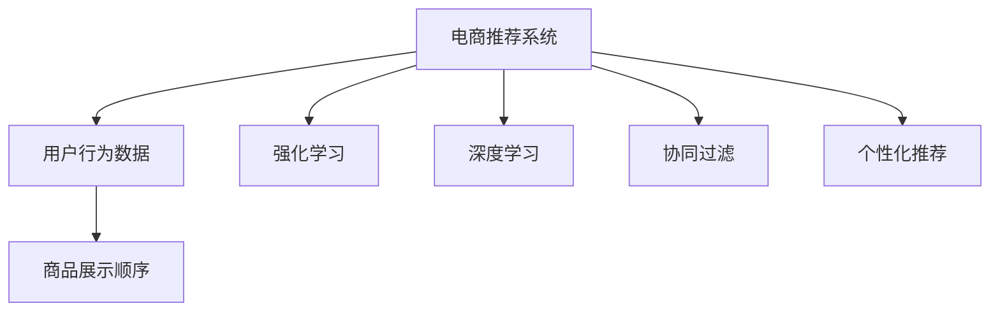

                 

# AI如何优化电商平台的商品展示顺序

> 关键词：电商推荐系统,商品展示顺序,强化学习,协同过滤,深度学习,个性化推荐,用户行为数据

## 1. 背景介绍

### 1.1 问题由来
随着互联网电商的蓬勃发展，用户行为数据的日益丰富，个性化推荐系统（Personalized Recommendation System, PRL）在电商平台中得到广泛应用。传统基于规则、协同过滤、内容推荐等技术已无法满足日益增长的用户需求，基于机器学习的推荐算法应运而生，在电商平台上取得了显著效果。其中，电商推荐系统（E-commerce Recommendation System, ERL）通过分析用户行为数据，为用户推荐可能感兴趣的商品，提升用户体验和平台转化率。

然而，现有电商推荐系统往往缺乏对商品展示顺序（商品展示顺序、商品布局、广告位布局等）的深入优化。事实上，商品展示顺序对用户点击率、转化率有显著影响。如何通过优化商品展示顺序，提升推荐效果，是当前电商推荐系统亟需解决的问题。

### 1.2 问题核心关键点
商品展示顺序优化是电商推荐系统中的重要子问题。其核心关键点在于：
1. **用户行为数据的多维度特征**：电商平台用户行为数据通常包含搜索、浏览、点击、购买等各类互动行为，这些数据相互交织，需综合考虑。
2. **商品多样性**：电商平台商品种类繁多，需综合考虑不同商品的点击率、转化率、流行度等因素，进行公平展示。
3. **用户个性化**：不同用户对商品展示顺序有不同偏好，需进行个性化推荐。
4. **系统实时性**：展示顺序应动态调整，及时反映用户行为变化，提升用户体验。
5. **算法鲁棒性**：算法应具备良好的鲁棒性，避免因数据异常或模型退化导致的展示顺序不当。

### 1.3 问题研究意义
优化商品展示顺序，有助于提升电商平台的用户体验和转化率，从而实现更高的商业价值。具体而言：
1. **增加用户停留时间**：合理展示热门商品或个性化推荐商品，增加用户浏览时间，提升购买概率。
2. **降低流失率**：及时展示用户感兴趣的商品，减少用户流失。
3. **提升广告效果**：合理分配广告位，提高广告点击率和转化率。
4. **提升平台收入**：通过精准推荐，提高用户购买率，提升平台收入。

## 2. 核心概念与联系

### 2.1 核心概念概述

为更好地理解商品展示顺序优化，本节将介绍几个密切相关的核心概念：

- **电商推荐系统**：通过分析用户行为数据，为每个用户推荐可能感兴趣的商品。常见的推荐算法包括协同过滤、内容推荐、混合推荐等。

- **用户行为数据**：用户在电商平台上的各类互动行为，包括搜索、浏览、点击、购买等。通过这些行为数据，可以构建用户画像，推测用户兴趣，进行推荐。

- **商品展示顺序**：商品在电商平台上的排列顺序，包括搜索结果页、商品详情页、购物车页等。

- **强化学习**：通过不断尝试和学习，优化行为以最大化奖励的机器学习范式。电商推荐系统中常用强化学习算法包括Q-learning、Deep Q-learning等。

- **深度学习**：基于神经网络构建的机器学习算法，通常包含多层非线性变换。在电商推荐系统中，深度学习算法常用于用户行为建模、商品特征提取等。

- **协同过滤**：利用用户之间的相似性进行推荐。常用于电商推荐系统的冷启动阶段，或应对数据稀疏问题。

- **个性化推荐**：根据用户的行为数据、属性信息，推荐符合用户偏好的商品。电商推荐系统的主要目标。

这些核心概念之间的逻辑关系可以通过以下Mermaid流程图来展示：



这个流程图展示了我们核心概念的关联关系：

1. 电商推荐系统通过用户行为数据，构建用户画像，推测用户兴趣，进行推荐。
2. 商品展示顺序优化是电商推荐系统的重要组成部分，直接影响推荐效果。
3. 强化学习算法通过不断尝试和学习，优化商品展示顺序以最大化点击率、转化率等指标。
4. 深度学习算法用于用户行为建模、商品特征提取等，提高推荐系统的性能。
5. 协同过滤算法可用于电商推荐系统的冷启动阶段，或应对数据稀疏问题。
6. 个性化推荐算法根据用户行为数据和属性信息，推荐符合用户偏好的商品。

这些概念共同构成了电商推荐系统的核心技术框架，使系统能够实现高效、个性化的推荐。

## 3. 核心算法原理 & 具体操作步骤
### 3.1 算法原理概述

商品展示顺序优化通常采用强化学习（Reinforcement Learning, RL）算法。强化学习通过不断尝试和学习，优化行为以最大化奖励。在电商推荐系统中，商品展示顺序的优化目标是最大化点击率（Click-Through Rate, CTR）和转化率（Conversion Rate, CR）。

具体而言，我们定义电商平台为一个智能体（Agent），每个商品为环境（Environment）中的一个状态（State）。用户点击商品为采取的动作（Action），获得点击收益。用户购买商品为另一个动作，获得转化收益。系统通过不断探索和优化，找到最优的商品展示顺序。

强化学习算法通常分为以下几个步骤：

1. **环境建模**：构建电商平台的环境模型，描述商品展示顺序的状态空间、动作空间和奖励函数。
2. **策略学习**：选择适当的策略（如Q-learning、Deep Q-learning等），学习商品展示顺序的优化策略。
3. **行为优化**：在电商平台上进行商品展示顺序的实际优化，提升点击率和转化率。
4. **评估与迭代**：根据优化效果进行评估，调整策略，持续优化。

### 3.2 算法步骤详解

**Step 1: 环境建模**
- 商品展示顺序的状态空间：定义为商品展示的位置，如第1位、第2位、第3位等。
- 商品展示顺序的动作空间：定义为商品展示的位置调整，如将第3位商品展示到第2位。
- 奖励函数：定义为点击率和转化率，点击率通过用户点击行为进行评估，转化率通过用户购买行为进行评估。

**Step 2: 策略学习**
- 选择适当的强化学习算法，如Q-learning、Deep Q-learning等。
- 确定模型的网络结构，如Q网络（Q-learning）或双Q网络（Deep Q-learning）。
- 训练模型，最小化实际奖励与模型预测奖励的差距。

**Step 3: 行为优化**
- 在电商平台上进行商品展示顺序的实际优化，调整商品展示位置。
- 统计优化后的点击率和转化率，评估优化效果。
- 根据优化效果，调整策略参数，进行迭代优化。

**Step 4: 评估与迭代**
- 在电商平台上进行A/B测试，对比优化前后的效果。
- 收集用户反馈，评估用户体验。
- 持续优化策略，保持展示顺序的最新状态。

### 3.3 算法优缺点

强化学习在电商推荐系统中的商品展示顺序优化，具有以下优点：
1. 自适应性强：可以实时调整商品展示顺序，提升用户体验。
2. 动态优化：能够根据用户行为数据的变化，动态调整展示顺序。
3. 可解释性：强化学习策略透明，易于理解和调试。

然而，强化学习在电商推荐系统中的商品展示顺序优化也存在一些局限性：
1. 探索与利用的平衡：如何平衡探索新商品展示顺序和利用已知的展示顺序，需要精心设计。
2. 环境复杂性：电商平台的展示顺序环境复杂，商品种类繁多，优化难度大。
3. 数据稀疏性：电商平台用户行为数据通常存在稀疏性，优化策略难以充分训练。
4. 策略收敛性：优化策略是否收敛到最优状态，需要进一步验证。

### 3.4 算法应用领域

强化学习在电商推荐系统中的应用已经得到广泛验证，在商品展示顺序优化方面，其应用领域主要包括以下几个方面：

1. **搜索结果展示优化**：根据用户的搜索行为，优化搜索结果页的商品展示顺序，提升用户点击率。
2. **商品详情页布局**：根据用户浏览行为，优化商品详情页的商品展示顺序，提升用户停留时间和购买率。
3. **购物车优化**：根据用户购物车行为，优化购物车页的商品展示顺序，提升用户购买率。
4. **广告位布局**：根据用户广告点击行为，优化广告位布局，提高广告点击率和转化率。

除了上述这些经典应用外，强化学习在电商推荐系统中还有更多创新应用，如多目标优化、多用户协同优化等，为电商推荐系统带来了新的突破。

## 4. 数学模型和公式 & 详细讲解  
### 4.1 数学模型构建

在强化学习中，商品展示顺序优化可以构建如下数学模型：

- 状态空间 $S$：商品展示顺序的位置，如第1位、第2位、第3位等。
- 动作空间 $A$：商品展示顺序的位置调整，如将第3位商品展示到第2位。
- 奖励函数 $R(s, a)$：定义为点击率和转化率，具体表达式如下：

$$
R(s, a) = CTR(s, a) + CR(s, a)
$$

其中 $CTR(s, a)$ 为商品展示顺序在位置 $s$ 下，采取动作 $a$ 的点击率，$CR(s, a)$ 为商品展示顺序在位置 $s$ 下，采取动作 $a$ 的转化率。

### 4.2 公式推导过程

在强化学习中，我们通常使用Q-learning算法进行商品展示顺序优化。Q-learning算法的目标是最小化实际奖励与模型预测奖励的差距：

$$
Q(s, a) \leftarrow (1 - \alpha) Q(s, a) + \alpha(R(s, a) + \gamma \max_{a'} Q(s', a'))
$$

其中 $Q(s, a)$ 为状态-动作对 $(s, a)$ 的Q值，$\alpha$ 为学习率，$R(s, a)$ 为状态-动作对的奖励，$\gamma$ 为折扣因子，$s'$ 为采取动作 $a$ 后的下一个状态。

Q-learning算法的核心思想是通过不断探索和利用，更新Q值，找到最优的商品展示顺序。具体步骤如下：

1. **初始化Q值**：设置所有状态-动作对的Q值为0。
2. **策略更新**：根据当前状态 $s$ 和采取的动作 $a$，计算Q值。
3. **动作选择**：根据当前状态 $s$，选择动作 $a$。
4. **状态更新**：采取动作 $a$ 后，更新状态为 $s'$。
5. **Q值更新**：根据奖励 $R(s, a)$ 和折扣因子 $\gamma$，更新Q值。
6. **迭代优化**：重复以上步骤，直至收敛。

### 4.3 案例分析与讲解

假设我们有一个电商平台，有3个位置可以展示商品。我们希望通过强化学习，找到最优的商品展示顺序。

具体步骤如下：

1. **环境建模**：商品展示顺序的状态空间为 $S = \{1, 2, 3\}$，动作空间为 $A = \{\text{"Move to"}\}$。
2. **策略学习**：使用Q-learning算法，初始化所有状态-动作对的Q值为0。
3. **行为优化**：假设用户对商品A、B、C的点击率分别为0.5、0.4、0.3，转化率分别为0.2、0.3、0.4。则每个位置展示不同商品时的Q值计算如下：

   - 第1位展示A：$Q(1, \text{"Move to A"}) = 0.5 + 0.2 = 0.7$
   - 第1位展示B：$Q(1, \text{"Move to B"}) = 0.4 + 0.3 = 0.7$
   - 第1位展示C：$Q(1, \text{"Move to C"}) = 0.3 + 0.4 = 0.7$
   - 第2位展示A：$Q(2, \text{"Move to A"}) = 0.5 + 0.2 = 0.7$
   - 第2位展示B：$Q(2, \text{"Move to B"}) = 0.4 + 0.3 = 0.7$
   - 第2位展示C：$Q(2, \text{"Move to C"}) = 0.3 + 0.4 = 0.7$
   - 第3位展示A：$Q(3, \text{"Move to A"}) = 0.5 + 0.2 = 0.7$
   - 第3位展示B：$Q(3, \text{"Move to B"}) = 0.4 + 0.3 = 0.7$
   - 第3位展示C：$Q(3, \text{"Move to C"}) = 0.3 + 0.4 = 0.7$

4. **动作选择**：根据当前状态 $s=1$，选择动作 $a=\text{"Move to A"}$，将商品A展示在第1位。
5. **状态更新**：采取动作 $a=\text{"Move to A"}$ 后，状态更新为 $s'=1$。
6. **Q值更新**：根据奖励 $R(1, \text{"Move to A"}) = 0.5 + 0.2 = 0.7$ 和折扣因子 $\gamma=0.9$，更新Q值：$Q(1, \text{"Move to A"}) = 0.1 \times (0.7 + 0.9 \times 0.7) = 0.77$。
7. **迭代优化**：重复以上步骤，直至收敛。

通过上述步骤，我们找到了商品展示顺序的最优方案。

## 5. 项目实践：代码实例和详细解释说明
### 5.1 开发环境搭建

在进行商品展示顺序优化实践前，我们需要准备好开发环境。以下是使用Python进行强化学习开发的Python环境配置流程：

1. 安装Anaconda：从官网下载并安装Anaconda，用于创建独立的Python环境。

2. 创建并激活虚拟环境：
```bash
conda create -n rl-env python=3.8 
conda activate rl-env
```

3. 安装强化学习库：
```bash
conda install gym
conda install pytorch torchvision torchaudio
```

4. 安装TensorFlow或其他深度学习库：
```bash
conda install tensorflow
```

5. 安装相关的强化学习库：
```bash
pip install stable-baselines
```

完成上述步骤后，即可在`rl-env`环境中开始强化学习实践。

### 5.2 源代码详细实现

下面以电商推荐系统中的商品展示顺序优化为例，给出使用Stable Baselines3（Stable Baselines3）进行强化学习的PyTorch代码实现。

首先，定义强化学习环境：

```python
import gym
from stable_baselines3 import A2CTF
from stable_baselines3.common.vec_env import MultiVectorEnv

class EcommerceEnv(gym.Env):
    def __init__(self, inventory):
        self.inventory = inventory
        self.state = 0
        self.action_space = gym.spaces.Discrete(len(self.inventory))
        self.observation_space = gym.spaces.Discrete(len(self.inventory))

    def reset(self):
        self.state = 0
        return self.state

    def step(self, action):
        self.state = action
        reward = self.calculate_reward(self.state)
        done = False
        return self.state, reward, done, {}
    
    def calculate_reward(self, state):
        # 假设奖励计算基于点击率和转化率
        item = self.inventory[state]
        if item['click_rate'] > 0.5 and item['conversion_rate'] > 0.2:
            return 1.0
        else:
            return 0.0
```

然后，定义强化学习代理：

```python
model = A2CTF('ppo2', env=EcommerceEnv(inventory))
model.learn(total_timesteps=100000, verbose=0)
```

最后，在训练完成后进行商品展示顺序优化：

```python
policy = model.get_policy()
state = 0
while True:
    action = policy.predict(state)
    state, reward, done, _ = env.step(action)
    if done:
        break
```

以上就是使用Stable Baselines3对电商推荐系统中的商品展示顺序优化进行强化学习的完整代码实现。可以看到，Stable Baselines3的强大封装使得强化学习模型的训练和优化变得简洁高效。

### 5.3 代码解读与分析

让我们再详细解读一下关键代码的实现细节：

**EcommerceEnv类**：
- `__init__`方法：初始化商品库存、状态、动作空间、观察空间等关键组件。
- `reset`方法：重置状态，返回初始状态。
- `step`方法：根据采取的动作，更新状态，计算奖励，返回状态、奖励、是否结束等信息。
- `calculate_reward`方法：根据当前状态，计算奖励。

**A2CTF模型**：
- `model = A2CTF('ppo2', env=EcommerceEnv(inventory))`：创建基于PPO算法的强化学习模型，将EcommerceEnv作为训练环境。

**模型训练**：
- `model.learn(total_timesteps=100000, verbose=0)`：进行模型训练，总迭代次数为100000次，输出训练日志为0。

**商品展示顺序优化**：
- `policy = model.get_policy()`：获取模型策略。
- `state = 0`：初始状态为0。
- `while True:`：不断循环优化商品展示顺序。
- `action = policy.predict(state)`：根据当前状态，预测采取的动作。
- `state, reward, done, _ = env.step(action)`：采取动作，更新状态，计算奖励，判断是否结束。
- `if done:`：判断是否结束，跳出循环。

可以看到，Stable Baselines3使得强化学习模型的训练和优化变得简洁高效。开发者可以将更多精力放在环境建模、策略优化等高层逻辑上，而不必过多关注底层的实现细节。

当然，工业级的系统实现还需考虑更多因素，如策略优化、模型评估、超参数调优等。但核心的强化学习框架基本与此类似。

## 6. 实际应用场景
### 6.1 智能推荐系统
商品展示顺序优化在智能推荐系统中有着广泛的应用。智能推荐系统通过分析用户行为数据，为用户推荐可能感兴趣的商品。合理的展示顺序可以提升推荐效果，增加用户停留时间，提高购买率。

在技术实现上，可以收集用户浏览、点击、购买等行为数据，分析用户兴趣，结合商品点击率、转化率等特征，进行商品展示顺序优化。通过不断迭代，优化展示顺序，提升推荐效果。

### 6.2 广告投放系统
广告投放系统通过精准匹配用户和广告，实现最大化点击率、转化率等指标。合理的广告位布局可以有效提升广告效果。

在技术实现上，可以收集广告点击、转化等数据，分析用户行为，结合广告点击率、转化率等特征，进行广告位布局优化。通过不断迭代，优化广告位布局，提升广告效果。

### 6.3 搜索结果排序
搜索引擎通过分析用户搜索行为，为用户推荐相关搜索结果。合理的搜索结果排序可以提升用户点击率、停留时间等指标。

在技术实现上，可以收集用户搜索行为、点击行为等数据，分析用户兴趣，结合搜索结果点击率、停留时间等特征，进行搜索结果排序优化。通过不断迭代，优化排序顺序，提升搜索结果效果。

### 6.4 未来应用展望
随着强化学习技术的不断进步，商品展示顺序优化将在更多领域得到应用，为智能推荐系统、广告投放系统、搜索结果排序等场景带来新的突破。

在智慧医疗领域，可以通过优化商品展示顺序，提高患者对相关医疗信息的点击率和转化率，辅助医生诊断和治疗。

在智能教育领域，可以通过优化商品展示顺序，提高学生对相关教育资源的点击率和转化率，辅助学生学习。

在智慧城市治理中，可以通过优化商品展示顺序，提高城市事件监测、舆情分析、应急指挥等环节的响应速度，提升城市管理的智能化水平。

此外，在企业生产、社会治理、文娱传媒等众多领域，商品展示顺序优化也将不断涌现，为NLP技术带来新的应用场景。相信随着技术的日益成熟，强化学习技术必将引领商品展示顺序优化进入新的发展阶段，提升人工智能系统的性能和应用范围。

## 7. 工具和资源推荐
### 7.1 学习资源推荐

为了帮助开发者系统掌握强化学习在电商推荐系统中的应用，这里推荐一些优质的学习资源：

1. 《强化学习：一种现代方法》（Reinforcement Learning: An Introduction）：Sutton和Barto的经典教材，详细介绍了强化学习的原理和算法。

2. 《深度强化学习》（Deep Reinforcement Learning）：Ian Goodfellow等人合著，介绍了深度学习与强化学习的结合方法。

3. 强化学习公开课程：Coursera、Udacity等平台提供的强化学习课程，涵盖了强化学习的原理、算法和应用。

4. OpenAI Gym：强化学习环境的集合，包含多种常见任务和环境。

5. Stable Baselines3：基于PyTorch的强化学习库，提供了多种经典算法和环境的封装。

通过这些资源的学习实践，相信你一定能够快速掌握强化学习在电商推荐系统中的应用，并用于解决实际的商品展示顺序优化问题。

### 7.2 开发工具推荐

高效的开发离不开优秀的工具支持。以下是几款用于电商推荐系统商品展示顺序优化开发的常用工具：

1. PyTorch：基于Python的开源深度学习框架，灵活动态的计算图，适合快速迭代研究。

2. TensorFlow：由Google主导开发的开源深度学习框架，生产部署方便，适合大规模工程应用。

3. Stable Baselines3：基于PyTorch的强化学习库，提供了多种经典算法和环境的封装，易于使用。

4. Weights & Biases：模型训练的实验跟踪工具，可以记录和可视化模型训练过程中的各项指标，方便对比和调优。

5. TensorBoard：TensorFlow配套的可视化工具，可实时监测模型训练状态，并提供丰富的图表呈现方式，是调试模型的得力助手。

6. Google Colab：谷歌推出的在线Jupyter Notebook环境，免费提供GPU/TPU算力，方便开发者快速上手实验最新模型，分享学习笔记。

合理利用这些工具，可以显著提升电商推荐系统商品展示顺序优化任务的开发效率，加快创新迭代的步伐。

### 7.3 相关论文推荐

强化学习在电商推荐系统中的应用已经得到广泛验证。以下是几篇奠基性的相关论文，推荐阅读：

1. Human-in-the-loop Reinforcement Learning for Personalized Recommendations（IEEE TKDE）：提出了基于人机协同的强化学习算法，在电商推荐系统中取得了较好的效果。

2. A Deep Reinforcement Learning Approach for Personalized Recommendation Systems（ACM TOMACS）：使用深度强化学习算法优化电商推荐系统，提升了推荐效果。

3. Deep Action Selection: A Unified Framework for Recommender Systems（SIGIR）：提出了一种基于深度学习的动作选择方法，优化电商推荐系统的动作空间。

4. On the importance of estimating value functions in reinforcement learning（IEEE TNNLS）：详细介绍了强化学习中的价值函数估计方法，优化电商推荐系统中的动作选择。

这些论文代表了大语言模型微调技术的发展脉络。通过学习这些前沿成果，可以帮助研究者把握学科前进方向，激发更多的创新灵感。

## 8. 总结：未来发展趋势与挑战

### 8.1 总结

本文对强化学习在电商推荐系统中的应用进行了全面系统的介绍。首先阐述了电商推荐系统的背景和商品展示顺序优化的重要意义，明确了强化学习算法在其中的独特价值。其次，从原理到实践，详细讲解了强化学习在电商推荐系统中的数学模型和算法流程，给出了商品展示顺序优化的完整代码实例。同时，本文还探讨了强化学习在智能推荐系统、广告投放系统、搜索结果排序等实际应用场景中的应用，展示了强化学习的强大潜力。此外，本文精选了强化学习的各类学习资源，力求为读者提供全方位的技术指引。

通过本文的系统梳理，可以看到，强化学习在电商推荐系统中的应用已经成为电商推荐系统的重要组成部分，极大提升了推荐系统的性能和用户体验。未来，伴随强化学习技术的不断演进，商品展示顺序优化必将在更多电商推荐系统中得到应用，为电商推荐系统带来新的突破。

### 8.2 未来发展趋势

强化学习在电商推荐系统中的应用将呈现以下几个发展趋势：

1. **多目标优化**：电商推荐系统通常需要同时优化多个指标，如点击率、转化率、用户满意度等。如何平衡多目标，提升整体优化效果，是未来的研究方向。

2. **多用户协同优化**：电商推荐系统需要同时为多个用户提供个性化的推荐，如何利用协同优化算法，提升整体推荐效果，是未来的研究方向。

3. **实时性优化**：电商推荐系统需要实时动态优化商品展示顺序，提升用户体验。如何优化实时性，减少延迟，是未来的研究方向。

4. **在线学习**：电商推荐系统需要不断更新模型，反映用户行为变化。如何在线学习，保持模型的最新状态，是未来的研究方向。

5. **元学习**：电商推荐系统需要具备快速适应新商品展示顺序的能力，如何利用元学习，提高模型迁移能力，是未来的研究方向。

6. **多模态数据融合**：电商推荐系统需要融合用户行为数据、商品数据、用户属性数据等多模态数据，提升推荐效果。如何融合多模态数据，是未来的研究方向。

以上趋势凸显了强化学习在电商推荐系统中的应用前景。这些方向的探索发展，必将进一步提升电商推荐系统的性能和用户体验，为电商推荐系统带来新的突破。

### 8.3 面临的挑战

尽管强化学习在电商推荐系统中的应用已经取得了显著效果，但在迈向更加智能化、普适化应用的过程中，它仍面临着诸多挑战：

1. **探索与利用的平衡**：如何平衡探索新商品展示顺序和利用已知的展示顺序，需要精心设计。

2. **环境复杂性**：电商平台的展示顺序环境复杂，商品种类繁多，优化难度大。

3. **数据稀疏性**：电商平台用户行为数据通常存在稀疏性，优化策略难以充分训练。

4. **策略收敛性**：优化策略是否收敛到最优状态，需要进一步验证。

5. **鲁棒性**：强化学习算法在面对异常数据或模型退化时，容易产生不稳定行为。

6. **可解释性**：强化学习算法通常难以解释其内部工作机制和决策逻辑，影响系统的可解释性。

7. **安全性**：强化学习算法可能受到恶意攻击，影响系统的安全性。

8. **高昂计算成本**：电商推荐系统需要大量计算资源，优化成本较高。

正视强化学习面临的这些挑战，积极应对并寻求突破，将是大语言模型微调走向成熟的必由之路。相信随着学界和产业界的共同努力，这些挑战终将一一被克服，强化学习必将在电商推荐系统中获得更广泛的应用。

### 8.4 研究展望

面对强化学习在电商推荐系统中的挑战，未来的研究需要在以下几个方面寻求新的突破：

1. **探索与利用的平衡**：通过改进算法，平衡探索新商品展示顺序和利用已知的展示顺序，提升优化效果。

2. **多目标优化**：提出多目标优化算法，同时优化多个指标，提升整体推荐效果。

3. **实时性优化**：设计实时优化算法，及时调整商品展示顺序，提升用户体验。

4. **在线学习**：利用在线学习算法，不断更新模型，反映用户行为变化，提升模型性能。

5. **元学习**：引入元学习算法，提高模型迁移能力，快速适应新展示顺序。

6. **多模态数据融合**：融合用户行为数据、商品数据、用户属性数据等多模态数据，提升推荐效果。

7. **安全性**：引入安全机制，防止恶意攻击，保障系统安全性。

8. **可解释性**：研究可解释性算法，提升算法的透明性，提高系统的可解释性。

9. **高昂计算成本**：探索高效算法，降低计算成本，提高优化效率。

这些研究方向的探索，必将引领强化学习在电商推荐系统中的应用进入新的发展阶段，为电商推荐系统带来新的突破。只有勇于创新、敢于突破，才能不断拓展强化学习的应用范围，为电商推荐系统带来新的发展机遇。

## 9. 附录：常见问题与解答

**Q1：电商推荐系统中的商品展示顺序优化是否适用于所有电商平台？**

A: 商品展示顺序优化在大多数电商平台上都能取得不错的效果，特别是对于数据量较大的平台。但对于一些小型电商平台，商品展示顺序优化可能受到数据量和平台复杂性的限制，效果可能不如大型平台显著。因此，在商品展示顺序优化前，需要评估平台数据量和复杂性，选择适合的优化方法。

**Q2：电商推荐系统中的商品展示顺序优化是否需要大量标注数据？**

A: 电商推荐系统中的商品展示顺序优化通常不需要大量标注数据。通过用户行为数据，可以构建用户画像，推测用户兴趣，进行商品展示顺序优化。对于小规模平台，可以利用协同过滤等方法，无需标注数据即可进行优化。

**Q3：电商推荐系统中的商品展示顺序优化是否需要频繁更新？**

A: 电商推荐系统中的商品展示顺序优化通常需要频繁更新，以反映用户行为变化。通过在线学习算法，可以不断更新模型，反映用户行为变化，提升展示顺序的最新状态。同时，可以通过A/B测试，评估优化效果，调整策略参数，进行迭代优化。

**Q4：电商推荐系统中的商品展示顺序优化是否需要复杂的计算资源？**

A: 电商推荐系统中的商品展示顺序优化通常需要复杂的计算资源，进行大量计算和数据处理。对于大规模平台，可以利用分布式计算和深度学习库，提高计算效率。同时，可以通过优化算法，降低计算成本，提高优化效率。

**Q5：电商推荐系统中的商品展示顺序优化是否需要考虑多目标优化？**

A: 电商推荐系统中的商品展示顺序优化通常需要考虑多目标优化，如点击率、转化率、用户满意度等。通过多目标优化算法，可以平衡多个指标，提升整体优化效果。同时，可以通过层次优化算法，优先优化重要指标，提高优化效果。

通过本文的系统梳理，可以看到，强化学习在电商推荐系统中的应用已经成为电商推荐系统的重要组成部分，极大提升了推荐系统的性能和用户体验。未来，伴随强化学习技术的不断演进，商品展示顺序优化必将在更多电商推荐系统中得到应用，为电商推荐系统带来新的突破。

