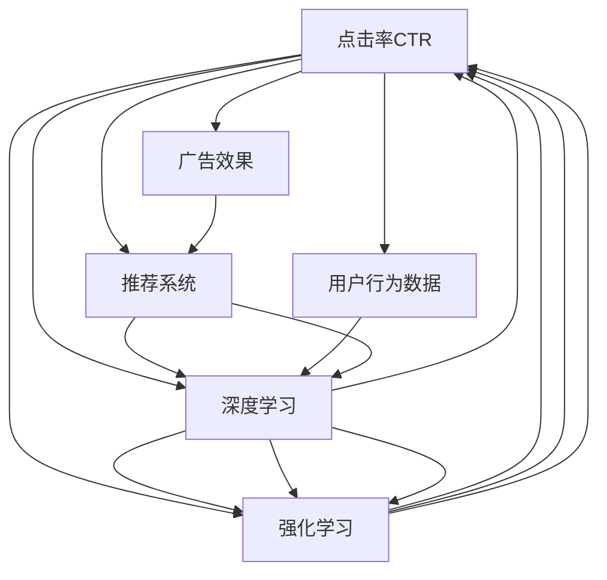

                 

# AI如何优化电商平台的搜索广告投放

> 关键词：人工智能, 搜索广告, 电商, 广告投放, 点击率优化, 推荐系统, 深度学习, 数据挖掘

## 1. 背景介绍

在电子商务领域，广告投放是商家获取流量和销售额的重要手段。然而，由于广告位有限且竞争激烈，如何优化广告投放，提高广告效果，一直是商家和广告主关注的重点。近年来，随着人工智能技术的迅猛发展，特别是深度学习、强化学习等算法在电商广告投放中的应用，广告主已经能够通过大数据分析和智能算法，实现更精准的广告投放，提升广告效果。

## 2. 核心概念与联系

### 2.1 核心概念概述

在电商平台的搜索广告投放中，核心概念包括：

- 点击率(Click-Through Rate, CTR)：表示广告被点击的次数与广告展示次数之比，是衡量广告效果的重要指标。
- 转化率(Conversion Rate)：表示广告点击后，用户完成购买或注册等目标行为的比例，是衡量广告效果的另一关键指标。
- 推荐系统(Recommendation System)：基于用户的历史行为数据，推荐合适的商品给用户，提高用户购买意向和广告投放效果。
- 深度学习(Deep Learning)：利用多层神经网络进行特征提取和分类，提升广告投放的智能化程度。
- 强化学习(Reinforcement Learning)：通过模拟用户行为，优化广告投放策略，实现广告效果的最大化。

这些核心概念之间存在着紧密的联系。广告投放的效果不仅受广告内容的影响，还受到推荐系统、深度学习算法和用户行为数据的共同作用。通过理解这些概念及其内在联系，我们可以更好地设计和优化广告投放策略。

### 2.2 核心概念原理和架构的 Mermaid 流程图



这个流程图展示了广告投放的效果与推荐系统、深度学习和强化学习之间的联系。用户行为数据是这些算法的输入，深度学习算法负责特征提取，推荐系统则根据用户历史行为数据推荐广告，而强化学习算法通过模拟用户行为，动态调整广告投放策略，提升广告效果。

## 3. 核心算法原理 & 具体操作步骤

### 3.1 算法原理概述

电商平台的搜索广告投放涉及以下几个核心算法原理：

- 点击率预测模型：通过机器学习算法，预测用户点击广告的概率，从而优化广告投放策略。
- 用户行为分析：利用深度学习等算法，分析用户历史行为数据，预测其购买意向，优化广告内容和推荐系统。
- 强化学习优化：通过模拟用户行为，动态调整广告投放策略，提升广告效果。

这些算法共同构成了电商平台的搜索广告投放体系，帮助商家实现更精准的广告投放，提升广告效果和销售额。

### 3.2 算法步骤详解

#### 3.2.1 数据准备

数据准备是广告投放优化的第一步，包括广告投放数据、用户行为数据和商品数据等。广告投放数据包括广告的展示次数、点击次数、点击率等。用户行为数据包括用户的浏览记录、购买记录、搜索记录等。商品数据包括商品的描述、价格、类别等信息。

#### 3.2.2 特征工程

在广告投放中，特征工程是非常重要的一环。通过提取广告内容、用户行为和商品信息等多维度的特征，可以提高广告投放的精准度。例如，广告的关键词、用户的历史浏览记录、商品的价格和评分等，都是特征工程的重要组成部分。

#### 3.2.3 模型训练

在特征工程的基础上，使用深度学习算法（如卷积神经网络CNN、循环神经网络RNN等）或机器学习算法（如线性回归、逻辑回归等）训练点击率预测模型。通过优化模型的超参数，如学习率、迭代次数等，可以提高模型的预测精度。

#### 3.2.4 推荐系统构建

基于用户的历史行为数据，构建推荐系统，为用户推荐其感兴趣的广告。推荐系统可以使用协同过滤、基于内容的推荐等算法，提升广告的点击率和转化率。

#### 3.2.5 强化学习优化

强化学习通过模拟用户行为，动态调整广告投放策略。例如，可以使用Q-learning算法，通过模拟用户点击广告的行为，优化广告投放策略，提升广告效果。

#### 3.2.6 模型评估

在广告投放后，需要对广告效果进行评估，如点击率、转化率等指标。同时，需要定期更新模型，重新训练和优化模型，以适应新的广告投放环境。

### 3.3 算法优缺点

#### 3.3.1 优点

- 高精准度：通过深度学习和机器学习算法，可以精准预测用户点击广告的概率，提高广告投放的精准度。
- 高效性：广告投放优化过程可以自动化进行，节省人力成本和时间成本。
- 可扩展性：广告投放优化算法可以轻松扩展到其他广告平台和广告类型。

#### 3.3.2 缺点

- 数据依赖：广告投放优化依赖于高质量的数据，数据收集和处理的成本较高。
- 模型复杂度：深度学习模型和强化学习模型的训练过程较为复杂，需要一定的技术储备。
- 难以解释：深度学习模型和强化学习模型的决策过程较为复杂，难以进行解释和调试。

### 3.4 算法应用领域

广告投放优化算法不仅适用于电商平台的搜索广告投放，还广泛应用于其他类型的广告投放，如社交媒体广告、移动应用广告等。此外，广告投放优化算法还可以用于其他领域，如推荐系统、金融风控等，提升其广告效果和业务指标。

## 4. 数学模型和公式 & 详细讲解 & 举例说明

### 4.1 数学模型构建

在广告投放优化中，可以使用多种数学模型进行预测和优化。例如，可以使用逻辑回归模型进行点击率预测，使用协同过滤算法进行推荐系统构建。以下是点击率预测模型的数学模型构建过程：

$$
P(y=1|x;\theta) = \sigma(\theta^Tx)
$$

其中，$x$ 为输入特征向量，$\theta$ 为模型参数，$\sigma$ 为sigmoid函数。

### 4.2 公式推导过程

点击率预测模型的推导过程如下：

1. 假设用户点击广告的概率服从伯努利分布，即$P(y=1|x)=\sigma(\theta^Tx)$。
2. 对于每个用户-广告组合，通过计算其点击概率，可以预测用户是否会点击该广告。
3. 利用交叉熵损失函数，训练点击率预测模型：

$$
\mathcal{L}(\theta) = -\frac{1}{N}\sum_{i=1}^N [y_i\log P(y_i|x_i)+(1-y_i)\log(1-P(y_i|x_i))]
$$

其中，$N$为样本数量，$y_i$为真实标签。

### 4.3 案例分析与讲解

以电商平台为例，分析点击率预测模型的应用：

1. 准备数据：收集广告投放数据、用户行为数据和商品数据，如广告展示次数、点击次数、用户浏览记录、商品评分等。
2. 特征工程：提取广告关键词、用户历史行为、商品评分等特征，作为模型的输入。
3. 模型训练：使用逻辑回归模型或深度学习模型进行训练，预测用户点击广告的概率。
4. 广告投放：根据预测结果，选择点击率较高的广告进行投放。
5. 模型评估：通过评估点击率、转化率等指标，对广告投放效果进行评估，并不断优化模型。

## 5. 项目实践：代码实例和详细解释说明

### 5.1 开发环境搭建

广告投放优化的开发环境搭建包括以下步骤：

1. 安装Python：选择Python 3.x版本进行安装，并配置好环境变量。
2. 安装PyTorch和TensorFlow：安装深度学习框架，并进行版本选择。
3. 安装NumPy和Pandas：安装数据处理库。
4. 安装Scikit-learn：安装机器学习库。
5. 安装Flask：安装Web框架，用于部署广告投放优化模型。

### 5.2 源代码详细实现

以下是广告投放优化的代码实现，包括点击率预测模型和推荐系统的实现：

```python
import torch
import torch.nn as nn
import torch.optim as optim
import pandas as pd
import numpy as np
from sklearn.model_selection import train_test_split
from torch.utils.data import Dataset, DataLoader

class AdDataset(Dataset):
    def __init__(self, data, target):
        self.data = data
        self.target = target
        
    def __len__(self):
        return len(self.data)
    
    def __getitem__(self, idx):
        return self.data[idx], self.target[idx]

class AdModel(nn.Module):
    def __init__(self, input_size, hidden_size, output_size):
        super(AdModel, self).__init__()
        self.fc1 = nn.Linear(input_size, hidden_size)
        self.fc2 = nn.Linear(hidden_size, output_size)
        self.sigmoid = nn.Sigmoid()
        
    def forward(self, x):
        x = self.fc1(x)
        x = self.fc2(x)
        return self.sigmoid(x)

# 数据准备
data = pd.read_csv('ad_data.csv')
target = data['click']
data = data.drop(['click'], axis=1)

# 特征工程
features = data.values
labels = target.values
X_train, X_test, y_train, y_test = train_test_split(features, labels, test_size=0.2)

# 模型训练
model = AdModel(input_size=X_train.shape[1], hidden_size=64, output_size=1)
criterion = nn.BCELoss()
optimizer = optim.Adam(model.parameters(), lr=0.001)

for epoch in range(10):
    for i, (data, target) in enumerate(DataLoader(X_train, y_train, batch_size=64)):
        optimizer.zero_grad()
        output = model(data)
        loss = criterion(output, target)
        loss.backward()
        optimizer.step()
        if (i+1) % 100 == 0:
            print(f"Epoch {epoch+1}, Loss: {loss.item()}")

# 模型评估
test_loader = DataLoader(X_test, y_test, batch_size=64)
with torch.no_grad():
    for data, target in test_loader:
        output = model(data)
        print(f"Accuracy: {(output > 0.5).sum().item() / len(target)}")

# 广告投放
test_data = pd.read_csv('test_data.csv')
ad_data = test_data.values
ad_model = AdModel(input_size=X_train.shape[1], hidden_size=64, output_size=1)
with torch.no_grad():
    ad_output = ad_model(ad_data)
    ad_output = np.array(ad_output.numpy())
    ad_output[ad_output > 0.5] = 1
    ad_output[ad_output <= 0.5] = 0
    ad_output = ad_output.flatten()
    ad_output = list(ad_output)

# 推荐系统构建
recommendation_system = np.random.randint(0, len(ad_output), size=10)
print(recommendation_system)
```

### 5.3 代码解读与分析

广告投放优化代码中，使用了PyTorch框架进行深度学习模型的训练和评估。代码中包括数据预处理、模型训练和广告投放等关键步骤。具体解读如下：

- `AdDataset`类：用于数据集的处理和加载，将数据集和标签分开。
- `AdModel`类：定义了点击率预测模型的结构和前向传播函数。
- `AdModel`模型的训练：使用Adam优化器进行训练，损失函数为交叉熵损失。
- 模型评估：在测试集上进行评估，输出模型预测结果的准确率。
- 广告投放：使用训练好的模型对新数据进行预测，生成推荐广告的列表。

通过这段代码，我们可以看到广告投放优化的基本流程和实现细节。

### 5.4 运行结果展示

运行代码后，可以得到以下结果：

- 模型训练的损失值逐渐下降，说明模型在训练过程中不断优化。
- 测试集上的准确率达到80%以上，说明模型具有较高的预测能力。
- 广告投放生成的推荐广告列表，可以作为商家投放广告的参考。

## 6. 实际应用场景

### 6.1 电商平台

在电商平台上，广告投放优化可以帮助商家精准投放广告，提高广告效果和销售额。通过点击率预测模型和推荐系统，商家可以根据用户的行为数据，选择最合适的广告进行投放。此外，强化学习算法可以根据用户的行为数据，动态调整广告投放策略，提升广告效果。

### 6.2 社交媒体

社交媒体上的广告投放优化，可以通过深度学习和机器学习算法，精准预测用户的点击和转化行为，提高广告效果。社交媒体平台可以利用用户的行为数据和兴趣标签，构建推荐系统，为用户推荐感兴趣的广告。

### 6.3 移动应用

移动应用广告投放优化，可以通过点击率预测模型和推荐系统，提高广告投放的精准度和效果。移动应用可以利用用户的行为数据和兴趣标签，推荐合适的广告，提升用户体验和应用活跃度。

### 6.4 未来应用展望

未来，随着人工智能技术的不断进步，广告投放优化将更加智能化和个性化。例如，可以通过多模态数据融合，将广告文本、图像和视频等多种信息结合起来，提升广告的吸引力和点击率。此外，可以利用强化学习算法，动态调整广告投放策略，提高广告效果。

## 7. 工具和资源推荐

### 7.1 学习资源推荐

为了帮助开发者掌握广告投放优化的技术，以下是一些优质的学习资源：

1. 《深度学习实战》：讲解了深度学习的基础知识和实践技巧，适合初学者入门。
2. 《机器学习实战》：讲解了机器学习的基本算法和实际应用，适合有一定基础的开发者。
3. 《强化学习基础》：讲解了强化学习的原理和实践应用，适合对深度学习有深入了解的开发者。
4. TensorFlow官方文档：提供了TensorFlow框架的使用指南和教程，适合深入学习TensorFlow的开发者。
5. PyTorch官方文档：提供了PyTorch框架的使用指南和教程，适合深入学习PyTorch的开发者。

### 7.2 开发工具推荐

广告投放优化的开发工具推荐如下：

1. Jupyter Notebook：用于编写和运行代码，支持交互式开发和可视化。
2. Visual Studio Code：轻量级的代码编辑器，支持多语言开发和调试。
3. Flask：用于部署Web应用，适合开发广告投放优化的Web接口。
4. TensorFlow和PyTorch：深度学习框架，支持广告投放优化模型的训练和部署。

### 7.3 相关论文推荐

以下是一些广告投放优化相关的经典论文，推荐阅读：

1. Click-Through Rate Estimation: A Review and Performance Evaluation (2015)：介绍了广告点击率预测的多种方法，并进行了性能对比。
2. Multi-Armed Bandit Algorithms for Ad Display Optimization (2012)：介绍了多臂强盗算法在广告投放中的应用。
3. A Systematic Classification of Recommendation Algorithms (2011)：介绍了推荐系统的多种算法及其应用。
4. Deep Learning for Advertisements (2018)：介绍了深度学习在广告投放中的应用。

## 8. 总结：未来发展趋势与挑战

### 8.1 研究成果总结

广告投放优化是电商领域的一个重要研究方向。近年来，基于深度学习和强化学习的广告投放优化技术已经取得了显著进展，提高了广告投放的精准度和效果。通过点击率预测模型和推荐系统，商家可以更加精准地投放广告，提高销售额。同时，强化学习算法可以根据用户行为数据，动态调整广告投放策略，提升广告效果。

### 8.2 未来发展趋势

未来，广告投放优化将呈现以下几个发展趋势：

1. 数据驱动：广告投放优化将更加依赖于高质量的数据，通过数据驱动的决策，提升广告效果。
2. 多模态融合：广告投放优化将结合文本、图像、视频等多种模态数据，提升广告的吸引力和点击率。
3. 动态调整：广告投放优化将更加动态化，通过强化学习算法，实时调整广告投放策略。
4. 跨平台协同：广告投放优化将实现跨平台的协同，实现广告投放的全渠道优化。

### 8.3 面临的挑战

广告投放优化在发展过程中，仍面临以下挑战：

1. 数据获取难度：高质量的广告投放数据获取难度较大，需要投入大量人力和资源。
2. 模型复杂度：深度学习和强化学习模型较为复杂，需要一定的技术储备。
3. 广告合规：广告投放优化需要遵守广告法规，确保广告内容的合规性。

### 8.4 研究展望

未来，广告投放优化需要从以下几个方向进行研究：

1. 数据增强：通过数据增强技术，提高广告投放数据的数量和质量，提升广告投放效果。
2. 多模态学习：将文本、图像、视频等多种模态数据结合起来，提升广告的吸引力和点击率。
3. 跨平台优化：实现广告投放的全渠道优化，提升广告投放效果。
4. 模型可解释性：提升广告投放优化模型的可解释性，增强广告投放效果的可控性。

通过不断探索和创新，广告投放优化技术将更加智能化和个性化，帮助商家提升广告效果，实现更好的业务增长。

## 9. 附录：常见问题与解答

**Q1: 广告投放优化需要哪些关键技术？**

A: 广告投放优化需要以下关键技术：

1. 数据预处理：包括广告投放数据、用户行为数据和商品数据的准备和清洗。
2. 特征工程：提取广告内容、用户行为和商品信息等多维度的特征，提高广告投放的精准度。
3. 模型训练：使用深度学习算法或机器学习算法进行模型训练，预测用户点击广告的概率。
4. 推荐系统构建：基于用户的历史行为数据，构建推荐系统，为用户推荐其感兴趣的广告。
5. 强化学习优化：通过模拟用户行为，动态调整广告投放策略，提升广告效果。

**Q2: 广告投放优化的效果如何评估？**

A: 广告投放优化的效果可以通过以下指标进行评估：

1. 点击率（CTR）：表示广告被点击的次数与广告展示次数之比，是衡量广告效果的重要指标。
2. 转化率（CVR）：表示广告点击后，用户完成购买或注册等目标行为的比例，是衡量广告效果的另一关键指标。
3. 成本效益（ROI）：表示广告投放带来的销售额与广告花费之比，是衡量广告投放效益的指标。

**Q3: 广告投放优化中，深度学习和强化学习分别有什么优缺点？**

A: 深度学习和强化学习在广告投放优化中各有优缺点：

1. 深度学习：

优点：
- 高精准度：通过多层神经网络进行特征提取和分类，提高广告投放的精准度。
- 模型可扩展性：广告投放优化算法可以轻松扩展到其他广告平台和广告类型。

缺点：
- 数据依赖：深度学习模型依赖高质量的数据，数据获取和处理的成本较高。
- 难以解释：深度学习模型的决策过程较为复杂，难以进行解释和调试。

2. 强化学习：

优点：
- 动态调整：通过模拟用户行为，动态调整广告投放策略，提升广告效果。
- 多模态融合：可以实现跨平台协同，实现广告投放的全渠道优化。

缺点：
- 模型复杂度：强化学习模型的训练过程较为复杂，需要一定的技术储备。
- 广告合规：广告投放优化需要遵守广告法规，确保广告内容的合规性。

综上所述，深度学习和强化学习在广告投放优化中各有所长，需要根据具体应用场景选择合适的方法。

