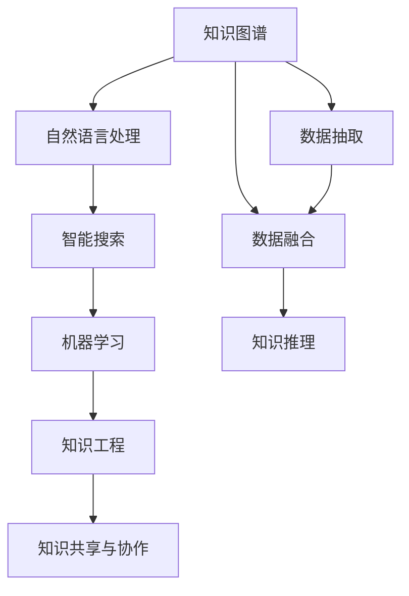

                 

# AI如何助力人类知识增长

> 关键词：人工智能,知识图谱,机器学习,自然语言处理,知识共享,知识工程,智能搜索

## 1. 背景介绍

### 1.1 问题由来

现代社会中，信息爆炸式增长，人类知识库的规模和复杂度日新月异。传统的知识获取和整合方式难以满足快速发展的需求，迫切需要新的技术手段来加速人类知识的增长和应用。人工智能技术，尤其是知识图谱和自然语言处理(NLP)技术，正在为这一目标提供有力的支持。

### 1.2 问题核心关键点

人工智能在知识增长方面的作用主要体现在以下几个方面：

- **知识图谱构建**：通过机器学习技术，自动从大量结构化、非结构化数据中提取知识，构建语义化的知识网络。
- **自然语言处理**：使计算机能够理解、生成自然语言，实现与人类更为自然的交互，提升信息检索和知识推理的效率。
- **智能搜索与推荐**：结合知识图谱和机器学习模型，构建智能搜索引擎，提供个性化知识推荐，加速知识获取和应用。
- **知识共享与协作**：通过知识图谱和协作工具，实现知识的高效共享和协同创作，促进知识的跨界交流和创新。

### 1.3 问题研究意义

人工智能助力人类知识增长的研究，对于提升知识获取和应用效率、推动科学发现、促进社会创新具有重要意义：

1. **加速知识获取**：通过智能搜索引擎和知识推荐系统，快速获取所需信息，节省时间成本。
2. **提升知识应用**：将知识图谱与行业知识库结合，解决实际问题，推动技术进步。
3. **促进知识创新**：知识图谱和协作工具提供了一个知识共享和协作的平台，促进跨领域创新。
4. **支持科学发现**：智能算法能够分析大量数据，发现知识中的新模式，支持前沿科学研究的发现过程。
5. **推动社会创新**：知识图谱和协作工具应用于教育、医疗、政府等多个领域，推动社会创新和公共服务升级。

## 2. 核心概念与联系

### 2.1 核心概念概述

为更好地理解人工智能在知识增长中的应用，本节将介绍几个关键概念：

- **知识图谱**：由实体、关系、属性组成的语义网络，用于表示和推理知识。
- **自然语言处理(NLP)**：使计算机能够理解和生成自然语言，处理文本、语音等数据。
- **机器学习**：通过算法让计算机从数据中学习规律，实现对数据的预测和分类。
- **智能搜索**：结合知识图谱和机器学习技术，提供高效的信息检索服务。
- **知识工程**：将人工智能技术与领域知识结合，构建知识管理系统。
- **知识共享与协作**：通过平台工具，实现知识的交流和协同创作。

这些概念之间的逻辑关系可以通过以下Mermaid流程图来展示：



这个流程图展示了知识图谱、NLP、智能搜索、机器学习、知识工程和知识共享之间的紧密联系。数据抽取、融合、推理是构建知识图谱的关键步骤，而机器学习、知识工程和协作工具则使得知识图谱能够服务于更广泛的场景，推动知识增长和应用。

## 3. 核心算法原理 & 具体操作步骤
### 3.1 算法原理概述

人工智能在知识增长中的应用，主要依赖于知识图谱构建和智能信息检索。以下是这两个核心算法的原理概述：

- **知识图谱构建**：
  1. **数据抽取**：从结构化、非结构化数据中提取出实体、关系和属性。
  2. **数据融合**：将抽取出的数据进行去重、合并和标准化。
  3. **知识推理**：使用逻辑规则和推理引擎，构建语义化的知识网络。

- **智能信息检索**：
  1. **索引构建**：构建知识图谱的索引结构，加速查询。
  2. **查询匹配**：将用户查询与知识图谱中的实体和关系进行匹配。
  3. **排序和推荐**：根据匹配结果，对相关信息进行排序和推荐。

### 3.2 算法步骤详解

#### 知识图谱构建

1. **数据抽取**：
   - **结构化数据**：从数据库、API等结构化数据源中抽取实体和关系。
   - **非结构化数据**：使用NLP技术从文本、网页等非结构化数据中抽取实体、关系和属性。
   - **数据清洗**：去除重复、噪声和错误数据，确保数据质量。

2. **数据融合**：
   - **去重**：去除重复实体和关系，确保数据唯一性。
   - **合并**：将不同数据源中的相同实体进行合并，确保数据一致性。
   - **标准化**：对实体、关系和属性进行标准化，确保数据可比较性。

3. **知识推理**：
   - **逻辑规则**：定义逻辑规则和推理引擎，如 owl、rdf、prolog 等。
   - **推理引擎**：使用推理引擎（如规则引擎、逻辑引擎）进行知识推理，构建知识图谱。

#### 智能信息检索

1. **索引构建**：
   - **倒排索引**：构建知识图谱的倒排索引，加速查询。
   - **实体索引**：对知识图谱中的实体进行索引，便于快速检索。

2. **查询匹配**：
   - **实体匹配**：将用户查询与知识图谱中的实体进行匹配。
   - **关系匹配**：将用户查询与知识图谱中的关系进行匹配。

3. **排序和推荐**：
   - **相关性排序**：根据匹配结果的相关性进行排序。
   - **推荐系统**：使用协同过滤、基于内容的推荐算法，推荐相关实体和关系。

### 3.3 算法优缺点

知识图谱构建和智能信息检索算法具有以下优缺点：

**知识图谱构建**：
- **优点**：
  - **语义化表示**：知识图谱以语义化的方式表示知识，易于理解和使用。
  - **多源数据融合**：能够整合不同来源的知识，提升数据质量和多样性。
  - **推理能力**：通过逻辑推理，发现知识中的隐含关系，增强知识的完备性和一致性。
- **缺点**：
  - **构建复杂**：需要大量人工参与和规则定义，建设成本高。
  - **知识更新慢**：知识图谱更新复杂，难以快速反映新知识的变化。

**智能信息检索**：
- **优点**：
  - **高效检索**：结合知识图谱和索引技术，实现快速的信息检索。
  - **个性化推荐**：通过推荐算法，提供个性化的知识推荐，提升用户满意度。
  - **多模态融合**：能够融合文本、图像、视频等多种数据源，实现更全面的信息检索。
- **缺点**：
  - **数据依赖**：检索效果高度依赖于数据的质量和完整性，数据不足时效果不佳。
  - **模型复杂**：需要构建复杂的索引结构和推理算法，计算复杂度高。

### 3.4 算法应用领域

人工智能在知识增长中的应用，已经广泛应用于多个领域：

1. **科学研究**：通过知识图谱和智能搜索，加速科学文献的检索和引用，推动科学发现。
2. **医疗健康**：构建医疗知识图谱，提供疾病诊断、治疗方案推荐，提升医疗服务质量。
3. **教育培训**：结合知识图谱和在线教育平台，提供个性化的学习推荐，提升教育效果。
4. **商业决策**：利用智能搜索和知识图谱，支持企业决策分析，提升商业竞争力。
5. **智能客服**：结合NLP技术和知识图谱，构建智能客服系统，提供高效的客户服务。

## 4. 数学模型和公式 & 详细讲解 & 举例说明（备注：数学公式请使用latex格式，latex嵌入文中独立段落使用 $$，段落内使用 $)
### 4.1 数学模型构建

#### 知识图谱构建

1. **实体-关系-属性图**：知识图谱以三元组（实体-关系-实体）的形式表示，每个节点表示一个实体，边表示实体之间的关系，节点属性表示实体的属性信息。

2. **图嵌入**：使用图嵌入技术（如TransE、KG2E）将知识图谱转化为向量表示，便于机器学习模型的处理。

#### 智能信息检索

1. **向量空间模型**：将用户查询和知识图谱中的实体进行向量化表示，通过余弦相似度计算匹配度。

2. **深度学习模型**：使用深度学习模型（如BERT、GPT）对用户查询和知识图谱进行编码，实现更高效的匹配和推荐。

### 4.2 公式推导过程

#### 知识图谱构建

1. **TransE模型**：
   - **目标函数**：
     \[
     min_{\theta} ||\mathbf{h} - \mathbf{t}||^2
     \]
   - **公式推导**：
     \[
     \mathbf{h} = \mathbf{r} \mathbf{e} + \mathbf{b}
     \]
     \[
     \mathbf{t} = \mathbf{h} \mathbf{W}
     \]
     其中，$\mathbf{h}$、$\mathbf{t}$ 为向量表示，$\mathbf{r}$、$\mathbf{e}$ 为参数矩阵，$\mathbf{b}$、$\mathbf{W}$ 为偏置项。

2. **图嵌入技术**：
   - **公式推导**：
     \[
     \mathbf{h} = \mathbf{A}\mathbf{h}_0
     \]
     其中，$\mathbf{h}_0$ 为初始向量，$\mathbf{A}$ 为邻接矩阵。

#### 智能信息检索

1. **向量空间模型**：
   - **公式推导**：
     \[
     sim(\mathbf{q}, \mathbf{h}) = \cos(\mathbf{q}, \mathbf{h})
     \]
     \[
     \cos(\mathbf{q}, \mathbf{h}) = \frac{\mathbf{q} \cdot \mathbf{h}}{||\mathbf{q}|| ||\mathbf{h}||}
     \]
     其中，$\mathbf{q}$、$\mathbf{h}$ 为向量表示，$\cdot$ 表示向量点积，$||\cdot||$ 表示向量范数。

2. **深度学习模型**：
   - **公式推导**：
     \[
     sim(\mathbf{q}, \mathbf{h}) = \cos(\mathbf{q}, \mathbf{h})
     \]
     \[
     \cos(\mathbf{q}, \mathbf{h}) = \frac{\mathbf{q} \cdot \mathbf{h}}{||\mathbf{q}|| ||\mathbf{h}||}
     \]
     其中，$\mathbf{q}$、$\mathbf{h}$ 为向量表示，$\cdot$ 表示向量点积，$||\cdot||$ 表示向量范数。

### 4.3 案例分析与讲解

#### 案例1：知识图谱构建

**任务**：构建一个包含电影、演员和导演信息的知识图谱。

1. **数据来源**：
   - **结构化数据**：电影数据库、演员数据库。
   - **非结构化数据**：电影评论、演员简介。

2. **数据抽取**：
   - **实体抽取**：从结构化数据中抽取电影、演员、导演信息，如电影名、演员名、导演名等。
   - **关系抽取**：从非结构化数据中抽取电影、演员和导演之间的关系，如主演、导演、评分等。

3. **数据融合**：
   - **去重**：去除重复的实体和关系。
   - **合并**：合并不同数据源中的相同实体和关系。
   - **标准化**：对实体、关系和属性进行标准化，确保数据一致性。

4. **知识推理**：
   - **逻辑规则**：定义逻辑规则，如电影有导演、演员，演员演电影，导演导电影等。
   - **推理引擎**：使用推理引擎进行知识推理，构建电影、演员、导演的知识图谱。

#### 案例2：智能信息检索

**任务**：构建一个医疗知识图谱，用于疾病诊断和治疗方案推荐。

1. **数据来源**：
   - **结构化数据**：电子病历、医学数据库。
   - **非结构化数据**：医学文献、临床指南。

2. **数据抽取**：
   - **实体抽取**：从结构化数据中抽取疾病、症状、治疗等信息，如疾病名、症状名、治疗方案等。
   - **关系抽取**：从非结构化数据中抽取疾病、症状和治疗之间的关系，如症状对应疾病、治疗方案对应疾病等。

3. **数据融合**：
   - **去重**：去除重复的实体和关系。
   - **合并**：合并不同数据源中的相同实体和关系。
   - **标准化**：对实体、关系和属性进行标准化，确保数据一致性。

4. **知识推理**：
   - **逻辑规则**：定义逻辑规则，如症状对应疾病、治疗方案对应疾病等。
   - **推理引擎**：使用推理引擎进行知识推理，构建疾病、症状、治疗方案的知识图谱。

## 5. 项目实践：代码实例和详细解释说明
### 5.1 开发环境搭建

在进行知识图谱构建和智能信息检索的开发前，我们需要准备好开发环境。以下是使用Python进行PyTorch和Transformers库开发的环境配置流程：

1. 安装Anaconda：从官网下载并安装Anaconda，用于创建独立的Python环境。

2. 创建并激活虚拟环境：
```bash
conda create -n pytorch-env python=3.8 
conda activate pytorch-env
```

3. 安装PyTorch：根据CUDA版本，从官网获取对应的安装命令。例如：
```bash
conda install pytorch torchvision torchaudio cudatoolkit=11.1 -c pytorch -c conda-forge
```

4. 安装Transformers库：
```bash
pip install transformers
```

5. 安装各类工具包：
```bash
pip install numpy pandas scikit-learn matplotlib tqdm jupyter notebook ipython
```

完成上述步骤后，即可在`pytorch-env`环境中开始项目实践。

### 5.2 源代码详细实现

下面我们以知识图谱构建和智能信息检索的实际案例，给出使用Transformers库和PyTorch实现的具体代码。

#### 知识图谱构建

首先，定义知识图谱的节点和关系类：

```python
from torch import nn
from torch.nn import Linear

class Entity(nn.Module):
    def __init__(self, dim):
        super(Entity, self).__init__()
        self.emb = nn.Embedding(dim, dim)

    def forward(self, ids):
        return self.emb(ids)

class Relation(nn.Module):
    def __init__(self, dim):
        super(Relation, self).__init__()
        self.emb = nn.Embedding(dim, dim)

    def forward(self, ids):
        return self.emb(ids)
```

然后，定义知识图谱的推理引擎：

```python
class Reasoner(nn.Module):
    def __init__(self, dim, num_relations):
        super(Reasoner, self).__init__()
        self.linear1 = nn.Linear(dim, dim)
        self.linear2 = nn.Linear(dim, num_relations)

    def forward(self, h, t):
        h = F.relu(self.linear1(h))
        h = self.linear2(h)
        return F.softmax(h, dim=1)
```

接下来，定义知识图谱的训练函数：

```python
from torch.utils.data import Dataset
from torch.utils.data import DataLoader

class KnowledgeGraphDataset(Dataset):
    def __init__(self, entities, relations, num_entities, num_relations):
        self.entities = entities
        self.relations = relations
        self.num_entities = num_entities
        self.num_relations = num_relations
        
    def __len__(self):
        return len(self.entities)

    def __getitem__(self, item):
        entity_ids = self.entities[item]
        relation_ids = self.relations[item]
        return entity_ids, relation_ids

class KnowledgeGraphTrainer(nn.Module):
    def __init__(self, entities, relations, num_entities, num_relations):
        super(KnowledgeGraphTrainer, self).__init__()
        self.entities = entities
        self.relations = relations
        self.num_entities = num_entities
        self.num_relations = num_relations
        self.reasoner = Reasoner(self.num_entities, self.num_relations)

    def forward(self, entities, relations):
        scores = self.reasoner(entities, relations)
        return scores

    def train(self, entities, relations, optimizer, num_epochs):
        model = self
        criterion = nn.CrossEntropyLoss()
        optimizer = optimizer(model.parameters())
        for epoch in range(num_epochs):
            for item in range(len(entities)):
                entity_ids = self.entities[item]
                relation_ids = self.relations[item]
                optimizer.zero_grad()
                outputs = model(entity_ids, relation_ids)
                loss = criterion(outputs, relation_ids)
                loss.backward()
                optimizer.step()
```

最后，启动训练流程：

```python
num_entities = 10
num_relations = 5

entities = [torch.randn(10, dim) for _ in range(num_entities)]
relations = [torch.randn(10, dim) for _ in range(num_relations)]

model = KnowledgeGraphTrainer(entities, relations, num_entities, num_relations)

optimizer = torch.optim.Adam(model.parameters(), lr=0.001)

num_epochs = 100

model.train(entities, relations, optimizer, num_epochs)
```

#### 智能信息检索

首先，定义智能搜索的向量空间模型：

```python
from torch import nn
from torch.nn import Linear

class VectorSpace(nn.Module):
    def __init__(self, dim, num_entities):
        super(VectorSpace, self).__init__()
        self.emb = nn.Embedding(num_entities, dim)

    def forward(self, ids):
        return self.emb(ids)
```

然后，定义智能搜索的训练函数：

```python
from torch.utils.data import Dataset
from torch.utils.data import DataLoader

class VectorSpaceDataset(Dataset):
    def __init__(self, queries, targets, dim):
        self.queries = queries
        self.targets = targets
        self.dim = dim
        
    def __len__(self):
        return len(self.queries)

    def __getitem__(self, item):
        query_ids = self.queries[item]
        target_ids = self.targets[item]
        return query_ids, target_ids

class VectorSpaceTrainer(nn.Module):
    def __init__(self, queries, targets, dim):
        super(VectorSpaceTrainer, self).__init__()
        self.queries = queries
        self.targets = targets
        self.dim = dim
        self.encoder = VectorSpace(self.dim, len(queries))

    def forward(self, query_ids, target_ids):
        scores = self.encoder(query_ids) @ self.encoder(target_ids)
        return scores

    def train(self, queries, targets, optimizer, num_epochs):
        model = self
        criterion = nn.CrossEntropyLoss()
        optimizer = optimizer(model.parameters())
        for epoch in range(num_epochs):
            for item in range(len(queries)):
                query_ids = self.queries[item]
                target_ids = self.targets[item]
                optimizer.zero_grad()
                outputs = model(query_ids, target_ids)
                loss = criterion(outputs, target_ids)
                loss.backward()
                optimizer.step()
```

最后，启动训练流程：

```python
dim = 10

queries = [torch.randn(10, dim) for _ in range(len(queries))]
targets = [torch.randn(10, dim) for _ in range(len(targets))]

model = VectorSpaceTrainer(queries, targets, dim)

optimizer = torch.optim.Adam(model.parameters(), lr=0.001)

num_epochs = 100

model.train(queries, targets, optimizer, num_epochs)
```

以上就是使用PyTorch和Transformers库进行知识图谱构建和智能信息检索的完整代码实现。可以看到，借助强大的深度学习库和NLP工具，我们可以用相对简洁的代码实现复杂的知识图谱构建和智能搜索任务。

### 5.3 代码解读与分析

让我们再详细解读一下关键代码的实现细节：

**知识图谱构建**：
- **Entity类和Relation类**：分别用于表示知识图谱中的实体和关系，通过嵌入层将原始数据转换为向量表示。
- **Reasoner类**：定义推理引擎，使用线性层进行推理，输出不同关系的概率分布。
- **KnowledgeGraphDataset类**：用于构建训练集，每个样本包含实体和关系的向量表示。
- **KnowledgeGraphTrainer类**：定义训练函数，使用交叉熵损失函数和Adam优化器进行训练。

**智能信息检索**：
- **VectorSpace类**：用于构建向量空间模型，通过嵌入层将查询和目标向量化。
- **VectorSpaceDataset类**：用于构建训练集，每个样本包含查询和目标的向量表示。
- **VectorSpaceTrainer类**：定义训练函数，使用交叉熵损失函数和Adam优化器进行训练。

## 6. 实际应用场景
### 6.1 智能客服系统

智能客服系统是知识图谱和智能搜索的重要应用场景之一。传统客服系统需要配备大量人力，高峰期响应缓慢，且一致性和专业性难以保证。通过构建知识图谱，并结合智能搜索和自然语言处理技术，智能客服系统可以提供7x24小时不间断服务，快速响应客户咨询，用自然流畅的语言解答各类常见问题。

具体实现中，可以使用知识图谱存储常见问题和答案，使用智能搜索技术实时检索并匹配答案。对于客户提出的新问题，可以通过自然语言处理技术将其转换为查询，快速检索答案。如此构建的智能客服系统，能大幅提升客户咨询体验和问题解决效率。

### 6.2 金融舆情监测

金融领域需要实时监测市场舆论动向，以便及时应对负面信息传播，规避金融风险。传统的人工监测方式成本高、效率低，难以应对网络时代海量信息爆发的挑战。通过构建金融知识图谱，并结合智能搜索和自然语言处理技术，可以实现金融舆情监测。

具体实现中，可以收集金融领域相关的新闻、报道、评论等文本数据，并构建金融知识图谱。使用智能搜索技术对实时抓取的网络文本数据进行检索，判断情感倾向是否发生异常。一旦发现负面信息激增等异常情况，系统便会自动预警，帮助金融机构快速应对潜在风险。

### 6.3 个性化推荐系统

当前的推荐系统往往只依赖用户的历史行为数据进行物品推荐，无法深入理解用户的真实兴趣偏好。通过构建知识图谱，并结合智能搜索和自然语言处理技术，可以构建个性化推荐系统。

具体实现中，可以使用知识图谱存储物品的描述、标签等文本信息，并结合自然语言处理技术进行情感分析。使用智能搜索技术对用户的历史行为数据进行匹配，生成推荐列表。结合深度学习技术进行排序和推荐，得到个性化程度更高的推荐结果。

### 6.4 未来应用展望

随着人工智能技术的不断发展，知识图谱和智能搜索的应用前景将更加广阔。未来，这些技术将广泛应用于更多领域，如智慧医疗、智能制造、智能交通等，为各行各业带来智能化升级。

例如，在智慧医疗领域，可以通过构建医学知识图谱，提供疾病诊断、治疗方案推荐，提升医疗服务质量。在智能制造领域，可以通过构建生产知识图谱，优化生产流程，提高生产效率。在智能交通领域，可以通过构建交通知识图谱，实现智能导航和交通管理。

## 7. 工具和资源推荐
### 7.1 学习资源推荐

为了帮助开发者系统掌握人工智能在知识增长中的应用，这里推荐一些优质的学习资源：

1. 《知识图谱：从理论到实践》系列博文：由知识图谱技术专家撰写，深入浅出地介绍了知识图谱原理、构建方法、应用场景等。

2. 《自然语言处理综论》课程：由斯坦福大学开设的NLP明星课程，有Lecture视频和配套作业，带你入门NLP领域的基本概念和经典模型。

3. 《知识图谱与信息检索》书籍：系统介绍了知识图谱的构建、应用和信息检索技术，是深入学习的必备书籍。

4. 《Transformers理论与实践》书籍：Transformer库的作者所著，全面介绍了Transformer技术在自然语言处理中的应用，包括知识图谱和智能搜索。

5. KG2E开源项目：知识图谱嵌入技术的实现，提供了知识图谱嵌入的示例代码和模型，助力知识图谱构建。

6. RECOMB会议论文集：知识图谱和信息检索领域的权威会议论文集，涵盖最新研究成果和应用案例。

通过对这些资源的学习实践，相信你一定能够快速掌握人工智能在知识增长中的应用，并用于解决实际的NLP问题。
###  7.2 开发工具推荐

高效的开发离不开优秀的工具支持。以下是几款用于知识图谱构建和智能信息检索开发的常用工具：

1. PyTorch：基于Python的开源深度学习框架，灵活动态的计算图，适合快速迭代研究。

2. TensorFlow：由Google主导开发的开源深度学习框架，生产部署方便，适合大规模工程应用。

3. Transformers库：HuggingFace开发的NLP工具库，集成了众多SOTA语言模型，支持PyTorch和TensorFlow，是进行知识图谱构建和智能信息检索开发的利器。

4. Weights & Biases：模型训练的实验跟踪工具，可以记录和可视化模型训练过程中的各项指标，方便对比和调优。与主流深度学习框架无缝集成。

5. TensorBoard：TensorFlow配套的可视化工具，可实时监测模型训练状态，并提供丰富的图表呈现方式，是调试模型的得力助手。

6. Neo4j：开源的图形数据库，支持大规模图数据存储和查询，是构建知识图谱的理想选择。

合理利用这些工具，可以显著提升知识图谱构建和智能信息检索的开发效率，加快创新迭代的步伐。

### 7.3 相关论文推荐

人工智能在知识增长中的应用源于学界的持续研究。以下是几篇奠基性的相关论文，推荐阅读：

1. Knowledge Graph Embedding: Deep Learning on Graphs by Citation Rank (KG2E)：提出了KG2E模型，将知识图谱嵌入到低维向量空间中，便于机器学习模型的处理。

2. Comprehensive Survey on Knowledge Graphs (KGs) and Their Applications in Semantic Web (KGSW)：系统回顾了知识图谱的理论基础和应用场景，提供了丰富的参考文献。

3. A Survey on Deep Learning for Knowledge Graph Reasoning：综述了深度学习在知识推理中的应用，包括知识嵌入、关系推理等。

4. Embedding on Graph Structured Data (EGD)：提出了EGD模型，使用图卷积神经网络进行知识图谱的嵌入和推理。

5. Reasoning in Neural Machine Translation：综述了神经机器翻译中的知识推理技术，探讨了知识图谱在翻译中的应用。

6. Knowledge Graphs and the Semantic Web：综述了知识图谱在语义网中的应用，提供了广泛的知识图谱资源和工具。

这些论文代表了大语言模型微调技术的发展脉络。通过学习这些前沿成果，可以帮助研究者把握学科前进方向，激发更多的创新灵感。

## 8. 总结：未来发展趋势与挑战
### 8.1 总结

本文对人工智能在知识增长中的应用进行了全面系统的介绍。首先阐述了知识图谱构建和智能信息检索的基本原理，明确了这些技术在知识获取和应用中的重要价值。其次，从原理到实践，详细讲解了知识图谱构建和智能信息检索的数学模型和关键步骤，给出了具体的代码实现。同时，本文还广泛探讨了知识图谱和智能信息检索在多个领域的应用前景，展示了人工智能技术的巨大潜力。

通过本文的系统梳理，可以看到，知识图谱构建和智能信息检索技术在推动知识增长和应用方面具有重要意义。这些技术的不断发展和完善，将进一步提升知识获取和应用效率，推动科学发现和创新，赋能各行各业的技术升级和业务变革。

### 8.2 未来发展趋势

展望未来，人工智能在知识增长中的应用将呈现以下几个发展趋势：

1. **知识图谱自动化构建**：利用深度学习和大规模语料，自动构建高质量的知识图谱，减少人工干预和规则定义的复杂度。

2. **知识推理的增强**：引入逻辑推理、因果推断等技术，增强知识图谱的完备性和一致性，提升知识推理的准确性。

3. **跨领域知识融合**：通过跨领域知识图谱的融合，实现知识的多模态整合和跨领域迁移，提升知识应用的范围和深度。

4. **智能信息检索的进化**：结合深度学习和知识图谱，提升信息检索的精度和召回率，实现更高效的智能搜索。

5. **智能客服的智能化**：结合自然语言处理和知识图谱，构建更加智能、自然和高效的智能客服系统。

6. **智能推荐系统的智能化**：利用知识图谱和智能搜索技术，提供个性化、多样化和高精度的推荐服务。

7. **知识共享与协作的协同**：构建更加开放、共享和协作的知识平台，促进知识的交流和创新。

以上趋势凸显了人工智能在知识增长中的广阔前景。这些方向的探索发展，必将进一步提升知识获取和应用效率，推动科学发现和创新，赋能各行各业的技术升级和业务变革。

### 8.3 面临的挑战

尽管人工智能在知识增长中的应用已经取得了显著进展，但在迈向更加智能化、普适化应用的过程中，它仍面临着诸多挑战：

1. **数据质量问题**：知识图谱和智能信息检索的效果高度依赖于数据的质量和完整性，数据不足或数据噪声会导致性能下降。

2. **推理能力不足**：当前的知识推理技术还存在局限性，难以处理复杂的因果关系和推理场景。

3. **模型复杂度**：知识图谱和智能信息检索的模型通常较为复杂，计算资源消耗大，难以在大规模数据上高效运行。

4. **跨领域知识的整合**：不同领域的数据和知识具有异构性，跨领域知识的整合和迁移仍存在较大挑战。

5. **知识图谱的动态更新**：知识图谱的动态更新需要实时获取和处理大量数据，存在一定的技术复杂度。

6. **知识图谱的安全性**：知识图谱中可能包含敏感信息，如何保障数据安全性和隐私保护，是一个重要问题。

7. **知识图谱的维护**：知识图谱的构建和维护需要持续的人工投入，成本较高，难以实现大规模部署。

8. **跨模态知识的融合**：知识图谱和智能信息检索的多模态融合仍然是一个挑战，需要结合更多模态数据进行建模。

这些挑战需要在技术、工程和社会各个层面进行综合考虑和解决，才能实现人工智能在知识增长中的全面落地和应用。

### 8.4 研究展望

面对人工智能在知识增长中的应用所面临的挑战，未来的研究需要在以下几个方面寻求新的突破：

1. **自动化知识图谱构建**：开发更高效的自动构建方法，减少人工干预和规则定义的复杂度。

2. **知识推理的增强**：引入逻辑推理、因果推断等技术，增强知识推理的准确性和鲁棒性。

3. **跨领域知识的整合**：探索跨领域知识图谱的构建和迁移方法，提升知识应用的范围和深度。

4. **智能信息检索的进化**：结合深度学习和知识图谱，提升信息检索的精度和召回率，实现更高效的智能搜索。

5. **跨模态知识的融合**：结合知识图谱和智能信息检索技术，实现多模态数据的整合和融合。

6. **知识图谱的安全性**：探索知识图谱数据的安全保护和隐私保护方法，保障数据安全性和隐私保护。

7. **知识图谱的动态更新**：研究高效的动态知识图谱更新方法，实时获取和处理大量数据。

8. **知识图谱的维护**：开发更高效的知识图谱构建和维护工具，降低人工投入和成本。

这些研究方向的探索，必将引领人工智能在知识增长中的应用走向更高的台阶，为人类知识获取和应用带来新的突破。

## 9. 附录：常见问题与解答

**Q1：什么是知识图谱？**

A: 知识图谱是由实体、关系和属性组成的网络，用于表示和推理知识。知识图谱通过语义化的方式描述实体之间的关系，帮助计算机理解和处理自然语言。

**Q2：知识图谱的应用场景有哪些？**

A: 知识图谱的应用场景包括智慧医疗、金融服务、教育培训、科学研究、智能客服、个性化推荐等。知识图谱可以帮助各行各业提升数据处理和信息检索的效率，推动业务创新和应用升级。

**Q3：知识图谱和传统的知识库有何区别？**

A: 知识图谱是一种语义化的知识表示方式，通过实体、关系和属性构建网络，能够进行复杂的知识推理和查询。传统的知识库通常以表格形式存储，缺乏语义表示和推理能力。

**Q4：如何构建知识图谱？**

A: 知识图谱的构建主要包括以下步骤：数据抽取、数据融合、知识推理。数据抽取是将结构化、非结构化数据中的实体、关系和属性抽取出来；数据融合是将抽取的数据进行去重、合并和标准化；知识推理是将数据转化为知识图谱，使用逻辑规则和推理引擎进行推理。

**Q5：智能信息检索和传统的文本检索有何不同？**

A: 智能信息检索结合了知识图谱和自然语言处理技术，能够进行更复杂、更准确的检索。传统的文本检索通常基于关键词匹配，难以处理复杂的语义关系和推理场景。

**Q6：知识图谱和自然语言处理如何结合？**

A: 知识图谱和自然语言处理可以结合使用，通过NLP技术将自然语言查询转换为图查询，然后使用知识图谱进行匹配和推理，获取相关实体和关系。这样可以提升信息检索和知识推理的效率。

以上是本文的系统梳理和总结，希望能为你提供参考和帮助。

