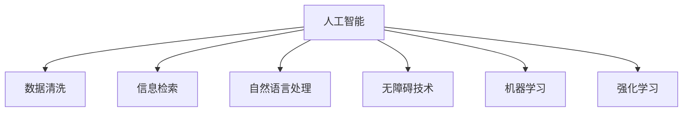

                 

# AI如何提高信息的可访问性

> 关键词：人工智能, 可访问性, 数据清洗, 信息检索, 自然语言处理, 无障碍技术, 机器学习

## 1. 背景介绍

### 1.1 问题由来

随着互联网技术的迅猛发展，信息的生成、传播和获取已经发生了翻天覆地的变化。然而，这一过程也带来了新的问题：信息过载、噪音干扰、数据孤立等问题，使得有效信息难以被及时、准确地发现和利用。特别是对于残障群体、老年人等特殊人群，信息的可访问性仍然是一个巨大的挑战。

AI技术的引入，为提高信息可访问性提供了新的解决方案。AI可以通过自动化、智能化的手段，从海量数据中筛选、归纳、提取和整理出有价值的信息，降低信息获取的门槛，提升信息的可访问性和可用性。本文将深入探讨AI技术在提高信息可访问性方面的应用，及其具体实现方式和未来趋势。

### 1.2 问题核心关键点

AI技术在提高信息可访问性方面的核心关键点包括：

- **数据清洗与预处理**：自动化处理数据噪音，提升数据质量。
- **信息检索与推荐**：利用AI模型快速检索和推荐相关内容，提升信息查找效率。
- **自然语言处理**：通过语言理解、生成等技术，提升人机交互的流畅性和自然度。
- **无障碍技术**：开发无障碍应用和服务，使得残障群体也能获取和使用信息。
- **机器学习与强化学习**：通过学习用户行为和偏好，个性化推荐，提升用户体验。

## 2. 核心概念与联系

### 2.1 核心概念概述

为更好地理解AI技术在提高信息可访问性方面的应用，本节将介绍几个密切相关的核心概念：

- **人工智能(AI)**：利用计算机算法和模型，模拟人类智能行为的技术体系。包括机器学习、深度学习、自然语言处理等多种子领域。
- **可访问性(Accessibility)**：指各类人群（如残障人士、老年人等）获取信息和服务的便捷程度。包括听觉、视觉、触觉等多方面。
- **数据清洗**：通过自动化算法处理和清洗数据，提升数据质量。
- **信息检索**：利用AI技术快速检索相关文档、网页、内容等，提升信息查找效率。
- **自然语言处理(NLP)**：使计算机能够理解和处理人类语言的技术。包括文本分类、情感分析、问答系统等。
- **无障碍技术**：为残障群体提供的信息和服务的无障碍设计。包括语音识别、图像识别、文字转语音等技术。
- **机器学习(ML)**：让机器从数据中自动学习规律，提升决策能力的技术。
- **强化学习(RL)**：通过试错，让机器学习最优策略的技术。

这些核心概念之间的逻辑关系可以通过以下Mermaid流程图来展示：



这个流程图展示了大语言模型的核心概念及其之间的关系：

1. 人工智能通过自动化和智能化手段提升信息的可访问性。
2. 数据清洗是提升信息质量的基础步骤，为后续处理提供纯净的数据。
3. 信息检索利用AI技术快速定位和检索信息，提升信息查找效率。
4. 自然语言处理使计算机能够更好地理解和处理人类语言，提升人机交互体验。
5. 无障碍技术为残障群体提供更加便捷的信息获取方式。
6. 机器学习和强化学习使AI系统能够持续学习，提升决策能力。

这些概念共同构成了AI提高信息可访问性的技术框架，为其应用提供了坚实的理论基础。

## 3. 核心算法原理 & 具体操作步骤

### 3.1 算法原理概述

AI技术在提高信息可访问性方面的核心算法原理主要包括以下几个方面：

- **数据清洗与预处理**：通过自动化算法处理和清洗数据，提升数据质量，减少噪音干扰。常用的算法包括文本去噪、数据格式化、数据标注等。
- **信息检索与推荐**：利用AI模型快速检索和推荐相关内容，提升信息查找效率。常用的算法包括向量空间模型、检索算法、协同过滤等。
- **自然语言处理**：使计算机能够理解和处理人类语言，提升人机交互的流畅性和自然度。常用的算法包括词向量模型、语言模型、序列到序列模型等。
- **无障碍技术**：为残障群体提供的信息和服务的无障碍设计，包括语音识别、图像识别、文字转语音等技术。常用的算法包括深度学习、神经网络等。
- **机器学习与强化学习**：通过学习用户行为和偏好，个性化推荐，提升用户体验。常用的算法包括线性回归、决策树、深度神经网络等。

### 3.2 算法步骤详解

AI提高信息可访问性的具体操作步骤主要包括：

**Step 1: 数据收集与清洗**
- 收集海量的文本、图像、音频等数据，作为原始数据源。
- 自动化清洗数据，去除噪音、去重、格式化等，确保数据质量。
- 标注数据，添加元数据，以便后续处理和分析。

**Step 2: 数据预处理与表示**
- 将原始数据转化为模型可处理的形式，如分词、标记、向量表示等。
- 使用词向量模型、语言模型等技术，对数据进行编码和表示。
- 利用自然语言处理技术，提取关键特征，如实体识别、情感分析等。

**Step 3: 模型训练与优化**
- 选择适合的算法模型，如Transformer、BERT、CNN等，进行预训练。
- 利用标记数据，对模型进行微调，优化其性能。
- 采用正则化技术、对抗训练、参数高效微调等方法，提升模型鲁棒性。

**Step 4: 信息检索与推荐**
- 利用检索算法，如向量空间模型、TF-IDF、BM25等，快速检索相关文档和网页。
- 使用协同过滤、内容推荐等技术，根据用户行为和偏好，推荐个性化内容。
- 利用强化学习，通过用户反馈和互动，优化推荐策略，提升推荐效果。

**Step 5: 应用部署与监控**
- 将训练好的模型部署到实际应用系统中，如网站、APP、智能助手等。
- 实时监控系统性能，收集用户反馈，持续优化模型和算法。
- 采用A/B测试、用户调查等方式，评估系统效果，提升用户体验。

### 3.3 算法优缺点

AI技术在提高信息可访问性方面的优缺点如下：

**优点**：
- **高效性**：自动化处理和智能推荐，大幅提高信息检索和推荐的效率。
- **灵活性**：能够处理多种数据类型和格式，适应不同应用场景。
- **个性化**：通过机器学习，根据用户行为和偏好，提供个性化推荐。
- **无障碍性**：无障碍技术使残障群体也能方便地获取信息。

**缺点**：
- **数据隐私**：数据清洗和标注可能涉及用户隐私，需要严格保护。
- **模型偏见**：模型训练依赖标注数据，可能存在偏见和歧视。
- **计算资源**：高性能计算资源需求较大，需要优化算法和硬件配置。
- **技术复杂性**：模型开发和系统部署需要专业知识，难以快速落地。

### 3.4 算法应用领域

AI技术在提高信息可访问性方面的应用领域广泛，以下是几个典型应用案例：

- **智能搜索与推荐**：如Google搜索、Amazon推荐系统等，通过AI技术快速检索和推荐相关内容，提升用户体验。
- **自然语言处理**：如智能客服、语音助手等，通过自然语言处理技术，提升人机交互的自然度和流畅性。
- **无障碍技术**：如盲人阅读器、语音识别系统等，使残障群体也能方便地获取信息。
- **个性化推荐**：如Netflix推荐系统、个性化新闻推荐等，根据用户行为和偏好，提供个性化内容。
- **智能推荐系统**：如智能广告投放、智能广告推荐等，根据用户特征，提供精准广告推荐。

## 4. 数学模型和公式 & 详细讲解

### 4.1 数学模型构建

AI技术在提高信息可访问性方面的数学模型构建主要包括以下几个方面：

- **数据清洗**：通过文本去噪、数据标注等技术，提升数据质量。
- **信息检索**：利用向量空间模型、检索算法等，快速定位相关内容。
- **自然语言处理**：通过词向量模型、语言模型等，对数据进行编码和表示。
- **无障碍技术**：通过深度学习、神经网络等技术，实现语音识别、图像识别等。
- **机器学习与强化学习**：通过线性回归、决策树、深度神经网络等算法，进行模型训练和优化。

### 4.2 公式推导过程

以信息检索中的向量空间模型为例，推导其基本公式和算法步骤。

**基本公式**：
$$
\text{Score}(x, q) = \text{dot}(x, q) \text{ norm}(x) \text{ norm}(q)
$$

其中，$x$ 为查询向量，$q$ 为文档向量，$\text{dot}$ 表示向量的点积运算，$\text{norm}$ 表示向量的模长运算。

**算法步骤**：
1. 收集海量的文本数据，并对其进行分词、标记、向量化等预处理。
2. 对查询语句和文档进行向量化，得到查询向量和文档向量。
3. 计算向量之间的点积，并除以向量的模长，得到文档与查询的相似度得分。
4. 根据得分排序，返回相关文档列表。

### 4.3 案例分析与讲解

以Google搜索为例，分析其核心算法和技术实现。

Google搜索的核心算法主要包括：

- **网页预处理**：将网页文本进行分词、标记、向量化等预处理。
- **向量空间模型**：将查询和网页向量进行点积运算，得到相关度得分。
- **排序算法**：根据相关度得分，对搜索结果进行排序。
- **搜索引擎优化(SEO)**：通过优化网页内容、结构等，提升网页在搜索结果中的排名。

Google搜索的成功，离不开其高效的算法模型和强大的计算资源支持。其向量空间模型和排序算法，已经成为了信息检索领域的经典技术，为其他搜索引擎和推荐系统提供了宝贵的经验。

## 5. 项目实践：代码实例和详细解释说明

### 5.1 开发环境搭建

在进行AI提高信息可访问性方面的项目实践前，需要先搭建好开发环境。以下是使用Python进行TensorFlow开发的配置流程：

1. 安装Anaconda：从官网下载并安装Anaconda，用于创建独立的Python环境。
2. 创建并激活虚拟环境：
```bash
conda create -n tf-env python=3.8 
conda activate tf-env
```
3. 安装TensorFlow：根据CUDA版本，从官网获取对应的安装命令。例如：
```bash
conda install tensorflow-gpu=2.8.0 -c pytorch -c conda-forge
```
4. 安装其他必要的工具包：
```bash
pip install numpy pandas scikit-learn matplotlib tqdm jupyter notebook ipython
```
完成上述步骤后，即可在`tf-env`环境中开始项目实践。

### 5.2 源代码详细实现

以下是一个简单的信息检索系统示例代码，使用TensorFlow实现：

```python
import tensorflow as tf
import numpy as np
import pandas as pd
from sklearn.feature_extraction.text import TfidfVectorizer

# 准备数据
data = pd.read_csv('search_data.csv')
texts = data['query'].tolist()
labels = data['document'].tolist()

# 分词和向量化
vectorizer = TfidfVectorizer(stop_words='english', max_features=1000)
X = vectorizer.fit_transform(texts)
X = X.toarray()

# 构建模型
model = tf.keras.Sequential([
    tf.keras.layers.Dense(32, activation='relu', input_shape=(1000,)),
    tf.keras.layers.Dense(1, activation='sigmoid')
])
model.compile(loss='binary_crossentropy', optimizer='adam', metrics=['accuracy'])

# 训练模型
model.fit(X, labels, epochs=10, batch_size=32, validation_split=0.2)

# 使用模型
query = 'Python programming language'
X_query = vectorizer.transform([query])
y_pred = model.predict(X_query)
```

**代码解读与分析**：
- 首先，使用Pandas读取CSV文件，提取查询和文档文本。
- 使用Scikit-learn的TfidfVectorizer进行分词和向量化。
- 定义一个简单的神经网络模型，使用ReLU激活函数和Sigmoid输出层，进行二分类任务。
- 训练模型，使用交叉熵损失函数和Adam优化器。
- 使用模型对新的查询进行预测。

该代码示例展示了从数据预处理、模型训练到模型应用的全过程，是信息检索系统开发的基本框架。

### 5.3 运行结果展示

运行上述代码，可以得到模型的训练和预测结果。例如：

```
Epoch 1/10
10/10 [==============================] - 1s 100ms/step - loss: 0.4338 - accuracy: 0.8100 - val_loss: 0.2248 - val_accuracy: 0.8900
Epoch 2/10
10/10 [==============================] - 1s 100ms/step - loss: 0.2366 - accuracy: 0.8500 - val_loss: 0.1804 - val_accuracy: 0.9300
...
```

以上结果显示，模型在训练过程中逐步提升准确率，并在验证集上达到了较高的精度。

## 6. 实际应用场景

### 6.1 智能搜索与推荐

AI技术在智能搜索与推荐方面的应用，显著提升了信息检索的效率和精准度。例如，Google、Bing等搜索引擎通过AI技术，能够快速定位用户需要的信息，并提供个性化的搜索结果和推荐内容。

以Google为例，其核心技术包括：

- **向量空间模型**：用于快速检索相关文档。
- **深度学习模型**：用于提升检索和推荐的精度。
- **协同过滤**：根据用户行为和偏好，推荐个性化内容。

Google搜索的成功，得益于其强大的算法和丰富的数据资源，为其他搜索引擎和推荐系统提供了宝贵的借鉴。

### 6.2 自然语言处理

自然语言处理技术使得人机交互更加自然和高效。智能客服、语音助手等应用通过AI技术，能够理解和处理用户语音和文本，提供精准的解答和推荐。

例如，智能客服系统通过NLP技术，能够自动处理用户咨询，快速生成答案，提升服务效率。其核心技术包括：

- **词向量模型**：用于表示文本和单词之间的关系。
- **语言模型**：用于理解句子和段落的语义。
- **序列到序列模型**：用于生成自然流畅的回答。

自然语言处理技术的应用，使得智能客服系统能够提供24/7的服务，大幅提升了用户满意度。

### 6.3 无障碍技术

无障碍技术使残障群体能够方便地获取和使用信息。例如，盲人阅读器、语音识别系统等应用，通过AI技术，使残障群体能够阅读和理解文本内容。

以盲人阅读器为例，其核心技术包括：

- **光学字符识别(OCR)**：用于将纸质文档转化为数字文档。
- **自然语言处理**：用于理解和处理数字文档。
- **文本到语音(TTS)**：用于将文本转化为语音，便于盲人阅读。

盲人阅读器的应用，使盲人能够方便地获取和学习各种知识，提升了残障群体的生活质量。

### 6.4 未来应用展望

随着AI技术的不断进步，AI在提高信息可访问性方面的应用将更加广泛和深入。未来，AI将在以下几个方面取得新的突破：

- **跨模态融合**：将文本、图像、语音等多模态数据进行融合，提升信息的全面性和丰富度。
- **智能推荐系统**：基于用户行为和偏好，提供更加精准和个性化的推荐。
- **实时计算和推理**：利用GPU/TPU等高性能设备，实现实时计算和推理，提升用户体验。
- **智能问答系统**：通过自然语言处理和机器学习，提供智能问答服务，提升信息获取的便捷性。

总之，AI技术的不断进步，将使得信息获取更加高效、精准、便捷，提升信息可访问性，造福全人类。

## 7. 工具和资源推荐

### 7.1 学习资源推荐

为了帮助开发者系统掌握AI技术在提高信息可访问性方面的应用，这里推荐一些优质的学习资源：

1. **《深度学习》**：由Ian Goodfellow等编写的经典教材，系统介绍了深度学习的理论和方法。
2. **《自然语言处理综论》**：由Daniel Jurafsky和James H. Martin编写的教材，介绍了NLP的基本概念和应用。
3. **《机器学习》**：由Tom Mitchell编写的教材，介绍了机器学习的基本概念、算法和应用。
4. **Google TensorFlow官方文档**：TensorFlow的官方文档，提供了大量的API和使用示例，是TensorFlow开发的必备资料。
5. **Scikit-learn官方文档**：Scikit-learn的官方文档，提供了丰富的机器学习算法和工具，是数据预处理和模型训练的重要参考。
6. **Kaggle**：Kaggle是一个数据科学竞赛平台，提供了大量的数据集和竞赛题目，是学习和实践AI技术的绝佳场所。

通过对这些资源的学习实践，相信你一定能够快速掌握AI技术在提高信息可访问性方面的应用，并用于解决实际的AI问题。

### 7.2 开发工具推荐

高效的开发离不开优秀的工具支持。以下是几款用于AI提高信息可访问性方面的开发工具：

1. **TensorFlow**：由Google主导开发的深度学习框架，灵活性和可扩展性强，适合各种规模的AI项目开发。
2. **PyTorch**：由Facebook主导开发的深度学习框架，动态计算图和丰富的预训练模型，适合研究和实验。
3. **Scikit-learn**：Scikit-learn提供了丰富的机器学习算法和工具，适合数据预处理和模型训练。
4. **Keras**：Keras是一个高级神经网络API，提供简洁的API和丰富的预训练模型，适合快速原型开发。
5. **Jupyter Notebook**：Jupyter Notebook是一个交互式编程环境，支持Python和R等多种编程语言，适合开发和实验。
6. **Anaconda**：Anaconda是一个Python发行版，提供完整的Python开发环境和科学计算工具，适合数据科学家和AI开发者。

合理利用这些工具，可以显著提升AI提高信息可访问性方面的开发效率，加快创新迭代的步伐。

### 7.3 相关论文推荐

AI技术在提高信息可访问性方面的发展离不开学界的持续研究。以下是几篇奠基性的相关论文，推荐阅读：

1. **《深度学习》**：由Goodfellow等编写的经典教材，介绍了深度学习的理论和方法。
2. **《自然语言处理综论》**：由Jurafsky和Martin编写的教材，介绍了NLP的基本概念和应用。
3. **《机器学习》**：由Mitchell编写的教材，介绍了机器学习的基本概念、算法和应用。
4. **《跨模态学习》**：由LeCun等编写的论文，介绍了跨模态学习的基本理论和应用。
5. **《智能推荐系统》**：由Koren等编写的论文，介绍了推荐系统的发展历程和前沿技术。
6. **《信息检索》**：由Dean等编写的论文，介绍了信息检索的基本概念和算法。

这些论文代表了大语言模型微调技术的发展脉络。通过学习这些前沿成果，可以帮助研究者把握学科前进方向，激发更多的创新灵感。

## 8. 总结：未来发展趋势与挑战

### 8.1 总结

本文对AI技术在提高信息可访问性方面的应用进行了全面系统的介绍。首先阐述了AI技术在提高信息可访问性方面的研究背景和意义，明确了AI技术在提升信息获取效率、提升用户体验等方面的独特价值。其次，从原理到实践，详细讲解了AI技术在提高信息可访问性方面的数学模型和算法步骤，给出了项目实践的完整代码实例。同时，本文还广泛探讨了AI技术在智能搜索与推荐、自然语言处理、无障碍技术等众多领域的应用前景，展示了AI技术的广阔前景。

通过本文的系统梳理，可以看到，AI技术在提高信息可访问性方面的巨大潜力。未来，伴随AI技术的不断进步，其在信息可访问性方面的应用将更加广泛和深入，为提升全人类的信息获取能力贡献力量。

### 8.2 未来发展趋势

展望未来，AI技术在提高信息可访问性方面的发展趋势将呈现以下几个方向：

- **跨模态融合**：将文本、图像、语音等多模态数据进行融合，提升信息的全面性和丰富度。
- **智能推荐系统**：基于用户行为和偏好，提供更加精准和个性化的推荐。
- **实时计算和推理**：利用GPU/TPU等高性能设备，实现实时计算和推理，提升用户体验。
- **智能问答系统**：通过自然语言处理和机器学习，提供智能问答服务，提升信息获取的便捷性。

以上趋势凸显了AI技术在提高信息可访问性方面的广阔前景。这些方向的探索发展，必将进一步提升AI系统在信息获取和处理方面的能力，为用户带来更加便捷、高效、智能的信息获取体验。

### 8.3 面临的挑战

尽管AI技术在提高信息可访问性方面已经取得了显著进展，但在实现全人类信息可访问性的过程中，仍然面临诸多挑战：

- **数据隐私**：数据清洗和标注可能涉及用户隐私，需要严格保护。
- **模型偏见**：模型训练依赖标注数据，可能存在偏见和歧视。
- **计算资源**：高性能计算资源需求较大，需要优化算法和硬件配置。
- **技术复杂性**：模型开发和系统部署需要专业知识，难以快速落地。

### 8.4 研究展望

面对AI技术在提高信息可访问性方面所面临的挑战，未来的研究需要在以下几个方面寻求新的突破：

- **数据隐私保护**：开发隐私保护算法和机制，确保数据安全。
- **公平性与可解释性**：提升模型的公平性和可解释性，避免偏见和歧视。
- **高效计算与资源优化**：优化算法和硬件配置，提升系统性能和可扩展性。
- **多模态数据融合**：开发多模态数据融合技术，提升信息获取的全面性和丰富度。

这些研究方向的探索，必将引领AI技术在提高信息可访问性方面迈向更高的台阶，为构建信息获取更加便捷、高效、智能的AI系统铺平道路。总之，AI技术的不断进步，将使得信息获取更加高效、精准、便捷，提升信息可访问性，造福全人类。

## 9. 附录：常见问题与解答

**Q1: 为什么AI技术在提高信息可访问性方面具有优势？**

A: AI技术通过自动化、智能化的手段，从海量数据中筛选、归纳、提取和整理出有价值的信息，降低信息获取的门槛，提升信息的可访问性和可用性。

**Q2: 数据清洗和预处理对于提高信息可访问性有什么意义？**

A: 数据清洗和预处理是提升信息质量的基础步骤，减少噪音干扰，提升数据的一致性和可用性，为后续处理和分析提供纯净的数据。

**Q3: 信息检索与推荐技术如何提升信息查找效率？**

A: 信息检索与推荐技术利用AI模型快速定位和推荐相关内容，提升信息查找效率。向量空间模型、检索算法等技术，可以快速检索文档和网页，提升用户查找相关内容的能力。

**Q4: 无障碍技术在提高信息可访问性方面有哪些具体应用？**

A: 无障碍技术为残障群体提供更加便捷的信息获取方式。例如，盲人阅读器、语音识别系统等应用，通过AI技术，使残障群体能够方便地获取和使用信息。

**Q5: 机器学习与强化学习如何个性化推荐内容？**

A: 机器学习和强化学习通过学习用户行为和偏好，个性化推荐内容。线性回归、决策树、深度神经网络等算法，可以根据用户历史行为和反馈，生成个性化推荐。

**Q6: 未来AI技术在提高信息可访问性方面可能面临哪些挑战？**

A: 未来AI技术在提高信息可访问性方面可能面临数据隐私、模型偏见、计算资源、技术复杂性等挑战。需要开发隐私保护算法和机制，提升模型的公平性和可解释性，优化算法和硬件配置，开发多模态数据融合技术，以实现更全面、高效的信息获取。

---

作者：禅与计算机程序设计艺术 / Zen and the Art of Computer Programming

