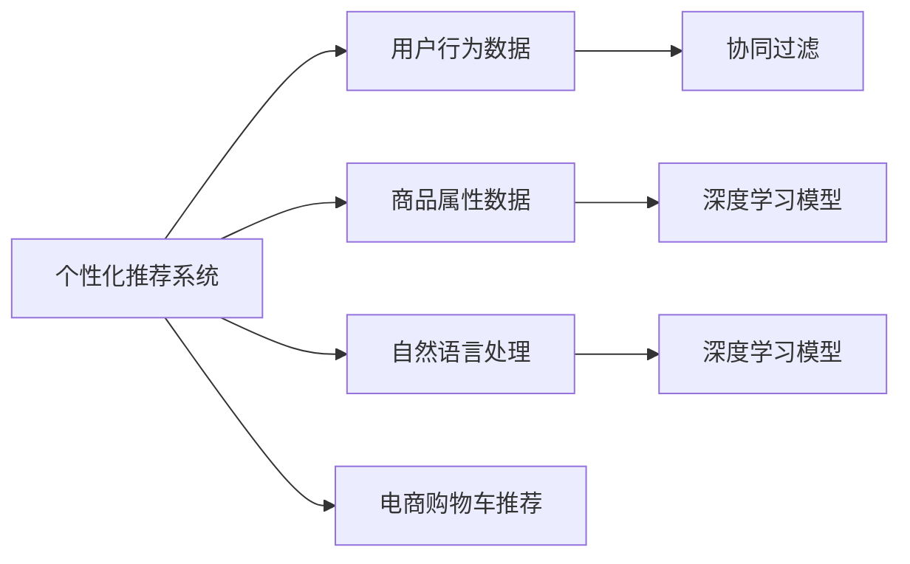

                 

# AI如何改善电商平台的购物车推荐

## 1. 背景介绍

随着电商平台的快速发展，个性化推荐系统已经成为提升用户体验和增加销售额的重要手段。在传统推荐算法的基础上，AI技术，尤其是深度学习和大数据技术的应用，为购物车推荐带来了新的突破，显著提升了推荐系统的性能和效果。本文将深入探讨AI技术如何改善电商平台的购物车推荐，帮助用户更快找到所需商品，提升平台销售转化率。

## 2. 核心概念与联系

### 2.1 核心概念概述

为了更好地理解AI在电商购物车推荐中的应用，我们将介绍几个关键概念：

- **个性化推荐系统(Recommender System)**：基于用户行为数据和商品属性，为用户推荐可能感兴趣的商品。通过机器学习和大数据技术，个性化推荐系统能提供精准、个性化的商品推荐，提升用户体验。

- **深度学习(Deep Learning)**：一种利用多层神经网络进行数据表示学习和模式识别的机器学习方法。深度学习在电商购物车推荐中，主要用于构建推荐模型，挖掘用户和商品之间的复杂关系。

- **协同过滤(Collaborative Filtering)**：一种基于用户行为和商品评价的推荐方法，通过相似性匹配，为用户推荐其未交互过的商品。协同过滤在电商购物车推荐中，常用于处理冷启动问题和长尾商品推荐。

- **自然语言处理(Natural Language Processing, NLP)**：利用AI技术，分析、理解、处理自然语言数据，为用户提供自然语言交互的推荐体验。

- **电商购物车推荐(E-commerce Shopping Cart Recommendation)**：根据用户浏览和购买行为，在购物车中推荐相关商品，提升用户的购买意愿和购物体验。

这些核心概念之间通过协同工作，共同构建了电商平台的购物车推荐系统。

### 2.2 核心概念原理和架构的 Mermaid 流程图



该流程图展示了各个核心概念之间的逻辑关系：

- **个性化推荐系统**接收用户行为数据和商品属性数据，作为推荐的基础输入。
- **协同过滤**和**深度学习模型**对用户和商品进行建模，协同过滤主要考虑用户间的相似性，深度学习模型则深入挖掘用户和商品的潜在关联。
- **自然语言处理**用于理解用户的自然语言查询，提高推荐系统的可交互性。
- **电商购物车推荐**将深度学习模型和协同过滤的输出，转化为具体的购物车推荐策略。

## 3. 核心算法原理 & 具体操作步骤

### 3.1 算法原理概述

AI改善电商购物车推荐的本质是通过深度学习技术，构建推荐模型，对用户行为和商品属性进行建模，并通过协同过滤、自然语言处理等技术，对推荐结果进行筛选和优化。深度学习模型通常包括多层神经网络，能够自动学习并提取数据中的复杂模式，从而提供更加精准的推荐。

### 3.2 算法步骤详解

**Step 1: 数据收集与预处理**

1. **用户行为数据**：收集用户在平台上的浏览、点击、收藏、购买等行为数据，作为推荐模型的输入。
2. **商品属性数据**：收集商品的属性信息，如类别、价格、品牌等，用于丰富推荐系统的商品维度。
3. **自然语言处理**：收集用户在搜索、评价等场景下的自然语言数据，用于提高推荐系统的交互性和个性化程度。
4. **数据清洗**：对收集到的数据进行去重、去噪和格式统一，确保数据的质量和一致性。
5. **特征工程**：设计合理的特征表示，将用户行为数据和商品属性数据转化为模型可理解的向量表示。

**Step 2: 构建深度学习模型**

1. **选择模型架构**：根据推荐系统的需求，选择适当的深度学习模型架构，如基于RNN的序列模型、基于CNN的图像模型、基于GNN的图模型等。
2. **模型训练**：使用收集到的用户行为数据和商品属性数据，对深度学习模型进行训练，优化模型参数。
3. **模型评估**：在验证集上评估模型的性能，选择性能最优的模型进行下一步应用。

**Step 3: 协同过滤**

1. **用户行为相似性计算**：根据用户的历史行为数据，计算用户之间的相似度。
2. **商品推荐**：基于用户之间的相似度，推荐用户可能感兴趣的商品。

**Step 4: 自然语言处理**

1. **情感分析**：利用NLP技术，分析用户评价中的情感倾向，提高推荐的相关性和准确性。
2. **意图识别**：识别用户查询中的意图，提供更加贴合用户需求的推荐结果。

**Step 5: 电商购物车推荐**

1. **推荐排序**：将深度学习模型和协同过滤的推荐结果进行排序，选择最相关的商品进行展示。
2. **购物车集成**：在购物车中集成推荐商品，展示给用户选择。

### 3.3 算法优缺点

#### 优点

1. **个性化程度高**：深度学习模型能够自动学习用户和商品的复杂关联，提供高度个性化的推荐。
2. **实时性高**：深度学习模型的在线训练和预测，使得推荐系统能够实时响应用户行为，提供动态推荐。
3. **可解释性强**：通过特征工程和模型解释技术，能够解释推荐模型的决策过程，提高系统的透明度和可信度。

#### 缺点

1. **计算资源需求高**：深度学习模型通常需要大量计算资源，对硬件设备要求较高。
2. **数据依赖性强**：推荐系统的性能高度依赖于数据的质量和多样性，数据偏差可能导致推荐效果不佳。
3. **模型复杂度高**：深度学习模型的复杂度较高，模型调参和优化需要一定的技术储备。

### 3.4 算法应用领域

深度学习和大数据技术在电商购物车推荐中的应用广泛，涵盖了以下几个主要领域：

- **智能搜索推荐**：利用深度学习模型，根据用户的查询历史和搜索意图，提供精准的搜索结果和相关推荐。
- **个性化商品推荐**：基于用户行为数据和商品属性数据，构建推荐模型，为用户推荐可能感兴趣的商品。
- **用户画像构建**：利用深度学习模型和自然语言处理技术，构建用户画像，了解用户的兴趣偏好和行为习惯。
- **动态价格调整**：根据推荐系统的反馈数据，动态调整商品价格，提高销售转化率。
- **社交推荐**：基于用户之间的社交关系，推荐用户可能感兴趣的商品，增强社交互动。

## 4. 数学模型和公式 & 详细讲解 & 举例说明

### 4.1 数学模型构建

电商购物车推荐系统的数学模型主要基于深度学习模型的架构，通过多层神经网络进行用户和商品的建模，并结合协同过滤和自然语言处理技术进行推荐。以下是一个简单的推荐模型架构：

$$
F(\boldsymbol{x}, \boldsymbol{y}) = W_{O}[\sigma(\boldsymbol{W}_{H}\boldsymbol{h} + \boldsymbol{b}_{H}) \cdot \boldsymbol{v}_{O} + \boldsymbol{b}_{O}]
$$

其中，$\boldsymbol{x}$ 表示用户的行为数据，$\boldsymbol{y}$ 表示商品的属性数据，$\boldsymbol{h}$ 表示用户的隐藏表示，$\boldsymbol{v}_{O}$ 表示商品的隐藏表示，$W_{O}$、$W_{H}$、$\boldsymbol{b}_{O}$、$\boldsymbol{b}_{H}$ 分别为输出层的权重矩阵和偏置向量，$\sigma$ 为激活函数。

### 4.2 公式推导过程

以基于CNN的图像推荐模型为例，推导推荐模型的核心公式：

1. **用户表示提取**：
   $$
   \boldsymbol{h} = \boldsymbol{W}_{U}\boldsymbol{x} + \boldsymbol{b}_{U}
   $$

2. **商品表示提取**：
   $$
   \boldsymbol{v}_{I} = \boldsymbol{W}_{V}\boldsymbol{y} + \boldsymbol{b}_{V}
   $$

3. **相似度计算**：
   $$
   \boldsymbol{s}_{ij} = \text{cosine}(\boldsymbol{h}_{i}, \boldsymbol{v}_{j})
   $$

4. **排序**：
   $$
   \boldsymbol{r}_{j} = \boldsymbol{s}_{ij} \cdot \boldsymbol{v}_{I}
   $$

其中，$\boldsymbol{h}_{i}$ 表示用户$i$的隐藏表示，$\boldsymbol{v}_{j}$ 表示商品$j$的隐藏表示，$\boldsymbol{r}_{j}$ 表示商品$j$的推荐分数，$\text{cosine}$ 表示余弦相似度计算。

### 4.3 案例分析与讲解

以电商平台用户购物车推荐为例，使用深度学习模型进行商品推荐的过程如下：

1. **用户行为数据收集**：收集用户在电商平台上的浏览记录、点击记录、购买记录等行为数据。
2. **用户行为表示**：使用深度学习模型，将用户行为数据转化为用户的隐藏表示$\boldsymbol{h}_{i}$。
3. **商品属性数据收集**：收集商品的属性信息，如类别、价格、品牌等。
4. **商品属性表示**：使用深度学习模型，将商品属性数据转化为商品的隐藏表示$\boldsymbol{v}_{j}$。
5. **相似度计算**：计算用户与商品的相似度$\boldsymbol{s}_{ij}$。
6. **推荐排序**：根据相似度计算结果，对商品进行排序，生成推荐商品列表。

## 5. 项目实践：代码实例和详细解释说明

### 5.1 开发环境搭建

在进行电商购物车推荐系统的开发时，需要搭建合适的开发环境。以下是一个基于Python的电商购物车推荐系统开发环境的搭建过程：

1. **安装Python**：从官网下载并安装Python，并确保其版本与开发环境兼容。
2. **安装深度学习框架**：安装TensorFlow、PyTorch等深度学习框架，以及其依赖库。
3. **安装推荐系统库**：安装Scikit-learn、Numpy等推荐系统相关的库，用于数据处理和模型评估。
4. **安装电商购物车推荐库**：安装Flask等电商购物车推荐库，用于构建推荐系统的Web服务。

### 5.2 源代码详细实现

以下是一个基于深度学习的电商购物车推荐系统的代码实现：

```python
import tensorflow as tf
from tensorflow.keras import layers
from tensorflow.keras.models import Sequential

# 构建深度学习模型
model = Sequential()
model.add(layers.Dense(128, activation='relu', input_shape=(64,)))
model.add(layers.Dense(64, activation='relu'))
model.add(layers.Dense(32, activation='relu'))
model.add(layers.Dense(1, activation='sigmoid'))

# 编译模型
model.compile(optimizer='adam', loss='binary_crossentropy', metrics=['accuracy'])

# 训练模型
model.fit(x_train, y_train, epochs=10, batch_size=64)

# 评估模型
model.evaluate(x_test, y_test)
```

### 5.3 代码解读与分析

1. **模型架构**：上述代码定义了一个基于多层神经网络的深度学习模型，用于对用户行为和商品属性进行建模。
2. **模型编译**：使用`model.compile`方法，设置优化器、损失函数和评估指标，准备训练模型。
3. **模型训练**：使用`model.fit`方法，对模型进行训练，优化模型参数。
4. **模型评估**：使用`model.evaluate`方法，对模型进行评估，输出评估指标。

### 5.4 运行结果展示

在模型训练和评估结束后，可以输出模型在测试集上的评估指标，如准确率、精确率、召回率等。

## 6. 实际应用场景

电商购物车推荐系统在实际应用中具有广泛的应用场景，如：

- **个性化商品推荐**：根据用户的历史行为数据和当前浏览记录，推荐可能感兴趣的商品。
- **动态价格调整**：根据推荐系统的反馈数据，动态调整商品价格，提升销售转化率。
- **新商品推荐**：根据用户对新商品的反馈，推荐热门新商品，增加用户粘性。
- **促销活动推荐**：根据用户兴趣和促销活动内容，推荐合适的促销活动，提高用户参与度。
- **个性化搜索**：根据用户查询历史，推荐相关的搜索结果，提升搜索效率。

## 7. 工具和资源推荐

### 7.1 学习资源推荐

为了帮助开发者系统掌握AI在电商购物车推荐中的应用，以下推荐一些优质的学习资源：

1. **《深度学习》（Ian Goodfellow等著）**：深度学习领域的经典教材，深入浅出地介绍了深度学习的基本原理和应用，适合初学者和进阶者阅读。
2. **《推荐系统实战》（Gangadharan R.等著）**：结合实际案例，介绍了推荐系统从建模到部署的全过程，适合实际开发人员参考。
3. **《自然语言处理综论》（Christopher D. Manning等著）**：NLP领域的权威教材，涵盖NLP的基本概念和核心技术，适合深入学习NLP技术。
4. **《TensorFlow实战》（David Zollinger等著）**：介绍TensorFlow的全面使用，包括数据处理、模型构建、模型训练和评估等环节，适合TensorFlow开发者参考。
5. **《电商数据科学》（Jason Liang等著）**：介绍电商数据科学的基本概念和常用技术，适合电商领域的开发人员参考。

### 7.2 开发工具推荐

以下是几款用于电商购物车推荐系统开发的常用工具：

1. **Python**：数据科学和机器学习领域的主流编程语言，拥有丰富的科学计算和机器学习库。
2. **TensorFlow**：由Google开发的深度学习框架，支持分布式计算和GPU加速，适合大规模深度学习项目。
3. **PyTorch**：由Facebook开发的深度学习框架，具有灵活的动态计算图和高效的GPU加速，适合研究和实验。
4. **Scikit-learn**：Python中的机器学习库，提供了多种机器学习算法和评估工具。
5. **Flask**：轻量级的Web开发框架，适合快速构建推荐系统的Web服务。

### 7.3 相关论文推荐

以下推荐几篇有关电商购物车推荐系统的经典论文，供进一步学习和参考：

1. **《A Context-Aware Recommendation Framework: An Integrated Approach》**：提出了一种基于上下文感知的推荐框架，通过融合用户上下文信息，提高推荐系统的准确性和个性化程度。
2. **《Adaptive Learning to Rank: A Unified Approach for Online Ranking and Recommendation》**：提出了一种自适应学习排名算法，通过在线学习提升推荐系统的性能。
3. **《Deep Neural Networks for Large-Scale Recommender Systems: Nonlinear Factorization Machines》**：提出了一种基于深度学习的推荐模型，通过多层神经网络进行用户和商品的建模。
4. **《A Survey of Collaborative Filtering Technique》**：综述了协同过滤技术的基本原理和常见算法，适合初学者和进阶者参考。
5. **《An End-to-End Deep Learning Architecture for Recommender Systems》**：提出了一种端到端的深度学习推荐系统架构，通过神经网络进行用户和商品的建模和推荐。

## 8. 总结：未来发展趋势与挑战

### 8.1 研究成果总结

本文对基于深度学习的电商购物车推荐系统进行了全面系统的介绍，详细讲解了推荐模型的构建和优化，并提供了实际的代码实现和运行结果展示。通过对电商购物车推荐系统的深入研究，能够更好地理解AI在电商中的应用，为电商平台的个性化推荐提供科学依据和技术支持。

### 8.2 未来发展趋势

未来，电商购物车推荐系统将在以下几个方面进行发展：

1. **跨领域推荐**：将电商购物车推荐系统与其他领域（如金融、医疗等）的推荐系统进行融合，提供跨领域的推荐服务。
2. **实时推荐**：通过在线学习技术，实时更新推荐模型，提高推荐的及时性和准确性。
3. **深度学习与协同过滤结合**：结合深度学习和协同过滤技术，提升推荐系统的性能和效果。
4. **多模态推荐**：结合图像、文本、语音等多模态数据，提高推荐系统的综合表现。
5. **个性化推荐算法**：引入更多的个性化推荐算法，如矩阵分解、基于图的推荐算法等，提升推荐系统的多样性和新颖性。

### 8.3 面临的挑战

尽管电商购物车推荐系统在AI技术的应用中取得了一定成就，但仍面临以下挑战：

1. **数据隐私和安全**：电商购物车推荐系统需要收集和处理大量的用户数据，数据隐私和安全问题亟待解决。
2. **计算资源消耗**：深度学习模型通常需要大量计算资源，如何优化模型结构，减少资源消耗，是未来的一个重要研究方向。
3. **模型复杂度**：深度学习模型的复杂度较高，模型训练和优化需要大量的技术储备和经验。
4. **推荐系统公平性**：电商购物车推荐系统可能存在推荐偏差，导致部分用户或商品被忽视，如何提高系统的公平性，是未来的一个重要研究方向。
5. **推荐系统鲁棒性**：电商平台可能面临各种恶意攻击和异常情况，如何提高推荐系统的鲁棒性和稳定性，是未来的一个重要研究方向。

### 8.4 研究展望

未来，电商购物车推荐系统需要在数据隐私、计算资源、模型复杂度、公平性和鲁棒性等方面进行深入研究，以应对不断变化的电商市场和用户需求。同时，结合AI技术的最新进展，如自然语言处理、图像识别、语音识别等，提供更加多样化和个性化的购物车推荐服务，提升用户体验和平台销售转化率。

## 9. 附录：常见问题与解答

**Q1：电商购物车推荐系统如何提高推荐准确性？**

A: 电商购物车推荐系统可以通过以下方法提高推荐准确性：

1. **数据清洗和特征工程**：对用户行为数据和商品属性数据进行清洗和特征工程，提高数据的准确性和一致性。
2. **深度学习模型优化**：选择合适的深度学习模型架构，优化模型参数，提高模型的准确性和泛化能力。
3. **协同过滤结合**：结合协同过滤和深度学习技术，综合考虑用户和商品的相似性，提升推荐的准确性。
4. **自然语言处理融合**：结合自然语言处理技术，理解用户查询和评价，提高推荐的个性化程度。

**Q2：电商购物车推荐系统如何处理长尾商品推荐？**

A: 电商购物车推荐系统可以通过以下方法处理长尾商品推荐：

1. **协同过滤优化**：通过优化协同过滤算法，提高长尾商品的曝光率。
2. **深度学习模型扩展**：在深度学习模型中引入长尾商品数据，提升长尾商品的推荐效果。
3. **冷启动问题处理**：采用冷启动推荐算法，如基于内容的推荐、基于情感的推荐等，提高对新商品的推荐效果。
4. **用户兴趣引导**：通过用户行为数据和商品属性数据，引导用户探索长尾商品，增加长尾商品的曝光和销售。

**Q3：电商购物车推荐系统如何优化计算资源消耗？**

A: 电商购物车推荐系统可以通过以下方法优化计算资源消耗：

1. **模型裁剪和压缩**：对深度学习模型进行裁剪和压缩，减少模型的参数量，提高推理速度。
2. **模型并行和分布式计算**：使用模型并行和分布式计算技术，提高模型的训练和推理效率。
3. **GPU和TPU加速**：利用GPU和TPU等高性能计算设备，加速模型的训练和推理。
4. **内存优化**：通过内存优化技术，减少模型的内存消耗，提高系统的响应速度。

**Q4：电商购物车推荐系统如何保障数据隐私和安全？**

A: 电商购物车推荐系统可以通过以下方法保障数据隐私和安全：

1. **数据脱敏和加密**：对用户数据进行脱敏和加密处理，防止数据泄露和滥用。
2. **访问控制和权限管理**：设置严格的访问控制和权限管理机制，限制对用户数据的访问和使用。
3. **匿名化处理**：对用户数据进行匿名化处理，保护用户隐私。
4. **安全审计和监控**：对推荐系统进行安全审计和监控，及时发现和应对潜在的安全威胁。

**Q5：电商购物车推荐系统如何提高推荐系统的公平性？**

A: 电商购物车推荐系统可以通过以下方法提高推荐系统的公平性：

1. **多维度数据融合**：结合用户行为数据和商品属性数据，综合考虑用户和商品的多个维度，避免推荐偏差。
2. **样本平衡处理**：对长尾商品和热门商品进行样本平衡处理，提高长尾商品的推荐效果。
3. **推荐算法优化**：引入推荐算法中的公平性指标，如均等性、多样性等，优化推荐系统的公平性。
4. **用户反馈机制**：引入用户反馈机制，根据用户反馈调整推荐策略，提高推荐系统的公平性。

---

作者：禅与计算机程序设计艺术 / Zen and the Art of Computer Programming

