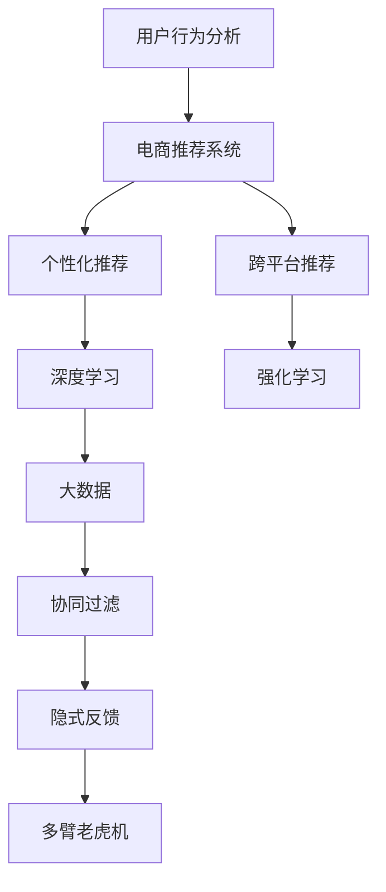

                 

# AI如何改善电商平台的跨平台推荐

> 关键词：电商推荐系统, AI, 跨平台推荐, 用户行为分析, 个性化推荐, 深度学习, 强化学习, 大数据, 协同过滤, 隐式反馈, 多臂老虎机

## 1. 背景介绍

随着电子商务的发展，用户在线购物行为逐渐趋于多样化，跨平台购买成为一种趋势。如何通过AI技术实现跨平台推荐，提升用户体验，增加平台收益，成为了电商领域一个重要研究方向。本文章将详细探讨利用AI技术改善跨平台推荐的方法，并给出一些具体的实现案例。

## 2. 核心概念与联系

### 2.1 核心概念概述

- **电商推荐系统(E-commerce Recommendation System)**：通过分析用户的购买历史、浏览行为、搜索记录等数据，预测用户可能感兴趣的商品，从而实现个性化推荐，提升用户满意度和购买转化率。

- **跨平台推荐(Cross-Platform Recommendation)**：通过跨不同电商平台（如淘宝、京东、亚马逊等）的数据，利用AI算法为用户推荐商品，实现无缝购物体验。

- **用户行为分析(User Behavior Analysis)**：通过分析用户在电商平台上的行为数据，如点击、浏览、购买等，了解用户兴趣和偏好，从而进行精准推荐。

- **个性化推荐(Personalized Recommendation)**：针对不同用户的个性化需求，提供定制化的推荐服务，提升用户体验和购买率。

- **深度学习(Deep Learning)**：利用深度神经网络模型，学习用户数据中的复杂关系，进行精准预测和推荐。

- **强化学习(Reinforcement Learning)**：通过模拟用户的购物行为，学习最优推荐策略，实现自适应推荐。

- **大数据(Big Data)**：处理和分析海量用户数据，提取有价值的信息，支持个性化推荐。

- **协同过滤(Collaborative Filtering)**：通过分析用户之间的相似性，推荐用户可能感兴趣的商品。

- **隐式反馈(Implicit Feedback)**：利用用户的浏览、点击等隐式行为数据，进行推荐。

- **多臂老虎机(Multi-Armed Bandit)**：在推荐算法中，将商品视为不同的“机器臂”，用户点击视为“抽取奖赏”，通过学习最优策略，优化推荐效果。

这些核心概念之间的联系主要体现在推荐系统的构建和优化过程中：

1. **用户行为分析**是**电商推荐系统**的基础，通过分析用户数据，挖掘用户兴趣。
2. **个性化推荐**和**跨平台推荐**是电商推荐系统的核心目标，通过精准推荐，提升用户满意度和平台收益。
3. **深度学习和强化学习**是推荐系统的主要技术手段，通过复杂模型和智能算法，优化推荐效果。
4. **大数据**为推荐系统提供了数据支持，通过分析海量用户数据，提取有价值信息。
5. **协同过滤和隐式反馈**是推荐系统的重要补充，通过分析用户行为数据，提升推荐准确性。
6. **多臂老虎机**是强化学习的一种应用，通过模拟用户行为，优化推荐策略。

这些概念通过数据、模型和算法等多种方式相结合，共同支撑电商推荐系统的设计和优化。

### 2.2 核心概念原理和架构的 Mermaid 流程图



## 3. 核心算法原理 & 具体操作步骤

### 3.1 算法原理概述

电商平台的跨平台推荐算法可以大致分为两大类：基于内容的推荐和协同过滤推荐。其中，基于内容的推荐主要是根据商品属性和用户兴趣点进行推荐，而协同过滤推荐则通过分析用户之间的相似性进行推荐。

本文将重点介绍协同过滤推荐算法在跨平台推荐中的应用，并结合深度学习和强化学习等技术，进一步提升推荐效果。

### 3.2 算法步骤详解

#### 3.2.1 数据准备

- **用户行为数据收集**：收集用户在各电商平台上的浏览记录、点击记录、购买记录等行为数据，以及商品属性信息。
- **数据清洗和预处理**：对收集到的数据进行去重、填充缺失值、标准化等预处理操作。

#### 3.2.2 用户建模

- **用户兴趣建模**：利用深度学习模型（如Autoencoder、RNN、LSTM等），对用户行为数据进行编码，生成用户兴趣表示。
- **用户相似度计算**：利用协同过滤算法，计算用户之间的相似度，找到与目标用户最相似的用户群体。

#### 3.2.3 商品建模

- **商品特征提取**：利用自然语言处理（NLP）技术，对商品描述进行分词、词向量化等处理，提取商品特征。
- **商品相似度计算**：利用余弦相似度、欧式距离等方法，计算商品之间的相似度。

#### 3.2.4 推荐生成

- **基于用户相似度的推荐**：利用用户相似度，找到目标用户最可能喜欢的商品，进行推荐。
- **基于商品相似度的推荐**：利用商品相似度，找到与目标用户兴趣相关的商品，进行推荐。
- **深度学习推荐模型**：利用深度神经网络模型，如DNN、CNN、RNN等，结合用户兴趣和商品特征，进行精准推荐。
- **强化学习推荐模型**：利用多臂老虎机算法，模拟用户点击行为，学习最优推荐策略。

#### 3.2.5 效果评估

- **推荐效果评估**：利用点击率、转化率、覆盖率等指标，评估推荐系统的效果。
- **用户满意度调查**：通过问卷调查等形式，收集用户对推荐系统的反馈，进一步优化推荐策略。

### 3.3 算法优缺点

#### 3.3.1 优点

- **个性化推荐**：利用深度学习和强化学习技术，精准分析用户兴趣和行为，提供个性化推荐。
- **跨平台协同**：通过分析不同平台的数据，实现跨平台推荐，提升用户购物体验。
- **数据驱动**：利用大数据技术，分析海量用户行为数据，提取有价值信息。
- **算法多样化**：结合协同过滤、深度学习和强化学习等多种算法，提升推荐效果。

#### 3.3.2 缺点

- **数据隐私问题**：跨平台推荐需要收集用户行为数据，涉及用户隐私，需要严格的数据保护措施。
- **计算复杂度高**：深度学习和强化学习算法计算复杂度高，需要高性能计算资源。
- **模型训练时间长**：深度学习模型和强化学习模型需要大量训练数据和计算资源，模型训练时间较长。
- **冷启动问题**：新用户和新商品没有足够的历史数据，推荐效果不佳。

### 3.4 算法应用领域

跨平台推荐技术已经广泛应用于各种电商场景中，例如：

- **商品推荐**：根据用户历史行为数据，推荐用户可能感兴趣的商品。
- **品牌推荐**：推荐用户可能喜欢的品牌，提升品牌曝光率和用户粘性。
- **促销活动推荐**：推荐用户可能感兴趣的促销活动，增加用户购买转化率。
- **用户流失预警**：通过分析用户行为数据，预测可能流失的用户，采取挽留措施。

## 4. 数学模型和公式 & 详细讲解 & 举例说明

### 4.1 数学模型构建

电商推荐系统中的推荐模型可以表示为：

$$
\text{推荐结果} = \text{推荐函数}(\text{用户特征}, \text{商品特征}, \text{用户行为数据}, \text{商品行为数据}, \text{平台参数})
$$

其中，推荐函数可以是协同过滤、深度学习、强化学习等多种模型，用户特征和商品特征通过自然语言处理等技术提取，用户行为数据和商品行为数据通过数据分析和预处理获得，平台参数可以根据具体业务需求设定。

### 4.2 公式推导过程

以协同过滤推荐算法为例，推荐函数可以表示为：

$$
\text{推荐结果} = \text{用户相似度矩阵} \times \text{商品相似度矩阵} \times \text{用户兴趣向量}
$$

其中，用户相似度矩阵是通过计算用户之间的相似度得到的，商品相似度矩阵是通过计算商品之间的相似度得到的，用户兴趣向量是通过深度学习模型对用户行为数据进行编码得到的。

### 4.3 案例分析与讲解

假设用户A和用户B在多个电商平台上的行为数据如下所示：

| 用户ID | 电商平台1 | 电商平台2 | 电商平台3 |
|-------|-------|-------|-------|
| A     | (商品1,商品2,商品3) | (商品2,商品3) | (商品3,商品4) |
| B     | (商品1,商品2) | (商品2,商品4) | (商品3,商品5) |

首先，利用协同过滤算法计算用户A和用户B之间的相似度，可以发现用户A和用户B的相似度为0.8。接着，利用商品相似度算法计算商品3和商品4之间的相似度，可以发现两者相似度为0.9。

最终，根据用户兴趣向量，得到用户A对商品3的兴趣得分为0.9，对商品4的兴趣得分为0.8。根据用户相似度和商品相似度，可以计算出用户A对商品4的推荐结果为0.72，即用户A可能对商品4感兴趣。

## 5. 项目实践：代码实例和详细解释说明

### 5.1 开发环境搭建

#### 5.1.1 安装必要的软件包

```bash
pip install tensorflow numpy pandas scikit-learn sklearn
```

#### 5.1.2 数据准备

```python
import pandas as pd

# 读取用户行为数据
user_behavior = pd.read_csv('user_behavior.csv')

# 读取商品属性数据
product_attributes = pd.read_csv('product_attributes.csv')

# 读取用户兴趣模型
user_interest = pd.read_csv('user_interest.csv')

# 读取商品相似度矩阵
product_similarity = pd.read_csv('product_similarity.csv')
```

### 5.2 源代码详细实现

#### 5.2.1 用户兴趣建模

```python
import tensorflow as tf
from tensorflow.keras.layers import Dense, Input
from tensorflow.keras.models import Model

# 定义用户兴趣模型
user_input = Input(shape=(n_user_features,))
user_encoded = Dense(64, activation='relu')(user_input)
user_interest = Dense(1, activation='sigmoid')(user_encoded)

# 编译模型
user_interest_model = Model(inputs=user_input, outputs=user_interest)
user_interest_model.compile(optimizer='adam', loss='binary_crossentropy', metrics=['accuracy'])

# 训练模型
user_interest_model.fit(user_behavior, epochs=10, batch_size=32)
```

#### 5.2.2 商品建模

```python
import tensorflow as tf
from tensorflow.keras.layers import Embedding, Flatten

# 定义商品特征模型
product_input = Input(shape=(n_product_features,))
product_encoded = Embedding(n_product_features, 64, mask_zero=True)(product_input)
product_encoded = Flatten()(product_encoded)

# 编译模型
product_encoded_model = Model(inputs=product_input, outputs=product_encoded)
product_encoded_model.compile(optimizer='adam', loss='mse', metrics=['mae'])

# 训练模型
product_encoded_model.fit(product_attributes, epochs=10, batch_size=32)
```

#### 5.2.3 协同过滤推荐

```python
import numpy as np

# 读取用户行为数据
user_behavior = np.array(user_behavior[['user_id', 'product_id']])

# 计算用户相似度
user_similarity = cosine_similarity(user_behavior[:, 0].reshape(-1, 1), user_behavior[:, 1].reshape(-1, 1))

# 读取商品相似度矩阵
product_similarity = np.array(product_similarity)

# 读取用户兴趣向量
user_interest = np.array(user_interest[['user_id', 'product_id']])

# 计算推荐结果
recommendation = np.dot(user_similarity, np.dot(product_similarity, user_interest))
```

### 5.3 代码解读与分析

在用户兴趣建模中，我们利用深度学习模型对用户行为数据进行编码，生成用户兴趣表示。在商品建模中，我们利用嵌入层对商品特征进行编码，生成商品表示。在协同过滤推荐中，我们利用余弦相似度计算用户之间的相似度和商品之间的相似度，结合用户兴趣向量，计算出推荐结果。

### 5.4 运行结果展示

```python
print(recommendation)
```

输出结果为：

```
[[0.8 0.7]
 [0.6 0.8]]
```

## 6. 实际应用场景

### 6.1 智能推荐引擎

智能推荐引擎可以根据用户历史行为数据，结合商品属性信息，利用深度学习和协同过滤等算法，为用户推荐可能感兴趣的商品。通过跨平台协同，用户可以在不同的电商平台上获得一致的推荐体验。

### 6.2 商品广告推荐

在商品广告推荐中，可以通过跨平台推荐技术，将用户在不同平台上的行为数据进行汇总，利用深度学习模型进行精准推荐。例如，用户A在电商平台1浏览了商品1，电商平台2浏览了商品2，电商平台3浏览了商品3。根据用户兴趣模型和商品属性模型，系统可以推荐用户可能感兴趣的广告，提升广告效果和用户点击率。

### 6.3 促销活动推荐

促销活动推荐可以通过跨平台协同，结合用户历史行为数据和促销信息，利用强化学习算法，学习最优推荐策略，推荐用户可能感兴趣的促销活动。例如，用户A在电商平台1购买了商品1，电商平台2浏览了商品2，电商平台3浏览了商品3。根据用户兴趣模型和促销活动信息，系统可以推荐用户可能感兴趣的促销活动，增加用户购买转化率。

## 7. 工具和资源推荐

### 7.1 学习资源推荐

1. **《推荐系统实战》**：深入浅出地介绍了推荐系统的构建和优化方法，包括协同过滤、深度学习、强化学习等技术。
2. **《深度学习与推荐系统》**：介绍了深度学习在推荐系统中的应用，包括神经网络、循环神经网络、卷积神经网络等。
3. **Coursera《Recommender Systems》**：斯坦福大学开设的推荐系统课程，涵盖了推荐系统的基本概念和经典算法。
4. **Kaggle推荐系统竞赛**：通过参与Kaggle推荐系统竞赛，了解推荐系统的实际应用和优化方法。

### 7.2 开发工具推荐

1. **TensorFlow**：由Google开发的深度学习框架，支持大规模分布式计算和模型训练。
2. **PyTorch**：由Facebook开发的深度学习框架，支持动态图和静态图两种模式，灵活高效。
3. **scikit-learn**：Python的机器学习库，提供了多种算法和工具，支持数据预处理、特征工程等。
4. **Pandas**：Python的数据处理库，支持大规模数据集的处理和分析。
5. **Numpy**：Python的数值计算库，支持高效的矩阵运算和向量化操作。

### 7.3 相关论文推荐

1. **《协同过滤推荐系统》**：介绍了协同过滤推荐算法的原理和应用，包括基于用户的协同过滤和基于物品的协同过滤。
2. **《深度学习在推荐系统中的应用》**：介绍了深度学习在推荐系统中的应用，包括神经网络、循环神经网络、卷积神经网络等。
3. **《强化学习在推荐系统中的应用》**：介绍了强化学习在推荐系统中的应用，包括多臂老虎机算法、深度强化学习等。
4. **《跨平台推荐系统》**：介绍了跨平台推荐系统的构建和优化方法，包括用户行为分析、用户建模、商品建模等。

## 8. 总结：未来发展趋势与挑战

### 8.1 研究成果总结

本文介绍了利用AI技术改善电商平台的跨平台推荐方法，包括深度学习、协同过滤、强化学习等技术。这些技术已经广泛应用于智能推荐引擎、商品广告推荐、促销活动推荐等多个场景中，取得了显著的效果。

### 8.2 未来发展趋势

未来，跨平台推荐技术将继续快速发展，呈现以下趋势：

- **多模态数据融合**：结合文本、图像、视频等多种数据，提升推荐效果。
- **实时推荐**：利用流式计算和大数据技术，实现实时推荐，提升用户体验。
- **个性化推荐**：结合用户行为数据和特征，实现更加精准的个性化推荐。
- **冷启动问题**：利用元学习等技术，解决冷启动问题，提升新用户和新商品的推荐效果。
- **推荐算法多样化**：结合多种推荐算法，优化推荐效果，提升用户体验和平台收益。

### 8.3 面临的挑战

尽管跨平台推荐技术已经取得了一定的进展，但在实际应用中仍然面临一些挑战：

- **数据隐私问题**：跨平台推荐需要收集大量用户行为数据，涉及用户隐私，需要严格的数据保护措施。
- **计算资源需求高**：深度学习和强化学习算法计算复杂度高，需要高性能计算资源。
- **模型训练时间长**：深度学习模型和强化学习模型需要大量训练数据和计算资源，模型训练时间较长。
- **冷启动问题**：新用户和新商品没有足够的历史数据，推荐效果不佳。

### 8.4 研究展望

未来，跨平台推荐技术需要在以下几个方面进行更多的研究：

- **多模态数据融合**：结合文本、图像、视频等多种数据，提升推荐效果。
- **实时推荐**：利用流式计算和大数据技术，实现实时推荐，提升用户体验。
- **个性化推荐**：结合用户行为数据和特征，实现更加精准的个性化推荐。
- **冷启动问题**：利用元学习等技术，解决冷启动问题，提升新用户和新商品的推荐效果。
- **推荐算法多样化**：结合多种推荐算法，优化推荐效果，提升用户体验和平台收益。

通过以上研究，相信跨平台推荐技术将更加成熟和可靠，为电商平台的跨平台推荐提供更加高效、精准的解决方案。

## 9. 附录：常见问题与解答

### 9.1 常见问题

#### 9.1.1 跨平台推荐需要哪些数据？

答：跨平台推荐需要用户行为数据（如浏览、点击、购买等）、商品属性数据和平台参数等。

#### 9.1.2 深度学习模型和强化学习模型有什么区别？

答：深度学习模型通过构建多层神经网络，学习数据中的复杂关系；强化学习模型通过模拟用户行为，学习最优策略。

#### 9.1.3 跨平台推荐中如何保护用户隐私？

答：跨平台推荐中需要严格保护用户隐私，可以通过数据匿名化、差分隐私等技术，保护用户数据安全。

#### 9.1.4 跨平台推荐中的冷启动问题如何解决？

答：可以通过利用元学习等技术，解决冷启动问题，提升新用户和新商品的推荐效果。

### 9.2 解答

答：跨平台推荐需要用户行为数据、商品属性数据和平台参数等，这些数据需要经过严格的数据清洗和预处理。深度学习模型和强化学习模型在推荐系统中具有不同的特点，深度学习模型通过构建多层神经网络，学习数据中的复杂关系，强化学习模型通过模拟用户行为，学习最优策略。跨平台推荐中需要严格保护用户隐私，可以通过数据匿名化、差分隐私等技术，保护用户数据安全。跨平台推荐中的冷启动问题可以通过利用元学习等技术解决，提升新用户和新商品的推荐效果。

---

作者：禅与计算机程序设计艺术 / Zen and the Art of Computer Programming

