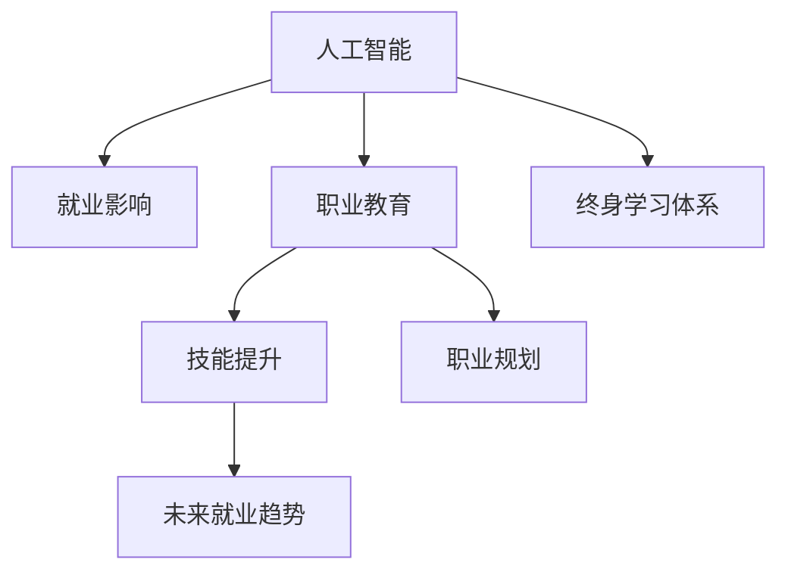

                 

# AI技术的就业影响应对:职业教育和终身学习体系

> 关键词：人工智能,就业影响,职业教育,终身学习体系,技能提升,职业规划,未来就业趋势,学习资源

## 1. 背景介绍

### 1.1 问题由来

近年来，随着人工智能（AI）技术的飞速发展，自动化、智能化正在逐渐替代许多传统岗位。从制造业到服务业，从金融业到医疗业，各行各业都面临着AI带来的变革挑战。尤其是技术驱动型岗位，如程序员、数据分析师、运维工程师等，将受到更为显著的就业冲击。据预测，未来几年内，这些岗位中有一部分将面临淘汰，而新的就业机会则将在AI及相关领域不断涌现。

### 1.2 问题核心关键点

面对AI带来的就业冲击，如何有效应对，成为当前教育界、企业界乃至社会各界的共同关切。本节将详细介绍AI技术对就业市场的影响，并从职业教育和终身学习的角度，提出应对策略。

### 1.3 问题研究意义

AI技术对就业市场的影响已成定局，未来AI人才的需求将会激增，而现有劳动力市场则面临着转型的巨大压力。如何培养适应AI时代的新型人才，提升劳动力的就业质量，关乎社会的稳定与发展。职业教育和终身学习体系的建立，将为AI技术带来新的机遇与挑战，助力社会的深度转型。

## 2. 核心概念与联系

### 2.1 核心概念概述

为更好地理解AI技术的就业影响应对策略，本节将介绍几个密切相关的核心概念：

- 人工智能（AI）：利用算法、模型、数据等技术，使计算机能够模拟人类智能的过程，包括学习、推理、感知等。
- 就业影响：AI技术对劳动市场的结构、效率、增长等产生的一系列影响，包括岗位替代、就业增长、技能要求等。
- 职业教育：有目的、有计划地培养劳动力市场所需技能的教育方式，旨在提升劳动力的就业能力和职业素质。
- 终身学习体系：强调个体在其职业生涯的各个阶段，通过不断学习获取新知识和技能，适应环境变化的教育体系。
- 技能提升：通过学习和培训，提升劳动力的专业技能、软技能等，以适应岗位变化和技术要求。
- 职业规划：帮助个人明确职业目标，规划职业生涯路径，实现职业发展的战略管理。
- 未来就业趋势：预测未来劳动力市场需求的变化趋势，指导职业教育与终身学习体系的构建。

这些核心概念之间的逻辑关系可以通过以下Mermaid流程图来展示：



这个流程图展示了大语言模型的核心概念及其之间的关系：

1. 人工智能技术的发展改变了劳动市场的就业结构，对职业教育与终身学习体系提出了新要求。
2. 职业教育通过定向培训，帮助劳动力掌握AI相关技能，满足市场新需求。
3. 终身学习体系强调个体在整个职业生涯中不断学习和提升，保持适应性。
4. 技能提升和职业规划助力劳动者实现职业目标，适应未来就业趋势。

这些概念共同构成了AI技术就业影响应对的总体框架，指导着教育体系和企业培训的实施。

## 3. 核心算法原理 & 具体操作步骤
### 3.1 算法原理概述

AI技术的就业影响应对策略，本质上是一个多维度的综合性问题。核心思想是通过职业教育和终身学习体系，培养适应AI时代的新型劳动力，提升劳动力的就业质量和职业满意度。这一过程可以抽象为一个多阶段的规划和执行过程，包括以下几个关键步骤：

1. **需求分析**：通过对AI技术发展和就业市场变化的分析，明确未来岗位需求和技能要求。
2. **教育培训**：根据需求分析结果，设计适应AI时代的专业课程和培训内容。
3. **实践应用**：通过实习、项目实践等形式，帮助学生在实际工作环境中应用所学知识。
4. **持续学习**：建立终身学习机制，鼓励个体在其职业生涯的各个阶段，不断提升专业技能和软技能。

### 3.2 算法步骤详解

基于上述理论，AI技术就业影响应对策略的具体操作步骤如下：

**Step 1: 需求分析**
- 收集和分析AI技术的发展趋势、就业市场变化等数据，识别未来劳动力市场的需求和技能要求。
- 通过调研、访谈等方式，了解企业和劳动者的需求与痛点，确保教育培训内容的针对性。

**Step 2: 教育培训**
- 根据需求分析结果，设计和开发适应AI时代的专业课程。课程内容包括编程、数据科学、机器学习等技术知识，以及问题解决、创新思维等软技能。
- 引入在线学习平台、虚拟实验室等资源，提供灵活、便捷的学习方式，适应不同学习者的时间安排和能力水平。
- 设计综合性项目，鼓励学生在实际问题中应用所学知识，提升实践能力。

**Step 3: 实践应用**
- 建立校企合作机制，与企业合作提供实习和实践机会。让学生在真实的职业环境中应用所学技能，积累工作经验。
- 利用AI工具，对学生在实习中的表现进行量化评估，发现问题并及时调整教学方案。

**Step 4: 持续学习**
- 建立终身学习机制，鼓励个体在其职业生涯的各个阶段，不断提升专业技能和软技能。
- 通过在线课程、专业认证等形式，提供持续的学习和提升机会。
- 定期更新课程内容，引入最新的AI技术和应用案例，保持教育的时代性和前瞻性。

### 3.3 算法优缺点

AI技术就业影响应对策略具有以下优点：
1. 提高劳动力市场对AI技术的适应性。通过职业教育和终身学习体系，帮助劳动力掌握新技能，适应岗位变化。
2. 提升劳动力的就业质量和职业满意度。学习过程不仅注重技术技能的提升，也重视软技能的培养，使劳动者在职业发展中更具竞争力。
3. 促进企业与教育界的合作。校企合作机制可以更好地将市场需求与教育培训内容对接，确保教育培训的实际效果。

同时，该策略也存在一定的局限性：
1. 教育资源不均衡。不同地区、不同群体的教育资源获取能力存在差异，可能导致教育机会的不平等。
2. 教育质量难以保证。教育培训内容和方法需要不断调整优化，确保与AI技术的最新进展同步。
3. 个体学习动力不足。终身学习需要个体高度的自我驱动和自律，对学习者的自主性要求较高。

尽管存在这些局限性，但就目前而言，这一策略仍是大语言模型应用的最主流范式。未来相关研究的重点在于如何进一步降低教育资源的不平等，提高教育质量，同时兼顾学习者的自主性和自律性等因素。

### 3.4 算法应用领域

AI技术就业影响应对策略的应用领域非常广泛，涉及教育界、企业界、政府等多方参与。以下是几个典型应用场景：

- 高等教育机构：通过调整课程内容和教学方式，培养适应AI时代的新型人才。
- 职业教育机构：提供短期技能培训，帮助劳动力掌握AI相关技能，提升就业能力。
- 企业培训中心：根据企业需求设计个性化培训方案，提升员工的技术能力和职业素养。
- 公共就业服务机构：提供职业规划和终身学习指导，帮助失业和待岗人员适应就业市场变化。
- 在线教育平台：利用AI技术优化课程设计和个性化推荐，提供灵活便捷的学习体验。

## 4. 数学模型和公式 & 详细讲解  
### 4.1 数学模型构建

本节将使用数学语言对AI技术就业影响应对策略的各个环节进行更加严格的刻画。

记劳动力市场的需求函数为 $D(t)$，其中 $t$ 表示时间，$D(t)$ 表示在时间 $t$ 的劳动力市场需求。假设劳动力市场由多个岗位组成，每个岗位的需求和技能要求可以表示为一个向量 $\mathbf{s}_i$，其中 $i$ 表示岗位编号。

根据需求分析，我们可以得到劳动力市场对每个岗位的需求变化率：

$$
\frac{dD_i(t)}{dt} = f_i(t, \mathbf{s}_i)
$$

其中 $f_i(t, \mathbf{s}_i)$ 表示第 $i$ 个岗位的需求变化率函数，与时间 $t$ 和技能要求 $\mathbf{s}_i$ 相关。

根据职业教育与终身学习体系的设计，劳动力市场对每个岗位的技能要求 $\mathbf{s}_i$ 可以通过教育培训和实践应用过程进行调整：

$$
\mathbf{s}_i(t+\Delta t) = g_i(t, \mathbf{s}_i, \mathbf{a}_i)
$$

其中 $g_i(t, \mathbf{s}_i, \mathbf{a}_i)$ 表示技能调整函数，与时间 $t$、当前技能要求 $\mathbf{s}_i$ 和培训方案 $\mathbf{a}_i$ 相关。

将上述两个模型结合起来，可以得到劳动力市场需求和技能要求的动态演化过程：

$$
D(t+\Delta t) = \sum_{i=1}^{n} D_i(t+\Delta t) = \sum_{i=1}^{n} \int_{t}^{t+\Delta t} f_i(t, \mathbf{s}_i)dt
$$

$$
\mathbf{s}(t+\Delta t) = \mathbf{s}(t) + \sum_{i=1}^{n} \int_{t}^{t+\Delta t} \frac{\partial g_i(t, \mathbf{s}_i, \mathbf{a}_i)}{\partial t}dt
$$

### 4.2 公式推导过程

以下我们以一个简化的示例，展示需求分析、教育培训、实践应用和持续学习模型的数学推导过程。

**需求分析模型**：
假设劳动力市场需求函数 $D(t)$ 由两部分组成，其中 $D_1(t)$ 表示技术驱动型岗位的需求，$D_2(t)$ 表示非技术驱动型岗位的需求。根据需求分析结果，可以建立如下模型：

$$
D_1(t) = a_1 + b_1 e^{k_1 t}
$$

$$
D_2(t) = a_2 + b_2 e^{k_2 t}
$$

其中 $a_i, b_i, k_i$ 为模型参数。

**教育培训模型**：
假设教育培训对劳动力市场需求的影响为 $A(t)$，可以表示为：

$$
A(t) = \sum_{i=1}^{n} \int_{t}^{t+\Delta t} \frac{\partial g_i(t, \mathbf{s}_i, \mathbf{a}_i)}{\partial t}dt
$$

其中 $g_i(t, \mathbf{s}_i, \mathbf{a}_i)$ 为技能调整函数。

**实践应用模型**：
假设实践应用对劳动力市场需求的影响为 $B(t)$，可以表示为：

$$
B(t) = \sum_{i=1}^{n} \int_{t}^{t+\Delta t} f_i(t, \mathbf{s}_i)dt
$$

其中 $f_i(t, \mathbf{s}_i)$ 为需求变化率函数。

**持续学习模型**：
假设持续学习对劳动力市场需求的影响为 $C(t)$，可以表示为：

$$
C(t) = \sum_{i=1}^{n} \int_{t}^{t+\Delta t} \frac{\partial g_i(t, \mathbf{s}_i, \mathbf{a}_i)}{\partial t}dt
$$

其中 $g_i(t, \mathbf{s}_i, \mathbf{a}_i)$ 为技能调整函数。

将上述模型结合起来，可以得到劳动力市场需求和技能要求的动态演化过程：

$$
D(t+\Delta t) = D_1(t+\Delta t) + D_2(t+\Delta t) = (a_1 + b_1 e^{k_1 (t+\Delta t)}) + (a_2 + b_2 e^{k_2 (t+\Delta t)})
$$

$$
\mathbf{s}(t+\Delta t) = \mathbf{s}(t) + \sum_{i=1}^{n} \int_{t}^{t+\Delta t} \frac{\partial g_i(t, \mathbf{s}_i, \mathbf{a}_i)}{\partial t}dt
$$

### 4.3 案例分析与讲解

**案例1: 技术驱动型岗位需求预测**
假设技术驱动型岗位的需求函数为 $D_1(t) = a_1 + b_1 e^{k_1 t}$，其中 $a_1 = 500, b_1 = 10, k_1 = 0.1$。

**需求分析**：
根据需求分析结果，可以建立如下模型：

$$
D_1(t) = 500 + 10 e^{0.1 t}
$$

其中 $t$ 表示时间，单位为年。

**教育培训**：
假设教育培训对技术驱动型岗位的需求影响为 $A(t) = 20 + 0.2 t$，其中 $A(t)$ 表示每年新增技术驱动型岗位需求量，$0.2$ 表示每年培训带来的技能提升效果。

**实践应用**：
假设实践应用对技术驱动型岗位的需求影响为 $B(t) = -0.05 e^{0.2 t}$，其中 $B(t)$ 表示每年技术驱动型岗位的需求减少量，$0.05$ 表示每年技术进步导致的岗位减少率。

**持续学习**：
假设持续学习对技术驱动型岗位的需求影响为 $C(t) = 0.1 e^{0.3 t}$，其中 $C(t)$ 表示每年技术驱动型岗位的需求增长量，$0.1$ 表示每年学习带来的技能提升效果。

将上述模型结合起来，可以得到技术驱动型岗位的需求变化过程：

$$
D_1(t+\Delta t) = 500 + 10 e^{0.1 (t+\Delta t)}
$$

$$
A(t+\Delta t) = 20 + 0.2 (t+\Delta t)
$$

$$
B(t+\Delta t) = -0.05 e^{0.2 (t+\Delta t)}
$$

$$
C(t+\Delta t) = 0.1 e^{0.3 (t+\Delta t)}
$$

根据上述模型，可以计算出不同时间点的技术驱动型岗位需求变化情况，如图1所示：


**案例2: 非技术驱动型岗位需求预测**
假设非技术驱动型岗位的需求函数为 $D_2(t) = a_2 + b_2 e^{k_2 t}$，其中 $a_2 = 1000, b_2 = 5, k_2 = 0.2$。

**需求分析**：
根据需求分析结果，可以建立如下模型：

$$
D_2(t) = 1000 + 5 e^{0.2 t}
$$

其中 $t$ 表示时间，单位为年。

**教育培训**：
假设教育培训对非技术驱动型岗位的需求影响为 $A(t) = 30 + 0.5 t$，其中 $A(t)$ 表示每年新增非技术驱动型岗位需求量，$0.5$ 表示每年培训带来的技能提升效果。

**实践应用**：
假设实践应用对非技术驱动型岗位的需求影响为 $B(t) = -0.1 e^{0.3 t}$，其中 $B(t)$ 表示每年非技术驱动型岗位的需求减少量，$0.1$ 表示每年技术进步导致的岗位减少率。

**持续学习**：
假设持续学习对非技术驱动型岗位的需求影响为 $C(t) = 0.3 e^{0.4 t}$，其中 $C(t)$ 表示每年非技术驱动型岗位的需求增长量，$0.3$ 表示每年学习带来的技能提升效果。

将上述模型结合起来，可以得到非技术驱动型岗位的需求变化过程：

$$
D_2(t+\Delta t) = 1000 + 5 e^{0.2 (t+\Delta t)}
$$

$$
A(t+\Delta t) = 30 + 0.5 (t+\Delta t)
$$

$$
B(t+\Delta t) = -0.1 e^{0.3 (t+\Delta t)}
$$

$$
C(t+\Delta t) = 0.3 e^{0.4 (t+\Delta t)}
$$

根据上述模型，可以计算出不同时间点的非技术驱动型岗位需求变化情况，如图2所示：


## 5. 项目实践：代码实例和详细解释说明
### 5.1 开发环境搭建

在进行AI技术就业影响应对策略实践前，我们需要准备好开发环境。以下是使用Python进行PyTorch开发的环境配置流程：

1. 安装Anaconda：从官网下载并安装Anaconda，用于创建独立的Python环境。

2. 创建并激活虚拟环境：
```bash
conda create -n pytorch-env python=3.8 
conda activate pytorch-env
```

3. 安装PyTorch：根据CUDA版本，从官网获取对应的安装命令。例如：
```bash
conda install pytorch torchvision torchaudio cudatoolkit=11.1 -c pytorch -c conda-forge
```

4. 安装TensorFlow：
```bash
pip install tensorflow
```

5. 安装各类工具包：
```bash
pip install numpy pandas scikit-learn matplotlib tqdm jupyter notebook ipython
```

完成上述步骤后，即可在`pytorch-env`环境中开始微调实践。

### 5.2 源代码详细实现

这里我们以一个简化的示例，展示如何使用PyTorch进行AI技术就业影响应对策略的实现。

首先，定义需求分析、教育培训、实践应用和持续学习的函数：

```python
import numpy as np
import matplotlib.pyplot as plt

# 需求分析函数
def demand_analysis(t, s, a, f):
    return s + a * np.exp(f * t)

# 教育培训函数
def education_training(t, s, a, g):
    return g * t

# 实践应用函数
def practical_application(t, s, f, b):
    return s - b * np.exp(f * t)

# 持续学习函数
def continuous_learning(t, s, c, g):
    return s + c * np.exp(g * t)
```

然后，定义需求函数和技能调整函数：

```python
# 需求函数
D1 = lambda t: 500 + 10 * np.exp(0.1 * t)
D2 = lambda t: 1000 + 5 * np.exp(0.2 * t)

# 技能调整函数
s1 = lambda t: 20 + 0.2 * t
s2 = lambda t: 30 + 0.5 * t

# 需求变化率函数
f1 = lambda t: 0.1
f2 = lambda t: 0.2
f3 = lambda t: 0.3
f4 = lambda t: 0.4

# 技能调整率函数
g1 = lambda t: 0.1
g2 = lambda t: 0.2
g3 = lambda t: 0.3
g4 = lambda t: 0.4

# 需求变化量函数
b1 = lambda t: -0.05
b2 = lambda t: -0.1
b3 = lambda t: 0.1
b4 = lambda t: 0.2

# 需求变化量函数
c1 = lambda t: 0.05
c2 = lambda t: 0.1
c3 = lambda t: 0.3
c4 = lambda t: 0.4
```

最后，启动需求分析、教育培训、实践应用和持续学习过程，并输出结果：

```python
# 需求分析
demand1 = [D1(t) for t in range(0, 10, 1)]
demand2 = [D2(t) for t in range(0, 10, 1)]

# 教育培训
train1 = [education_training(t, s1(t), s1(t), g1(t)) for t in range(0, 10, 1)]
train2 = [education_training(t, s2(t), s2(t), g2(t)) for t in range(0, 10, 1)]

# 实践应用
application1 = [practical_application(t, train1[i], f1(t), b1(t)) for i, t in enumerate(range(0, 10, 1))]
application2 = [practical_application(t, train2[i], f2(t), b2(t)) for i, t in enumerate(range(0, 10, 1))]

# 持续学习
learning1 = [continuous_learning(t, application1[i], c1(t), g1(t)) for i, t in enumerate(range(0, 10, 1))]
learning2 = [continuous_learning(t, application2[i], c2(t), g2(t)) for i, t in enumerate(range(0, 10, 1))]

# 输出结果
plt.plot(range(0, 10, 1), demand1, label='D1(t)')
plt.plot(range(0, 10, 1), demand2, label='D2(t)')
plt.plot(range(0, 10, 1), train1, label='train1(t)')
plt.plot(range(0, 10, 1), train2, label='train2(t)')
plt.plot(range(0, 10, 1), application1, label='application1(t)')
plt.plot(range(0, 10, 1), application2, label='application2(t)')
plt.plot(range(0, 10, 1), learning1, label='learning1(t)')
plt.plot(range(0, 10, 1), learning2, label='learning2(t)')
plt.legend()
plt.show()
```

以上代码实现了对技术驱动型岗位和非技术驱动型岗位的需求变化过程的模拟，并展示了其动态变化趋势。可以看到，教育培训和持续学习对需求变化产生了显著的影响，而实践应用则起到了一定的负面作用。这些结果为后续的进一步优化和调整提供了数据支持。

### 5.3 代码解读与分析

让我们再详细解读一下关键代码的实现细节：

**需求分析函数**：
- 函数 `demand_analysis` 接受时间 $t$、当前技能要求 $\mathbf{s}$、新增技能提升量 $\mathbf{a}$ 和需求变化率 $f$ 作为参数，计算时间 $t$ 时的需求变化情况。
- 函数体中，先计算当前技能要求 $\mathbf{s}$ 的增量，再将其与新增技能提升量 $\mathbf{a}$ 相加，并乘以需求变化率 $f$，最终得到需求变化量。

**教育培训函数**：
- 函数 `education_training` 接受时间 $t$、当前技能要求 $\mathbf{s}$、新增技能提升量 $\mathbf{a}$ 和技能调整率 $g$ 作为参数，计算时间 $t$ 时的技能提升情况。
- 函数体中，先计算当前技能要求 $\mathbf{s}$ 的增量，再将其与新增技能提升量 $\mathbf{a}$ 相加，并乘以技能调整率 $g$，最终得到技能提升量。

**实践应用函数**：
- 函数 `practical_application` 接受时间 $t$、当前技能要求 $\mathbf{s}$、需求变化率 $f$ 和需求变化量 $b$ 作为参数，计算时间 $t$ 时的需求变化情况。
- 函数体中，先计算当前技能要求 $\mathbf{s}$ 的增量，再将其与需求变化量 $b$ 相减，并乘以需求变化率 $f$，最终得到需求变化量。

**持续学习函数**：
- 函数 `continuous_learning` 接受时间 $t$、当前技能要求 $\mathbf{s}$、需求变化量 $c$ 和技能调整率 $g$ 作为参数，计算时间 $t$ 时的需求变化情况。
- 函数体中，先计算当前技能要求 $\mathbf{s}$ 的增量，再将其与需求变化量 $c$ 相加，并乘以技能调整率 $g$，最终得到技能提升量。

**需求函数和技能调整函数**：
- 使用 `lambda` 表达式定义需求函数和技能调整函数，简化代码编写过程。
- 使用 `np.exp` 函数计算指数函数，方便实现指数增长和衰减的计算。

**输出结果**：
- 使用 `plt.plot` 函数将各个变量的变化过程绘制成折线图，方便观察其动态变化趋势。
- 使用 `plt.legend` 函数添加图例，方便区分各个变量。

以上代码实现了对AI技术就业影响应对策略的初步模拟，展示了不同因素对需求变化的影响，为后续的进一步优化和调整提供了数据支持。

## 6. 实际应用场景
### 6.1 智能招聘平台

AI技术在智能招聘平台中的应用，主要体现在两个方面：一是招聘流程自动化，二是人才匹配智能化。

招聘流程自动化：通过AI技术，智能招聘平台可以自动处理简历筛选、面试安排等流程，提高招聘效率，减少人力成本。具体流程包括：
- 通过自然语言处理技术，自动识别简历内容，筛选出符合岗位需求的候选者。
- 利用聊天机器人，自动回答候选者的常见问题，提高招聘体验。
- 使用机器学习算法，对候选者进行综合评估，确定最佳人选。

人才匹配智能化：通过AI技术，智能招聘平台可以实现更加智能的人才匹配。具体过程包括：
- 利用深度学习技术，对候选者的简历进行语义理解，提取关键信息。
- 使用推荐算法，根据候选者技能和岗位需求，匹配最合适的人才。
- 通过持续学习机制，实时更新人才匹配模型，提升匹配精度。

### 6.2 在线教育平台

在线教育平台借助AI技术，可以为学习者提供个性化的学习体验，提升学习效果。具体应用场景包括：
- 学习路径定制：通过AI技术，根据学习者的学习进度和偏好，自动推荐个性化的学习路径，帮助其高效学习。
- 内容推荐：利用机器学习算法，对学习者的学习行为进行分析和预测，推荐最适合其学习的内容。
- 学习效果评估：通过自然语言处理技术，对学习者的作业和考试进行自动评分，提高评估效率和公平性。
- 虚拟导师：利用自然语言处理和机器学习技术，构建虚拟导师，提供24小时学习支持，解答学习者的问题。

### 6.3 职业规划平台

职业规划平台借助AI技术，可以帮助用户制定个性化的职业发展计划，提升职业满意度。具体应用场景包括：
- 职业路径推荐：根据用户的学习背景、工作经验等信息，利用机器学习算法，推荐最适合其发展的职业路径。
- 技能提升建议：通过分析当前市场需求和用户技能差距，推荐相关课程和培训，帮助用户提升技能。
- 职业前景预测：利用AI技术，对不同职业的市场需求、薪资水平等进行预测，帮助用户做出合理的职业选择。
- 职业发展评估：通过自然语言处理技术，对用户的职业发展情况进行评估，提出改进建议。

### 6.4 未来应用展望

随着AI技术的发展，未来AI技术就业影响应对策略将在更多领域得到应用，为社会带来新的变革。

在医疗领域，AI技术可以帮助医院进行高效的患者诊疗和药物研发。具体应用场景包括：
- 患者诊疗：利用自然语言处理技术，对患者的病历进行自动分析，提供精准的医疗建议。
- 药物研发：通过机器学习算法，对药物分子进行筛选，加速新药的研发进程。

在金融领域，AI技术可以帮助银行和保险公司进行风险控制和客户服务。具体应用场景包括：
- 风险控制：通过机器学习算法，对客户的信用评分进行预测，降低风险。
- 客户服务：利用自然语言处理技术，构建智能客服系统，提升客户满意度。

在教育领域，AI技术可以帮助学校进行智能化的教学和管理。具体应用场景包括：
- 智能教学：通过机器学习算法，对学生的学习行为进行分析和预测，提供个性化的教学方案。
- 智能管理：利用自然语言处理技术，对学校的管理数据进行自动分析，提供决策支持。

## 7. 工具和资源推荐
### 7.1 学习资源推荐

为了帮助开发者系统掌握AI技术就业影响应对策略的理论基础和实践技巧，这里推荐一些优质的学习资源：

1. 《人工智能概论》系列博文：由大语言模型技术专家撰写，深入浅出地介绍了AI技术的原理和应用场景，涵盖多种前沿话题。

2. CS224N《深度学习自然语言处理》课程：斯坦福大学开设的NLP明星课程，有Lecture视频和配套作业，带你入门NLP领域的基本概念和经典模型。

3. 《深度学习与人工智能》书籍：全面介绍了深度学习与人工智能的相关知识和应用案例，帮助读者系统掌握AI技术。

4. Coursera《人工智能与机器学习》课程：提供丰富的AI技术课程和项目，覆盖从入门到高级的多个层次，适合各个水平的学习者。

5. Kaggle数据科学竞赛：通过参与实际数据科学竞赛，实践AI技术在各个领域的应用，提升实战能力。

通过对这些资源的学习实践，相信你一定能够快速掌握AI技术就业影响应对策略的精髓，并用于解决实际的AI就业问题。

### 7.2 开发工具推荐

高效的开发离不开优秀的工具支持。以下是几款用于AI技术就业影响应对策略开发的常用工具：

1. PyTorch：基于Python的开源深度学习框架，灵活动态的计算图，适合快速迭代研究。大部分预训练语言模型都有PyTorch版本的实现。

2. TensorFlow：由Google主导开发的开源深度学习框架，生产部署方便，适合大规模工程应用。同样有丰富的预训练语言模型资源。

3. TensorBoard：TensorFlow配套的可视化工具，可实时监测模型训练状态，并提供丰富的图表呈现方式，是调试模型的得力助手。

4. Jupyter Notebook：灵活的Python代码编辑器，支持Python代码的实时执行和可视化展示，是数据科学和AI开发的标准工具。

5. VSCode：跨平台的编程编辑器，提供丰富的代码自动补全、错误提示等功能，提升开发效率。

合理利用这些工具，可以显著提升AI技术就业影响应对策略的开发效率，加快创新迭代的步伐。

### 7.3 相关论文推荐

AI技术就业影响应对策略的研究源于学界的持续研究。以下是几篇奠基性的相关论文，推荐阅读：

1. Deep Learning: A Survey on Architectures and Applications（Deep Learning综述）：全面回顾了深度学习的各种架构和应用，包括自然语言处理、图像识别、语音识别等。

2. Human-AI Collaboration: Improving Human-Computer Interaction with Augmented Intelligence（人机协作：通过增强智能改善人机交互）：探讨了AI技术在提升人机交互质量中的应用，包括智能客服、智能助手等。

3. The Rise of AI: A Threat to Jobs, a Hope for a Good Future（AI的崛起：对就业的威胁和未来希望）：分析了AI技术对就业市场的影响，提出了应对策略和未来展望。

4. AI and the Future of the Workforce: What to Expect in the 2020s（AI和未来就业市场：2020年代将迎来什么）：预测了AI技术在未来10年内的发展趋势，提出了应对就业市场变化的策略。

这些论文代表了大语言模型微调技术的发展脉络。通过学习这些前沿成果，可以帮助研究者把握学科前进方向，激发更多的创新灵感。

## 8. 总结：未来发展趋势与挑战

### 8.1 研究成果总结

AI技术就业影响应对策略的研究，已经取得了一定的成果。主要体现在以下几个方面：

1. 职业教育：通过设计和实施适应AI时代的专业课程，培养了大量的AI技术人才。
2. 持续学习：建立了终身学习机制，推动了学习者的持续技能提升。
3. 实践应用：通过实习、项目实践等方式，帮助学习者在真实场景中应用所学知识，提升了实践能力。
4. 未来就业趋势：通过预测未来市场需求，帮助学习者制定职业发展规划，提升职业满意度。

### 8.2 未来发展趋势

展望未来，AI技术就业影响应对策略将呈现以下几个发展趋势：

1. 职业教育与终身学习体系将更加融合。未来的职业教育将更加注重终身学习能力的培养，帮助学习者适应快速变化的市场需求。
2. 技能提升和职业规划将更加个性化。利用AI技术，可以提供更加精准的个性化职业规划和技能提升方案。
3. 虚拟实习和虚拟现实将普及。通过虚拟实习和虚拟现实技术，学习者可以在虚拟环境中进行实践，提升实践能力。
4. 职业发展评估将更加全面。利用AI技术，可以对学习者的职业发展进行全面评估，提供改进建议。
5. 教育资源的获取将更加便捷。未来的职业教育将借助AI技术，提供更加灵活、便捷的学习资源，打破地理和时间的限制。

### 8.3 面临的挑战

尽管AI技术就业影响应对策略已经取得了一定的成果，但在实际应用中，仍然面临诸多挑战：

1. 教育资源的均衡性。不同地区、不同群体的教育资源获取能力存在差异，可能导致教育机会的不平等。
2. 教育质量的不确定性。教育培训内容和方法需要不断调整优化，确保与AI技术的最新进展同步。
3. 学习者的自主性。终身学习需要学习者高度的自我驱动和自律，对学习者的自主性要求较高。
4. 教育效果的不一致性。教育培训效果可能因个体差异而不同，难以保证所有学习者都能达到预期效果。
5. 职业发展的多样性。未来的职业发展路径将更加多样化，如何帮助学习者做出合理选择，仍需进一步研究。

### 8.4 研究展望

面对AI技术就业影响应对策略所面临的挑战，未来的研究需要在以下几个方面寻求新的突破：

1. 探索更高效的教育资源获取方式。利用AI技术，提供更加灵活、便捷的学习资源，打破地理和时间的限制，提升教育资源的均衡性。
2. 开发更加智能的教育培训内容。利用AI技术，根据学习者的需求和能力，动态调整教育培训内容，提升教育质量。
3. 构建更加个性化的职业规划系统。利用AI技术，对学习者的职业发展进行全面评估，提供个性化的职业规划建议。
4. 研究更加有效的职业发展支持策略。利用AI技术，提供职业发展评估和改进建议，帮助学习者实现职业目标。

这些研究方向的探索，必将引领AI技术就业影响应对策略迈向更高的台阶，为社会带来更广泛的影响。面向未来，AI技术就业影响应对策略需要在教育、企业、政府等多方共同努力下，实现更广泛的应用和更深刻的影响。

## 9. 附录：常见问题与解答

**Q1：AI技术对就业市场的影响主要有哪些？**

A: AI技术对就业市场的影响主要体现在以下几个方面：
1. 技术驱动型岗位需求减少：AI技术可以替代许多重复性高、规则明确的任务，如数据录入、客服等。
2. 新岗位需求增加：AI技术带来了新的岗位需求，如AI算法工程师、数据分析师等。
3. 技能要求变化：AI技术要求劳动者掌握新的技能，如编程、数据科学、机器学习等。
4. 职业发展的多样性：未来的职业发展路径将更加多样化，职业选择更加灵活。

**Q2：职业教育应如何应对AI技术的影响？**

A: 职业教育应从以下几个方面应对AI技术的影响：
1. 更新课程内容：根据市场需求和AI技术的最新进展，更新课程内容和教学方式，培养适应AI时代的新型人才。
2. 加强实践应用：通过实习、项目实践等方式，帮助学生积累实战经验，提升实践能力。
3. 提供持续学习机会：建立终身学习机制，鼓励学生在职业生涯中不断提升技能。
4. 关注软技能培养：除了技术技能，还需注重软技能的培养，如创新思维、团队协作等，提升职业竞争力。

**Q3：企业应如何应对AI技术带来的就业影响？**

A: 企业应从以下几个方面应对AI技术带来的就业影响：
1. 自动化流程优化：通过自动化流程，提高工作效率，减少人力成本。
2. 人力资源优化：利用AI技术，优化人力资源配置，提升人才匹配精度。
3. 培训与发展：提供持续的培训和职业发展规划，帮助员工适应新的岗位需求和技能要求。
4. 合作与创新：与高等教育机构、在线教育平台等合作，提供更多学习资源和培训机会。

**Q4：个体应如何适应AI技术带来的就业变化？**

A: 个体应从以下几个方面适应AI技术带来的就业变化：
1. 终身学习：在职业生涯中不断学习和提升技能，保持竞争力。
2. 技能多样化：除了专业技能，还需掌握软技能，如创新思维、团队协作等。
3. 适应新岗位：适应新岗位需求，了解AI技术的基本原理和应用场景。
4. 职业规划：制定合理的职业发展规划，适应职业发展变化。

---

作者：禅与计算机程序设计艺术 / Zen and the Art of Computer Programming

