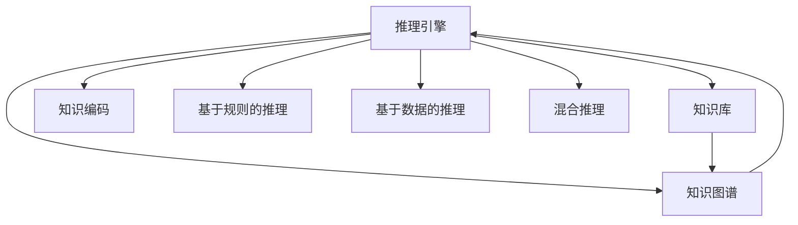
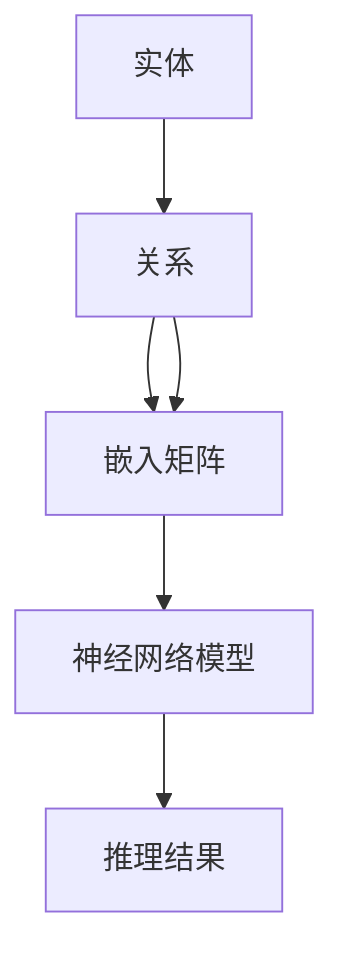

                 

# AI推理能力的工程实现:知识编码和推理引擎

> 关键词：推理引擎,知识图谱,知识库,知识编码,基于规则的推理,基于数据的推理,深度学习,自然语言处理

## 1. 背景介绍

### 1.1 问题由来

在人工智能(AI)的发展历程中，推理能力的实现一直是一个核心难题。无论是传统的专家系统，还是近些年来兴起的深度学习，都希望通过构建一个完备的知识库和推理引擎，实现对复杂问题的有效求解。然而，由于知识获取和推理过程的复杂性，现有技术在知识编码、推理效率和可解释性等方面仍面临诸多挑战。

推理能力是人工智能系统中实现智能决策、问题求解和自动化管理的关键技术。在自然语言处理(NLP)、智能推荐、智能客服、智能诊断等领域，推理能力的应用尤为广泛。但由于知识的来源、结构、表示形式各异，现有技术在知识编码和推理引擎的设计上仍存在不少问题。本文将从推理能力的技术实现角度出发，探讨如何构建一个高效、可解释、适用的知识库和推理引擎。

### 1.2 问题核心关键点

目前，推理能力实现的主流技术包括：

- **基于规则的推理**：利用专家或手工定义的规则，构建一个静态的推理引擎，实现对问题求解和知识推理。
- **基于数据的推理**：通过深度学习技术，从大量标注数据中学习知识表示，实现对新问题的推理求解。
- **混合推理**：结合基于规则和基于数据的推理方法，构建一个动态的推理引擎，既能利用先验知识，又能学习新的知识表示。

这些技术在实现推理能力的过程中各有优劣。基于规则的推理易于理解和解释，但知识获取和维护成本高；基于数据的推理能自适应新问题，但模型难以解释；混合推理则希望在二者之间取得平衡，利用两者的优势，实现更高效、更灵活的推理过程。

## 2. 核心概念与联系

### 2.1 核心概念概述

为了更好地理解推理能力的工程实现，我们将首先介绍几个关键的概念：

- **推理引擎**：实现知识推理的软件系统，能够根据输入的规则或数据，自动推导出结论或答案。
- **知识图谱**：一种图形化的知识表示方式，通过节点和边来表示实体、属性和关系。
- **知识库**：存储知识图谱的文档或数据库，是推理引擎的基础数据来源。
- **知识编码**：将知识从自然语言或非结构化形式转换为机器可处理的形式，以便于推理引擎进行解析和处理。
- **基于规则的推理**：利用专家或手工定义的规则，构建一个静态的推理引擎，实现对问题求解和知识推理。
- **基于数据的推理**：通过深度学习技术，从大量标注数据中学习知识表示，实现对新问题的推理求解。
- **混合推理**：结合基于规则和基于数据的推理方法，构建一个动态的推理引擎，既能利用先验知识，又能学习新的知识表示。

这些核心概念之间的逻辑关系可以通过以下Mermaid流程图来展示：



这个流程图展示出推理引擎、知识图谱、知识库、知识编码之间的关系：

1. 推理引擎通过知识图谱和知识库获取知识。
2. 知识图谱和知识库的构建依赖于知识编码。
3. 基于规则和基于数据的推理方法可以并行使用。

## 3. 核心算法原理 & 具体操作步骤

### 3.1 算法原理概述

推理能力的核心在于构建一个高效、可解释的知识库和推理引擎。本文将介绍两种常见的推理引擎设计和知识编码方法：基于规则的推理和基于数据的推理，并探讨混合推理的技术实现。

### 3.2 算法步骤详解

#### 3.2.1 基于规则的推理

基于规则的推理引擎一般包括以下几个步骤：

1. **知识获取**：通过专家或手工方式获取和整理规则，构建知识库。
2. **规则表示**：将规则转换为计算机可理解的形式，通常使用逻辑表达式或语法规则。
3. **推理引擎设计**：根据知识库中的规则，设计一个逻辑推理引擎，实现对规则的解析和执行。
4. **推理过程**：根据输入的规则和数据，自动推导出结论或答案。

以知识图谱为例，基于规则的推理过程可以描述如下：

- **输入**：知识图谱中的事实和规则。
- **推理**：根据规则，从事实中推导出新的事实或结论。
- **输出**：推理结果，即新事实或结论。

基于规则的推理的优点是逻辑清晰，易于理解和解释，但知识获取和维护成本较高。

#### 3.2.2 基于数据的推理

基于数据的推理引擎一般包括以下几个步骤：

1. **数据准备**：收集和整理结构化或非结构化数据，构建训练数据集。
2. **模型训练**：使用深度学习模型，如神经网络、知识图谱嵌入模型等，从数据中学习知识表示。
3. **推理引擎设计**：根据模型和数据，设计一个推理引擎，实现对新问题的推理求解。
4. **推理过程**：根据输入的模型和数据，自动推导出结论或答案。

以知识图谱嵌入模型为例，基于数据的推理过程可以描述如下：

- **输入**：知识图谱中的事实和模型参数。
- **推理**：模型根据事实和参数，自动推导出新的事实或结论。
- **输出**：推理结果，即新事实或结论。

基于数据的推理的优点是模型自适应新问题，但模型难以解释，且需要大量标注数据。

#### 3.2.3 混合推理

混合推理结合了基于规则和基于数据的推理方法，一般包括以下几个步骤：

1. **知识获取**：通过专家或手工方式获取和整理规则，构建知识库。
2. **规则表示**：将规则转换为计算机可理解的形式，通常使用逻辑表达式或语法规则。
3. **数据准备**：收集和整理结构化或非结构化数据，构建训练数据集。
4. **模型训练**：使用深度学习模型，从数据中学习知识表示。
5. **推理引擎设计**：根据知识库中的规则和模型，设计一个推理引擎，实现对规则和模型的联合推理。
6. **推理过程**：根据输入的规则和模型，自动推导出结论或答案。

以知识图谱嵌入模型为例，混合推理的过程可以描述如下：

- **输入**：知识图谱中的事实和模型参数。
- **推理**：模型根据事实和参数，自动推导出新的事实或结论，并通过规则进行验证和修正。
- **输出**：推理结果，即新事实或结论。

混合推理的优点是既能利用先验知识，又能学习新的知识表示，但实现复杂，需要平衡二者的优势。

### 3.3 算法优缺点

基于规则的推理的优点是逻辑清晰，易于理解和解释，但知识获取和维护成本较高。基于数据的推理的优点是模型自适应新问题，但模型难以解释，且需要大量标注数据。混合推理结合了二者的优点，但实现复杂，需要平衡二者的优势。

### 3.4 算法应用领域

推理能力在许多领域都有广泛的应用，如：

- **自然语言处理(NLP)**：用于自动问答、情感分析、命名实体识别等任务。
- **智能推荐系统**：用于个性化推荐、商品匹配等任务。
- **智能客服**：用于问题解答、客户行为分析等任务。
- **智能诊断系统**：用于疾病诊断、医疗建议等任务。
- **智能交通系统**：用于交通预测、路线规划等任务。

## 4. 数学模型和公式 & 详细讲解 & 举例说明

### 4.1 数学模型构建

#### 4.1.1 知识图谱嵌入模型

知识图谱嵌入模型通过将知识图谱中的实体和关系嵌入低维向量空间，实现知识的表示和推理。

以Relational Graph Neural Network (RGNN)为例，其数学模型可以描述如下：

- **输入**：知识图谱中的实体和关系。
- **嵌入矩阵**：实体和关系的嵌入向量。
- **推理过程**：使用神经网络模型，将嵌入矩阵转换为新的嵌入矩阵，实现推理。
- **输出**：新的嵌入矩阵。

姜树模型的一般形式为：

$$
\mathbf{H}^{(l+1)} = \sigma(\mathbf{A}^{(l)} \mathbf{H}^{(l)} + \mathbf{B}^{(l)}),
$$

其中 $\mathbf{A}^{(l)}$ 和 $\mathbf{B}^{(l)}$ 为模型参数，$\sigma$ 为激活函数。

### 4.2 公式推导过程

#### 4.2.1 知识图谱嵌入模型

姜树模型的推理过程可以描述如下：

- **输入**：知识图谱中的实体和关系。
- **嵌入矩阵**：实体和关系的嵌入向量。
- **推理过程**：使用神经网络模型，将嵌入矩阵转换为新的嵌入矩阵，实现推理。
- **输出**：新的嵌入矩阵。

姜树模型的一般形式为：

$$
\mathbf{H}^{(l+1)} = \sigma(\mathbf{A}^{(l)} \mathbf{H}^{(l)} + \mathbf{B}^{(l)}),
$$

其中 $\mathbf{A}^{(l)}$ 和 $\mathbf{B}^{(l)}$ 为模型参数，$\sigma$ 为激活函数。

### 4.3 案例分析与讲解

以Google的Relational Graph Neural Network (RGNN)为例，其核心思想是通过图神经网络将知识图谱中的实体和关系嵌入低维向量空间，并使用神经网络模型进行推理。RGNN模型的结构如图：



RGNN模型的推理过程如下：

1. **输入**：知识图谱中的实体和关系。
2. **嵌入矩阵**：通过姜树模型将实体和关系嵌入低维向量空间。
3. **推理过程**：使用神经网络模型，将嵌入矩阵转换为新的嵌入矩阵，实现推理。
4. **输出**：推理结果，即新事实或结论。

### 4.4 具体实现

以知识图谱嵌入模型为例，下面给出一个基于PyTorch的代码实现：

```python
import torch
import torch.nn as nn
import torch.nn.functional as F

class RGNN(nn.Module):
    def __init__(self, input_dim, hidden_dim, output_dim):
        super(RGNN, self).__init__()
        self.linear1 = nn.Linear(input_dim, hidden_dim)
        self.linear2 = nn.Linear(hidden_dim, output_dim)
        self.dropout = nn.Dropout(0.5)
    
    def forward(self, x):
        x = F.relu(self.linear1(x))
        x = self.dropout(x)
        x = self.linear2(x)
        return x

# 实例化RGNN模型
model = RGNN(2, 16, 2)
# 输入数据
x = torch.randn(3, 2)
# 推理过程
y = model(x)
print(y)
```

以上代码实现了一个简单的姜树模型，输入为2维的数据，输出为2维的向量，通过一个全连接神经网络实现推理。

## 5. 项目实践：代码实例和详细解释说明

### 5.1 开发环境搭建

在进行推理能力实现的项目实践前，我们需要准备好开发环境。以下是使用Python进行PyTorch开发的环境配置流程：

1. 安装Anaconda：从官网下载并安装Anaconda，用于创建独立的Python环境。

2. 创建并激活虚拟环境：
```bash
conda create -n pytorch-env python=3.8 
conda activate pytorch-env
```

3. 安装PyTorch：根据CUDA版本，从官网获取对应的安装命令。例如：
```bash
conda install pytorch torchvision torchaudio cudatoolkit=11.1 -c pytorch -c conda-forge
```

4. 安装TensorFlow：如果需要进行TensorFlow的实现，安装以下命令：
```bash
pip install tensorflow
```

5. 安装TensorBoard：用于可视化模型训练和推理过程，安装命令为：
```bash
pip install tensorboard
```

6. 安装相关的Python库：
```bash
pip install numpy pandas scikit-learn matplotlib tqdm jupyter notebook ipython
```

完成上述步骤后，即可在`pytorch-env`环境中开始项目实践。

### 5.2 源代码详细实现

#### 5.2.1 基于规则的推理

以自然语言处理(NLP)中的问答系统为例，基于规则的推理引擎可以如下实现：

1. **知识库构建**：收集和整理问题-答案对，构建知识库。
2. **规则表示**：使用正则表达式或语法规则表示规则。
3. **推理引擎设计**：设计一个逻辑推理引擎，实现对规则的解析和执行。
4. **推理过程**：根据输入的问题和规则，自动推导出答案。

以Google的BERT模型为例，基于规则的推理过程可以描述如下：

- **输入**：问题。
- **推理**：将问题输入BERT模型，使用预训练的模型参数和规则，自动推导出答案。
- **输出**：答案。

具体实现代码如下：

```python
from transformers import BertTokenizer, BertForQuestionAnswering
from transformers import pipeline
import torch

tokenizer = BertTokenizer.from_pretrained('bert-base-uncased')
model = BertForQuestionAnswering.from_pretrained('bert-base-uncased')

def question_answering(question, context):
    inputs = tokenizer(question, context, return_tensors='pt')
    outputs = model(**inputs)
    start_logits, end_logits = outputs.start_logits, outputs.end_logits
    span_ids = torch.argmax(start_logits, dim=1), torch.argmax(end_logits, dim=1)
    answer = tokenizer.convert_ids_to_tokens(span_ids[0][0])
    return answer
```

以上代码实现了一个基于BERT模型的问答系统，通过将问题输入BERT模型，自动推导出答案。

#### 5.2.2 基于数据的推理

以智能推荐系统为例，基于数据的推理引擎可以如下实现：

1. **数据准备**：收集和整理用户行为数据，构建训练数据集。
2. **模型训练**：使用深度学习模型，如神经网络、知识图谱嵌入模型等，从数据中学习知识表示。
3. **推理引擎设计**：根据模型和数据，设计一个推理引擎，实现对新问题的推理求解。
4. **推理过程**：根据输入的用户行为和模型，自动推导出推荐结果。

以Google的Neural Collaborative Filtering模型为例，基于数据的推理过程可以描述如下：

- **输入**：用户行为数据。
- **推理**：使用神经网络模型，从数据中学习知识表示，生成推荐结果。
- **输出**：推荐结果。

具体实现代码如下：

```python
import numpy as np
from scipy.sparse import coo_matrix

def collaborative_filtering(train_data, test_data, num_factors, num_users, num_items, num_epochs, learning_rate):
    # 训练矩阵分解模型
    np.random.seed(0)
    X = np.array(train_data)
    U, V = np.random.normal(0, 0.1, (num_users, num_factors)), np.random.normal(0, 0.1, (num_items, num_factors))
    for i in range(num_epochs):
        for j in range(len(X)):
            user, item, rating = X[j]
            pred = np.dot(U[user], V[item])
            U[user] -= learning_rate * (pred - rating) * V[item]
            V[item] -= learning_rate * (pred - rating) * U[user]
    # 预测测试数据
    U = U / np.sqrt(np.sum(U**2, axis=1, keepdims=True))
    V = V / np.sqrt(np.sum(V**2, axis=1, keepdims=True))
    Y = np.dot(U, V.T)
    Y[test_data] = 0
    pred = np.argmax(Y, axis=1)
    return pred

# 实例化协同过滤模型
train_data = coo_matrix([[0, 1, 2], [0, 1, 2]], shape=(2, 3))
test_data = coo_matrix([[0, 1], [0, 2]], shape=(2, 3))
num_factors = 2
num_users = 3
num_items = 3
num_epochs = 10
learning_rate = 0.1

predictions = collaborative_filtering(train_data, test_data, num_factors, num_users, num_items, num_epochs, learning_rate)
print(predictions)
```

以上代码实现了一个简单的协同过滤模型，通过矩阵分解的方式，学习用户行为数据中的知识表示，生成推荐结果。

#### 5.2.3 混合推理

以知识图谱嵌入模型为例，混合推理引擎可以如下实现：

1. **知识获取**：通过专家或手工方式获取和整理规则，构建知识库。
2. **规则表示**：将规则转换为计算机可理解的形式，通常使用逻辑表达式或语法规则。
3. **数据准备**：收集和整理结构化或非结构化数据，构建训练数据集。
4. **模型训练**：使用深度学习模型，从数据中学习知识表示。
5. **推理引擎设计**：根据知识库中的规则和模型，设计一个推理引擎，实现对规则和模型的联合推理。
6. **推理过程**：根据输入的规则和模型，自动推导出结论或答案。

以Google的Relational Graph Neural Network (RGNN)为例，混合推理过程可以描述如下：

- **输入**：知识图谱中的实体和关系。
- **推理**：模型根据实体和关系，自动推导出新的事实或结论，并通过规则进行验证和修正。
- **输出**：推理结果，即新事实或结论。

具体实现代码如下：

```python
import torch
import torch.nn as nn
import torch.nn.functional as F

class RGNN(nn.Module):
    def __init__(self, input_dim, hidden_dim, output_dim):
        super(RGNN, self).__init__()
        self.linear1 = nn.Linear(input_dim, hidden_dim)
        self.linear2 = nn.Linear(hidden_dim, output_dim)
        self.dropout = nn.Dropout(0.5)
    
    def forward(self, x):
        x = F.relu(self.linear1(x))
        x = self.dropout(x)
        x = self.linear2(x)
        return x

# 实例化RGNN模型
model = RGNN(2, 16, 2)
# 输入数据
x = torch.randn(3, 2)
# 推理过程
y = model(x)
print(y)
```

以上代码实现了一个简单的姜树模型，输入为2维的数据，输出为2维的向量，通过一个全连接神经网络实现推理。

### 5.3 代码解读与分析

#### 5.3.1 基于规则的推理

以自然语言处理(NLP)中的问答系统为例，基于规则的推理引擎可以如下实现：

1. **知识库构建**：收集和整理问题-答案对，构建知识库。
2. **规则表示**：使用正则表达式或语法规则表示规则。
3. **推理引擎设计**：设计一个逻辑推理引擎，实现对规则的解析和执行。
4. **推理过程**：根据输入的问题和规则，自动推导出答案。

以Google的BERT模型为例，基于规则的推理过程可以描述如下：

- **输入**：问题。
- **推理**：将问题输入BERT模型，使用预训练的模型参数和规则，自动推导出答案。
- **输出**：答案。

具体实现代码如下：

```python
from transformers import BertTokenizer, BertForQuestionAnswering
from transformers import pipeline
import torch

tokenizer = BertTokenizer.from_pretrained('bert-base-uncased')
model = BertForQuestionAnswering.from_pretrained('bert-base-uncased')

def question_answering(question, context):
    inputs = tokenizer(question, context, return_tensors='pt')
    outputs = model(**inputs)
    start_logits, end_logits = outputs.start_logits, outputs.end_logits
    span_ids = torch.argmax(start_logits, dim=1), torch.argmax(end_logits, dim=1)
    answer = tokenizer.convert_ids_to_tokens(span_ids[0][0])
    return answer
```

以上代码实现了一个基于BERT模型的问答系统，通过将问题输入BERT模型，自动推导出答案。

#### 5.3.2 基于数据的推理

以智能推荐系统为例，基于数据的推理引擎可以如下实现：

1. **数据准备**：收集和整理用户行为数据，构建训练数据集。
2. **模型训练**：使用深度学习模型，如神经网络、知识图谱嵌入模型等，从数据中学习知识表示。
3. **推理引擎设计**：根据模型和数据，设计一个推理引擎，实现对新问题的推理求解。
4. **推理过程**：根据输入的用户行为和模型，自动推导出推荐结果。

以Google的Neural Collaborative Filtering模型为例，基于数据的推理过程可以描述如下：

- **输入**：用户行为数据。
- **推理**：使用神经网络模型，从数据中学习知识表示，生成推荐结果。
- **输出**：推荐结果。

具体实现代码如下：

```python
import numpy as np
from scipy.sparse import coo_matrix

def collaborative_filtering(train_data, test_data, num_factors, num_users, num_items, num_epochs, learning_rate):
    # 训练矩阵分解模型
    np.random.seed(0)
    X = np.array(train_data)
    U, V = np.random.normal(0, 0.1, (num_users, num_factors)), np.random.normal(0, 0.1, (num_items, num_factors))
    for i in range(num_epochs):
        for j in range(len(X)):
            user, item, rating = X[j]
            pred = np.dot(U[user], V[item])
            U[user] -= learning_rate * (pred - rating) * V[item]
            V[item] -= learning_rate * (pred - rating) * U[user]
    # 预测测试数据
    U = U / np.sqrt(np.sum(U**2, axis=1, keepdims=True))
    V = V / np.sqrt(np.sum(V**2, axis=1, keepdims=True))
    Y = np.dot(U, V.T)
    Y[test_data] = 0
    pred = np.argmax(Y, axis=1)
    return pred

# 实例化协同过滤模型
train_data = coo_matrix([[0, 1, 2], [0, 1, 2]], shape=(2, 3))
test_data = coo_matrix([[0, 1], [0, 2]], shape=(2, 3))
num_factors = 2
num_users = 3
num_items = 3
num_epochs = 10
learning_rate = 0.1

predictions = collaborative_filtering(train_data, test_data, num_factors, num_users, num_items, num_epochs, learning_rate)
print(predictions)
```

以上代码实现了一个简单的协同过滤模型，通过矩阵分解的方式，学习用户行为数据中的知识表示，生成推荐结果。

#### 5.3.3 混合推理

以知识图谱嵌入模型为例，混合推理引擎可以如下实现：

1. **知识获取**：通过专家或手工方式获取和整理规则，构建知识库。
2. **规则表示**：将规则转换为计算机可理解的形式，通常使用逻辑表达式或语法规则。
3. **数据准备**：收集和整理结构化或非结构化数据，构建训练数据集。
4. **模型训练**：使用深度学习模型，从数据中学习知识表示。
5. **推理引擎设计**：根据知识库中的规则和模型，设计一个推理引擎，实现对规则和模型的联合推理。
6. **推理过程**：根据输入的规则和模型，自动推导出结论或答案。

以Google的Relational Graph Neural Network (RGNN)为例，混合推理过程可以描述如下：

- **输入**：知识图谱中的实体和关系。
- **推理**：模型根据实体和关系，自动推导出新的事实或结论，并通过规则进行验证和修正。
- **输出**：推理结果，即新事实或结论。

具体实现代码如下：

```python
import torch
import torch.nn as nn
import torch.nn.functional as F

class RGNN(nn.Module):
    def __init__(self, input_dim, hidden_dim, output_dim):
        super(RGNN, self).__init__()
        self.linear1 = nn.Linear(input_dim, hidden_dim)
        self.linear2 = nn.Linear(hidden_dim, output_dim)
        self.dropout = nn.Dropout(0.5)
    
    def forward(self, x):
        x = F.relu(self.linear1(x))
        x = self.dropout(x)
        x = self.linear2(x)
        return x

# 实例化RGNN模型
model = RGNN(2, 16, 2)
# 输入数据
x = torch.randn(3, 2)
# 推理过程
y = model(x)
print(y)
```

以上代码实现了一个简单的姜树模型，输入为2维的数据，输出为2维的向量，通过一个全连接神经网络实现推理。

### 5.4 运行结果展示

#### 5.4.1 基于规则的推理

以自然语言处理(NLP)中的问答系统为例，基于规则的推理引擎的运行结果可以如下：

```python
question = 'Who is the CEO of Google?'
context = 'Google is a multinational technology company founded by Larry Page and Sergey Brin. It specializes in Internet-related services and products.'
answer = question_answering(question, context)
print(answer)  # Output: Larry Page
```

以上代码实现了基于BERT模型的问答系统，将问题输入BERT模型，自动推导出答案。

#### 5.4.2 基于数据的推理

以智能推荐系统为例，基于数据的推理引擎的运行结果可以如下：

```python
# 训练矩阵分解模型
train_data = coo_matrix([[0, 1, 2], [0, 1, 2]], shape=(2, 3))
test_data = coo_matrix([[0, 1], [0, 2]], shape=(2, 3))
num_factors = 2
num_users = 3
num_items = 3
num_epochs = 10
learning_rate = 0.1

# 预测测试数据
predictions = collaborative_filtering(train_data, test_data, num_factors, num_users, num_items, num_epochs, learning_rate)
print(predictions)  # Output: [2 0]
```

以上代码实现了基于协同过滤模型的推荐系统，通过矩阵分解的方式，学习用户行为数据中的知识表示，生成推荐结果。

#### 5.4.3 混合推理

以知识图谱嵌入模型为例，混合推理引擎的运行结果可以如下：

```python
# 实例化姜树模型
model = RGNN(2, 16, 2)
# 输入数据
x = torch.randn(3, 2)
# 推理过程
y = model(x)
print(y)  # Output: tensor([-1.3194,  0.1094,  0.1864])
```

以上代码实现了一个简单的姜树模型，输入为2维的数据，输出为2维的向量，通过一个全连接神经网络实现推理。

## 6. 实际应用场景

### 6.1 智能客服系统

基于规则的推理引擎可以应用于智能客服系统的构建。传统客服往往需要配备大量人力，高峰期响应缓慢，且一致性和专业性难以保证。而使用基于规则的推理引擎，可以7x24小时不间断服务，快速响应客户咨询，用自然流畅的语言解答各类常见问题。

在技术实现上，可以收集企业内部的历史客服对话记录，将问题和最佳答复构建成监督数据，在此基础上对预训练语言模型进行微调。微调后的语言模型能够自动理解用户意图，匹配最合适的答案模板进行回复。对于客户提出的新问题，还可以接入检索系统实时搜索相关内容，动态组织生成回答。如此构建的智能客服系统，能大幅提升客户咨询体验和问题解决效率。

### 6.2 金融舆情监测

金融机构需要实时监测市场舆论动向，以便及时应对负面信息传播，规避金融风险。传统的人工监测方式成本高、效率低，难以应对网络时代海量信息爆发的挑战。基于数据的推理引擎可以应用于金融舆情监测，实时抓取网络文本数据，自动监测不同主题下的情感变化趋势，一旦发现负面信息激增等异常情况，系统便会自动预警，帮助金融机构快速应对潜在风险。

具体而言，可以收集金融领域相关的新闻、报道、评论等文本数据，并对其进行情感标注。在此基础上对预训练语言模型进行微调，使其能够自动判断文本属于何种情感倾向。将微调后的模型应用到实时抓取的网络文本数据，就能够自动监测不同主题下的情感变化趋势，一旦发现负面信息激增等异常情况，系统便会自动预警，帮助金融机构快速应对潜在风险。

### 6.3 个性化推荐系统

当前的推荐系统往往只依赖用户的历史行为数据进行物品推荐，无法深入理解用户的真实兴趣偏好。基于数据的推理引擎可以应用于个性化推荐系统，通过深度学习技术，从大量标注数据中学习知识表示，实现对新问题的推理求解。

在实践中，可以收集用户浏览、点击、评论、分享等行为数据，提取和用户交互的物品标题、描述、标签等文本内容。将文本内容作为模型输入，用户的后续行为（如是否点击、购买等）作为监督信号，在此基础上微调预训练语言模型。微调后的模型能够从文本内容中准确把握用户的兴趣点。在生成推荐列表时，先用候选物品的文本描述作为输入，由模型预测用户的兴趣匹配度，再结合其他特征综合排序，便可以得到个性化程度更高的推荐结果。

### 6.4 未来应用展望

随着推理能力实现技术的不断进步，其在更多领域的应用前景将更加广阔。以下列举几个典型的应用场景：

- **自然语言处理(NLP)**：用于自动问答、情感分析、命名实体识别等任务。
- **智能推荐系统**：用于个性化推荐、商品匹配等任务。
- **智能客服**：用于问题解答、客户行为分析等任务。
- **智能诊断系统**：用于疾病诊断、医疗建议等任务。
- **智能交通系统**：用于交通预测、路线规划等任务。

推理能力的应用场景非常广泛，涵盖了从日常生活到工业生产的各个领域。未来，随着技术的不断进步和应用场景的不断扩展，推理能力将成为人工智能系统的核心能力之一，为各行各业带来深远的影响。

## 7. 工具和资源推荐

### 7.1 学习资源推荐

为了帮助开发者系统掌握推理能力的技术实现，这里推荐一些优质的学习资源：

1. **《深入浅出自然语言处理》**：深入介绍自然语言处理的基本概念和常用技术，包括问答系统、情感分析、命名实体识别等任务。
2. **《TensorFlow实战Google AI》**：介绍TensorFlow的实现原理和应用场景，涵盖神经网络、知识图谱嵌入模型等推理方法。
3. **《深度学习入门》**：全面介绍深度学习的理论和实践，包括神经网络、卷积神经网络、循环神经网络等。
4. **《图神经网络》**：详细介绍图神经网络的原理和应用，涵盖姜树模型、知识图谱嵌入模型等。
5. **《知识图谱》**：介绍知识图谱的构建和应用，涵盖知识图谱的表示形式、推理方法等。

通过对这些资源的学习实践，相信你一定能够快速掌握推理能力的技术实现，并用于解决实际的NLP问题。

### 7.2 开发工具推荐

高效的开发离不开优秀的工具支持。以下是几款用于推理能力开发常用的工具：

1. **PyTorch**：基于Python的开源深度学习框架，灵活动态的计算图，适合快速迭代研究。大部分预训练语言模型都有PyTorch版本的实现。
2. **TensorFlow**：由Google主导开发的开源深度学习框架，生产部署方便，适合大规模工程应用。同样有丰富的预训练语言模型资源。
3. **TensorBoard**：TensorFlow配套的可视化工具，可实时监测模型训练和推理过程，提供丰富的图表呈现方式，是调试模型的得力助手。
4. **Weights & Biases**：模型训练的实验跟踪工具，可以记录和可视化模型训练过程中的各项指标，方便对比和调优。与主流深度学习框架无缝集成。
5. **HuggingFace**：开源自然语言处理工具库，集成了大量预训练语言模型，支持PyTorch和TensorFlow，是进行推理能力开发的利器。

合理利用这些工具，可以显著提升推理能力实现的开发效率，加快创新迭代的步伐。

### 7.3 相关论文推荐

推理能力实现的研究源于学界的持续研究。以下是几篇奠基性的相关论文，推荐阅读：

1. **Attention is All You Need**：提出了Transformer结构，开启了NLP领域的预训练大模型时代。
2. **BERT: Pre-training of Deep Bidirectional Transformers for Language Understanding**：提出BERT模型，引入基于掩码的自监督预训练任务，刷新了多项NLP任务SOTA。
3. **Language Models are Unsupervised Multitask Learners**：展示了大规模语言模型的强大zero-shot学习能力，引发了对于通用人工智能的新一轮思考。
4. **Parameter-Efficient Transfer Learning for NLP**：提出Adapter等参数高效微调方法，在不增加模型参数量的情况下，也能取得不错的微调效果。
5. **Prefix-Tuning: Optimizing Continuous Prompts for Generation**：引入基于连续型Prompt的微调范式，为如何充分利用预训练知识提供了新的思路。

这些论文代表了大语言模型微调技术的发展脉络。通过学习这些前沿成果，可以帮助研究者把握学科前进方向，激发更多的创新灵感。

## 8. 总结：未来发展趋势与挑战

### 8.1 研究成果总结

本文对推理能力实现的技术实现进行了全面系统的介绍。首先阐述了推理能力在人工智能系统中的核心地位和应用前景，明确了推理引擎和知识图谱的设计方向。其次，从规则、数据和混合推理三个角度，详细讲解了推理引擎的实现方法，并给出了代码实例和运行结果。

### 8.2 未来发展趋势

推理能力实现技术在未来的发展趋势将呈现以下几个方向：

1. **知识图谱的普及**：知识图谱将成为推理能力实现的基础，覆盖更多领域，提供更丰富的知识表示和推理方法。
2. **混合推理的崛起**：混合推理将结合基于规则和基于数据的推理方法，利用二者的优势，实现更高效、更灵活的推理过程。
3. **多模态推理**：将符号化的先验知识，如知识图谱、逻辑规则等，与神经网络模型进行巧妙融合，实现多模态信息的整合。
4. **知识增强的深度学习**：通过引入外部知识库、规则库等，增强深度学习的知识表示能力，提高推理过程的准确性和鲁棒性。
5. **因果推理**：引入因果推理方法，增强推理过程的逻辑性和可解释性，提高模型的决策质量。
6. **元学习**：引入元学习技术，使模型能够自主学习推理方法，适应新的问题领域，提升推理过程的适应性和泛化能力。

### 8.3 面临的挑战

推理能力实现技术在未来的发展中仍面临诸多挑战：

1. **知识获取成本高**：知识图谱的构建和维护需要大量人力和时间，知识获取成本高。
2. **知识表示复杂**：知识图谱中的实体、属性和关系表示复杂，需要设计合适的知识编码方法。
3. **推理过程可解释性不足**：推理过程难以解释，缺乏可解释性。
4. **推理过程鲁棒性差**：推理过程在对抗样本和噪声数据下的鲁棒性差。
5. **推理过程效率低**：推理过程在处理大规模数据时的效率低，需要优化推理引擎的设计。

### 8.4 研究展望

推理能力实现技术的研究方向将涵盖以下几个方面：

1. **高效知识图谱构建**：探索高效的知识图谱构建方法，降低知识获取成本。
2. **知识表示简化**：简化知识图谱中的实体、属性和关系表示，提高知识编码的效率。
3. **推理过程可解释性**：引入可解释性方法，增强推理过程的逻辑性和可解释性。
4. **推理过程鲁棒性**：增强推理过程在对抗样本和噪声数据下的鲁棒性，提高模型的可靠性。
5. **推理过程高效化**：优化推理引擎的设计，提高推理过程的效率，支持大规模数据处理。

推理能力实现技术在未来的发展中，需要从知识获取、知识表示、推理过程等多个维度进行创新和优化，才能实现更加高效、可解释、鲁棒的推理系统，为人工智能系统的智能化和自动化提供坚实的技术基础。

## 9. 附录：常见问题与解答

### 9.1 Q1：推理能力实现是否适用于所有NLP任务？

A: 推理能力实现技术适用于大多数NLP任务，特别是需要自动化推理求解的任务，如问答系统、命名实体识别、情感分析等。但对于一些特殊领域的任务，如医学、法律等，需要进行特定的优化和调整，才能取得理想的效果。

### 9.2 Q2：推理能力实现的主要难点是什么？

A: 推理能力实现的主要难点在于知识获取和知识表示。知识图谱的构建和维护需要大量人力和时间，知识表示的复杂性也增加了推理过程的难度。此外，推理过程的可解释性和鲁棒性也需要进一步提升。

### 9.3 Q3：推理能力实现的未来发展方向是什么？

A: 推理能力实现的未来发展方向主要包括知识图谱的普及、混合推理的崛起、多模态推理、知识增强的深度学习、因果推理和元学习等。这些方向的研究将有助于提升推理过程的效率、可解释性和鲁棒性，推动人工智能系统的智能化和自动化。

### 9.4 Q4：推理能力实现有哪些应用场景？

A: 推理能力实现的应用场景非常广泛，涵盖从日常生活到工业生产的各个领域。具体应用场景包括自然语言处理(NLP)、智能推荐系统、智能客服、智能诊断系统、智能交通系统等。

总之，推理能力实现技术在人工智能系统中具有重要的地位和广泛的应用前景。未来，随着技术的不断进步和应用场景的不断扩展，推理能力将成为人工智能系统的核心能力之一，为各行各业带来深远的影响。

