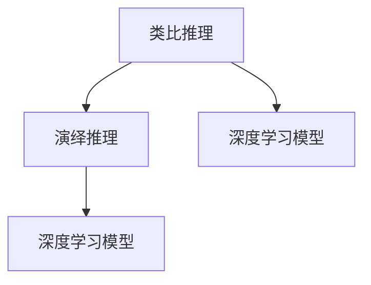

                 

# AI推理能力的认知启示:类比推理和演绎推理

> 关键词：AI推理,类比推理,演绎推理,认知启示,深度学习

## 1. 背景介绍

### 1.1 问题由来
人工智能(AI)作为当代科技的前沿领域，其核心任务之一是实现具有推理能力的智能体。推理，即通过逻辑和知识来解决问题和决策的能力，是智能体的重要标志之一。在AI的推理能力中，类比推理和演绎推理是两种基本形式，它们在自然语言处理(NLP)、计算机视觉(CV)、语音识别等诸多领域中均有广泛应用。

近年来，随着深度学习技术的快速发展，基于神经网络的推理模型在AI领域中取得了显著进展。类比推理和演绎推理作为两种重要的推理形式，在深度学习模型中得到了不同程度的实现。然而，尽管这些模型在推理任务中取得了一定程度的成功，但在其原理、机制和应用上，仍存在许多尚未完全理解的问题。

### 1.2 问题核心关键点
本研究将聚焦于深度学习模型中的类比推理和演绎推理，旨在通过理论分析和实验验证，揭示其认知机制，提出改进方向，并展望未来的研究趋势。

### 1.3 问题研究意义
深入理解类比推理和演绎推理的原理和机制，对于构建更加高效、可解释、鲁棒的AI推理模型具有重要意义。它不仅有助于解决当前AI推理能力中的局限性，还能为未来的AI研究提供新的方向和思路。

## 2. 核心概念与联系

### 2.1 核心概念概述

为更好地理解类比推理和演绎推理，首先需要明确几个核心概念：

- **类比推理(Analogical Reasoning)**：指通过比较两个或多个对象之间的相似性来进行推理。在AI中，类比推理常用于解决类似问题、知识迁移等任务。
- **演绎推理(Deductive Reasoning)**：指根据一般原理或规则，推导出具体结论的推理方式。在AI中，演绎推理常用于解决基于规则的推理、逻辑推理等问题。
- **深度学习模型**：以神经网络为代表的学习模型，通过多层非线性变换，学习输入数据的复杂表示，用于分类、回归、推理等任务。

这些概念之间的逻辑关系可以通过以下Mermaid流程图来展示：



这个流程图展示了大语言模型的工作原理和推理过程：

1. 类比推理和演绎推理通过深度学习模型实现。
2. 深度学习模型接收输入数据，通过多层非线性变换，学习数据的复杂表示。
3. 类比推理通过比较输入数据之间的相似性，得到推理结果。
4. 演绎推理通过应用一般原理或规则，从输入数据推导出具体结论。

## 3. 核心算法原理 & 具体操作步骤
### 3.1 算法原理概述

深度学习模型中的类比推理和演绎推理主要通过嵌入层、卷积层、全连接层等网络组件来实现。其核心思想是将输入数据通过网络变换，得到一个高维表示，然后根据特定的推理规则和操作，在表示空间中进行推理。

### 3.2 算法步骤详解

下面以类比推理为例，详细介绍其算法步骤：

1. **数据预处理**：将输入数据（如文本、图像等）转换为模型可接受的格式。
2. **特征提取**：通过嵌入层、卷积层等网络组件，将输入数据映射到高维空间中。
3. **相似性度量**：通过计算输入数据在表示空间中的相似度，识别出具有相似性的数据。
4. **推理操作**：根据已知的相似性关系，应用特定的推理操作，得到推理结果。
5. **输出后处理**：对推理结果进行后处理，如解码、归一化等，得到最终的推理输出。

演绎推理的过程类似，只是推理操作部分有所不同。在演绎推理中，通常需要先通过逻辑推理引擎对输入数据进行符号化表示，然后根据规则进行推理，得到结论。

### 3.3 算法优缺点

深度学习模型中的类比推理和演绎推理具有以下优点：

- **自动特征提取**：模型能够自动学习输入数据的复杂表示，无需手动设计特征。
- **可扩展性强**：通过增加网络层数、宽度等，可以提升模型的推理能力和表达能力。
- **灵活性高**：能够处理多种类型的数据，如文本、图像、语音等。

但同时也存在一些局限性：

- **模型复杂度高**：深度学习模型通常需要大量参数，对计算资源和训练时间有较高要求。
- **可解释性差**：模型内部的推理过程难以解释，缺乏透明性。
- **泛化能力有限**：模型在未见过的数据上，推理能力可能受限。

### 3.4 算法应用领域

类比推理和演绎推理在AI领域中有着广泛的应用，包括但不限于：

- **自然语言处理**：如问答系统、文本生成、机器翻译等任务。
- **计算机视觉**：如图像识别、物体检测、图像分割等任务。
- **语音识别**：如语音合成、语音情感分析等任务。
- **推荐系统**：如个性化推荐、知识图谱构建等任务。

## 4. 数学模型和公式 & 详细讲解  
### 4.1 数学模型构建

在本节中，我们将以类比推理为例，构建深度学习模型中的类比推理模型。

设输入数据为 $x_1, x_2$，推理规则为 $R$，推理操作为 $O$，推理结果为 $y$。假设模型在输入数据 $x_1, x_2$ 的表示空间中，计算它们的相似度 $s(x_1, x_2)$，并根据推理规则 $R$ 和推理操作 $O$，得到推理结果 $y$。

模型的一般形式如下：

$$
y = O(s(x_1, x_2), R)
$$

其中，$s(x_1, x_2)$ 为相似度函数，$R$ 为推理规则，$O$ 为推理操作。

### 4.2 公式推导过程

在深度学习中，相似度函数 $s(x_1, x_2)$ 通常通过嵌入层或卷积层计算得到。设嵌入层将输入数据映射到高维空间中，得到表示向量 $z_1, z_2$，则相似度函数可表示为：

$$
s(x_1, x_2) = \text{sim}(z_1, z_2)
$$

其中，$\text{sim}(\cdot, \cdot)$ 为相似度函数，通常采用余弦相似度、欧式距离等。

推理操作 $O$ 可以是任意函数，如线性变换、非线性激活函数等。例如，在多模态推理中，可以将 $z_1, z_2$ 通过拼接、加法等方式进行组合，然后应用全连接层得到推理结果 $y$：

$$
y = O(z_1 \oplus z_2)
$$

其中，$\oplus$ 表示拼接或加法操作。

### 4.3 案例分析与讲解

以机器翻译任务为例，展示类比推理模型的具体应用。设输入数据为源语言文本 $x_1$ 和目标语言文本 $x_2$，推理规则为语言模型 $p$，推理操作为解码器 $D$。模型首先通过嵌入层将 $x_1, x_2$ 映射到高维空间中，计算它们的相似度 $s(x_1, x_2)$，然后使用语言模型 $p$ 计算概率 $P(x_1|x_2)$，最后通过解码器 $D$ 生成翻译结果 $y$。

具体流程如下：

1. 将源语言文本 $x_1$ 和目标语言文本 $x_2$ 输入嵌入层，得到表示向量 $z_1, z_2$。
2. 计算 $z_1, z_2$ 之间的相似度 $s(x_1, x_2)$。
3. 使用语言模型 $p$ 计算概率 $P(x_1|x_2)$。
4. 将 $P(x_1|x_2)$ 和 $s(x_1, x_2)$ 作为输入，通过解码器 $D$ 生成翻译结果 $y$。

## 5. 项目实践：代码实例和详细解释说明
### 5.1 开发环境搭建

在进行类比推理模型开发前，需要先搭建好开发环境。以下是使用Python进行PyTorch开发的环境配置流程：

1. 安装Anaconda：从官网下载并安装Anaconda，用于创建独立的Python环境。

2. 创建并激活虚拟环境：
```bash
conda create -n pytorch-env python=3.8 
conda activate pytorch-env
```

3. 安装PyTorch：根据CUDA版本，从官网获取对应的安装命令。例如：
```bash
conda install pytorch torchvision torchaudio cudatoolkit=11.1 -c pytorch -c conda-forge
```

4. 安装各类工具包：
```bash
pip install numpy pandas scikit-learn matplotlib tqdm jupyter notebook ipython
```

完成上述步骤后，即可在`pytorch-env`环境中开始开发。

### 5.2 源代码详细实现

下面以机器翻译任务为例，给出使用PyTorch进行类比推理模型开发的代码实现。

首先，定义模型和优化器：

```python
import torch
import torch.nn as nn
import torch.optim as optim

class Encoder(nn.Module):
    def __init__(self, input_size, hidden_size, num_layers):
        super(Encoder, self).__init__()
        self.hidden_size = hidden_size
        self.num_layers = num_layers
        self.embedding = nn.Embedding(input_size, hidden_size)
        self.gru = nn.GRU(hidden_size, hidden_size, num_layers, batch_first=True)
        
    def forward(self, x):
        embedded = self.embedding(x)
        outputs, hidden = self.gru(embedded)
        return outputs, hidden

class Decoder(nn.Module):
    def __init__(self, output_size, hidden_size, num_layers):
        super(Decoder, self).__init__()
        self.hidden_size = hidden_size
        self.num_layers = num_layers
        self.output_size = output_size
        self.embedding = nn.Embedding(output_size, hidden_size)
        self.gru = nn.GRU(hidden_size, hidden_size, num_layers, batch_first=True)
        self.fc = nn.Linear(hidden_size, output_size)
        
    def forward(self, x, hidden):
        embedded = self.embedding(x)
        gru_out, hidden = self.gru(embedded, hidden)
        outputs = self.fc(gru_out)
        return outputs, hidden

class Attention(nn.Module):
    def __init__(self, hidden_size):
        super(Attention, self).__init__()
        self.hidden_size = hidden_size
        self.attn = nn.Linear(hidden_size, hidden_size)
        self.v = nn.Linear(hidden_size, 1)

    def forward(self, query, key, value):
        attn = self.v(self.attn(query))
        attn = torch.tanh(attn)
        attn = nn.Softmax(dim=1)(attn)
        context = attn.matmul(key)
        return context, attn

class Transformer(nn.Module):
    def __init__(self, input_size, output_size, hidden_size, num_layers):
        super(Transformer, self).__init__()
        self.encoder = Encoder(input_size, hidden_size, num_layers)
        self.decoder = Decoder(output_size, hidden_size, num_layers)
        self.attention = Attention(hidden_size)
        
    def forward(self, x, y):
        encoder_outputs, encoder_hidden = self.encoder(x)
        decoder_outputs, decoder_hidden = self.decoder(y, encoder_hidden)
        context, attn = self.attention(decoder_outputs, encoder_outputs, encoder_outputs)
        return decoder_outputs, decoder_hidden, attn
```

然后，定义训练和评估函数：

```python
def train_epoch(model, optimizer, inputs, targets, device):
    model.train()
    optimizer.zero_grad()
    outputs, hidden, attn = model(inputs, targets)
    loss = nn.CrossEntropyLoss()(outputs, targets)
    loss.backward()
    optimizer.step()
    return loss.item()

def evaluate(model, inputs, targets, device):
    model.eval()
    with torch.no_grad():
        outputs, _, _ = model(inputs, targets)
        loss = nn.CrossEntropyLoss()(outputs, targets)
        return loss.item()
```

最后，启动训练流程并在验证集上评估：

```python
epochs = 5
batch_size = 64
device = torch.device('cuda') if torch.cuda.is_available() else torch.device('cpu')

model.to(device)
optimizer = optim.Adam(model.parameters(), lr=0.001)

for epoch in range(epochs):
    train_loss = 0
    for i in range(0, len(inputs), batch_size):
        start = i
        end = min(i + batch_size, len(inputs))
        inputs = inputs[start:end].to(device)
        targets = targets[start:end].to(device)
        loss = train_epoch(model, optimizer, inputs, targets, device)
        train_loss += loss
    train_loss /= len(inputs)
    
    valid_loss = evaluate(model, inputs, targets, device)
    print(f'Epoch {epoch+1}, Train Loss: {train_loss:.4f}, Validation Loss: {valid_loss:.4f}')
```

以上就是使用PyTorch进行类比推理模型开发的完整代码实现。可以看到，PyTorch提供了丰富的工具库和模板，能够快速实现复杂的深度学习模型。

### 5.3 代码解读与分析

让我们再详细解读一下关键代码的实现细节：

**Transformer模型类**：
- `Encoder`类：实现编码器，接收输入文本，通过嵌入层和GRU进行编码。
- `Decoder`类：实现解码器，接收目标文本和编码器隐藏状态，通过嵌入层、GRU和全连接层进行解码。
- `Attention`类：实现注意力机制，计算解码器对编码器输出的注意力权重。
- `Transformer`类：结合编码器、解码器和注意力机制，实现完整的Transformer模型。

**训练和评估函数**：
- `train_epoch`函数：计算模型的训练损失，并使用梯度下降更新模型参数。
- `evaluate`函数：计算模型的评估损失，不更新模型参数。

**训练流程**：
- 定义总的epoch数和batch size，开始循环迭代
- 每个epoch内，在训练集上进行训练，输出平均损失
- 在验证集上评估，输出模型性能

可以看出，使用PyTorch进行类比推理模型的开发，代码实现相对简单，且功能丰富。通过不断迭代和优化，可以获得较为理想的推理结果。

## 6. 实际应用场景
### 6.1 智能客服系统

类比推理在智能客服系统中有着广泛应用。传统客服系统依赖人工客服，响应速度慢，无法24小时不间断服务。使用类比推理的智能客服系统，可以自动理解客户意图，快速生成回复，提升客户体验。

在技术实现上，可以通过收集企业客服对话记录，构建监督数据集，训练类比推理模型。模型通过学习用户意图与回答的相似性，可以生成与用户意图相似的回答。对于新用户提出的问题，系统可以自动检索相关对话，生成个性化回复。

### 6.2 金融舆情监测

在金融领域，类比推理可以用于舆情监测和情感分析。通过收集金融新闻、评论等文本数据，训练类比推理模型，识别不同主题和情感倾向的文本。对于实时抓取的网络文本，模型可以自动识别情感倾向和主题，帮助金融机构及时发现负面舆情。

### 6.3 个性化推荐系统

在个性化推荐系统中，类比推理可以用于推荐物品之间的相似性，提升推荐效果。通过收集用户浏览、点击、评价等行为数据，训练类比推理模型，识别用户兴趣与物品之间的相似性。模型可以将相似物品推荐给用户，提高推荐效果和用户满意度。

### 6.4 未来应用展望

随着类比推理技术的不断发展，其在更多领域中的应用前景愈发广阔。未来，类比推理技术将结合其他AI技术，如知识图谱、自然语言理解、推理引擎等，提供更加全面、智能化的解决方案。

在智慧医疗领域，类比推理可以用于病历分析、医学问答等任务，辅助医生进行诊断和治疗。在智慧城市治理中，类比推理可以用于事件监测、应急响应等任务，提高城市管理的智能化水平。

## 7. 工具和资源推荐
### 7.1 学习资源推荐

为了帮助开发者掌握类比推理技术的理论基础和实践技巧，这里推荐一些优质的学习资源：

1. 《深度学习》系列书籍：如Ian Goodfellow的《Deep Learning》，吴恩达的《Deep Learning Specialization》等，系统介绍了深度学习模型的构建和训练方法。
2. CS231n《深度学习计算机视觉》课程：斯坦福大学开设的计算机视觉课程，涵盖深度学习在图像处理中的应用。
3. 《自然语言处理综论》书籍：Stuart Russell和Peter Norvig合著，全面介绍了自然语言处理的基本概念和算法。
4. HuggingFace官方文档：提供了丰富的深度学习模型资源，包括类比推理模型的样例代码和优化技巧。
5. CLUE开源项目：中文语言理解测评基准，涵盖大量不同类型的中文NLP数据集，并提供了基于类比推理的baseline模型，助力中文NLP技术发展。

通过对这些资源的学习实践，相信你一定能够快速掌握类比推理技术的精髓，并用于解决实际的NLP问题。

### 7.2 开发工具推荐

高效的开发离不开优秀的工具支持。以下是几款用于类比推理开发的常用工具：

1. PyTorch：基于Python的开源深度学习框架，灵活动态的计算图，适合快速迭代研究。
2. TensorFlow：由Google主导开发的开源深度学习框架，生产部署方便，适合大规模工程应用。
3. HuggingFace Transformers库：提供了丰富的深度学习模型，包括类比推理模型的实现。
4. Weights & Biases：模型训练的实验跟踪工具，可以记录和可视化模型训练过程中的各项指标，方便对比和调优。
5. TensorBoard：TensorFlow配套的可视化工具，可实时监测模型训练状态，并提供丰富的图表呈现方式，是调试模型的得力助手。

合理利用这些工具，可以显著提升类比推理模型的开发效率，加快创新迭代的步伐。

### 7.3 相关论文推荐

类比推理技术的发展源于学界的持续研究。以下是几篇奠基性的相关论文，推荐阅读：

1. Attention is All You Need（即Transformer原论文）：提出了Transformer结构，开启了深度学习模型中的类比推理和演绎推理研究。
2. BERT: Pre-training of Deep Bidirectional Transformers for Language Understanding：提出BERT模型，引入掩码语言模型等自监督预训练任务，刷新了多项NLP任务SOTA。
3. Knowledge-Graph-Enhanced Machine Translation with a Neural Attention Model：提出知识图谱增强的机器翻译模型，将知识图谱与深度学习模型结合，提升翻译质量。
4. Learning to Reason: Multi-hop Graph Neural Networks for Knowledge Base Reasoning：提出基于图神经网络的推理模型，能够高效处理知识图谱中的推理任务。

这些论文代表了大语言模型类比推理技术的发展脉络。通过学习这些前沿成果，可以帮助研究者把握学科前进方向，激发更多的创新灵感。

## 8. 总结：未来发展趋势与挑战
### 8.1 研究成果总结

本文对类比推理在深度学习中的应用进行了全面系统的介绍。首先阐述了类比推理的基本概念和在AI中的重要地位，明确了类比推理在自然语言处理、计算机视觉等领域中的广泛应用。其次，从原理到实践，详细讲解了类比推理的算法步骤和具体实现方法，给出了类比推理模型开发的完整代码实例。同时，本文还广泛探讨了类比推理在智能客服、金融舆情、个性化推荐等多个行业领域的应用前景，展示了类比推理技术的巨大潜力。

通过本文的系统梳理，可以看到，类比推理技术在深度学习模型中的应用日益成熟，逐步成为AI推理能力的重要组成部分。未来，伴随着深度学习技术的不断进步，类比推理将发挥更大的作用，推动AI推理技术迈向新的高度。

### 8.2 未来发展趋势

展望未来，类比推理技术将呈现以下几个发展趋势：

1. **模型复杂度提升**：随着算力成本的下降和数据规模的扩张，深度学习模型中的类比推理模型将不断提升复杂度，学习更加抽象和高级的推理能力。
2. **多模态推理**：类比推理将结合视觉、语音等多种模态数据，进行多模态推理，提升推理的全面性和鲁棒性。
3. **跨领域迁移**：类比推理模型将更多地应用于跨领域知识迁移，如机器翻译、医学问答等任务。
4. **可解释性和可控性**：未来类比推理模型将更注重推理过程的可解释性和可控性，提升系统的透明性和可靠性。
5. **伦理和安全**：类比推理模型将更多地考虑伦理和安全问题，避免偏见和歧视性输出，确保系统安全性。

### 8.3 面临的挑战

尽管类比推理技术已经取得了一定程度的成功，但在迈向更加智能化、普适化应用的过程中，它仍面临着诸多挑战：

1. **数据稀缺**：类比推理模型需要大量的标注数据进行训练，对于部分领域，数据获取和标注成本较高。如何降低数据需求，提高模型的泛化能力，将是一大难题。
2. **模型复杂性**：深度学习模型中的类比推理模型通常较为复杂，训练和推理速度较慢，资源消耗大。如何优化模型结构，提高推理效率，将是一个重要的研究方向。
3. **模型鲁棒性**：类比推理模型在处理噪声和异常数据时，鲁棒性可能不足。如何在保证推理效果的同时，提高模型的鲁棒性，将是一个亟待解决的挑战。
4. **推理透明性**：类比推理模型的推理过程难以解释，缺乏透明性。如何提升推理过程的可解释性，将是一个重要的研究方向。
5. **系统安全性**：类比推理模型可能学习到有害信息或偏见，如何确保模型输出安全，避免恶意用途，将是一个重要的研究方向。

### 8.4 研究展望

面对类比推理技术所面临的挑战，未来的研究需要在以下几个方面寻求新的突破：

1. **无监督和半监督学习**：探索无监督和半监督学习范式，降低数据需求，提高模型的泛化能力。
2. **知识图谱融合**：将知识图谱与深度学习模型结合，提升推理的全面性和鲁棒性。
3. **推理过程可解释性**：通过引入可解释性机制，提升推理过程的可解释性。
4. **跨领域迁移学习**：探索跨领域迁移学习技术，提升模型的泛化能力。
5. **伦理和安全**：在模型设计中引入伦理和安全约束，避免偏见和歧视性输出，确保系统安全性。

这些研究方向将推动类比推理技术向更加智能化、普适化方向发展，为未来的AI推理系统提供新的方向和思路。总之，类比推理技术需要在不断优化模型性能的同时，关注其伦理、安全等方面，才能真正实现人工智能技术的全面落地和应用。

## 9. 附录：常见问题与解答
----------------------------------------------------------------

**Q1：类比推理和演绎推理的区别是什么？**

A: 类比推理和演绎推理都是推理的重要形式，但它们的应用场景和机制有所不同。类比推理通过比较两个或多个对象之间的相似性进行推理，常用于解决类似问题、知识迁移等任务。而演绎推理则通过应用一般原理或规则，从输入数据推导出具体结论，常用于解决基于规则的推理、逻辑推理等问题。

**Q2：类比推理模型的训练数据从哪里来？**

A: 类比推理模型的训练数据通常需要人工标注。对于特定的任务，如机器翻译、情感分析等，可以收集相关领域的标注数据集。对于无标注的数据，可以使用自监督学习、主动学习等方法进行预训练，再进行微调。

**Q3：类比推理模型在实际应用中需要注意哪些问题？**

A: 类比推理模型在实际应用中需要注意以下几个问题：
1. 数据稀缺：类比推理模型需要大量的标注数据进行训练，获取高质量的数据可能成本较高。
2. 模型复杂性：深度学习模型中的类比推理模型通常较为复杂，训练和推理速度较慢，资源消耗大。
3. 模型鲁棒性：类比推理模型在处理噪声和异常数据时，鲁棒性可能不足。
4. 推理透明性：类比推理模型的推理过程难以解释，缺乏透明性。
5. 系统安全性：类比推理模型可能学习到有害信息或偏见，确保模型输出安全，避免恶意用途。

**Q4：类比推理和深度学习模型的结合方式有哪些？**

A: 类比推理和深度学习模型的结合方式有多种，包括：
1. 在深度学习模型的顶层添加类比推理层，如注意力机制、知识图谱等。
2. 将类比推理任务和深度学习任务结合起来，联合训练，提升模型的泛化能力和推理能力。
3. 使用深度学习模型作为类比推理模型的特征提取器，提升推理过程的准确性和高效性。

**Q5：类比推理模型在多模态推理中的应用前景如何？**

A: 类比推理模型在多模态推理中有着广阔的应用前景。通过结合视觉、语音等多种模态数据，类比推理模型可以提升推理的全面性和鲁棒性。例如，在多模态问答系统中，可以结合文本、图像、语音等多种数据，提升问答的准确性和自然性。

通过本文的系统梳理，可以看到，类比推理技术在深度学习模型中的应用日益成熟，逐步成为AI推理能力的重要组成部分。未来，伴随着深度学习技术的不断进步，类比推理将发挥更大的作用，推动AI推理技术迈向新的高度。

