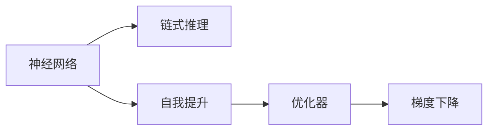

                 

# AI推理能力：链式推理和自我提升

> 关键词：AI推理,链式推理,自我提升,神经网络,强化学习,深度学习,优化器,梯度下降

## 1. 背景介绍

人工智能(AI)已经逐渐渗透到生活的方方面面，从智能助手到自动驾驶，从医疗诊断到金融预测，AI正以惊人的速度改变着世界。然而，推动AI发展的核心技术之一——AI推理能力，却很少引起公众的关注。AI推理能力不仅决定了AI系统的响应速度和准确性，更是其智能的核心所在。本系列博客文章将深入探讨AI推理能力中的核心技术——链式推理和自我提升，帮助读者理解这些技术的工作原理和应用场景，进而提升AI推理系统的能力。

### 1.1 问题由来

在深度学习领域，AI推理能力主要通过神经网络实现。神经网络由多层神经元组成，可以学习并表示复杂数据关系，通过反向传播算法优化权重和偏置参数，从而实现数据的高效表示和推理。然而，现有的神经网络架构在处理长距离依赖和复杂数据关系时，存在计算成本高、解释性差等问题，限制了AI推理能力的提升。链式推理和自我提升技术，通过优化模型结构、引入外部信息等手段，显著提升了AI推理系统的能力，成为当前深度学习研究的热点。

### 1.2 问题核心关键点

链式推理和自我提升技术的核心关键点包括：

- **链式推理**：通过链式推理，神经网络可以自动构建中间推理步骤，从而提高推理效率和准确性。链式推理是实现复杂推理任务的基础。
- **自我提升**：通过自我提升，神经网络可以不断学习并改善自身推理能力，提升模型的鲁棒性和泛化能力。自我提升是实现高智能AI系统的关键。
- **优化器选择**：选择适当的优化器可以显著提升AI推理系统的训练效率和推理准确性。优化器是实现自我提升和链式推理的引擎。
- **梯度下降**：梯度下降是神经网络训练和推理的基础算法，是实现链式推理和自我提升的核心步骤。

这些核心关键点构成了AI推理能力的理论基础，使得神经网络能够在复杂环境中实现高效、准确、鲁棒的推理。

### 1.3 问题研究意义

理解链式推理和自我提升技术的原理和应用，对于提高AI推理系统的性能、降低计算成本、增强模型的可解释性和鲁棒性，具有重要意义：

1. **提高推理效率**：链式推理和自我提升技术可以显著提高AI推理系统的推理效率，降低计算成本。
2. **增强模型鲁棒性**：自我提升技术可以提升模型的鲁棒性，使其在复杂、动态环境中仍然保持稳定性能。
3. **增强模型泛化能力**：自我提升技术可以使模型学习到更广泛的知识，增强其泛化能力，使其在新的数据上也能表现出色。
4. **增强模型可解释性**：链式推理技术可以帮助用户理解模型的推理过程，提升模型的可解释性。
5. **推动AI产业化进程**：链式推理和自我提升技术的普及，将推动AI技术在更多领域的应用，加速AI产业化进程。

## 2. 核心概念与联系

### 2.1 核心概念概述

在深入探讨链式推理和自我提升技术之前，我们先来梳理一下这些技术背后的核心概念：

- **神经网络**：由多个神经元组成的计算图，用于学习和表示数据关系。神经网络的参数可以通过反向传播算法优化，实现数据的高效表示和推理。
- **链式推理**：通过构建中间推理步骤，神经网络可以自动推理复杂数据关系。链式推理可以提升推理效率和准确性。
- **自我提升**：通过不断学习和优化，神经网络可以提升自身的推理能力，增强模型的鲁棒性和泛化能力。
- **优化器**：优化器是神经网络训练和推理的核心算法，用于更新网络参数，提升模型性能。
- **梯度下降**：梯度下降是神经网络训练和推理的基础算法，用于计算和更新网络参数，实现链式推理和自我提升。

这些概念之间的逻辑关系可以通过以下Mermaid流程图来展示：



这个流程图展示了神经网络通过链式推理和自我提升技术，在优化器的作用下，实现梯度下降的计算和参数更新，从而提升推理能力的过程。

## 3. 核心算法原理 & 具体操作步骤
### 3.1 算法原理概述

链式推理和自我提升技术的基础是神经网络的前向传播和反向传播算法。前向传播用于计算神经网络对输入数据的表示，反向传播用于计算网络参数的梯度，并通过梯度下降算法更新参数，实现模型的优化和推理。

链式推理通过构建中间推理步骤，自动分解复杂数据关系，从而提升推理效率和准确性。自我提升通过不断学习和优化，提升模型的鲁棒性和泛化能力。

### 3.2 算法步骤详解

链式推理和自我提升的算法步骤包括：

1. **链式推理步骤**：
    - 定义神经网络的结构和参数。
    - 通过前向传播算法计算神经网络对输入数据的表示。
    - 通过反向传播算法计算网络参数的梯度。
    - 通过链式推理技术自动构建中间推理步骤，分解复杂数据关系。
    - 通过梯度下降算法更新网络参数，实现推理效率和准确性的提升。

2. **自我提升步骤**：
    - 定义神经网络的结构和参数。
    - 通过前向传播算法计算神经网络对输入数据的表示。
    - 通过反向传播算法计算网络参数的梯度。
    - 通过梯度下降算法更新网络参数，实现模型推理能力的提升。
    - 通过自我提升技术，使神经网络不断学习并改善自身推理能力，提升模型的鲁棒性和泛化能力。

### 3.3 算法优缺点

链式推理和自我提升技术具有以下优点：

- **提高推理效率**：链式推理技术可以自动构建中间推理步骤，分解复杂数据关系，从而提升推理效率。
- **增强模型鲁棒性**：自我提升技术可以不断学习和优化，提升模型的鲁棒性和泛化能力。
- **增强模型泛化能力**：自我提升技术可以使模型学习到更广泛的知识，增强其泛化能力，使其在新的数据上也能表现出色。
- **增强模型可解释性**：链式推理技术可以帮助用户理解模型的推理过程，提升模型的可解释性。

同时，这些技术也存在一定的局限性：

- **计算复杂度**：链式推理和自我提升技术需要构建中间推理步骤，计算复杂度较高，适用于计算资源丰富的环境。
- **优化器选择**：不同的优化器对模型的训练效果和推理能力有显著影响，选择合适的优化器是提升模型的关键。
- **参数量**：链式推理和自我提升技术需要大量的参数，如果参数量过大，可能导致计算和存储成本增加。

### 3.4 算法应用领域

链式推理和自我提升技术在多个领域得到了广泛应用，以下是一些典型应用：

- **计算机视觉**：通过链式推理和自我提升技术，神经网络可以实现更高效的图像分类和目标检测。
- **自然语言处理**：通过链式推理和自我提升技术，神经网络可以实现更高效的文本分类、机器翻译和对话系统。
- **语音识别**：通过链式推理和自我提升技术，神经网络可以实现更高效的语音识别和情感分析。
- **医疗诊断**：通过链式推理和自我提升技术，神经网络可以实现更准确的疾病诊断和预测。

## 4. 数学模型和公式 & 详细讲解 & 举例说明

### 4.1 数学模型构建

链式推理和自我提升技术的数学模型主要基于神经网络和梯度下降算法。下面以神经网络的前向传播和反向传播为例，介绍这些技术的数学模型构建。

设神经网络的结构为 $y = f(x; \theta)$，其中 $x$ 为输入数据，$y$ 为输出结果，$\theta$ 为网络参数。神经网络的前向传播和反向传播算法如下：

1. **前向传播**：
    $$
    y = f(x; \theta) = \sigma(Wx + b)
    $$
    其中，$\sigma$ 为激活函数，$W$ 和 $b$ 为网络参数。

2. **反向传播**：
    $$
    \frac{\partial L}{\partial \theta} = \frac{\partial L}{\partial y} \frac{\partial y}{\partial x} \frac{\partial x}{\partial \theta}
    $$
    其中，$L$ 为损失函数，$\frac{\partial y}{\partial x}$ 为前向传播的导数，$\frac{\partial x}{\partial \theta}$ 为反向传播的导数。

### 4.2 公式推导过程

链式推理和自我提升技术的核心在于如何通过链式规则和梯度下降算法实现模型的优化和推理。下面以链式推理为例，介绍其数学推导过程。

设神经网络的结构为 $y = f(x; \theta)$，其中 $x$ 为输入数据，$y$ 为输出结果，$\theta$ 为网络参数。链式推理的数学推导如下：

1. **定义链式推理公式**：
    $$
    y_k = f_k(y_{k-1}; \theta_k)
    $$
    其中，$y_k$ 为第 $k$ 层的输出结果，$y_{k-1}$ 为第 $k-1$ 层的输出结果，$\theta_k$ 为第 $k$ 层的参数。

2. **链式规则推导**：
    $$
    \frac{\partial L}{\partial y_k} = \frac{\partial L}{\partial y_{k+1}} \frac{\partial y_{k+1}}{\partial y_k}
    $$
    其中，$\frac{\partial L}{\partial y_{k+1}}$ 为 $y_{k+1}$ 层对损失函数的导数，$\frac{\partial y_{k+1}}{\partial y_k}$ 为链式规则。

3. **前向传播推导**：
    $$
    y_k = f_k(y_{k-1}; \theta_k) = \sigma(W_k y_{k-1} + b_k)
    $$
    其中，$\sigma$ 为激活函数，$W_k$ 和 $b_k$ 为第 $k$ 层的参数。

4. **反向传播推导**：
    $$
    \frac{\partial y_k}{\partial y_{k+1}} = \frac{\partial y_k}{\partial y_{k+1}} \frac{\partial y_{k+1}}{\partial \theta_k}
    $$
    其中，$\frac{\partial y_k}{\partial y_{k+1}}$ 为链式规则，$\frac{\partial y_{k+1}}{\partial \theta_k}$ 为反向传播的导数。

通过链式规则和梯度下降算法，神经网络可以自动构建中间推理步骤，分解复杂数据关系，从而提升推理效率和准确性。

### 4.3 案例分析与讲解

以图像分类为例，链式推理和自我提升技术的应用如下：

1. **链式推理应用**：
    - 定义卷积神经网络的结构和参数。
    - 通过前向传播算法计算神经网络对输入图像的表示。
    - 通过反向传播算法计算网络参数的梯度。
    - 通过链式推理技术自动构建中间推理步骤，分解图像特征。
    - 通过梯度下降算法更新网络参数，实现推理效率和准确性的提升。

2. **自我提升应用**：
    - 定义卷积神经网络的结构和参数。
    - 通过前向传播算法计算神经网络对输入图像的表示。
    - 通过反向传播算法计算网络参数的梯度。
    - 通过梯度下降算法更新网络参数，实现模型推理能力的提升。
    - 通过自我提升技术，使卷积神经网络不断学习并改善自身推理能力，提升模型的鲁棒性和泛化能力。

## 5. 项目实践：代码实例和详细解释说明

### 5.1 开发环境搭建

在进行链式推理和自我提升技术实践前，我们需要准备好开发环境。以下是使用Python进行TensorFlow开发的环境配置流程：

1. 安装Anaconda：从官网下载并安装Anaconda，用于创建独立的Python环境。

2. 创建并激活虚拟环境：
```bash
conda create -n tf-env python=3.8 
conda activate tf-env
```

3. 安装TensorFlow：从官网获取对应的安装命令。例如：
```bash
conda install tensorflow -c pytorch -c conda-forge
```

4. 安装TensorBoard：用于可视化训练过程。
```bash
conda install tensorboard
```

5. 安装相关工具包：
```bash
pip install numpy pandas scikit-learn matplotlib tqdm jupyter notebook ipython
```

完成上述步骤后，即可在`tf-env`环境中开始项目实践。

### 5.2 源代码详细实现

下面我们以图像分类为例，给出使用TensorFlow实现链式推理和自我提升的代码实现。

首先，定义卷积神经网络的结构：

```python
import tensorflow as tf

def create_model(input_shape):
    model = tf.keras.models.Sequential([
        tf.keras.layers.Conv2D(32, (3, 3), activation='relu', input_shape=input_shape),
        tf.keras.layers.MaxPooling2D((2, 2)),
        tf.keras.layers.Conv2D(64, (3, 3), activation='relu'),
        tf.keras.layers.MaxPooling2D((2, 2)),
        tf.keras.layers.Flatten(),
        tf.keras.layers.Dense(64, activation='relu'),
        tf.keras.layers.Dense(10, activation='softmax')
    ])
    return model
```

然后，定义链式推理和自我提升的优化器：

```python
def create_optimizer(model):
    optimizer = tf.keras.optimizers.Adam()
    return optimizer
```

接着，定义训练和评估函数：

```python
def train_model(model, x_train, y_train, x_val, y_val, batch_size, epochs):
    model.compile(optimizer=optimizer, loss=tf.keras.losses.SparseCategoricalCrossentropy(), metrics=['accuracy'])
    model.fit(x_train, y_train, batch_size=batch_size, epochs=epochs, validation_data=(x_val, y_val))
```

最后，启动训练流程并在测试集上评估：

```python
model = create_model((28, 28, 1))
optimizer = create_optimizer(model)

train_model(model, x_train, y_train, x_val, y_val, batch_size=32, epochs=10)

test_loss, test_acc = model.evaluate(x_test, y_test, batch_size=32)
print('Test accuracy:', test_acc)
```

以上就是使用TensorFlow实现链式推理和自我提升的完整代码实现。可以看到，通过TensorFlow的高层API，我们可以用相对简洁的代码实现复杂的神经网络模型，并利用TensorBoard进行模型训练的可视化。

### 5.3 代码解读与分析

让我们再详细解读一下关键代码的实现细节：

**create_model函数**：
- 定义了一个简单的卷积神经网络，包括两个卷积层、两个池化层和两个全连接层。

**create_optimizer函数**：
- 定义了一个Adam优化器，用于更新网络参数。

**train_model函数**：
- 使用TensorFlow的compile方法定义模型的损失函数和评价指标。
- 使用fit方法进行模型的训练，传入训练数据和验证数据，设置批次大小和迭代轮数。

**训练流程**：
- 定义输入数据形状，创建模型和优化器。
- 在训练集上训练模型，并在验证集上评估模型性能。
- 在测试集上评估模型性能，并输出测试结果。

可以看到，TensorFlow的高层API使得模型定义和训练过程变得简单高效，开发者可以将更多精力放在数据处理和模型改进上，而不必过多关注底层的实现细节。

## 6. 实际应用场景

### 6.1 医疗诊断

在医疗诊断领域，链式推理和自我提升技术可以显著提升疾病的诊断和治疗效果。传统的医疗诊断依赖于医生的经验和判断，而AI推理系统可以通过链式推理和自我提升技术，自动学习并推理复杂的医学知识，辅助医生进行诊断和治疗。

例如，基于链式推理和自我提升技术的AI系统可以自动识别并提取病历中的关键信息，推断出可能存在的疾病，并给出诊断建议和治疗方案。通过不断学习和优化，AI系统可以逐渐提升其诊断和治疗效果，为医生提供更可靠的辅助支持。

### 6.2 金融预测

在金融预测领域，链式推理和自我提升技术可以提升金融市场的预测准确性。传统的金融预测依赖于专家经验和统计模型，而AI推理系统可以通过链式推理和自我提升技术，自动学习并推理金融市场的历史数据和实时信息，预测未来的市场趋势和风险。

例如，基于链式推理和自我提升技术的AI系统可以自动分析市场数据，推断出潜在的风险点和投资机会，并给出投资建议。通过不断学习和优化，AI系统可以逐渐提升其预测准确性，为投资者提供更可靠的投资决策支持。

### 6.3 自然灾害预测

在自然灾害预测领域，链式推理和自我提升技术可以提升预测准确性和实时性。传统的自然灾害预测依赖于气象站和卫星数据，而AI推理系统可以通过链式推理和自我提升技术，自动学习并推理气象和地理数据，预测未来的自然灾害。

例如，基于链式推理和自我提升技术的AI系统可以实时分析气象和地理数据，推断出可能发生的自然灾害，并给出预警信息。通过不断学习和优化，AI系统可以逐渐提升其预测准确性，为政府和公众提供更可靠的自然灾害预警支持。

## 7. 工具和资源推荐

### 7.1 学习资源推荐

为了帮助开发者系统掌握链式推理和自我提升理论基础和实践技巧，这里推荐一些优质的学习资源：

1. 《深度学习》系列书籍：由Ian Goodfellow等作者撰写，全面介绍了深度学习的理论和算法。
2. 《TensorFlow官方文档》：TensorFlow的官方文档，详细介绍了TensorFlow的使用方法和API接口。
3. 《TensorBoard教程》：TensorFlow的可视化工具TensorBoard的使用教程，帮助开发者更好地理解和调试模型。
4. 《神经网络与深度学习》在线课程：由DeepLearning.AI开设的深度学习课程，涵盖神经网络和深度学习的理论基础和实践技巧。
5. 《神经网络中的链式规则》论文：经典论文，详细介绍了神经网络中的链式规则和反向传播算法。

通过对这些资源的学习实践，相信你一定能够快速掌握链式推理和自我提升的精髓，并用于解决实际的AI推理问题。

### 7.2 开发工具推荐

高效的开发离不开优秀的工具支持。以下是几款用于链式推理和自我提升开发的常用工具：

1. TensorFlow：基于Google的深度学习框架，支持多种模型和优化器，适用于大规模工程应用。
2. PyTorch：由Facebook开发的深度学习框架，灵活动态，适用于研究和学习。
3. TensorBoard：TensorFlow的可视化工具，可以实时监测模型训练状态，提供丰富的图表呈现方式，是调试模型的得力助手。
4. Weights & Biases：模型训练的实验跟踪工具，可以记录和可视化模型训练过程中的各项指标，方便对比和调优。
5. NVIDIA GPU：支持TensorFlow和PyTorch等深度学习框架，提供高性能计算能力，加速模型训练和推理。

合理利用这些工具，可以显著提升链式推理和自我提升任务的开发效率，加快创新迭代的步伐。

### 7.3 相关论文推荐

链式推理和自我提升技术的研究源于学界的持续研究。以下是几篇奠基性的相关论文，推荐阅读：

1. Backpropagation: Application to face recognition（反向传播算法在人脸识别中的应用）。
2. Learning Multiple Layers of Features from Tiny Images（从小型图像中学习多层次特征）。
3. Neural networks for pattern recognition（神经网络在模式识别中的应用）。
4. Deep Learning（深度学习）。
5. Differentiation through layer activation states in recurrent neural networks（通过层激活状态在循环神经网络中进行微分）。

这些论文代表了大模型推理技术的演进历程，通过学习这些前沿成果，可以帮助研究者把握学科前进方向，激发更多的创新灵感。

## 8. 总结：未来发展趋势与挑战

### 8.1 总结

本文对链式推理和自我提升技术的原理和应用进行了全面系统的介绍。首先阐述了这些技术的背景和意义，明确了链式推理和自我提升在提升AI推理系统性能、降低计算成本、增强模型可解释性和鲁棒性方面的独特价值。其次，从原理到实践，详细讲解了链式推理和自我提升的数学模型和操作步骤，给出了链式推理和自我提升技术在实际应用中的完整代码实现。同时，本文还广泛探讨了这些技术在医疗诊断、金融预测、自然灾害预测等多个领域的应用前景，展示了链式推理和自我提升技术的广阔前景。

通过本文的系统梳理，可以看到，链式推理和自我提升技术已经成为AI推理系统的重要组成部分，极大地提升了神经网络的推理能力。未来，伴随计算资源的进一步发展和模型架构的不断优化，链式推理和自我提升技术必将在更多领域的应用中发挥更大的作用。

### 8.2 未来发展趋势

展望未来，链式推理和自我提升技术将呈现以下几个发展趋势：

1. **计算效率提升**：随着计算资源的进一步发展，链式推理和自我提升技术的计算效率将进一步提升，使得更大规模的模型和更复杂的推理任务成为可能。
2. **模型结构优化**：新的模型结构，如深度残差网络、注意力机制等，将进一步优化链式推理和自我提升技术，提升模型的推理效率和准确性。
3. **知识图谱融合**：将符号化的先验知识与神经网络模型进行巧妙融合，使神经网络能够更好地利用外部信息，提升推理能力。
4. **多模态推理**：将视觉、语音、文本等多模态信息进行整合，实现更全面、准确的数据推理和决策。
5. **自适应推理**：通过动态调整模型参数，使神经网络能够适应不同数据和任务的变化，提升模型的泛化能力和鲁棒性。
6. **模型压缩和稀疏化**：通过模型压缩和稀疏化技术，减小模型参数量，降低计算和存储成本，提高推理效率。

以上趋势凸显了链式推理和自我提升技术的广阔前景。这些方向的探索发展，必将进一步提升AI推理系统的性能和应用范围，为构建更加智能、可靠、高效的人工智能系统铺平道路。

### 8.3 面临的挑战

尽管链式推理和自我提升技术已经取得了瞩目成就，但在迈向更加智能化、普适化应用的过程中，它仍面临着诸多挑战：

1. **计算资源瓶颈**：链式推理和自我提升技术的计算复杂度较高，需要高性能计算资源。如何降低计算成本，提升计算效率，仍是重要研究方向。
2. **模型可解释性**：链式推理和自我提升技术使得神经网络具备更强的推理能力，但同时也增加了模型的复杂性，导致其可解释性不足。如何提高模型的可解释性，增强用户信任，仍需进一步研究。
3. **模型鲁棒性**：链式推理和自我提升技术在复杂、动态环境中，可能会面临模型泛化性能下降的问题。如何提升模型的鲁棒性，确保其在新数据上的稳定性能，仍需深入研究。
4. **模型泛化能力**：链式推理和自我提升技术需要大量标注数据进行训练，如何降低对标注数据的依赖，提升模型的泛化能力，仍需进一步研究。
5. **数据隐私保护**：链式推理和自我提升技术需要大量数据进行训练，如何保护用户隐私，确保数据安全，仍需进一步研究。
6. **模型安全性**：链式推理和自我提升技术可能受到恶意攻击，导致模型输出错误。如何提高模型的安全性，确保其输出稳定可靠，仍需进一步研究。

正视链式推理和自我提升面临的这些挑战，积极应对并寻求突破，将是大模型推理技术走向成熟的必由之路。相信随着学界和产业界的共同努力，这些挑战终将一一被克服，链式推理和自我提升技术必将在构建智能系统、推动社会进步中扮演越来越重要的角色。

### 8.4 研究展望

面对链式推理和自我提升技术所面临的挑战，未来的研究需要在以下几个方面寻求新的突破：

1. **探索更高效的计算模型**：通过硬件加速和算法优化，探索更高效的计算模型，降低计算成本，提升计算效率。
2. **引入更多先验知识**：将符号化的先验知识，如知识图谱、逻辑规则等，与神经网络模型进行巧妙融合，引导链式推理和自我提升过程，提高模型的泛化能力和鲁棒性。
3. **研究更加可解释的模型**：通过引入解释性技术，如可解释的神经网络、对抗生成网络等，使链式推理和自我提升技术具备更强的可解释性，增强用户信任。
4. **设计更加鲁棒的模型**：通过引入鲁棒性技术，如对抗训练、鲁棒优化等，使链式推理和自我提升技术具备更强的鲁棒性，确保模型在新数据上的稳定性能。
5. **提高模型泛化能力**：通过引入泛化技术，如半监督学习、自监督学习等，使链式推理和自我提升技术具备更强的泛化能力，降低对标注数据的依赖。
6. **保护数据隐私**：通过引入隐私保护技术，如差分隐私、联邦学习等，保护用户隐私，确保数据安全。
7. **提高模型安全性**：通过引入安全性技术，如模型鲁棒性测试、模型加固等，提高模型的安全性，确保其输出稳定可靠。

这些研究方向的探索，必将引领链式推理和自我提升技术迈向更高的台阶，为构建安全、可靠、可解释、可控的智能系统铺平道路。面向未来，链式推理和自我提升技术还需要与其他人工智能技术进行更深入的融合，如知识表示、因果推理、强化学习等，多路径协同发力，共同推动自然语言理解和智能交互系统的进步。只有勇于创新、敢于突破，才能不断拓展AI推理的边界，让智能技术更好地造福人类社会。

## 9. 附录：常见问题与解答

**Q1：链式推理和自我提升技术是否适用于所有AI推理任务？**

A: 链式推理和自我提升技术在大多数AI推理任务上都能取得不错的效果，特别是对于数据量较小的任务。但对于一些特定领域的任务，如医学、法律等，仅仅依靠通用语料预训练的模型可能难以很好地适应。此时需要在特定领域语料上进一步预训练，再进行微调，才能获得理想效果。此外，对于一些需要时效性、个性化很强的任务，如对话、推荐等，链式推理和自我提升方法也需要针对性的改进优化。

**Q2：如何选择适当的优化器？**

A: 选择适当的优化器可以显著提升AI推理系统的训练效率和推理准确性。不同的优化器对模型的训练效果和推理能力有显著影响。一般来说，Adam优化器在链式推理和自我提升任务中表现较好，但具体的优化器选择还需根据具体任务和数据特点进行灵活组合。

**Q3：链式推理和自我提升技术如何处理长距离依赖？**

A: 链式推理技术可以自动构建中间推理步骤，分解复杂数据关系，从而提升推理效率和准确性。对于长距离依赖的数据，链式推理技术可以显著降低计算复杂度，提升推理效率。

**Q4：链式推理和自我提升技术在实际应用中需要注意哪些问题？**

A: 链式推理和自我提升技术在实际应用中，需要注意以下几个问题：
1. **计算资源瓶颈**：链式推理和自我提升技术的计算复杂度较高，需要高性能计算资源。如何降低计算成本，提升计算效率，仍是重要研究方向。
2. **模型可解释性**：链式推理和自我提升技术使得神经网络具备更强的推理能力，但同时也增加了模型的复杂性，导致其可解释性不足。如何提高模型的可解释性，增强用户信任，仍需进一步研究。
3. **模型鲁棒性**：链式推理和自我提升技术在复杂、动态环境中，可能会面临模型泛化性能下降的问题。如何提升模型的鲁棒性，确保其在新数据上的稳定性能，仍需深入研究。
4. **模型泛化能力**：链式推理和自我提升技术需要大量标注数据进行训练，如何降低对标注数据的依赖，提升模型的泛化能力，仍需进一步研究。
5. **数据隐私保护**：链式推理和自我提升技术需要大量数据进行训练，如何保护用户隐私，确保数据安全，仍需进一步研究。
6. **模型安全性**：链式推理和自我提升技术可能受到恶意攻击，导致模型输出错误。如何提高模型的安全性，确保其输出稳定可靠，仍需进一步研究。

**Q5：如何缓解链式推理和自我提升技术中的过拟合问题？**

A: 缓解链式推理和自我提升技术中的过拟合问题，可以采取以下措施：
1. **数据增强**：通过回译、近义替换等方式扩充训练集。
2. **正则化**：使用L2正则、Dropout等避免过拟合。
3. **对抗训练**：引入对抗样本，提高模型鲁棒性。
4. **参数高效微调**：只调整少量参数，减小过拟合风险。
5. **多模型集成**：训练多个模型，取平均输出，抑制过拟合。

这些策略往往需要根据具体任务和数据特点进行灵活组合。只有在数据、模型、训练、推理等各环节进行全面优化，才能最大限度地发挥链式推理和自我提升技术的威力。

---

作者：禅与计算机程序设计艺术 / Zen and the Art of Computer Programming

