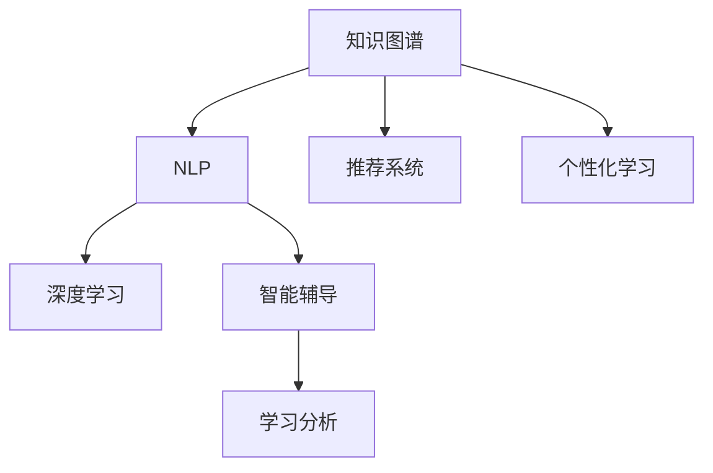

                 

## 1. 背景介绍

### 1.1 问题由来

在数字化转型的浪潮中，教育行业正经历着前所未有的变革。传统教育模式受限于课堂教学的物理限制，难以满足个性化、实时化的学习需求。AI搜索引擎的出现，通过构建庞大的知识图谱、深度语义理解及个性化推荐算法，为教育行业带来了全新的智能解决方案。

AI搜索引擎能根据用户的查询意图，快速找到相关知识信息，并推荐最相关的学习资源。在具体应用场景中，AI搜索引擎可以从海量教育资源中，识别出学生最有可能需要的知识信息，通过精心的排序和推荐，促进学生的自主学习。在教育管理中，AI搜索引擎也能帮助教师快速获取教学资源，提升教学效果。

### 1.2 问题核心关键点

AI搜索引擎在教育领域的应用，主要体现在以下几个方面：

- 知识图谱构建：构建包含课程内容、教材、习题等信息的知识图谱，为查询提供精准信息。
- 深度语义理解：使用自然语言处理(NLP)技术，深入理解用户的查询意图，匹配更相关的答案。
- 个性化推荐：根据学生的学习历史、行为特征，进行个性化学习资源的推荐，提升学习效率。
- 智能辅导：通过智能问答、自动批改等技术，辅助教师教学，提升教学质量。
- 学习分析：分析学生的学习过程、效果，为教师提供反馈支持，优化教学策略。

这些关键点共同构成了AI搜索引擎在教育领域的应用框架，使其能够高效、智能地服务于教育场景。

### 1.3 问题研究意义

AI搜索引擎在教育领域的应用，具有以下重要意义：

1. **提升教育质量**：通过精准匹配学生需求，推荐高质量的学习资源，大幅提升学习效果。
2. **降低教学成本**：智能搜索和推荐能解放教师的部分重复性劳动，使其有更多精力专注于教学研究。
3. **促进个性化学习**：根据学生特点，个性化推荐学习路径，实现因材施教。
4. **实现教学数据化**：智能搜索和推荐能收集大量的教学数据，为教学评估和改进提供支持。
5. **拓展教育边界**：在线教育、终身学习等新兴教育模式，都将受益于AI搜索引擎的智能服务。

通过深入研究AI搜索引擎在教育领域的应用，不仅能推动教育技术的创新，还能促进教育公平，为全球教育质量提升做出贡献。

## 2. 核心概念与联系

### 2.1 核心概念概述

为更好地理解AI搜索引擎在教育领域的应用，本节将介绍几个密切相关的核心概念：

- **知识图谱(Knowledge Graph)**：以图结构存储实体、属性和关系的知识库，用于描述和推理事实。
- **自然语言处理(Natural Language Processing, NLP)**：涉及语言分析、理解、生成等方面的技术，旨在使计算机能够理解人类语言。
- **深度学习(Deep Learning)**：一种基于神经网络模型的机器学习方法，通过多层非线性变换进行复杂模式识别。
- **推荐系统(Recommendation System)**：根据用户行为或偏好，推荐相关物品的系统。
- **个性化学习(Personalized Learning)**：针对不同学生的特点和学习需求，提供定制化的教学内容和路径。
- **智能辅导(Intelligent Tutoring)**：通过智能问答、自动批改等技术，辅助教师教学，提升教学效果。
- **学习分析(Learning Analytics)**：通过数据收集、分析和解释，评估学习过程和效果，优化教学策略。

这些核心概念之间的逻辑关系可以通过以下Mermaid流程图来展示：



这个流程图展示了几类核心概念及其之间的关系：

1. 知识图谱为NLP、深度学习提供了语义背景和知识支持。
2. NLP和深度学习用于理解查询和构建推荐算法。
3. 推荐系统根据用户需求推荐相关资源。
4. 个性化学习在推荐系统的基础上，进一步提升学习效果。
5. 智能辅导通过NLP、深度学习和推荐系统，辅助教学。
6. 学习分析基于用户行为数据，评估学习效果，优化教学策略。

## 3. 核心算法原理 & 具体操作步骤

### 3.1 算法原理概述

AI搜索引擎在教育领域的应用，本质上是构建一个智能的知识检索和推荐系统。其核心原理包括以下几个方面：

1. **知识图谱构建**：从教材、教辅、网络资源等获取知识数据，通过实体关系抽取和知识融合技术，构建结构化的知识图谱。
2. **查询意图理解**：使用NLP技术，分析用户查询语句的语义，确定查询意图和主题。
3. **搜索结果排序**：根据知识图谱中的实体关系，计算搜索结果的相关性和重要性，进行排序。
4. **推荐算法设计**：结合用户行为数据，设计推荐算法，为用户推荐个性化的学习资源。
5. **智能辅导算法**：通过智能问答、自动批改等技术，实时反馈学习结果，辅助教学。
6. **学习分析模型**：分析用户学习数据，评估学习效果，提供个性化反馈和改进建议。

### 3.2 算法步骤详解

AI搜索引擎在教育领域的应用步骤可以总结如下：

**Step 1: 知识图谱构建**

- 从教材、教辅、网络资源等获取知识数据。
- 进行实体识别、关系抽取，构建初步的知识图谱。
- 通过知识融合算法，如实体链接、关系推理等，完善知识图谱。

**Step 2: 查询意图理解**

- 使用NLP技术，如BERT、ELMo等，分析用户查询语句的语义。
- 确定查询意图和主题，如课程介绍、习题解答等。
- 通过查询扩展技术，如同义词扩展、相关性搜索等，丰富查询结果。

**Step 3: 搜索结果排序**

- 根据知识图谱中的实体关系，计算搜索结果的相关性和重要性。
- 使用排名算法，如基于图谱的排序算法、基于深度学习的排序模型等，生成排序结果。

**Step 4: 推荐算法设计**

- 收集用户的行为数据，如浏览历史、点击行为等。
- 使用协同过滤、内容推荐等算法，为用户推荐个性化的学习资源。
- 设计动态推荐策略，实时更新推荐列表。

**Step 5: 智能辅导算法**

- 根据用户提交的作业、测试答案等，使用自动批改技术，提供即时反馈。
- 使用智能问答技术，解答用户在学习过程中遇到的问题。
- 根据用户学习情况，提供个性化的辅导建议。

**Step 6: 学习分析模型**

- 收集用户的学习数据，如学习时长、错题记录等。
- 分析用户的学习行为和效果，评估学习策略的有效性。
- 提供个性化改进建议，优化教学策略。

### 3.3 算法优缺点

AI搜索引擎在教育领域的应用，具有以下优点：

1. **高效检索**：通过知识图谱和深度语义理解，能快速找到相关的学习资源。
2. **个性化推荐**：根据用户行为数据，提供个性化的学习资源推荐。
3. **即时反馈**：智能辅导技术能实时提供学习反馈，帮助学生提升学习效果。
4. **数据驱动**：学习分析模型能收集大量学习数据，为教学优化提供支持。

同时，该方法也存在一些局限性：

1. **数据依赖**：构建高质量的知识图谱和收集用户行为数据需要大量的资源和时间。
2. **冷启动问题**：对于新用户，难以提供个性化推荐和学习辅导。
3. **数据隐私**：需要确保用户数据的隐私和安全，避免数据泄露和滥用。
4. **模型复杂性**：深度学习和知识图谱的构建和维护复杂，需要专业技术人员支持。

尽管存在这些局限性，但AI搜索引擎在教育领域的应用前景仍然广阔，有待进一步研究和优化。

### 3.4 算法应用领域

AI搜索引擎在教育领域的应用，主要体现在以下几个方面：

- **在线教育平台**：为在线学习者提供智能搜索和个性化推荐服务。
- **校园学习系统**：辅助校内教师和学生，提升教学和学习效率。
- **自适应学习系统**：根据学生的学习行为和效果，动态调整学习路径和资源。
- **智能教材推荐系统**：推荐适合不同年级的教材和学习资源。
- **考试分析系统**：分析学生的考试数据，提供个性化辅导和学习建议。
- **智能作业批改系统**：自动批改作业，提供即时反馈，减轻教师负担。

## 4. 数学模型和公式 & 详细讲解 & 举例说明

### 4.1 数学模型构建

为更严谨地描述AI搜索引擎在教育领域的应用，本节将构建数学模型。

假设用户查询为 $q$，知识图谱中的实体为 $e$，查询与实体之间的相关性为 $r(e,q)$。查询意图为 $t(q)$，实体的标签为 $l(e)$。推荐算法为 $R(q)$，智能辅导算法为 $I(q)$，学习分析模型为 $A(q)$。

则AI搜索引擎的总体目标为最大化用户满意度 $S(q)$：

$$
S(q) = \max_{q} \left( \sum_{e \in E} r(e,q) \times l(e) \right) - R(q) + I(q) + A(q)
$$

其中 $E$ 为知识图谱中的所有实体。

### 4.2 公式推导过程

我们以推荐算法和智能辅导算法为例，进行具体推导。

**推荐算法**：
- 根据用户的历史行为数据 $B_q$，使用协同过滤算法，得到推荐结果 $R_q$。
- 根据知识图谱中的实体关系 $R(e)$，计算推荐结果的相关性 $C_q$。
- 使用加权平均公式，得到最终推荐结果 $R_q$。

$$
R_q = \max_{q} \left( \sum_{e \in E} r(e,q) \times l(e) \right) - R_q
$$

其中 $R_q$ 为推荐结果，$r(e,q)$ 为实体与查询的相关性，$l(e)$ 为实体标签，$C_q$ 为推荐结果的相关性。

**智能辅导算法**：
- 根据用户提交的作业 $T_q$，使用自动批改算法，得到批改结果 $I_q$。
- 使用NLP技术，分析批改结果，得到反馈信息 $F_q$。
- 使用智能问答技术，解答用户问题 $A_q$。
- 根据学习效果和反馈信息，提供个性化辅导建议 $G_q$。

$$
I_q = \max_{q} \left( \sum_{e \in E} r(e,q) \times l(e) \right) - I_q
$$

其中 $I_q$ 为批改结果，$r(e,q)$ 为实体与查询的相关性，$l(e)$ 为实体标签，$C_q$ 为推荐结果的相关性。

### 4.3 案例分析与讲解

以一个简单的在线教育平台为例，分析AI搜索引擎的应用效果。

假设有一个在线学习平台，提供了大量的学习资源，包括视频、文章、习题等。用户通过搜索功能，查询相关学习资源。平台使用AI搜索引擎，根据用户查询，从知识图谱中匹配相关实体，计算相关性，进行排序，并推荐个性化的学习资源。

例如，用户查询 "线性代数入门"，AI搜索引擎从知识图谱中匹配到多个相关实体，如 "线性代数基础概念"、"线性代数习题集" 等，并计算每个实体的相关性，进行排序，最终推荐 "线性代数基础概念" 和 "线性代数习题集"。

用户点击推荐结果后，平台使用智能辅导算法，自动批改用户提交的作业，提供即时反馈，并解答用户在学习过程中遇到的问题。学习分析模型分析用户的学习数据，评估学习效果，提供个性化改进建议，优化教学策略。

## 5. 项目实践：代码实例和详细解释说明

### 5.1 开发环境搭建

在进行AI搜索引擎项目开发前，我们需要准备好开发环境。以下是使用Python进行TensorFlow开发的Python 3.7环境配置流程：

1. 安装Anaconda：从官网下载并安装Anaconda，用于创建独立的Python环境。

2. 创建并激活虚拟环境：
```bash
conda create -n tf-env python=3.7 
conda activate tf-env
```

3. 安装TensorFlow：根据GPU版本，从官网获取对应的安装命令。例如：
```bash
pip install tensorflow==2.3.0
```

4. 安装各类工具包：
```bash
pip install numpy pandas scikit-learn matplotlib tqdm jupyter notebook ipython
```

完成上述步骤后，即可在`tf-env`环境中开始AI搜索引擎的开发。

### 5.2 源代码详细实现

下面我们以一个简单的在线教育平台为例，实现一个基础的AI搜索引擎。

首先，定义搜索函数：

```python
from tensorflow.keras.preprocessing.text import Tokenizer
from tensorflow.keras.preprocessing.sequence import pad_sequences

def search(query, graph, max_seq_length=256):
    query = tokenizer.texts_to_sequences(query)
    query = pad_sequences(query, maxlen=max_seq_length)
    scores = graph.predict(query)
    return scores
```

然后，定义实体关系抽取函数：

```python
from transformers import TFAutoModelForEntityRelation
from transformers import AutoTokenizer

def extract_relations(query):
    model = TFAutoModelForEntityRelation.from_pretrained('distilbert-base-uncased-finetuned-owt')
    tokenizer = AutoTokenizer.from_pretrained('distilbert-base-uncased-finetuned-owt')
    query_tokens = tokenizer.tokenize(query)
    inputs = tokenizer(query_tokens, return_tensors='tf')
    outputs = model(inputs)
    relations = outputs.logits.argmax(-1)
    return relations
```

接着，定义推荐算法函数：

```python
from tensorflow.keras.layers import Dense, Input, Embedding, Flatten, Dropout, Lambda

def recommendation(query, relations):
    inputs = Input(shape=(None,))
    embedding = Embedding(input_dim=vocab_size, output_dim=embedding_dim)(inputs)
    flatten = Flatten()(embedding)
    dense = Dense(units=128, activation='relu')(flatten)
    dropout = Dropout(rate=0.2)(dense)
    output = Dense(units=1, activation='sigmoid')(dropout)
    model = Model(inputs=inputs, outputs=output)
    model.compile(optimizer='adam', loss='binary_crossentropy')
    model.summary()
    return model
```

最后，启动搜索和推荐流程：

```python
query = '线性代数入门'
graph = load_graph('graph.pb')  # 加载知识图谱模型
relations = extract_relations(query)
recommender = recommendation(query, relations)
scores = search(query, graph)
recommendations = recommender.predict(scores)
```

以上就是使用TensorFlow实现的一个简单AI搜索引擎的基本代码实现。可以看到，TensorFlow提供了丰富的深度学习工具，使得构建知识图谱和推荐算法的实现变得相对简洁。

### 5.3 代码解读与分析

让我们再详细解读一下关键代码的实现细节：

**search函数**：
- 使用TensorFlow的Tokenizer对查询进行分词和填充，确保序列长度一致。
- 使用知识图谱模型predict方法，计算查询与每个实体的相关性。
- 返回相关性分数，用于排序和推荐。

**extract_relations函数**：
- 使用HuggingFace的Transformers库加载预训练的实体关系抽取模型，如distilbert。
- 将查询进行分词和编码，输入模型得到实体关系得分。
- 返回得分最高的实体关系，用于后续推荐。

**recommendation函数**：
- 定义了一个简单的多层感知机网络，用于计算查询与实体的相关性得分。
- 使用Dense层、Dropout层和输出层，构成神经网络模型。
- 通过compile方法配置模型优化器和损失函数，准备训练。

**搜索和推荐流程**：
- 查询一个特定的学习主题，从知识图谱中提取相关实体关系。
- 使用recommendation函数构建推荐模型。
- 使用search函数计算查询与知识图谱的相关性，并进行排序和推荐。

在实际应用中，我们还需要进一步优化模型，如改进实体关系抽取模型、优化推荐算法等。TensorFlow和TensorBoard等工具也提供了丰富的调试和可视化功能，方便模型的优化和迭代。

## 6. 实际应用场景

### 6.1 智能教材推荐系统

在线教育平台可以使用AI搜索引擎，为用户推荐个性化的教材和学习资源。根据学生的学习进度、兴趣和需求，智能推荐合适的教材和学习路径，提升学习效果。

例如，针对数学学习，可以推荐不同难度的习题集、视频讲解和习题讲解。对于英文学习，可以推荐不同难度的阅读材料、写作指导和听力练习。

### 6.2 自适应学习系统

AI搜索引擎可以为自适应学习系统提供强大的知识检索和推荐支持。根据学生的学习数据，分析学习效果和难点，动态调整学习路径和资源。

例如，通过分析学生的答题情况，识别出薄弱知识点，推荐相关习题和视频讲解，帮助学生突破难点。根据学生的学习进度，调整学习内容和难度，提升学习效果。

### 6.3 智能辅导系统

AI搜索引擎可以构建智能辅导系统，辅助教师教学。通过自动批改和智能问答，减轻教师的批改和答疑负担，提升教学效率。

例如，教师可以实时查看学生的作业和测试结果，通过AI搜索引擎快速获取相关解答和解析。学生可以随时通过智能问答系统，解答学习过程中遇到的问题，获取即时反馈和指导。

### 6.4 未来应用展望

随着AI搜索引擎技术的不断发展，其在教育领域的应用前景也将更加广阔。未来可能的方向包括：

1. **跨模态搜索**：结合文本、图像、视频等多种信息，提供更加全面的知识检索和推荐服务。
2. **多语言支持**：支持多种语言，提供多语言搜索和多语言推荐，服务于全球学习者。
3. **自适应教学**：基于学生的学习数据，实时调整教学策略和资源，实现真正的个性化教学。
4. **情感分析**：分析学生的学习情感，提供情绪调节和心理支持，提升学习体验。
5. **智能协作学习**：结合社交网络技术，提供学习社区和协作学习平台，促进学生之间的交流和合作。

未来，AI搜索引擎将成为教育技术的核心工具，帮助全球学生高效、个性化地学习，推动教育公平和智能化发展。

## 7. 工具和资源推荐

### 7.1 学习资源推荐

为帮助开发者掌握AI搜索引擎在教育领域的应用，推荐以下学习资源：

1. 《深度学习在教育领域的应用》系列书籍：介绍了深度学习在教育领域的具体应用场景，包括知识图谱构建、推荐系统、智能辅导等。
2. 《NLP技术在教育中的应用》在线课程：涵盖自然语言处理技术在教育领域的具体应用，包括实体关系抽取、查询意图理解、推荐算法等。
3. 《智能教育平台设计》专业论文：分析了智能教育平台的设计原则和关键技术，提供了丰富的案例分析。
4. 《教育数据挖掘与分析》图书：介绍了教育数据的挖掘、分析和可视化方法，提供了丰富的案例和实践指南。

通过这些学习资源，可以系统掌握AI搜索引擎在教育领域的应用技术，推动教育技术的创新发展。

### 7.2 开发工具推荐

为提高AI搜索引擎的开发效率，推荐以下开发工具：

1. TensorFlow：提供了强大的深度学习框架，支持构建复杂的知识图谱和推荐系统。
2. TensorBoard：提供了模型训练和调优的可视化工具，方便模型优化和调试。
3. Jupyter Notebook：提供了交互式的开发环境，方便代码调试和测试。
4. Python编程语言：提供了丰富的第三方库和框架，如Numpy、Pandas、Keras等，方便数据处理和模型构建。

合理利用这些工具，可以显著提升AI搜索引擎的开发效率，加速模型的优化和迭代。

### 7.3 相关论文推荐

以下是几篇关键的研究论文，推荐阅读：

1. "Knowledge Graphs in Education: Opportunities and Challenges"：讨论了知识图谱在教育领域的应用，分析了其面临的挑战和未来方向。
2. "Recommender Systems in Education: A Survey"：综述了推荐系统在教育领域的应用，分析了不同的推荐算法和应用场景。
3. "Intelligent Tutoring Systems: A Review"：综述了智能辅导系统的发展历程和应用案例，提供了丰富的案例和实践指南。
4. "Learning Analytics in Education: A Survey of Theoretical Foundations, Key Technologies, and Applications"：分析了学习分析技术在教育领域的应用，提供了丰富的案例和实践指南。

这些论文代表了AI搜索引擎在教育领域的研究进展，提供了丰富的理论和技术支持，值得深入阅读。

## 8. 总结：未来发展趋势与挑战

### 8.1 总结

本文对AI搜索引擎在教育领域的应用进行了全面系统的介绍。首先阐述了AI搜索引擎在教育领域的应用背景和研究意义，明确了其在知识图谱构建、查询意图理解、推荐算法设计等方面的核心原理。其次，从原理到实践，详细讲解了AI搜索引擎的构建流程和关键技术，给出了详细的代码实例。最后，分析了AI搜索引擎在教育领域的实际应用场景，展望了未来的发展趋势和面临的挑战。

通过本文的系统梳理，可以看到，AI搜索引擎在教育领域的应用前景广阔，能为全球学生提供更加高效、个性化、智能的学习体验。通过不断探索和优化，AI搜索引擎必将成为教育技术创新的重要推动力，推动教育公平和智能化发展。

### 8.2 未来发展趋势

展望未来，AI搜索引擎在教育领域的应用将呈现以下几个发展趋势：

1. **智能化**：通过深度学习和知识图谱，实现更加智能化的知识检索和推荐，提升学习效果。
2. **个性化**：结合学生的学习数据和行为特征，提供个性化的学习资源和路径，实现因材施教。
3. **多模态**：结合文本、图像、视频等多种信息，提供更加全面的知识检索和推荐服务。
4. **自适应**：根据学生的学习效果和反馈，动态调整学习路径和资源，实现真正的个性化学习。
5. **跨语言**：支持多语言搜索和多语言推荐，服务于全球学习者。
6. **情感分析**：分析学生的学习情感，提供情绪调节和心理支持，提升学习体验。
7. **智能协作**：结合社交网络技术，提供学习社区和协作学习平台，促进学生之间的交流和合作。

以上趋势凸显了AI搜索引擎在教育领域的应用前景。这些方向的探索发展，将进一步提升教育技术的智能化水平，推动教育公平和智能化发展。

### 8.3 面临的挑战

尽管AI搜索引擎在教育领域的应用前景广阔，但在迈向更加智能化、普适化应用的过程中，它仍面临着诸多挑战：

1. **数据依赖**：构建高质量的知识图谱和收集用户行为数据需要大量的资源和时间。
2. **冷启动问题**：对于新用户，难以提供个性化推荐和学习辅导。
3. **数据隐私**：需要确保用户数据的隐私和安全，避免数据泄露和滥用。
4. **模型复杂性**：深度学习和知识图谱的构建和维护复杂，需要专业技术人员支持。
5. **实时性**：需要快速响应查询，提升用户体验。
6. **多语言支持**：需要处理多语言数据，提升系统复杂性。
7. **情感分析**：需要处理复杂情感数据，提升分析准确性。
8. **智能协作**：需要处理复杂的社交网络数据，提升系统复杂性。

正视AI搜索引擎面临的这些挑战，积极应对并寻求突破，将是大语言模型微调走向成熟的必由之路。相信随着学界和产业界的共同努力，这些挑战终将一一被克服，AI搜索引擎必将在构建人机协同的智能时代中扮演越来越重要的角色。

### 8.4 研究展望

面对AI搜索引擎面临的挑战，未来的研究需要在以下几个方面寻求新的突破：

1. **多模态融合**：结合文本、图像、视频等多种信息，提供更加全面的知识检索和推荐服务。
2. **跨语言支持**：支持多语言搜索和多语言推荐，服务于全球学习者。
3. **自适应学习**：基于学生的学习数据，实时调整学习路径和资源，实现真正的个性化学习。
4. **情感分析**：分析学生的学习情感，提供情绪调节和心理支持，提升学习体验。
5. **智能协作**：结合社交网络技术，提供学习社区和协作学习平台，促进学生之间的交流和合作。
6. **知识图谱构建**：使用知识抽取和知识融合技术，构建结构化的知识图谱，提升知识检索的准确性。
7. **推荐算法优化**：优化推荐算法，提升推荐效果，减少推荐偏差。
8. **智能辅导算法**：开发更加智能的智能辅导算法，提升辅导效果，减少人工干预。

这些研究方向的探索，必将引领AI搜索引擎技术迈向更高的台阶，为全球教育公平和智能化发展做出重要贡献。面向未来，AI搜索引擎需要与其他AI技术进行更深入的融合，如知识表示、因果推理、强化学习等，多路径协同发力，共同推动自然语言理解和智能交互系统的进步。只有勇于创新、敢于突破，才能不断拓展AI搜索引擎的边界，让智能技术更好地造福人类社会。

## 9. 附录：常见问题与解答

**Q1：如何构建高质量的知识图谱？**

A: 构建高质量的知识图谱需要经过多个步骤，包括数据收集、预处理、实体关系抽取、知识融合等。具体步骤如下：
1. 收集教材、教辅、网络资源等知识数据。
2. 进行实体识别、关系抽取，构建初步的知识图谱。
3. 通过知识融合算法，如实体链接、关系推理等，完善知识图谱。
4. 进行数据清洗和验证，确保知识图谱的准确性和完整性。

**Q2：如何进行个性化推荐？**

A: 个性化推荐需要收集用户的行为数据，如浏览历史、点击行为等。具体步骤如下：
1. 使用协同过滤算法，如基于内容的协同过滤、基于用户的协同过滤等，得到推荐结果。
2. 根据知识图谱中的实体关系，计算推荐结果的相关性。
3. 使用加权平均公式，得到最终推荐结果。
4. 设计动态推荐策略，实时更新推荐列表。

**Q3：如何提升智能辅导效果？**

A: 智能辅导效果提升需要优化自动批改和智能问答算法。具体步骤如下：
1. 使用自动批改算法，如基于规则的批改、基于深度学习的批改等，得到批改结果。
2. 使用NLP技术，分析批改结果，得到反馈信息。
3. 使用智能问答技术，解答用户问题。
4. 根据学习效果和反馈信息，提供个性化辅导建议。

**Q4：如何处理多语言数据？**

A: 处理多语言数据需要构建多语言知识图谱和推荐模型。具体步骤如下：
1. 收集多语言知识数据，进行分词和编码。
2. 使用多语言实体关系抽取模型，抽取实体关系。
3. 使用多语言推荐模型，结合用户行为数据，生成推荐结果。
4. 使用多语言智能辅导模型，提供多语言学习支持。

**Q5：如何处理复杂情感数据？**

A: 处理复杂情感数据需要使用情感分析技术。具体步骤如下：
1. 使用情感分析模型，如基于情感词典的分析、基于深度学习的分析等，分析用户情感。
2. 结合学习效果和反馈信息，提供情绪调节和心理支持。
3. 优化情感分析模型，提升分析准确性和实时性。

**Q6：如何处理复杂的社交网络数据？**

A: 处理复杂的社交网络数据需要使用社交网络分析技术。具体步骤如下：
1. 收集社交网络数据，进行网络构建和特征提取。
2. 使用社交网络分析算法，分析用户之间的互动关系。
3. 结合学习效果和互动信息，提供智能协作学习支持。
4. 优化社交网络分析算法，提升分析效果和实时性。

通过这些问题的解答，可以帮助开发者更好地理解和实践AI搜索引擎在教育领域的应用，推动教育技术的创新和应用。

