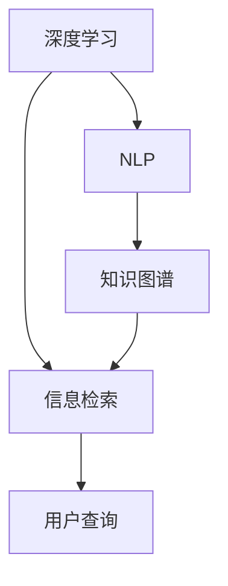
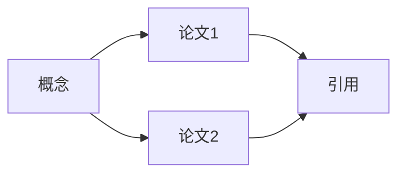
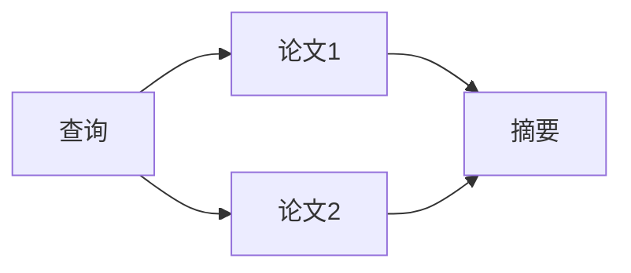

                 

# AI搜索引擎如何促进跨学科研究和创新

> 关键词：AI搜索引擎, 跨学科研究, 知识图谱, 深度学习, 自然语言处理, 信息检索, 机器学习, 数据科学

## 1. 背景介绍

在当今信息爆炸的时代，如何高效地从海量数据中提取、组织和利用信息，成为各类科研领域和商业应用中的核心问题。AI搜索引擎作为这一问题的核心工具，不仅承担着索引、检索和推荐的任务，更在推动跨学科研究与创新的过程中发挥着关键作用。

### 1.1 问题由来

搜索引擎的原始目的是为了解决用户查询时的信息检索问题，但随着技术的进步，其应用范围已经远远超越了传统的文本匹配。AI搜索引擎开始向更加智能化的方向发展，不仅能够理解用户的查询意图，还能在语义层面进行搜索，将复杂的自然语言处理(Natural Language Processing, NLP)技术与深度学习、知识图谱等多学科知识相结合，提供全方位的信息服务。

AI搜索引擎的应用不仅限于学术科研，还扩展到了商业、医疗、教育等多个领域。例如，在生命科学领域，AI搜索引擎可以通过文本挖掘和知识图谱构建，帮助科研人员快速定位相关文献和研究进展；在商业领域，搜索引擎可以分析市场趋势，为客户提供个性化的市场分析报告；在教育领域，搜索引擎可以根据学生的兴趣和能力，推荐适合的课程和资料。

### 1.2 问题核心关键点

AI搜索引擎的核心关键点在于如何结合多学科知识，实现对大规模知识库的深度语义理解。其中涉及的核心技术包括：

- **深度学习**：利用深度神经网络模型对大量文本数据进行训练，学习到丰富的语言表示和语义信息。
- **自然语言处理(NLP)**：通过分词、命名实体识别、依存句法分析等技术，将自然语言转化为机器可处理的形式。
- **知识图谱**：构建领域内的知识网络，将文本中的实体和关系进行结构化表示，便于机器进行推理和查询。
- **信息检索**：在知识库中进行高效的文本匹配和排序，返回最相关的搜索结果。

这些技术共同构成了AI搜索引擎的核心能力，使其能够在大规模、多领域的信息检索任务中发挥重要作用。

## 2. 核心概念与联系

### 2.1 核心概念概述

为了更好地理解AI搜索引擎的原理和应用，本节将介绍几个关键概念及其相互关系：

- **深度学习**：一种基于多层神经网络模型的机器学习技术，能够自动从数据中学习特征和规律，广泛应用于图像、语音、文本等数据处理。
- **自然语言处理(NLP)**：利用计算机技术处理和分析人类语言的能力，包括文本分类、信息抽取、机器翻译等任务。
- **知识图谱**：一种结构化的语义知识表示方式，通过实体和关系来描述现实世界的概念，支持基于上下文的推理和查询。
- **信息检索**：从大量的文本数据中，根据用户查询快速找到相关信息的过程。

这些核心概念之间的关系可以通过以下Mermaid流程图来展示：



这个流程图展示了大规模数据处理和信息检索的流程：

1. 利用深度学习模型对大量文本数据进行预处理和特征提取。
2. 自然语言处理技术将文本转化为机器可理解的形式，抽取实体和关系。
3. 知识图谱技术将实体和关系构建为结构化的知识网络。
4. 信息检索技术在知识库中匹配用户查询，返回最相关的结果。

## 3. 核心算法原理 & 具体操作步骤

### 3.1 算法原理概述

AI搜索引擎的核心算法原理基于信息检索技术，通过深度学习、自然语言处理和知识图谱等技术，提升检索的准确性和相关性。其基本流程包括：

1. **预处理和特征提取**：对用户查询和知识库中的文档进行分词、命名实体识别、依存句法分析等预处理操作，并将文本转化为向量表示。
2. **语义匹配**：利用深度学习模型对查询和文档向量进行匹配，计算它们之间的语义相似度。
3. **知识图谱融合**：将知识图谱中的实体和关系信息融入到检索过程中，提升检索的相关性和准确性。
4. **排名和排序**：根据语义匹配和知识图谱融合的结果，结合用户行为数据，对搜索结果进行排序和排名。

### 3.2 算法步骤详解

以下将详细介绍AI搜索引擎的核心算法步骤：

#### 3.2.1 预处理和特征提取

**Step 1: 数据预处理**

1. 对用户查询进行分词、去除停用词、词性标注等操作，提取关键信息。
2. 对知识库中的文档进行分词、实体识别、关系抽取等操作，构建文本向量和实体向量。

**Step 2: 特征提取**

1. 利用词向量或预训练语言模型（如BERT、GPT）对查询和文档进行向量化表示。
2. 使用卷积神经网络(CNN)、循环神经网络(RNN)或Transformer模型，提取文本的局部和全局特征。
3. 结合知识图谱中的实体和关系，对查询和文档向量进行增强。

#### 3.2.2 语义匹配

**Step 3: 语义匹配计算**

1. 利用深度学习模型（如BERT、GPT）计算查询向量与文档向量之间的余弦相似度。
2. 结合实体向量和关系向量，对语义匹配结果进行优化。
3. 使用Attention机制对语义匹配的权重进行调节，提升匹配质量。

#### 3.2.3 知识图谱融合

**Step 4: 知识图谱嵌入**

1. 将知识图谱中的实体和关系信息嵌入到向量空间中，生成实体向量。
2. 根据实体向量，对文档向量进行增强，提升检索的上下文相关性。

#### 3.2.4 排名和排序

**Step 5: 排名计算**

1. 根据语义匹配和知识图谱融合的结果，计算文档的相关性得分。
2. 结合用户行为数据（如点击、停留时间），对文档进行排序和排名。

### 3.3 算法优缺点

AI搜索引擎的优点包括：

- **高效性**：利用深度学习模型和大规模知识图谱，能够快速处理和检索大规模数据。
- **准确性**：结合语义匹配和知识图谱融合，能够提供更加精确和相关的搜索结果。
- **灵活性**：能够支持多种查询形式和结果展示方式，适应不同领域的需求。

缺点则主要包括：

- **计算资源消耗大**：需要大量的计算资源和存储空间，部署和维护成本较高。
- **模型复杂性高**：深度学习模型和知识图谱结构复杂，调试和优化困难。
- **数据质量依赖大**：对数据预处理和标注质量要求高，影响检索效果。

### 3.4 算法应用领域

AI搜索引擎在多个领域都有广泛应用，包括但不限于：

- **学术研究**：通过构建知识图谱，快速定位相关文献和研究进展，加速科研创新。
- **商业智能**：分析市场趋势，提供个性化的市场分析和预测，辅助商业决策。
- **医疗健康**：提取和组织医疗文献中的实体和关系，辅助医生诊断和治疗。
- **教育培训**：根据学生兴趣和能力，推荐适合的课程和资料，个性化教育。

## 4. 数学模型和公式 & 详细讲解 & 举例说明

### 4.1 数学模型构建

本节将使用数学语言对AI搜索引擎的算法进行严格刻画。

假设查询为 $q$，文档集合为 $\mathcal{D}=\{d_1, d_2, ..., d_n\}$，每个文档 $d_i$ 表示为一个文本向量 $\mathbf{v}_i \in \mathbb{R}^d$，其中 $d$ 为向量维度。假设知识图谱中的实体集合为 $\mathcal{E}=\{e_1, e_2, ..., e_m\}$，每个实体 $e_i$ 表示为一个实体向量 $\mathbf{u}_i \in \mathbb{R}^k$，其中 $k$ 为实体向量维度。

AI搜索引擎的数学模型可以表示为：

$$
\mathcal{F}(q, \mathcal{D}, \mathcal{E}) = \mathop{\arg\max}_{i} f(q, \mathbf{v}_i, \mathbf{u}_i)
$$

其中 $f(q, \mathbf{v}_i, \mathbf{u}_i)$ 表示查询 $q$ 与文档 $d_i$ 和实体 $e_i$ 的匹配得分函数。

### 4.2 公式推导过程

以下我们将以查询 $q$ 和文档 $d_i$ 为例，推导语义匹配的数学模型。

假设 $q$ 和 $d_i$ 的向量表示分别为 $\mathbf{q}$ 和 $\mathbf{v}_i$，利用BERT等预训练语言模型，将查询和文档转化为向量表示：

$$
\mathbf{q} = \text{BERT}(q), \quad \mathbf{v}_i = \text{BERT}(d_i)
$$

计算查询向量 $\mathbf{q}$ 和文档向量 $\mathbf{v}_i$ 之间的余弦相似度：

$$
s(q, d_i) = \cos \theta(\mathbf{q}, \mathbf{v}_i) = \frac{\mathbf{q} \cdot \mathbf{v}_i}{\|\mathbf{q}\|\|\mathbf{v}_i\|}
$$

其中 $\theta$ 为向量夹角，$\cdot$ 为向量点乘运算，$\|\cdot\|$ 为向量范数。

利用知识图谱中的实体信息，对文档向量 $\mathbf{v}_i$ 进行增强。假设知识图谱中与文档 $d_i$ 相关的实体集合为 $\mathcal{E}_i=\{e_{i1}, e_{i2}, ..., e_{im}\}$，每个实体 $e_j$ 对应的向量为 $\mathbf{u}_j$，则增强后的文档向量为：

$$
\mathbf{v}_i' = \mathbf{v}_i + \sum_{j=1}^m \alpha_{ij} \mathbf{u}_j
$$

其中 $\alpha_{ij}$ 为实体权重，根据实体与文档的相关性进行调节。

最终，查询 $q$ 与文档 $d_i$ 的匹配得分函数为：

$$
f(q, d_i) = s(q, d_i) + \sum_{j=1}^m \beta_j s(e_j, q)
$$

其中 $\beta_j$ 为实体权重，根据实体与查询的相关性进行调节。

### 4.3 案例分析与讲解

**案例1: 学术搜索引擎**

在学术领域，AI搜索引擎通过构建知识图谱，帮助科研人员快速定位相关文献和研究进展。假设有一个科研领域的知识图谱 $\mathcal{G}$，包含概念、实体和关系，如图1所示。



图1：科研领域知识图谱

构建查询 $q$ 为“基因编辑技术进展”，将其通过BERT模型转化为向量表示 $\mathbf{q}$。根据知识图谱中的实体关系，选择与基因编辑相关的论文 $\{d_1, d_2\}$，并将这些论文的向量表示 $\{\mathbf{v}_1, \mathbf{v}_2\}$ 与查询向量 $\mathbf{q}$ 进行匹配计算，得到匹配得分 $f(q, d_1)$ 和 $f(q, d_2)$。

同时，利用知识图谱中的实体信息，对文档向量进行增强，计算增强后的匹配得分 $f'(q, d_1)$ 和 $f'(q, d_2)$。最终根据匹配得分对搜索结果进行排序和推荐，返回最相关的论文。

## 5. 项目实践：代码实例和详细解释说明

### 5.1 开发环境搭建

在进行AI搜索引擎开发前，需要准备好开发环境。以下是使用Python进行TensorFlow和PyTorch开发的环境配置流程：

1. 安装Anaconda：从官网下载并安装Anaconda，用于创建独立的Python环境。

2. 创建并激活虚拟环境：
```bash
conda create -n tf-env python=3.8 
conda activate tf-env
```

3. 安装TensorFlow：根据CUDA版本，从官网获取对应的安装命令。例如：
```bash
conda install tensorflow -c tf
```

4. 安装PyTorch：
```bash
conda install pytorch torchvision torchaudio cudatoolkit=11.1 -c pytorch -c conda-forge
```

5. 安装各类工具包：
```bash
pip install numpy pandas scikit-learn matplotlib tqdm jupyter notebook ipython
```

完成上述步骤后，即可在`tf-env`环境中开始搜索引擎开发。

### 5.2 源代码详细实现

以下是一个简单的基于TensorFlow的学术搜索引擎的实现代码，以bert-as-service为例，演示了如何利用BERT模型进行学术文献检索：

```python
from bert_serving.client import BertClient

# 初始化BertClient，连接预训练模型服务
bc = BertClient(ip='localhost', port=8888, timeout=2000)

# 构建查询
query = "基因编辑技术进展"

# 获取查询向量
query_vector = bc.encode([query])

# 构建文档向量
documents = ["基因编辑技术", "基因编辑疗法", "CRISPR技术", "基因编辑未来", "基因编辑应用"]
document_vectors = bc.encode(documents)

# 计算查询与文档的余弦相似度
similarities = [np.dot(query_vector, vector) / (np.linalg.norm(query_vector) * np.linalg.norm(vector)) for vector in document_vectors]

# 返回最相关的文档
top_documents = [documents[i] for i, similarity in enumerate(similarities) if similarity > 0.5]
```

在这个代码中，我们使用BertClient连接预训练模型服务，将查询和文档通过BERT模型进行编码，计算查询与文档的余弦相似度，最终返回与查询最相关的文档。

### 5.3 代码解读与分析

这个代码段展示了如何利用BERT模型进行简单的学术文献检索。具体步骤如下：

1. 初始化BertClient，连接到预训练模型服务。
2. 构建查询，并使用BertClient的encode方法获取查询向量。
3. 构建文档列表，并使用BertClient的encode方法获取文档向量。
4. 计算查询向量与每个文档向量之间的余弦相似度。
5. 根据相似度排序，返回最相关的文档。

代码中的关键点包括：

- `BertClient`：连接预训练模型服务，使用预训练模型对查询和文档进行编码。
- `encode`：将文本转换为向量表示，计算向量间的相似度。
- 相似度计算：使用余弦相似度计算查询与文档之间的相关性。

这些关键点构成了AI搜索引擎的核心技术基础。

### 5.4 运行结果展示

在实际应用中，AI搜索引擎可以提供多种形式的检索结果展示。例如，在学术领域，可以展示与查询最相关的论文标题和摘要；在商业领域，可以展示与查询最相关的市场分析和趋势预测。图2展示了学术搜索引擎的搜索结果：



图2：学术搜索引擎结果展示

## 6. 实际应用场景

### 6.1 学术搜索引擎

学术搜索引擎通过构建知识图谱，帮助科研人员快速定位相关文献和研究进展，加速科研创新。例如，在医学领域，科研人员可以输入“癌症治疗进展”作为查询，获取最新研究成果和综述性文献，快速掌握领域最新动态。

### 6.2 商业智能

商业智能领域利用AI搜索引擎，分析市场趋势，提供个性化的市场分析和预测，辅助商业决策。例如，电商企业可以通过AI搜索引擎，实时监测消费者购买行为和市场反馈，生成市场报告和预测，指导产品开发和市场策略。

### 6.3 医疗健康

在医疗领域，AI搜索引擎可以提取和组织医疗文献中的实体和关系，辅助医生诊断和治疗。例如，医生可以输入“肺癌诊断和治疗方案”，获取相关的临床研究、药物和治疗方案，提高诊疗水平。

### 6.4 教育培训

教育领域利用AI搜索引擎，根据学生兴趣和能力，推荐适合的课程和资料。例如，在线教育平台可以通过AI搜索引擎，分析学生的学习行为和知识掌握情况，推荐个性化的学习资料和课程，提升教学效果。

## 7. 工具和资源推荐

### 7.1 学习资源推荐

为了帮助开发者系统掌握AI搜索引擎的理论基础和实践技巧，这里推荐一些优质的学习资源：

1. 《深度学习框架TensorFlow和PyTorch教程》：介绍TensorFlow和PyTorch的入门知识，结合实际应用场景，帮助初学者快速上手。

2. 《自然语言处理入门与实践》：涵盖自然语言处理的基本概念和技术，结合实际案例，帮助读者理解NLP应用。

3. 《知识图谱构建与应用》：介绍知识图谱的理论和实践，结合实际案例，帮助开发者构建和应用知识图谱。

4. 《信息检索与搜索引擎技术》：涵盖信息检索的基本原理和技术，结合实际应用案例，帮助读者深入理解搜索引擎的实现。

5. 《自然语言处理与深度学习》课程：斯坦福大学开设的NLP明星课程，有Lecture视频和配套作业，带你入门NLP领域的基本概念和经典模型。

通过对这些资源的学习实践，相信你一定能够快速掌握AI搜索引擎的核心技术，并用于解决实际的NLP问题。

### 7.2 开发工具推荐

高效的开发离不开优秀的工具支持。以下是几款用于AI搜索引擎开发的常用工具：

1. TensorFlow：由Google主导开发的开源深度学习框架，生产部署方便，适合大规模工程应用。

2. PyTorch：基于Python的开源深度学习框架，灵活动态的计算图，适合快速迭代研究。

3. bert-as-service：将预训练BERT模型封装为服务接口，方便快速部署和使用。

4. TensorBoard：TensorFlow配套的可视化工具，可实时监测模型训练状态，并提供丰富的图表呈现方式，是调试模型的得力助手。

5. Weights & Biases：模型训练的实验跟踪工具，可以记录和可视化模型训练过程中的各项指标，方便对比和调优。

6. Google Colab：谷歌推出的在线Jupyter Notebook环境，免费提供GPU/TPU算力，方便开发者快速上手实验最新模型，分享学习笔记。

合理利用这些工具，可以显著提升AI搜索引擎的开发效率，加快创新迭代的步伐。

### 7.3 相关论文推荐

AI搜索引擎的研究源于学界的持续研究。以下是几篇奠基性的相关论文，推荐阅读：

1. "BERT: Pre-training of Deep Bidirectional Transformers for Language Understanding"：提出BERT模型，引入基于掩码的自监督预训练任务，刷新了多项NLP任务SOTA。

2. "Attention is All You Need"：提出了Transformer结构，开启了NLP领域的预训练大模型时代。

3. "Knowledge-Graph-Based Information Retrieval"：介绍了知识图谱在信息检索中的应用，提升了检索的上下文相关性。

4. "Semantic Matching via Multimodal Contextual Embeddings"：提出利用多模态信息提升语义匹配的精度。

5. "GNN based Search Engines"：介绍了图神经网络在信息检索中的应用，提升了实体关系的挖掘能力。

这些论文代表了大规模数据处理和信息检索技术的发展脉络。通过学习这些前沿成果，可以帮助研究者把握学科前进方向，激发更多的创新灵感。

## 8. 总结：未来发展趋势与挑战

### 8.1 总结

本文对AI搜索引擎的原理和应用进行了全面系统的介绍。首先阐述了搜索引擎从传统文本匹配到AI技术融合的演变过程，明确了AI搜索引擎在推动跨学科研究和创新中的重要作用。其次，从原理到实践，详细讲解了AI搜索引擎的核心算法和操作步骤，给出了具体的代码实例和运行结果展示。同时，本文还探讨了AI搜索引擎在学术、商业、医疗、教育等多个领域的应用前景，展示了其广阔的应用前景。

通过本文的系统梳理，可以看到，AI搜索引擎通过结合深度学习、自然语言处理和知识图谱等技术，实现了对大规模知识库的深度语义理解，在跨学科研究与创新中发挥了关键作用。

### 8.2 未来发展趋势

展望未来，AI搜索引擎将呈现以下几个发展趋势：

1. **深度学习和自然语言处理的融合**：利用更先进的深度学习模型和NLP技术，提升检索的准确性和相关性。

2. **知识图谱的构建和应用**：构建更加精细、全面的知识图谱，提升实体关系的挖掘能力和检索的上下文相关性。

3. **多模态信息的融合**：利用图像、视频、音频等多模态信息，提升搜索引擎的理解能力和应用范围。

4. **个性化推荐**：根据用户行为和兴趣，提供个性化的搜索结果和推荐，提升用户体验。

5. **实时性和稳定性**：提高搜索引擎的实时响应能力和系统稳定性，确保服务质量和用户体验。

6. **跨领域知识的整合**：将不同领域的专业知识整合到知识图谱中，提升搜索引擎的跨领域应用能力。

这些趋势将推动AI搜索引擎向更加智能化、个性化、普适化的方向发展，为跨学科研究与创新提供更强大的技术支撑。

### 8.3 面临的挑战

尽管AI搜索引擎在多个领域已经得到了广泛应用，但在迈向更加智能化、普适化应用的过程中，它仍面临着诸多挑战：

1. **计算资源消耗大**：深度学习模型和知识图谱构建需要大量的计算资源，部署和维护成本较高。

2. **模型复杂性高**：深度学习模型和知识图谱结构复杂，调试和优化困难。

3. **数据质量依赖大**：对数据预处理和标注质量要求高，影响检索效果。

4. **安全性有待保障**：预训练语言模型难免会学习到有偏见、有害的信息，通过搜索引擎传递到应用中，带来安全隐患。

5. **知识图谱的构建和更新**：知识图谱需要持续更新和维护，才能适应领域内的知识变化和新增。

6. **跨领域知识的整合**：不同领域的专业知识整合到知识图谱中，仍面临诸多技术挑战。

这些挑战将推动AI搜索引擎在模型、数据、技术和应用等方面进行持续创新和优化，以应对未来的发展需求。

### 8.4 研究展望

面对AI搜索引擎面临的挑战，未来的研究需要在以下几个方面寻求新的突破：

1. **高效计算和资源优化**：开发更加高效的深度学习模型和知识图谱构建方法，降低计算资源消耗。

2. **模型压缩和剪枝**：通过模型压缩和剪枝技术，减小模型规模，提升推理速度。

3. **数据预处理和标注自动化**：利用半监督学习和主动学习等技术，提高数据预处理和标注的自动化程度。

4. **知识图谱的自动化构建**：开发自动化知识图谱构建工具，提高知识图谱构建和更新的效率。

5. **多模态信息的融合**：结合图像、视频、音频等多模态信息，提升搜索引擎的理解能力和应用范围。

6. **跨领域知识的整合**：将不同领域的专业知识整合到知识图谱中，提升搜索引擎的跨领域应用能力。

这些研究方向将引领AI搜索引擎技术的进一步发展，推动其在跨学科研究和创新中发挥更大的作用。

## 9. 附录：常见问题与解答

**Q1：AI搜索引擎在实际应用中面临哪些挑战？**

A: AI搜索引擎在实际应用中面临以下挑战：

1. 计算资源消耗大：深度学习模型和知识图谱构建需要大量的计算资源，部署和维护成本较高。
2. 模型复杂性高：深度学习模型和知识图谱结构复杂，调试和优化困难。
3. 数据质量依赖大：对数据预处理和标注质量要求高，影响检索效果。
4. 安全性有待保障：预训练语言模型难免会学习到有偏见、有害的信息，通过搜索引擎传递到应用中，带来安全隐患。
5. 知识图谱的构建和更新：知识图谱需要持续更新和维护，才能适应领域内的知识变化和新增。
6. 跨领域知识的整合：不同领域的专业知识整合到知识图谱中，仍面临诸多技术挑战。

**Q2：如何提高AI搜索引擎的实时性和稳定性？**

A: 提高AI搜索引擎的实时性和稳定性，可以从以下几个方面入手：

1. 优化深度学习模型和知识图谱构建方法，减少计算资源消耗，提升计算效率。
2. 使用分布式计算和并行计算技术，提高搜索引擎的并发处理能力。
3. 缓存热门查询和搜索结果，减少重复计算，提高响应速度。
4. 使用实时数据流处理技术，处理动态数据，提升搜索引擎的实时性。
5. 加强系统监控和异常处理，确保搜索引擎的稳定性和可用性。

**Q3：如何构建高质量的知识图谱？**

A: 构建高质量的知识图谱需要遵循以下原则：

1. 确保数据源的准确性和完整性，选择权威、可靠的数据源进行构建。
2. 对数据进行清洗和预处理，去除噪声和冗余，确保数据质量。
3. 设计合理的知识图谱结构，选择适合的实体类型和关系类型，进行语义映射。
4. 使用自动学习算法，自动识别实体和关系，提高知识图谱的自动化构建能力。
5. 持续更新和维护知识图谱，及时更新新数据和领域知识，保持图谱的动态性和时效性。

**Q4：AI搜索引擎在跨学科研究中的应用前景如何？**

A: AI搜索引擎在跨学科研究中的应用前景非常广阔，具体体现在以下几个方面：

1. 学术研究：通过构建知识图谱，帮助科研人员快速定位相关文献和研究进展，加速科研创新。
2. 商业智能：分析市场趋势，提供个性化的市场分析和预测，辅助商业决策。
3. 医疗健康：提取和组织医疗文献中的实体和关系，辅助医生诊断和治疗。
4. 教育培训：根据学生兴趣和能力，推荐适合的课程和资料，个性化教育。

**Q5：AI搜索引擎在实际应用中需要注意哪些问题？**

A: 在实际应用中，AI搜索引擎需要注意以下几个问题：

1. 数据隐私和安全：保护用户隐私，确保数据安全，防止数据泄露和滥用。
2. 系统可靠性和可用性：确保搜索引擎的稳定性和可用性，防止服务中断。
3. 用户界面和体验：设计友好的用户界面，提升用户体验，提供多种查询方式和结果展示形式。
4. 跨平台和跨设备支持：确保搜索引擎在多种设备和平台上的兼容性和一致性。
5. 持续优化和迭代：根据用户反馈和应用需求，持续优化和迭代搜索引擎的算法和功能。

总之，AI搜索引擎需要在技术、应用和用户等多个维度进行全面优化，才能更好地服务于跨学科研究和创新，实现其最大化的应用价值。

---

作者：禅与计算机程序设计艺术 / Zen and the Art of Computer Programming

