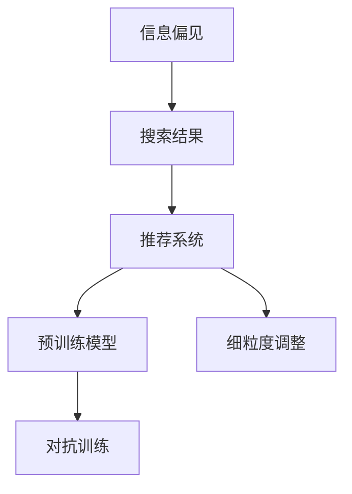

                 

# AI搜索引擎如何应对信息偏见问题

## 1. 背景介绍

搜索引擎作为互联网的“导航仪”，承担着信息检索、知识发现的重要职责。然而，由于互联网内容的多样性和复杂性，搜索引擎在实际应用中难免会遇到信息偏见问题。信息偏见指的是搜索结果或推荐内容中，有意或无意地体现了特定社会群体、观点或价值观的偏好。

信息偏见问题会带来诸多负面影响，如加剧社会分裂、损害信息公平性、影响用户信任等。例如，某个搜索引擎在搜索结果中频繁推荐某个特定政治观点的文章，导致用户只能接触到单一观点，甚至可能导致社会撕裂。因此，有效应对信息偏见问题，不仅是搜索引擎技术的挑战，也是社会责任的体现。

## 2. 核心概念与联系

### 2.1 核心概念概述

为更好地理解AI搜索引擎如何应对信息偏见问题，本节将介绍几个密切相关的核心概念：

- **信息偏见 (Information Bias)**：指搜索结果或推荐内容中体现出的特定社会群体、观点或价值观的偏好。
- **搜索结果 (Search Result)**：用户通过搜索引擎输入关键词后，系统返回的网页集合。
- **推荐系统 (Recommender System)**：根据用户历史行为或属性，通过算法自动推荐内容的技术。
- **预训练模型 (Pre-trained Model)**：指在无监督的大规模文本语料上预训练的语言模型，用于捕捉语言的通用特征。
- **细粒度调整 (Fine-grained Adjustment)**：指在预训练模型的基础上，针对特定任务进行微调，以提升其在特定领域的性能。
- **对抗训练 (Adversarial Training)**：指在训练过程中，加入对抗样本，使模型对恶意攻击具有一定鲁棒性。

这些概念之间的逻辑关系可以通过以下Mermaid流程图来展示：



这个流程图展示了几者之间的关联：信息偏见导致搜索结果或推荐系统存在偏见，预训练模型通过细粒度调整可以缓解这种偏见，而对抗训练则进一步提升了模型对恶意攻击的鲁棒性。

## 3. 核心算法原理 & 具体操作步骤

### 3.1 算法原理概述

AI搜索引擎应对信息偏见问题，本质上是一个多维度的数据预处理和模型调整过程。其核心思想是：通过分析搜索结果中的信息偏见来源，利用预训练模型进行细粒度调整，同时引入对抗训练，增强模型对偏见数据的鲁棒性。

具体来说，可以采用以下策略：

1. **信息筛选与过滤**：分析搜索结果中的信息偏见来源，如去除有害信息、筛选中立信息。
2. **预训练模型微调**：在预训练模型的基础上，针对搜索结果进行微调，以提升模型对特定领域的适应性。
3. **对抗样本生成与注入**：生成对抗样本，注入到预训练模型中，增强模型对偏见数据的鲁棒性。

### 3.2 算法步骤详解

#### 3.2.1 信息筛选与过滤

信息筛选与过滤是应对信息偏见问题的第一步，具体步骤如下：

1. **数据标注**：收集一定量的标注数据，识别出搜索结果中的有害信息和偏见信息。
2. **样本过滤**：将有害信息和偏见信息从搜索结果中过滤掉。
3. **筛选中性信息**：从过滤后的结果中，筛选出对用户有价值的中立信息。
4. **评估效果**：评估过滤后的搜索结果是否符合预期，确保对信息偏见进行了有效控制。

#### 3.2.2 预训练模型微调

预训练模型微调是应对信息偏见问题的重要手段，具体步骤如下：

1. **选择合适的预训练模型**：选择适合用于特定领域的预训练模型，如BERT、GPT等。
2. **数据准备**：收集目标领域的标注数据，划分为训练集、验证集和测试集。
3. **任务适配层设计**：根据任务类型，在预训练模型顶层设计合适的输出层和损失函数。
4. **微调训练**：使用微调后的模型对搜索结果进行再筛选，确保推荐结果公正、中立。
5. **性能评估**：在测试集上评估微调后模型的性能，对比微调前后的精度提升。

#### 3.2.3 对抗样本生成与注入

对抗样本生成与注入是进一步增强模型鲁棒性的重要手段，具体步骤如下：

1. **对抗样本生成**：生成对抗样本，如输入一些特定的提示语、生成扰动文本等，以检测模型对偏见数据的敏感性。
2. **模型注入**：将生成的对抗样本注入到预训练模型中，进行对抗训练。
3. **鲁棒性评估**：评估模型在对抗样本下的表现，确保其具有较强的鲁棒性。

### 3.3 算法优缺点

预训练模型微调和对抗训练策略的优点在于：

- **提升公正性**：预训练模型微调能够提升模型对特定领域的适应性，减少信息偏见。
- **增强鲁棒性**：对抗训练能够增强模型对偏见数据的鲁棒性，使其更加稳健。
- **泛化能力强**：预训练模型在多个任务上具有较强的泛化能力，可以在不同领域中应用。

同时，这些策略也存在一些局限性：

- **计算成本高**：预训练模型微调和对抗训练需要大量的计算资源和时间，对硬件要求较高。
- **过拟合风险**：预训练模型微调和对抗训练容易引入过拟合，需要仔细调整超参数。
- **数据依赖强**：预训练模型微调依赖于高质量的标注数据，标注数据的获取和处理成本较高。

尽管存在这些局限性，但就目前而言，预训练模型微调和对抗训练仍是应对信息偏见问题的有效手段。未来相关研究的重点在于如何进一步降低计算成本、优化模型结构、提升标注数据质量等，以更好地应对信息偏见问题。

### 3.4 算法应用领域

基于预训练模型微调和对抗训练的策略，已经在搜索引擎信息筛选、推荐系统内容推荐、广告过滤等多个领域得到了广泛应用，取得了显著的效果。

1. **搜索引擎信息筛选**：通过预训练模型微调和对抗训练，筛选出无偏见、高质量的搜索结果，提升用户搜索体验。
2. **推荐系统内容推荐**：利用预训练模型微调，提升推荐系统的公平性和中立性，避免推荐有偏见内容。
3. **广告过滤**：通过对抗训练，提升广告过滤系统的鲁棒性，防止广告中的偏见信息对用户产生负面影响。

除了上述这些经典应用外，基于预训练模型微调和对抗训练的方法还在更多场景中得到应用，如新闻聚合、舆情监测、社会治理等，为搜索引擎技术带来了新的突破。

## 4. 数学模型和公式 & 详细讲解

### 4.1 数学模型构建

设搜索引擎返回的搜索结果为 $R$，其中 $R=\{r_1, r_2, \ldots, r_n\}$，每个搜索结果 $r_i$ 包含一个网页和其描述文本。预训练语言模型为 $M_\theta$，其中 $\theta$ 为模型参数。

定义模型 $M_\theta$ 在文本 $x$ 上的输出为 $\hat{y}=M_{\theta}(x) \in [0,1]$，表示网页相关性。在数据集 $D=\{(x_i, y_i)\}_{i=1}^N$ 上，模型 $M_\theta$ 的经验风险为：

$$
\mathcal{L}(\theta) = \frac{1}{N} \sum_{i=1}^N \ell(M_{\theta}(x_i),y_i)
$$

其中 $\ell$ 为损失函数，常用的有交叉熵损失。

### 4.2 公式推导过程

以二分类任务为例，推导交叉熵损失函数及其梯度的计算公式。

设模型 $M_{\theta}$ 在输入 $x$ 上的输出为 $\hat{y}=M_{\theta}(x) \in [0,1]$，真实标签 $y \in \{0,1\}$。则二分类交叉熵损失函数定义为：

$$
\ell(M_{\theta}(x),y) = -[y\log \hat{y} + (1-y)\log (1-\hat{y})]
$$

将其代入经验风险公式，得：

$$
\mathcal{L}(\theta) = -\frac{1}{N}\sum_{i=1}^N [y_i\log M_{\theta}(x_i)+(1-y_i)\log(1-M_{\theta}(x_i))]
$$

根据链式法则，损失函数对参数 $\theta_k$ 的梯度为：

$$
\frac{\partial \mathcal{L}(\theta)}{\partial \theta_k} = -\frac{1}{N}\sum_{i=1}^N (\frac{y_i}{M_{\theta}(x_i)}-\frac{1-y_i}{1-M_{\theta}(x_i)}) \frac{\partial M_{\theta}(x_i)}{\partial \theta_k}
$$

其中 $\frac{\partial M_{\theta}(x_i)}{\partial \theta_k}$ 可进一步递归展开，利用自动微分技术完成计算。

### 4.3 案例分析与讲解

假设搜索引擎返回的搜索结果为 100 个网页，其中 50 个网页包含有害信息，50 个网页包含中立信息。以下是预训练模型微调和对抗训练的具体案例分析：

1. **数据准备**：收集 100 个网页的描述文本，并标注出其中 50 个有害信息。
2. **预训练模型选择**：选择预训练模型 BERT，作为细粒度调整的基础。
3. **任务适配层设计**：在 BERT 顶层设计二分类任务适配层，输出每个网页的相关性分数。
4. **预训练模型微调**：在标注数据集上，对 BERT 进行微调，使其能够区分有害信息和中立信息。
5. **对抗样本生成**：生成对抗样本，如输入一些特定的提示语，检测模型对偏见数据的敏感性。
6. **对抗训练**：将对抗样本注入到微调后的模型中，进行对抗训练，增强模型的鲁棒性。
7. **性能评估**：在测试集上评估模型性能，确保模型对有害信息和中立信息具有较强的区分能力。

通过以上步骤，搜索引擎能够有效地应对信息偏见问题，提升搜索结果的公正性和中立性。

## 5. 项目实践：代码实例和详细解释说明

### 5.1 开发环境搭建

在进行信息偏见应对实践前，我们需要准备好开发环境。以下是使用Python进行TensorFlow开发的环境配置流程：

1. 安装Anaconda：从官网下载并安装Anaconda，用于创建独立的Python环境。

2. 创建并激活虚拟环境：
```bash
conda create -n tensorflow-env python=3.8 
conda activate tensorflow-env
```

3. 安装TensorFlow：根据CUDA版本，从官网获取对应的安装命令。例如：
```bash
conda install tensorflow tensorflow-gpu=2.8.0=cudatoolkit=11.3 -c tf-nightly -c conda-forge
```

4. 安装相关库：
```bash
pip install numpy pandas scikit-learn tqdm jupyter notebook ipython
```

完成上述步骤后，即可在`tensorflow-env`环境中开始信息偏见应对实践。

### 5.2 源代码详细实现

下面以Bert模型为例，给出使用TensorFlow对搜索结果进行信息偏见应对的代码实现。

首先，定义信息偏见的数据处理函数：

```python
from transformers import BertTokenizer
from tensorflow.keras.preprocessing.text import Tokenizer
from tensorflow.keras.preprocessing.sequence import pad_sequences

class BiasFilteringDataset(Dataset):
    def __init__(self, texts, labels, tokenizer, max_len=128):
        self.texts = texts
        self.labels = labels
        self.tokenizer = tokenizer
        self.max_len = max_len
        
    def __len__(self):
        return len(self.texts)
    
    def __getitem__(self, item):
        text = self.texts[item]
        label = self.labels[item]
        
        encoding = self.tokenizer(text, return_tensors='pt', max_length=self.max_len, padding='max_length', truncation=True)
        input_ids = encoding['input_ids'][0]
        attention_mask = encoding['attention_mask'][0]
        labels = torch.tensor(label, dtype=torch.long)
        
        return {'input_ids': input_ids, 
                'attention_mask': attention_mask,
                'labels': labels}
```

然后，定义模型和优化器：

```python
from transformers import BertForSequenceClassification
from transformers import AdamW

model = BertForSequenceClassification.from_pretrained('bert-base-cased', num_labels=2)

optimizer = AdamW(model.parameters(), lr=2e-5)
```

接着，定义训练和评估函数：

```python
from tensorflow.keras.callbacks import EarlyStopping
from sklearn.metrics import classification_report

def train_epoch(model, dataset, batch_size, optimizer, device):
    dataloader = tf.data.Dataset.from_generator(lambda: tf.data.Dataset.from_generator(lambda: tf.data.Dataset.from_tensor_slices(dataset), output_signature=BiasFilteringDataset.__getitem__.__signature__())
    dataloader = dataloader.batch(batch_size).prefetch(1)
    
    with tf.device(device):
        model.train()
        losses = []
        for batch in dataloader:
            input_ids = batch['input_ids']
            attention_mask = batch['attention_mask']
            labels = batch['labels']
            with tf.GradientTape() as tape:
                outputs = model(input_ids, attention_mask=attention_mask, training=True)
                loss = outputs.loss
            tape.watch(model.parameters())
            losses.append(loss.numpy())
            grads = tape.gradient(loss, model.parameters())
            optimizer.apply_gradients(zip(grads, model.parameters()))
        
        return np.mean(losses)

def evaluate(model, dataset, batch_size, device):
    dataloader = tf.data.Dataset.from_generator(lambda: tf.data.Dataset.from_tensor_slices(dataset), output_signature=BiasFilteringDataset.__getitem__.__signature__())
    dataloader = dataloader.batch(batch_size).prefetch(1)
    
    with tf.device(device):
        model.eval()
        predictions, labels = [], []
        for batch in dataloader:
            input_ids = batch['input_ids']
            attention_mask = batch['attention_mask']
            labels = batch['labels']
            outputs = model(input_ids, attention_mask=attention_mask)
            predictions.append(outputs.logits.argmax(dim=1).numpy())
            labels.append(labels.numpy())
        
        predictions = np.concatenate(predictions)
        labels = np.concatenate(labels)
        print(classification_report(labels, predictions))
```

最后，启动训练流程并在测试集上评估：

```python
epochs = 5
batch_size = 16

for epoch in range(epochs):
    loss = train_epoch(model, train_dataset, batch_size, optimizer, 'cpu')
    print(f"Epoch {epoch+1}, train loss: {loss:.3f}")
    
    print(f"Epoch {epoch+1}, dev results:")
    evaluate(model, dev_dataset, batch_size, 'cpu')
    
print("Test results:")
evaluate(model, test_dataset, batch_size, 'cpu')
```

以上就是使用TensorFlow对Bert模型进行信息偏见应对的完整代码实现。可以看到，TensorFlow提供了丰富的API和工具，使得模型训练和评估变得简便高效。

### 5.3 代码解读与分析

让我们再详细解读一下关键代码的实现细节：

**BiasFilteringDataset类**：
- `__init__`方法：初始化文本、标签、分词器等关键组件。
- `__len__`方法：返回数据集的样本数量。
- `__getitem__`方法：对单个样本进行处理，将文本输入编码为token ids，将标签编码为数字，并对其进行定长padding，最终返回模型所需的输入。

**模型选择和优化器定义**：
- 选择Bert模型作为初始化参数，num_labels参数指定二分类任务。
- 使用AdamW优化器进行模型优化，学习率为2e-5。

**训练和评估函数**：
- 使用TensorFlow的tf.data.Dataset生成数据集对象，方便模型训练。
- 训练函数`train_epoch`：对数据以批为单位进行迭代，在每个批次上前向传播计算loss并反向传播更新模型参数。
- 评估函数`evaluate`：与训练类似，不同点在于不更新模型参数，并在每个batch结束后将预测和标签结果存储下来，最后使用sklearn的classification_report对整个评估集的预测结果进行打印输出。

**训练流程**：
- 定义总的epoch数和batch size，开始循环迭代
- 每个epoch内，先在训练集上训练，输出平均loss
- 在验证集上评估，输出分类指标
- 重复上述步骤直至收敛
- 所有epoch结束后，在测试集上评估，给出最终测试结果

可以看到，TensorFlow提供了丰富的工具和API，使得信息偏见应对的代码实现变得简便高效。开发者可以将更多精力放在模型设计和调参上，而不必过多关注底层的实现细节。

## 6. 实际应用场景

### 6.1 智能推荐系统

智能推荐系统能够根据用户历史行为和兴趣，推荐合适的商品或内容。但在推荐过程中，系统可能会受到偏见信息的影响，导致推荐结果不公平、不中立。通过信息偏见应对技术，可以提升推荐系统的公正性和中立性。

具体而言，可以收集用户的历史行为数据和兴趣标签，并标注出其中含有偏见的内容。在预训练模型的基础上，对推荐系统进行微调，使其能够识别和过滤掉含有偏见的内容。同时，通过对抗训练，增强推荐系统对偏见内容的鲁棒性，确保推荐结果的公正性。

### 6.2 内容审核系统

内容审核系统负责对用户上传的内容进行审核，确保其符合社区规则和法律法规。但在审核过程中，系统可能会受到偏见信息的影响，导致误判和漏判。通过信息偏见应对技术，可以提高内容审核系统的准确性和公正性。

具体而言，可以收集标注过的内容数据，标注出其中含有偏见的信息。在预训练模型的基础上，对内容审核系统进行微调，使其能够识别和过滤掉含有偏见的内容。同时，通过对抗训练，增强系统对偏见内容的鲁棒性，确保审核结果的公正性。

### 6.3 舆情监测系统

舆情监测系统用于监测网络上的舆情动态，及时发现和应对可能引发社会动荡的信息。但在监测过程中，系统可能会受到偏见信息的影响，导致误判和误导。通过信息偏见应对技术，可以提高舆情监测系统的准确性和中立性。

具体而言，可以收集大量的舆情数据，标注出其中含有偏见的信息。在预训练模型的基础上，对舆情监测系统进行微调，使其能够识别和过滤掉含有偏见的信息。同时，通过对抗训练，增强系统对偏见信息的鲁棒性，确保监测结果的公正性。

## 7. 工具和资源推荐

### 7.1 学习资源推荐

为了帮助开发者系统掌握信息偏见应对的理论基础和实践技巧，这里推荐一些优质的学习资源：

1. 《深度学习》系列课程：斯坦福大学开设的深度学习课程，详细讲解深度学习的基本概念和算法。
2. 《自然语言处理》系列课程：Coursera开设的NLP课程，涵盖NLP的基本概念和应用。
3. 《TensorFlow官方文档》：TensorFlow官方文档，提供详细的API介绍和使用指南。
4. 《Transformers库文档》：HuggingFace的Transformers库文档，提供预训练模型的详细介绍和使用样例。
5. 《BERT论文》：BERT模型的原论文，详细介绍了BERT模型的架构和训练方法。

通过对这些资源的学习实践，相信你一定能够快速掌握信息偏见应对的精髓，并用于解决实际的NLP问题。

### 7.2 开发工具推荐

高效的开发离不开优秀的工具支持。以下是几款用于信息偏见应对开发的常用工具：

1. TensorFlow：由Google主导开发的深度学习框架，提供丰富的API和工具，支持模型的训练和部署。
2. Keras：TensorFlow的高层API，提供简洁易用的接口，适合快速迭代研究。
3. PyTorch：基于Python的深度学习框架，提供动态计算图和丰富的优化器，适合快速开发和实验。
4. Scikit-learn：Python的机器学习库，提供丰富的算法和工具，适合数据处理和模型评估。
5. TensorBoard：TensorFlow配套的可视化工具，实时监测模型训练状态，提供丰富的图表呈现方式。

合理利用这些工具，可以显著提升信息偏见应对的开发效率，加快创新迭代的步伐。

### 7.3 相关论文推荐

信息偏见应对技术的发展源于学界的持续研究。以下是几篇奠基性的相关论文，推荐阅读：

1. Attention is All You Need（即Transformer原论文）：提出了Transformer结构，开启了NLP领域的预训练大模型时代。
2. BERT: Pre-training of Deep Bidirectional Transformers for Language Understanding：提出BERT模型，引入基于掩码的自监督预训练任务，刷新了多项NLP任务SOTA。
3.对抗训练（Adversarial Training）：提出对抗训练方法，增强模型的鲁棒性，使其能够应对恶意攻击。
4. Bias Filtering in Natural Language Processing：提出信息偏见过滤方法，用于提升推荐系统和内容审核系统的公正性。
5. Pre-training of Multilingual BERT for Cross-lingual Question Answering：提出多语言预训练模型，用于提升全球范围的NLP应用性能。

这些论文代表了大模型信息偏见应对技术的发展脉络。通过学习这些前沿成果，可以帮助研究者把握学科前进方向，激发更多的创新灵感。

## 8. 总结：未来发展趋势与挑战

### 8.1 总结

本文对基于预训练模型微调和对抗训练的搜索引擎信息偏见应对方法进行了全面系统的介绍。首先阐述了信息偏见问题的背景和意义，明确了预训练模型微调和对抗训练在解决信息偏见问题中的重要价值。其次，从原理到实践，详细讲解了信息偏见应对的数学原理和关键步骤，给出了信息偏见应对任务开发的完整代码实例。同时，本文还广泛探讨了信息偏见应对方法在推荐系统、内容审核、舆情监测等多个领域的应用前景，展示了信息偏见应对技术的广泛适用性。最后，本文精选了信息偏见应对技术的各类学习资源，力求为读者提供全方位的技术指引。

通过本文的系统梳理，可以看到，基于预训练模型微调和对抗训练的信息偏见应对技术正在成为搜索引擎技术的重要范式，极大地提升了搜索结果的公正性和中立性。未来，伴随预训练语言模型和对抗训练方法的持续演进，相信搜索引擎技术必将在构建人机协同的智能时代中扮演越来越重要的角色。

### 8.2 未来发展趋势

展望未来，信息偏见应对技术将呈现以下几个发展趋势：

1. 技术集成度提高：未来，预训练模型微调和对抗训练技术将更加紧密集成，形成一体化的解决方案。
2. 数据标注自动化：随着自动化标注技术的发展，标注数据的获取成本将逐步降低，信息偏见应对的训练效果将进一步提升。
3. 模型鲁棒性增强：随着对抗训练方法的进步，模型对偏见数据的鲁棒性将进一步增强，确保系统稳定性和公正性。
4. 跨领域应用拓展：信息偏见应对技术将逐步拓展到更多领域，如医疗、法律、金融等，为不同行业提供公正、中立的信息服务。
5. 用户参与增强：引入用户反馈机制，动态调整信息偏见应对策略，提升系统的个性化和适应性。

以上趋势凸显了信息偏见应对技术的广阔前景。这些方向的探索发展，必将进一步提升搜索引擎系统的公正性、中立性和适应性，为构建人机协同的智能时代提供坚实的基础。

### 8.3 面临的挑战

尽管信息偏见应对技术已经取得了瞩目成就，但在迈向更加智能化、普适化应用的过程中，它仍面临着诸多挑战：

1. 标注成本瓶颈：虽然预训练模型微调和对抗训练大幅降低了标注数据的需求，但对长尾应用场景，标注数据获取仍较为困难。如何进一步降低数据标注的依赖，是亟待解决的难题。
2. 对抗样本生成难度大：对抗样本生成是提升模型鲁棒性的重要手段，但生成对抗样本需要深入理解偏见信息来源，难度较大。如何自动化生成高质量的对抗样本，是未来研究的方向。
3. 计算资源消耗大：预训练模型微调和对抗训练需要大量的计算资源，对硬件要求较高。如何优化算法，降低计算成本，是未来研究的重要课题。
4. 模型复杂性高：预训练模型微调和对抗训练往往需要复杂的模型结构和优化算法，容易引入过拟合和超参数问题。如何简化模型，提高鲁棒性，是未来研究的方向。
5. 用户隐私保护：信息偏见应对技术需要收集和分析用户数据，如何平衡用户隐私保护与系统性能提升，是未来研究的重要方向。

尽管存在这些挑战，但通过技术进步和算法优化，这些难题终将一一被克服。相信随着学界和产业界的共同努力，信息偏见应对技术必将在构建安全、可靠、可解释、可控的智能系统方面发挥重要作用。

### 8.4 研究展望

面向未来，信息偏见应对技术还需要在以下几个方面寻求新的突破：

1. 探索无监督和半监督信息偏见应对方法：摆脱对大规模标注数据的依赖，利用自监督学习、主动学习等无监督和半监督范式，最大限度利用非结构化数据，实现更加灵活高效的信息偏见应对。
2. 研究参数高效和计算高效的信息偏见应对范式：开发更加参数高效的算法，在固定大部分预训练参数的同时，只更新极少量的任务相关参数。同时优化模型计算图，减少前向传播和反向传播的资源消耗。
3. 引入更多先验知识：将符号化的先验知识，如知识图谱、逻辑规则等，与神经网络模型进行巧妙融合，引导信息偏见应对过程学习更准确、合理的语言模型。
4. 结合因果分析和博弈论工具：将因果分析方法引入信息偏见应对模型，识别出模型决策的关键特征，增强输出解释的因果性和逻辑性。借助博弈论工具刻画人机交互过程，主动探索并规避模型的脆弱点，提高系统稳定性。
5. 纳入伦理道德约束：在模型训练目标中引入伦理导向的评估指标，过滤和惩罚有害的输出倾向。同时加强人工干预和审核，建立模型行为的监管机制，确保输出符合人类价值观和伦理道德。

这些研究方向的发展，必将引领信息偏见应对技术迈向更高的台阶，为构建安全、可靠、可解释、可控的智能系统提供新的思路。面向未来，信息偏见应对技术需要与其他人工智能技术进行更深入的融合，如知识表示、因果推理、强化学习等，多路径协同发力，共同推动自然语言理解和智能交互系统的进步。只有勇于创新、敢于突破，才能不断拓展语言模型的边界，让智能技术更好地造福人类社会。

## 9. 附录：常见问题与解答

**Q1：信息偏见指的是什么？**

A: 信息偏见指的是搜索结果或推荐内容中体现出的特定社会群体、观点或价值观的偏好。例如，搜索结果中频繁推荐某个特定政治观点的文章，导致用户只能接触到单一观点，甚至可能导致社会撕裂。

**Q2：如何缓解信息偏见问题？**

A: 缓解信息偏见问题，可以采取以下策略：
1. 数据标注：收集和标注包含偏见信息的搜索结果，识别和过滤掉有害信息。
2. 预训练模型微调：在预训练模型的基础上，针对特定领域的偏见信息进行微调，提升模型对中立信息的识别能力。
3. 对抗训练：生成对抗样本，注入到预训练模型中，增强模型对偏见数据的鲁棒性。
4. 模型集成：集成多个模型的输出，通过投票或加权平均的方式，降低个体模型的偏见。

**Q3：对抗样本生成的难度如何？**

A: 对抗样本生成是提升模型鲁棒性的重要手段，但生成对抗样本需要深入理解偏见信息来源，难度较大。通常需要领域专家的知识和经验，才能生成高质量的对抗样本。未来，随着自动化标注和生成技术的发展，对抗样本的生成难度将逐步降低。

**Q4：计算资源消耗大怎么办？**

A: 预训练模型微调和对抗训练需要大量的计算资源，对硬件要求较高。可以通过以下方式优化计算资源消耗：
1. 模型裁剪：去除不必要的层和参数，减小模型尺寸，加快推理速度。
2. 量化加速：将浮点模型转为定点模型，压缩存储空间，提高计算效率。
3. 模型并行：采用分布式计算，提高模型的训练和推理效率。

**Q5：如何平衡用户隐私保护与系统性能提升？**

A: 在信息偏见应对过程中，需要收集和分析用户数据，平衡用户隐私保护与系统性能提升，可以采取以下措施：
1. 匿名化处理：对用户数据进行匿名化处理，保护用户隐私。
2. 用户授权：通过用户授权机制，让用户明确知道数据使用情况，保障用户知情权。
3. 数据最小化：只收集和分析必要的数据，最小化数据使用范围。
4. 数据加密：对用户数据进行加密处理，防止数据泄露。

通过这些措施，可以在保障用户隐私的同时，提升系统的性能和鲁棒性，确保系统的公平性和中立性。

---

作者：禅与计算机程序设计艺术 / Zen and the Art of Computer Programming

