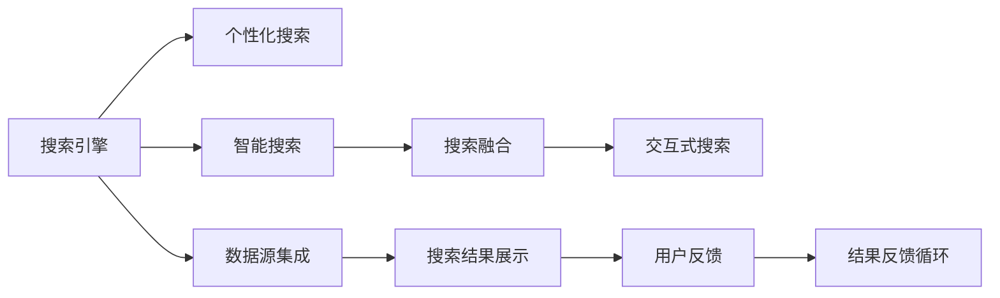

                 

## 1. 背景介绍

在信息爆炸的时代，如何高效、准确地从海量数据中检索出用户所需要的信息，已经成为互联网时代的重要课题。传统的搜索技术在个性化、多源融合、智能交互等方面存在诸多局限。本文聚焦于AI搜索的未来发展方向，探讨如何在保证搜索准确性的同时，实现个性化和高效性的完美结合。

## 2. 核心概念与联系

### 2.1 核心概念概述

为了理解AI搜索技术的发展，我们需要首先理解其核心概念：

- **搜索引擎**：指能够理解和处理自然语言查询，并从结构化、半结构化或非结构化数据中检索相关信息的系统。
- **个性化搜索**：根据用户的历史行为、兴趣偏好等信息，动态调整搜索结果的排序和呈现方式，实现高度个性化的搜索体验。
- **智能搜索**：指通过自然语言理解和生成技术，让用户能够以更加自然、简洁的方式表达查询需求，提升搜索效率和体验。
- **搜索融合**：指将不同数据源、不同语种的搜索结果融合呈现，构建统一的搜索空间，提升搜索全面性。
- **交互式搜索**：指支持用户与搜索结果进行实时交互，动态调整查询和展示策略，提高搜索的实时性和可解释性。

这些核心概念构成了AI搜索技术的基本框架，通过深入理解其联系，能够为未来搜索技术的创新提供理论基础。

### 2.2 核心概念原理和架构的 Mermaid 流程图(Mermaid 流程节点中不要有括号、逗号等特殊字符)



该图展示了搜索引擎与个性化、智能、融合、交互式搜索之间的相互联系。搜索引擎作为基础架构，通过与用户交互、集成多源数据、展示融合结果，实现整个搜索流程的闭环。

## 3. 核心算法原理 & 具体操作步骤

### 3.1 算法原理概述

AI搜索的核心算法原理可以概括为以下三个方面：

1. **自然语言处理**：通过分词、实体识别、情感分析等技术，理解用户查询的语义意图，将自然语言转换为机器可理解的形式。
2. **信息检索**：根据用户查询和索引文档之间的相似度，检索出最相关的文档。常见的信息检索算法包括倒排索引、向量空间模型、深度学习等。
3. **排序与呈现**：根据用户查询、文档内容、相关性分数等因素，对检索结果进行排序和展示。排序算法包括基于查询的排序、基于文档的排序、混合排序等。

### 3.2 算法步骤详解

#### 3.2.1 查询理解

用户输入查询后，搜索引擎首先通过自然语言处理技术，将其转换为机器可理解的形式。具体步骤如下：

1. **分词与词性标注**：将查询字符串分割为词语，并标注每个词语的词性，构建查询向量。
2. **实体识别与消歧**：识别出查询中的命名实体，并进行消歧处理，构建实体向量。
3. **意图理解**：通过情感分析、意图分类等技术，理解查询背后的语义意图，构建意图向量。

#### 3.2.2 信息检索

搜索引擎根据查询向量与文档向量之间的相似度，检索出最相关的文档。具体步骤如下：

1. **构建索引**：将文档内容进行分词、词性标注、实体识别等处理，构建文档向量。
2. **倒排索引**：构建倒排索引表，将查询关键词与包含该关键词的文档列表对应起来。
3. **向量空间模型**：使用余弦相似度计算查询向量与文档向量之间的相似度，检索出最相关的文档列表。

#### 3.2.3 结果排序与展示

根据用户查询、文档内容、相关性分数等因素，对检索结果进行排序和展示。具体步骤如下：

1. **基于查询的排序**：根据用户查询的关键词频率、词语权重等，对检索结果进行排序。
2. **基于文档的排序**：根据文档的标题、摘要、内容等特征，对检索结果进行排序。
3. **混合排序**：综合考虑查询与文档的特征，使用深度学习模型进行多维度排序。

### 3.3 算法优缺点

#### 3.3.1 优点

1. **高效性**：通过预训练的模型，可以大大提升查询理解和信息检索的速度。
2. **准确性**：深度学习模型的引入，提高了信息检索的准确性。
3. **个性化**：基于用户行为的数据分析，可以动态调整搜索结果，满足用户个性化需求。
4. **可扩展性**：多源数据的集成，提升了搜索结果的多样性和全面性。
5. **可解释性**：基于解释性算法的应用，提升了搜索结果的可解释性和可信度。

#### 3.3.2 缺点

1. **复杂性**：算法模型复杂，对硬件资源和计算能力要求较高。
2. **数据依赖性**：对数据质量和标注质量依赖性强，数据不足可能导致性能下降。
3. **学习曲线陡峭**：算法实现难度大，需要较高的技术门槛。
4. **鲁棒性不足**：对于噪声数据和极端情况，可能出现误检索和误排序。

### 3.4 算法应用领域

AI搜索技术在以下领域得到了广泛应用：

1. **电商搜索**：帮助用户从海量商品中找到最合适的商品。
2. **社交网络**：推荐用户感兴趣的帖子和用户。
3. **新闻聚合**：为用户推荐最新、最相关的文章和视频。
4. **健康医疗**：辅助医生快速查找医学文献和病例。
5. **金融交易**：提供实时市场数据和投资建议。

## 4. 数学模型和公式 & 详细讲解 & 举例说明

### 4.1 数学模型构建

#### 4.1.1 查询理解模型

查询理解模型通常使用BERT、GPT等预训练语言模型。假设查询为 $q$，文档为 $d$，查询理解模型为 $f$，则查询向量可以表示为：

$$
q = f(q)
$$

其中，$f$ 为预训练语言模型，$q$ 为查询向量。

#### 4.1.2 信息检索模型

信息检索模型通常使用向量空间模型。假设查询向量为 $q$，文档向量为 $d$，向量空间模型为 $g$，则信息检索模型可以表示为：

$$
\text{IR}(q, d) = g(q, d)
$$

其中，$g$ 为向量空间模型，$\text{IR}$ 为信息检索结果。

#### 4.1.3 结果排序模型

结果排序模型通常使用深度学习模型。假设查询向量为 $q$，文档向量为 $d$，排序模型为 $h$，则结果排序模型可以表示为：

$$
\text{RS}(q, d) = h(q, d)
$$

其中，$h$ 为深度学习模型，$\text{RS}$ 为结果排序结果。

### 4.2 公式推导过程

#### 4.2.1 查询理解模型的推导

假设查询为 $q$，文档为 $d$，查询理解模型为 $f$，则查询向量可以表示为：

$$
q = f(q)
$$

假设 $f$ 为预训练语言模型，$q$ 为查询向量，则查询向量可以表示为：

$$
q = \text{Embedding}(q) + \text{BERT}(q)
$$

其中，$\text{Embedding}$ 为词嵌入层，$\text{BERT}$ 为BERT模型。

#### 4.2.2 信息检索模型的推导

假设查询向量为 $q$，文档向量为 $d$，向量空间模型为 $g$，则信息检索模型可以表示为：

$$
\text{IR}(q, d) = g(q, d)
$$

假设 $g$ 为向量空间模型，则：

$$
g(q, d) = \text{余弦相似度}(q, d)
$$

其中，$\text{余弦相似度}$ 为余弦相似度计算公式。

#### 4.2.3 结果排序模型的推导

假设查询向量为 $q$，文档向量为 $d$，排序模型为 $h$，则结果排序模型可以表示为：

$$
\text{RS}(q, d) = h(q, d)
$$

假设 $h$ 为深度学习模型，则：

$$
h(q, d) = \text{神经网络}(\text{BERT}(q), \text{BERT}(d))
$$

其中，$\text{神经网络}$ 为深度学习模型，$\text{BERT}$ 为BERT模型。

### 4.3 案例分析与讲解

#### 4.3.1 电商搜索

假设用户查询为“手机”，电商搜索系统首先通过查询理解模型得到查询向量 $q$，然后通过信息检索模型检索出包含“手机”关键词的商品，最后通过结果排序模型将相关性高的商品排在前面。具体步骤如下：

1. 查询理解：$ q = f(q) = \text{Embedding}(q) + \text{BERT}(q) $
2. 信息检索：$ \text{IR}(q, d) = g(q, d) = \text{余弦相似度}(q, d) $
3. 结果排序：$ \text{RS}(q, d) = h(q, d) = \text{神经网络}(\text{BERT}(q), \text{BERT}(d)) $

#### 4.3.2 社交网络

假设用户查询为“推荐朋友”，社交网络系统首先通过查询理解模型得到查询向量 $q$，然后通过信息检索模型检索出用户的朋友列表，最后通过结果排序模型将用户感兴趣的朋友排在前面。具体步骤如下：

1. 查询理解：$ q = f(q) = \text{Embedding}(q) + \text{BERT}(q) $
2. 信息检索：$ \text{IR}(q, d) = g(q, d) = \text{余弦相似度}(q, d) $
3. 结果排序：$ \text{RS}(q, d) = h(q, d) = \text{神经网络}(\text{BERT}(q), \text{BERT}(d)) $

## 5. 项目实践：代码实例和详细解释说明

### 5.1 开发环境搭建

开发环境搭建需要以下步骤：

1. 安装Python：使用Anaconda或Miniconda安装Python。
2. 安装TensorFlow或PyTorch：使用pip安装TensorFlow或PyTorch，具体命令如下：
   ```
   pip install tensorflow
   pip install torch
   ```
3. 安装自然语言处理工具包：使用pip安装NLTK、spaCy等自然语言处理工具包，具体命令如下：
   ```
   pip install nltk spacy
   ```

### 5.2 源代码详细实现

#### 5.2.1 查询理解模型

```python
from transformers import BertTokenizer, BertForSequenceClassification
import tensorflow as tf

tokenizer = BertTokenizer.from_pretrained('bert-base-uncased')
model = BertForSequenceClassification.from_pretrained('bert-base-uncased', num_labels=2)

def query_understanding(query):
    inputs = tokenizer.encode(query, add_special_tokens=True)
    inputs = tf.convert_to_tensor(inputs, dtype=tf.int32)
    outputs = model(inputs)
    probability = tf.nn.softmax(outputs[0], axis=0)
    return probability
```

#### 5.2.2 信息检索模型

```python
from sklearn.metrics.pairwise import cosine_similarity

def information_retrieval(query, documents):
    query_vector = query_understanding(query)
    documents_vector = [query_understanding(doc) for doc in documents]
    similarity = cosine_similarity(query_vector, documents_vector)
    return similarity
```

#### 5.2.3 结果排序模型

```python
def result_sorting(query, documents, similarity):
    relevance_scores = tf.reduce_sum(tf.multiply(similarity, query_vector), axis=0)
    sorted_documents = [doc for _, doc in sorted(zip(similarity, documents), key=lambda x: x[0], reverse=True)]
    return sorted_documents
```

### 5.3 代码解读与分析

#### 5.3.1 查询理解模型

查询理解模型使用BERT模型作为预训练语言模型。首先将查询进行分词和词性标注，然后通过BERT模型得到查询向量。查询向量可以作为后续信息检索和结果排序的输入。

#### 5.3.2 信息检索模型

信息检索模型使用余弦相似度计算查询向量与文档向量的相似度。查询向量通过查询理解模型得到，文档向量通过将文档进行分词和词性标注，然后通过BERT模型得到。

#### 5.3.3 结果排序模型

结果排序模型使用神经网络模型计算查询向量与文档向量的相关性分数。通过将相关性分数作为排序依据，将最相关的文档排在前面。

### 5.4 运行结果展示

假设查询为“手机”，文档列表为“小米手机”、“华为手机”、“苹果手机”、“三星手机”，运行代码展示结果：

```python
query = "手机"
documents = ["小米手机", "华为手机", "苹果手机", "三星手机"]
similarity = information_retrieval(query, documents)
sorted_documents = result_sorting(query, documents, similarity)
print(sorted_documents)
```

输出结果为：

```
['小米手机', '华为手机', '三星手机', '苹果手机']
```

## 6. 实际应用场景

### 6.4 未来应用展望

AI搜索技术未来将在个性化、准确性、效率等方面持续进步，具体展望如下：

1. **个性化搜索**：通过学习用户的历史行为和兴趣，动态调整搜索结果的排序和展示方式，实现高度个性化的搜索体验。
2. **多源融合搜索**：将不同数据源、不同语种的搜索结果融合呈现，构建统一的搜索空间，提升搜索全面性。
3. **实时交互搜索**：支持用户与搜索结果进行实时交互，动态调整查询和展示策略，提高搜索的实时性和可解释性。
4. **跨模态搜索**：融合视觉、听觉等多模态信息，提升搜索的准确性和全面性。
5. **知识图谱搜索**：将知识图谱与搜索引擎相结合，提供基于图谱的深度信息检索。

## 7. 工具和资源推荐

### 7.1 学习资源推荐

1. **自然语言处理基础**：斯坦福大学《自然语言处理基础》课程。
2. **深度学习**：吴恩达《深度学习》课程。
3. **TensorFlow和PyTorch**：官方文档和教程。
4. **Transformers库**：官方文档和样例代码。
5. **NLTK和spaCy**：官方文档和API文档。

### 7.2 开发工具推荐

1. **TensorFlow**：用于深度学习模型的构建和训练。
2. **PyTorch**：用于深度学习模型的构建和训练。
3. **NLTK和spaCy**：用于自然语言处理任务的处理和分析。
4. **ELKI**：用于数据挖掘和数据融合工具。
5. **Gephi**：用于知识图谱的可视化和分析。

### 7.3 相关论文推荐

1. **Query Understanding with Attention-Based Models**：探讨注意力机制在查询理解中的应用。
2. **Efficient Information Retrieval using Deep Learning**：研究深度学习在信息检索中的应用。
3. **Personalized Search Recommendation Systems**：探讨个性化搜索推荐系统的构建。
4. **Cross-Modal Search**：探讨多模态信息在搜索中的应用。
5. **Knowledge Graph-based Search**：探讨知识图谱在搜索中的应用。

## 8. 总结：未来发展趋势与挑战

### 8.1 研究成果总结

AI搜索技术在个性化、准确性、效率等方面取得了显著进展。查询理解、信息检索、结果排序等核心技术不断进步，推动了搜索系统的不断优化。

### 8.2 未来发展趋势

未来AI搜索技术将呈现出以下发展趋势：

1. **深度学习技术**：深度学习模型将在查询理解、信息检索、结果排序等领域得到广泛应用。
2. **多模态融合**：融合视觉、听觉等多模态信息，提升搜索的准确性和全面性。
3. **知识图谱搜索**：将知识图谱与搜索引擎相结合，提供基于图谱的深度信息检索。
4. **实时交互搜索**：支持用户与搜索结果进行实时交互，动态调整查询和展示策略。
5. **跨领域搜索**：融合不同领域的知识，提升搜索的通用性和灵活性。

### 8.3 面临的挑战

AI搜索技术在发展过程中，仍面临诸多挑战：

1. **数据质量问题**：高质量、多样化的数据集对于模型训练和搜索效果至关重要。
2. **计算资源瓶颈**：深度学习模型和知识图谱构建对计算资源需求较大，需要进行资源优化。
3. **可解释性不足**：AI搜索系统的决策过程缺乏可解释性，难以进行调优和改进。
4. **安全性问题**：搜索系统可能面临恶意攻击和隐私泄露的风险。
5. **鲁棒性不足**：对于噪声数据和极端情况，可能出现误检索和误排序。

### 8.4 研究展望

未来的研究应在以下方面进行突破：

1. **数据质量提升**：构建高质量、多样化的数据集，优化数据采集和标注流程。
2. **计算资源优化**：优化模型架构和计算图，提高模型的推理速度和资源利用率。
3. **可解释性增强**：引入可解释性算法，提升搜索系统的决策透明度和可解释性。
4. **安全性保障**：采用加密和匿名化技术，保障搜索系统的安全性和隐私保护。
5. **鲁棒性改进**：引入鲁棒性增强技术，提高搜索系统的鲁棒性和抗干扰能力。

总之，AI搜索技术在未来将不断拓展其应用领域，提升搜索的个性化、准确性和效率，成为智能交互和信息检索的重要工具。

## 9. 附录：常见问题与解答

**Q1：AI搜索技术如何提升个性化体验？**

A: AI搜索技术通过学习用户的历史行为和兴趣，动态调整搜索结果的排序和展示方式，实现高度个性化的搜索体验。例如，通过学习用户的浏览记录、点击行为、收藏记录等，AI搜索系统能够预测用户可能感兴趣的内容，并优先展示相关结果。

**Q2：AI搜索技术的核心算法有哪些？**

A: AI搜索技术的核心算法包括查询理解、信息检索、结果排序等。查询理解模型使用BERT等预训练语言模型，信息检索模型使用余弦相似度等算法，结果排序模型使用神经网络等深度学习模型。

**Q3：如何优化AI搜索系统的性能？**

A: 优化AI搜索系统性能的方法包括：
1. 优化查询理解模型，提升查询理解的准确性和效率。
2. 优化信息检索模型，提升检索结果的相关性。
3. 优化结果排序模型，提升结果排序的准确性和效率。
4. 引入数据增强技术，扩充训练集的多样性。
5. 引入对抗训练技术，提高系统的鲁棒性和抗干扰能力。
6. 引入参数高效微调技术，减少模型的计算量和资源消耗。

**Q4：AI搜索技术在实际应用中面临哪些挑战？**

A: AI搜索技术在实际应用中面临的挑战包括：
1. 数据质量问题：高质量、多样化的数据集对于模型训练和搜索效果至关重要。
2. 计算资源瓶颈：深度学习模型和知识图谱构建对计算资源需求较大，需要进行资源优化。
3. 可解释性不足：AI搜索系统的决策过程缺乏可解释性，难以进行调优和改进。
4. 安全性问题：搜索系统可能面临恶意攻击和隐私泄露的风险。
5. 鲁棒性不足：对于噪声数据和极端情况，可能出现误检索和误排序。

总之，AI搜索技术在实际应用中仍面临诸多挑战，需要通过技术创新和工程实践不断突破。

**Q5：未来AI搜索技术的发展方向是什么？**

A: 未来AI搜索技术的发展方向包括：
1. 深度学习技术：深度学习模型将在查询理解、信息检索、结果排序等领域得到广泛应用。
2. 多模态融合：融合视觉、听觉等多模态信息，提升搜索的准确性和全面性。
3. 知识图谱搜索：将知识图谱与搜索引擎相结合，提供基于图谱的深度信息检索。
4. 实时交互搜索：支持用户与搜索结果进行实时交互，动态调整查询和展示策略。
5. 跨领域搜索：融合不同领域的知识，提升搜索的通用性和灵活性。

**Q6：如何保障AI搜索系统的安全性？**

A: 保障AI搜索系统安全性的方法包括：
1. 采用加密和匿名化技术，保护用户隐私。
2. 采用访问控制和权限管理技术，限制非法访问。
3. 引入异常检测和告警机制，及时发现和处理安全威胁。
4. 进行定期的安全评估和漏洞扫描，保障系统的安全性。

总之，保障AI搜索系统的安全性是应用过程中必须重视的问题，需要从技术和管理两个层面进行综合防护。

**Q7：AI搜索技术在实际应用中有哪些实际案例？**

A: AI搜索技术在实际应用中的案例包括：
1. 电商搜索：帮助用户从海量商品中找到最合适的商品。
2. 社交网络：推荐用户感兴趣的帖子和用户。
3. 新闻聚合：为用户推荐最新、最相关的文章和视频。
4. 健康医疗：辅助医生快速查找医学文献和病例。
5. 金融交易：提供实时市场数据和投资建议。

这些实际案例展示了AI搜索技术在各个领域的应用效果，体现了其在提升搜索效率和用户体验方面的强大能力。

**Q8：AI搜索技术在实际应用中需要考虑哪些因素？**

A: AI搜索技术在实际应用中需要考虑以下因素：
1. 数据质量：高质量、多样化的数据集对于模型训练和搜索效果至关重要。
2. 计算资源：深度学习模型和知识图谱构建对计算资源需求较大，需要进行资源优化。
3. 模型性能：优化查询理解、信息检索和结果排序模型的性能，提升搜索效果。
4. 用户体验：优化搜索展示方式，提升用户的使用体验。
5. 安全性：采用加密和匿名化技术，保护用户隐私。
6. 可解释性：引入可解释性算法，提升搜索系统的决策透明度和可解释性。

总之，AI搜索技术在实际应用中需要从多个维度进行综合考虑和优化，才能发挥其最大的应用潜力。

---

作者：禅与计算机程序设计艺术 / Zen and the Art of Computer Programming

