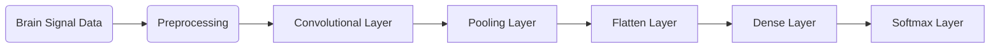

                 

# AI时代的人类增强：超越限制

> 关键词：人工智能(AI)，人类增强，脑机接口(Brain-Computer Interface, BCI)，神经网络，深度学习，脑科学，人机交互，未来科技

## 1. 背景介绍

### 1.1 问题由来

随着人工智能(AI)技术的飞速发展，尤其是深度学习在处理复杂信息时的出色表现，人类对于AI的期望值达到了前所未有的高度。AI正逐渐从实验室中的“黑科技”，转变为日常生活中不可或缺的工具。它不仅在商业、娱乐、医疗等诸多领域中扮演着关键角色，更在逐步改变人类的生活方式、思维方式，甚至是生理结构。

AI时代带来的最令人激动的可能性之一，是人类自身能力的增强。这不仅包括通过AI改善生产效率、决策质量、创造力等传统智能，还包括借助AI技术改造大脑，实现认知能力的提升和认知障碍的突破。

在AI时代，人类将面临前所未有的机遇与挑战。如何通过AI技术扩展人类潜力，是我们亟待解决的问题。本文将从AI时代人类增强的各个关键技术点出发，探讨如何利用AI技术实现对人类认知能力的增强。

## 2. 核心概念与联系

### 2.1 核心概念概述

为了理解AI时代人类增强的背后原理，我们需要了解几个关键概念：

- **人工智能(AI)**：通过算法和数据训练出来的具有类人智能的系统。其目标是通过模拟人类认知过程，实现信息的自动化处理和智能决策。
- **神经网络(Neural Network)**：受人类神经系统启发，由大量神经元（节点）构成的计算模型。其结构与功能模拟了人类大脑的神经网络，可以用于图像识别、语音识别、自然语言处理等多种任务。
- **深度学习(Deep Learning)**：一种特殊的机器学习方法，通过构建深层神经网络模型，实现更高级的特征提取与表示学习。
- **脑机接口(BCI)**：利用AI技术实现大脑与计算机之间的直接通信，实现对大脑信号的解读和控制，进而实现对人类认知和行为的增强。
- **人机交互(Human-Computer Interaction, HCI)**：研究如何设计有效的交互方式，提升人机协同效率。AI时代，通过自然语言处理、虚拟现实(VR)、增强现实(AR)等技术，可以实现更加智能、自然的人机交互。

这些概念之间的联系可以概括为：通过深度学习构建的神经网络，可以模拟人类大脑的认知功能，实现对复杂信息的自动化处理；脑机接口技术的进步，使得人脑可以直接与AI系统进行信息交互，增强人类认知能力；而人机交互技术的提升，则进一步改善了用户与AI系统的交互体验，使得AI技术可以更好地服务于人类生活。

这些核心概念共同构成了AI时代人类增强的基石，通过其相互配合与协同作用，AI技术将在认知增强、健康改善、创造力提升等多个领域发挥巨大作用。

## 3. 核心算法原理 & 具体操作步骤

### 3.1 算法原理概述

AI时代人类增强的核心在于通过AI技术改造人类大脑，提升其认知能力。这一过程可以分为两个主要步骤：

1. **信号采集与预处理**：使用脑机接口技术，采集大脑信号并将其转化为计算机可处理的形式。这一步骤包括脑电信号、脑磁信号、神经影像等多种形式的信号采集与预处理。
2. **模型训练与推理**：利用深度学习模型，对采集到的信号进行特征提取与分类，实现对大脑活动的理解与控制。

### 3.2 算法步骤详解

#### 3.2.1 信号采集

脑机接口的信号采集通常包括以下几种方式：

- **脑电信号(EEG)**：通过头皮电极捕捉头皮上的电位变化，采集大脑皮层的电信号。
- **脑磁信号(MEG)**：使用磁力计探测大脑活动中产生的磁场变化，提供更精细的大脑活动信息。
- **功能磁共振成像(fMRI)**：通过测量大脑的血液流动情况，间接推断大脑的活动状态。
- **侵入式电信号**：通过在大脑皮层或周围放置电极，直接采集神经元的电信号。

不同信号采集方式各有优缺点。脑电信号采集便捷、成本低廉，但分辨率较低；脑磁信号和fMRI可以提供更精细的大脑活动信息，但成本较高、操作复杂。侵入式电信号能够提供最高分辨率的大脑活动信息，但风险较大，目前应用较少。

#### 3.2.2 信号预处理

采集到的信号需要进行预处理，以去除噪声、增强信号特征。预处理步骤包括：

- **滤波**：使用数字滤波器去除高频和低频噪声。
- **信号增强**：通过自适应滤波、波形重构等方法增强信号的信噪比。
- **特征提取**：将原始信号转换为特征向量，提取有意义的信号特征，如时域特征、频域特征等。

#### 3.2.3 模型训练

训练深度学习模型需要大量标注数据和强大计算资源。常用的深度学习模型包括：

- **卷积神经网络(CNN)**：用于图像和视频数据的特征提取与分类。
- **循环神经网络(RNN)**：用于处理序列数据，如语音信号、时间序列等。
- **长短时记忆网络(LSTM)**：一种特殊的RNN，用于处理长序列数据，防止梯度消失问题。
- **自编码器(Autoencoder)**：用于降维与数据重建，提取数据的隐含特征。
- **生成对抗网络(GAN)**：用于生成逼真数据，如生成图片、视频等。

模型训练通常包括以下步骤：

1. **数据准备**：准备训练数据和验证数据集，并对其进行标准化处理。
2. **模型设计**：选择合适的深度学习模型架构，并定义损失函数、优化器和评估指标。
3. **模型训练**：使用训练数据集对模型进行迭代训练，优化模型参数，最小化损失函数。
4. **模型验证**：在验证数据集上评估模型性能，调整模型参数，防止过拟合。
5. **模型应用**：在实际应用场景中使用训练好的模型，对新数据进行推理与分类。

#### 3.2.4 模型推理

模型训练完成后，可以进行推理应用。推理过程包括：

- **信号输入**：将采集到的信号输入模型，得到模型对信号的初步处理结果。
- **特征提取**：使用模型提取信号的高级特征，如分类标签、语义信息等。
- **信息解码**：将提取出的高级特征解码为具体的认知结果，如文本、图像、语音等。

### 3.3 算法优缺点

#### 3.3.1 优点

- **高度自动化**：AI技术能够自动处理大量复杂数据，提高信息处理效率。
- **高精度**：深度学习模型在特征提取和分类任务中表现出色，能够达到接近人类感知的水准。
- **可扩展性**：模型可以不断优化和升级，提升认知能力。

#### 3.3.2 缺点

- **数据依赖**：模型训练需要大量标注数据，获取高质量数据成本较高。
- **模型复杂**：深度学习模型结构复杂，训练和推理过程资源消耗较大。
- **伦理风险**：AI技术可能带来隐私、安全性问题，需要严格监管。

### 3.4 算法应用领域

AI时代人类增强的应用领域非常广泛，涵盖了医疗、教育、娱乐等多个方面：

- **脑机接口在医疗中的应用**：帮助瘫痪患者恢复行动能力，监测认知障碍，辅助治疗精神疾病等。
- **AI在教育中的应用**：通过个性化学习推荐、智能辅导等技术，提高教育质量和效率。
- **AI在娱乐中的应用**：通过虚拟现实、增强现实等技术，实现沉浸式互动体验，提升娱乐体验。
- **AI在认知训练中的应用**：通过游戏化训练和脑电反馈，提升用户的学习和认知能力。

## 4. 数学模型和公式 & 详细讲解 & 举例说明

### 4.1 数学模型构建

以脑电信号分类为例，构建基于深度学习的信号分类模型。假设信号数据为 $\mathbf{x} \in \mathbb{R}^N$，分类标签为 $\mathbf{y} \in \{0, 1\}$。模型的输入层为 $x_1, x_2, ..., x_N$，输出层为 $y_1, y_2, ..., y_M$，其中 $M$ 为类别数。

模型的目标是最小化交叉熵损失函数：

$$
\mathcal{L}(\mathbf{y}, \mathbf{\hat{y}}) = -\sum_{i=1}^M y_i \log \hat{y}_i
$$

其中，$\hat{y}_i$ 为模型对类别 $i$ 的预测概率。

### 4.2 公式推导过程

模型的优化目标为最小化交叉熵损失，使用梯度下降法对模型参数进行更新：

$$
\mathbf{\theta} = \mathop{\arg\min}_{\mathbf{\theta}} \mathcal{L}(\mathbf{y}, f_{\mathbf{\theta}}(\mathbf{x}))
$$

其中，$f_{\mathbf{\theta}}(\mathbf{x})$ 为模型对输入信号 $\mathbf{x}$ 的预测概率分布。

对于简单的二分类问题，可以使用二分类交叉熵损失函数：

$$
\mathcal{L}(\mathbf{y}, \mathbf{\hat{y}}) = -\frac{1}{N} \sum_{i=1}^N (y_i \log \hat{y}_i + (1-y_i) \log (1-\hat{y}_i))
$$

模型的前向传播过程为：

$$
\hat{y} = \sigma(W \mathbf{x} + b)
$$

其中，$\sigma$ 为激活函数，$W$ 和 $b$ 为模型参数。

模型的反向传播过程为：

$$
\frac{\partial \mathcal{L}}{\partial W} = \frac{\partial \mathcal{L}}{\partial \hat{y}} \frac{\partial \hat{y}}{\partial x} \frac{\partial x}{\partial W}
$$

其中，$\frac{\partial \hat{y}}{\partial x}$ 为导数矩阵。

### 4.3 案例分析与讲解

以基于脑电信号的情感识别为例，探讨深度学习模型在人类增强中的应用。

假设有一组脑电信号数据，每个信号对应一个人正在观看一段视频时的脑电活动。我们的目标是根据这些信号，识别出观看者的情感状态（如快乐、悲伤、愤怒等）。

首先，将采集到的脑电信号进行预处理，去除噪声，提取时域特征和频域特征。然后，使用卷积神经网络(CNN)对这些特征进行分类。模型结构如图：



在训练过程中，使用交叉熵损失函数，定义模型的输出为 $y_1, y_2, ..., y_M$，其中 $M$ 为情感类别数。通过梯度下降法，不断调整模型参数 $W$ 和 $b$，最小化损失函数。

训练完成后，使用模型对新的脑电信号进行推理，得到情感识别结果。

## 5. 项目实践：代码实例和详细解释说明

### 5.1 开发环境搭建

在开始项目实践前，需要搭建开发环境。

**Python开发环境**：
- **安装Python**：在Linux、Mac、Windows等操作系统中安装Python 3.x版本。
- **安装依赖包**：使用pip安装深度学习框架TensorFlow或PyTorch，以及其他必要的依赖包。

```bash
pip install tensorflow
pip install torch
```

**数据集准备**：
- **脑电信号数据**：收集或购买脑电信号数据集，确保数据集的多样性和代表性。
- **情感标签数据**：为每个脑电信号数据标注情感标签，准备训练数据集和验证数据集。

**代码示例**：

```python
import tensorflow as tf
from tensorflow.keras import layers

# 构建卷积神经网络模型
model = tf.keras.Sequential([
    layers.Conv2D(32, (3, 3), activation='relu', input_shape=(N, N, 1)),
    layers.MaxPooling2D((2, 2)),
    layers.Conv2D(64, (3, 3), activation='relu'),
    layers.MaxPooling2D((2, 2)),
    layers.Flatten(),
    layers.Dense(64, activation='relu'),
    layers.Dense(M, activation='softmax')
])

# 编译模型，定义损失函数和优化器
model.compile(loss=tf.keras.losses.CategoricalCrossentropy(from_logits=True),
              optimizer=tf.keras.optimizers.Adam(learning_rate=0.001),
              metrics=['accuracy'])

# 训练模型
model.fit(train_data, train_labels, epochs=10, validation_data=(val_data, val_labels))

# 推理应用
test_data = ... # 测试数据
test_labels = ... # 测试标签
test_loss, test_acc = model.evaluate(test_data, test_labels)
```

### 5.2 源代码详细实现

以下是使用TensorFlow实现脑电信号分类模型的代码示例：

```python
import tensorflow as tf
from tensorflow.keras import layers

# 构建卷积神经网络模型
model = tf.keras.Sequential([
    layers.Conv2D(32, (3, 3), activation='relu', input_shape=(N, N, 1)),
    layers.MaxPooling2D((2, 2)),
    layers.Conv2D(64, (3, 3), activation='relu'),
    layers.MaxPooling2D((2, 2)),
    layers.Flatten(),
    layers.Dense(64, activation='relu'),
    layers.Dense(M, activation='softmax')
])

# 编译模型，定义损失函数和优化器
model.compile(loss=tf.keras.losses.CategoricalCrossentropy(from_logits=True),
              optimizer=tf.keras.optimizers.Adam(learning_rate=0.001),
              metrics=['accuracy'])

# 训练模型
model.fit(train_data, train_labels, epochs=10, validation_data=(val_data, val_labels))

# 推理应用
test_data = ... # 测试数据
test_labels = ... # 测试标签
test_loss, test_acc = model.evaluate(test_data, test_labels)
```

### 5.3 代码解读与分析

**代码结构解读**：

- **数据预处理**：脑电信号数据通常需要进行预处理，如归一化、滤波等。在代码中，可以通过TensorFlow的`preprocessing`模块实现。
- **模型构建**：使用`Sequential`模型创建卷积神经网络，包含卷积层、池化层、全连接层等。
- **模型编译**：使用`compile`方法，定义损失函数、优化器和评估指标。
- **模型训练**：使用`fit`方法，对模型进行训练，并指定训练数据、验证数据和训练轮数。
- **模型评估**：使用`evaluate`方法，对模型进行测试，并返回测试损失和准确率。

**参数解读**：

- **卷积层参数**：`Conv2D`层的参数包括卷积核大小、数量、激活函数等。
- **池化层参数**：`MaxPooling2D`层的参数包括池化核大小、步长等。
- **全连接层参数**：`Dense`层的参数包括神经元数量、激活函数等。

**训练与推理细节**：

- **训练数据**：`train_data`表示训练数据集，`train_labels`表示训练标签。
- **验证数据**：`val_data`表示验证数据集，`val_labels`表示验证标签。
- **测试数据**：`test_data`表示测试数据集，`test_labels`表示测试标签。

**优化器与损失函数**：

- **优化器**：`Adam`优化器，学习率为0.001。
- **损失函数**：`CategoricalCrossentropy`损失函数，适用于多分类问题。

## 6. 实际应用场景

### 6.1 智能健康管理

AI技术在健康管理领域有着广阔的应用前景。通过脑机接口技术，可以实现对用户的生理状态、心理状态、行为模式等进行实时监测，并结合AI算法提供个性化的健康管理方案。

例如，在心理压力监测中，使用脑电信号分类模型，对用户的情绪状态进行实时识别。根据情绪状态的变化，向用户提供心理干预、放松练习等健康建议。

### 6.2 增强学习与训练

AI技术在认知训练中也有着重要应用。通过脑电信号分类模型，可以实现对用户的认知状态进行实时监测，结合个性化的认知训练任务，提升用户的认知能力和学习效率。

例如，在语言学习中，使用脑电信号分类模型对用户的语言学习状态进行监测。根据学习状态的变化，自动调整学习难度和节奏，提升学习效果。

### 6.3 娱乐与互动

AI技术在娱乐领域也有着广泛的应用。通过脑机接口技术，可以实现用户与虚拟角色的实时互动，提升娱乐体验。

例如，在虚拟现实游戏中，使用脑电信号分类模型对用户的游戏行为进行实时监测。根据游戏行为的变化，自动调整游戏难度和情节，提升游戏体验。

### 6.4 未来应用展望

未来，随着脑机接口技术的进步和深度学习模型的优化，AI技术在人类增强领域将有更广泛的应用前景：

- **认知增强**：通过脑电信号分类模型，实现对用户认知状态的实时监测和干预，提升用户的认知能力和学习效率。
- **健康管理**：通过脑电信号分类模型，实现对用户生理状态、心理状态的实时监测，提供个性化的健康管理方案。
- **人机交互**：通过脑机接口技术，实现自然、高效的人机互动，提升用户体验和效率。
- **情感识别与表达**：通过脑电信号分类模型，实现对用户情感状态的实时监测和表达，提升情感交流和用户体验。

## 7. 工具和资源推荐

### 7.1 学习资源推荐

为了帮助开发者系统掌握AI技术，以下是一些优质的学习资源：

1. **深度学习框架TensorFlow官方文档**：详细介绍了TensorFlow的API和使用方法，提供了丰富的代码示例和案例分析。
2. **深度学习框架PyTorch官方文档**：详细介绍了PyTorch的API和使用方法，提供了丰富的代码示例和案例分析。
3. **深度学习课程**：如《深度学习》课程，由Coursera提供，系统讲解深度学习的基础知识和实践技巧。
4. **脑机接口书籍**：如《Human-Computer Interaction through Brain-Computer Interfaces》，介绍了脑机接口的原理和应用，适合进一步学习。
5. **科研论文**：如《Neural Control of Movements and Thoughts》，介绍了脑机接口的最新研究进展。

### 7.2 开发工具推荐

以下是几款用于脑机接口和AI技术开发的常用工具：

1. **TensorFlow**：由Google开发的深度学习框架，支持分布式计算和GPU加速，适合大规模模型训练和推理。
2. **PyTorch**：由Facebook开发的深度学习框架，具有动态计算图和易用性，适合研究和原型开发。
3. **Brain-Computer Interface Framework**：开源的脑机接口开发框架，提供了丰富的API和模型库。
4. **OpenBCI**：开源的脑电信号采集设备和SDK，支持多种信号采集方式。
5. **NeuroSky MindWave Mobile**：支持脑电信号采集和分析的移动设备，方便便携使用。

### 7.3 相关论文推荐

以下是几篇影响较大的脑机接口和AI技术论文，推荐阅读：

1. **《Deep Brain-Computer Interfaces》**：介绍了深度学习在脑机接口中的应用，包括分类、回归、生成等任务。
2. **《Human-Computer Interaction with Brain-Computer Interfaces》**：综述了脑机接口的发展历程和技术现状，探讨了未来应用前景。
3. **《A Survey of Deep Learning Techniques for Brain-Computer Interfaces》**：综述了深度学习在脑机接口中的应用，包括CNN、RNN、LSTM等模型。
4. **《Brain-Computer Interfaces: A Survey》**：综述了脑机接口的技术原理和应用场景，包括信号采集、预处理、特征提取等。
5. **《A Survey of Deep Learning Architectures for Brain-Computer Interfaces》**：综述了深度学习架构在脑机接口中的应用，包括自编码器、卷积神经网络等。

## 8. 总结：未来发展趋势与挑战

### 8.1 研究成果总结

本文从AI时代人类增强的角度出发，探讨了脑机接口、深度学习等关键技术在人类认知能力提升中的应用。通过深入分析，展示了AI技术在脑电信号分类、情感识别、健康管理、娱乐互动等多个领域的应用前景。

### 8.2 未来发展趋势

未来，随着脑机接口技术的进步和深度学习模型的优化，AI技术在人类增强领域将有更广泛的应用前景：

1. **认知增强**：通过脑电信号分类模型，实现对用户认知状态的实时监测和干预，提升用户的认知能力和学习效率。
2. **健康管理**：通过脑电信号分类模型，实现对用户生理状态、心理状态的实时监测，提供个性化的健康管理方案。
3. **人机交互**：通过脑机接口技术，实现自然、高效的人机互动，提升用户体验和效率。
4. **情感识别与表达**：通过脑电信号分类模型，实现对用户情感状态的实时监测和表达，提升情感交流和用户体验。

### 8.3 面临的挑战

尽管AI技术在人类增强领域前景广阔，但仍面临诸多挑战：

1. **数据采集成本高**：脑电信号的采集和预处理需要大量设备和技术支持，成本较高。
2. **模型复杂度高**：深度学习模型结构复杂，训练和推理过程资源消耗较大。
3. **伦理与安全问题**：脑机接口技术可能涉及隐私、安全性问题，需要严格监管。

### 8.4 研究展望

未来，需要在以下方面进行深入研究：

1. **数据获取与标注**：探索高效、低成本的数据采集和标注方法，解决数据依赖问题。
2. **模型优化与压缩**：优化深度学习模型结构，降低资源消耗，提升模型效率。
3. **伦理与安全保障**：制定严格的伦理与安全保障措施，确保AI技术的安全性和合规性。
4. **跨学科融合**：结合脑科学、认知科学、心理学等多个学科，深入理解人类认知机制，提升AI技术的应用效果。

## 9. 附录：常见问题与解答

**Q1：什么是脑电信号分类模型？**

A: 脑电信号分类模型是一种基于深度学习的信号分类模型，通过训练模型对采集到的脑电信号进行分类，识别出用户的认知状态和行为模式。

**Q2：如何选择合适的脑电信号分类模型？**

A: 选择合适的脑电信号分类模型需要考虑以下几个因素：

- **数据特征**：根据采集到的脑电信号特征选择合适的模型，如时域特征、频域特征等。
- **任务类型**：根据分类任务的复杂度选择合适的模型，如简单的二分类任务可以使用CNN，复杂的分类任务可以使用RNN、LSTM等。
- **计算资源**：根据计算资源选择合适的模型，如GPU资源充足可以使用复杂模型，资源有限可以使用简单的模型。

**Q3：脑电信号分类模型在实际应用中需要注意哪些问题？**

A: 脑电信号分类模型在实际应用中需要注意以下几个问题：

- **数据质量**：脑电信号数据质量直接影响模型性能，需要进行预处理和清洗。
- **模型训练**：脑电信号分类模型训练需要大量标注数据，获取高质量数据成本较高。
- **模型评估**：脑电信号分类模型的评估需要多个指标，如准确率、召回率、F1分数等，需要综合考虑。
- **模型应用**：脑电信号分类模型需要实时采集和处理脑电信号，对计算资源要求较高。

**Q4：脑电信号分类模型在人类增强中的应用前景如何？**

A: 脑电信号分类模型在人类增强领域有着广泛的应用前景，特别是在认知增强、健康管理、人机交互等方面。通过脑电信号分类模型，可以实现对用户的认知状态实时监测和干预，提升用户的认知能力和学习效率；提供个性化的健康管理方案，提升用户的生理和心理状态；实现自然、高效的人机互动，提升用户体验。

---

作者：禅与计算机程序设计艺术 / Zen and the Art of Computer Programming

