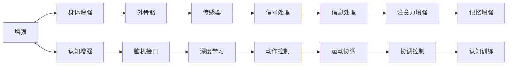

                 

## 1. 背景介绍

在人工智能（AI）时代，技术正在以前所未有的速度改变着世界，从医疗、教育到金融、制造业，几乎每一个领域都正在或即将被AI所颠覆。而随着AI技术的不断发展，人类社会也将迎来新的变革——增强。增强，不仅是指技术能力上的提升，更包括了身体与认知等多方面的增强。

### 1.1 增强的起源与现状

增强的概念并不新鲜，从古希腊神话中的阿基米德之剑，到现代科幻小说中的机器人外骨骼，人类对于增强技术的向往由来已久。而在AI时代，增强技术更是蓬勃发展，从身体的增强到认知的增强，AI正在为人类社会带来前所未有的可能性。

目前，AI时代的增强主要体现在两个方面：

1. **身体增强**：通过外骨骼、假肢、脑机接口等技术，直接改善人类的身体功能，提升体能与健康。
2. **认知增强**：通过脑机接口、增强现实（AR）、虚拟现实（VR）等技术，提升人类的认知能力，增强信息处理和学习效率。

### 1.2 增强技术的驱动因素

增强技术的快速发展，离不开以下几个关键驱动因素：

1. **计算能力的提升**：随着芯片技术的进步，计算能力的大幅提升为增强技术的实现提供了可能。
2. **传感器技术的革新**：如MEMS、CMOS等传感器技术的进步，使得实时数据采集和处理变得更加高效。
3. **AI算法的发展**：深度学习、强化学习等AI算法的发展，为增强技术提供了强大的算法支持。
4. **数据与互联网的普及**：大数据和互联网的普及，为增强技术的应用提供了丰富的数据资源和广阔的连接平台。

## 2. 核心概念与联系

### 2.1 核心概念概述

在探讨增强技术时，首先需要理解一些关键的概念：

- **增强**：通过技术手段，提升人类的身体能力或认知能力，改善生活质量。
- **身体增强**：通过技术手段，直接改善或增强人类的身体功能，如肢体控制、感觉增强等。
- **认知增强**：通过技术手段，提升人类的认知能力，如信息处理、记忆增强等。
- **外骨骼**：一种外部设备，用于辅助或替代人体的部分或全部功能。
- **脑机接口**：通过直接或间接的方式，将人类大脑与计算机系统相连接，实现脑与机的互动。
- **增强现实（AR）**：通过在现实世界中叠加虚拟信息，增强人类的感知和信息处理能力。
- **虚拟现实（VR）**：通过创建完全虚拟的环境，模拟现实世界，提供沉浸式的体验。

### 2.2 核心概念联系

这些核心概念之间存在紧密的联系，共同构成了AI时代增强技术的基础框架。以下通过Mermaid流程图展示它们之间的联系：



这个流程图展示了增强技术从基础概念到具体技术手段的连接路径。通过身体增强和认知增强，增强技术可以提升人类的身体能力和认知能力，而外骨骼、脑机接口、AR和VR等技术手段则是实现这些提升的具体方法。

## 3. 核心算法原理 & 具体操作步骤

### 3.1 算法原理概述

增强技术的实现涉及多个领域的算法和理论，包括但不限于：

1. **机器人学**：用于控制和协调增强设备，如外骨骼。
2. **神经科学**：研究人类大脑的工作机制，为脑机接口技术提供理论基础。
3. **计算机视觉**：用于增强现实和虚拟现实中的图像识别和三维建模。
4. **深度学习**：用于训练脑机接口和增强现实/虚拟现实系统中的模型。
5. **信号处理**：用于传感器的信号采集和处理，以及脑机接口中的信号解析。

增强技术涉及的核心算法原理包括：

- **控制系统**：用于控制增强设备，确保其在复杂环境下的稳定性和可靠性。
- **信号处理**：用于传感器的数据采集和处理，以及脑机接口中的信号解析。
- **深度学习**：用于训练模型，实现增强设备与人类大脑的互动。
- **虚拟现实和增强现实**：用于创建虚拟环境，增强人类感知和信息处理能力。

### 3.2 算法步骤详解

以下是增强技术实现的一般步骤：

**Step 1: 需求分析**
- 明确增强技术的具体应用场景和目标。例如，是否需要提升肢体功能、改善认知能力等。

**Step 2: 技术选型**
- 根据需求选择合适的技术方案，如外骨骼、脑机接口、AR、VR等。
- 确定技术实现的关键组件，如传感器、信号处理单元、控制系统等。

**Step 3: 硬件设计**
- 设计增强设备的硬件架构，包括传感器、处理器、电池等。
- 进行硬件测试和优化，确保设备的稳定性和可靠性。

**Step 4: 软件实现**
- 开发控制软件，实现设备与计算机系统的互动。
- 开发信号处理算法，处理传感器的数据。
- 开发深度学习模型，训练脑机接口等系统。

**Step 5: 系统集成**
- 将硬件和软件集成，进行系统测试和优化。
- 进行实地测试，验证增强设备的效果和安全性。

**Step 6: 用户培训与反馈**
- 对用户进行培训，确保其能够熟练使用增强设备。
- 收集用户反馈，优化设备功能和用户体验。

### 3.3 算法优缺点

增强技术具有以下优点：

1. **提升生活质量**：通过增强人类的身体和认知能力，提升生活质量和工作效率。
2. **适应性广**：适用于多种应用场景，如医疗、教育、军事等。
3. **技术成熟**：随着技术的不断进步，增强设备的性能和可靠性不断提升。

同时，增强技术也存在一些局限性：

1. **成本高**：高级增强设备的成本较高，难以普及。
2. **依赖性**：用户对增强设备的依赖性较强，一旦设备出现故障，可能影响正常生活和工作。
3. **安全性**：增强设备可能存在安全隐患，如信号泄漏、设备故障等。

### 3.4 算法应用领域

增强技术已经在多个领域得到了广泛应用，例如：

1. **医疗**：用于辅助手术、康复训练、患者监护等，提升医疗服务质量。
2. **军事**：用于士兵装备增强、战场环境感知、指挥控制等，提升军事战斗力。
3. **教育**：用于学习辅助、虚拟实验、远程教育等，提升教育质量和效率。
4. **娱乐**：用于游戏、影视、社交等，提升娱乐体验。

未来，随着技术的不断进步，增强技术将在更多领域得到应用，为人类社会带来新的变革。

## 4. 数学模型和公式 & 详细讲解 & 举例说明

### 4.1 数学模型构建

增强技术中的数学模型构建主要涉及以下几个方面：

1. **控制系统模型**：用于描述增强设备的运动状态和控制关系。
2. **信号处理模型**：用于描述传感器的数据采集和处理过程。
3. **深度学习模型**：用于描述脑机接口中的信号解析和模式识别。

### 4.2 公式推导过程

以下以脑机接口中的信号处理为例，展示其数学模型和公式推导过程。

脑机接口中的信号处理通常涉及以下几个步骤：

1. **信号采集**：通过传感器采集脑电信号。
2. **信号预处理**：对采集到的信号进行滤波、归一化等预处理。
3. **特征提取**：通过傅里叶变换、小波变换等方法提取信号的特征。
4. **模式识别**：通过深度学习模型对特征进行分类或识别。

假设采集到的脑电信号为 $x(t)$，经过预处理和特征提取后，得到特征向量 $f(x)$，通过深度学习模型 $M$ 进行分类，得到分类结果 $y$。则整个过程可以表示为：

$$
y = M(f(x))
$$

其中 $M$ 表示深度学习模型，$f(x)$ 表示信号处理后的特征向量。

### 4.3 案例分析与讲解

以增强现实（AR）技术为例，展示其在增强认知能力中的应用。

增强现实技术通过在现实世界中叠加虚拟信息，增强人类的感知和信息处理能力。例如，在医疗手术中，AR技术可以将手术视频、患者数据等叠加到手术现场，提升医生的手术精确度和效率。

假设医生在进行手术时，需要通过AR设备叠加患者的CT扫描图像和手术视频。则整个过程可以表示为：

1. **数据采集**：通过摄像头等传感器采集手术现场的图像和视频。
2. **数据处理**：对采集到的图像和视频进行增强和处理，如去噪、增强对比度等。
3. **虚拟信息叠加**：将患者的CT扫描图像和手术视频叠加到手术现场的图像上。
4. **视觉显示**：通过AR设备将叠加后的图像和视频显示给医生。

整个过程可以表示为：

$$
\text{显示图像} = \text{手术现场图像} \oplus \text{CT扫描图像} \oplus \text{手术视频}
$$

其中 $\oplus$ 表示虚拟信息的叠加操作。

## 5. 项目实践：代码实例和详细解释说明

### 5.1 开发环境搭建

在进行增强技术开发前，我们需要准备好开发环境。以下是使用Python进行深度学习和增强现实开发的环境配置流程：

1. 安装Anaconda：从官网下载并安装Anaconda，用于创建独立的Python环境。

2. 创建并激活虚拟环境：
```bash
conda create -n ar-env python=3.8 
conda activate ar-env
```

3. 安装相关库：
```bash
pip install numpy scipy matplotlib pyglet
```

4. 安装AR开发库：
```bash
pip install artoolkit
```

完成上述步骤后，即可在`ar-env`环境中开始增强现实系统的开发。

### 5.2 源代码详细实现

以下是使用Pyglet库开发简单的增强现实系统的代码实现：

```python
import pyglet
from pyglet.gl import GLUT
from pyglet.window import key
from pyglet import multimedia

def load_texture(filename):
    texture = multimedia.load_texture(filename)
    return texture

def draw_texture(texture):
    glut.glBindTexture(gl.GL_TEXTURE_2D, texture.id)
    glut.glBegin(gl.GL_TRIANGLE_FAN)
    glut.glTexCoord2f(0, 0); glut.glVertex3f(-1, -1, 0)
    glut.glTexCoord2f(1, 0); glut.glVertex3f(1, -1, 0)
    glut.glTexCoord2f(1, 1); glut.glVertex3f(1, 1, 0)
    glut.glEnd()

def main():
    texture = load_texture('texture.png')
    pyglet.window.set_fullscreen(True)
    pyglet.window.Window.open()
    while not pyglet.window.get_switched_to_window():
        pass
    glut.glClearColor(0, 0, 0, 1)
    glut.glClear(gl.GL_COLOR_BUFFER_BIT)
    while not pyglet.window.has_exit:
        glut.glClearColor(0, 0, 0, 1)
        glut.glClear(gl.GL_COLOR_BUFFER_BIT)
        draw_texture(texture)
        pyglet.window.YIELD
    pyglet.window.shutdown()

if __name__ == '__main__':
    main()
```

这个代码实现了一个简单的增强现实系统，用于显示一个贴图纹理。在该系统的基础上，可以进一步扩展，实现更复杂的功能，如交互式控制、实时数据叠加等。

### 5.3 代码解读与分析

让我们再详细解读一下关键代码的实现细节：

**load_texture函数**：
- 用于加载纹理图片，将其转换为Pyglet支持的格式，并返回纹理对象。

**draw_texture函数**：
- 将纹理对象绑定到OpenGL上下文中，绘制纹理。

**main函数**：
- 初始化窗口，加载纹理，进入主循环，绘制纹理，直到窗口被关闭。

这个代码实现展示了基本的增强现实系统开发流程。在实际应用中，开发者可以根据具体需求，进一步扩展和优化系统，实现更复杂的增强现实功能。

## 6. 实际应用场景

### 6.1 医疗手术

增强现实技术在医疗手术中的应用广泛，可以显著提升手术的精度和效率。例如，手术导航系统通过在手术现场叠加CT扫描图像和手术视频，帮助医生更好地进行手术操作。

**案例1：手术导航系统**

手术导航系统通过在手术现场叠加CT扫描图像和手术视频，帮助医生更好地进行手术操作。例如，在脑部手术中，医生可以通过增强现实技术观察患者的CT扫描图像和手术视频，实时调整手术器械的位置和角度，提升手术的精确度。

**案例2：虚拟手术培训**

虚拟手术培训系统通过增强现实技术，创建虚拟手术环境，帮助医学生和医生进行手术练习。例如，通过AR设备，医学生可以在虚拟环境中进行手术操作，练习手术技巧，积累手术经验。

### 6.2 军事训练

增强现实技术在军事训练中的应用同样广泛，可以显著提升士兵的战斗能力和训练效果。例如，虚拟战场系统通过在士兵头盔上叠加虚拟战场信息，提升士兵的战场感知和决策能力。

**案例1：虚拟战场系统**

虚拟战场系统通过在士兵头盔上叠加虚拟战场信息，提升士兵的战场感知和决策能力。例如，士兵可以通过AR设备观察战场环境，实时获取敌我位置、装备状态等战场信息，做出更准确的决策。

**案例2：战术训练**

战术训练系统通过增强现实技术，创建虚拟战术环境，帮助士兵进行战术演练。例如，通过AR设备，士兵可以在虚拟环境中模拟实战场景，练习战术配合和战略指挥。

### 6.3 教育培训

增强现实技术在教育培训中的应用同样广泛，可以显著提升学生的学习效果和教学质量。例如，虚拟实验室系统通过在实验环境中叠加虚拟信息，提升学生的实验操作和理解能力。

**案例1：虚拟实验室系统**

虚拟实验室系统通过在实验环境中叠加虚拟信息，提升学生的实验操作和理解能力。例如，通过AR设备，学生可以在虚拟实验室中进行实验操作，观察实验结果，增强对实验的理解。

**案例2：远程教育**

远程教育系统通过增强现实技术，提升学生的学习效果和参与感。例如，通过AR设备，学生可以在虚拟环境中进行远程学习，互动参与，增强学习体验。

### 6.4 未来应用展望

随着技术的不断进步，增强技术将在更多领域得到应用，为人类社会带来新的变革。

在智慧城市治理中，增强现实技术可以应用于城市事件监测、舆情分析、应急指挥等环节，提高城市管理的自动化和智能化水平，构建更安全、高效的未来城市。

在企业生产中，增强现实技术可以应用于设备维护、质量检测、员工培训等环节，提高生产效率和产品质量，减少生产成本。

在智能家居中，增强现实技术可以应用于智能控制、信息展示、娱乐互动等环节，提升家居生活的智能化和便利性。

总之，增强技术的应用前景广阔，将在更多领域得到广泛应用，为人类社会带来新的变革。

## 7. 工具和资源推荐

### 7.1 学习资源推荐

为了帮助开发者系统掌握增强技术的理论基础和实践技巧，这里推荐一些优质的学习资源：

1. 《增强现实技术》系列博文：由增强现实技术专家撰写，深入浅出地介绍了增强现实技术的原理、应用和开发方法。

2. 《深度学习与增强现实》课程：由斯坦福大学开设的增强现实课程，有Lecture视频和配套作业，带你入门增强现实领域的基本概念和经典模型。

3. 《增强现实技术：从概念到应用》书籍：全面介绍了增强现实技术的原理、技术栈和应用案例，适合进阶学习。

4. ARToolKit官方文档：ARToolKit开发的增强现实工具库的官方文档，提供了丰富的开发样例代码，是入门增强现实开发的好资源。

### 7.2 开发工具推荐

高效的开发离不开优秀的工具支持。以下是几款用于增强现实开发常用的工具：

1. ARKit：Apple开发的增强现实开发框架，支持iOS和macOS平台，提供丰富的增强现实工具和组件。

2. ARCore：Google开发的增强现实开发框架，支持Android平台，提供强大的增强现实功能和工具。

3. Unity3D：一款流行的游戏引擎，支持增强现实开发，提供丰富的开发资源和社区支持。

4. Blender：一款免费的3D建模软件，支持增强现实开发，提供强大的3D建模和渲染功能。

### 7.3 相关论文推荐

增强技术的发展离不开学界的持续研究。以下是几篇奠基性的相关论文，推荐阅读：

1. "Head-mounted Display for Virtual Reality"：描述了头戴式显示器的原理和应用，是增强现实技术的开山之作。

2. "Enhancing Visual Perception with Augmented Reality"：介绍了增强现实技术在视觉感知方面的应用和效果，展示了增强现实技术的前景。

3. "Towards an Artificial Intelligence for Human Augmentation"：探讨了增强技术对人类智能的增强作用，展望了未来的发展趋势。

这些论文代表了大增强技术的发展脉络。通过学习这些前沿成果，可以帮助研究者把握学科前进方向，激发更多的创新灵感。

## 8. 总结：未来发展趋势与挑战

### 8.1 研究成果总结

本文对增强技术进行了全面系统的介绍，主要内容包括：

1. 增强技术的起源与现状。
2. 增强技术的核心概念及其联系。
3. 增强技术的核心算法原理与具体操作步骤。
4. 增强技术的实际应用场景。

通过本文的系统梳理，可以看到，增强技术正在以多种形式改变人类的生产生活方式，其发展前景广阔。未来，随着技术的不断进步，增强技术将在更多领域得到应用，为人类社会带来新的变革。

### 8.2 未来发展趋势

展望未来，增强技术的发展将呈现以下几个趋势：

1. **技术融合**：增强技术与AI、物联网、大数据等技术的融合将更加深入，形成更加智能化的增强系统。
2. **个性化定制**：根据用户需求和偏好，定制化的增强设备和系统将越来越普遍。
3. **社会化互动**：增强技术将更多地应用于社交互动场景，提升人与人之间的沟通和协作。
4. **全场景应用**：增强技术将在更多领域得到应用，如智能家居、智能办公、智能交通等。

### 8.3 面临的挑战

尽管增强技术已经取得了不少进展，但在迈向更加智能化、普适化应用的过程中，它仍面临着诸多挑战：

1. **技术成熟度**：增强技术的核心算法和设备仍需进一步成熟和优化。
2. **成本和普及**：高级增强设备的成本较高，普及程度受限。
3. **安全性与伦理**：增强设备的安全性问题，如信号泄漏、设备故障等，需要进一步解决。
4. **人机交互**：增强设备与人类交互的自然性和智能化程度仍需提升。

### 8.4 研究展望

面对增强技术面临的这些挑战，未来的研究需要在以下几个方面寻求新的突破：

1. **算法优化**：进一步优化增强技术中的算法，提升系统性能和用户体验。
2. **设备创新**：开发更加轻便、智能化的增强设备，降低成本，提高普及度。
3. **跨领域应用**：探索增强技术在更多领域的应用，推动技术普及和应用创新。
4. **伦理与安全**：研究增强技术的伦理和安全问题，确保技术应用的合理性和安全性。

这些研究方向将引领增强技术迈向更高的台阶，为构建安全、可靠、可解释、可控的增强系统铺平道路。

## 9. 附录：常见问题与解答

**Q1：增强技术与虚拟现实（VR）有何区别？**

A: 增强现实（AR）和虚拟现实（VR）虽然都是增强技术，但技术实现和应用场景有所不同。增强现实通过在现实世界中叠加虚拟信息，增强人类的感知和信息处理能力；而虚拟现实则完全创建了一个虚拟环境，用户完全沉浸在其中。

**Q2：增强技术在军事中的应用前景如何？**

A: 增强技术在军事中的应用前景广阔，可以提升士兵的战斗能力和训练效果，提高指挥决策的智能化水平。例如，虚拟战场系统和战术训练系统可以通过增强现实技术，提升士兵的战场感知和决策能力，增强军事作战能力。

**Q3：增强技术在医疗手术中的优势是什么？**

A: 增强技术在医疗手术中的优势在于其精度和效率的提升。手术导航系统和虚拟手术培训系统可以通过增强现实技术，提升手术的精确度和医生的手术操作能力，缩短手术时间，减少手术风险。

**Q4：增强技术在教育中的应用前景如何？**

A: 增强技术在教育中的应用前景广阔，可以提升学生的学习效果和教学质量。虚拟实验室系统和远程教育系统可以通过增强现实技术，提升学生的实验操作和理解能力，增强学生的学习体验和参与感。

**Q5：增强技术面临的主要挑战是什么？**

A: 增强技术面临的主要挑战包括技术成熟度、成本和普及、安全性与伦理、人机交互等方面。需要进一步优化算法，开发更加轻便、智能化的增强设备，确保技术的安全性和伦理合理性，提升人机交互的自然性和智能化程度。

总之，增强技术的应用前景广阔，未来将在更多领域得到广泛应用，为人类社会带来新的变革。通过不断技术创新和应用实践，相信增强技术将进一步提升人类的身体能力和认知能力，带来更加智能、高效、安全的未来。

---

作者：禅与计算机程序设计艺术 / Zen and the Art of Computer Programming

