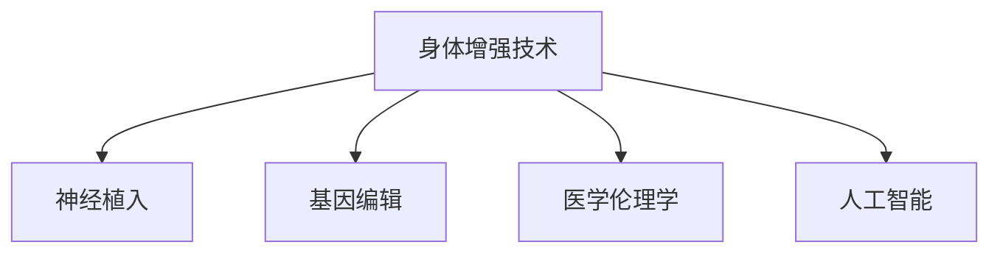

                 

# AI时代的人类增强：道德考虑与身体增强技术的未来趋势预测

## 1. 背景介绍

在AI技术的飞速发展下，人类社会的方方面面都在经历着深刻的变革。从自动驾驶汽车到工业机器人，从智能家居到健康监控，人工智能技术的渗透无处不在。然而，在这些技术浪潮中，一种技术显得尤为引人注目——身体增强技术。从辅助听力的设备到增强视力的眼镜，再到目前备受争议的神经植入芯片，身体增强技术正以一种前所未有的速度改变着人类的生理结构和生活方式。本文将探讨身体增强技术的道德考量，并预测其在未来可能的发展趋势。

## 2. 核心概念与联系

### 2.1 核心概念概述

为了更好地理解身体增强技术及其应用，本节将介绍几个关键概念：

- **身体增强技术(Body Enhancement Technology)**：通过医学或工程手段，改善或增强人类生理功能的技术。包括助听器、眼镜、人工关节、基因编辑、神经植入等。
- **神经植入(Neural Implants)**：将电子器件直接植入人体神经系统，以增强、修复或替代神经功能的技术。
- **基因编辑(Genetic Editing)**：利用CRISPR-Cas9等技术，在基因水平上精确修改DNA序列，以治疗遗传性疾病或增强人类生理功能。
- **医学伦理学(Medical Ethics)**：研究在医学实践和研究中，如何平衡科学进步与社会道德责任的关系。
- **人工智能(Artificial Intelligence, AI)**：模拟人类智能行为，通过算法和计算，实现信息处理、决策分析等功能的计算机技术。

这些概念之间的逻辑关系可以通过以下Mermaid流程图来展示：



这个流程图展示了一些关键概念之间的关系：

1. 身体增强技术可以通过神经植入和基因编辑实现。
2. 医学伦理学是评估这些技术应用的重要维度。
3. 人工智能在辅助决策和实现技术方面发挥着关键作用。

## 3. 核心算法原理 & 具体操作步骤

### 3.1 算法原理概述

身体增强技术往往涉及多种学科知识的交叉，包括医学、工程学、计算机科学等。其主要算法原理如下：

- **神经信号采集**：通过植入电极，记录神经元的活动信号，并将其转换为数字信号。
- **信号处理**：对采集到的数字信号进行滤波、降噪等预处理，以便后续分析。
- **模式识别**：使用机器学习算法，如支持向量机(SVM)、深度学习等，从处理后的信号中识别出特定的神经模式。
- **反馈控制**：根据识别出的神经模式，通过闭环控制，调整植入设备的行为，如调节植入电极的电刺激强度，以实现对神经功能的增强或修复。

### 3.2 算法步骤详解

以下详细介绍神经植入技术的核心算法步骤：

1. **电极植入**：将多个电极植入人体神经系统，通常采用微创手术的方式，如立体定向脑电图(SEEG)技术。
2. **信号采集**：记录电极阵列上的电信号，通过放大器和A/D转换器，将模拟信号转换为数字信号。
3. **信号预处理**：对数字信号进行滤波、降噪等预处理，以去除噪声和干扰。
4. **特征提取**：使用傅里叶变换、小波变换等方法，从预处理后的信号中提取频域或时域特征。
5. **模式识别**：通过训练好的机器学习模型，对提取的特征进行分类或回归分析，识别出神经活动的模式。
6. **反馈控制**：根据识别出的神经模式，调整电极的刺激参数，如电压、频率、脉冲宽度等，以达到增强或修复神经功能的目的。

### 3.3 算法优缺点

身体增强技术在增强人类生理功能方面具有显著优势：

- **优点**：
  - 显著提高生理功能，如助听器、人工关节等显著提高了相应器官的功能。
  - 辅助治疗，如神经植入技术在帕金森病、癫痫等神经疾病中取得了一定效果。
  - 个性化定制，根据不同人的需求和身体状况，提供量身定做的增强方案。

但同时，这些技术也存在一些缺点：

- **缺点**：
  - 成本高昂，如基因编辑和神经植入技术需要昂贵的设备和技术支持。
  - 安全性和长期效果未知，如神经植入可能引发感染、电极移位等问题。
  - 伦理道德问题，如基因编辑引发的“设计婴儿”争议，神经植入可能改变人脑的本质特征。

### 3.4 算法应用领域

身体增强技术在多个领域有广泛应用，包括：

- **医疗健康**：辅助治疗，如人工耳蜗、人工视网膜、人工心脏泵等。
- **军事领域**：增强士兵的感官能力和体能，如脑机接口技术。
- **体育竞技**：提高运动员的感官输入和反应速度，如脑电图训练器。
- **娱乐文化**：增强用户体验，如虚拟现实(VR)中的视觉和听觉增强。

## 4. 数学模型和公式 & 详细讲解 & 举例说明

### 4.1 数学模型构建

本节将使用数学语言对神经植入技术的核心算法进行描述。

假设人体神经系统内的神经元活动信号为 $x_t \in \mathbb{R}^n$，其中 $n$ 为神经元的数量。神经植入设备通过电极阵列 $E = \{e_1, e_2, ..., e_m\}$ 采集神经信号，并输出电刺激信号 $u_t \in \mathbb{R}^m$。神经信号和电刺激信号的关系可以表示为：

$$
y_t = f(x_t, u_t)
$$

其中 $y_t \in \mathbb{R}^k$ 为神经信号经过处理后的输出，如神经元的放电频率。

### 4.2 公式推导过程

以下对神经信号处理和模式识别的数学模型进行详细推导。

**神经信号处理**：

对于采集到的数字信号 $y_t$，我们通常需要进行滤波和降噪处理。假设信号 $y_t$ 受到加性噪声 $n_t \in \mathbb{R}^k$ 的影响，可以表示为：

$$
y_t = H(x_t) + n_t
$$

其中 $H(x_t)$ 表示神经信号的处理函数，如低通滤波器。

**模式识别**：

在获得处理后的神经信号 $y_t$ 后，我们需要使用机器学习算法识别出神经活动的模式。假设我们采用支持向量机(SVM)进行模式识别，可以表示为：

$$
\hat{y}_t = \mathop{\arg\min}_{y \in \mathcal{Y}} \| y - y_t \|^2 + C \|y - H(x_t)\|^2
$$

其中 $\mathcal{Y}$ 为模式空间，$C$ 为正则化参数，$\| \cdot \|$ 为范数。

### 4.3 案例分析与讲解

以人工耳蜗为例，说明如何利用神经植入技术增强听力。

- **电极植入**：在耳蜗内植入多个电极，采集神经元的电信号。
- **信号处理**：将采集到的信号通过放大器和A/D转换器转换为数字信号。
- **特征提取**：对数字信号进行滤波和降噪处理。
- **模式识别**：使用SVM算法对处理后的信号进行分类，识别出不同的声音频率。
- **反馈控制**：根据识别出的声音频率，调整电极的电刺激强度，重构声音信号。

## 5. 项目实践：代码实例和详细解释说明

### 5.1 开发环境搭建

在进行神经植入技术的项目实践前，我们需要准备好开发环境。以下是使用Python进行深度学习开发的环境配置流程：

1. 安装Anaconda：从官网下载并安装Anaconda，用于创建独立的Python环境。

2. 创建并激活虚拟环境：
```bash
conda create -n pytorch-env python=3.8 
conda activate pytorch-env
```

3. 安装PyTorch：根据CUDA版本，从官网获取对应的安装命令。例如：
```bash
conda install pytorch torchvision torchaudio cudatoolkit=11.1 -c pytorch -c conda-forge
```

4. 安装TensorFlow：
```bash
pip install tensorflow
```

5. 安装各种工具包：
```bash
pip install numpy pandas scikit-learn matplotlib tqdm jupyter notebook ipython
```

完成上述步骤后，即可在`pytorch-env`环境中开始项目实践。

### 5.2 源代码详细实现

下面是使用TensorFlow实现人工耳蜗的神经信号处理的代码示例：

```python
import tensorflow as tf

# 模拟神经信号采集
def generate_eeg_data():
    # 生成模拟神经信号
    eeg_signal = tf.random.normal(shape=(100, 100), mean=0, stddev=0.1)
    # 添加加性噪声
    eeg_signal += tf.random.normal(shape=(100, 100), mean=0, stddev=0.05)
    return eeg_signal

# 模拟神经信号处理
def preprocess_eeg_data(eeg_signal):
    # 低通滤波
    eeg_signal = tf.signal.convolve(eeg_signal, [1, 1, 0, 0, 0, 0, 0, 0, 0, 1])
    # 归一化
    eeg_signal = (eeg_signal - tf.reduce_mean(eeg_signal)) / tf.reduce_std(eeg_signal)
    return eeg_signal

# 模拟模式识别
def recognize_eeg_pattern(eeg_signal):
    # 特征提取
    eeg_features = tf.signal.stft(eeg_signal, frame_length=512, frame_step=256)
    # 训练好的SVM模型
    svm_model = tf.keras.Sequential([
        tf.keras.layers.Dense(128, activation='relu'),
        tf.keras.layers.Dense(1, activation='sigmoid')
    ])
    svm_model.compile(optimizer='adam', loss='binary_crossentropy', metrics=['accuracy'])
    # 模式识别
    svm_output = svm_model.predict(eeg_features)
    return svm_output

# 模拟反馈控制
def feedback_control(eeg_pattern, target_pattern):
    # 计算误差
    error = target_pattern - eeg_pattern
    # 调整刺激强度
    stimulus_strength = 0.1 + 0.2 * error
    return stimulus_strength

# 测试
eeg_signal = generate_eeg_data()
preprocessed_eeg = preprocess_eeg_data(eeg_signal)
eeg_pattern = recognize_eeg_pattern(preprocessed_eeg)
stimulus_strength = feedback_control(eeg_pattern, target_pattern=[0.5, 0.5])
print(f"Stimulus strength: {stimulus_strength}")
```

### 5.3 代码解读与分析

让我们再详细解读一下关键代码的实现细节：

**generate_eeg_data函数**：
- 生成模拟神经信号，并添加噪声。
- 模拟神经信号采集的过程，使用随机噪声生成。

**preprocess_eeg_data函数**：
- 使用低通滤波器对信号进行滤波处理。
- 归一化处理，使信号更易于机器学习模型识别。

**recognize_eeg_pattern函数**：
- 使用STFT对信号进行特征提取。
- 使用SVM模型对提取的特征进行分类，识别出神经活动模式。
- SVM模型的定义和训练过程，使用TensorFlow实现。

**feedback_control函数**：
- 计算目标模式与识别模式的误差。
- 根据误差调整电极的电刺激强度，实现闭环控制。

## 6. 实际应用场景

### 6.1 医疗健康

在医疗健康领域，神经植入技术具有广泛的应用前景。目前，该技术已经在人工耳蜗、人工视网膜、人工心脏泵等领域取得了显著效果。未来，随着技术的进一步发展，神经植入技术有望在更广泛的医疗场景中得到应用。

**人工耳蜗**：
- 通过植入电极，将电信号转换为声音信号，帮助听力障碍患者恢复听力。
- 技术已经成熟，广泛应用于全球数百万听力障碍患者。

**人工视网膜**：
- 通过植入电极，将电信号转换为视觉信号，帮助盲人恢复视觉。
- 目前仍处于临床试验阶段，但已经展现出巨大潜力。

**人工心脏泵**：
- 通过植入电极，调控心脏的电生理活动，帮助心脏疾病患者。
- 技术处于研发阶段，预计将在未来几年内投入使用。

### 6.2 军事领域

在军事领域，神经植入技术也有着广泛的应用前景。通过增强士兵的感官能力和体能，可以提高军事作战的效率和安全性。

**脑机接口(Brain-Computer Interface, BCI)**：
- 通过记录大脑信号，将士兵的意念转换为指令，操控机械设备。
- 技术已经应用于一些军事训练和辅助决策中，未来有望进一步普及。

### 6.3 体育竞技

在体育竞技领域，神经植入技术可以显著提升运动员的表现。通过增强运动员的感官输入和反应速度，使其在竞技场上更具竞争力。

**脑电图训练器(Brain Electrographic Training, BET)**：
- 通过记录运动员的脑电信号，训练其注意力和集中力。
- 已经应用于一些高水平运动员的训练中，如足球运动员、赛车手等。

### 6.4 娱乐文化

在娱乐文化领域，神经植入技术可以带来全新的体验。通过增强用户的感官输入，实现更加沉浸式的娱乐体验。

**虚拟现实(VR)**：
- 通过记录用户的大脑信号，实现个性化的虚拟现实体验。
- 已经应用于一些高端游戏和娱乐设备中，如Oculus Rift。

## 7. 工具和资源推荐

### 7.1 学习资源推荐

为了帮助开发者系统掌握神经植入技术的理论基础和实践技巧，这里推荐一些优质的学习资源：

1. **《神经工程：原理与实践》系列博文**：由神经工程专家撰写，深入浅出地介绍了神经植入原理、信号处理、模式识别等前沿话题。

2. **CS231n《深度学习与计算机视觉》课程**：斯坦福大学开设的计算机视觉明星课程，有Lecture视频和配套作业，带你入门深度学习和计算机视觉的基本概念和经典模型。

3. **《神经信息处理》书籍**：神经科学领域的经典教材，全面介绍了神经信号的处理和分析方法。

4. **Google AI博客**：谷歌AI团队发布的最新研究成果和前沿技术，涵盖神经科学、深度学习等领域。

5. **IEEE Transactions on Biomedical Engineering**：生物医学工程领域的顶级期刊，包含大量关于神经植入技术的最新研究。

通过对这些资源的学习实践，相信你一定能够快速掌握神经植入技术的精髓，并用于解决实际的医疗和娱乐问题。

### 7.2 开发工具推荐

高效的开发离不开优秀的工具支持。以下是几款用于神经植入技术开发的常用工具：

1. **PyTorch**：基于Python的开源深度学习框架，灵活动态的计算图，适合快速迭代研究。大部分神经信号处理和模式识别任务都有PyTorch版本的实现。

2. **TensorFlow**：由Google主导开发的开源深度学习框架，生产部署方便，适合大规模工程应用。同样有丰富的神经信号处理和模式识别资源。

3. **Scikit-learn**：机器学习领域的经典库，提供了丰富的预处理和分类算法，适合快速实现神经信号处理和模式识别任务。

4. **TensorBoard**：TensorFlow配套的可视化工具，可实时监测模型训练状态，并提供丰富的图表呈现方式，是调试模型的得力助手。

5. **Jupyter Notebook**：交互式的Python开发环境，支持代码片段的实时运行和展示，非常适合原型设计和实验调试。

合理利用这些工具，可以显著提升神经植入技术的开发效率，加快创新迭代的步伐。

### 7.3 相关论文推荐

神经植入技术的发展源于学界的持续研究。以下是几篇奠基性的相关论文，推荐阅读：

1. **Neural Engineering: Principles and Practice**：Bensamman等著，全面介绍了神经工程学的基本原理和实践方法。

2. **Human-Machine Interaction via Cortical Interfaces**：Gyongyosi等著，介绍了脑机接口技术在人类-计算机交互中的应用。

3. **Clinical outcomes of Cochlear implants**：Lundin等著，总结了人工耳蜗技术的临床应用效果和研究进展。

4. **Brain-computer interfaces: A review**：Vaquero-Sanchez等著，综述了脑机接口技术的最新研究进展和应用前景。

5. **Deep learning for brain-machine interfaces**：Pan等著，介绍了深度学习在脑机接口中的应用，包括特征提取和模式识别。

这些论文代表了大语言模型微调技术的发展脉络。通过学习这些前沿成果，可以帮助研究者把握学科前进方向，激发更多的创新灵感。

## 8. 总结：未来发展趋势与挑战

### 8.1 总结

本文对神经植入技术的核心算法和操作步骤进行了详细描述，并探讨了其在医疗健康、军事领域、体育竞技和娱乐文化等领域的广泛应用。通过案例分析，我们可以看到，神经植入技术在增强人类生理功能方面具有巨大的潜力。

### 8.2 未来发展趋势

展望未来，神经植入技术将呈现以下几个发展趋势：

1. **技术成熟度提升**：随着技术的不断迭代，神经植入技术的安全性和稳定性将显著提高，应用范围也将进一步扩大。

2. **个体化定制**：通过精准的基因编辑和神经调控，实现个性化定制，满足不同人的需求和身体状况。

3. **跨学科融合**：神经植入技术将与其他学科，如计算机科学、工程学等，进行更深层次的融合，推动跨学科发展。

4. **伦理道德重视**：在技术发展的同时，也将更加重视伦理道德问题，避免技术滥用和伦理风险。

5. **大规模部署**：随着技术成本的降低，神经植入技术将逐渐从高昂的高端医疗设备，转变为大众化的消费品。

### 8.3 面临的挑战

尽管神经植入技术在增强人类生理功能方面具有显著优势，但在迈向更加智能化、普适化应用的过程中，仍面临诸多挑战：

1. **成本高昂**：目前神经植入技术仍属于高端医疗设备，成本较高，限制了其大规模推广。

2. **安全性与风险**：神经植入可能引发感染、电极移位等问题，甚至改变人脑的本质特征。

3. **伦理道德问题**：神经植入技术引发的“设计婴儿”争议，基因编辑技术的应用等，都需要慎重考虑伦理道德问题。

4. **技术瓶颈**：当前神经信号处理和模式识别技术仍存在精度和稳定性不足的问题，需要进一步提升。

### 8.4 研究展望

面对神经植入技术所面临的挑战，未来的研究需要在以下几个方面寻求新的突破：

1. **降低成本**：通过技术创新和规模化生产，降低神经植入技术的成本，提高其普及率。

2. **提高安全性**：通过材料科学、生物医学等领域的突破，提高神经植入设备的安全性和稳定性。

3. **增强伦理性**：在技术发展的同时，制定严格的伦理规范，确保技术应用符合社会价值观和伦理道德。

4. **提高精度**：通过深度学习、符号计算等技术，提升神经信号处理和模式识别的精度和鲁棒性。

5. **跨学科合作**：加强与医学、工程学等学科的合作，推动跨学科研究，实现更全面、系统的解决方案。

这些研究方向的探索，必将引领神经植入技术迈向更高的台阶，为构建智能人机协同的未来社会铺平道路。面向未来，神经植入技术还需要与其他人工智能技术进行更深入的融合，如脑机接口、增强现实等，多路径协同发力，共同推动人类智能的进步。

## 9. 附录：常见问题与解答

**Q1：神经植入技术的安全性和长期效果如何？**

A: 神经植入技术在安全性和长期效果方面仍存在一些未知问题。电极移位、感染等问题时有发生，长期效果也需更多临床验证。

**Q2：神经植入技术的成本如何？**

A: 神经植入技术目前仍属于高端医疗设备，成本较高。但随着技术的发展和规模化生产，成本有望逐渐降低，未来有望普及。

**Q3：神经植入技术如何避免伦理道德问题？**

A: 神经植入技术在应用过程中，需要制定严格的伦理规范，确保技术应用符合社会价值观和伦理道德。同时，加强公众科普教育，提升社会对此技术的理解与接受度。

**Q4：神经植入技术的精度和稳定性如何？**

A: 当前的神经信号处理和模式识别技术仍存在精度和稳定性不足的问题，需要进一步提升。未来可以通过深度学习、符号计算等技术，提升神经信号处理的精度和鲁棒性。

**Q5：神经植入技术在医疗健康领域的应用前景如何？**

A: 神经植入技术在医疗健康领域具有广泛的应用前景，已经在人工耳蜗、人工视网膜、人工心脏泵等领域取得了显著效果。未来，随着技术的进一步发展，神经植入技术有望在更广泛的医疗场景中得到应用。

---

作者：禅与计算机程序设计艺术 / Zen and the Art of Computer Programming

