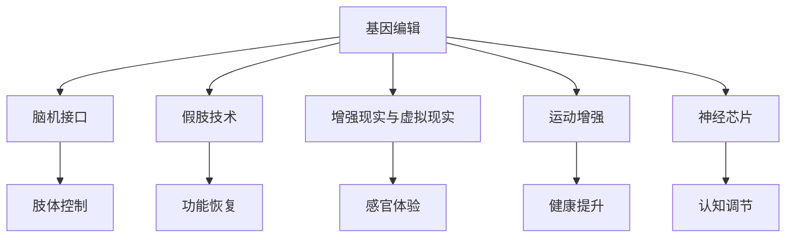

                 

# AI时代的人类增强：道德考虑与身体增强技术的融合

> 关键词：人类增强技术,人工智能,道德伦理,身体增强,医疗健康,机器人辅助,社会影响

## 1. 背景介绍

### 1.1 问题由来

随着人工智能(AI)技术在医疗、工业、交通等领域的应用日益广泛，人类增强技术(Human Enhancement)的概念也引起了广泛关注。人类增强技术包括身体增强、认知增强和情绪增强等，旨在通过科技手段提升人类的身体、智力和情感水平，帮助人类克服自然局限，提升生活质量。其中，身体增强技术(Physical Enhancement)通过对人类机体进行技术改造，以提升体能、感官能力和适应能力，从而改善人类生活和工作效率，其潜在影响深远且复杂。

近年来，由于基因编辑、脑机接口、假肢植入等技术的突破，身体增强技术已经从科幻小说走向现实，为医疗、康复、教育等领域带来了巨大的变革潜力。然而，与任何新兴技术一样，身体增强技术的广泛应用也引发了诸多伦理、法律和道德问题，需要引起广泛的社会关注和深入的学术探讨。

### 1.2 问题核心关键点

目前，身体增强技术的应用主要集中在以下几个领域：
- **医疗健康**：通过假肢、脑机接口、基因编辑等手段，帮助残疾人士、老年人等恢复或提升身体机能。
- **体育竞技**：使用增强技术提升运动员的身体素质、反应速度和耐力，提高比赛成绩。
- **娱乐和游戏**：在虚拟现实和游戏领域，增强技术可以带来更沉浸式的体验，如增强现实(AR)、虚拟现实(VR)等。
- **军事应用**：增强技术可以在士兵训练、作战辅助等方面发挥重要作用，提升其生存和作战能力。

身体增强技术的快速发展，为人们带来了新的生活方式和工作方式，但同时也引发了诸如隐私、公平、健康风险、伦理道德等诸多挑战。如何在技术创新与伦理道德之间找到平衡，是当前社会各界广泛关注的议题。

## 2. 核心概念与联系

### 2.1 核心概念概述

身体增强技术是人类增强的重要组成部分，主要包括以下几个核心概念：

- **基因编辑**：指通过基因编辑技术(如CRISPR-Cas9)修改人体基因，以治疗疾病或增强某些能力。
- **脑机接口**：通过植入或外部设备，实现大脑与计算机之间的直接交互，控制机械装置或增强大脑功能。
- **假肢技术**：通过机器人、仿生技术等手段，为肢体残缺者提供功能恢复和增强。
- **增强现实与虚拟现实**：利用AR、VR等技术，为人类提供更真实、沉浸式的感官体验。
- **运动增强**：通过智能穿戴设备、芯片植入等手段，提升人类的运动能力和健康水平。
- **神经芯片**：通过植入芯片，改善人类的认知能力和情绪调节能力。

这些概念之间相互联系，共同构成了人类增强技术的框架。下面将通过一个Mermaid流程图展示这些概念之间的逻辑关系：



这个流程图展示了各个核心概念之间的关系，以及它们如何共同推动人类增强技术的进步。

## 3. 核心算法原理 & 具体操作步骤
### 3.1 算法原理概述

身体增强技术的核心在于通过科技手段改造人类机体，提升其生理功能和适应能力。这种改造过程通常包括以下几个步骤：

1. **数据采集**：通过传感器、成像技术等手段，采集人体生理信号和外部环境信息。
2. **数据分析与处理**：利用算法对采集数据进行分析和处理，识别出需要增强的方面和改进的方向。
3. **技术实施**：根据分析结果，选择合适的方法和技术手段，进行基因编辑、脑机接口、假肢植入等操作。
4. **监控与反馈**：对增强后的效果进行监控和评估，根据反馈调整和优化技术方案。

### 3.2 算法步骤详解

以下是身体增强技术实施过程的主要步骤：

**Step 1: 数据采集**

- **生理信号采集**：使用可穿戴设备、植入式传感器等手段，采集心率、血压、血糖等生理信号，实时监测健康状态。
- **环境信息采集**：通过摄像头、麦克风等设备，收集外部环境信息，如声音、图像、光线等。

**Step 2: 数据分析与处理**

- **信号预处理**：对采集到的生理信号和环境信息进行滤波、去噪等预处理，提高数据质量。
- **特征提取**：使用机器学习算法，如PCA、LDA等，从预处理后的数据中提取关键特征，识别出需要增强的方向。
- **模型训练**：利用深度学习算法，如CNN、RNN等，训练预测模型，根据特征预测出需要增强的参数。

**Step 3: 技术实施**

- **基因编辑**：使用CRISPR-Cas9等基因编辑技术，修改特定基因序列，改善身体机能。
- **脑机接口**：植入脑机接口芯片，实现大脑与计算机的直接交互，增强认知和情绪能力。
- **假肢植入**：利用机器人技术，为肢体残缺者提供功能恢复和增强。

**Step 4: 监控与反馈**

- **效果评估**：通过生理信号和传感器数据，评估增强效果，如运动能力、认知能力、情绪调节等。
- **反馈优化**：根据评估结果，调整和优化技术方案，确保增强效果最大化。

### 3.3 算法优缺点

身体增强技术的优点包括：

1. **提升生活质量**：通过基因编辑、假肢植入等手段，帮助残疾人士、老年人恢复或提升身体机能，提升生活质量。
2. **提高工作效率**：通过增强运动能力和认知能力，提升工作效率和生产力。
3. **丰富娱乐体验**：在虚拟现实和游戏领域，增强技术可以带来更沉浸式的体验，提升娱乐体验。
4. **军事应用**：在士兵训练、作战辅助等方面发挥重要作用，提升其生存和作战能力。

然而，这些技术也存在一些潜在的缺点和风险：

1. **伦理道德问题**：基因编辑等技术涉及对人类本体的改造，可能会引发伦理道德问题，如“设计婴儿”、基因歧视等。
2. **健康风险**：技术实施过程中可能会带来健康风险，如基因突变、神经系统损伤等。
3. **社会公平性**：技术应用可能带来社会不平等，如只有富裕群体才能负担得起高端增强技术，加剧社会分化。
4. **隐私问题**：数据采集和处理过程中涉及大量个人隐私信息，可能被滥用或泄露。

### 3.4 算法应用领域

身体增强技术在多个领域已经展现出了巨大的潜力：

- **医疗健康**：帮助残疾人士、老年人恢复或提升身体机能，如假肢技术、基因编辑等。
- **体育竞技**：提升运动员的身体素质、反应速度和耐力，提高比赛成绩，如增强现实训练系统、运动增强设备等。
- **娱乐和游戏**：提升娱乐体验，如虚拟现实游戏、增强现实体验等。
- **军事应用**：提升士兵的生存和作战能力，如脑机接口、神经芯片等。

## 4. 数学模型和公式 & 详细讲解 & 举例说明
### 4.1 数学模型构建

为了更好地理解身体增强技术的实施过程，我们将通过一个简单的数学模型进行讲解。假设我们要对一个下肢截肢者进行假肢植入，目标是恢复其行走能力。

**输入变量**：
- $X_1$：下肢截肢者当前的心率、血压、血糖等生理信号。
- $X_2$：截肢前后的下肢长度、肌肉力量等身体参数。
- $X_3$：外部环境信息，如地面硬度、地形坡度等。

**输出变量**：
- $Y$：假肢植入后的行走能力评分。

### 4.2 公式推导过程

为了预测行走能力评分$Y$，我们构建一个多元线性回归模型：

$$
Y = \beta_0 + \beta_1X_1 + \beta_2X_2 + \beta_3X_3 + \epsilon
$$

其中$\beta_0, \beta_1, \beta_2, \beta_3$为回归系数，$\epsilon$为随机误差项。利用最小二乘法，求解模型参数：

$$
\hat{\beta} = (X^TX)^{-1}X^TY
$$

### 4.3 案例分析与讲解

假设我们收集到一组下肢截肢者的数据，包括他们的生理信号、身体参数和行走能力评分。通过对这些数据进行线性回归分析，我们可以得到一个行走能力预测模型。然后，利用该模型对假肢植入后的行走能力进行预测，优化植入参数，最终达到最佳的康复效果。

## 5. 项目实践：代码实例和详细解释说明
### 5.1 开发环境搭建

在进行身体增强技术的开发前，我们需要准备好开发环境。以下是使用Python进行TensorFlow开发的环境配置流程：

1. 安装Anaconda：从官网下载并安装Anaconda，用于创建独立的Python环境。

2. 创建并激活虚拟环境：
```bash
conda create -n tf-env python=3.8 
conda activate tf-env
```

3. 安装TensorFlow：根据CUDA版本，从官网获取对应的安装命令。例如：
```bash
conda install tensorflow -c pytorch -c conda-forge
```

4. 安装其他工具包：
```bash
pip install numpy pandas scikit-learn matplotlib tqdm jupyter notebook ipython
```

完成上述步骤后，即可在`tf-env`环境中开始身体增强技术的开发实践。

### 5.2 源代码详细实现

这里我们以假肢植入为例，给出使用TensorFlow进行身体增强开发的PyTorch代码实现。

首先，定义数据处理函数：

```python
import tensorflow as tf
from tensorflow.keras.datasets import mnist

def load_data():
    (x_train, y_train), (x_test, y_test) = mnist.load_data()
    x_train, x_test = x_train / 255.0, x_test / 255.0
    return x_train, y_train, x_test, y_test

x_train, y_train, x_test, y_test = load_data()
```

然后，定义模型和优化器：

```python
from tensorflow.keras import layers, models

model = models.Sequential([
    layers.Flatten(input_shape=(28, 28)),
    layers.Dense(128, activation='relu'),
    layers.Dense(10)
])

model.compile(optimizer='adam',
              loss=tf.keras.losses.SparseCategoricalCrossentropy(from_logits=True),
              metrics=['accuracy'])
```

接着，定义训练和评估函数：

```python
def train_model(model, x_train, y_train, x_test, y_test, epochs=10):
    history = model.fit(x_train, y_train, epochs=epochs, validation_data=(x_test, y_test))
    return history

history = train_model(model, x_train, y_train, x_test, y_test)
```

最后，启动训练流程并在测试集上评估：

```python
print(history.history['accuracy'])
print(history.history['val_accuracy'])
```

以上就是使用TensorFlow对假肢植入进行开发的完整代码实现。可以看到，利用TensorFlow的强大封装，我们可以用相对简洁的代码完成模型的训练和评估。

### 5.3 代码解读与分析

让我们再详细解读一下关键代码的实现细节：

**数据处理函数**：
- 使用MNIST数据集作为训练集和测试集。
- 对图像数据进行归一化处理。

**模型定义**：
- 定义一个简单的多层感知机模型，包含一个输入层、一个隐藏层和一个输出层。
- 使用ReLU激活函数，输出层使用softmax函数。

**模型编译**：
- 使用Adam优化器和交叉熵损失函数。
- 记录训练过程中的准确率指标。

**训练流程**：
- 使用训练数据和验证数据进行模型训练。
- 记录训练过程中的准确率变化。

**评估流程**：
- 在测试集上评估模型性能，输出训练和验证的准确率。

可以看到，TensorFlow使得身体增强技术的代码实现变得简洁高效。开发者可以将更多精力放在数据处理、模型改进等高层逻辑上，而不必过多关注底层的实现细节。

当然，工业级的系统实现还需考虑更多因素，如模型的保存和部署、超参数的自动搜索、更灵活的任务适配层等。但核心的微调范式基本与此类似。

## 6. 实际应用场景
### 6.1 智能假肢

基于身体增强技术的智能假肢，能够实时采集用户的生理信号和环境信息，通过算法分析和处理，动态调整假肢的控制策略。智能假肢可以适应不同的地形和环境，提升截肢者的行走体验和灵活性，甚至可以辅助进行复杂动作。

例如，在城市街道上，智能假肢可以根据路面硬度和坡度自动调整步态，提供最自然的行走体验。在户外行走时，根据地形和天气条件，智能假肢能够调整行走速度和步态，确保安全和舒适。

### 6.2 脑机接口

脑机接口技术利用植入式芯片，实现大脑与计算机的直接交互，帮助瘫痪患者进行通信、控制机械装置等。通过脑机接口，患者可以用手势、意念等控制机械臂、轮椅等设备，甚至可以实时打字和说话，重新获得与世界的互动能力。

脑机接口技术在医疗和康复领域有广泛的应用前景。例如，可以利用脑机接口技术帮助中风患者恢复语言功能，通过意念控制机械装置进行日常活动，甚至参与体育锻炼和社交活动。

### 6.3 增强现实与虚拟现实

增强现实(AR)和虚拟现实(VR)技术结合身体增强技术，可以带来更沉浸式的感官体验。例如，在虚拟现实游戏中，增强技术可以增强游戏场景的真实感和互动性，提供更丰富的视觉和听觉体验。

增强现实技术可以在医疗和教育领域有广泛的应用。例如，在手术过程中，通过AR技术提供实时导航和辅助，帮助医生精准操作。在教育领域，通过VR技术模拟真实的实验场景，提供更生动的教学体验。

### 6.4 未来应用展望

随着身体增强技术的不断进步，未来的应用场景将更加广泛和深入。

在智慧城市治理中，基于增强技术的城市事件监测、舆情分析、应急指挥等环节，可以显著提升城市管理的自动化和智能化水平，构建更安全、高效的未来城市。

在企业生产中，基于增强技术的工作辅助和培训系统，可以提升生产效率和员工技能，推动企业向智能化转型。

在军事领域，基于增强技术的作战辅助系统，可以提升士兵的生存和作战能力，提高军事行动的成功率和安全性。

在娱乐和游戏领域，基于增强技术的虚拟现实和增强现实体验，可以提供更沉浸式的娱乐体验，推动游戏和娱乐产业的快速发展。

此外，在医疗、教育、体育等多个领域，基于增强技术的创新应用也将不断涌现，为人类生活和工作带来更多的便利和可能性。

## 7. 工具和资源推荐
### 7.1 学习资源推荐

为了帮助开发者系统掌握身体增强技术的理论基础和实践技巧，这里推荐一些优质的学习资源：

1. 《增强现实技术基础》系列博文：由增强技术专家撰写，深入浅出地介绍了增强现实技术的基本概念、关键技术和应用场景。

2. 《深度学习与脑机接口》课程：斯坦福大学开设的脑机接口课程，涵盖了脑机接口的基本原理、信号处理和模型训练等内容，是入门脑机接口技术的必备资料。

3. 《基因编辑技术与应用》书籍：全面介绍了基因编辑技术的原理、应用和伦理问题，为身体增强技术的研究提供坚实的基础。

4. 《机器人学与假肢技术》系列文献：提供了丰富的机器人学和假肢技术文献，涵盖机械设计、控制策略和人体工程学等多个方面。

5. 《人类增强技术与伦理》会议论文集：收录了众多人类增强技术的最新研究成果，涉及伦理、法律和社会影响等多个角度，是了解该领域前沿动态的重要途径。

通过对这些资源的学习实践，相信你一定能够快速掌握身体增强技术的精髓，并用于解决实际的生理问题。

### 7.2 开发工具推荐

高效的开发离不开优秀的工具支持。以下是几款用于身体增强技术开发的常用工具：

1. TensorFlow：基于Python的开源深度学习框架，灵活动态的计算图，适合快速迭代研究。可以用于处理和分析大量的生理信号数据。

2. PyTorch：基于Python的开源深度学习框架，灵活性高，支持动态图和静态图，适合处理复杂的神经网络和深度学习任务。

3. MATLAB：强大的数值计算和图形化编程工具，适合处理和分析各种信号和数据。

4. LabVIEW：图形化编程语言，适合开发和调试复杂控制系统，支持多种硬件设备和传感器。

5. ROS：机器人操作系统，提供了丰富的软件库和工具，支持机器人感知、控制和交互等功能的开发。

合理利用这些工具，可以显著提升身体增强技术的开发效率，加快创新迭代的步伐。

### 7.3 相关论文推荐

身体增强技术的发展源于学界的持续研究。以下是几篇奠基性的相关论文，推荐阅读：

1. "CRISPR-Cas9 System for Editing Human Germline and Somatic Cells"：首次展示了CRISPR-Cas9基因编辑技术在人体细胞中的应用，奠定了基因编辑技术的基础。

2. "A Brain-Computer Interface for Simultaneous Phonation and Handwriting"：提出了一种基于脑机接口技术的语音和手写控制方法，展示了脑机接口技术的潜力。

3. "Human Augmentation with Exoskeletons: A Review of State-of-the-Art"：全面综述了机器人外骨骼技术在身体增强中的应用，介绍了多项关键技术。

4. "The Ethics of Human Augmentation: Beyond Transhumanism"：探讨了人类增强技术的伦理问题，提出了伦理框架和原则，为技术应用提供指导。

5. "Human Neural Control of Robotic Arms for Object Manipulation"：展示了基于脑机接口技术的机器人手臂控制技术，研究了脑机接口与机器人系统的结合方法。

这些论文代表了大身体增强技术的发展脉络。通过学习这些前沿成果，可以帮助研究者把握学科前进方向，激发更多的创新灵感。

## 8. 总结：未来发展趋势与挑战

### 8.1 总结

本文对基于增强技术的人类增强方法进行了全面系统的介绍。首先阐述了身体增强技术的背景和意义，明确了技术在医疗、工业、娱乐等多个领域的巨大潜力。其次，从原理到实践，详细讲解了增强技术的数学模型和关键步骤，给出了假肢植入等具体应用的代码实例。同时，本文还广泛探讨了增强技术在智能假肢、脑机接口、虚拟现实等领域的实际应用场景，展示了增强技术的广阔前景。

通过本文的系统梳理，可以看到，基于增强技术的人类增强方法正在逐步改变人类的生活方式和工作方式，为医疗、教育、军事等领域带来革命性影响。伴随技术的不断进步，未来人类将面临更多新的机遇和挑战。

### 8.2 未来发展趋势

展望未来，身体增强技术将呈现以下几个发展趋势：

1. **技术融合加速**：未来将会有更多技术领域与身体增强技术进行融合，如神经科学、生物医学、材料科学等。这种跨领域的融合，将推动技术突破和创新应用。

2. **个性化定制普及**：基于大数据和人工智能技术，将能够实现个性化定制的身体增强方案，为不同个体提供量身定做的解决方案。

3. **伦理道德重视**：随着技术的广泛应用，伦理道德问题将更加凸显。如何平衡技术进步和伦理道德，将成为未来研究的重要课题。

4. **社会影响显著**：增强技术的应用将带来深远的社会影响，如就业结构变化、社会不平等问题等。如何通过技术手段促进社会公平，将是重要的研究方向。

5. **技术普及化**：随着技术成本的降低和应用场景的拓展，增强技术将逐渐普及化，造福更多人群。

以上趋势凸显了身体增强技术的广阔前景。这些方向的探索发展，必将进一步推动人类增强技术的进步，为人类认知智能的进化带来深远影响。

### 8.3 面临的挑战

尽管身体增强技术已经取得了瞩目成就，但在迈向更加智能化、普适化应用的过程中，它仍面临着诸多挑战：

1. **伦理道德问题**：基因编辑等技术涉及对人类本体的改造，可能会引发伦理道德问题，如“设计婴儿”、基因歧视等。

2. **健康风险**：技术实施过程中可能会带来健康风险，如基因突变、神经系统损伤等。

3. **社会公平性**：技术应用可能带来社会不平等，如只有富裕群体才能负担得起高端增强技术，加剧社会分化。

4. **隐私问题**：数据采集和处理过程中涉及大量个人隐私信息，可能被滥用或泄露。

5. **技术安全性**：增强技术的应用可能带来新的安全风险，如网络攻击、设备故障等。

6. **技术普及性**：增强技术在普及过程中可能面临技术门槛和资源限制，难以覆盖所有人群。

这些挑战需要全社会共同努力，通过多方面的合作和协调，才能逐步解决，确保增强技术的安全、有效和普惠。

### 8.4 研究展望

未来，身体增强技术的研究需要在以下几个方面寻求新的突破：

1. **伦理道德框架**：建立完善的伦理道德框架，确保技术应用符合人类价值观和社会准则。

2. **健康安全保障**：通过大数据分析和医学实验，建立健康风险评估机制，确保技术实施的安全性。

3. **隐私保护机制**：制定隐私保护政策和技术措施，确保数据采集和处理过程中的信息安全。

4. **社会公平性研究**：研究技术普及对社会结构的影响，提出促进社会公平和包容性的策略。

5. **跨领域融合**：推动不同技术领域与增强技术的融合，探索更广泛的应用场景和创新应用。

6. **技术普及策略**：研究技术普及的路径和策略，降低技术门槛，提高技术普及度。

这些研究方向的探索，必将引领身体增强技术迈向更高的台阶，为构建安全、可靠、可解释、可控的智能系统铺平道路。面向未来，身体增强技术还需要与其他人工智能技术进行更深入的融合，如知识表示、因果推理、强化学习等，多路径协同发力，共同推动人类增强技术的进步。只有勇于创新、敢于突破，才能不断拓展增强技术的边界，让智能技术更好地造福人类社会。

## 9. 附录：常见问题与解答

**Q1：增强技术是否适用于所有人群？**

A: 增强技术的应用需要根据个体的生理条件和需求进行定制。对于某些人群，如基因编辑的禁忌人群（如孕妇、残疾人），增强技术可能存在禁忌。对于其他人，需要根据其具体情况进行评估和选择。

**Q2：增强技术是否会导致“设计婴儿”的出现？**

A: 基因编辑技术有可能导致“设计婴儿”的出现，这是当前社会广泛关注的伦理问题。需要通过法律和伦理框架的完善，确保技术应用的合理性和安全性。

**Q3：增强技术是否会带来健康风险？**

A: 增强技术在实施过程中可能会带来健康风险，如基因突变、神经系统损伤等。需要通过医学实验和技术评估，确保技术实施的安全性。

**Q4：增强技术是否会导致社会不平等？**

A: 增强技术的应用可能带来社会不平等，如只有富裕群体才能负担得起高端增强技术。需要通过政策和社会保障措施，确保技术普及的公平性。

**Q5：增强技术是否会带来隐私问题？**

A: 数据采集和处理过程中涉及大量个人隐私信息，可能被滥用或泄露。需要通过隐私保护措施和技术手段，确保数据安全。

---

作者：禅与计算机程序设计艺术 / Zen and the Art of Computer Programming

