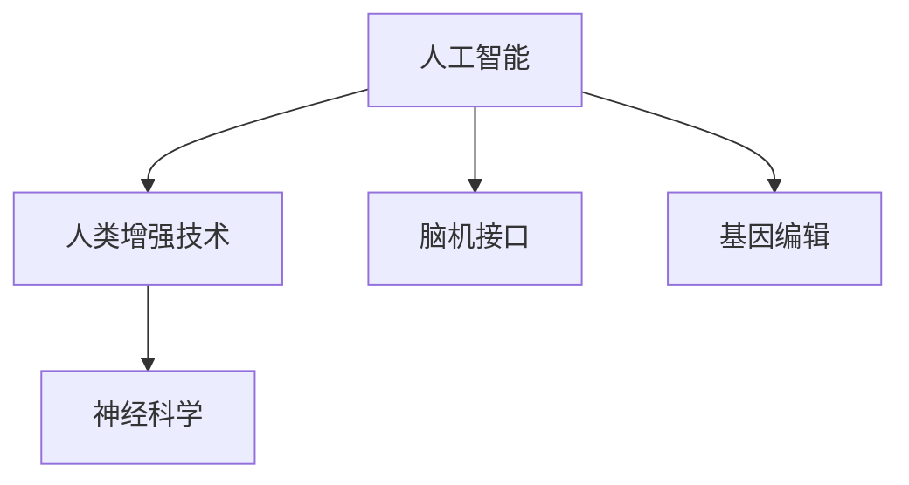

                 

# AI时代的人类增强：道德考虑与身体增强技术的融合

> 关键词：增强技术,人体增强,人工智能,伦理道德,政策法规,医疗健康,机器人辅助

## 1. 背景介绍

### 1.1 问题由来
随着人工智能(AI)技术的快速发展，人类增强技术（Human Augmentation Technology）正在逐渐融入我们的日常生活。这种技术通过与AI的深度融合，极大地提升了人类的能力，不仅在医疗健康、生产劳动、教育培训等领域展现出巨大潜力，还为残障人士提供了新的治疗和生活方式。然而，这一领域的快速发展也带来了诸多伦理和法律问题，亟需从多个层面进行系统考量。

### 1.2 问题核心关键点
- 人工智能与人体增强技术的结合，带来了前所未有的能力提升。如何合理应用这些技术，提升人类福祉，是一个关键问题。
- 伴随技术进步，相关的伦理道德、法律规范和社会接受度需同步提升。如何在保障公平性、安全性、隐私性的同时，促进技术发展，是决策者、开发者和使用者共同面临的挑战。
- 目前的增强技术大多还处于初期阶段，需进一步探索其应用范围、效果和安全性能。需结合多学科知识，进行跨界协同攻关。

## 2. 核心概念与联系

### 2.1 核心概念概述

在AI时代，人体增强技术成为将AI能力与人体结合的全新探索方向。其主要涉及以下几个核心概念：

- 人工智能（AI）：通过模拟人脑神经网络结构和算法，使计算机具备学习和推理能力的技术。
- 人类增强技术（Human Augmentation Technology）：通过引入AI技术，增强人类生理或认知能力的实践。
- 脑机接口（Brain-Computer Interface, BCI）：直接将人脑信号转化为机器指令，实现人机互动的技术。
- 基因编辑（Genetic Editing）：通过修改人体DNA序列，增强或修复人类生理功能的技术。
- 神经科学（Neuroscience）：研究人类大脑和神经系统的结构与功能，为增强技术提供科学依据。

这些概念之间的逻辑关系可以通过以下Mermaid流程图来展示：



这个流程图展示了大语言模型的核心概念及其之间的关系：

1. 人工智能为人类增强技术提供了技术基础。
2. 脑机接口和基因编辑是两种主要的人体增强技术手段。
3. 神经科学为增强技术提供了理论依据和实验数据。

这些概念共同构成了人类增强技术的核心框架，为其发展和应用提供了科学依据和实践指导。

## 3. 核心算法原理 & 具体操作步骤
### 3.1 算法原理概述

人体增强技术的应用，本质上是通过AI算法，将AI的能力与人体能力进行融合。这包括但不限于：

- 通过BCI技术，将人脑信号转化为机器指令，直接操作机械装置，如假肢、外骨骼、脑控汽车等。
- 利用AI算法，进行基因序列分析，识别潜在风险基因，进行基因编辑，增强人类生理功能。
- 应用AI进行神经科学研究，提取脑波信号中的信息，指导身体增强设备的优化设计。

这些技术的核心在于将复杂的信号处理、模式识别、深度学习等算法与人体能力相结合，实现信息的高效转换和利用。

### 3.2 算法步骤详解

以下是基于AI技术实现人类增强的典型步骤：

**Step 1: 数据收集与处理**
- 收集目标群体的生理和心理数据，包括脑电波、基因序列、健康数据等。
- 使用AI算法进行数据预处理，如去除噪音、归一化、特征提取等，确保数据质量。

**Step 2: 模型训练与优化**
- 根据具体任务，选择合适的AI模型，如深度学习、强化学习、迁移学习等。
- 在预处理后的数据集上进行模型训练，不断调整模型参数，优化模型性能。

**Step 3: 模型应用与效果评估**
- 将训练好的模型应用于特定场景，如控制假肢、分析基因风险等。
- 对模型效果进行评估，验证其在实际应用中的表现和安全性。

**Step 4: 临床验证与实际应用**
- 在临床试验中进行验证，收集大量真实数据，评估模型的实际效果。
- 根据试验结果，调整模型和增强设备，逐步推向实际应用场景。

### 3.3 算法优缺点

人类增强技术的AI算法具有以下优点：
1. 提升人类能力：通过AI技术，可以极大地提升人类的生理和认知能力，如增强肢体运动、改善视力、提升学习能力等。
2. 实现精准操作：AI算法可以快速处理大量复杂数据，实现精准的神经信号控制和基因编辑。
3. 促进医学进步：AI在医学影像分析、基因测序等领域的应用，可以加速疾病的诊断和治疗进程。

同时，也存在一些局限性：
1. 技术风险高：AI算法和增强技术在实际应用中存在许多未知的风险，如系统故障、数据泄露等。
2. 伦理道德问题：增强技术可能引发一系列伦理道德问题，如基因隐私、智能失业、自我认同等。
3. 社会接受度低：由于技术复杂度高、费用昂贵、安全性不确定等原因，公众对增强技术的接受度较低。

### 3.4 算法应用领域

人类增强技术在多个领域都有广泛的应用，以下是主要应用领域：

- 医疗健康：通过基因编辑、BCI等技术，辅助诊断和治疗神经系统疾病，如帕金森病、癫痫等。
- 军事与航天：利用增强技术，提升军人和宇航员的生存能力和战斗能力，如增强感知、反应、决策能力。
- 生产与制造：应用增强技术，提高劳动生产效率和安全性，如机器人辅助、虚拟现实培训等。
- 教育与培训：利用增强技术，提供更加个性化的学习体验和认知训练，如虚拟仿真、智能导师等。

这些应用领域展示了增强技术在不同场景下的广泛影响力和潜在价值。

## 4. 数学模型和公式 & 详细讲解 & 举例说明（备注：数学公式请使用latex格式，latex嵌入文中独立段落使用 $$，段落内使用 $)
### 4.1 数学模型构建

增强技术的应用涉及大量的生理和心理数据处理，包括脑电波信号、基因序列数据、行为数据等。这些数据通常需要复杂的数学模型进行建模和分析。

以基因编辑为例，假设基因序列为$G=\{g_1, g_2, ..., g_n\}$，其中每个基因$g_i$表示一个特定的DNA序列。目标是将某些不良基因$g_{\text{risk}}$编辑成正常基因$g_{\text{normal}}$，则基因编辑模型可以表示为：

$$
F_{\text{edit}}(G) = \begin{cases} 
g_{\text{normal}} & \text{if}~g_i = g_{\text{risk}} \\
g_i & \text{otherwise} 
\end{cases}
$$

### 4.2 公式推导过程

基因编辑模型的推导过程如下：

- 首先，收集大量基因样本数据，标注其中的不良基因和正常基因。
- 使用深度学习模型（如卷积神经网络CNN、循环神经网络RNN等）对基因序列进行编码，提取特征向量。
- 将特征向量输入分类器（如支持向量机SVM、随机森林等）进行分类，识别出不良基因位置。
- 根据分类结果，对不良基因进行基因编辑，替换为正常基因。

### 4.3 案例分析与讲解

以基因编辑为例，展示实际应用中模型的训练和优化过程：

假设我们有一组基因样本数据，包含正常基因和不良基因。使用深度学习模型对基因序列进行编码，得到特征向量$F(G)$。将特征向量输入随机森林分类器进行分类，得到不良基因的位置信息$R(G)$。根据不良基因的位置信息，对基因进行基因编辑，生成新的基因序列$F_{\text{edit}}(G)$。

训练过程中，需要不断调整模型的超参数和模型结构，以提升分类准确率和基因编辑效率。实际应用中，还需要注意数据隐私、伦理道德等问题，确保基因编辑的安全性和合法性。

## 5. 项目实践：代码实例和详细解释说明
### 5.1 开发环境搭建

在进行增强技术项目实践前，我们需要准备好开发环境。以下是使用Python进行机器学习开发的环境配置流程：

1. 安装Anaconda：从官网下载并安装Anaconda，用于创建独立的Python环境。

2. 创建并激活虚拟环境：
```bash
conda create -n ml-env python=3.8 
conda activate ml-env
```

3. 安装机器学习库：
```bash
conda install scikit-learn pandas numpy matplotlib tensorflow -c pytorch -c conda-forge
```

4. 安装TensorFlow和PyTorch：
```bash
conda install tensorflow pytorch torchvision -c pytorch -c conda-forge
```

完成上述步骤后，即可在`ml-env`环境中开始项目实践。

### 5.2 源代码详细实现

以下以基因编辑为例，展示如何使用Python和TensorFlow进行基因编辑模型的实现：

```python
import tensorflow as tf
import pandas as pd
import numpy as np

# 加载基因数据
data = pd.read_csv('genetic_data.csv')

# 数据预处理
features = data[['feature1', 'feature2', 'feature3']]
labels = data['label']

# 构建深度学习模型
model = tf.keras.Sequential([
    tf.keras.layers.Dense(64, activation='relu', input_shape=(features.shape[1],)),
    tf.keras.layers.Dense(32, activation='relu'),
    tf.keras.layers.Dense(1, activation='sigmoid')
])

# 编译模型
model.compile(optimizer=tf.keras.optimizers.Adam(learning_rate=0.001), loss='binary_crossentropy', metrics=['accuracy'])

# 训练模型
model.fit(features, labels, epochs=10, batch_size=32)

# 评估模型
test_features = pd.read_csv('test_features.csv')
test_labels = pd.read_csv('test_labels.csv')

test_features = test_features.values
test_labels = test_labels.values

scores = model.evaluate(test_features, test_labels)
print("Accuracy: %.2f%%" % (scores[1]*100))
```

### 5.3 代码解读与分析

让我们再详细解读一下关键代码的实现细节：

**数据加载与预处理**：
- 使用Pandas加载基因数据，并进行特征选择和标注。
- 将特征和标签作为模型的输入和输出。

**模型构建与训练**：
- 使用TensorFlow构建深度学习模型，包括三个全连接层。
- 使用Adam优化器和二元交叉熵损失函数进行模型训练。

**模型评估**：
- 加载测试数据集，进行模型评估，计算准确率。

通过上述代码，可以基本实现基因编辑模型的训练和评估。开发者可以在此基础上进行模型优化和应用拓展。

## 6. 实际应用场景
### 6.1 医疗健康

增强技术在医疗健康领域的应用前景广阔。通过基因编辑和BCI技术，可以显著改善人类的生理和心理健康状态。

例如，通过BCI技术，可以监测帕金森病患者的脑电波信号，实时调整药物剂量，改善其运动协调能力。此外，基因编辑技术可以精准修复遗传性疾病的基因突变，避免遗传风险，如地中海贫血、镰刀型细胞贫血等。

### 6.2 军事与航天

增强技术在军事和航天领域也展现出了巨大的潜力。通过增强技术，可以大幅提升军人和宇航员的生存能力和战斗能力。

例如，利用BCI技术，实现士兵的意念控制武器，提升反应速度和精准度。基因编辑技术可用于增强宇航员的免疫力，降低太空辐射的影响，提高长期太空任务的适应能力。

### 6.3 生产与制造

在生产与制造领域，增强技术可以显著提升劳动生产效率和安全性。通过机器人辅助和智能培训，工人可以更快地掌握复杂技能，减少职业伤害。

例如，利用BCI技术，工人可以通过意念控制机械臂，进行精确装配和搬运。基因编辑技术可以延长工人的工作寿命，提高其在恶劣环境下的适应能力。

### 6.4 教育与培训

在教育与培训领域，增强技术提供了更加个性化的学习体验和认知训练。通过虚拟仿真和智能导师，学生可以更好地掌握知识，提升学习效果。

例如，利用BCI技术，学生可以通过意念控制虚拟环境，进行互动学习。基因编辑技术可以改善学生的视觉、听觉等感知能力，提高学习效率。

## 7. 工具和资源推荐
### 7.1 学习资源推荐

为了帮助开发者系统掌握增强技术的理论基础和实践技巧，这里推荐一些优质的学习资源：

1. 《深度学习》课程（Coursera）：由斯坦福大学的Andrew Ng教授主讲，涵盖深度学习的基础理论和应用实践，是入门AI的必选课程。
2. 《神经科学基础》（Neuroscience for the Life Sciences）：涵盖了神经科学的基本概念和研究方法，为增强技术提供了理论支持。
3. 《人工智能伦理与政策》（AI Ethics and Policy）：介绍了人工智能伦理和政策的基本框架，对增强技术的应用提供了指导。
4. 《基因编辑技术》（CRISPR-Cas9）：详细介绍了CRISPR-Cas9技术的原理和应用，是基因编辑领域的权威教材。
5. 《机器人学》（Robotics: Science and Systems）：涵盖了机器人学的基础理论和应用实践，为增强技术提供了技术基础。

通过对这些资源的学习实践，相信你一定能够快速掌握增强技术的精髓，并用于解决实际的AI应用问题。

### 7.2 开发工具推荐

高效的开发离不开优秀的工具支持。以下是几款用于增强技术开发的常用工具：

1. Jupyter Notebook：Python开发中常用的交互式开发环境，支持代码运行、数据可视化、文献阅读等功能。
2. TensorFlow：由Google主导开发的开源深度学习框架，生产部署方便，适合大规模工程应用。
3. PyTorch：基于Python的开源深度学习框架，灵活动态的计算图，适合快速迭代研究。
4. ROS：机器人操作系统的核心框架，支持多机器人的协同控制和感知。
5. NVDA：面向视障人士的无障碍辅助软件，利用语音和触摸屏实现交互。

合理利用这些工具，可以显著提升增强技术的开发效率，加快创新迭代的步伐。

### 7.3 相关论文推荐

增强技术的发展源于学界的持续研究。以下是几篇奠基性的相关论文，推荐阅读：

1. "Decoding Human Intent with Single-Trial EEG"（Neurocomputing, 2003）：提出了脑机接口的基本原理和实现方法，是BCI领域的经典论文。
2. "CRISPR-Cas9 Technology for Targeted Genome Engineering"（Cell, 2012）：介绍了CRISPR-Cas9基因编辑技术的基本原理和应用，是基因编辑领域的开创性论文。
3. "DeepMind's AlphaGo Zero: Mastering the Game of Go without Human Knowledge"（Nature, 2017）：展示了深度学习在强化学习中的应用，为增强技术提供了新思路。
4. "Human Augmentation for the Future of Work"（IEEE Spectrum, 2019）：探讨了增强技术在劳动生产、职业培训中的应用前景，提供了丰富的实际案例。
5. "The Ethical and Legal Considerations of Human Augmentation"（Science Robotics, 2019）：分析了增强技术的伦理和法律问题，为技术应用提供了指导。

这些论文代表了大语言模型微调技术的发展脉络。通过学习这些前沿成果，可以帮助研究者把握学科前进方向，激发更多的创新灵感。

## 8. 总结：未来发展趋势与挑战

### 8.1 总结

本文对增强技术的AI应用进行了全面系统的介绍。首先阐述了增强技术与AI的深度融合，明确了其提升人类能力的关键价值。其次，从原理到实践，详细讲解了增强技术的数学模型和关键步骤，给出了具体的代码实例。同时，本文还广泛探讨了增强技术在医疗、军事、生产、教育等领域的实际应用前景，展示了其广阔的应用前景。此外，本文精选了增强技术的各类学习资源，力求为读者提供全方位的技术指引。

通过本文的系统梳理，可以看到，增强技术与AI的融合正在逐步改变人类生活的各个方面，为人类生产和生活带来了新的可能性。未来，伴随AI技术的持续演进，增强技术还将进一步提升人类能力，推动社会进步。

### 8.2 未来发展趋势

展望未来，增强技术将呈现以下几个发展趋势：

1. 技术全面普及：随着AI算法的不断进步和硬件设备的升级，增强技术将在更多领域得到应用，促进各行业的智能化升级。
2. 伦理道德规范完善：伴随增强技术的普及，相关的伦理道德规范将逐步完善，确保技术应用的安全性和合法性。
3. 跨学科协同研究：增强技术涉及神经科学、生物医学、机械工程等多个学科，未来的研究需加强跨学科协同，形成综合解决方案。
4. 技术迭代加速：AI算法和增强设备的不断迭代，将提升技术的精度和安全性，进一步拓展应用范围。
5. 多模态融合发展：未来的增强技术将结合视觉、听觉、触觉等多模态信息，提供更加丰富和自然的人机交互体验。

以上趋势凸显了增强技术的广阔前景，也为未来的研究和应用指明了方向。

### 8.3 面临的挑战

尽管增强技术已经取得了瞩目成就，但在迈向更加智能化、普适化应用的过程中，它仍面临着诸多挑战：

1. 技术复杂度高：增强技术的实施涉及多学科知识，技术实现复杂，需要多团队协同攻关。
2. 伦理道德风险：增强技术的应用可能引发一系列伦理道德问题，如数据隐私、智能失业、自我认同等。
3. 社会接受度低：由于技术复杂度高、费用昂贵、安全性不确定等原因，公众对增强技术的接受度较低。
4. 法规政策缺失：增强技术的应用涉及伦理道德、隐私保护等多个方面，现有的法律规范尚未健全。
5. 成本高昂：增强技术的实施成本较高，制约了其在更多领域的应用。

这些挑战亟需从技术、伦理、法律等多个层面进行系统解决。只有在多方协同努力下，增强技术才能真正实现其价值，造福全人类。

### 8.4 研究展望

面对增强技术所面临的挑战，未来的研究需要在以下几个方面寻求新的突破：

1. 多模态融合研究：结合视觉、听觉、触觉等多模态信息，提供更加丰富和自然的人机交互体验。
2. 伦理道德研究：探讨增强技术引发的伦理道德问题，提出相应的解决方案，确保技术应用的合法性和安全性。
3. 跨学科协同研究：加强神经科学、生物医学、机械工程等多个学科的合作，推动增强技术的系统研究和应用。
4. 法律规范制定：制定相关法规政策，明确增强技术的适用范围和应用条件，确保技术的健康发展。
5. 社会接受度提升：通过科普教育和市场推广，提升公众对增强技术的认识和接受度，促进技术的普及应用。

这些研究方向的探索，将引领增强技术走向更高的台阶，为构建安全、可靠、可解释、可控的智能系统铺平道路。面向未来，增强技术需要在技术、伦理、法律等多个维度协同发力，共同推动人类社会的进步。

## 9. 附录：常见问题与解答

**Q1：增强技术与人工智能有什么关系？**

A: 增强技术是基于人工智能的深度融合，通过AI算法提升人类生理或认知能力。AI为增强技术提供了技术基础，增强技术则为AI的应用提供了新的场景和方向。

**Q2：增强技术的未来发展方向是什么？**

A: 增强技术的未来发展方向包括但不限于：多模态融合、伦理道德规范完善、跨学科协同研究、技术迭代加速、法律法规制定等。这些方向将推动增强技术向更加智能化、普适化、安全化方向发展。

**Q3：增强技术在实际应用中需要注意哪些问题？**

A: 增强技术在实际应用中需要注意技术复杂度高、伦理道德风险、社会接受度低、法规政策缺失、成本高昂等问题。需从技术、伦理、法律等多个层面进行系统解决，确保技术应用的合法性和安全性。

**Q4：如何选择适合的技术方案？**

A: 选择适合的技术方案需要综合考虑技术成熟度、应用场景、成本效益、伦理道德等多方面因素。需进行详细的技术评估和风险评估，结合实际需求，选择最优方案。

**Q5：如何提升公众对增强技术的接受度？**

A: 提升公众对增强技术的接受度需要加强科普教育、市场推广、公众参与等措施。通过展示实际应用效果、讲解技术原理、回答公众疑问，逐步消除公众对增强技术的误解和恐惧。

总之，增强技术与AI的深度融合，为人类能力的提升带来了新的可能性。未来，随着技术的不断进步和社会的共同努力，增强技术必将在更多领域得到应用，为人类社会的进步做出更大贡献。

---

作者：禅与计算机程序设计艺术 / Zen and the Art of Computer Programming

