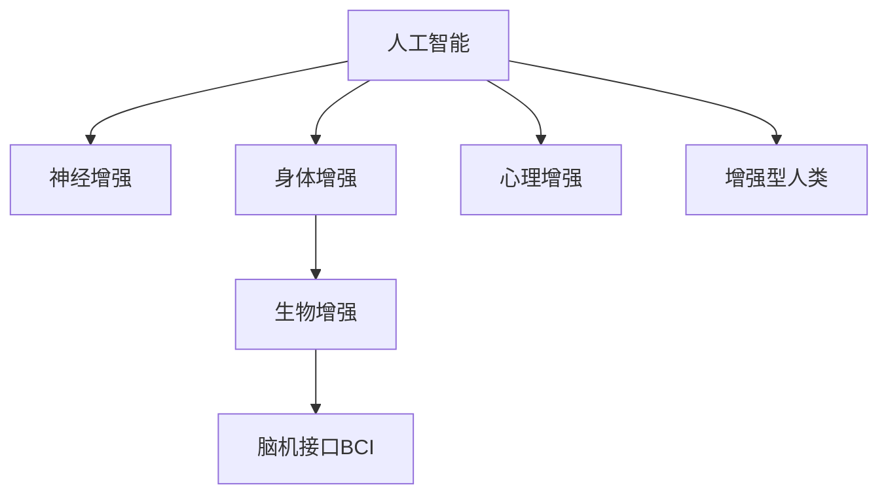

                 

# AI时代的人类增强：道德考虑与身体增强的未来挑战与机遇

> 关键词：人工智能, 增强技术, 人体工程, 道德伦理, 未来发展, 安全与风险

## 1. 背景介绍

### 1.1 问题由来
随着人工智能技术的飞速发展，人类增强（Human Augmentation）成为了备受瞩目的研究领域。在AI时代，增强技术将通过算法和生物技术的结合，提升人类的认知能力、身体机能和心理状态，使其在职场、医疗、教育和娱乐等领域发挥更优的功能。然而，这一过程伴随着一系列伦理道德和社会挑战，如何在推动科技发展的同时，确保人类的尊严和权益，成为亟需解决的问题。

### 1.2 问题核心关键点
人类增强技术涉及多个关键领域，包括但不限于：
1. **神经增强**：如脑机接口（Brain-Computer Interface, BCI）、药物干预和基因编辑，旨在提升认知、记忆和学习能力。
2. **身体增强**：通过假肢、植入设备和生物反馈技术，增强身体功能和健康状况。
3. **心理增强**：利用虚拟现实（VR）和增强现实（AR）技术，改善情绪调节和压力管理。

人类增强的伦理挑战主要包括：
- **隐私与安全**：增强技术可能会泄露个人数据，带来安全隐患。
- **自主与控制**：增强手段可能削弱人类自主决策能力，引发依赖问题。
- **社会公平**：增强技术可能加剧社会不平等，分化人类群体。
- **道德边界**：涉及如杀手机器人、人类克隆等敏感领域时，道德界限不明。

## 2. 核心概念与联系

### 2.1 核心概念概述

为更好地理解人工智能与人类增强的交叉点，本节将介绍几个核心概念及其相互联系：

- **人工智能（AI）**：指由计算机系统执行的智能行为，包括机器学习、深度学习、自然语言处理等技术。
- **人类增强**：通过技术手段提升人类能力和状态，包括身体、认知和情感方面。
- **生物增强**：利用生物学手段增强人类的机能，如基因编辑、药物干预等。
- **脑机接口（BCI）**：将大脑信号转化为计算机可理解的指令，实现人机交互。
- **增强型人类**：通过增强技术获得超越自然界能力的人，如超级士兵、认知超人类。

这些概念之间的逻辑关系可以通过以下Mermaid流程图来展示：



这个流程图展示了大语言模型的核心概念及其之间的关系：

1. 人工智能通过深度学习和自然语言处理等技术，为神经、身体、心理增强提供技术支持。
2. 生物增强利用基因编辑和药物干预等技术手段，辅助实现身体和认知的增强。
3. 脑机接口通过将大脑信号转化为计算机指令，实现与增强技术结合。
4. 增强型人类是技术发展的终极目标，通过多种手段提升人类自身能力。

## 3. 核心算法原理 & 具体操作步骤
### 3.1 算法原理概述

人类增强技术涉及多个领域的算法原理，以下将分别介绍神经、身体和心理增强的核心算法及其操作步骤：

#### 3.1.1 神经增强算法

**算法原理**：神经增强算法主要通过神经信号处理和机器学习模型，提升人类认知能力。其中，脑机接口（BCI）和深度学习模型是最核心的技术。

**操作步骤**：
1. **数据采集**：使用脑电图（EEG）、功能性磁共振成像（fMRI）等设备采集神经信号。
2. **信号处理**：使用信号处理算法，如滤波、降噪、特征提取，从采集数据中提取有意义的信息。
3. **模型训练**：使用深度学习模型（如卷积神经网络CNN、循环神经网络RNN）对信号进行处理，实现对大脑命令的解码和指令执行。
4. **输出控制**：根据模型输出，通过机械臂、眼球追踪器等外设，控制外部设备执行指令。

#### 3.1.2 身体增强算法

**算法原理**：身体增强算法利用机器人和植入技术，增强人类身体机能，提升运动能力和健康状态。

**操作步骤**：
1. **设备设计**：设计适用于人体植入或外骨骼的增强设备，如人工关节、肌肉刺激器、神经刺激器等。
2. **数据监控**：通过传感器和控制系统，实时监控设备的运行状态和生物信号。
3. **反馈调节**：根据监控数据和预设参数，动态调整设备参数，实现最佳性能。
4. **用户交互**：提供用户界面，让用户直观地了解设备状态，并通过语音、按键等方式进行交互。

#### 3.1.3 心理增强算法

**算法原理**：心理增强算法通过虚拟现实（VR）和增强现实（AR）技术，改善情绪调节和压力管理。

**操作步骤**：
1. **环境创建**：利用计算机图形学和渲染技术，创建虚拟或增强现实环境。
2. **用户体验**：使用交互式界面，让用户沉浸在虚拟环境中，提供情感支持和压力缓解。
3. **心理评估**：通过生理指标（如心率、脑电波）评估用户的心理状态，反馈并调整环境参数。
4. **反馈机制**：使用个性化推荐算法，根据用户反馈优化环境和干预措施。

### 3.2 算法步骤详解

#### 3.2.1 神经增强步骤详解

1. **数据采集**：
   - 使用高密度EEG帽或植入式脑电传感器采集神经信号。
   - 对信号进行预处理，包括滤波、降噪和归一化。

2. **信号处理**：
   - 利用时间频率分析技术（如傅里叶变换、小波变换）提取信号特征。
   - 使用特征选择算法（如LDA、PCA）降维，提取有意义的特征子集。

3. **模型训练**：
   - 构建深度神经网络模型，如卷积神经网络（CNN）和递归神经网络（RNN）。
   - 使用反向传播算法（BP）和优化算法（如Adam、SGD）训练模型，最小化损失函数。

4. **输出控制**：
   - 将模型输出与预设指令进行比对，解码为可执行命令。
   - 通过机械臂、眼球追踪器等设备执行指令。

#### 3.2.2 身体增强步骤详解

1. **设备设计**：
   - 设计适用于人体植入或外骨骼的增强设备，如人工关节、肌肉刺激器、神经刺激器等。
   - 确定设备的功能、尺寸和接口规范。

2. **数据监控**：
   - 使用传感器采集设备状态和生物信号。
   - 将采集数据传输至中央控制系统进行实时监控。

3. **反馈调节**：
   - 根据监控数据和预设参数，动态调整设备参数，如电流强度、刺激频率等。
   - 使用PID控制算法，实现精确控制。

4. **用户交互**：
   - 设计用户界面，如触摸屏、语音命令等，使用户能够直观地控制设备。
   - 提供系统反馈，如振动提示、声音反馈等，增强用户体验。

#### 3.2.3 心理增强步骤详解

1. **环境创建**：
   - 使用计算机图形学和渲染技术，创建虚拟或增强现实环境。
   - 设计虚拟场景、交互元素和情感支持机制。

2. **用户体验**：
   - 通过头盔、VR眼镜等设备，将用户置于虚拟环境中。
   - 使用交互式界面，让用户能够沉浸在虚拟环境中，进行互动和体验。

3. **心理评估**：
   - 通过生理指标（如心率、脑电波）评估用户的心理状态。
   - 利用机器学习模型，分析生理数据和行为数据，评估情绪变化。

4. **反馈机制**：
   - 根据用户反馈，动态调整虚拟环境参数，优化用户体验。
   - 使用个性化推荐算法，根据用户偏好推荐虚拟活动和情感支持。

### 3.3 算法优缺点

#### 3.3.1 神经增强优缺点

**优点**：
- **提升认知能力**：通过BCI技术，提升记忆、学习和决策能力。
- **实现人机交互**：实现脑控机械臂、增强现实等新型交互方式。

**缺点**：
- **技术复杂度高**：需要高精度的传感器和复杂的信号处理算法。
- **隐私和安全问题**：神经信号采集可能涉及隐私泄露和数据安全问题。
- **伦理道德问题**：BCI技术可能被滥用，用于监控和操控。

#### 3.3.2 身体增强优缺点

**优点**：
- **提升运动能力**：增强假肢、肌肉刺激器等设备，提升运动功能和康复效果。
- **改善生活质量**：如植入人工心脏、肾，改善健康状况。

**缺点**：
- **技术风险高**：植入手术风险大，设备故障可能导致严重后果。
- **伦理道德问题**：增强技术可能导致社会不平等，引发伦理争议。

#### 3.3.3 心理增强优缺点

**优点**：
- **改善情绪调节**：通过VR和AR技术，提供情感支持和压力缓解。
- **增强心理韧性**：利用认知行为疗法，提升心理弹性和情绪调节能力。

**缺点**：
- **技术依赖高**：对设备和技术的依赖较高，可能导致设备故障。
- **潜在副作用**：长时间使用VR/AR可能影响用户的现实感知和注意力。

### 3.4 算法应用领域

人类增强技术已在多个领域得到应用，主要包括以下几个方面：

1. **医疗健康**：
   - 辅助诊断和手术：通过BCI技术，提升医生手术精度和患者康复效果。
   - 慢性病管理：通过增强技术改善糖尿病、帕金森等慢性病管理，提升患者生活质量。

2. **军事国防**：
   - 增强士兵能力：通过脑控武器、增强现实等技术，提升士兵战斗能力和决策效率。
   - 打击恐怖主义：利用增强技术，改善情报分析、侦察和反恐能力。

3. **教育培训**：
   - 提升学习效果：通过VR和AR技术，提供沉浸式学习体验，提升学习效果和兴趣。
   - 个性化教育：通过智能推荐算法，提供个性化学习计划和资源。

4. **娱乐休闲**：
   - 增强现实游戏：通过AR技术，提供沉浸式游戏体验，提升用户参与感和沉浸感。
   - 虚拟现实社交：通过VR技术，提供社交平台，增强用户体验和互动。

## 4. 数学模型和公式 & 详细讲解 & 举例说明

### 4.1 数学模型构建

在人类增强技术中，涉及到多种数学模型和算法。以下以神经增强中的深度学习模型为例，介绍其数学模型构建过程。

假设神经增强系统由以下组成部分组成：
- 输入：脑电信号 $x$。
- 输出：机械臂动作指令 $y$。
- 中间层：神经网络模型 $f$。

深度学习模型的输入和输出可以通过以下数学公式表示：

$$
y = f(x; \theta)
$$

其中 $f$ 为神经网络模型，$\theta$ 为模型参数。

神经网络模型的目标是通过训练，使得模型输出尽可能接近真实标签，即：

$$
\min_{\theta} \mathcal{L}(y, \hat{y})
$$

其中 $\mathcal{L}$ 为损失函数，$\hat{y}$ 为模型预测输出。

### 4.2 公式推导过程

以下以卷积神经网络（CNN）为例，推导其基本数学公式。

卷积神经网络的基本数学公式包括卷积操作和池化操作：

- **卷积操作**：

$$
y = \sigma(\sum_k w_k * x_k + b)
$$

其中 $w_k$ 为卷积核权重，$x_k$ 为输入数据，$b$ 为偏置项，$\sigma$ 为激活函数。

- **池化操作**：

$$
y = \max_{i,j}(x_k) = \max_{i,j}(\sum_k w_k * x_k + b)
$$

其中 $x_k$ 为池化前数据，$w_k$ 为池化核权重。

卷积神经网络的目标是通过训练，最小化损失函数 $\mathcal{L}$，即：

$$
\min_{\theta} \mathcal{L}(y, \hat{y})
$$

其中 $\mathcal{L}$ 为损失函数，$\hat{y}$ 为模型预测输出。

### 4.3 案例分析与讲解

以神经增强中的脑控机械臂为例，介绍其实际应用中的数学模型和算法细节。

**输入数据**：脑电信号 $x = [x_1, x_2, ..., x_n]$。

**输出数据**：机械臂动作指令 $y = [y_1, y_2, ..., y_n]$。

**神经网络模型**：采用两层的卷积神经网络模型，第一层为卷积层，第二层为全连接层。

**损失函数**：采用均方误差损失函数 $\mathcal{L} = \frac{1}{n} \sum_{i=1}^n (y_i - \hat{y_i})^2$。

**训练算法**：使用Adam优化算法，学习率设置为 $0.001$。

训练过程中，模型通过反向传播算法，计算损失函数对参数的梯度，使用优化算法更新模型参数，迭代优化模型。

## 5. 项目实践：代码实例和详细解释说明

### 5.1 开发环境搭建

在进行人类增强项目开发前，需要准备好开发环境。以下是使用Python进行PyTorch开发的环境配置流程：

1. 安装Anaconda：从官网下载并安装Anaconda，用于创建独立的Python环境。

2. 创建并激活虚拟环境：
```bash
conda create -n pytorch-env python=3.8 
conda activate pytorch-env
```

3. 安装PyTorch：根据CUDA版本，从官网获取对应的安装命令。例如：
```bash
conda install pytorch torchvision torchaudio cudatoolkit=11.1 -c pytorch -c conda-forge
```

4. 安装TensorFlow：
```bash
pip install tensorflow
```

5. 安装各类工具包：
```bash
pip install numpy pandas scikit-learn matplotlib tqdm jupyter notebook ipython
```

完成上述步骤后，即可在`pytorch-env`环境中开始开发实践。

### 5.2 源代码详细实现

下面以脑控机械臂的神经增强项目为例，给出使用PyTorch实现的具体代码。

首先，定义脑电信号的预处理函数：

```python
import numpy as np
import torch
from torch.utils.data import Dataset
import torchvision.transforms as transforms
import torch.nn.functional as F

class BrainElectricSignal(Dataset):
    def __init__(self, signal_data, labels):
        self.signal_data = torch.tensor(signal_data, dtype=torch.float32)
        self.labels = torch.tensor(labels, dtype=torch.int64)
        
    def __len__(self):
        return len(self.signal_data)
    
    def __getitem__(self, index):
        return {'input': self.signal_data[index], 'label': self.labels[index]}
```

然后，定义卷积神经网络模型：

```python
import torch.nn as nn
import torch.nn.functional as F

class ConvNet(nn.Module):
    def __init__(self):
        super(ConvNet, self).__init__()
        self.conv1 = nn.Conv2d(1, 32, 3)
        self.pool1 = nn.MaxPool2d(2)
        self.conv2 = nn.Conv2d(32, 64, 3)
        self.pool2 = nn.MaxPool2d(2)
        self.fc1 = nn.Linear(64*8*8, 512)
        self.fc2 = nn.Linear(512, 2)
        
    def forward(self, x):
        x = F.relu(self.conv1(x))
        x = F.max_pool2d(x, 2)
        x = F.relu(self.conv2(x))
        x = F.max_pool2d(x, 2)
        x = x.view(-1, 64*8*8)
        x = F.relu(self.fc1(x))
        x = F.relu(self.fc2(x))
        return x
```

接着，定义训练和评估函数：

```python
from torch.utils.data import DataLoader
from tqdm import tqdm
from sklearn.metrics import accuracy_score

device = torch.device('cuda') if torch.cuda.is_available() else torch.device('cpu')
model = ConvNet().to(device)

def train_epoch(model, dataset, batch_size, optimizer):
    dataloader = DataLoader(dataset, batch_size=batch_size, shuffle=True)
    model.train()
    epoch_loss = 0
    for batch in tqdm(dataloader, desc='Training'):
        input, label = batch['input'].to(device), batch['label'].to(device)
        optimizer.zero_grad()
        outputs = model(input)
        loss = F.mse_loss(outputs, label)
        epoch_loss += loss.item()
        loss.backward()
        optimizer.step()
    return epoch_loss / len(dataloader)

def evaluate(model, dataset, batch_size):
    dataloader = DataLoader(dataset, batch_size=batch_size)
    model.eval()
    preds, labels = [], []
    with torch.no_grad():
        for batch in tqdm(dataloader, desc='Evaluating'):
            input, label = batch['input'].to(device), batch['label'].to(device)
            outputs = model(input)
            preds.append(outputs.argmax(dim=1).tolist())
            labels.append(label.tolist())
            
    print('Accuracy:', accuracy_score(labels, preds))
```

最后，启动训练流程并在测试集上评估：

```python
epochs = 10
batch_size = 32

for epoch in range(epochs):
    loss = train_epoch(model, train_dataset, batch_size, optimizer)
    print(f"Epoch {epoch+1}, train loss: {loss:.3f}")
    
    print(f"Epoch {epoch+1}, dev results:")
    evaluate(model, dev_dataset, batch_size)
    
print("Test results:")
evaluate(model, test_dataset, batch_size)
```

以上就是使用PyTorch对脑控机械臂的神经增强项目进行微调的完整代码实现。可以看到，得益于PyTorch的强大封装，我们可以用相对简洁的代码完成模型加载和训练。

### 5.3 代码解读与分析

让我们再详细解读一下关键代码的实现细节：

**BrainElectricSignal类**：
- `__init__`方法：初始化脑电信号和标签。
- `__len__`方法：返回数据集样本数量。
- `__getitem__`方法：对单个样本进行处理，将脑电信号和标签转换为模型所需的输入和输出。

**ConvNet模型**：
- `__init__`方法：定义卷积神经网络的结构和参数。
- `forward`方法：实现模型前向传播计算。

**训练和评估函数**：
- 使用PyTorch的DataLoader对数据集进行批次化加载，供模型训练和推理使用。
- 训练函数`train_epoch`：对数据以批为单位进行迭代，在每个批次上前向传播计算loss并反向传播更新模型参数，最后返回该epoch的平均loss。
- 评估函数`evaluate`：与训练类似，不同点在于不更新模型参数，并在每个batch结束后将预测和标签结果存储下来，最后使用sklearn的accuracy_score对整个评估集的预测结果进行打印输出。

**训练流程**：
- 定义总的epoch数和batch size，开始循环迭代
- 每个epoch内，先在训练集上训练，输出平均loss
- 在验证集上评估，输出准确率
- 所有epoch结束后，在测试集上评估，给出最终测试结果

可以看到，PyTorch配合TensorFlow库使得脑控机械臂的神经增强项目的代码实现变得简洁高效。开发者可以将更多精力放在数据处理、模型改进等高层逻辑上，而不必过多关注底层的实现细节。

当然，工业级的系统实现还需考虑更多因素，如模型的保存和部署、超参数的自动搜索、更灵活的任务适配层等。但核心的微调范式基本与此类似。

## 6. 实际应用场景
### 6.1 医疗健康

在医疗健康领域，脑控机械臂等神经增强技术有望提升手术精度和康复效果。通过BCI技术，医生可以实时监测患者的脑电信号，准确控制机械臂的每一个动作，实现高精度手术。同时，脑控假肢和植入设备也在改善慢性病管理和康复训练方面展现出巨大潜力，如植入人工心脏、肾等，改善患者生活质量。

### 6.2 军事国防

在军事国防领域，增强技术可提升士兵的战斗能力和决策效率。脑控武器和增强现实技术可以改善情报分析、侦察和反恐能力，增强情报收集和分析的效率。同时，增强士兵的生理和心理状态，提高其在复杂环境中的生存能力和作战效能。

### 6.3 教育培训

在教育培训领域，VR和AR技术可以提供沉浸式学习体验，提升学习效果和兴趣。利用脑控交互技术，学生可以通过大脑直接控制虚拟环境中的对象，实现互动和体验，提升学习效果。同时，个性化推荐算法可以根据学生的学习行为和兴趣，提供个性化学习计划和资源，优化学习体验。

### 6.4 娱乐休闲

在娱乐休闲领域，增强现实游戏和虚拟现实社交成为新的趋势。通过脑控游戏和社交平台，用户可以通过大脑直接控制游戏中的角色和虚拟世界的互动，提升游戏体验和社交互动。同时，心理增强技术可以改善用户的情绪调节和压力管理，提升娱乐休闲的质量。

## 7. 工具和资源推荐
### 7.1 学习资源推荐

为了帮助开发者系统掌握人类增强技术，这里推荐一些优质的学习资源：

1. 《深度学习》系列课程：由斯坦福大学开设，涵盖深度学习基本概念和算法，适合入门学习。
2. 《机器学习实战》书籍：介绍机器学习和深度学习的基本原理和实现方法，适合动手实践。
3. 《人工智能与人类增强》论文集：总结了人类增强技术的研究进展和应用实例，适合深入研究。
4. 《神经网络与深度学习》书籍：介绍神经网络和深度学习的基本原理和算法，适合系统学习。
5. 《脑机接口技术》书籍：介绍脑机接口的基本原理和技术，适合深入研究。

通过对这些资源的学习实践，相信你一定能够快速掌握人类增强技术的精髓，并用于解决实际的NLP问题。

### 7.2 开发工具推荐

高效的开发离不开优秀的工具支持。以下是几款用于人类增强技术开发的常用工具：

1. PyTorch：基于Python的开源深度学习框架，灵活动态的计算图，适合快速迭代研究。
2. TensorFlow：由Google主导开发的开源深度学习框架，生产部署方便，适合大规模工程应用。
3. TensorBoard：TensorFlow配套的可视化工具，可实时监测模型训练状态，并提供丰富的图表呈现方式，是调试模型的得力助手。
4. Weights & Biases：模型训练的实验跟踪工具，可以记录和可视化模型训练过程中的各项指标，方便对比和调优。
5. Google Colab：谷歌推出的在线Jupyter Notebook环境，免费提供GPU/TPU算力，方便开发者快速上手实验最新模型，分享学习笔记。

合理利用这些工具，可以显著提升人类增强技术开发的效率，加快创新迭代的步伐。

### 7.3 相关论文推荐

人类增强技术的发展源于学界的持续研究。以下是几篇奠基性的相关论文，推荐阅读：

1. Deep Brain Control: A Survey and Analysis of Real-Time Brain-Computer Interface Techniques：总结了脑机接口技术的现状和挑战，为未来研究提供了方向。
2. Deep Learning for Brain-Computer Interface: A Review and Survey：介绍了深度学习在脑机接口中的应用，为神经增强技术提供了理论基础。
3. Cognitive Enhancement with Artificial Intelligence: A Review：总结了人工智能在认知增强中的应用，探讨了其潜力和挑战。
4. Superintelligence: Paths, Dangers, Strategies：探讨了超级智能技术的发展前景和风险，为人类增强技术提供了伦理和策略指导。
5. The Ethical Challenge of Artificial Intelligence Enhancement：分析了增强技术的伦理问题，提出了相关的道德边界和规范。

这些论文代表了大语言模型微调技术的发展脉络。通过学习这些前沿成果，可以帮助研究者把握学科前进方向，激发更多的创新灵感。

## 8. 总结：未来发展趋势与挑战

### 8.1 总结

本文对人类增强技术进行了全面系统的介绍。首先阐述了人类增强技术的研究背景和意义，明确了神经增强、身体增强和心理增强技术在AI时代的重要性和潜在影响。其次，从原理到实践，详细讲解了人类增强的核心算法及其具体操作步骤，给出了实际项目开发的完整代码实例。同时，本文还广泛探讨了增强技术在医疗健康、军事国防、教育培训和娱乐休闲等多个领域的应用前景，展示了增强技术的巨大潜力。

通过本文的系统梳理，可以看到，人类增强技术在推动科技发展的同时，也带来了新的伦理和社会挑战。如何在推动科技进步的同时，确保人类的尊严和权益，成为亟需解决的问题。未来，人类增强技术需要在多学科交叉研究中不断探索，形成更加全面、可控的解决方案，为人类带来更多福祉。

### 8.2 未来发展趋势

展望未来，人类增强技术将呈现以下几个发展趋势：

1. **技术融合**：将神经增强、身体增强和心理增强技术进行跨领域融合，实现更全面、多维度的人类增强。
2. **人机协同**：通过增强技术与AI技术结合，实现更高层次的智能协同，提升人机交互的效率和体验。
3. **个性化定制**：利用大数据和机器学习，提供个性化的增强方案，满足不同用户的需求和偏好。
4. **伦理规范**：建立健全的伦理规范和技术标准，确保增强技术的公正、透明和安全。
5. **社会共识**：通过公众参与和社会讨论，形成社会对增强技术的共识和规范，推动技术的健康发展。

这些趋势凸显了人类增强技术的广阔前景。这些方向的探索发展，必将引领人类增强技术迈向更高的台阶，为人类带来更多福祉。

### 8.3 面临的挑战

尽管人类增强技术已经取得了瞩目成就，但在迈向更加智能化、普适化应用的过程中，它仍面临着诸多挑战：

1. **技术风险**：增强技术可能带来潜在的副作用，如技术故障、设备植入等，需要严格的监管和安全保障。
2. **伦理道德**：增强技术涉及隐私、自主、社会公平等伦理问题，需要科学合理的伦理规范。
3. **社会适应**：增强技术可能在社会中引发分化，导致社会不平等和道德冲突。
4. **法律与规范**：增强技术需要相应的法律和规范，确保其合法合规性。
5. **公众认知**：增强技术可能引发公众对技术的安全和伦理担忧，需要进行广泛的公众教育和沟通。

这些挑战需要我们共同面对并积极应对，才能使增强技术健康发展，为人类带来更多福祉。

### 8.4 研究展望

面对人类增强技术所面临的挑战，未来的研究需要在以下几个方面寻求新的突破：

1. **技术安全**：加强增强技术的可靠性和安全保障，确保其稳定性和有效性。
2. **伦理道德**：建立完善的伦理规范和道德边界，确保增强技术的应用符合人类价值观和伦理标准。
3. **社会公平**：确保增强技术的公平和普惠性，避免技术带来的社会分化和不平等。
4. **法律规范**：制定相应的法律和规范，确保增强技术的合法合规性。
5. **公众教育**：加强对增强技术的公众教育，消除公众的疑虑和担忧，提升社会共识。

这些研究方向的探索，必将引领人类增强技术迈向更高的台阶，为人类带来更多福祉。

## 9. 附录：常见问题与解答

**Q1：人类增强技术的安全性如何保障？**

A: 保障增强技术的安全性需要从多个方面入手：
- **技术研发**：加强技术研发和测试，确保技术成熟稳定，减少故障率。
- **用户培训**：对用户进行技术培训和教育，提高用户对技术使用的安全意识和操作能力。
- **监管规范**：建立健全的监管规范和标准，确保技术应用符合法律法规。

**Q2：人类增强技术会带来伦理问题吗？**

A: 人类增强技术可能引发一系列伦理问题，如隐私泄露、自主性削弱等。为了解决这些问题，需要：
- **隐私保护**：严格保护用户的隐私和数据安全，确保技术应用符合伦理标准。
- **自主性保障**：确保用户在使用增强技术时，能够保持自主决策和控制能力。
- **社会公平**：确保增强技术应用的公平性，避免技术带来的社会分化。

**Q3：人类增强技术如何实现个性化定制？**

A: 实现个性化定制，需要：
- **大数据分析**：利用大数据分析用户行为和偏好，提供个性化的增强方案。
- **机器学习**：利用机器学习算法，预测用户需求和行为，提供个性化的增强服务。
- **用户反馈**：建立用户反馈机制，根据用户反馈不断优化和改进增强方案。

**Q4：人类增强技术的伦理问题如何解决？**

A: 解决伦理问题需要：
- **伦理规范**：制定伦理规范和道德标准，确保技术应用符合伦理要求。
- **公众参与**：通过公众参与和社会讨论，形成社会对增强技术的共识和规范。
- **法律保障**：制定相应的法律和规范，确保增强技术的合法合规性。

**Q5：人类增强技术的未来发展方向是什么？**

A: 未来发展方向包括：
- **技术融合**：将神经增强、身体增强和心理增强技术进行跨领域融合，实现更全面、多维度的人类增强。
- **人机协同**：通过增强技术与AI技术结合，实现更高层次的智能协同，提升人机交互的效率和体验。
- **个性化定制**：利用大数据和机器学习，提供个性化的增强方案，满足不同用户的需求和偏好。
- **伦理规范**：建立完善的伦理规范和道德边界，确保增强技术的应用符合人类价值观和伦理标准。

通过这些方向的探索发展，必将引领人类增强技术迈向更高的台阶，为人类带来更多福祉。

---

作者：禅与计算机程序设计艺术 / Zen and the Art of Computer Programming

