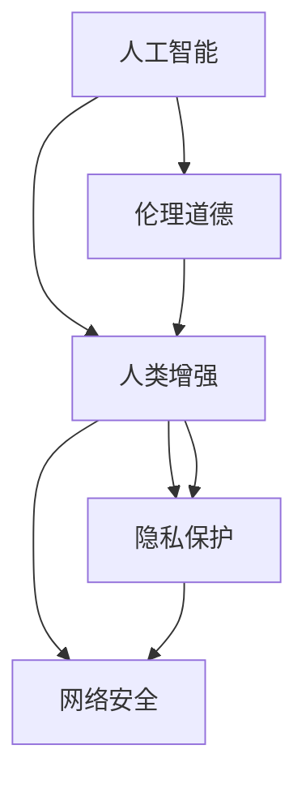

                 

# AI时代的人类增强：道德、隐私和安全的未来

> 关键词：人工智能,人类增强,伦理道德,隐私保护,网络安全

## 1. 背景介绍

在21世纪，人工智能(AI)技术的飞速发展，正在深刻改变人类的生产、生活和社会交往方式。AI不仅在医疗、教育、交通、金融等领域提供了前所未有的解决方案，更是拓展了人类的认知边界，开启了人类增强的新篇章。然而，AI的迅猛发展也带来了新的挑战：如何在技术进步的同时，确保其符合伦理道德标准，保护用户的隐私安全，维护网络空间的安全稳定，成为了当下和未来AI发展的重要课题。本文将从AI时代的道德、隐私和安全三个维度，探讨人类增强的未来方向和应对策略。

## 2. 核心概念与联系

### 2.1 核心概念概述

在讨论AI时代的人类增强时，涉及到的核心概念包括：

- **人工智能**：利用计算机模拟人类的智能行为，通过学习、推理、感知等技术实现问题求解和决策支持。
- **人类增强**：指通过技术手段提升人类的认知、情感、体力等能力，实现对人类功能的增强和补充。
- **伦理道德**：研究人类行为的规范和原则，包括AI系统在设计和应用过程中应遵守的道德准则。
- **隐私保护**：旨在保护个人数据和信息的私密性，防止未经授权的访问和使用。
- **网络安全**：保护网络和数据免受未经授权的访问、破坏或数据泄露，维护网络空间的安全稳定。

这些核心概念相互关联，共同构成了AI时代人类增强的伦理、隐私和安全的理论框架。理解这些概念的相互关系，有助于我们设计、开发和部署出符合伦理道德标准、保护用户隐私安全、保障网络空间安全的AI系统。

### 2.2 核心概念原理和架构的 Mermaid 流程图(Mermaid 流程节点中不要有括号、逗号等特殊字符)



这个流程图展示了大语言模型的工作原理和核心概念之间的联系：

1. 人工智能作为人类增强的基础技术，通过学习人类的认知模式，实现对人类功能的增强。
2. 在人工智能的基础上，引入伦理道德和隐私保护机制，确保AI系统的行为符合伦理规范，保护用户的隐私信息。
3. 同时，结合网络安全技术，防范恶意攻击和数据泄露，维护网络空间的安全稳定。

这些概念相互作用，共同保障了AI技术在人类增强领域的正确应用和健康发展。

## 3. 核心算法原理 & 具体操作步骤

### 3.1 算法原理概述

在AI时代的人类增强中，涉及到的算法原理主要包括：

- **机器学习**：通过数据驱动的学习过程，让AI系统不断优化自身算法，提高决策能力和问题求解能力。
- **深度学习**：利用多层神经网络结构，模拟人类的感知和认知过程，实现对复杂数据的深度分析和理解。
- **强化学习**：通过与环境的交互，使AI系统逐步学习最优策略，提升自主决策和行为优化能力。

这些算法原理在AI技术中的应用，极大地提升了AI系统的智能水平和任务执行能力，为人类增强提供了强大的技术支撑。

### 3.2 算法步骤详解

基于AI的人类增强涉及的步骤主要包括：

1. **数据采集与标注**：收集与增强目标相关的数据，并进行标注，确保数据的准确性和多样性。
2. **模型训练与优化**：选择合适的算法模型，利用标注数据进行训练和优化，提升模型的泛化能力和性能。
3. **模型评估与部署**：在验证集上评估模型性能，选择最优模型，并进行部署，使其能够在实际环境中运行。
4. **用户交互与反馈**：构建用户界面，实现人机交互，收集用户反馈，进一步改进模型和算法。
5. **安全与隐私保护**：在模型设计中嵌入隐私保护和安全防护机制，确保用户数据和隐私不被泄露。

### 3.3 算法优缺点

AI时代的人类增强算法具有以下优点：

- **高效性**：通过自动化学习和优化，可以快速提升模型的性能和决策能力。
- **适应性强**：可以应对各种复杂的任务场景，适应不同用户需求。
- **可扩展性**：支持大规模数据的处理和分析，能够处理海量数据和复杂任务。

同时，这些算法也存在以下缺点：

- **数据依赖**：依赖高质量的数据，数据质量的好坏直接影响模型的性能。
- **模型黑盒**：模型内部逻辑复杂，难以解释和理解，可能导致用户信任度降低。
- **安全风险**：模型可能会受到恶意攻击，数据泄露等风险。

### 3.4 算法应用领域

基于AI的人类增强技术，已经在医疗、教育、金融、交通等多个领域得到广泛应用。例如：

- **医疗领域**：通过AI技术辅助诊断，提升医生的诊断效率和准确性。
- **教育领域**：利用AI技术进行个性化教学，提升学生的学习效果。
- **金融领域**：利用AI技术进行风险评估和投资决策，优化金融服务。
- **交通领域**：通过AI技术进行智能交通管理，提高交通效率和安全性。

未来，AI时代的人类增强技术还将进一步拓展到更多领域，为人类生产生活带来更多便利和提升。

## 4. 数学模型和公式 & 详细讲解 & 举例说明

### 4.1 数学模型构建

为了更好地理解AI时代的人类增强，我们引入以下数学模型：

- **监督学习模型**：基于标注数据进行训练的模型，可以用于分类、回归等任务。
- **深度神经网络模型**：多层非线性变换，模拟人类感知和认知过程，可以用于图像、语音、文本等数据的处理和分析。
- **强化学习模型**：通过与环境的交互，学习最优策略，适用于游戏、机器人控制等场景。

这些模型在AI系统中得到了广泛应用，并取得了显著的成果。

### 4.2 公式推导过程

以深度神经网络模型为例，推导其基本的神经网络结构。

$$
N = \{w^{(i)}\}^n_{i=1}, w^{(i)} = (w^{(i)}_1, w^{(i)}_2, \ldots, w^{(i)}_m) \in \mathbb{R}^m
$$

其中，$N$表示一个深度神经网络，包含$n$层，每层有$m$个神经元。$w^{(i)}$表示第$i$层的权重矩阵。

### 4.3 案例分析与讲解

以深度神经网络在医疗影像分类任务中的应用为例。假设有一组医疗影像数据，其中每个样本$x_i$包含若干像素点的特征，$y_i \in \{0,1\}$表示是否为恶性肿瘤。利用深度神经网络进行分类，输入样本$x_i$，输出为分类概率$p_i^{(j)}$，其中$j=1,2,\ldots,k$表示$k$个分类类别。通过计算$p_i^{(j)}$，可以选择概率最大的类别作为预测结果。

$$
p_i^{(j)} = \frac{1}{1 + \exp(-\sum_{k=1}^m w^{(i)}_k z_i)}
$$

其中$z_i$为第$i$层神经元的输出，$w^{(i)}_k$为连接第$i$层和第$i+1$层的权重。

## 5. 项目实践：代码实例和详细解释说明

### 5.1 开发环境搭建

在进行AI项目开发时，需要搭建好相应的开发环境。以下是在Python环境下搭建深度神经网络模型的步骤：

1. 安装Python：在Linux或Windows系统上安装Python 3.x版本。
2. 安装PyTorch：在命令行中运行`pip install torch`安装PyTorch库。
3. 安装TensorBoard：在命令行中运行`pip install tensorboard`安装TensorBoard库。
4. 安装NVIDIA Drive：在Linux系统上安装NVIDIA驱动，支持GPU加速。

### 5.2 源代码详细实现

下面给出基于深度神经网络进行医疗影像分类的Python代码实现：

```python
import torch
import torch.nn as nn
import torch.optim as optim
from torch.utils.data import DataLoader
from torchvision import datasets, transforms

# 定义卷积神经网络
class ConvNet(nn.Module):
    def __init__(self):
        super(ConvNet, self).__init__()
        self.conv1 = nn.Conv2d(1, 6, 5)
        self.pool = nn.MaxPool2d(2, 2)
        self.conv2 = nn.Conv2d(6, 16, 5)
        self.fc1 = nn.Linear(16 * 5 * 5, 120)
        self.fc2 = nn.Linear(120, 84)
        self.fc3 = nn.Linear(84, 10)

    def forward(self, x):
        x = self.pool(torch.relu(self.conv1(x)))
        x = self.pool(torch.relu(self.conv2(x)))
        x = x.view(-1, 16 * 5 * 5)
        x = torch.relu(self.fc1(x))
        x = torch.relu(self.fc2(x))
        x = self.fc3(x)
        return x

# 加载数据集
train_dataset = datasets.MNIST(root='./data', train=True, download=True, transform=transforms.ToTensor())
test_dataset = datasets.MNIST(root='./data', train=False, download=True, transform=transforms.ToTensor())

# 定义训练集和测试集的数据加载器
train_loader = DataLoader(train_dataset, batch_size=64, shuffle=True)
test_loader = DataLoader(test_dataset, batch_size=64, shuffle=False)

# 定义模型
model = ConvNet()

# 定义损失函数和优化器
criterion = nn.CrossEntropyLoss()
optimizer = optim.SGD(model.parameters(), lr=0.001, momentum=0.9)

# 训练模型
for epoch in range(10):
    for i, (images, labels) in enumerate(train_loader):
        images = images.to(device)
        labels = labels.to(device)
        optimizer.zero_grad()
        outputs = model(images)
        loss = criterion(outputs, labels)
        loss.backward()
        optimizer.step()

        if i % 100 == 99:
            print('Epoch [{}/{}], Step [{}/{}], Loss: {:.4f}'
                  .format(epoch+1, 10, i+1, len(train_loader), loss.item()))

# 测试模型
correct = 0
total = 0
with torch.no_grad():
    for images, labels in test_loader:
        images = images.to(device)
        labels = labels.to(device)
        outputs = model(images)
        _, predicted = torch.max(outputs.data, 1)
        total += labels.size(0)
        correct += (predicted == labels).sum().item()

print('Accuracy of the network on the 10000 test images: {} %'.format(100 * correct / total))
```

### 5.3 代码解读与分析

在上述代码中，我们定义了一个简单的卷积神经网络模型，用于对MNIST手写数字数据集进行分类。通过前向传播和反向传播，训练模型，并在测试集上进行测试。

## 6. 实际应用场景

### 6.1 医疗影像分类

在医疗影像分类中，深度神经网络可以用于自动检测和分类影像中的疾病部位。通过训练深度神经网络，可以有效提高诊断速度和准确性，减轻医生的负担。

### 6.2 个性化推荐

在个性化推荐中，深度神经网络可以用于用户行为预测和推荐系统构建。通过分析用户的历史行为和偏好，生成个性化的推荐内容，提升用户体验。

### 6.3 智能交通

在智能交通中，深度神经网络可以用于交通流量预测和交通信号控制。通过分析交通数据，优化交通信号，提高道路利用率，减少交通拥堵。

### 6.4 未来应用展望

未来，AI时代的人类增强技术将进一步拓展到更多领域，带来更多便利和提升。例如，在智能家居、智慧城市、智能制造等领域，AI技术将发挥重要作用。同时，AI时代的人类增强还将与物联网、云计算等技术结合，推动全社会的智能化进程。

## 7. 工具和资源推荐

### 7.1 学习资源推荐

为了深入理解AI时代的人类增强，推荐以下学习资源：

- **《深度学习》**：由Ian Goodfellow等著，全面介绍了深度学习的基本概念和应用。
- **《机器学习》**：由Tom Mitchell著，介绍了机器学习的基本原理和算法。
- **《人工智能道德》**：由Margaret Boden等著，探讨了AI技术的伦理道德问题。

### 7.2 开发工具推荐

在AI项目开发中，推荐使用以下工具：

- **PyTorch**：深度学习框架，支持GPU加速和分布式训练。
- **TensorFlow**：深度学习框架，支持分布式训练和GPU加速。
- **Keras**：深度学习框架，简单易用，支持多种神经网络模型。

### 7.3 相关论文推荐

以下几篇论文代表了AI时代人类增强领域的前沿研究：

- **"Deep learning and unsupervised feature learning on networks"**：提出了无监督学习的深度神经网络模型，可以用于特征提取和降维。
- **"Human-centered artificial intelligence"**：探讨了AI技术在人类增强中的应用，提出了“以人为中心”的AI设计理念。
- **"AI ethics"**：讨论了AI技术的伦理道德问题，提出了构建负责任AI系统的建议。

## 8. 总结：未来发展趋势与挑战

### 8.1 研究成果总结

本文从AI时代的人类增强出发，探讨了其在伦理道德、隐私保护和网络安全方面的挑战和应对策略。基于深度神经网络的技术，已经在医疗影像分类、个性化推荐和智能交通等领域得到了广泛应用。未来，AI时代的人类增强技术还将进一步拓展到更多领域，带来更多便利和提升。

### 8.2 未来发展趋势

未来，AI时代的人类增强技术将呈现以下几个发展趋势：

- **智能化提升**：通过AI技术，实现对人类认知、情感、体力等多方面能力的提升。
- **人机协同**：AI技术与人类协同工作，发挥各自优势，提高工作效率和质量。
- **普及化应用**：AI技术将逐渐普及到各个行业和领域，成为人类生产生活中不可或缺的一部分。

### 8.3 面临的挑战

尽管AI时代的人类增强技术取得了显著进展，但也面临诸多挑战：

- **数据质量**：数据质量的好坏直接影响AI模型的性能。如何获取高质量、多样化的数据，是未来的一大挑战。
- **模型可解释性**：深度神经网络等模型的内部逻辑复杂，难以解释和理解，可能导致用户信任度降低。
- **伦理道德**：AI技术在应用过程中需要遵循伦理道德规范，确保其行为符合人类价值观和社会道德标准。

### 8.4 研究展望

为了应对上述挑战，未来的研究需要在以下几个方面进行深入探索：

- **数据采集与处理**：通过数据采集和预处理技术，提高数据质量，增加数据的多样性和代表性。
- **模型可解释性**：通过模型解释技术，提高模型的可解释性，增强用户信任。
- **伦理道德规范**：制定AI技术的伦理道德规范，确保AI系统的行为符合人类价值观和社会道德标准。

## 9. 附录：常见问题与解答

**Q1: 深度神经网络在医疗影像分类中有什么优势？**

A: 深度神经网络在医疗影像分类中的优势主要包括：
- **高准确性**：通过学习大量的医疗影像数据，深度神经网络可以自动提取特征，进行准确分类。
- **快速诊断**：通过自动化的分类过程，可以显著缩短医生的诊断时间。
- **泛化能力强**：深度神经网络可以处理多种类型的医疗影像，具有较强的泛化能力。

**Q2: 如何确保AI系统的伦理道德规范？**

A: 确保AI系统的伦理道德规范，需要从以下几个方面进行：
- **数据伦理**：在数据采集和处理过程中，确保数据的合法性和伦理性，避免侵犯个人隐私。
- **算法伦理**：在算法设计和开发过程中，遵循伦理道德规范，确保算法公正、透明、可解释。
- **社会伦理**：在AI系统的应用过程中，考虑其对社会的影响，确保其行为符合社会道德标准。

**Q3: 如何保护用户的隐私安全？**

A: 保护用户隐私安全，需要从以下几个方面进行：
- **数据加密**：在数据传输和存储过程中，采用加密技术，防止数据泄露。
- **匿名化处理**：在数据处理过程中，采用匿名化技术，保护用户身份信息。
- **访问控制**：在数据访问过程中，采用访问控制技术，确保只有授权用户才能访问数据。

**Q4: 如何确保AI系统的安全稳定性？**

A: 确保AI系统的安全稳定性，需要从以下几个方面进行：
- **入侵检测**：在数据传输和处理过程中，采用入侵检测技术，防止恶意攻击。
- **异常检测**：在数据处理过程中，采用异常检测技术，及时发现并处理异常情况。
- **数据备份**：在数据存储过程中，采用数据备份技术，确保数据的安全性和可靠性。

**Q5: 未来AI技术的发展方向是什么？**

A: 未来AI技术的发展方向主要包括：
- **智能化提升**：通过AI技术，实现对人类认知、情感、体力等多方面能力的提升。
- **人机协同**：AI技术与人类协同工作，发挥各自优势，提高工作效率和质量。
- **普及化应用**：AI技术将逐渐普及到各个行业和领域，成为人类生产生活中不可或缺的一部分。

