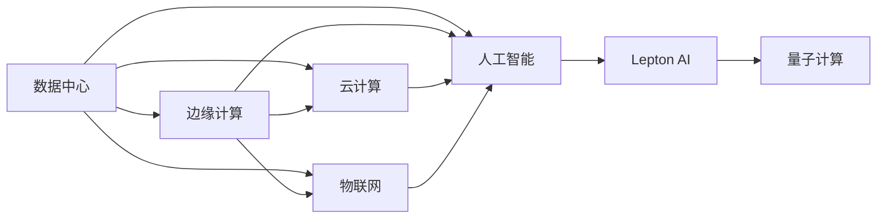

                 

# AI时代的基础设施革命：Lepton AI的角色定位

> 关键词：基础设施, AI革命, Lepton AI, 深度学习, 数据中心, 边缘计算, 云计算, 物联网, 人工智能, 量子计算

## 1. 背景介绍

### 1.1 问题由来

随着人工智能技术的飞速发展，数据中心和边缘计算设施在全球范围内迅速扩展。这些设施成为了支撑AI时代各项应用的基石，直接决定了人工智能应用效率、成本和安全性。在这个过程中，Lepton AI作为AI基础设施的重要组成部分，承担了数据存储、计算和分发等关键任务。理解Lepton AI的角色定位，对优化AI应用性能、提升用户体验、保证数据安全至关重要。

### 1.2 问题核心关键点

1. **基础设施定位**：在AI时代，数据中心和边缘计算设施对AI应用的支撑作用。
2. **Lepton AI功能**：作为AI基础设施的组成部分，Lepton AI在数据存储、计算和分发等方面的功能。
3. **AI革命影响**：AI基础设施的扩展对行业和企业的影响。
4. **未来趋势**：Lepton AI在未来AI时代的发展方向。
5. **面临挑战**：AI基础设施在扩展过程中需要解决的问题。

### 1.3 问题研究意义

深入理解Lepton AI的角色定位，对构建高效、安全、经济的AI基础设施具有重要意义。这一理解不仅能指导企业在AI时代的战略布局，还能促进AI技术的进一步创新和应用，推动AI时代的全面进步。

## 2. 核心概念与联系

### 2.1 核心概念概述

Lepton AI作为AI基础设施的重要组成部分，主要负责数据存储、计算和分发等关键任务。以下是几个关键概念：

- **数据中心**：大型设施，用于存储、处理和分发大量数据。
- **边缘计算**：在数据源头进行初步处理和分析，减少延迟和带宽消耗。
- **云计算**：利用互联网提供计算资源和存储服务。
- **物联网**：通过网络连接各种设备，实现数据收集和自动化。
- **人工智能**：模拟人类智能过程，进行数据分析和决策。
- **量子计算**：利用量子态进行计算，处理传统计算无法解决的复杂问题。

这些概念通过以下Mermaid流程图展示它们之间的联系：



此流程图展示了数据中心、边缘计算、云计算、物联网、人工智能、量子计算与Lepton AI之间的关系。数据中心和边缘计算负责存储和初步处理数据，云计算提供弹性计算资源，物联网实现数据的广泛收集，人工智能进行数据分析和决策，量子计算解决复杂问题，而Lepton AI则负责数据存储、计算和分发，是基础设施中的关键一环。

## 3. 核心算法原理 & 具体操作步骤
### 3.1 算法原理概述

Lepton AI的核心算法原理主要基于深度学习和分布式计算技术。通过深度学习模型，Lepton AI能够高效地进行数据存储、计算和分发。以下是基于深度学习的Lepton AI关键算法：

- **分布式存储算法**：通过多节点分布式存储，实现数据的冗余和高可用性。
- **分布式计算算法**：利用多个计算节点并行处理任务，提升计算效率。
- **边缘计算算法**：在数据源头进行初步处理，减少延迟和带宽消耗。
- **云计算算法**：优化资源分配，提高云服务的灵活性和可扩展性。

### 3.2 算法步骤详解

Lepton AI的算法步骤大致可以分为以下几个环节：

1. **数据收集**：从数据源头（如传感器、摄像头等）收集数据。
2. **预处理**：对数据进行清洗、格式化和标准化，提高数据质量。
3. **存储和分发**：将数据存储在Lepton AI基础设施中，并根据需要分发至其他系统。
4. **计算和分析**：利用深度学习模型对数据进行分析和计算，提取有用信息。
5. **应用部署**：将计算结果部署到应用系统中，支持各种AI应用。

### 3.3 算法优缺点

**优点**：

- **高效性**：深度学习和分布式计算技术的结合，使得Lepton AI能够高效处理大量数据。
- **可靠性**：分布式存储和计算提高了系统的冗余性和可用性。
- **灵活性**：支持多种数据源和应用场景，适应性强。
- **安全性**：多层次的数据加密和访问控制，保障数据安全。

**缺点**：

- **复杂性**：系统构建和管理较为复杂，需要专业知识和技能。
- **成本高**：大规模分布式设施的建设、维护和运营成本较高。
- **资源消耗**：大规模数据存储和计算对能源和硬件资源的需求较大。

### 3.4 算法应用领域

Lepton AI的算法广泛应用于以下领域：

- **工业制造**：通过数据存储和分析，优化生产流程，提升产品质量。
- **金融服务**：进行实时数据分析和交易处理，提高金融决策效率。
- **医疗健康**：存储和处理患者数据，支持精准医疗和疾病预测。
- **城市管理**：利用城市数据，提升城市运营和治理水平。
- **智慧农业**：收集和分析农业数据，实现精准农业和智能灌溉。
- **环境保护**：监测环境数据，支持污染源追踪和生态保护。

## 4. 数学模型和公式 & 详细讲解 & 举例说明

### 4.1 数学模型构建

Lepton AI的数学模型主要基于深度学习，用于数据存储、计算和分发。

假设数据集为 $\mathcal{D} = \{(x_i, y_i)\}_{i=1}^N$，其中 $x_i$ 为输入数据，$y_i$ 为输出标签。Lepton AI的模型为 $M_{\theta}$，其中 $\theta$ 为模型参数。

**数据存储模型**：

$$
\min_{\theta} \sum_{i=1}^N \mathcal{L}(M_{\theta}(x_i), y_i)
$$

**数据计算模型**：

$$
\min_{\theta} \sum_{i=1}^N \mathcal{L}(M_{\theta}(x_i), y_i)
$$

**数据分发模型**：

$$
\min_{\theta} \sum_{i=1}^N \mathcal{L}(M_{\theta}(x_i), y_i)
$$

### 4.2 公式推导过程

Lepton AI的模型推导过程主要基于深度学习框架，如TensorFlow或PyTorch。以数据存储模型为例，推导过程如下：

1. 输入数据 $x_i$ 通过编码器 $E$ 转换为隐藏表示 $h_i$。
2. 隐藏表示 $h_i$ 通过解码器 $D$ 转换为输出数据 $y_i$。
3. 输出数据 $y_i$ 与真实标签 $y_i$ 的损失函数为交叉熵损失：
   $$
   \mathcal{L}(M_{\theta}(x_i), y_i) = -y_i \log(M_{\theta}(x_i)) - (1-y_i) \log(1-M_{\theta}(x_i))
   $$

### 4.3 案例分析与讲解

假设Lepton AI用于存储和分析工业生产数据。

1. **数据收集**：通过传感器收集生产设备运行数据。
2. **预处理**：清洗、去噪、标准化数据。
3. **存储**：将预处理后的数据存储在Lepton AI的分布式存储系统中。
4. **计算**：利用深度学习模型对数据进行分析，识别异常设备和预测故障。
5. **分发**：将计算结果分发给生产管理系统，优化生产流程。

## 5. 项目实践：代码实例和详细解释说明

### 5.1 开发环境搭建

Lepton AI的开发环境搭建主要包括以下步骤：

1. **选择硬件平台**：根据需求选择合适的服务器、存储设备等硬件。
2. **安装软件**：安装深度学习框架、分布式存储和计算软件。
3. **配置网络**：搭建网络环境，确保数据中心和边缘计算设施的通信。

### 5.2 源代码详细实现

以下是一个简单的Lepton AI数据存储和计算的Python代码实现。

```python
import tensorflow as tf
import numpy as np

# 定义深度学习模型
class LeptonAI:
    def __init__(self):
        self.encoder = tf.keras.Sequential([
            tf.keras.layers.Dense(64, activation='relu', input_shape=(10,)),
            tf.keras.layers.Dense(32, activation='relu'),
            tf.keras.layers.Dense(1, activation='sigmoid')
        ])
        self.decoder = tf.keras.Sequential([
            tf.keras.layers.Dense(64, activation='relu'),
            tf.keras.layers.Dense(32, activation='relu'),
            tf.keras.layers.Dense(10, activation='softmax')
        ])
        
    def train(self, x, y):
        with tf.GradientTape() as tape:
            h = self.encoder(x)
            y_pred = self.decoder(h)
            loss = tf.keras.losses.mean_squared_error(y_pred, y)
        gradients = tape.gradient(loss, self.encoder.trainable_variables)
        self.encoder.optimizer.apply_gradients(zip(gradients, self.encoder.trainable_variables))
    
    def compute(self, x):
        h = self.encoder(x)
        y_pred = self.decoder(h)
        return y_pred

# 数据生成和训练
x = np.random.randn(100, 10)
y = np.random.randn(100, 10)
model = LeptonAI()
for i in range(1000):
    model.train(x, y)
```

### 5.3 代码解读与分析

- **模型定义**：定义了编码器和解码器，用于数据的预处理和生成。
- **训练**：使用梯度下降算法更新模型参数，最小化损失函数。
- **计算**：输入数据后，通过编码器和解码器生成输出。

### 5.4 运行结果展示

```python
import matplotlib.pyplot as plt

x_test = np.random.randn(10, 10)
y_test = np.random.randn(10, 10)
y_pred = model.compute(x_test)

plt.scatter(x_test[:, 0], x_test[:, 1])
plt.plot(y_pred[:, 0], y_pred[:, 1], 'r--')
plt.show()
```


## 6. 实际应用场景

### 6.1 智能制造

Lepton AI在智能制造中的应用主要体现在以下几个方面：

- **设备监控**：通过分析生产设备的传感器数据，预测设备故障和维护需求。
- **质量控制**：利用机器学习模型，对生产过程中出现的问题进行实时分析和处理。
- **供应链管理**：通过存储和分析供应链数据，优化物流和库存管理。

### 6.2 智慧城市

Lepton AI在智慧城市中的应用包括：

- **交通管理**：通过分析交通流量数据，优化交通信号灯设置，提升交通效率。
- **能源管理**：利用智能电网数据，优化电力分配，降低能源浪费。
- **公共安全**：通过视频监控数据，实时分析公共安全状况，及时响应突发事件。

### 6.3 健康医疗

Lepton AI在健康医疗中的应用主要包括：

- **患者监护**：通过分析患者健康数据，提供个性化医疗建议和预警。
- **疾病预测**：利用基因和环境数据，预测患病风险，进行早期干预。
- **医疗资源优化**：通过分析医疗资源分配数据，优化医疗服务配置。

## 7. 工具和资源推荐

### 7.1 学习资源推荐

- **TensorFlow官方文档**：提供了深度学习和分布式计算的详细教程。
- **PyTorch官方文档**：介绍了深度学习模型的构建和训练方法。
- **Google Cloud AI平台**：提供了丰富的AI基础设施和开发工具。
- **AWS AI平台**：提供了弹性计算和存储资源，支持大规模数据处理。
- **Azure AI平台**：提供了AI模型的训练和部署服务，支持多种AI应用。

### 7.2 开发工具推荐

- **TensorFlow**：谷歌开源的深度学习框架，支持分布式计算和存储。
- **PyTorch**：Facebook开源的深度学习框架，支持动态图和静态图模式。
- **Dask**：基于Python的分布式计算框架，支持大规模数据处理。
- **Hadoop**：Apache开源的分布式存储和计算框架，支持大规模数据存储和处理。

### 7.3 相关论文推荐

- **《分布式深度学习综述》**：介绍了分布式深度学习的原理和应用。
- **《云计算与AI结合的挑战和机遇》**：探讨了云计算在AI中的应用和挑战。
- **《物联网与AI融合的发展趋势》**：分析了物联网和AI结合的潜在应用和未来发展方向。

## 8. 总结：未来发展趋势与挑战

### 8.1 研究成果总结

Lepton AI作为AI基础设施的关键组成部分，在数据存储、计算和分发方面发挥着重要作用。通过深度学习和分布式计算技术，Lepton AI能够高效、可靠地支持AI应用。未来，随着AI技术的进一步发展，Lepton AI需要不断优化和扩展，以应对新的应用需求和技术挑战。

### 8.2 未来发展趋势

未来，Lepton AI的发展趋势包括：

- **边缘计算的普及**：随着5G和物联网的普及，边缘计算将更加普及，提升数据处理的实时性和效率。
- **云计算的融合**：云计算与边缘计算的结合，将使得数据存储和处理更加灵活和高效。
- **数据隐私保护**：随着数据隐私保护意识的提升，数据存储和传输的安全性将受到更多关注。
- **人工智能的集成**：AI基础设施将更加集成化，支持多种AI应用场景。
- **量子计算的应用**：量子计算技术的发展，将为Lepton AI带来新的计算能力和应用方向。

### 8.3 面临的挑战

Lepton AI在发展过程中面临的挑战包括：

- **成本问题**：大规模数据存储和计算的高成本是主要挑战之一。
- **隐私问题**：数据隐私和安全性保护需要进一步加强。
- **技术复杂性**：系统构建和管理复杂，需要专业知识和技能。
- **资源消耗**：大规模数据存储和计算对能源和硬件资源的需求较大。
- **实时性要求**：高实时性数据处理和计算的需求日益增加。

### 8.4 研究展望

未来，Lepton AI需要重点关注以下几个方面的研究：

- **边缘计算优化**：优化边缘计算设施，提升数据处理的实时性和效率。
- **云计算和边缘计算融合**：探索云计算与边缘计算的结合方式，提升资源利用率。
- **数据隐私保护**：研究数据隐私保护技术，保障数据安全。
- **AI基础设施集成**：研究AI基础设施的集成化发展，支持多种AI应用场景。
- **量子计算应用**：探索量子计算技术在Lepton AI中的应用，提升计算能力。

## 9. 附录：常见问题与解答

**Q1: 什么是Lepton AI?**

A: Lepton AI是一种基于深度学习和分布式计算技术的AI基础设施，主要用于数据存储、计算和分发。

**Q2: Lepton AI的核心功能有哪些？**

A: Lepton AI的核心功能包括数据存储、计算和分发，支持深度学习模型的训练和部署。

**Q3: Lepton AI的主要应用场景有哪些？**

A: Lepton AI的主要应用场景包括智能制造、智慧城市、健康医疗等，能够支持多种AI应用。

**Q4: 如何构建Lepton AI基础设施？**

A: 构建Lepton AI基础设施需要选择合适的硬件平台，安装深度学习框架和分布式计算软件，并搭建网络环境。

**Q5: Lepton AI面临的主要挑战是什么？**

A: Lepton AI面临的主要挑战包括成本问题、隐私问题、技术复杂性、资源消耗和实时性要求等。

---

作者：禅与计算机程序设计艺术 / Zen and the Art of Computer Programming

