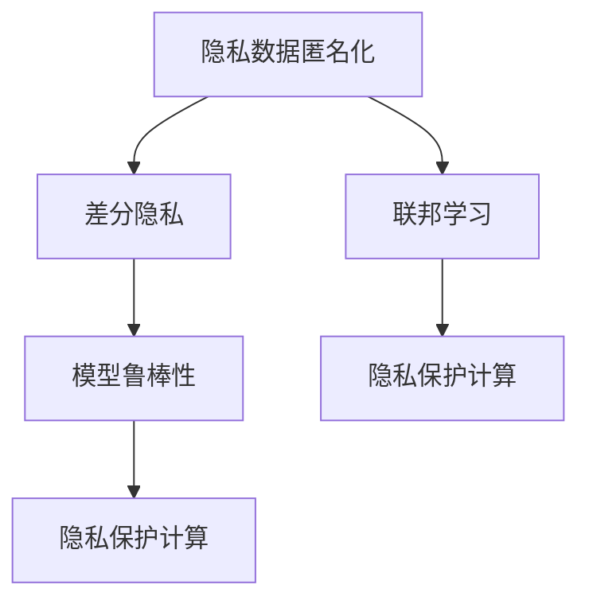

                 

# AI时代的用户隐私保护

## 1. 背景介绍

### 1.1 问题由来

随着人工智能（AI）技术的快速发展，数据驱动和模型训练成为推动AI创新的重要力量。然而，数据收集和模型训练过程中不可避免地涉及大量用户数据，引发了广泛的隐私保护和数据安全问题。尤其是在消费互联网、社交媒体、金融服务等领域，用户数据的隐私保护尤为重要。

隐私保护已成为AI领域的关键课题，各国立法机关纷纷出台相关法律法规，如欧盟的GDPR（通用数据保护条例）、中国的《网络安全法》等，对数据收集、存储和使用进行了严格的规定。数据隐私保护不仅涉及法律合规，还涉及技术实现、道德伦理等多个层面。

### 1.2 问题核心关键点

当前，隐私保护在AI技术中的应用主要体现在以下几个方面：

- **隐私数据匿名化**：在数据收集和使用过程中，确保数据匿名化，防止用户隐私泄露。
- **差分隐私**：在数据处理过程中加入噪声，使得数据统计结果无法直接关联到具体个人，从而保护隐私。
- **联邦学习**：在不共享用户数据的前提下，通过分布式训练方式，在多个本地模型间传递模型参数，实现模型更新。
- **模型鲁棒性**：通过对抗样本训练等方法，提升模型对噪声和攻击的鲁棒性，减少隐私数据泄露的风险。
- **隐私保护计算**：在硬件和软件层面，开发安全计算框架，确保数据处理过程的隐私性和安全性。

本文将从技术角度深入探讨这些隐私保护方法，并结合实际应用场景，介绍如何利用AI技术构建隐私保护的解决方案。

## 2. 核心概念与联系

### 2.1 核心概念概述

隐私保护是数据科学和人工智能的重要研究方向，涉及到数据处理、模型训练、安全计算等多个领域。

- **隐私数据匿名化**：通过数据脱敏、混淆等技术手段，使得原始数据中的个体信息难以识别，从而达到保护隐私的目的。
- **差分隐私**：在数据分析和模型训练中，通过加入噪声的方式，使得数据分析结果无法直接关联到具体个体，从而保护隐私。
- **联邦学习**：一种分布式机器学习技术，通过多节点协同训练，在不共享数据的前提下，实现模型参数的更新和共享。
- **模型鲁棒性**：提升模型对攻击和噪声的抵抗能力，确保模型输出不受恶意数据影响。
- **隐私保护计算**：在计算过程中，通过硬件和软件的协同设计，确保数据处理过程的隐私性和安全性。

这些概念之间的联系可以通过以下Mermaid流程图来展示：



这个流程图展示了几大隐私保护技术之间的逻辑关系：

1. 隐私数据匿名化是基础，通过混淆数据来保护隐私。
2. 差分隐私是在数据处理过程中加入噪声，进一步保护隐私。
3. 联邦学习通过分布式训练方式，在不共享数据的前提下，更新模型。
4. 模型鲁棒性提升模型的抗攻击能力。
5. 隐私保护计算在计算过程中保护数据隐私。

这些概念共同构成了AI时代隐私保护的框架，提供了多层次的隐私保护手段。

## 3. 核心算法原理 & 具体操作步骤
### 3.1 算法原理概述

隐私保护的核心目标是确保用户数据的安全性和隐私性，同时保障AI模型的性能和有效性。隐私保护算法主要通过以下方式实现：

- **数据脱敏**：通过对数据进行混淆、替换等操作，使得原始数据中的个体信息无法识别，从而保护隐私。
- **噪声注入**：在数据分析和模型训练过程中，引入随机噪声，使得数据分析结果无法直接关联到具体个体，保护隐私。
- **分布式训练**：通过联邦学习等技术，在多个本地节点上协同训练模型，实现模型参数的更新和共享，避免数据集中存储和共享。
- **模型鲁棒性**：通过对抗样本训练等方法，提升模型对噪声和攻击的抵抗能力，确保模型输出不受恶意数据影响。
- **安全计算**：在硬件和软件层面，采用加密计算、多方安全计算等技术，确保数据处理过程的隐私性和安全性。

### 3.2 算法步骤详解

以差分隐私为例，介绍差分隐私的算法步骤：

**Step 1: 定义隐私预算**
- 隐私预算（$\epsilon$）是差分隐私的核心参数，用于衡量隐私损失程度。较小的$\epsilon$意味着更强的隐私保护，但也可能导致数据有用性降低。

**Step 2: 加入噪声**
- 在数据处理过程中，通过引入Laplace噪声等随机噪声，使得数据处理结果难以直接关联到具体个体，从而保护隐私。

**Step 3: 输出处理结果**
- 将噪声处理后的数据作为模型输入，进行统计分析或模型训练。

**Step 4: 记录隐私损失**
- 记录隐私损失函数，用于评估隐私预算的使用情况。

差分隐私的数学公式为：

$$
\begin{aligned}
\Pr[|f(x) - f(x')| \leq \epsilon] &\geq 1 - \delta \\
|f(x) - f(x')| &\leq \epsilon
\end{aligned}
$$

其中，$f(x)$和$f(x')$表示数据处理前后的结果，$\epsilon$为隐私预算，$\delta$为隐私保护的概率。

### 3.3 算法优缺点

差分隐私具有以下优点：
1. 能够有效保护用户隐私，避免数据集中存储和共享。
2. 适用于多种数据分析和机器学习任务，具有较好的泛化能力。
3. 能够平衡隐私保护和数据有用性，通过调整隐私预算，可以在隐私保护和数据可用性之间取得平衡。

同时，差分隐私也存在一定的局限性：
1. 隐私预算的设定需要经验和专业知识，不当的预算设定可能导致隐私保护过度或不足。
2. 噪声注入可能导致数据分析结果的精度降低。
3. 差分隐私的计算复杂度较高，需要额外的计算资源。

### 3.4 算法应用领域

差分隐私广泛应用于金融、医疗、社交媒体等需要处理敏感数据的领域。以下是几个具体的应用场景：

- **金融风控**：在金融数据分析中，通过差分隐私保护用户隐私，同时保障模型的风险预测能力。
- **医疗数据保护**：在医疗数据共享和分析中，通过差分隐私保护病人隐私，同时保障数据的科学性和可用性。
- **社交媒体分析**：在社交媒体数据分析中，通过差分隐私保护用户隐私，同时保障数据分析的准确性和可靠性。

## 4. 数学模型和公式 & 详细讲解  
### 4.1 数学模型构建

差分隐私的数学模型构建包括以下步骤：

1. 定义隐私预算$\epsilon$和隐私保护概率$\delta$。
2. 引入随机噪声$\Delta$。
3. 计算隐私损失函数$\Delta(f(x))$。
4. 输出差分隐私保护结果$f(x)$。

### 4.2 公式推导过程

差分隐私的数学推导如下：

$$
\begin{aligned}
\Pr[|f(x) - f(x')| \leq \epsilon] &\geq 1 - \delta \\
|f(x) - f(x')| &\leq \epsilon
\end{aligned}
$$

其中，$f(x)$和$f(x')$表示数据处理前后的结果，$\epsilon$为隐私预算，$\delta$为隐私保护的概率。

通过引入Laplace噪声$\Delta$，差分隐私的保护机制可以描述为：

$$
\begin{aligned}
f(x) &= f(x') + \Delta \\
\Delta &\sim Laplace(0,\frac{\epsilon}{2})
\end{aligned}
$$

其中，$\Delta$服从Laplace分布，其参数为$\frac{\epsilon}{2}$。

### 4.3 案例分析与讲解

以金融风控为例，介绍差分隐私在实际应用中的案例：

**案例背景**：某银行需要分析客户的信用卡消费数据，以预测客户的违约风险。原始数据包含大量个人信息，如果直接公开，可能引发隐私泄露。

**数据处理**：在数据处理过程中，通过差分隐私技术加入随机噪声，保护客户隐私。

**模型训练**：在模型训练过程中，使用差分隐私保护的结果进行训练，保障模型的准确性和鲁棒性。

**结果评估**：通过评估模型的隐私损失和风险预测能力，确定隐私预算的使用情况。

## 5. 项目实践：代码实例和详细解释说明
### 5.1 开发环境搭建

在进行隐私保护开发前，我们需要准备好开发环境。以下是使用Python进行TensorFlow开发的开发环境配置流程：

1. 安装Anaconda：从官网下载并安装Anaconda，用于创建独立的Python环境。

2. 创建并激活虚拟环境：
```bash
conda create -n pytorch-env python=3.8 
conda activate pytorch-env
```

3. 安装TensorFlow：根据CUDA版本，从官网获取对应的安装命令。例如：
```bash
conda install tensorflow -c conda-forge
```

4. 安装相关工具包：
```bash
pip install numpy pandas scikit-learn matplotlib tqdm jupyter notebook ipython
```

完成上述步骤后，即可在`pytorch-env`环境中开始隐私保护实践。

### 5.2 源代码详细实现

下面是使用TensorFlow实现差分隐私保护代码的示例：

```python
import tensorflow as tf
import numpy as np

# 定义隐私预算和隐私保护概率
epsilon = 1.0
delta = 0.1

# 生成随机噪声
noise = tf.random.truncated_normal(shape=(data.shape[0]), mean=0.0, stddev=epsilon/2)

# 计算差分隐私保护结果
result = data + noise

# 输出结果
print(result)
```

### 5.3 代码解读与分析

让我们再详细解读一下关键代码的实现细节：

**定义隐私预算和隐私保护概率**：
- `epsilon`和`delta`分别代表隐私预算和隐私保护概率。

**生成随机噪声**：
- 使用`tf.random.truncated_normal`生成符合Laplace分布的随机噪声。

**计算差分隐私保护结果**：
- 将原始数据和随机噪声相加，得到差分隐私保护的结果。

**输出结果**：
- 输出差分隐私保护的结果，显示在屏幕上。

以上代码实现了差分隐私的基本功能，展示了如何使用TensorFlow实现差分隐私保护。在实际应用中，还需要根据具体任务的需求，进行进一步的优化和扩展。

## 6. 实际应用场景
### 6.1 金融风控

差分隐私在金融风控领域的应用非常广泛，金融机构需要在保障用户隐私的前提下，利用用户数据进行风险评估和模型训练。

**应用场景**：银行需要分析客户的信用评分数据，以预测客户的违约风险。原始数据包含大量个人信息，如果直接公开，可能引发隐私泄露。

**解决方案**：在数据处理过程中，通过差分隐私技术加入随机噪声，保护客户隐私。同时，使用差分隐私保护的结果进行模型训练，保障模型的准确性和鲁棒性。

**效果评估**：通过评估模型的隐私损失和风险预测能力，确定隐私预算的使用情况。

### 6.2 医疗数据保护

医疗数据保护是差分隐私的重要应用场景之一。医疗机构需要在保障病人隐私的前提下，利用病历数据进行疾病预测和医疗决策。

**应用场景**：医院需要分析患者的病历数据，以预测患者的病情发展和治疗效果。原始数据包含大量个人信息，如果直接公开，可能引发隐私泄露。

**解决方案**：在数据处理过程中，通过差分隐私技术加入随机噪声，保护病人隐私。同时，使用差分隐私保护的结果进行模型训练，保障模型的准确性和鲁棒性。

**效果评估**：通过评估模型的隐私损失和疾病预测能力，确定隐私预算的使用情况。

### 6.3 社交媒体分析

社交媒体数据分析是差分隐私的另一个重要应用场景。社交媒体平台需要在保障用户隐私的前提下，利用用户数据进行情感分析、趋势预测等任务。

**应用场景**：社交媒体平台需要分析用户的评论数据，以预测用户对某一话题的情感倾向。原始数据包含大量个人信息，如果直接公开，可能引发隐私泄露。

**解决方案**：在数据处理过程中，通过差分隐私技术加入随机噪声，保护用户隐私。同时，使用差分隐私保护的结果进行情感分析，保障分析的准确性和可靠性。

**效果评估**：通过评估模型的隐私损失和情感分析能力，确定隐私预算的使用情况。

## 7. 工具和资源推荐
### 7.1 学习资源推荐

为了帮助开发者系统掌握差分隐私的理论基础和实践技巧，这里推荐一些优质的学习资源：

1. **差分隐私维基百科**：详细介绍了差分隐私的概念、应用和数学模型。
2. **TensorFlow差分隐私教程**：由TensorFlow官方提供的差分隐私教程，介绍了差分隐私的基本原理和TensorFlow实现。
3. **差分隐私算法与实现**：介绍了差分隐私的数学原理和Python实现。
4. **差分隐私与隐私保护**：介绍了差分隐私的基本概念和应用场景。
5. **TensorFlow差分隐私**：介绍了差分隐私的TensorFlow实现和案例分析。

通过对这些资源的学习实践，相信你一定能够快速掌握差分隐私的精髓，并用于解决实际的隐私保护问题。

### 7.2 开发工具推荐

高效的开发离不开优秀的工具支持。以下是几款用于差分隐私开发的常用工具：

1. **TensorFlow**：基于Python的开源深度学习框架，灵活动态的计算图，适合快速迭代研究。
2. **PyTorch**：基于Python的开源深度学习框架，支持动态计算图，适合深度学习研究和实践。
3. **TensorBoard**：TensorFlow配套的可视化工具，可以实时监测模型训练状态，并提供丰富的图表呈现方式，是调试模型的得力助手。
4. **Weights & Biases**：模型训练的实验跟踪工具，可以记录和可视化模型训练过程中的各项指标，方便对比和调优。

合理利用这些工具，可以显著提升差分隐私任务的开发效率，加快创新迭代的步伐。

### 7.3 相关论文推荐

差分隐私的研究始于学术界，以下是几篇奠基性的相关论文，推荐阅读：

1. **Differential Privacy**：由差分隐私的提出者Cynthia Dwork等人撰写的论文，详细介绍了差分隐私的概念和数学模型。
2. **A Differentially Private Data Release Algorithm**：提出了基于噪声注入的差分隐私算法，是差分隐私的经典论文。
3. **The Privacy Auditing Toolbox**：介绍了差分隐私的审计工具，提供了差分隐私的实际应用案例。
4. **Differential Privacy for Beginners**：介绍了差分隐私的基本概念和应用场景，适合初学者入门。
5. **Practical Private Machine Learning in Federated Settings**：介绍了联邦学习中的差分隐私算法，提供了实际应用案例。

这些论文代表了大差分隐私的发展脉络。通过学习这些前沿成果，可以帮助研究者把握学科前进方向，激发更多的创新灵感。

## 8. 总结：未来发展趋势与挑战

### 8.1 总结

本文对差分隐私技术进行了全面系统的介绍。首先阐述了差分隐私的概念和应用背景，明确了差分隐私在数据保护中的重要作用。其次，从原理到实践，详细讲解了差分隐私的数学模型和操作步骤，给出了差分隐私任务开发的完整代码实例。同时，本文还广泛探讨了差分隐私技术在金融、医疗、社交媒体等多个领域的应用前景，展示了差分隐私的巨大潜力。此外，本文精选了差分隐私技术的各类学习资源，力求为读者提供全方位的技术指引。

通过本文的系统梳理，可以看到，差分隐私技术在AI时代隐私保护中的应用前景广阔，为数据驱动的AI系统提供了可靠的隐私保障手段。未来，伴随差分隐私技术的不断演进，相信AI系统在保护用户隐私的同时，将能够更加高效、智能地利用数据。

### 8.2 未来发展趋势

展望未来，差分隐私技术将呈现以下几个发展趋势：

1. **隐私保护技术的进一步发展**：差分隐私技术将继续发展，通过引入更先进的隐私保护算法，提高隐私保护的效果。
2. **差分隐私的应用场景将不断扩展**：差分隐私将在更多的领域得到应用，如物联网、云计算、智能家居等。
3. **差分隐私与其他隐私保护技术的融合**：差分隐私将与其他隐私保护技术（如匿名化、多方安全计算等）进行融合，形成更加全面的隐私保护方案。
4. **差分隐私技术的标准化**：差分隐私技术将被纳入更多的行业标准和规范，进一步推动其应用和普及。

以上趋势凸显了差分隐私技术的广阔前景。这些方向的探索发展，必将进一步提升AI系统的隐私保护能力，为构建安全、可靠、可控的智能系统铺平道路。

### 8.3 面临的挑战

尽管差分隐私技术已经取得了瞩目成就，但在迈向更加智能化、普适化应用的过程中，它仍面临诸多挑战：

1. **隐私预算的设定**：隐私预算的设定需要经验和专业知识，不当的预算设定可能导致隐私保护过度或不足。
2. **噪声注入对数据精度的影响**：噪声注入可能导致数据分析结果的精度降低，影响模型的准确性和可靠性。
3. **计算复杂度**：差分隐私的计算复杂度较高，需要额外的计算资源，增加了系统的实现成本。
4. **差分隐私的普及**：差分隐私技术的普及需要广泛的行业共识和技术推广，现有的技术和标准还不够完善。

### 8.4 未来突破

面对差分隐私技术所面临的挑战，未来的研究需要在以下几个方面寻求新的突破：

1. **隐私预算的自动化设定**：通过机器学习等技术，自动化设定隐私预算，减少人为干预。
2. **高效噪声注入技术**：开发更加高效的噪声注入方法，减小噪声对数据分析结果的影响。
3. **差分隐私的轻量化实现**：优化差分隐私算法的计算复杂度，降低系统的实现成本。
4. **差分隐私的行业标准化**：推动差分隐私技术的行业标准化和规范化，推动其在更多行业领域的应用。

这些研究方向的探索，必将引领差分隐私技术迈向更高的台阶，为构建安全、可靠、可控的智能系统提供有力的技术保障。面向未来，差分隐私技术还需要与其他隐私保护技术进行更深入的融合，多路径协同发力，共同推动自然语言理解和智能交互系统的进步。只有勇于创新、敢于突破，才能不断拓展隐私保护技术的边界，让智能技术更好地造福人类社会。

## 9. 附录：常见问题与解答

**Q1：差分隐私如何平衡隐私保护和数据有用性？**

A: 差分隐私通过引入噪声保护隐私，同时使用隐私预算来控制隐私损失。隐私预算的设定需要经验和专业知识，可以在隐私保护和数据有用性之间取得平衡。通过调整隐私预算，可以在隐私保护和数据可用性之间取得平衡。

**Q2：差分隐私是否适用于所有数据分析任务？**

A: 差分隐私适用于大多数数据分析和机器学习任务，但需要根据具体任务的特点进行调整。例如，对于需要高精度的数据分析任务，差分隐私可能需要更多的隐私预算，以降低噪声的影响。

**Q3：差分隐私的计算复杂度较高，如何优化？**

A: 差分隐私的计算复杂度较高，可以通过优化算法和引入硬件加速来降低计算复杂度。例如，使用GPU加速差分隐私计算，或使用低精度计算方法来降低内存和计算开销。

**Q4：差分隐私如何应用于联邦学习？**

A: 差分隐私可以通过加入噪声的方式，使得模型参数在联邦学习过程中难以被反向传播，从而保护用户隐私。在联邦学习中，每个参与方只传输模型参数的梯度，而不是原始数据，确保数据的隐私性和安全性。

**Q5：差分隐私与数据脱敏的区别是什么？**

A: 差分隐私和数据脱敏都是隐私保护技术，但它们的目标和实现方式不同。数据脱敏通过混淆数据，使得原始数据中的个体信息无法识别，保护隐私。差分隐私通过加入噪声，使得数据分析结果无法直接关联到具体个体，保护隐私。

---

作者：禅与计算机程序设计艺术 / Zen and the Art of Computer Programming

