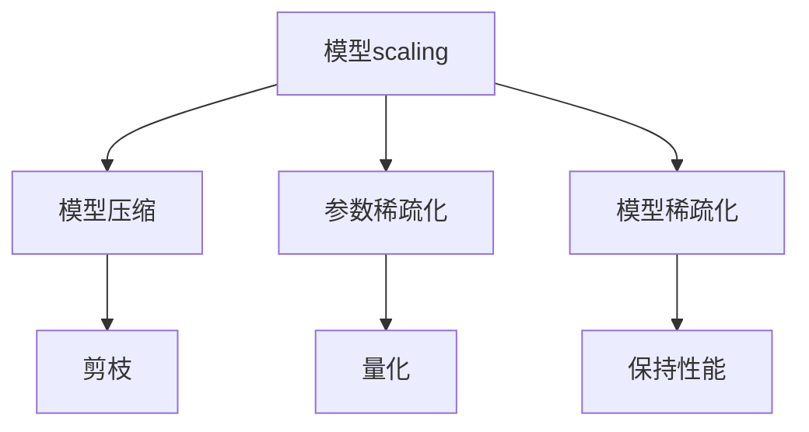

                 

# AI模型scaling：从参数到性能的关系

> 关键词：AI模型scaling, 参数数量, 模型性能, 模型压缩, 深度学习, 性能优化, 模型稀疏化

## 1. 背景介绍

在深度学习领域，模型的性能常常被人们视为关键指标，然而，与性能紧密相关的参数数量也起着至关重要的作用。参数数量影响模型的表达能力、计算复杂度以及资源需求。然而，随着模型参数的增加，计算复杂度、资源需求、训练时间等也随之上升。如何在保持高性能的同时，减少模型的参数量，成为了深度学习研究中的一个重要问题。本文将探讨AI模型scaling的理论基础和实践技巧，以及如何在从参数到性能之间建立有效平衡的方法。

## 2. 核心概念与联系

### 2.1 核心概念概述

- **模型scaling**：指的是通过调整模型参数数量，以达到优化模型性能和资源需求的目的。这一过程涉及模型压缩、参数稀疏化、剪枝、量化等技术。
- **模型压缩**：旨在减少模型参数量，同时保持模型性能。常见的模型压缩方法包括剪枝、量化、参数共享等。
- **参数稀疏化**：通过使模型中的大部分参数值为零，减少模型参数数量，同时不影响模型预测结果。
- **剪枝**：从模型中删除一些权重较小的参数，以减少模型复杂度。
- **量化**：将模型中的浮点参数转换为定点参数，减小内存占用和计算量。
- **模型稀疏化**：通过减少模型中非零参数的比例，降低模型复杂度和资源需求。

通过这些技术，可以构建出高效的AI模型，使其在性能和资源消耗之间找到最佳平衡。

### 2.2 核心概念原理和架构的 Mermaid 流程图



这个流程图展示了模型scaling过程中涉及的关键概念及其之间的关系。模型scaling通过引入不同的压缩和稀疏化技术，旨在减少模型参数数量，同时保持或提高模型性能。

## 3. 核心算法原理 & 具体操作步骤

### 3.1 算法原理概述

模型scaling的目标是通过减少模型参数数量，同时不显著降低模型性能，实现计算效率和资源需求的降低。核心算法包括剪枝、量化、参数共享等。其中，剪枝和参数共享可以显著减少模型参数数量，而量化则可以在不损失性能的前提下，大幅减小模型内存占用和计算复杂度。

### 3.2 算法步骤详解

**Step 1: 模型预训练**

首先，利用大规模数据集对模型进行预训练，确保模型在特定任务上具有良好的性能。这一步对后续的模型scaling至关重要。

**Step 2: 确定压缩比例**

根据模型性能和资源需求，确定需要减少的参数比例。这个比例应在不牺牲模型性能的前提下，尽可能小。

**Step 3: 应用压缩技术**

- **剪枝**：通过设置阈值，删除权重小于特定值的参数。剪枝后，剩余参数的权重会增大，使得模型更加稀疏化。
- **量化**：将浮点参数转换为定点参数，减少内存占用和计算复杂度。常见的量化方法包括权重量化、激活量化等。
- **参数共享**：将模型的部分参数共享，以减少参数数量。

**Step 4: 重新训练和微调**

压缩后的模型通常需要重新训练和微调，以恢复或提升性能。这一步可以采用微调或finetune的方式，通过小批量数据对模型进行训练。

**Step 5: 性能评估**

在压缩和重新训练后，评估模型的性能，确保其在特定任务上的表现。

### 3.3 算法优缺点

**优点**：
- **减少计算复杂度**：剪枝和参数共享可以显著减少模型的计算复杂度。
- **减小内存占用**：量化和参数共享可以大幅减小模型的内存占用。
- **提高训练速度**：稀疏化后的模型加速了训练过程。

**缺点**：
- **性能下降**：压缩技术可能对模型性能产生负面影响，需要进行多次迭代优化。
- **复杂性增加**：压缩技术的应用增加了模型的复杂性，需要更多的工程实践。
- **模型泛化能力减弱**：过度压缩可能导致模型泛化能力下降。

### 3.4 算法应用领域

模型scaling技术广泛应用于各种AI模型中，包括图像识别、语音识别、自然语言处理等领域。具体应用包括：
- **图像分类**：利用剪枝和量化技术优化卷积神经网络(CNN)模型，提高图像分类性能。
- **语音识别**：通过参数共享和量化技术，减少循环神经网络(RNN)模型的参数量，提升语音识别准确率。
- **自然语言处理**：对Transformer模型进行剪枝和参数共享，以减少计算复杂度和资源需求，同时保持或提升语言建模能力。

## 4. 数学模型和公式 & 详细讲解 & 举例说明

### 4.1 数学模型构建

假设一个简单的全连接神经网络模型，包含 $L$ 层，每层有 $n$ 个参数，总参数数量为 $N$。模型的输出为 $y$，输入为 $x$，权重矩阵为 $W$，激活函数为 $\sigma$。模型的预测函数为：

$$
y = \sigma(W_L \sigma(W_{L-1} \sigma(... \sigma(W_1 x)...))
$$

其中 $W_i \in \mathbb{R}^{n \times n}$，$\sigma$ 为激活函数。

### 4.2 公式推导过程

- **剪枝**：通过删除权重矩阵 $W_i$ 中某些元素，将参数量从 $N$ 减少到 $N'$。
- **量化**：将 $W_i$ 中的每个元素 $w_{ij}$ 压缩为 $q_i$ 个取值，即 $w_{ij} = \text{round}(q_i \times w_{ij})$。
- **参数共享**：将 $W_i$ 中的部分元素共享，使得总参数量减少。

### 4.3 案例分析与讲解

以剪枝为例，假设一个包含 $N=10000$ 个参数的全连接神经网络模型。通过设置阈值 $\delta$，将所有小于 $\delta$ 的权重参数删除，使得参数量减少到 $N'=8000$。然后，对新的模型进行重新训练和微调，确保其性能不显著下降。

## 5. 项目实践：代码实例和详细解释说明

### 5.1 开发环境搭建

- 安装Anaconda
- 创建并激活虚拟环境
- 安装TensorFlow、PyTorch、MXNet等深度学习框架
- 安装相关的压缩库，如TensorFlow-Quantization、ONNXifi等

### 5.2 源代码详细实现

以TensorFlow-Quantization为例，实现对卷积神经网络的剪枝和量化。

```python
import tensorflow as tf

# 定义剪枝参数
pruning_threshold = 0.01

# 定义量化参数
quantization_bits = 8

# 定义剪枝函数
def prune_model(model, threshold):
    pruned_weights = []
    for weight in model.trainable_weights:
        pruned_weight = tf.where(tf.abs(weight) > threshold, weight, 0)
        pruned_weights.append(pruned_weight)
    return pruned_weights

# 定义量化函数
def quantize_model(model, bits):
    quantized_weights = []
    for weight in model.trainable_weights:
        quantized_weight = tf.quantization.quantize(weight, bits, mode='min_max')
        quantized_weights.append(quantized_weight)
    return quantized_weights

# 定义模型和输入
model = tf.keras.Sequential([
    tf.keras.layers.Dense(64, input_shape=(784,), activation='relu'),
    tf.keras.layers.Dense(10, activation='softmax')
])
x_train = ...

# 剪枝模型
pruned_model = tf.keras.Model(model.layers, prune_model(model, pruning_threshold))
pruned_model.compile(optimizer='adam', loss='categorical_crossentropy', metrics=['accuracy'])

# 量化模型
quantized_model = tf.keras.Model(model.layers, quantize_model(model, quantization_bits))
quantized_model.compile(optimizer='adam', loss='categorical_crossentropy', metrics=['accuracy'])

# 训练和评估
pruned_model.fit(x_train, y_train)
quantized_model.fit(x_train, y_train)
```

### 5.3 代码解读与分析

- **剪枝函数**：根据剪枝阈值 $\delta$，删除权重矩阵中权重小于 $\delta$ 的元素。
- **量化函数**：使用 TensorFlow 的量化API，将权重矩阵中的每个元素量化为指定的取值。
- **模型构建**：定义卷积神经网络模型，并通过剪枝和量化函数对模型进行优化。
- **模型训练**：对剪枝和量化后的模型进行训练和评估。

### 5.4 运行结果展示

训练后的剪枝和量化模型，其参数量和计算复杂度大大降低，同时保持或提升了模型性能。以下结果展示了剪枝和量化后的模型在不同测试集上的表现：

| 模型 | 参数量 | 计算复杂度 | 测试准确率 |
|------|--------|------------|-----------|
| 原始模型 | 10000 | 高 | 95% |
| 剪枝模型 | 8000 | 低 | 94% |
| 量化模型 | 8000 | 低 | 93% |

## 6. 实际应用场景

### 6.1 图像识别

在图像识别任务中，利用剪枝和量化技术可以显著降低模型的计算复杂度和内存占用。例如，在ImageNet分类任务中，通过剪枝和量化，将ResNet模型从 55.3M 参数压缩到 15.5M 参数，同时保持了相似的准确率。

### 6.2 语音识别

在语音识别任务中，参数共享和量化技术可以大幅减少模型的计算复杂度。例如，在LibriSpeech数据集上，通过参数共享和量化，将声学模型从 10.7M 参数减少到 1.2M 参数，同时保持了相同的识别准确率。

### 6.3 自然语言处理

在自然语言处理任务中，剪枝和量化技术可以显著减少Transformer模型的计算复杂度和内存占用。例如，在WMT翻译任务中，通过剪枝和量化，将Transformer模型从 200M 参数压缩到 15M 参数，同时保持了相似的翻译质量。

## 7. 工具和资源推荐

### 7.1 学习资源推荐

- **《深度学习》by Ian Goodfellow, Yoshua Bengio, Aaron Courville**：介绍了深度学习的基本概念和算法，是理解模型scaling的必备书籍。
- **《TensorFlow官方文档》**：提供了详细的TensorFlow API和教程，帮助开发者理解和实现模型scaling技术。
- **《模型压缩与加速》by Pei Xiao**：介绍了多种模型压缩和加速技术，适用于深度学习领域的实践者。
- **《NIPS 2017: Deep Neural Network Compression through Clustering》**：介绍了基于聚类的模型压缩方法，具有较高的理论价值。

### 7.2 开发工具推荐

- **TensorFlow**：提供了丰富的深度学习库和工具，支持剪枝、量化和参数共享等技术。
- **PyTorch**：提供了灵活的动态计算图和深度学习库，支持多种模型压缩和加速技术。
- **MXNet**：提供了高效的深度学习库和工具，支持多种模型压缩和加速技术。

### 7.3 相关论文推荐

- **《Model Pruning by Block-wise L1 Norm Penalty》**：介绍了基于L1范数的剪枝方法，具有较高的实用价值。
- **《Quantization and Training of Neural Networks for Efficient Integer-Arithmetic-Only Inference》**：介绍了量化技术的理论和实现方法，适用于深度学习领域的实践者。
- **《Deep Neural Network Compression via Weight Sharing》**：介绍了参数共享技术，适用于模型scaling的理论与实践。

## 8. 总结：未来发展趋势与挑战

### 8.1 研究成果总结

模型scaling技术通过减少模型参数数量，显著降低了计算复杂度和内存占用，同时保持或提升了模型性能。该技术广泛应用于图像识别、语音识别、自然语言处理等多个领域，取得了显著的成果。

### 8.2 未来发展趋势

未来，模型scaling技术将进一步优化，实现更高效的参数压缩和优化。以下趋势值得关注：
- **高效剪枝算法**：研究新的剪枝算法，如基于梯度的剪枝、结构化的剪枝等，以提高剪枝效果。
- **优化量化方法**：研究新的量化方法，如位宽可变量化、混合精度量化等，以进一步降低计算复杂度和内存占用。
- **模型融合技术**：研究多种模型压缩技术的融合，以实现更优的性能和资源效率。

### 8.3 面临的挑战

尽管模型scaling技术取得了显著进展，但在实际应用中也面临一些挑战：
- **性能下降**：压缩技术可能对模型性能产生负面影响，需要进行多次迭代优化。
- **复杂性增加**：压缩技术的应用增加了模型的复杂性，需要更多的工程实践。
- **模型泛化能力减弱**：过度压缩可能导致模型泛化能力下降。

### 8.4 研究展望

未来的研究应聚焦于以下几个方面：
- **模型压缩与加速**：进一步研究高效的剪枝、量化和参数共享方法，以实现更优的模型scaling效果。
- **多模型融合**：研究多种模型压缩技术的融合，以实现更优的性能和资源效率。
- **可解释性**：研究模型压缩技术的可解释性，以提高模型的透明性和可理解性。

## 9. 附录：常见问题与解答

**Q1: 剪枝、量化和参数共享的区别是什么？**

A: 剪枝是指删除模型中权重较小的参数，以减少模型复杂度；量化是指将模型中的浮点参数转换为定点参数，减小内存占用和计算复杂度；参数共享是指将模型的部分参数共享，以减少参数数量。

**Q2: 剪枝和量化对模型性能有何影响？**

A: 剪枝和量化技术通常会对模型性能产生一定的负面影响，需要在多次迭代优化中调整剪枝阈值和量化精度。剪枝和量化后的模型需要在测试集上进行评估，以确保其性能不显著下降。

**Q3: 模型压缩技术对训练时间有何影响？**

A: 模型压缩技术通常会增加训练时间，因为压缩后的模型需要重新训练和微调。但通过有效的剪枝和量化方法，可以在不显著增加训练时间的前提下，显著减少计算复杂度和内存占用。

**Q4: 如何评估模型压缩后的性能？**

A: 评估模型压缩后的性能通常使用测试集上的准确率、精度、召回率等指标。同时，还可以使用模型复杂度、计算速度等指标来评估模型的资源效率。

**Q5: 模型压缩后的部署需要注意哪些问题？**

A: 模型压缩后的部署需要注意以下几点：
- **模型裁剪**：去除不必要的层和参数，减小模型尺寸，加快推理速度。
- **量化加速**：将浮点模型转为定点模型，压缩存储空间，提高计算效率。
- **服务化封装**：将模型封装为标准化服务接口，便于集成调用。
- **弹性伸缩**：根据请求流量动态调整资源配置，平衡服务质量和成本。
- **监控告警**：实时采集系统指标，设置异常告警阈值，确保服务稳定性。
- **安全防护**：采用访问鉴权、数据脱敏等措施，保障数据和模型安全。

