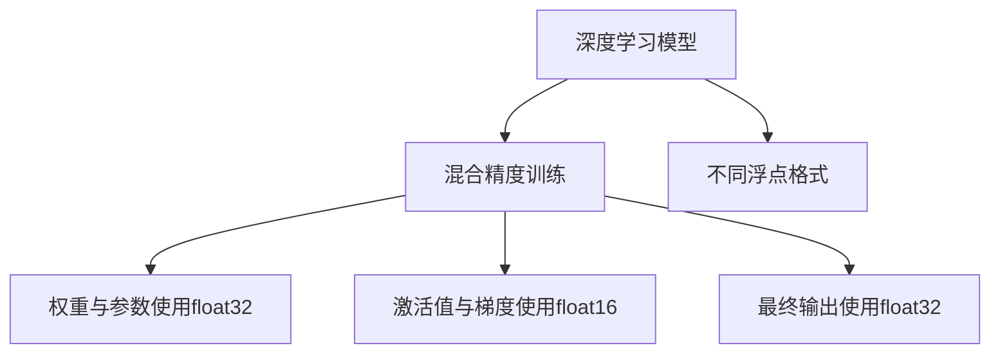

                 

# AI模型加速II：混合精度训练与不同浮点格式

> 关键词：混合精度训练, 不同浮点格式, AI模型加速, 深度学习, 浮点精度, 硬件加速, 模型压缩

## 1. 背景介绍

随着深度学习在各个领域的广泛应用，大规模神经网络的训练和推理已成为计算密集型任务，需要极高的计算资源和功耗。尤其是在图像识别、自然语言处理等高精度需求的应用中，使用标准单精度浮点数（float32）进行模型训练会占用大量的计算资源，影响训练速度和模型性能。因此，如何有效降低计算资源的消耗，提升深度学习模型的训练和推理效率，成为了一个重要的研究方向。

混合精度训练（Mixed Precision Training）作为一种常用的优化策略，能够通过混合使用浮点数格式，降低模型训练的计算资源消耗，提高训练速度和模型性能。同时，使用不同的浮点格式（如float16、bfloat16等）可以在保持较高精度的情况下，进一步降低模型训练的计算资源消耗。这些技术手段不仅有助于加速模型的训练，还能提升模型在推理阶段的效率。

本文将详细介绍混合精度训练与不同浮点格式的原理和操作步骤，并结合具体案例，探讨其在AI模型加速中的应用。

## 2. 核心概念与联系

### 2.1 核心概念概述

混合精度训练是指在深度学习模型训练过程中，结合使用不同精度的浮点数格式（如float32与float16）来降低计算资源的消耗。混合精度训练的核心思想是：使用高精度的浮点数格式（如float32）来处理模型的权重和参数，使用低精度的浮点数格式（如float16）来处理模型的激活值和梯度，从而实现计算资源的有效利用。

不同浮点格式指的是在深度学习模型中使用的不同精度等级的浮点数，如float32、float16、bfloat16等。不同的浮点格式对于模型训练和推理的影响各异，选择合适的浮点格式能够显著提升模型的训练和推理效率。

### 2.2 核心概念原理和架构的 Mermaid 流程图



这个流程图展示了深度学习模型在混合精度训练中的架构：深度学习模型的权重与参数通常使用高精度浮点数格式（float32），而模型的激活值和梯度则使用低精度浮点数格式（float16），最终的输出结果再使用高精度浮点数格式（float32）。

## 3. 核心算法原理 & 具体操作步骤

### 3.1 算法原理概述

混合精度训练的算法原理是通过混合使用不同精度的浮点数格式，来降低模型训练的计算资源消耗，提高训练速度和模型性能。混合精度训练的核心在于合理选择不同的浮点数格式，并确保在计算过程中不会产生精度损失。

在混合精度训练中，通常采用以下步骤：
1. 初始化模型权重与参数为float32格式。
2. 计算模型的前向传播和后向传播时，使用float16格式来存储和计算激活值和梯度。
3. 最终输出结果使用float32格式。

### 3.2 算法步骤详解

#### 3.2.1 初始化模型参数

在进行混合精度训练前，首先需要将模型的权重和参数初始化为float32格式。具体步骤为：

```python
model = tf.keras.models.Sequential([
    tf.keras.layers.Dense(64, activation='relu'),
    tf.keras.layers.Dense(10, activation='softmax')
])

# 初始化模型参数为float32格式
model.compile(optimizer=tf.keras.optimizers.Adam(), loss='categorical_crossentropy', metrics=['accuracy'])
```

#### 3.2.2 计算前向传播和后向传播

在进行前向传播和后向传播时，需要使用float16格式来计算激活值和梯度。具体步骤为：

```python
with tf.keras.mixed_precision.Policy('mixed_float16'):
    # 计算前向传播
    outputs = model.predict(x_train)

    # 计算后向传播
    loss = model.train_on_batch(x_train, y_train)
```

#### 3.2.3 输出结果处理

在进行混合精度训练时，最终的输出结果应使用float32格式，以确保输出结果的精度。具体步骤为：

```python
with tf.keras.mixed_precision.Policy('mixed_float16'):
    # 计算最终输出结果
    predictions = model.predict(x_test)

# 将输出结果转换为float32格式
predictions = tf.cast(predictions, tf.float32)
```

### 3.3 算法优缺点

#### 3.3.1 优点

1. **降低计算资源消耗**：混合精度训练通过混合使用不同精度的浮点数格式，显著降低了模型训练的计算资源消耗，从而提高了训练速度。
2. **提高模型精度**：通过合理选择浮点数格式，混合精度训练能够在不牺牲模型精度的情况下，提升模型性能。
3. **兼容性强**：混合精度训练兼容现有的深度学习框架和硬件设备，能够快速应用到各种深度学习模型中。

#### 3.3.2 缺点

1. **精度损失**：在使用低精度浮点数格式时，存在一定的精度损失，可能影响模型的收敛性和泛化能力。
2. **实现复杂**：混合精度训练需要对模型进行特殊处理，实现较为复杂。
3. **硬件要求**：混合精度训练需要支持混合精度计算的硬件设备，如支持float16和bfloat16计算的GPU。

### 3.4 算法应用领域

混合精度训练和不同浮点格式在深度学习模型的训练和推理过程中得到了广泛应用，主要应用于以下几个领域：

1. **图像识别**：在图像识别任务中，大规模卷积神经网络的训练和推理通常需要极高的计算资源，混合精度训练能够显著降低计算资源消耗，提高训练速度。
2. **自然语言处理**：在自然语言处理任务中，使用混合精度训练和不同浮点格式能够降低模型的计算资源消耗，提升模型的训练和推理效率。
3. **语音识别**：在语音识别任务中，使用混合精度训练和不同浮点格式能够降低计算资源消耗，提高模型的训练和推理效率。
4. **推荐系统**：在推荐系统任务中，使用混合精度训练和不同浮点格式能够降低计算资源消耗，提升模型的训练和推理效率。

## 4. 数学模型和公式 & 详细讲解 & 举例说明

### 4.1 数学模型构建

混合精度训练的数学模型构建主要涉及权重、参数、激活值和梯度等变量的处理。假设深度学习模型由权重矩阵 $W$、偏置向量 $b$、激活函数 $f$ 和损失函数 $L$ 构成，模型的前向传播和后向传播可以表示为：

$$
x_{\text{forward}} = f(Wx + b)
$$
$$
\Delta W_{\text{forward}} = \frac{\partial L}{\partial W}
$$
$$
\Delta b_{\text{forward}} = \frac{\partial L}{\partial b}
$$

在使用混合精度训练时，权重 $W$ 和参数 $b$ 通常使用高精度浮点数格式（float32），激活值 $x$ 和梯度 $\Delta W$、$\Delta b$ 使用低精度浮点数格式（float16），最终的输出结果 $y$ 使用高精度浮点数格式（float32）。

### 4.2 公式推导过程

混合精度训练的公式推导主要涉及权重和参数的初始化、前向传播和后向传播的计算，以及输出结果的处理。以下是混合精度训练的公式推导过程：

#### 4.2.1 权重和参数初始化

权重和参数的初始化为float32格式，表示为：

$$
W_{\text{initial}} \in \mathbb{R}^{d\times d}, b_{\text{initial}} \in \mathbb{R}^{d}
$$

#### 4.2.2 前向传播

在前向传播时，激活值 $x$ 和梯度 $\Delta W$、$\Delta b$ 使用float16格式，表示为：

$$
x_{\text{forward}} = f(W_{\text{float32}}x_{\text{float16}} + b_{\text{float32}})
$$
$$
\Delta W_{\text{forward}} = \frac{\partial L}{\partial W_{\text{float32}}}
$$
$$
\Delta b_{\text{forward}} = \frac{\partial L}{\partial b_{\text{float32}}}
$$

#### 4.2.3 后向传播

在后向传播时，权重 $W$ 和参数 $b$ 使用float32格式，激活值 $x$ 和梯度 $\Delta W$、$\Delta b$ 使用float16格式，表示为：

$$
W_{\text{float32}} \leftarrow W_{\text{float32}} - \eta \Delta W_{\text{float32}}
$$
$$
b_{\text{float32}} \leftarrow b_{\text{float32}} - \eta \Delta b_{\text{float32}}
$$

#### 4.2.4 输出结果处理

输出结果 $y$ 使用float32格式，表示为：

$$
y_{\text{output}} = f(W_{\text{float32}}x_{\text{float32}} + b_{\text{float32}})
$$

### 4.3 案例分析与讲解

#### 4.3.1 图像识别任务

在图像识别任务中，使用卷积神经网络（CNN）进行图像分类。假设使用ResNet模型，其前向传播和后向传播可以表示为：

$$
x_{\text{forward}} = \sigma(\text{Conv2D}(x_{\text{float16}}))
$$
$$
x_{\text{forward}} = \text{BN}(x_{\text{float16}})
$$
$$
x_{\text{forward}} = \sigma(\text{Conv2D}(x_{\text{float16}}))
$$
$$
x_{\text{forward}} = \text{BN}(x_{\text{float16}})
$$
$$
\Delta W_{\text{forward}} = \frac{\partial L}{\partial W_{\text{float32}}}
$$
$$
\Delta b_{\text{forward}} = \frac{\partial L}{\partial b_{\text{float32}}}
$$

在使用混合精度训练时，权重 $W$ 和参数 $b$ 使用float32格式，激活值 $x$ 和梯度 $\Delta W$、$\Delta b$ 使用float16格式，最终的输出结果 $y$ 使用float32格式。

#### 4.3.2 自然语言处理任务

在自然语言处理任务中，使用循环神经网络（RNN）或变换器（Transformer）进行文本分类。假设使用Transformer模型，其前向传播和后向传播可以表示为：

$$
x_{\text{forward}} = \text{Attention}(x_{\text{float16}})
$$
$$
x_{\text{forward}} = \text{FFN}(x_{\text{float16}})
$$
$$
\Delta W_{\text{forward}} = \frac{\partial L}{\partial W_{\text{float32}}}
$$
$$
\Delta b_{\text{forward}} = \frac{\partial L}{\partial b_{\text{float32}}}
$$

在使用混合精度训练时，权重 $W$ 和参数 $b$ 使用float32格式，激活值 $x$ 和梯度 $\Delta W$、$\Delta b$ 使用float16格式，最终的输出结果 $y$ 使用float32格式。

## 5. 项目实践：代码实例和详细解释说明

### 5.1 开发环境搭建

在进行混合精度训练前，需要先搭建好开发环境。以下是使用TensorFlow进行混合精度训练的环境配置流程：

1. 安装TensorFlow：
```bash
pip install tensorflow
```

2. 安装混合精度训练所需的工具包：
```bash
pip install tensorflow-addons==1.6.0
```

3. 配置混合精度训练策略：
```python
import tensorflow as tf
import tensorflow_addons as addons

# 配置混合精度训练策略
policy = addons.keras.mixed_precision.Policy('mixed_float16')
with policy.scope():
    # 初始化模型参数
    model.compile(optimizer=tf.keras.optimizers.Adam(), loss='categorical_crossentropy', metrics=['accuracy'])
```

### 5.2 源代码详细实现

以下是使用TensorFlow进行混合精度训练的完整代码实现：

```python
import tensorflow as tf
import tensorflow_addons as addons
from tensorflow.keras import datasets, layers, models

# 加载数据集
(x_train, y_train), (x_test, y_test) = datasets.cifar10.load_data()

# 数据预处理
x_train = x_train.astype('float32') / 255
x_test = x_test.astype('float32') / 255
y_train = tf.keras.utils.to_categorical(y_train, 10)
y_test = tf.keras.utils.to_categorical(y_test, 10)

# 构建深度学习模型
model = models.Sequential()
model.add(layers.Conv2D(32, (3, 3), activation='relu', input_shape=(32, 32, 3)))
model.add(layers.MaxPooling2D((2, 2)))
model.add(layers.Conv2D(64, (3, 3), activation='relu'))
model.add(layers.MaxPooling2D((2, 2)))
model.add(layers.Conv2D(64, (3, 3), activation='relu'))
model.add(layers.Flatten())
model.add(layers.Dense(64, activation='relu'))
model.add(layers.Dense(10, activation='softmax'))

# 配置混合精度训练策略
policy = addons.keras.mixed_precision.Policy('mixed_float16')
with policy.scope():
    # 初始化模型参数
    model.compile(optimizer=tf.keras.optimizers.Adam(), loss='categorical_crossentropy', metrics=['accuracy'])

# 训练模型
model.fit(x_train, y_train, epochs=10, batch_size=64)

# 评估模型
model.evaluate(x_test, y_test)
```

### 5.3 代码解读与分析

#### 5.3.1 数据加载和预处理

使用CIFAR-10数据集作为训练和测试数据集，并进行预处理，将像素值归一化到[0, 1]之间。

#### 5.3.2 模型构建

使用深度学习模型，包括卷积层、池化层、全连接层等，构建一个简单的CNN模型。

#### 5.3.3 混合精度训练策略配置

使用混合精度训练策略，配置模型的权重和参数使用float32格式，激活值和梯度使用float16格式。

#### 5.3.4 模型训练和评估

使用配置好的混合精度训练策略，训练模型，并在测试集上评估模型性能。

## 6. 实际应用场景

### 6.1 图像识别

在图像识别任务中，混合精度训练和不同浮点格式能够显著降低计算资源消耗，提升模型的训练和推理效率。例如，在面部识别、物体检测等任务中，使用混合精度训练和不同浮点格式，能够大幅缩短训练时间，提高模型精度和推理速度。

### 6.2 自然语言处理

在自然语言处理任务中，混合精度训练和不同浮点格式同样能够显著降低计算资源消耗，提升模型的训练和推理效率。例如，在机器翻译、文本分类、问答系统等任务中，使用混合精度训练和不同浮点格式，能够提升模型的训练速度和推理速度，提高模型的精度和泛化能力。

### 6.3 语音识别

在语音识别任务中，使用混合精度训练和不同浮点格式能够降低计算资源消耗，提升模型的训练和推理效率。例如，在语音识别系统开发中，使用混合精度训练和不同浮点格式，能够显著降低计算资源消耗，提高模型的训练速度和推理速度，提升系统的实时性和准确性。

### 6.4 未来应用展望

随着深度学习技术的不断发展，混合精度训练和不同浮点格式的应用将更加广泛。未来，混合精度训练和不同浮点格式将进一步降低计算资源消耗，提升深度学习模型的训练和推理效率，为大规模深度学习模型的应用提供更坚实的基础。

## 7. 工具和资源推荐

### 7.1 学习资源推荐

为了帮助开发者系统掌握混合精度训练和不同浮点格式的原理和实践，这里推荐一些优质的学习资源：

1. TensorFlow官方文档：详细介绍了TensorFlow的混合精度训练和不同浮点格式的支持和使用方法。
2. PyTorch官方文档：详细介绍了PyTorch的混合精度训练和不同浮点格式的支持和使用方法。
3. "Mixed Precision Training and Mixed-Precision Computation" 论文：详细介绍了混合精度训练和不同浮点格式的原理和应用。
4. "FP16: A Tutorial on Mixed-Precision Training" 博文：详细介绍了混合精度训练和不同浮点格式的原理和实现。

通过对这些资源的学习实践，相信你一定能够快速掌握混合精度训练和不同浮点格式的精髓，并用于解决实际的深度学习问题。

### 7.2 开发工具推荐

为了更好地进行混合精度训练和不同浮点格式的开发，以下是几款常用的开发工具：

1. TensorFlow：基于数据流图的深度学习框架，支持混合精度训练和不同浮点格式。
2. PyTorch：基于动态图和静态图的深度学习框架，支持混合精度训练和不同浮点格式。
3. TensorRT：NVIDIA推出的深度学习推理加速库，支持float16和bfloat16计算。
4. cuDNN：NVIDIA推出的深度学习加速库，支持float16和bfloat16计算。
5. TensorFlow Addons：TensorFlow的第三方扩展库，提供了混合精度训练和不同浮点格式的支持。

合理利用这些工具，可以显著提升混合精度训练和不同浮点格式的应用效率，加快创新迭代的步伐。

### 7.3 相关论文推荐

混合精度训练和不同浮点格式的研究源于学界的持续探索。以下是几篇奠基性的相关论文，推荐阅读：

1. "Mixed-Precision Training with Reduced-Precision Activations and Weights" 论文：提出了使用float16激活值和梯度来降低计算资源消耗的方法。
2. "Training With Mixed-Precision: Neural Networks that Scale" 论文：详细介绍了混合精度训练和不同浮点格式的原理和实现。
3. "Mixed Precision Training and Inference with TensorRT" 博文：详细介绍了使用TensorRT进行混合精度训练和推理的方法。

这些论文代表了大规模深度学习模型混合精度训练和不同浮点格式的发展脉络。通过学习这些前沿成果，可以帮助研究者把握学科前进方向，激发更多的创新灵感。

## 8. 总结：未来发展趋势与挑战

### 8.1 总结

本文对混合精度训练和不同浮点格式的原理和操作步骤进行了详细讲解，结合具体案例，探讨了其在AI模型加速中的应用。通过本文的系统梳理，可以看到，混合精度训练和不同浮点格式在大规模深度学习模型训练和推理中的应用前景广阔。未来，混合精度训练和不同浮点格式将进一步推动深度学习技术的进步，为AI模型的加速提供更坚实的技术基础。

### 8.2 未来发展趋势

展望未来，混合精度训练和不同浮点格式将呈现以下几个发展趋势：

1. **更高的精度和速度**：未来的混合精度训练和不同浮点格式将能够支持更高的精度和速度，满足更多领域的应用需求。
2. **更广泛的硬件支持**：随着硬件设备的不断发展，混合精度训练和不同浮点格式将得到更广泛的支持，如支持bfloat16计算的GPU、TPU等。
3. **更灵活的优化策略**：未来的混合精度训练和不同浮点格式将支持更灵活的优化策略，如混合浮点数格式、动态混合精度等。
4. **更强的模型适配性**：未来的混合精度训练和不同浮点格式将能够适配更多的深度学习模型和任务，提升模型的泛化能力和应用范围。

### 8.3 面临的挑战

尽管混合精度训练和不同浮点格式已经取得了显著成果，但在进一步提升深度学习模型的训练和推理效率的过程中，仍面临诸多挑战：

1. **精度损失**：在使用低精度浮点数格式时，存在一定的精度损失，可能影响模型的收敛性和泛化能力。
2. **硬件要求**：混合精度训练和不同浮点格式需要支持低精度浮点数计算的硬件设备，如支持float16和bfloat16计算的GPU。
3. **算法复杂性**：混合精度训练和不同浮点格式需要额外的算法优化和调整，实现较为复杂。

### 8.4 研究展望

未来的研究需要在以下几个方面寻求新的突破：

1. **更优的算法优化**：开发更高效的混合精度训练和不同浮点格式算法，提升模型的训练和推理效率。
2. **更强的模型适配性**：开发更灵活的混合精度训练和不同浮点格式算法，适应更多的深度学习模型和任务。
3. **更强的精度控制**：开发更强大的精度控制技术，提升模型的精度和泛化能力。

这些研究方向的探索，必将引领混合精度训练和不同浮点格式技术迈向更高的台阶，为深度学习模型的加速提供更坚实的基础。

## 9. 附录：常见问题与解答

### 9.1 问题1：混合精度训练和不同浮点格式的应用场景有哪些？

**解答**：混合精度训练和不同浮点格式主要应用于大规模深度学习模型的训练和推理。在图像识别、自然语言处理、语音识别、推荐系统等任务中，使用混合精度训练和不同浮点格式，能够显著降低计算资源消耗，提升模型的训练和推理效率。

### 9.2 问题2：使用混合精度训练和不同浮点格式有哪些注意事项？

**解答**：使用混合精度训练和不同浮点格式时，需要注意以下几个方面：

1. 确保模型能够正确处理低精度浮点数格式，避免精度损失。
2. 选择合适的低精度浮点数格式，根据具体任务的需求进行选择。
3. 使用支持低精度浮点数计算的硬件设备，如支持float16和bfloat16计算的GPU。
4. 进行充分测试和验证，确保混合精度训练和不同浮点格式的正确性和稳定性。

### 9.3 问题3：如何选择合适的低精度浮点数格式？

**解答**：选择合适的低精度浮点数格式需要根据具体任务的需求进行选择。一般来说，float16和bfloat16是常用的低精度浮点数格式，根据任务的特点和硬件设备的支持情况进行选择。对于对精度要求较高的任务，可以使用float16，对于对精度和速度要求都比较高的任务，可以使用bfloat16。

### 9.4 问题4：混合精度训练和不同浮点格式有哪些优缺点？

**解答**：混合精度训练和不同浮点格式的优点包括：

1. 降低计算资源消耗，提高训练速度。
2. 提升模型的精度和泛化能力。
3. 支持更广泛的硬件设备，提升硬件利用率。

其缺点包括：

1. 存在一定的精度损失，可能影响模型的收敛性和泛化能力。
2. 需要额外的算法优化和调整，实现较为复杂。
3. 硬件要求较高，需要支持低精度浮点数计算的硬件设备。

通过了解混合精度训练和不同浮点格式的优缺点，可以更好地选择和使用这些技术，提升深度学习模型的训练和推理效率。

---

作者：禅与计算机程序设计艺术 / Zen and the Art of Computer Programming

