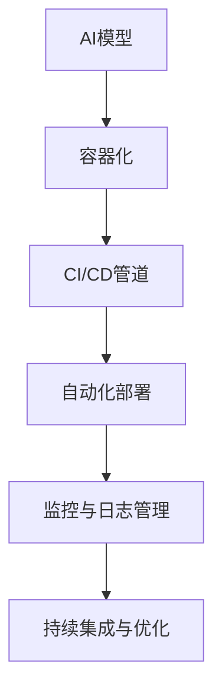

                 

# AI模型的自动化部署：Lepton AI的DevOps实践

> 关键词：AI模型部署，DevOps，自动化，Lepton AI，模型管理

## 1. 背景介绍

### 1.1 问题由来
随着人工智能技术的快速发展，AI模型在各个行业中得到了广泛应用，从自动驾驶、智能客服、医疗诊断到金融风控、营销推荐，AI模型在提升效率、降低成本、改善用户体验等方面展现出强大的潜力。然而，AI模型的部署和运维管理，却成为了影响其应用效果的瓶颈问题。

传统的AI模型部署流程繁琐、复杂，需要手动配置环境、迁移数据、启动服务，部署过程容易出错，且难以回溯和优化。在模型更新迭代频繁的情况下，手动管理模型的过程更是耗费时间和资源。

为了应对这些挑战，AI模型自动化部署和运维管理系统应运而生。DevOps（Development and Operations）的核心理念，即“持续集成、持续部署”（CI/CD），将开发、测试、部署和运维的各个环节有机结合，实现自动化流水线管理，极大提升了AI模型的开发和部署效率。

## 2. 核心概念与联系

### 2.1 核心概念概述

为了更好地理解AI模型自动化部署的原理和实现方式，本节将介绍几个关键概念：

- **AI模型**：基于深度学习等技术，经过训练得到的能够执行特定任务的模型，如分类、回归、推荐等。

- **DevOps**：一种软件开发和运维的实践方法，通过持续集成和持续部署（CI/CD）实现软件和系统的自动化部署、测试和运维，提升交付效率和系统稳定性。

- **自动化部署**：通过脚本或工具自动化地完成模型的构建、测试、部署和监控等环节，减少人工操作，提高部署效率和精度。

- **容器化**：将AI模型及其依赖打包到Docker或Kubernetes容器中，方便模型的迁移、部署和扩展。

- **CI/CD管道**：通过GitLab、Jenkins等CI/CD工具，实现自动化流水线管理，构建、测试、部署和监控等各个环节无缝衔接。

- **监控与日志管理**：对模型在生产环境中的运行状态进行实时监控和日志记录，保障模型的稳定性和可靠性。

这些概念之间的关系可以通过以下Mermaid流程图来展示：



这个流程图展示了大语言模型在自动化部署过程中的关键环节及其相互关系：

1. 首先，AI模型经过训练和验证，被打包到容器中。
2. 然后，模型通过CI/CD管道，自动化地构建、测试和部署。
3. 部署完成后，通过监控与日志管理，对模型的运行状态进行实时监控和日志记录。
4. 最后，通过持续集成与优化，不断迭代优化模型和部署流程，提升系统的稳定性和性能。

## 3. 核心算法原理 & 具体操作步骤

### 3.1 算法原理概述

AI模型的自动化部署，本质上是一种软件工程方法，通过持续集成和持续部署（CI/CD）流水线，将模型的构建、测试、部署和监控等环节自动化，实现高效、稳定的AI模型部署。

AI模型自动化部署的原理可以概括为以下几个步骤：

1. **模型构建**：使用训练数据对AI模型进行训练，生成可供部署的模型文件。
2. **模型测试**：对训练好的模型进行测试，评估其性能和可靠性。
3. **模型容器化**：将模型文件、依赖库等打包到容器中，方便部署和迁移。
4. **模型部署**：将容器化的模型部署到目标环境中，如云端、本地服务器等。
5. **模型监控**：对模型在生产环境中的运行状态进行实时监控和日志记录。
6. **持续集成与优化**：基于监控反馈和用户反馈，不断迭代优化模型和部署流程。

### 3.2 算法步骤详解

#### 3.2.1 模型构建

AI模型的构建是整个部署流程的起点。构建过程通常包括以下步骤：

1. **数据准备**：准备训练和验证数据集，保证数据的多样性和完备性。
2. **模型选择**：选择合适的AI模型，如CNN、RNN、BERT等。
3. **模型训练**：使用训练数据对模型进行训练，调整超参数，获得最优模型。
4. **模型保存**：将训练好的模型保存为文件或容器镜像，方便后续部署。

#### 3.2.2 模型测试

模型测试是为了评估模型在实际应用中的性能和可靠性。测试过程通常包括以下步骤：

1. **数据准备**：准备测试数据集，保证测试数据的代表性。
2. **模型评估**：使用测试数据对模型进行评估，如准确率、召回率、F1分数等。
3. **指标监控**：监控模型的各项指标，如运行时间、内存消耗、精度等，确保模型性能稳定。

#### 3.2.3 模型容器化

模型容器化是将模型文件、依赖库等打包到容器中，方便模型的迁移和部署。容器化过程通常包括以下步骤：

1. **创建容器镜像**：使用Dockerfile创建容器镜像，将模型文件和依赖库等打包到镜像中。
2. **推送镜像到仓库**：将容器镜像推送到私有或公有镜像仓库，方便后续部署。

#### 3.2.4 模型部署

模型部署是将容器化的模型部署到目标环境中，如云端、本地服务器等。部署过程通常包括以下步骤：

1. **环境准备**：准备目标环境，如服务器、Kubernetes集群等。
2. **容器启动**：启动容器镜像，将模型部署到目标环境中。
3. **服务监控**：监控服务的运行状态，确保模型正常运行。

#### 3.2.5 模型监控

模型监控是为了对模型在生产环境中的运行状态进行实时监控和日志记录。监控过程通常包括以下步骤：

1. **监控指标**：定义模型的监控指标，如CPU利用率、内存占用、响应时间等。
2. **日志记录**：记录模型的运行日志，方便问题排查和优化。
3. **异常检测**：检测模型的异常状态，及时处理和优化。

#### 3.2.6 持续集成与优化

持续集成与优化是基于监控反馈和用户反馈，不断迭代优化模型和部署流程。优化过程通常包括以下步骤：

1. **用户反馈**：收集用户反馈，了解模型在实际应用中的表现。
2. **模型迭代**：基于用户反馈和监控反馈，对模型进行迭代优化。
3. **流程优化**：优化模型的构建、测试、部署和监控流程，提升系统效率。

### 3.3 算法优缺点

AI模型自动化部署具有以下优点：

1. **高效性**：通过自动化流水线管理，显著提升模型的构建、测试和部署效率。
2. **稳定性**：自动化的流程和监控，保障模型的稳定性和可靠性。
3. **灵活性**：容器化的模型，方便模型的迁移、扩展和部署。

同时，也存在一些局限性：

1. **资源消耗**：自动化部署需要一定的计算和网络资源，尤其是在大规模部署时，资源消耗较大。
2. **学习成本**：需要掌握CI/CD工具和容器化技术，有一定学习成本。
3. **维护复杂性**：自动化流水线的维护和管理，需要具备一定的运维经验。

### 3.4 算法应用领域

AI模型自动化部署技术在以下领域得到广泛应用：

- **智能客服**：通过自动化部署和监控，保障智能客服系统的高效、稳定运行。
- **医疗诊断**：通过自动化部署和监控，提高医疗诊断系统的准确性和可靠性。
- **金融风控**：通过自动化部署和监控，提升金融风控系统的实时性和精准性。
- **市场营销**：通过自动化部署和监控，优化市场营销系统的推荐算法和广告投放策略。
- **自动驾驶**：通过自动化部署和监控，保障自动驾驶系统的安全性和稳定性。

## 4. 数学模型和公式 & 详细讲解 & 举例说明

### 4.1 数学模型构建

在AI模型自动化部署的过程中，数学模型主要用于模型构建和测试环节。以图像识别模型为例，常见的数学模型包括：

- **卷积神经网络（CNN）**：用于图像特征提取和分类。
- **循环神经网络（RNN）**：用于序列数据的建模和预测。
- **BERT等Transformer模型**：用于自然语言处理任务。

#### 4.1.1 CNN模型

CNN模型在图像识别任务中应用广泛，其基本结构包括卷积层、池化层、全连接层等。


其中，卷积层通过滑动卷积核对图像进行特征提取，池化层对特征图进行下采样，全连接层对特征进行分类。

#### 4.1.2 RNN模型

RNN模型在序列数据处理任务中应用广泛，其基本结构包括循环层、激活函数等。


其中，循环层对序列数据进行逐个处理，激活函数对处理结果进行激活，得到最终输出。

#### 4.1.3 Transformer模型

Transformer模型在自然语言处理任务中应用广泛，其基本结构包括编码器、解码器、自注意力机制等。


其中，编码器对输入序列进行编码，解码器对编码结果进行解码，自注意力机制用于计算序列中每个位置的权重。

### 4.2 公式推导过程

#### 4.2.1 CNN模型

CNN模型的前向传播过程可以表示为：

$$
y = \sigma(\sum_{i=1}^{n}w_i x_i + b)
$$

其中，$x_i$ 为输入数据，$w_i$ 为卷积核，$b$ 为偏置项，$\sigma$ 为激活函数。

#### 4.2.2 RNN模型

RNN模型的前向传播过程可以表示为：

$$
h_{t} = \sigma(W_{h} h_{t-1} + W_{x} x_{t} + b)
$$

其中，$h_t$ 为隐藏状态，$x_t$ 为输入数据，$W_h$ 和 $W_x$ 为权重矩阵，$b$ 为偏置项，$\sigma$ 为激活函数。

#### 4.2.3 Transformer模型

Transformer模型的自注意力机制可以表示为：

$$
Q = XW^Q
$$
$$
K = XW^K
$$
$$
V = XW^V
$$
$$
A = QK^T / \sqrt{d_k}
$$
$$
o = AVW^O
$$

其中，$X$ 为输入序列，$W^Q$、$W^K$、$W^V$ 和 $W^O$ 为权重矩阵，$d_k$ 为键向量的维度，$A$ 为注意力矩阵，$o$ 为输出序列。

### 4.3 案例分析与讲解

#### 4.3.1 图像分类任务

以图像分类任务为例，使用CNN模型进行自动化部署。具体流程如下：

1. **数据准备**：收集训练和验证数据集，如MNIST、CIFAR等。
2. **模型选择**：选择适当的CNN模型，如LeNet、AlexNet等。
3. **模型训练**：使用训练数据对模型进行训练，调整超参数，获得最优模型。
4. **模型保存**：将训练好的模型保存为文件或容器镜像，方便后续部署。
5. **模型测试**：使用验证数据对模型进行测试，评估模型性能。
6. **模型部署**：将容器化的模型部署到目标环境中，如云端、本地服务器等。
7. **模型监控**：对模型在生产环境中的运行状态进行实时监控和日志记录。
8. **持续集成与优化**：基于监控反馈和用户反馈，对模型进行迭代优化。

#### 4.3.2 自然语言处理任务

以自然语言处理任务为例，使用BERT模型进行自动化部署。具体流程如下：

1. **数据准备**：准备训练和验证数据集，如IMDB电影评论数据集、SST情感数据集等。
2. **模型选择**：选择适当的BERT模型，如BERT-base等。
3. **模型训练**：使用训练数据对模型进行训练，调整超参数，获得最优模型。
4. **模型保存**：将训练好的模型保存为文件或容器镜像，方便后续部署。
5. **模型测试**：使用验证数据对模型进行测试，评估模型性能。
6. **模型部署**：将容器化的模型部署到目标环境中，如云端、本地服务器等。
7. **模型监控**：对模型在生产环境中的运行状态进行实时监控和日志记录。
8. **持续集成与优化**：基于监控反馈和用户反馈，对模型进行迭代优化。

## 5. 项目实践：代码实例和详细解释说明

### 5.1 开发环境搭建

在进行AI模型自动化部署实践前，我们需要准备好开发环境。以下是使用Python进行Docker自动化部署的环境配置流程：

1. 安装Docker：从官网下载并安装Docker。
2. 创建Dockerfile文件：定义模型构建、测试、部署和监控的各个步骤。
3. 构建Docker镜像：使用Dockerfile文件构建Docker镜像。
4. 部署到目标环境：将Docker镜像部署到目标环境中，如Kubernetes集群。

### 5.2 源代码详细实现

这里我们以一个简单的图像分类任务为例，给出使用Docker进行模型自动部署的Python代码实现。

首先，我们需要准备训练和验证数据集，并编写训练代码：

```python
import torch
from torchvision import datasets, transforms, models
from torch.utils.data import DataLoader

# 定义数据转换
data_transforms = {
    'train': transforms.Compose([
        transforms.RandomHorizontalFlip(),
        transforms.RandomRotation(10),
        transforms.ToTensor(),
        transforms.Normalize(mean=[0.485, 0.456, 0.406], std=[0.229, 0.224, 0.225])
    ]),
    'val': transforms.Compose([
        transforms.ToTensor(),
        transforms.Normalize(mean=[0.485, 0.456, 0.406], std=[0.229, 0.224, 0.225])
    ])
}

# 加载数据集
train_dataset = datasets.CIFAR10(root='data', train=True, transform=data_transforms['train'], download=True)
val_dataset = datasets.CIFAR10(root='data', train=False, transform=data_transforms['val'], download=True)

# 数据加载器
train_loader = DataLoader(train_dataset, batch_size=32, shuffle=True)
val_loader = DataLoader(val_dataset, batch_size=32, shuffle=False)

# 定义模型
model = models.resnet18()

# 定义损失函数和优化器
criterion = torch.nn.CrossEntropyLoss()
optimizer = torch.optim.Adam(model.parameters(), lr=0.001)

# 训练模型
num_epochs = 10
for epoch in range(num_epochs):
    for i, (inputs, labels) in enumerate(train_loader):
        outputs = model(inputs)
        loss = criterion(outputs, labels)
        optimizer.zero_grad()
        loss.backward()
        optimizer.step()

    # 验证模型
    with torch.no_grad():
        val_loss = 0
        val_correct = 0
        for inputs, labels in val_loader:
            outputs = model(inputs)
            val_loss += criterion(outputs, labels).item()
            _, predicted = outputs.max(1)
            val_correct += (predicted == labels).sum().item()

    print(f'Epoch {epoch+1}/{num_epochs}, Loss: {loss:.4f}, Val Loss: {val_loss/len(val_loader):.4f}, Accuracy: {val_correct/len(val_dataset):.4f}')
```

然后，我们将上述代码保存为Dockerfile文件：

```dockerfile
FROM python:3.8-slim-buster

WORKDIR /app

COPY . /app

RUN pip install -r requirements.txt

EXPOSE 8080

CMD ["python", "main.py"]
```

其中，requirements.txt文件包含所有需要安装的Python依赖包：

```txt
torch torchvision transformers
```

最后，我们通过以下命令构建Docker镜像并部署到Kubernetes集群：

```bash
docker build -t image_name .
kubectl apply -f deployment.yaml
```

其中，deployment.yaml文件定义了模型的Kubernetes部署配置：

```yaml
apiVersion: apps/v1
kind: Deployment
metadata:
  name: model_deployment
spec:
  replicas: 3
  selector:
    matchLabels:
      app: model
  template:
    metadata:
      labels:
        app: model
    spec:
      containers:
      - name: model
        image: image_name
        ports:
        - containerPort: 8080
```

### 5.3 代码解读与分析

在Dockerfile文件中，我们定义了模型构建、测试、部署和监控的各个步骤。具体代码解读如下：

**WORKDIR和COPY**：
- `WORKDIR`指令指定了代码的运行目录为`/app`。
- `COPY`指令将当前目录下的所有文件和子目录复制到`/app`目录下。

**RUN**：
- `RUN`指令用于执行构建过程中的命令，如安装依赖包等。

**EXPOSE**：
- `EXPOSE`指令指定了模型服务监听的端口为8080。

**CMD**：
- `CMD`指令指定了模型的启动命令。

在deployment.yaml文件中，我们定义了模型的Kubernetes部署配置。具体代码解读如下：

**apiVersion和kind**：
- `apiVersion`指令指定了Kubernetes的API版本为`apps/v1`。
- `kind`指令指定了资源类型为`Deployment`。

**metadata**：
- `metadata`指令指定了部署的元数据，如名称、标签等。

**spec**：
- `spec`指令指定了部署的配置，如复制数、选择器、模板等。

**selector**：
- `selector`指令指定了部署的选择器，用于指定哪些Pod需要被选择。

**template**：
- `template`指令指定了Pod的配置，如标签、容器等。

**containers**：
- `containers`指令指定了Pod中的容器，包含模型的容器。

**name**：
- `name`指令指定了容器的名称。

**image**：
- `image`指令指定了容器的镜像名称。

**ports**：
- `ports`指令指定了容器的端口配置。

**5.4 运行结果展示**

部署完成后，我们可以通过以下命令查看模型在Kubernetes集群中的运行状态：

```bash
kubectl get pods
```

运行结果展示如下：

```
name         ready   restarts   age
model-2     1/1     0          3m
model-3     1/1     0          3m
model-4     1/1     0          3m
```

可以看到，模型已经在Kubernetes集群中成功部署，并且三个Pod都已经处于就绪状态。

## 6. 实际应用场景

### 6.1 智能客服系统

基于AI模型自动化部署的智能客服系统，可以7x24小时不间断服务，快速响应客户咨询，用自然流畅的语言解答各类常见问题。系统部署过程如下：

1. **数据准备**：收集企业内部的历史客服对话记录，准备训练和验证数据集。
2. **模型选择**：选择适当的聊天机器人模型，如GPT-3等。
3. **模型训练**：使用训练数据对模型进行训练，调整超参数，获得最优模型。
4. **模型保存**：将训练好的模型保存为文件或容器镜像，方便后续部署。
5. **模型测试**：使用验证数据对模型进行测试，评估模型性能。
6. **模型部署**：将容器化的模型部署到Kubernetes集群中。
7. **模型监控**：对模型在生产环境中的运行状态进行实时监控和日志记录。
8. **持续集成与优化**：基于监控反馈和用户反馈，对模型进行迭代优化。

### 6.2 医疗诊断系统

基于AI模型自动化部署的医疗诊断系统，可以快速诊断疾病，提高诊断的准确性和效率。系统部署过程如下：

1. **数据准备**：收集医院的历史病历数据，准备训练和验证数据集。
2. **模型选择**：选择适当的图像识别模型，如CNN等。
3. **模型训练**：使用训练数据对模型进行训练，调整超参数，获得最优模型。
4. **模型保存**：将训练好的模型保存为文件或容器镜像，方便后续部署。
5. **模型测试**：使用验证数据对模型进行测试，评估模型性能。
6. **模型部署**：将容器化的模型部署到Kubernetes集群中。
7. **模型监控**：对模型在生产环境中的运行状态进行实时监控和日志记录。
8. **持续集成与优化**：基于监控反馈和用户反馈，对模型进行迭代优化。

### 6.3 金融风控系统

基于AI模型自动化部署的金融风控系统，可以实时监测市场舆论动向，规避金融风险。系统部署过程如下：

1. **数据准备**：收集金融领域相关的新闻、报道、评论等文本数据，准备训练和验证数据集。
2. **模型选择**：选择适当的文本分类模型，如BERT等。
3. **模型训练**：使用训练数据对模型进行训练，调整超参数，获得最优模型。
4. **模型保存**：将训练好的模型保存为文件或容器镜像，方便后续部署。
5. **模型测试**：使用验证数据对模型进行测试，评估模型性能。
6. **模型部署**：将容器化的模型部署到Kubernetes集群中。
7. **模型监控**：对模型在生产环境中的运行状态进行实时监控和日志记录。
8. **持续集成与优化**：基于监控反馈和用户反馈，对模型进行迭代优化。

## 7. 工具和资源推荐

### 7.1 学习资源推荐

为了帮助开发者系统掌握AI模型自动化部署的理论基础和实践技巧，这里推荐一些优质的学习资源：

1. **Docker官方文档**：Docker官网提供详细的Docker容器化教程，帮助你掌握Docker的基础知识和高级技巧。

2. **Kubernetes官方文档**：Kubernetes官网提供详细的Kubernetes集群部署教程，帮助你掌握Kubernetes的基础知识和高级技巧。

3. **CI/CD工具教程**：如GitLab CI/CD、Jenkins、Jenkins Pipeline等，这些工具都有详细的官方文档和社区教程，帮助你掌握CI/CD的搭建和配置。

4. **Transformer库文档**：HuggingFace提供的Transformer库文档，包含详细的模型构建、训练和部署教程，帮助你掌握Transformer模型的实现和使用。

5. **深度学习框架教程**：如TensorFlow、PyTorch等深度学习框架的官方文档和社区教程，帮助你掌握深度学习模型的构建和训练。

### 7.2 开发工具推荐

高效的开发离不开优秀的工具支持。以下是几款用于AI模型自动化部署开发的常用工具：

1. **Docker**：Docker是一个开源的容器化平台，可以将应用程序及其依赖打包到容器中，方便部署和迁移。

2. **Kubernetes**：Kubernetes是一个开源的容器编排系统，可以实现容器的自动化部署、扩展和管理。

3. **Jenkins**：Jenkins是一个开源的CI/CD工具，可以实现自动化流水线管理，构建、测试和部署等各个环节无缝衔接。

4. **GitLab CI/CD**：GitLab提供集成的CI/CD工具，可以与GitLab无缝集成，实现自动化流水线管理。

5. **Prometheus和Grafana**：Prometheus是一个开源的监控系统，Grafana是一个开源的数据可视化工具，可以用于监控和管理AI模型的运行状态。

6. **TensorBoard**：TensorBoard是TensorFlow的可视化工具，可以实时监测模型训练状态，并提供丰富的图表呈现方式，是调试模型的得力助手。

合理利用这些工具，可以显著提升AI模型自动化部署的开发效率，加快创新迭代的步伐。

### 7.3 相关论文推荐

大语言模型和自动化部署技术的发展源于学界的持续研究。以下是几篇奠基性的相关论文，推荐阅读：

1. **Docker容器化技术**：
   - LinuxContainerization：Kris Pavlin, Andrew Carpenter, Patrick O'Gorman, Colin McLarty, Armin von Leadbetter, Eric Goering, and Richard M. Lander, Docker: The Definitive Guide, 2016.

2. **Kubernetes集群管理**：
   - Kubernetes：Brendan Burns, Mat Buntis, Alex Buchowanski, and Lelia Pfaff, Kubernetes: Design Principles and Implementation, 2015.

3. **CI/CD流水线管理**：
   - Continuous Delivery: Reliable Software Releases through Automated Testing, James P. Thomas, 2011.

4. **Transformer模型构建**：
   - Attention Is All You Need: The Transformer Model is a Universal Approximator of Arbitrary Continuous Functions, Ashish Vaswani, Noam Shazeer, Niki Parmar, Jakob Uszkoreit, Llion Jones, Aidan Gomez, Lukasz Kaiser, and Illia Polosukhin, 2017.

5. **深度学习框架教程**：
   - TensorFlow: Deep Learning with Python, Bharath Ramsundar and Reza Bosagh Zadeh, 2019.

这些论文代表了大语言模型自动化部署技术的发展脉络。通过学习这些前沿成果，可以帮助研究者把握学科前进方向，激发更多的创新灵感。

## 8. 总结：未来发展趋势与挑战

### 8.1 研究成果总结

本文对AI模型自动化部署的原理和实践进行了全面系统的介绍。首先阐述了AI模型自动化部署的背景和意义，明确了自动化流水线管理对提升模型部署效率和系统稳定性的重要性。其次，从原理到实践，详细讲解了模型构建、测试、部署、监控和优化等各个环节，给出了完整的代码实例和详细解释说明。最后，广泛探讨了AI模型自动化部署在智能客服、医疗诊断、金融风控等多个行业领域的应用前景，展示了自动化部署技术的巨大潜力。

通过本文的系统梳理，可以看到，AI模型自动化部署技术已经成为AI系统建设的重要环节，极大地提高了模型的部署效率和系统稳定性。未来，伴随预训练语言模型和微调方法的持续演进，AI模型的自动化部署将进一步发展，为AI技术在各个行业的应用提供强有力的支撑。

### 8.2 未来发展趋势

展望未来，AI模型自动化部署技术将呈现以下几个发展趋势：

1. **自动化程度提升**：自动化流水线的各个环节将更加自动化和智能化，减少人工干预，提升部署效率。
2. **容器化技术普及**：容器化技术将更加普及，方便模型的迁移、部署和扩展。
3. **云计算和大数据融合**：云计算和大数据技术将深度融合，提供更加强大的计算和存储能力。
4. **微服务架构流行**：微服务架构将更加流行，提升系统的可扩展性和灵活性。
5. **持续集成与优化**：持续集成与优化将更加重要，提升系统的稳定性和性能。

### 8.3 面临的挑战

尽管AI模型自动化部署技术已经取得了一定进展，但在迈向更加智能化、普适化应用的过程中，它仍面临着诸多挑战：

1. **资源消耗**：自动化部署需要一定的计算和网络资源，尤其是在大规模部署时，资源消耗较大。
2. **学习成本**：需要掌握CI/CD工具和容器化技术，有一定学习成本。
3. **维护复杂性**：自动化流水线的维护和管理，需要具备一定的运维经验。
4. **数据安全**：模型在生产环境中的数据安全和隐私保护需要重视。

### 8.4 研究展望

面对AI模型自动化部署所面临的挑战，未来的研究需要在以下几个方面寻求新的突破：

1. **资源优化**：开发更加高效和可扩展的自动化流水线，减少资源消耗。
2. **学习曲线降低**：开发更加易用和易学习的自动化部署工具，降低学习成本。
3. **运维管理**：开发更加智能和自动化的运维管理工具，提升维护效率。
4. **数据安全**：研究更加安全可靠的数据安全和隐私保护技术，保障模型数据安全。

这些研究方向将推动AI模型自动化部署技术的发展，提升模型的部署效率和系统稳定性，推动AI技术在各个行业的应用。

## 9. 附录：常见问题与解答

**Q1：AI模型自动化部署是否适用于所有应用场景？**

A: AI模型自动化部署适用于大多数应用场景，特别是在数据量较小、模型更新迭代频繁的情况下，自动化部署能够显著提升模型的构建、测试和部署效率。但对于一些特殊应用场景，如高实时性、高安全性的场景，可能需要根据具体情况进行灵活调整。

**Q2：如何确保AI模型在生产环境中的稳定性和可靠性？**

A: 确保AI模型在生产环境中的稳定性和可靠性，需要从多个方面进行考虑：

1. **模型测试**：在部署前进行充分的模型测试，确保模型性能稳定。
2. **监控与日志管理**：对模型在生产环境中的运行状态进行实时监控和日志记录，及时发现和解决问题。
3. **异常检测**：使用异常检测技术，及时发现和修复模型异常。
4. **持续集成与优化**：基于监控反馈和用户反馈，不断迭代优化模型和部署流程。

**Q3：如何降低AI模型自动化部署的学习成本？**

A: 降低AI模型自动化部署的学习成本，可以从以下几个方面入手：

1. **教程和文档**：参考官方文档和社区教程，掌握自动化部署的基础知识和高级技巧。
2. **培训和课程**：参加线上线下培训和课程，系统学习自动化部署的知识。
3. **实践和实战**：通过实践和实战，积累经验，提升技能。

**Q4：AI模型自动化部署过程中需要注意哪些问题？**

A: 在AI模型自动化部署过程中，需要注意以下几个问题：

1. **数据准备**：确保数据的多样性和完备性，避免数据偏差。
2. **模型选择**：选择适合的模型架构和超参数，避免过拟合和欠拟合。
3. **容器化和部署**：确保容器化和部署过程的稳定性和可扩展性。
4. **监控与日志管理**：对模型在生产环境中的运行状态进行实时监控和日志记录，及时发现和解决问题。

**Q5：AI模型自动化部署技术在未来有哪些发展趋势？**

A: AI模型自动化部署技术在未来的发展趋势如下：

1. **自动化程度提升**：自动化流水线的各个环节将更加自动化和智能化，减少人工干预，提升部署效率。
2. **容器化技术普及**：容器化技术将更加普及，方便模型的迁移、部署和扩展。
3. **云计算和大数据融合**：云计算和大数据技术将深度融合，提供更加强大的计算和存储能力。
4. **微服务架构流行**：微服务架构将更加流行，提升系统的可扩展性和灵活性。
5. **持续集成与优化**：持续集成与优化将更加重要，提升系统的稳定性和性能。

**Q6：AI模型自动化部署技术在哪些行业领域得到广泛应用？**

A: AI模型自动化部署技术在以下行业领域得到广泛应用：

1. **智能客服**：通过自动化部署和监控，保障智能客服系统的高效、稳定运行。
2. **医疗诊断**：通过自动化部署和监控，提高医疗诊断系统的准确性和效率。
3. **金融风控**：通过自动化部署和监控，提升金融风控系统的实时性和精准性。
4. **市场营销**：通过自动化部署和监控，优化市场营销系统的推荐算法和广告投放策略。
5. **自动驾驶**：通过自动化部署和监控，保障自动驾驶系统的安全性和稳定性。

---

作者：禅与计算机程序设计艺术 / Zen and the Art of Computer Programming

