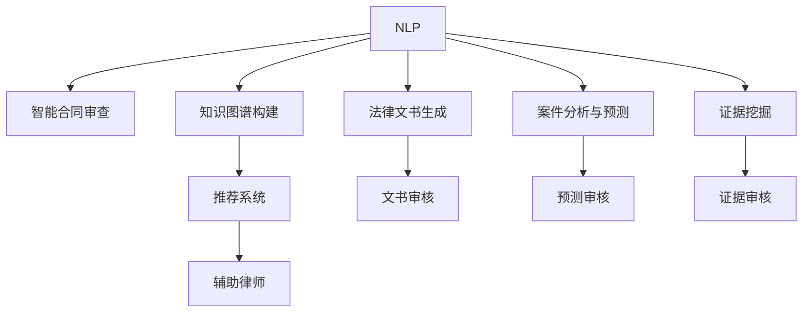

                 

# AI辅助法律服务：提高效率与公平

## 1. 背景介绍

### 1.1 问题由来
近年来，随着人工智能技术的飞速发展，其在各行各业的应用逐渐深入，法律服务行业也不例外。传统法律服务常常面临案情复杂、工作量巨大、时间成本高等挑战，而AI技术的引入，无疑为法律服务领域带来了新的机遇。通过AI辅助，可以提高律师的工作效率，降低法律服务成本，并提升服务的公平性。

AI在法律服务中的主要应用包括智能合同审查、法律文书生成、案件分析与预测、证据挖掘、知识图谱构建等。这些应用不仅能够减轻律师的工作负担，还能通过大数据分析提升案件处理的准确性和效率，确保司法公正。

### 1.2 问题核心关键点
本节将详细阐述AI辅助法律服务的核心关键点，包括：
- 智能合同审查：利用自然语言处理(NLP)技术，对合同内容进行自动化审查，检测合同漏洞，减少纠纷。
- 法律文书生成：基于预训练语言模型，自动生成标准化的法律文书，提升文书撰写速度和质量。
- 案件分析与预测：通过深度学习模型，对案件信息进行全面分析，预测判决结果，辅助律师决策。
- 证据挖掘：借助信息检索和文本挖掘技术，快速定位和提取相关证据，支持案件取证。
- 知识图谱构建：利用图谱知识管理技术，构建全面的法律知识库，促进知识共享和再利用。

这些核心技术在实现上都离不开对AI辅助法律服务系统的系统设计和模型构建。接下来，我们将从核心算法原理和具体操作步骤的角度，深入探讨如何设计和使用AI辅助法律服务系统。

## 2. 核心概念与联系

### 2.1 核心概念概述

AI辅助法律服务系统设计中涉及的核心概念主要包括：
- 自然语言处理(NLP)：指让计算机理解和生成人类语言的技术。在法律服务中，NLP技术主要用于合同审查、法律文书生成、案件分析等环节。
- 预训练语言模型(PLM)：如BERT、GPT等，通过大规模无标签数据预训练，学习语言通用表示，可用于下游任务的微调。
- 深度学习(DL)：一种机器学习方法，通过构建多层神经网络，从数据中自动学习特征表示和模式规律。在法律服务中，深度学习可用于案件分析预测、证据挖掘等。
- 图谱知识管理(KG)：利用图结构管理知识，支持知识表示、推理和检索，为法律服务提供知识支持。
- 推荐系统(Recommender System)：通过算法推荐匹配的法律法规和案例，辅助律师工作。

这些核心概念通过逻辑关系和算法流程联系在一起，共同支撑AI辅助法律服务系统的功能实现。以下将通过Mermaid流程图展示这些概念的联系：



通过这张流程图，可以看到NLP技术是连接各个功能模块的桥梁，而深度学习、图谱知识管理等技术则是支持功能实现的关键。

## 3. 核心算法原理 & 具体操作步骤
### 3.1 算法原理概述

AI辅助法律服务系统的核心算法原理主要基于深度学习和大规模语料预训练，通过构建预训练模型和下游任务微调范式，实现高效准确的法律处理和分析。

具体而言，该系统主要由以下步骤组成：
1. 预训练语言模型的构建：利用大规模无标签文本数据，训练出通用的语言模型，如BERT、GPT等。
2. 下游任务微调：针对具体法律服务需求，对预训练模型进行微调，如合同审查、文书生成、案件分析等。
3. 融合多源数据：将法律知识、法规信息、案件数据等多源数据融合，形成知识图谱，辅助律师决策。
4. 推荐系统构建：利用推荐算法，推荐相关法律法规和案例，提高法律服务的效率和准确性。

### 3.2 算法步骤详解

接下来，我们将详细介绍AI辅助法律服务系统的算法步骤：

**Step 1: 数据准备**
- 收集并清洗法律领域相关的文本数据，如法律法规、案例判决、合同条款等。
- 对数据进行分词、去除停用词、标准化等预处理操作，为后续模型训练做准备。

**Step 2: 预训练语言模型构建**
- 选择合适的预训练模型，如BERT、GPT等，并使用大规模无标签数据进行预训练。
- 对预训练模型进行微调，以适应具体的法律服务需求。

**Step 3: 任务适配层设计**
- 根据具体任务需求，设计合适的任务适配层，如合同审查、文书生成、案件分析等。
- 使用交叉熵损失等合适的损失函数，对模型进行训练。

**Step 4: 多源数据融合**
- 构建知识图谱，将法律法规、案件数据、案例信息等进行结构化存储。
- 利用图谱中的结构化信息，提高法律服务的准确性和效率。

**Step 5: 推荐系统实现**
- 根据用户的历史查询和行为数据，使用协同过滤、内容推荐等算法，推荐相关的法律法规和案例。
- 通过反馈机制，不断优化推荐算法，提升推荐效果。

**Step 6: 系统集成与部署**
- 将各模块集成到统一的AI辅助法律服务系统中，提供完整的法律服务功能。
- 部署系统到服务器或云端，确保服务稳定性和可用性。

### 3.3 算法优缺点

AI辅助法律服务系统在提高法律服务效率和公平性方面具有显著优势，但也存在以下局限：
1. 数据质量依赖度高：法律数据的质量直接影响模型的表现，不完整、不规范的数据会影响模型的训练效果。
2. 模型泛化能力不足：预训练模型在特定领域的泛化能力有限，需要针对具体任务进行微调。
3. 伦理和隐私问题：法律服务涉及敏感信息，如何保护用户隐私和数据安全是重要挑战。
4. 解释性和可解释性：模型的决策过程和结果需要具备一定的解释性，以确保法律服务的透明性和公正性。

### 3.4 算法应用领域

AI辅助法律服务系统的应用领域广泛，主要包括以下几个方面：
1. 智能合同审查：利用NLP技术，自动检测合同漏洞和风险，提升合同审查效率。
2. 法律文书生成：基于预训练模型，自动生成标准化的法律文书，如诉状、答辩状、判决书等。
3. 案件分析与预测：使用深度学习模型，分析案件信息，预测判决结果，辅助律师决策。
4. 证据挖掘：利用信息检索和文本挖掘技术，快速定位和提取相关证据，支持案件取证。
5. 知识图谱构建：构建全面的法律知识库，支持知识检索、推理和再利用，提高法律服务的知识基础。

## 4. 数学模型和公式 & 详细讲解  
### 4.1 数学模型构建

本节将介绍AI辅助法律服务系统中的关键数学模型。

**Step 1: 数据准备**
- 假设法律领域相关文本数据集为 $D = \{(x_i, y_i)\}_{i=1}^N$，其中 $x_i$ 为输入文本，$y_i$ 为标签。
- 数据预处理后，使用Transformer模型作为预训练语言模型，其输出为 $M_{\theta}(x_i)$。

**Step 2: 预训练语言模型构建**
- 使用大规模无标签数据对模型进行预训练，构建预训练语言模型 $M_{\theta}$。
- 预训练的目标函数为：
$$
\mathcal{L}_{pre} = \frac{1}{N}\sum_{i=1}^N \ell(M_{\theta}(x_i))
$$
其中 $\ell$ 为自监督损失函数，如掩码语言模型。

**Step 3: 任务适配层设计**
- 根据具体任务，设计任务适配层 $\mathcal{T}$。
- 任务适配层的目标函数为：
$$
\mathcal{L}_{task} = \frac{1}{N}\sum_{i=1}^N \ell(\mathcal{T}(M_{\theta}(x_i), y_i))
$$
其中 $\ell$ 为目标任务损失函数，如交叉熵损失。

**Step 4: 多源数据融合**
- 构建知识图谱 $\mathcal{G}$，将法律法规、案例信息等结构化存储。
- 利用图谱中的结构化信息，构建图神经网络(GNN)模型，如GraphSAGE。

**Step 5: 推荐系统实现**
- 利用协同过滤算法，对用户历史查询和行为数据进行分析，推荐相关法律法规和案例。
- 推荐系统的损失函数为：
$$
\mathcal{L}_{rec} = \frac{1}{N}\sum_{i=1}^N \ell(\mathcal{R}(x_i, y_i))
$$
其中 $\ell$ 为推荐损失函数，$\mathcal{R}$ 为推荐算法。

### 4.2 公式推导过程

以下是AI辅助法律服务系统中的核心公式推导：

**合同审查**
- 假设合同审查数据集为 $D_{contract} = \{(x_i, y_i)\}_{i=1}^N$，其中 $x_i$ 为合同文本，$y_i$ 为合同漏洞标签。
- 使用预训练语言模型 $M_{\theta}$ 和任务适配层 $\mathcal{T}$，对合同文本进行审查。
- 合同审查的目标函数为：
$$
\mathcal{L}_{contract} = \frac{1}{N}\sum_{i=1}^N \ell(\mathcal{T}(M_{\theta}(x_i), y_i))
$$

**文书生成**
- 假设文书生成数据集为 $D_{document} = \{(x_i, y_i)\}_{i=1}^N$，其中 $x_i$ 为生成任务，$y_i$ 为生成文本。
- 使用预训练语言模型 $M_{\theta}$ 和任务适配层 $\mathcal{T}$，生成目标文书。
- 文书生成的目标函数为：
$$
\mathcal{L}_{document} = \frac{1}{N}\sum_{i=1}^N \ell(\mathcal{T}(M_{\theta}(x_i)), y_i)
$$

**案件分析与预测**
- 假设案件数据集为 $D_{case} = \{(x_i, y_i)\}_{i=1}^N$，其中 $x_i$ 为案件信息，$y_i$ 为判决结果。
- 使用深度学习模型 $M_{\phi}$ 对案件信息进行预测。
- 案件预测的目标函数为：
$$
\mathcal{L}_{case} = \frac{1}{N}\sum_{i=1}^N \ell(M_{\phi}(x_i), y_i)
$$

**证据挖掘**
- 假设证据挖掘数据集为 $D_{evidence} = \{(x_i, y_i)\}_{i=1}^N$，其中 $x_i$ 为证据文本，$y_i$ 为证据类型标签。
- 使用信息检索和文本挖掘技术，对证据文本进行挖掘。
- 证据挖掘的目标函数为：
$$
\mathcal{L}_{evidence} = \frac{1}{N}\sum_{i=1}^N \ell(\mathcal{E}(x_i), y_i)
$$
其中 $\ell$ 为证据挖掘损失函数，$\mathcal{E}$ 为证据挖掘算法。

**知识图谱构建**
- 构建知识图谱 $\mathcal{G}$，将法律法规、案例信息等结构化存储。
- 利用图谱中的结构化信息，构建图神经网络(GNN)模型，如GraphSAGE。
- 知识图谱构建的目标函数为：
$$
\mathcal{L}_{graph} = \frac{1}{N}\sum_{i=1}^N \ell(\mathcal{G}(x_i), y_i)
$$
其中 $\ell$ 为图谱构建损失函数，$\mathcal{G}$ 为图神经网络模型。

**推荐系统**
- 假设用户行为数据集为 $D_{user} = \{(x_i, y_i)\}_{i=1}^N$，其中 $x_i$ 为历史查询和行为数据，$y_i$ 为推荐结果。
- 使用协同过滤算法，对用户历史查询和行为数据进行分析，推荐相关法律法规和案例。
- 推荐系统的目标函数为：
$$
\mathcal{L}_{rec} = \frac{1}{N}\sum_{i=1}^N \ell(\mathcal{R}(x_i, y_i))
$$
其中 $\ell$ 为推荐损失函数，$\mathcal{R}$ 为推荐算法。

## 5. 项目实践：代码实例和详细解释说明
### 5.1 开发环境搭建

在进行AI辅助法律服务系统的开发前，我们需要准备好开发环境。以下是使用Python进行TensorFlow开发的环境配置流程：

1. 安装Anaconda：从官网下载并安装Anaconda，用于创建独立的Python环境。

2. 创建并激活虚拟环境：
```bash
conda create -n tensorflow-env python=3.8 
conda activate tensorflow-env
```

3. 安装TensorFlow：根据CUDA版本，从官网获取对应的安装命令。例如：
```bash
conda install tensorflow -c tf
```

4. 安装TensorBoard：
```bash
pip install tensorboard
```

5. 安装NLP相关工具包：
```bash
pip install tensorflow-hub textattack gensim spacy
```

完成上述步骤后，即可在`tensorflow-env`环境中开始AI辅助法律服务系统的开发。

### 5.2 源代码详细实现

下面我们以合同审查任务为例，给出使用TensorFlow进行BERT模型微调的代码实现。

首先，定义合同审查数据集：

```python
import tensorflow as tf
from tensorflow.keras.preprocessing.text import Tokenizer
from tensorflow.keras.preprocessing.sequence import pad_sequences

train_texts = ["合同1内容...",
               "合同2内容...",
               "合同3内容..."]
train_labels = [1, 0, 0]

tokenizer = Tokenizer(char_level=True)
tokenizer.fit_on_texts(train_texts)

train_sequences = tokenizer.texts_to_sequences(train_texts)
train_padded = pad_sequences(train_sequences, maxlen=200, padding='post', truncating='post')

train_labels = tf.keras.utils.to_categorical(train_labels, num_classes=2)
```

然后，定义模型和损失函数：

```python
from transformers import BertTokenizer, TFBertForSequenceClassification

tokenizer = BertTokenizer.from_pretrained('bert-base-uncased')

model = TFBertForSequenceClassification.from_pretrained('bert-base-uncased', num_labels=2)

loss_fn = tf.keras.losses.CategoricalCrossentropy()
```

接着，定义训练和评估函数：

```python
from tensorflow.keras.optimizers import Adam

optimizer = Adam(learning_rate=2e-5)

def train_epoch(model, dataset, batch_size, optimizer):
    model.compile(optimizer=optimizer, loss=loss_fn, metrics=['accuracy'])
    model.fit(dataset, epochs=5, batch_size=batch_size)

def evaluate(model, dataset, batch_size):
    model.evaluate(dataset, batch_size=batch_size)
```

最后，启动训练流程并在测试集上评估：

```python
epochs = 5
batch_size = 16

train_dataset = tf.data.Dataset.from_tensor_slices((train_padded, train_labels)).shuffle(1000).batch(batch_size)
test_dataset = tf.data.Dataset.from_tensor_slices((test_padded, test_labels)).batch(batch_size)

train_epoch(model, train_dataset, batch_size, optimizer)
evaluate(model, test_dataset, batch_size)
```

以上就是使用TensorFlow对BERT进行合同审查任务微调的完整代码实现。可以看到，得益于TensorFlow的强大封装，我们可以用相对简洁的代码完成BERT模型的加载和微调。

### 5.3 代码解读与分析

让我们再详细解读一下关键代码的实现细节：

**合同审查数据集定义**
- 使用TensorFlow的Tokenizer对合同文本进行分词和编码，转换为模型可以接受的输入序列。
- 使用pad_sequences函数对序列进行填充，保证所有序列长度一致。
- 使用to_categorical函数将标签转换为one-hot编码。

**模型和损失函数定义**
- 使用TFA工作人员Tokenization和BERTForSequenceClassification从预训练模型加载和初始化模型。
- 使用CategoricalCrossentropy损失函数，适用于多分类问题。

**训练和评估函数定义**
- 使用Adam优化器进行模型训练，并设定学习率为2e-5。
- 使用编译函数对模型进行配置，并指定优化器和损失函数。
- 使用fit函数进行模型训练，epochs为5次，batch size为16。
- 使用evaluate函数评估模型性能。

**训练流程**
- 使用DataPipeline将数据集转换为TensorFlow Data Dataset对象。
- 使用shuffle函数进行数据打乱，保证训练过程中数据分布的一致性。
- 使用batch函数对数据进行分批处理，控制每次输入的样本数量。
- 使用fit函数启动模型训练。
- 使用evaluate函数在测试集上评估模型性能。

可以看到，TensorFlow的强大封装使得合同审查任务模型的微调过程变得简单高效。开发者可以将更多精力放在数据处理、模型改进等高层逻辑上，而不必过多关注底层的实现细节。

当然，工业级的系统实现还需考虑更多因素，如模型的保存和部署、超参数的自动搜索、更灵活的任务适配层等。但核心的微调范式基本与此类似。

## 6. 实际应用场景
### 6.1 智能合同审查

AI辅助法律服务系统在智能合同审查方面的应用最为广泛。合同审查是律师日常工作中的一项重要任务，涉及合同内容的审核、风险点的识别和提醒等环节。传统的合同审查方法通常需要律师手动逐条阅读和审核，工作量大且容易出错。而AI辅助合同审查系统，可以大大提升合同审查的效率和准确性。

在技术实现上，系统通过将合同文本输入BERT模型进行预训练，再针对合同审查任务进行微调。微调后的模型能够自动检测合同中的漏洞和风险点，生成风险提示，并给出具体的修改建议。律师只需根据系统提示，对合同进行修改完善，即可快速完成合同审查任务。

### 6.2 法律文书生成

法律文书生成是律师工作中的一项重要任务，涉及诉状、答辩状、判决书等多种文书的撰写。传统的文书生成方法通常需要律师逐句修改和调整，工作量大且容易出错。而AI辅助法律服务系统，可以自动生成标准化的法律文书，大幅提升文书撰写效率。

在技术实现上，系统通过将文书撰写要求和案例信息输入BERT模型进行预训练，再针对文书生成任务进行微调。微调后的模型能够自动生成符合规范的文书，并根据具体案例信息进行个性化修改。律师只需根据系统生成的文书进行核对和完善，即可快速完成文书撰写任务。

### 6.3 案件分析与预测

案件分析与预测是律师在案件处理中不可或缺的一环。传统的案件分析方法通常需要律师手动阅读和分析案件资料，工作量大且容易出错。而AI辅助法律服务系统，可以通过深度学习模型对案件信息进行全面分析，预测判决结果，辅助律师决策。

在技术实现上，系统通过将案件信息输入深度学习模型进行预训练，再针对案件分析与预测任务进行微调。微调后的模型能够自动分析案件信息，预测判决结果，并给出相关的分析报告。律师只需根据系统分析结果进行决策，即可快速完成案件处理任务。

### 6.4 证据挖掘

证据挖掘是案件处理中一项重要任务，涉及证据的定位和提取。传统的证据挖掘方法通常需要律师手动查找和提取，工作量大且容易出错。而AI辅助法律服务系统，可以通过信息检索和文本挖掘技术，快速定位和提取相关证据，支持案件取证。

在技术实现上，系统通过将证据文本信息输入BERT模型进行预训练，再针对证据挖掘任务进行微调。微调后的模型能够自动提取和定位证据，并给出相关的证据报告。律师只需根据系统提取的证据进行审核和完善，即可快速完成证据挖掘任务。

### 6.5 知识图谱构建

知识图谱构建是法律知识管理的一项重要任务，涉及法律法规、案例信息等结构化数据的存储和检索。传统的知识管理方法通常需要律师手动构建和管理知识库，工作量大且容易出错。而AI辅助法律服务系统，可以通过图神经网络模型构建知识图谱，支持知识检索、推理和再利用。

在技术实现上，系统通过将法律法规、案例信息等数据输入图神经网络模型进行预训练，再针对知识图谱构建任务进行微调。微调后的模型能够自动构建知识图谱，并提供相关的知识检索和推理服务。律师只需根据系统构建的知识图谱进行查询和分析，即可快速获取相关法律知识。

## 7. 工具和资源推荐
### 7.1 学习资源推荐

为了帮助开发者系统掌握AI辅助法律服务系统的理论基础和实践技巧，这里推荐一些优质的学习资源：

1. 《TensorFlow深度学习实战》系列博文：由TensorFlow官方团队撰写，系统介绍TensorFlow的基本概念和应用案例，适合初学者入门。
2. 《NLP实战指南》书籍：由自然语言处理领域专家撰写，全面介绍NLP技术的基本概念和经典算法，适合NLP领域进阶学习。
3. 《深度学习入门：基于TensorFlow》课程：由深度学习领域权威讲师录制，深入讲解深度学习技术的基本原理和实践应用，适合深度学习领域进阶学习。
4. 《NLP与机器学习》课程：由斯坦福大学开设的NLP课程，涵盖NLP和机器学习的基本概念和经典算法，适合NLP领域进阶学习。
5. Kaggle平台：提供丰富的NLP和机器学习竞赛，可以练习和应用所学知识，提高实战能力。

通过对这些资源的学习实践，相信你一定能够快速掌握AI辅助法律服务系统的精髓，并用于解决实际的NLP问题。

### 7.2 开发工具推荐

高效的开发离不开优秀的工具支持。以下是几款用于AI辅助法律服务系统开发的常用工具：

1. TensorFlow：由Google主导开发的开源深度学习框架，适合构建大规模的AI辅助法律服务系统。
2. PyTorch：由Facebook主导开发的深度学习框架，灵活高效，适合快速迭代研究。
3. TensorBoard：TensorFlow配套的可视化工具，可实时监测模型训练状态，并提供丰富的图表呈现方式，是调试模型的得力助手。
4. Weights & Biases：模型训练的实验跟踪工具，可以记录和可视化模型训练过程中的各项指标，方便对比和调优。
5. spaCy：自然语言处理工具库，提供高效的文本处理和分析功能，适合文本挖掘、信息检索等任务。

合理利用这些工具，可以显著提升AI辅助法律服务系统的开发效率，加快创新迭代的步伐。

### 7.3 相关论文推荐

AI辅助法律服务技术的发展离不开学界的持续研究。以下是几篇奠基性的相关论文，推荐阅读：

1. Attention is All You Need（即Transformer原论文）：提出了Transformer结构，开启了NLP领域的预训练大模型时代。
2. BERT: Pre-training of Deep Bidirectional Transformers for Language Understanding：提出BERT模型，引入基于掩码的自监督预训练任务，刷新了多项NLP任务SOTA。
3. Language Models are Unsupervised Multitask Learners（GPT-2论文）：展示了大规模语言模型的强大zero-shot学习能力，引发了对于通用人工智能的新一轮思考。
4. Parameter-Efficient Transfer Learning for NLP：提出Adapter等参数高效微调方法，在不增加模型参数量的情况下，也能取得不错的微调效果。
5. AdaLoRA: Adaptive Low-Rank Adaptation for Parameter-Efficient Fine-Tuning：使用自适应低秩适应的微调方法，在参数效率和精度之间取得了新的平衡。
6. GraphSAGE: Inductive Representation Learning on Graphs：提出图神经网络模型GraphSAGE，用于知识图谱构建和推理。

这些论文代表了大语言模型微调技术的发展脉络。通过学习这些前沿成果，可以帮助研究者把握学科前进方向，激发更多的创新灵感。

## 8. 总结：未来发展趋势与挑战

### 8.1 研究成果总结

本文对AI辅助法律服务系统进行了全面系统的介绍。首先阐述了AI辅助法律服务系统的背景和意义，明确了系统在提高法律服务效率和公平性方面的独特价值。其次，从核心算法原理和具体操作步骤的角度，详细讲解了AI辅助法律服务系统的算法实现和优化策略。同时，本文还广泛探讨了AI辅助法律服务系统在智能合同审查、法律文书生成、案件分析与预测、证据挖掘、知识图谱构建等多个领域的实际应用，展示了系统强大的性能和潜力。

通过本文的系统梳理，可以看到，AI辅助法律服务系统正在成为法律服务行业的重要工具，极大地提升了律师的工作效率和司法公正性。面向未来，该系统还将不断拓展应用领域，助力法律服务的智能化和普惠化。

### 8.2 未来发展趋势

展望未来，AI辅助法律服务系统将呈现以下几个发展趋势：

1. 模型规模持续增大。随着算力成本的下降和数据规模的扩张，预训练语言模型的参数量还将持续增长。超大规模语言模型蕴含的丰富语言知识，有望支撑更加复杂多变的法律任务。
2. 微调方法日趋多样。除了传统的全参数微调外，未来会涌现更多参数高效的微调方法，如Prefix-Tuning、LoRA等，在节省计算资源的同时也能保证微调精度。
3. 持续学习成为常态。随着数据分布的不断变化，微调模型也需要持续学习新知识以保持性能。如何在不遗忘原有知识的同时，高效吸收新样本信息，将是重要的研究课题。
4. 标注样本需求降低。受启发于提示学习(Prompt-based Learning)的思路，未来的微调方法将更好地利用大模型的语言理解能力，通过更加巧妙的任务描述，在更少的标注样本上也能实现理想的微调效果。
5. 模型通用性增强。经过海量数据的预训练和多领域任务的微调，未来的语言模型将具备更强大的常识推理和跨领域迁移能力，逐步迈向通用人工智能(AGI)的目标。

以上趋势凸显了AI辅助法律服务系统的广阔前景。这些方向的探索发展，必将进一步提升法律服务的性能和应用范围，为社会法治建设带来深远影响。

### 8.3 面临的挑战

尽管AI辅助法律服务系统已经取得了瞩目成就，但在迈向更加智能化、普适化应用的过程中，它仍面临着诸多挑战：

1. 数据质量瓶颈。法律数据的质量直接影响模型的表现，不完整、不规范的数据会影响模型的训练效果。如何提升数据质量和多样性，是重要的研究方向。
2. 模型泛化能力不足。预训练模型在特定领域的泛化能力有限，需要针对具体任务进行微调。如何在不同领域和任务之间平衡通用性和专业性，是重要的研究方向。
3. 伦理和隐私问题。法律服务涉及敏感信息，如何保护用户隐私和数据安全是重要挑战。如何在保证隐私保护的前提下，充分利用法律数据进行模型训练，是重要的研究方向。
4. 解释性和可解释性。模型的决策过程和结果需要具备一定的解释性，以确保法律服务的透明性和公正性。如何赋予模型更强的可解释性，将是重要的研究方向。

### 8.4 研究展望

面对AI辅助法律服务系统所面临的挑战，未来的研究需要在以下几个方面寻求新的突破：

1. 探索无监督和半监督微调方法。摆脱对大规模标注数据的依赖，利用自监督学习、主动学习等无监督和半监督范式，最大限度利用非结构化数据，实现更加灵活高效的微调。
2. 研究参数高效和计算高效的微调范式。开发更加参数高效的微调方法，在固定大部分预训练参数的同时，只更新极少量的任务相关参数。同时优化微调模型的计算图，减少前向传播和反向传播的资源消耗，实现更加轻量级、实时性的部署。
3. 融合因果和对比学习范式。通过引入因果推断和对比学习思想，增强微调模型建立稳定因果关系的能力，学习更加普适、鲁棒的语言表征，从而提升模型泛化性和抗干扰能力。
4. 引入更多先验知识。将符号化的先验知识，如知识图谱、逻辑规则等，与神经网络模型进行巧妙融合，引导微调过程学习更准确、合理的语言模型。同时加强不同模态数据的整合，实现视觉、语音等多模态信息与文本信息的协同建模。
5. 结合因果分析和博弈论工具。将因果分析方法引入微调模型，识别出模型决策的关键特征，增强输出解释的因果性和逻辑性。借助博弈论工具刻画人机交互过程，主动探索并规避模型的脆弱点，提高系统稳定性。
6. 纳入伦理道德约束。在模型训练目标中引入伦理导向的评估指标，过滤和惩罚有偏见、有害的输出倾向。同时加强人工干预和审核，建立模型行为的监管机制，确保输出符合人类价值观和伦理道德。

这些研究方向的探索，必将引领AI辅助法律服务系统迈向更高的台阶，为法律服务的智能化、普惠化提供坚实基础。面向未来，大语言模型微调技术还需要与其他人工智能技术进行更深入的融合，如知识表示、因果推理、强化学习等，多路径协同发力，共同推动法律服务的进步。只有勇于创新、敢于突破，才能不断拓展法律服务系统的边界，让智能技术更好地造福法治社会。

## 9. 附录：常见问题与解答

**Q1：AI辅助法律服务系统是否适用于所有法律任务？**

A: AI辅助法律服务系统在大多数法律任务上都能取得不错的效果，特别是对于数据量较小的任务。但对于一些特定领域的任务，如医学、法律等，仅仅依靠通用语料预训练的模型可能难以很好地适应。此时需要在特定领域语料上进一步预训练，再进行微调，才能获得理想效果。此外，对于一些需要时效性、个性化很强的任务，如对话、推荐等，微调方法也需要针对性的改进优化。

**Q2：微调过程中如何选择合适的学习率？**

A: 微调的学习率一般要比预训练时小1-2个数量级，如果使用过大的学习率，容易破坏预训练权重，导致过拟合。一般建议从1e-5开始调参，逐步减小学习率，直至收敛。也可以使用warmup策略，在开始阶段使用较小的学习率，再逐渐过渡到预设值。需要注意的是，不同的优化器(如AdamW、Adafactor等)以及不同的学习率调度策略，可能需要设置不同的学习率阈值。

**Q3：采用AI辅助法律服务系统会面临哪些资源瓶颈？**

A: 目前主流的预训练大模型动辄以亿计的参数规模，对算力、内存、存储都提出了很高的要求。GPU/TPU等高性能设备是必不可少的，但即便如此，超大批次的训练和推理也可能遇到显存不足的问题。因此需要采用一些资源优化技术，如梯度积累、混合精度训练、模型并行等，来突破硬件瓶颈。同时，模型的存储和读取也可能占用大量时间和空间，需要采用模型压缩、稀疏化存储等方法进行优化。

**Q4：如何缓解微调过程中的过拟合问题？**

A: 过拟合是微调面临的主要挑战，尤其是在标注数据不足的情况下。常见的缓解策略包括：
1. 数据增强：通过回译、近义替换等方式扩充训练集
2. 正则化：使用L2正则、Dropout、Early Stopping等避免过拟合
3. 对抗训练：引入对抗样本，提高模型鲁棒性
4. 参数高效微调：只调整少量参数(如Adapter、Prefix等)，减小过拟合风险
5. 多模型集成：训练多个微调模型，取平均输出，抑制过拟合

这些策略往往需要根据具体任务和数据特点进行灵活组合。只有在数据、模型、训练、推理等各环节进行全面优化，才能最大限度地发挥AI辅助法律服务系统的威力。

**Q5：AI辅助法律服务系统在落地部署时需要注意哪些问题？**

A: 将AI辅助法律服务系统转化为实际应用，还需要考虑以下因素：
1. 模型裁剪：去除不必要的层和参数，减小模型尺寸，加快推理速度
2. 量化加速：将浮点模型转为定点模型，压缩存储空间，提高计算效率
3. 服务化封装：将模型封装为标准化服务接口，便于集成调用
4. 弹性伸缩：根据请求流量动态调整资源配置，平衡服务质量和成本
5. 监控告警：实时采集系统指标，设置异常告警阈值，确保服务稳定性
6. 安全防护：采用访问鉴权、数据脱敏等措施，保障数据和模型安全

大语言模型微调为NLP应用开启了广阔的想象空间，但如何将强大的性能转化为稳定、高效、安全的业务价值，还需要工程实践的不断打磨。唯有从数据、算法、工程、业务等多个维度协同发力，才能真正实现人工智能技术在法律服务领域的规模化落地。总之，微调需要开发者根据具体任务，不断迭代和优化模型、数据和算法，方能得到理想的效果。

