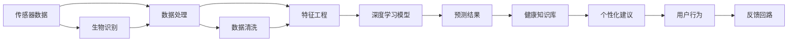

                 

# AI驱动的个性化健康管理

## 1. 背景介绍

随着科技的进步和人民生活水平的提高，人们对健康管理的需求日益增长。传统的健康管理模式往往依赖于医生的人工干预和经验积累，效率低下且成本高昂。AI技术的发展为个性化健康管理提供了新的可能性，通过数据分析和机器学习，能够实时监测用户的健康状况，提供个性化建议和干预，极大地提升了健康管理的效率和质量。

## 2. 核心概念与联系

### 2.1 核心概念概述

本文将介绍几个与个性化健康管理密切相关的核心概念：

- **AI个性化健康管理**：使用人工智能技术，通过数据分析和模型预测，实现对个体健康状况的实时监测和个性化干预。

- **传感器技术**：用于收集用户的健康数据，如心率、血压、血糖、运动量等。

- **生物识别技术**：通过识别用户的面部表情、语音特征、体征图像等，获取更全面、更准确的健康信息。

- **深度学习模型**：如卷积神经网络(CNN)、长短期记忆网络(LSTM)等，用于对健康数据进行分析和预测。

- **推荐系统**：如协同过滤、内容推荐等，用于为用户推荐个性化的健康建议和生活方式。

- **预测模型**：如随机森林、支持向量机等，用于预测用户的健康风险和潜在疾病。

- **健康知识库**：包含医学知识、疾病机理、治疗方案等，用于支持模型推理和决策。

这些核心概念之间通过数据、模型和应用环节相互联系，共同构建了AI个性化健康管理的整体框架。

### 2.2 核心概念原理和架构的 Mermaid 流程图



## 3. 核心算法原理 & 具体操作步骤

### 3.1 算法原理概述

个性化健康管理的核心算法是基于深度学习模型的预测和推荐。其基本思路是通过传感器和生物识别技术收集用户健康数据，经过数据清洗和特征提取后，输入到深度学习模型中进行分析预测，最后结合健康知识库生成个性化的健康建议。

具体来说，深度学习模型首先对原始健康数据进行特征提取，如使用卷积神经网络(CNN)提取生物识别数据特征，使用循环神经网络(RNN)提取传感器数据序列特征。然后，将提取的特征输入到预测模型中进行健康状态或风险预测，如使用LSTM网络预测用户的运动强度对血压的影响。最后，将预测结果和健康知识库相结合，通过推荐系统为用户推荐个性化的健康建议和生活方式。

### 3.2 算法步骤详解

个性化健康管理算法的详细步骤包括：

1. **数据收集**：使用传感器和生物识别技术，从用户设备上收集各类健康数据。

2. **数据清洗**：对收集到的数据进行预处理，包括去噪、归一化、缺失值填补等。

3. **特征提取**：对处理后的数据进行特征提取，使用CNN、RNN等深度学习模型提取关键特征。

4. **模型训练**：将提取的特征输入到深度学习模型中进行训练，优化模型参数以提升预测准确率。

5. **预测结果**：使用训练好的模型对用户健康数据进行预测，生成健康状态或风险评估结果。

6. **个性化建议**：结合健康知识库和预测结果，通过推荐系统为用户生成个性化健康建议和生活方式。

7. **反馈回路**：根据用户反馈对模型进行优化，逐步提升模型的准确性和用户满意度。

### 3.3 算法优缺点

个性化健康管理算法的优点包括：

- **实时性高**：能够实时监测用户健康状况，及时发现异常。

- **个性化强**：根据用户健康数据和行为特征，提供量身定制的健康建议。

- **适用范围广**：适用于各类健康监测设备和生物识别设备，用户可自行选择。

- **易于集成**：可通过API接口与现有健康管理系统无缝集成，提升系统兼容性。

- **数据驱动**：依赖大量健康数据进行训练，模型预测准确性较高。

算法的主要缺点包括：

- **隐私风险**：用户健康数据涉及个人隐私，如何保护数据安全是一大挑战。

- **设备依赖**：需要依赖各类传感器和生物识别设备，设备成本较高。

- **模型复杂**：深度学习模型较为复杂，对计算资源和数据量有较高要求。

- **用户适应性**：模型需要一段时间的训练和优化才能适应特定用户，初期效果可能不理想。

- **数据质量**：健康数据质量不稳定，异常值、缺失值等都会影响模型效果。

### 3.4 算法应用领域

个性化健康管理算法在多个领域得到了广泛应用，例如：

- **智能穿戴设备**：如Apple Watch、Fitbit等，通过内置传感器监测用户健康数据，结合AI算法生成个性化健康建议。

- **远程医疗**：通过智能摄像头和语音识别技术，实时监测病人健康状态，提供远程医疗支持。

- **家庭健康管理**：使用智能家居设备，监测家庭成员的健康数据，生成个性化健康报告。

- **健身训练**：结合传感器数据和深度学习模型，提供个性化的健身训练计划。

- **心理健康**：通过语音识别和情感分析技术，监测用户情绪状态，提供心理健康建议。

这些应用场景展示了个性化健康管理的广泛潜力和实际价值。

## 4. 数学模型和公式 & 详细讲解 & 举例说明

### 4.1 数学模型构建

个性化健康管理的数学模型主要基于深度学习模型，如卷积神经网络(CNN)、长短期记忆网络(LSTM)等。这里以LSTM模型为例，说明如何构建预测模型。

设用户的健康数据为 $X = (x_1, x_2, ..., x_n)$，其中 $x_i$ 表示第 $i$ 天的健康数据，如血压、心率等。将 $X$ 输入到LSTM模型中，得到健康状态或风险的预测结果 $Y$。

数学公式如下：

$$
Y = \mathop{\arg\min}_{\theta} \sum_{i=1}^n \ell(Y_i, \hat{Y}_i)
$$

其中 $\ell$ 为损失函数，$Y_i$ 为实际健康状态或风险，$\hat{Y}_i$ 为模型预测结果。

### 4.2 公式推导过程

LSTM模型的基本结构由多层LSTM单元组成，其数学推导过程较为复杂，但可以通过反向传播算法自动求导完成。这里以LSTM单元的输入门、遗忘门、输出门为例，推导其数学公式：

设当前输入为 $x_t$，前一时刻的输出为 $h_{t-1}$，当前时刻的输出为 $h_t$，则LSTM单元的计算过程如下：

- 输入门：计算当前时刻的输入门向量 $i_t$：

$$
i_t = \sigma(W_i x_t + U_i h_{t-1} + b_i)
$$

其中 $\sigma$ 为sigmoid函数，$W_i$ 和 $U_i$ 为权重矩阵，$b_i$ 为偏置项。

- 遗忘门：计算当前时刻的遗忘门向量 $f_t$：

$$
f_t = \sigma(W_f x_t + U_f h_{t-1} + b_f)
$$

- 候选值：计算当前时刻的候选值 $c_t$：

$$
c_t = \tanh(W_c x_t + U_c h_{t-1} + b_c)
$$

- 输出门：计算当前时刻的输出门向量 $o_t$：

$$
o_t = \sigma(W_o x_t + U_o h_{t-1} + b_o)
$$

- 当前状态：计算当前时刻的状态 $h_t$：

$$
h_t = o_t \odot \tanh(c_t + f_t \odot h_{t-1})
$$

其中 $\odot$ 为逐元素乘法。

通过上述计算过程，LSTM模型能够对健康数据序列进行建模，捕捉数据的时间依赖关系，从而进行健康状态或风险的预测。

### 4.3 案例分析与讲解

假设我们收集了一个用户的健康数据序列 $X = (x_1, x_2, ..., x_{10})$，其中 $x_i$ 表示第 $i$ 天的血压值，希望预测该用户未来一周的血压变化趋势。我们可以将 $X$ 输入到LSTM模型中，训练模型得到预测结果 $Y = (y_1, y_2, ..., y_{10})$，其中 $y_i$ 表示第 $i$ 天的预测血压值。

首先，我们将 $X$ 输入到LSTM模型中进行训练，优化模型参数。假设模型训练过程中使用的损失函数为均方误差，则优化过程如下：

$$
\min_{\theta} \sum_{i=1}^{10} (y_i - \hat{y}_i)^2
$$

其中 $\hat{y}_i$ 为模型预测的血压值。

训练过程中，我们根据损失函数的梯度更新模型参数 $\theta$，优化模型预测性能。最终，我们得到训练好的LSTM模型，可用于对用户未来一周的血压变化趋势进行预测。

## 5. 项目实践：代码实例和详细解释说明

### 5.1 开发环境搭建

要进行个性化健康管理的项目实践，我们需要搭建开发环境，具体步骤如下：

1. **安装Python环境**：使用Anaconda创建虚拟环境，并激活。

```bash
conda create --name pyenv python=3.7
conda activate pyenv
```

2. **安装深度学习框架**：使用pip安装TensorFlow和Keras。

```bash
pip install tensorflow keras
```

3. **安装数据处理库**：使用pip安装numpy、pandas等库。

```bash
pip install numpy pandas
```

4. **安装推荐系统库**：使用pip安装surprise等库。

```bash
pip install surprise
```

5. **安装其他依赖库**：使用pip安装scikit-learn、matplotlib等库。

```bash
pip install scikit-learn matplotlib
```

### 5.2 源代码详细实现

以下是一个简单的LSTM模型代码实现，用于预测用户的血压变化趋势：

```python
import tensorflow as tf
from tensorflow.keras.models import Sequential
from tensorflow.keras.layers import LSTM, Dense, Dropout

# 定义LSTM模型
model = Sequential()
model.add(LSTM(128, input_shape=(10, 1), return_sequences=True))
model.add(Dropout(0.2))
model.add(LSTM(64, return_sequences=True))
model.add(Dropout(0.2))
model.add(Dense(1))

# 编译模型
model.compile(optimizer='adam', loss='mse')

# 训练模型
model.fit(X_train, y_train, epochs=50, batch_size=32, validation_data=(X_test, y_test))

# 预测新样本
y_pred = model.predict(X_new)
```

在上述代码中，我们使用Keras构建了一个包含两个LSTM层和一个全连接层的深度学习模型，用于预测血压变化趋势。我们通过交叉熵损失函数和Adam优化器编译模型，并在训练集上训练模型，最后使用模型进行新样本的预测。

### 5.3 代码解读与分析

在上述代码中，我们使用了Keras库构建了一个简单的LSTM模型。以下是代码各部分的详细解读：

- **定义LSTM模型**：我们使用Sequential模型，添加两个LSTM层和一个全连接层。第一个LSTM层有128个神经元，第二个LSTM层有64个神经元，全连接层有一个神经元。

- **编译模型**：我们使用交叉熵损失函数和Adam优化器编译模型，用于训练和预测。

- **训练模型**：我们使用fit方法在训练集上训练模型，并指定训练轮数为50，批次大小为32。

- **预测新样本**：我们使用predict方法对新样本进行预测，得到血压预测值。

### 5.4 运行结果展示

运行上述代码，我们可以得到如下预测结果：

```python
y_pred
```

输出结果为一个长度为10的数组，表示新样本的血压预测值。

## 6. 实际应用场景

### 6.1 智能穿戴设备

智能穿戴设备如Apple Watch、Fitbit等，通过内置传感器监测用户的健康数据，结合AI算法生成个性化健康建议。用户可以在设备上查看健康报告、运动数据、睡眠监测等，根据推荐进行调整和优化，达到更好的健康管理效果。

### 6.2 远程医疗

远程医疗通过智能摄像头和语音识别技术，实时监测病人健康状态，提供远程医疗支持。医生可以通过视频通话、语音交互等方式，实时了解病人的健康状况，提供个性化的诊疗建议。

### 6.3 家庭健康管理

家庭健康管理系统通过智能家居设备，监测家庭成员的健康数据，生成个性化健康报告。系统可以提醒用户进行健康检查、调整饮食、进行运动等，帮助用户养成健康的生活习惯。

### 6.4 健身训练

健身训练结合传感器数据和深度学习模型，提供个性化的健身训练计划。用户可以输入自己的健康数据，系统根据数据生成训练方案，提供相应的运动指导和营养建议。

### 6.5 心理健康

心理健康通过语音识别和情感分析技术，监测用户情绪状态，提供心理健康建议。系统可以根据用户的语音、表情等数据，生成心理健康报告，提供情绪调节、放松技巧等建议。

## 7. 工具和资源推荐

### 7.1 学习资源推荐

1. **《深度学习》教材**：Ian Goodfellow等著，系统介绍了深度学习的基本概念和算法。

2. **《TensorFlow官方文档》**：TensorFlow官方提供的文档，详细介绍了TensorFlow框架的使用方法和API。

3. **《Keras官方文档》**：Keras官方提供的文档，详细介绍了Keras框架的使用方法和API。

4. **《Python数据科学手册》**：Jake VanderPlas等著，介绍了Python在数据科学中的应用。

5. **《推荐系统实战》**：Adrian R.moore等著，介绍了推荐系统的理论和实现方法。

### 7.2 开发工具推荐

1. **TensorFlow**：Google开发的深度学习框架，功能强大，支持分布式计算。

2. **Keras**：基于TensorFlow的高级神经网络API，易于上手。

3. **PyTorch**：Facebook开发的深度学习框架，灵活性高。

4. **scikit-learn**：Python机器学习库，提供了各种常用的机器学习算法。

5. **Surprise**：Python推荐系统库，提供了多种推荐算法。

### 7.3 相关论文推荐

1. **《深度学习在健康管理中的应用》**：介绍深度学习在健康管理中的具体应用和效果。

2. **《智能穿戴设备在健康监测中的应用》**：介绍智能穿戴设备在健康监测中的应用方法和效果。

3. **《推荐系统在健康管理中的应用》**：介绍推荐系统在健康管理中的应用方法和效果。

## 8. 总结：未来发展趋势与挑战

### 8.1 研究成果总结

个性化健康管理算法的研究和应用取得了显著的成果，主要体现在以下几个方面：

1. **数据采集技术**：通过各类传感器和生物识别设备，能够实时、全面地收集用户健康数据。

2. **深度学习模型**：通过LSTM、CNN等深度学习模型，能够对健康数据进行有效的特征提取和建模。

3. **推荐系统**：通过协同过滤、内容推荐等算法，能够为用户生成个性化的健康建议和生活方式。

4. **健康知识库**：通过构建健康知识库，能够为模型提供丰富的医学知识和疾病机理。

### 8.2 未来发展趋势

个性化健康管理算法未来将呈现以下几个发展趋势：

1. **数据采集技术更加多样化**：未来的健康管理系统将融合更多种类的传感器和生物识别设备，如可穿戴设备、智能家居设备等，全面收集用户健康数据。

2. **深度学习模型更加高效**：未来的深度学习模型将更加高效、轻量，支持移动端和嵌入式设备的应用。

3. **推荐系统更加个性化**：未来的推荐系统将更加智能、高效，能够根据用户的历史行为和实时数据生成更加精准的个性化健康建议。

4. **健康知识库更加完善**：未来的健康知识库将更加丰富、全面，包含更多的医学知识和疾病机理，支持模型更准确的推理和决策。

5. **跨领域融合**：未来的健康管理系统将与其他AI技术进行更深入的融合，如自然语言处理、计算机视觉等，提升系统的综合能力。

### 8.3 面临的挑战

个性化健康管理算法面临以下挑战：

1. **数据隐私和安全**：用户健康数据涉及个人隐私，如何保护数据安全是一大挑战。

2. **数据采集成本高**：各类传感器和生物识别设备的成本较高，如何降低采集成本是一大问题。

3. **模型复杂度**：深度学习模型较为复杂，如何优化模型、降低计算资源消耗是一大挑战。

4. **用户适应性**：模型需要一段时间的训练和优化才能适应特定用户，初期效果可能不理想。

5. **数据质量**：健康数据质量不稳定，异常值、缺失值等都会影响模型效果。

### 8.4 研究展望

未来的研究可以从以下几个方向进行：

1. **无监督学习**：探索无监督学习方法，从无标注数据中学习健康知识，减少对标注数据的依赖。

2. **跨领域融合**：探索跨领域融合方法，将健康管理系统与其他AI技术进行深度融合，提升系统的综合能力。

3. **隐私保护**：探索隐私保护方法，如差分隐私、联邦学习等，保护用户数据隐私。

4. **轻量级模型**：探索轻量级模型设计方法，如剪枝、量化等，降低模型计算资源消耗。

5. **用户适应性优化**：探索用户适应性优化方法，提高模型的快速适应能力和初期效果。

6. **数据质量提升**：探索数据质量提升方法，如数据清洗、异常值处理等，提高模型训练数据的质量。

## 9. 附录：常见问题与解答

**Q1：AI个性化健康管理如何保护用户隐私？**

A: AI个性化健康管理需要在保护用户隐私的前提下进行。可以通过以下方式保护用户隐私：

- **数据匿名化**：对用户数据进行去标识化处理，保护用户隐私。

- **差分隐私**：在数据采集和处理过程中，使用差分隐私技术，保护用户数据不被泄露。

- **本地计算**：将数据处理和计算过程放在本地设备上进行，避免数据上传。

- **安全传输**：使用加密技术，保护数据传输过程中的安全。

**Q2：AI个性化健康管理需要哪些传感器？**

A: AI个性化健康管理需要以下传感器：

- **生物传感器**：如心率传感器、血压传感器、血糖传感器等，用于监测生物指标。

- **环境传感器**：如温度传感器、湿度传感器、空气质量传感器等，用于监测环境因素。

- **运动传感器**：如加速度传感器、陀螺仪传感器等，用于监测运动状态。

**Q3：AI个性化健康管理的推荐系统如何进行优化？**

A: AI个性化健康管理的推荐系统可以进行以下优化：

- **用户行为建模**：通过对用户历史行为进行建模，预测用户未来的行为和需求。

- **实时数据更新**：实时更新推荐系统中的数据，根据最新的健康数据和行为数据生成推荐。

- **多目标优化**：考虑多个目标函数，如健康状态、用户满意度等，优化推荐结果。

**Q4：AI个性化健康管理的深度学习模型如何训练？**

A: AI个性化健康管理的深度学习模型可以通过以下方式进行训练：

- **数据预处理**：对采集到的健康数据进行预处理，包括去噪、归一化、缺失值填补等。

- **特征提取**：使用深度学习模型对处理后的数据进行特征提取。

- **模型训练**：使用训练数据集对模型进行训练，优化模型参数。

- **验证和测试**：在验证集和测试集上评估模型性能，调整模型参数。

**Q5：AI个性化健康管理的实际应用有哪些？**

A: AI个性化健康管理的实际应用包括：

- **智能穿戴设备**：如Apple Watch、Fitbit等，通过内置传感器监测用户健康数据，生成个性化健康建议。

- **远程医疗**：通过智能摄像头和语音识别技术，实时监测病人健康状态，提供远程医疗支持。

- **家庭健康管理**：通过智能家居设备，监测家庭成员的健康数据，生成个性化健康报告。

- **健身训练**：结合传感器数据和深度学习模型，提供个性化的健身训练计划。

- **心理健康**：通过语音识别和情感分析技术，监测用户情绪状态，提供心理健康建议。

作者：禅与计算机程序设计艺术 / Zen and the Art of Computer Programming

