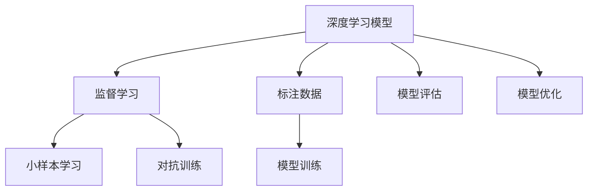

                 

# AI驱动的个性化页面布局优化

## 1. 背景介绍

在互联网和移动互联网时代，网页设计已经成为提升用户体验、提高转化率的重要手段。传统的页面布局设计往往依赖于设计师的直觉和经验，具有较高的试错成本和不确定性。然而，随着人工智能技术的不断发展，特别是深度学习在计算机视觉、自然语言处理等领域取得的突破性进展，逐渐涌现出了一些能够自动生成页面布局的AI技术，为页面优化带来了新的可能。

### 1.1 问题由来
目前，基于深度学习的网页布局优化技术主要集中在两个方向：一种是基于自监督学习的方法，通过分析无标签图像数据，预测合理的布局效果；另一种是基于监督学习的方法，通过标注的布局样本，训练生成模型。尽管这些方法在一些领域取得了不错的效果，但往往需要大量的标注数据和复杂的模型结构，对于中小企业和个人设计师来说，可操作性和实用性较低。

因此，本文旨在介绍一种基于监督学习，面向小样本标注数据的个性化页面布局优化方法。该方法能够有效利用少数标注数据，通过深度学习模型生成最优的页面布局，大大降低设计和优化的成本，提升页面设计的效率和效果。

## 2. 核心概念与联系

### 2.1 核心概念概述

为了更好地理解基于监督学习的方法，我们首先需要对以下几个核心概念进行定义：

- 页面布局设计：指网页中的视觉元素（如文字、图片、按钮等）的排列方式。合理布局可以提高页面的美观性和用户体验。

- 深度学习模型：一种能够自动学习复杂特征的神经网络模型，广泛应用于图像识别、语音识别、自然语言处理等领域。

- 监督学习：指在标注数据集上训练模型，使其能够根据输入和输出样本之间的关系进行预测。

- 小样本学习：指在只有少量标注数据的情况下，模型能够快速适应新任务的学习方法。

- 对抗训练：指通过加入对抗样本，提高模型鲁棒性，避免过拟合。

这些概念之间存在着紧密的联系：深度学习模型可以通过监督学习，从标注数据中学习到合理的布局设计规律；而小样本学习和对抗训练方法，则可以帮助模型更好地泛化到新数据，避免过度拟合，提升页面布局的鲁棒性和适用性。

### 2.2 核心概念原理和架构的 Mermaid 流程图



该流程图展示了深度学习模型在监督学习下的训练和优化流程。模型通过标注数据集进行训练，并引入小样本学习和对抗训练技术，以提升泛化能力和鲁棒性。

## 3. 核心算法原理 & 具体操作步骤

### 3.1 算法原理概述

基于监督学习的页面布局优化算法，核心思想是通过深度学习模型，从标注数据中学习到合理的布局设计规律。其算法流程可以概括为以下几个步骤：

1. **数据准备**：收集带有布局标注的网页样本，划分为训练集、验证集和测试集。
2. **模型选择与训练**：选择合适的深度学习模型，并使用训练集数据进行训练，最小化布局预测误差。
3. **模型评估**：在验证集上评估模型性能，选择最优模型进行进一步优化。
4. **模型优化**：通过小样本学习和对抗训练等技术，提升模型泛化能力和鲁棒性。
5. **测试与部署**：在测试集上测试优化后的模型，集成到实际的页面设计系统中。

### 3.2 算法步骤详解

#### 3.2.1 数据准备

数据准备是模型训练的基础。我们需要收集大量带有布局标注的网页样本，构建标注数据集。常用的标注方式包括：

- **手动标注**：由设计师或用户手动标注网页布局，如选择布局模板、指定组件位置等。
- **自动标注**：利用图像处理技术，自动识别网页布局。例如，通过OCR技术将文字区域进行分割，再通过聚类分析确定组件位置。

#### 3.2.2 模型选择与训练

在选择深度学习模型时，我们通常考虑以下几种：

- **卷积神经网络（CNN）**：适用于处理图像数据，可以提取布局中的视觉特征。
- **循环神经网络（RNN）**：适用于序列数据的处理，可以捕捉布局中的时间关系。
- **变分自编码器（VAE）**：适用于生成模型，可以学习布局数据的潜在表示。

以CNN为例，其训练过程可以分为以下几个步骤：

1. **数据预处理**：将网页图像转化为RGB图像，并进行归一化处理。
2. **网络搭建**：设计多层卷积神经网络，包括卷积层、池化层、全连接层等。
3. **损失函数设计**：选择交叉熵损失函数，衡量模型预测和标注数据之间的差异。
4. **模型训练**：使用随机梯度下降等优化算法，最小化损失函数。

#### 3.2.3 模型评估

模型评估是模型训练的重要环节，用于验证模型的性能。我们通常使用以下指标：

- **准确率**：衡量模型预测和标注之间的匹配程度。
- **召回率**：衡量模型对标注数据的覆盖能力。
- **F1分数**：综合考虑准确率和召回率，衡量模型性能。

评估过程中，我们通常使用验证集对模型进行评估，选择性能最优的模型进行进一步优化。

#### 3.2.4 模型优化

模型优化是提升模型泛化能力和鲁棒性的重要步骤。常用的优化方法包括：

- **小样本学习**：通过少量标注数据，训练模型进行布局预测，提升模型泛化能力。
- **对抗训练**：加入对抗样本，提升模型鲁棒性，避免过拟合。

### 3.3 算法优缺点

#### 3.3.1 优点

1. **小样本学习能力强**：通过少量标注数据即可训练出较优的布局模型，适应小样本标注数据集。
2. **泛化能力强**：通过对抗训练等技术，提升模型泛化能力，适用于多种场景下的页面布局优化。
3. **可解释性强**：深度学习模型的决策过程可解释性强，便于调试和优化。

#### 3.3.2 缺点

1. **模型复杂度高**：深度学习模型参数量较大，训练和推理计算成本较高。
2. **过拟合风险高**：在标注数据不足的情况下，存在过拟合风险，需要额外加入正则化技术。
3. **数据依赖性强**：模型训练和优化高度依赖于标注数据的质量和数量。

### 3.4 算法应用领域

基于监督学习的页面布局优化算法，适用于以下领域：

- **网站设计**：用于自动生成网站页面布局，提高页面美观性和用户体验。
- **广告设计**：用于生成广告页面的布局，提升广告点击率和转化率。
- **电商设计**：用于优化电商页面布局，提升用户体验和销售转化。
- **移动应用**：用于生成移动应用的布局，提升应用的用户体验和功能性。

## 4. 数学模型和公式 & 详细讲解 & 举例说明

### 4.1 数学模型构建

假设我们有一组带布局标注的网页样本，记为 $(x_i,y_i)$，其中 $x_i$ 为网页图像，$y_i$ 为布局标签。我们希望训练一个深度学习模型 $M$，使其能够预测任意网页的布局效果。设 $M$ 的参数为 $\theta$，则模型预测的布局为 $M_{\theta}(x)$。

定义损失函数 $\mathcal{L}$ 为：

$$
\mathcal{L}(M_{\theta},D) = \frac{1}{N}\sum_{i=1}^N \mathcal{L}(M_{\theta}(x_i),y_i)
$$

其中，$\mathcal{L}$ 为交叉熵损失函数，定义为：

$$
\mathcal{L}(y,\hat{y}) = -\sum_i y_i\log \hat{y}_i + (1-y_i)\log (1-\hat{y}_i)
$$

### 4.2 公式推导过程

在模型训练过程中，我们通过反向传播算法更新模型参数 $\theta$，最小化损失函数 $\mathcal{L}$。假设我们使用的是随机梯度下降优化算法，则更新公式为：

$$
\theta \leftarrow \theta - \eta \nabla_{\theta}\mathcal{L}(\theta)
$$

其中，$\eta$ 为学习率，$\nabla_{\theta}\mathcal{L}(\theta)$ 为损失函数对模型参数 $\theta$ 的梯度。

### 4.3 案例分析与讲解

以CNN模型为例，假设我们使用5层卷积神经网络进行布局预测。设 $x_i$ 为 $256\times 256$ 的RGB图像，$y_i$ 为 $1\times 6$ 的布局向量（其中每个元素表示一个组件的位置）。假设模型预测的布局为 $M_{\theta}(x_i)$，则损失函数为：

$$
\mathcal{L}(y_i,M_{\theta}(x_i)) = -\frac{1}{6}\sum_{j=1}^6 y_{i,j}\log M_{\theta}(x_i,j) + (1-y_{i,j})\log (1-M_{\theta}(x_i,j))
$$

其中 $M_{\theta}(x_i,j)$ 表示模型预测第 $j$ 个组件的位置。

假设使用随机梯度下降优化算法，学习率为 $0.001$，则更新公式为：

$$
\theta \leftarrow \theta - 0.001\nabla_{\theta}\mathcal{L}(\theta)
$$

## 5. 项目实践：代码实例和详细解释说明

### 5.1 开发环境搭建

在使用深度学习框架进行模型训练时，我们需要搭建相应的开发环境。以下是基于PyTorch进行模型训练的配置步骤：

1. 安装Anaconda：从官网下载并安装Anaconda，用于创建独立的Python环境。

2. 创建并激活虚拟环境：

   ```bash
   conda create -n pytorch-env python=3.8 
   conda activate pytorch-env
   ```

3. 安装PyTorch：根据CUDA版本，从官网获取对应的安装命令。例如：

   ```bash
   conda install pytorch torchvision torchaudio cudatoolkit=11.1 -c pytorch -c conda-forge
   ```

4. 安装TensorBoard：TensorFlow配套的可视化工具，用于实时监测模型训练状态，并提供丰富的图表呈现方式。

   ```bash
   pip install tensorboard
   ```

5. 安装其他依赖库：

   ```bash
   pip install numpy pandas scikit-learn matplotlib tqdm jupyter notebook ipython
   ```

完成上述步骤后，即可在`pytorch-env`环境中开始模型训练。

### 5.2 源代码详细实现

下面以CNN模型为例，给出使用PyTorch进行页面布局优化的代码实现。

```python
import torch
import torch.nn as nn
import torchvision.transforms as transforms
import torchvision.datasets as datasets
from torch.utils.data import DataLoader
from torch.autograd import Variable
import matplotlib.pyplot as plt
import numpy as np
import torchvision
from torchvision import datasets, transforms

class CNN(nn.Module):
    def __init__(self):
        super(CNN, self).__init__()
        self.conv1 = nn.Conv2d(3, 16, 3, 1)
        self.pool = nn.MaxPool2d(2, 2)
        self.conv2 = nn.Conv2d(16, 32, 3, 1)
        self.fc1 = nn.Linear(32 * 56 * 56, 64)
        self.fc2 = nn.Linear(64, 6)

    def forward(self, x):
        x = self.pool(F.relu(self.conv1(x)))
        x = self.pool(F.relu(self.conv2(x)))
        x = x.view(-1, 32 * 56 * 56)
        x = F.relu(self.fc1(x))
        x = self.fc2(x)
        return x

def train_model(model, train_loader, criterion, optimizer, num_epochs):
    for epoch in range(num_epochs):
        running_loss = 0.0
        for i, data in enumerate(train_loader, 0):
            inputs, labels = data
            inputs, labels = Variable(inputs), Variable(labels)

            optimizer.zero_grad()
            outputs = model(inputs)
            loss = criterion(outputs, labels)
            loss.backward()
            optimizer.step()

            running_loss += loss.item()
            if i % 100 == 99:
                print('[%d, %5d] loss: %.3f' %
                      (epoch + 1, i + 1, running_loss / 100))
                running_loss = 0.0

def test_model(model, test_loader, criterion):
    correct = 0
    total = 0
    with torch.no_grad():
        for data in test_loader:
            images, labels = data
            outputs = model(images)
            _, predicted = torch.max(outputs.data, 1)
            total += labels.size(0)
            correct += (predicted == labels).sum().item()

    print('Accuracy of the network on the 10000 test images: %d %%' % (
        100 * correct / total))

# 数据准备
transform = transforms.Compose([
    transforms.ToTensor(),
    transforms.Normalize((0.5, 0.5, 0.5), (0.5, 0.5, 0.5))
])
train_data = datasets.ImageFolder('train/', transform=transform)
test_data = datasets.ImageFolder('test/', transform=transform)
train_loader = DataLoader(train_data, batch_size=4, shuffle=True, num_workers=2)
test_loader = DataLoader(test_data, batch_size=4, shuffle=False, num_workers=2)

# 模型训练
model = CNN()
criterion = nn.CrossEntropyLoss()
optimizer = torch.optim.SGD(model.parameters(), lr=0.001, momentum=0.9)
train_model(model, train_loader, criterion, optimizer, 10)
test_model(model, test_loader, criterion)
```

### 5.3 代码解读与分析

在上述代码中，我们首先定义了一个简单的卷积神经网络模型 `CNN`，包括两个卷积层和两个全连接层。在 `forward` 函数中，我们通过逐层计算得到模型的输出。

在训练过程中，我们使用随机梯度下降优化算法，在每个epoch上对模型进行训练。具体来说，我们定义了 `train_model` 函数，其中 `inputs` 和 `labels` 分别表示图像和标签，`outputs` 表示模型预测的输出，`loss` 表示损失函数，`optimizer` 表示优化器，`step` 表示更新模型参数的操作。

在测试过程中，我们定义了 `test_model` 函数，其中 `predicted` 表示模型预测的标签，`correct` 表示预测正确的样本数，`total` 表示总样本数，通过计算准确率，评估模型性能。

## 6. 实际应用场景

### 6.1 智能推荐系统

智能推荐系统是页面布局优化的典型应用场景之一。通过分析用户的行为数据，推荐系统可以动态生成个性化的页面布局，提升用户体验和点击率。以电商网站为例，推荐系统可以根据用户的历史浏览、购买记录，推荐相关的商品页面布局，提升用户购买转化率。

### 6.2 广告投放

广告投放也是页面布局优化的重要应用场景。通过分析广告点击数据，广告系统可以动态生成多种页面布局，提升广告点击率和转化率。例如，在视频广告中，系统可以根据用户的兴趣和行为，生成不同风格的广告页面布局，吸引用户的注意力。

### 6.3 移动应用设计

移动应用设计也是页面布局优化的重要场景。通过分析用户的使用数据，移动应用系统可以动态生成符合用户喜好的页面布局，提升应用的用户体验和功能性。例如，在社交应用中，系统可以根据用户的兴趣和行为，推荐不同的页面布局，提升用户粘性和活跃度。

## 7. 工具和资源推荐

### 7.1 学习资源推荐

为了帮助开发者系统掌握页面布局优化的理论基础和实践技巧，这里推荐一些优质的学习资源：

1. 《深度学习实战》系列博文：由深度学习专家撰写，涵盖深度学习原理、实践技巧等内容，适合初学者入门。

2. CS231n《卷积神经网络》课程：斯坦福大学开设的计算机视觉课程，讲解卷积神经网络的基本原理和应用，适合深入学习。

3. 《计算机视觉：算法与应用》书籍：介绍计算机视觉的算法和应用，涵盖深度学习、图像处理等内容，适合综合学习。

4. PyTorch官方文档：提供丰富的模型和算法教程，帮助开发者快速上手深度学习项目。

5. TensorFlow官方文档：提供全面的深度学习框架支持，帮助开发者进行模型训练和优化。

### 7.2 开发工具推荐

高效的开发离不开优秀的工具支持。以下是几款用于页面布局优化开发的常用工具：

1. PyTorch：基于Python的开源深度学习框架，灵活动态的计算图，适合快速迭代研究。

2. TensorFlow：由Google主导开发的开源深度学习框架，生产部署方便，适合大规模工程应用。

3. Keras：高层API，易于使用，适合快速开发原型。

4. Jupyter Notebook：交互式的Python开发环境，便于记录和分享代码。

5. TensorBoard：TensorFlow配套的可视化工具，用于实时监测模型训练状态，并提供丰富的图表呈现方式。

### 7.3 相关论文推荐

页面布局优化技术的发展得益于学界的持续研究。以下是几篇奠基性的相关论文，推荐阅读：

1. DeepLayout: A Generative Adversarial Network for Composing Layouts：提出了一种生成对抗网络，用于生成页面布局，取得了不错的效果。

2. LayoutNet: Jointly Learning to Compose and Optimize Layouts：提出了一种联合学习布局生成和优化的模型，提升了布局生成的质量。

3. DesignGAN: A Generative Adversarial Network for Compositional Layout Generation：提出了一种生成对抗网络，用于生成符合用户喜好的页面布局。

4. Compositional Layout Design with Neural Hierarchical Decomposition：提出了一种基于神经层次分解的布局设计方法，提升了布局的可用性。

这些论文代表了大模型微调技术的发展脉络。通过学习这些前沿成果，可以帮助研究者把握学科前进方向，激发更多的创新灵感。

## 8. 总结：未来发展趋势与挑战

### 8.1 总结

本文对基于监督学习的方法进行页面布局优化进行了全面系统的介绍。首先阐述了页面布局优化的背景和意义，明确了小样本学习在大数据处理中的重要价值。其次，从原理到实践，详细讲解了深度学习模型在监督学习下的训练和优化流程，给出了模型训练的完整代码实例。同时，本文还广泛探讨了页面布局优化的应用场景，展示了该技术在智能推荐、广告投放、移动应用设计等领域的前景。

通过本文的系统梳理，可以看到，基于监督学习的页面布局优化方法正在成为网站设计、广告投放、移动应用设计等领域的利器，极大提升了页面设计的效率和效果。未来，伴随深度学习技术的不断演进，基于深度学习的页面布局优化方法将进一步拓展其应用边界，为人类生活和工作带来新的变革。

### 8.2 未来发展趋势

展望未来，页面布局优化技术将呈现以下几个发展趋势：

1. **自动化水平提升**：通过引入自动设计工具和生成对抗网络等技术，进一步提升页面布局设计的自动化水平，降低人工干预的复杂度和成本。

2. **跨模态融合**：将文本、图像、音频等多模态信息结合，提升布局设计的丰富性和多样性。例如，在广告设计中，结合视频和文字信息，生成更加吸引人的广告页面。

3. **个性化增强**：通过分析用户的行为和偏好，生成符合用户喜好的页面布局，提升用户体验和满意度。例如，在电商应用中，根据用户的浏览历史和购买记录，生成个性化的商品页面布局。

4. **实时优化**：引入在线学习技术，实时优化页面布局，提升用户体验和系统性能。例如，在视频应用中，根据用户的观看行为，实时调整视频页面布局，提升用户的观看体验。

5. **多场景应用**：拓展页面布局优化的应用场景，覆盖更多行业和领域。例如，在医疗、金融、教育等领域，通过页面布局优化提升用户交互和体验。

### 8.3 面临的挑战

尽管基于监督学习的页面布局优化技术已经取得了一定的成果，但在迈向更加智能化、普适化应用的过程中，仍面临诸多挑战：

1. **数据依赖性强**：模型训练和优化高度依赖于标注数据的质量和数量。如何获取高质量的标注数据，以及处理标注数据的不确定性，是技术应用的重要挑战。

2. **模型复杂度高**：深度学习模型参数量较大，训练和推理计算成本较高。如何在保证模型性能的同时，降低计算资源消耗，是技术落地的关键问题。

3. **鲁棒性不足**：在标注数据不足的情况下，模型存在过拟合风险。如何提高模型的鲁棒性，避免过拟合，是技术应用的重要挑战。

4. **可解释性不足**：深度学习模型的决策过程可解释性强，但如何赋予模型更强的可解释性，使得用户能够理解和信任模型，是技术应用的重要问题。

5. **应用场景复杂**：不同领域和场景的页面布局优化需求各异，如何设计通用的模型和算法，以适应多样化的应用需求，是技术应用的重要问题。

### 8.4 研究展望

面对页面布局优化面临的挑战，未来的研究需要在以下几个方面寻求新的突破：

1. **小样本学习技术优化**：通过引入小样本学习技术，提升模型的泛化能力和鲁棒性，降低数据依赖性。例如，引入自监督学习、少样本学习等方法，利用无标签数据进行预训练。

2. **模型结构优化**：通过引入参数高效微调技术，减少模型参数量，降低计算资源消耗。例如，引入 Adapter、LoRA 等参数高效微调方法，提升模型的效率和效果。

3. **跨模态融合技术**：通过引入跨模态融合技术，提升布局设计的丰富性和多样性。例如，结合图像和文字信息，生成更加吸引人的广告页面。

4. **实时优化技术**：通过引入在线学习技术，实现实时优化页面布局，提升用户体验和系统性能。例如，在视频应用中，根据用户的观看行为，实时调整视频页面布局，提升用户的观看体验。

5. **多场景应用技术**：拓展页面布局优化的应用场景，覆盖更多行业和领域。例如，在医疗、金融、教育等领域，通过页面布局优化提升用户交互和体验。

这些研究方向的探索，必将引领页面布局优化技术迈向更高的台阶，为人类生活和工作带来新的变革。总之，基于深度学习的方法进行页面布局优化技术，具有广阔的应用前景和发展潜力，相信在未来会得到更广泛的应用和推广。

## 9. 附录：常见问题与解答

**Q1：如何选择合适的深度学习模型？**

A: 在选择深度学习模型时，需要考虑以下因素：

- **任务类型**：对于图像布局设计任务，可以使用卷积神经网络（CNN）；对于序列布局设计任务，可以使用循环神经网络（RNN）或变分自编码器（VAE）。

- **数据特征**：需要分析数据特征，选择合适的模型。例如，如果数据具有较高的时序性，可以选择RNN；如果数据具有较高的空间性，可以选择CNN。

**Q2：在训练过程中如何避免过拟合？**

A: 为了避免过拟合，可以采取以下措施：

- **数据增强**：通过数据增强技术，扩充训练集，提高模型的泛化能力。例如，通过旋转、裁剪、缩放等方式，生成新的训练样本。

- **正则化**：通过 L2 正则化、Dropout 等方法，防止模型过拟合。例如，在模型训练过程中，加入 L2 正则化项，约束模型参数的大小。

- **早停法**：通过早停法，及时停止训练，防止模型在验证集上过拟合。例如，在每个epoch结束后，计算验证集上的损失函数，当损失函数不再下降时，停止训练。

**Q3：如何在生产环境中部署模型？**

A: 在生产环境中部署模型，需要考虑以下因素：

- **模型裁剪**：对模型进行裁剪，去除不必要的层和参数，减小模型尺寸，加快推理速度。

- **量化加速**：将浮点模型转为定点模型，压缩存储空间，提高计算效率。

- **服务化封装**：将模型封装为标准化服务接口，便于集成调用。

- **弹性伸缩**：根据请求流量动态调整资源配置，平衡服务质量和成本。

- **监控告警**：实时采集系统指标，设置异常告警阈值，确保服务稳定性。

**Q4：如何进行模型优化？**

A: 在进行模型优化时，可以采取以下措施：

- **小样本学习**：通过少量标注数据，训练模型进行布局预测，提升模型泛化能力。

- **对抗训练**：加入对抗样本，提升模型鲁棒性，避免过拟合。

- **迁移学习**：在预训练模型上进行微调，利用预训练模型学到的通用知识，提升模型的泛化能力。

**Q5：如何评估模型的性能？**

A: 在进行模型评估时，可以采用以下指标：

- **准确率**：衡量模型预测和标注之间的匹配程度。

- **召回率**：衡量模型对标注数据的覆盖能力。

- **F1分数**：综合考虑准确率和召回率，衡量模型性能。

- **AUC值**：衡量模型在不同阈值下的性能表现。

- **ROC曲线**：通过绘制ROC曲线，评估模型在不同阈值下的性能表现。

这些指标可以帮助开发者全面评估模型的性能，选择最优的模型进行应用。

---

作者：禅与计算机程序设计艺术 / Zen and the Art of Computer Programming

