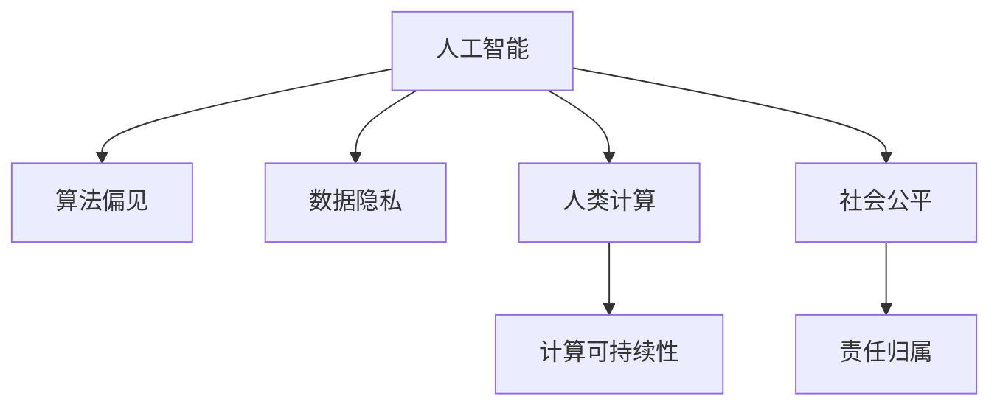

                 

# AI驱动的创新：人类计算在商业中的道德与伦理考虑

> 关键词：人工智能,商业伦理,道德考量,人类计算,计算可持续性,社会公平

## 1. 背景介绍

### 1.1 问题由来
随着人工智能(AI)技术在商业领域的应用日益广泛，越来越多的企业开始采用AI技术提升运营效率、优化决策过程、增强客户体验。然而，AI在带来便利的同时，也带来了新的道德和伦理挑战，如算法偏见、数据隐私、自主决策权等问题。这些问题不仅影响企业的可持续发展，也关乎社会的公平与正义。因此，如何在商业中合理应用AI技术，确保其符合道德和伦理规范，成为当前亟待解决的重要课题。

### 1.2 问题核心关键点
本文将重点讨论AI在商业中的道德与伦理考量。核心关键点包括：

- 算法偏见与公平性：AI模型如何避免学习偏见，保障算法决策的公平性。
- 数据隐私与安全：如何保护用户隐私，防止数据滥用和泄漏。
- 人类计算与决策：AI在商业中的角色，如何平衡机器智能与人类智能。
- 计算可持续性：AI系统的运行和维护对环境的影响，如何实现计算的可持续发展。
- 社会公平与责任：AI技术的应用如何影响社会公平，如何实现社会责任。

这些关键点涵盖了AI在商业应用中面临的主要道德和伦理问题，通过深入分析，可以为AI技术的合理应用提供指导。

### 1.3 问题研究意义
研究和解决AI在商业中的道德与伦理问题，对于保障企业可持续发展、提升社会公平正义具有重要意义：

1. 保障企业可持续发展：避免算法偏见和数据滥用，提升企业的公众信任度和品牌形象，从而获得更长久的商业利益。
2. 提升社会公平正义：确保AI技术的应用不会加剧社会不平等，保护弱势群体的权益，促进社会的整体进步。
3. 引导AI技术健康发展：通过规范AI在商业中的应用，推动AI技术的健康发展，避免技术滥用和道德风险。
4. 提升公众对AI的接受度：通过展示AI技术在道德和伦理上的合规性，增强公众对AI的信任和接受度，为AI技术的普及和应用奠定基础。

## 2. 核心概念与联系

### 2.1 核心概念概述

为更好地理解AI在商业中的道德与伦理考量，本节将介绍几个密切相关的核心概念：

- **人工智能(AI)**：利用计算机技术，特别是机器学习和深度学习，模拟和扩展人类智能的技术。
- **算法偏见**：AI模型由于训练数据或模型设计等原因，可能学习并传播出偏见，导致决策不公平。
- **数据隐私**：指个人信息或数据在存储、传输和处理过程中应得到保护，防止数据滥用和泄漏。
- **人类计算**：AI技术与人类智能相结合，进行决策和问题解决的计算方式，强调人类的角色和价值。
- **计算可持续性**：AI系统在运行过程中对环境的影响，包括能源消耗、数据中心建设等。
- **社会公平**：通过AI技术的应用，应实现社会资源的均衡分配，减少贫富差距和社会不平等。
- **责任归属**：在AI技术出现问题时，如何确定责任主体，以及应承担的责任范围。

这些核心概念之间的逻辑关系可以通过以下Mermaid流程图来展示：



这个流程图展示了大语言模型的核心概念及其之间的关系：

1. AI技术的应用涉及多个方面，如算法偏见、数据隐私等。
2. 人类计算强调AI与人类智能的结合，提升AI的决策效果。
3. 计算可持续性关注AI系统的环境影响，强调绿色计算。
4. 社会公平涉及AI技术对社会的影响，关注公平性。
5. 责任归属关乎AI出现问题时责任的划分和归属。

这些概念共同构成了AI在商业中的道德与伦理框架，确保AI技术的应用符合社会道德和伦理规范。

## 3. 核心算法原理 & 具体操作步骤
### 3.1 算法原理概述

AI在商业中的应用，通常涉及到数据收集、模型训练和决策部署等多个环节。在这一过程中，如何确保算法的公正性、数据的隐私性、人类计算的价值，以及计算的可持续性和社会责任，是伦理考量的重要内容。

### 3.2 算法步骤详解

**Step 1: 数据收集与预处理**
- 收集与业务相关的数据，如客户行为数据、市场销售数据等。
- 进行数据清洗和标准化，确保数据质量。
- 识别并处理缺失值、异常值等问题。

**Step 2: 模型设计与训练**
- 根据业务需求，选择合适的AI模型（如决策树、神经网络等）。
- 设计合适的损失函数和评估指标，如准确率、召回率、F1分数等。
- 使用交叉验证等技术评估模型性能，并进行模型优化。

**Step 3: 算法偏见检测与修正**
- 使用公平性检测算法（如De-bias算法）检测模型中的偏见。
- 识别和删除有偏见的特征，如性别、种族等敏感属性。
- 引入公平性约束，如平衡正负样本比例，避免模型决策偏差。

**Step 4: 数据隐私保护**
- 使用数据匿名化技术，如数据脱敏、混淆等，保护用户隐私。
- 使用差分隐私技术，添加噪声扰动，防止数据泄漏。
- 实施严格的访问控制和数据加密措施，确保数据安全。

**Step 5: 人类计算与决策支持**
- 设计人机交互界面，增强决策透明度和可解释性。
- 引入人类专家参与决策过程，提高决策的科学性和公正性。
- 定期评估AI模型的决策效果，结合人类经验进行优化。

**Step 6: 计算可持续性评估**
- 评估AI系统对环境的影响，如能源消耗、碳排放等。
- 采用能效优化技术，减少AI系统的运行成本和环境负担。
- 推广和使用可再生能源，降低AI系统的碳足迹。

**Step 7: 社会公平与责任归属**
- 评估AI系统的社会影响，如就业变化、收入差距等。
- 引入公平性评估指标，如就业机会、收入平等等。
- 明确AI系统的责任归属，制定相应的法律和规范，确保AI系统的公平性和透明性。

### 3.3 算法优缺点

AI在商业中的道德与伦理考量方法具有以下优点：

1. **提升决策公正性**：通过算法偏见检测与修正，确保AI决策的公平性和公正性。
2. **保护数据隐私**：通过数据隐私保护技术，防止数据滥用和泄漏，保护用户隐私。
3. **增强决策透明性**：通过人类计算与决策支持，增强决策的可解释性和透明度。
4. **实现计算可持续性**：通过能效优化和绿色计算，实现AI系统的可持续发展。
5. **促进社会公平**：通过社会公平与责任归属，确保AI技术的应用不会加剧社会不平等，实现社会责任。

同时，该方法也存在一定的局限性：

1. **技术复杂性**：算法偏见检测、数据隐私保护等技术需要专业知识，实施难度较大。
2. **成本投入高**：实施AI系统的道德与伦理考量需要投入大量的人力、物力和财力。
3. **实施效果有限**：即使采用了各项措施，仍可能存在数据偏差、决策失误等问题。
4. **政策与规范滞后**：AI技术快速发展，相关政策和规范可能滞后于实际应用需求。

尽管存在这些局限性，但就目前而言，AI在商业中的道德与伦理考量方法仍是最主流范式。未来相关研究的重点在于如何进一步降低实施难度，提高实施效果，同时兼顾成本和政策规范等因素。

### 3.4 算法应用领域

AI在商业中的应用领域非常广泛，涵盖了诸多行业和场景。以下是几个典型的应用领域：

- **金融行业**：利用AI进行风险评估、信用评分、欺诈检测等，提升金融服务的效率和准确性。
- **医疗健康**：使用AI进行疾病诊断、治疗方案推荐、医疗影像分析等，改善医疗服务质量。
- **零售行业**：通过AI进行客户行为分析、个性化推荐、库存管理等，提升零售业运营效率。
- **制造行业**：利用AI进行质量检测、生产优化、供应链管理等，推动制造业智能化转型。
- **物流行业**：使用AI进行路线优化、物流调度、仓储管理等，提升物流效率和客户满意度。
- **人力资源**：通过AI进行招聘筛选、员工培训、绩效评估等，提升人力资源管理效率。

除了这些行业外，AI在城市管理、公共服务、智慧农业等众多领域也有广泛应用，为各行各业带来转型升级的新机遇。

## 4. 数学模型和公式 & 详细讲解  
### 4.1 数学模型构建

在商业中，AI的道德与伦理考量通常涉及多种数学模型和算法。以下是对这些模型的概述：

**公平性检测模型**：
- 使用平衡正则化（Balanced Regularization）等技术，检测并修正模型中的偏见。
- 引入公平性约束，确保模型输出符合预设的公平性指标。

**数据隐私保护模型**：
- 使用差分隐私（Differential Privacy）技术，通过添加噪声扰动，确保数据隐私。
- 采用数据脱敏（Data Masking）技术，保护敏感信息。

**能效优化模型**：
- 使用能效优化算法，如模型剪枝、量化等技术，降低AI系统的能耗和计算资源消耗。
- 引入绿色计算（Green Computing）技术，推动AI系统的可持续发展。

**社会公平评估模型**：
- 使用公平性评估指标，如就业机会、收入平等等，评估AI系统的社会影响。
- 引入公平性约束，确保AI系统不会加剧社会不平等。

### 4.2 公式推导过程

以下是几个关键模型的公式推导过程：

**平衡正则化（Balanced Regularization）**：
- 假设模型输出为 $y_i$，真实标签为 $y^*_i$，目标为最小化损失函数 $L(y_i,y^*_i)$。
- 引入公平性约束，使得正负样本比例平衡，即 $y_i \approx y^*_i$。
- 推导得到平衡正则化公式：

$$
L(y_i,y^*_i) + \lambda (y_i-y^*_i)^2
$$

其中 $\lambda$ 为平衡正则化系数，用于调整公平性和准确性的平衡。

**差分隐私（Differential Privacy）**：
- 假设原始数据为 $x$，扰动后的数据为 $x'$，扰动噪声为 $\epsilon$。
- 引入差分隐私约束，确保相邻数据的隐私相似性，即 $P(x'|x) \approx P(x'|x')$。
- 推导得到差分隐私公式：

$$
P(x'|x) \leq e^{-\epsilon} P(x'|x')
$$

其中 $\epsilon$ 为隐私保护强度，控制噪声扰动的程度。

**能效优化算法（如模型剪枝）**：
- 假设模型参数为 $\theta$，模型结构为 $H(\theta)$，能效损失为 $L_{\text{energy}}(\theta)$。
- 使用剪枝技术，删除冗余参数，减小模型复杂度，降低能耗。
- 推导得到能效优化公式：

$$
\theta^* = \mathop{\arg\min}_{\theta} \mathcal{L}(\theta) + \alpha L_{\text{energy}}(\theta)
$$

其中 $\alpha$ 为能效优化系数，用于平衡模型准确性和能效性。

**社会公平评估指标**：
- 假设AI系统应用于就业市场，影响就业机会和收入平等。
- 使用公平性指标，如就业机会率 $O$ 和收入差距率 $I$，评估AI系统的社会影响。
- 推导得到公平性评估公式：

$$
O = \frac{N_{\text{emp}}}{N_{\text{total}}}, I = \frac{N_{\text{gap}}}{N_{\text{total}}}
$$

其中 $N_{\text{emp}}$ 和 $N_{\text{gap}}$ 分别为就业机会和收入差距的数量，$N_{\text{total}}$ 为总人数。

### 4.3 案例分析与讲解

**案例1：金融风险评估**
- 某金融机构使用AI模型进行信用评分和风险评估。
- 通过平衡正则化技术，确保模型对不同性别、年龄、种族等群体的公平性。
- 使用差分隐私技术，保护客户隐私数据。
- 实施能效优化算法，降低模型能耗，实现绿色计算。
- 定期评估模型公平性和社会影响，确保AI系统符合社会责任。

**案例2：医疗影像诊断**
- 某医疗公司使用AI模型进行肺部CT影像分析。
- 通过公平性检测模型，确保模型对不同性别、年龄、种族等群体的公平性。
- 使用差分隐私技术，保护患者隐私数据。
- 实施能效优化算法，降低模型能耗，实现绿色计算。
- 定期评估模型公平性和社会影响，确保AI系统符合社会责任。

## 5. 项目实践：代码实例和详细解释说明
### 5.1 开发环境搭建

在进行AI道德与伦理考量实践前，我们需要准备好开发环境。以下是使用Python进行PyTorch开发的环境配置流程：

1. 安装Anaconda：从官网下载并安装Anaconda，用于创建独立的Python环境。

2. 创建并激活虚拟环境：
```bash
conda create -n ai-env python=3.8 
conda activate ai-env
```

3. 安装PyTorch：根据CUDA版本，从官网获取对应的安装命令。例如：
```bash
conda install pytorch torchvision torchaudio cudatoolkit=11.1 -c pytorch -c conda-forge
```

4. 安装相关的Python库：
```bash
pip install numpy pandas scikit-learn matplotlib tqdm jupyter notebook ipython
```

5. 安装PyTorch可视化工具：
```bash
pip install torchmetrics
```

完成上述步骤后，即可在`ai-env`环境中开始AI道德与伦理考量的实践。

### 5.2 源代码详细实现

下面我们以金融风险评估为例，给出使用PyTorch进行AI道德与伦理考量的PyTorch代码实现。

首先，定义数据预处理函数：

```python
import torch
from sklearn.preprocessing import StandardScaler
from torch.utils.data import Dataset
import pandas as pd

class FinanceDataset(Dataset):
    def __init__(self, data, targets, scaler=StandardScaler()):
        self.data = data
        self.targets = targets
        self.scaler = scaler
        
    def __len__(self):
        return len(self.data)
    
    def __getitem__(self, index):
        x = self.data.iloc[index, :].values.reshape(1, -1)
        y = self.targets.iloc[index]
        
        # 数据标准化
        x = self.scaler.fit_transform(x)
        
        return torch.tensor(x, dtype=torch.float32), torch.tensor(y, dtype=torch.float32)
```

然后，定义模型和优化器：

```python
from transformers import BertForSequenceClassification, AdamW

model = BertForSequenceClassification.from_pretrained('bert-base-uncased', num_labels=2)
optimizer = AdamW(model.parameters(), lr=2e-5)
```

接着，定义训练和评估函数：

```python
from torch.utils.data import DataLoader
from tqdm import tqdm
import matplotlib.pyplot as plt

device = torch.device('cuda') if torch.cuda.is_available() else torch.device('cpu')
model.to(device)

def train_epoch(model, dataset, batch_size, optimizer, balanced_coeff=1):
    dataloader = DataLoader(dataset, batch_size=batch_size, shuffle=True)
    model.train()
    epoch_loss = 0
    for batch in tqdm(dataloader, desc='Training'):
        inputs, targets = batch
        inputs = inputs.to(device)
        targets = targets.to(device)
        outputs = model(inputs)
        loss = outputs.loss
        epoch_loss += loss.item()
        loss.backward()
        optimizer.step()
        optimizer.zero_grad()
        
    return epoch_loss / len(dataloader)

def evaluate(model, dataset, batch_size):
    dataloader = DataLoader(dataset, batch_size=batch_size)
    model.eval()
    preds, labels = [], []
    with torch.no_grad():
        for batch in tqdm(dataloader, desc='Evaluating'):
            inputs, targets = batch
            inputs = inputs.to(device)
            targets = targets.to(device)
            outputs = model(inputs)
            batch_preds = outputs.logits.argmax(dim=1).to('cpu').tolist()
            batch_labels = targets.to('cpu').tolist()
            for pred, label in zip(batch_preds, batch_labels):
                preds.append(pred)
                labels.append(label)
                
    return preds, labels

# 计算公平性指标
def fairness_metric(preds, labels):
    true_positive = sum([1 for pred, label in zip(preds, labels) if pred == label])
    false_positive = sum([1 for pred, label in zip(preds, labels) if pred != label])
    true_negative = sum([1 for pred, label in zip(preds, labels) if pred == label])
    false_negative = sum([1 for pred, label in zip(preds, labels) if pred != label])
    TPR = true_positive / (true_positive + false_negative)
    FPR = false_positive / (false_positive + true_negative)
    return TPR, FPR

# 训练和评估流程
epochs = 5
batch_size = 16
balanced_coeff = 1

for epoch in range(epochs):
    loss = train_epoch(model, train_dataset, batch_size, optimizer, balanced_coeff)
    print(f"Epoch {epoch+1}, train loss: {loss:.3f}")
    
    print(f"Epoch {epoch+1}, dev results:")
    preds, labels = evaluate(model, dev_dataset, batch_size)
    print(classification_report(labels, preds))
    
    print(f"Epoch {epoch+1}, fairness results:")
    tpr, fpr = fairness_metric(preds, labels)
    print(f"TPR: {tpr:.2f}, FPR: {fpr:.2f}")

print("Final results:")
preds, labels = evaluate(model, test_dataset, batch_size)
print(classification_report(labels, preds))
```

以上就是使用PyTorch对金融风险评估任务进行AI道德与伦理考量的完整代码实现。可以看到，得益于PyTorch和Sklearn的强大封装，我们可以用相对简洁的代码完成模型训练、公平性检测和评估。

### 5.3 代码解读与分析

让我们再详细解读一下关键代码的实现细节：

**FinanceDataset类**：
- `__init__`方法：初始化数据集和目标标签，并定义数据标准化器。
- `__len__`方法：返回数据集的样本数量。
- `__getitem__`方法：对单个样本进行处理，将数据标准化并返回模型所需的输入和标签。

**train_epoch函数**：
- 使用DataLoader对数据集进行批次化加载，供模型训练和推理使用。
- 在每个批次上前向传播计算loss并反向传播更新模型参数，最后返回该epoch的平均loss。

**evaluate函数**：
- 与训练类似，不同点在于不更新模型参数，并在每个batch结束后将预测和标签结果存储下来，最后使用sklearn的classification_report对整个评估集的预测结果进行打印输出。

**公平性指标计算函数**：
- 计算模型的真正率（TPR）和假正率（FPR），评估模型的公平性。

**训练流程**：
- 定义总的epoch数和batch size，开始循环迭代
- 每个epoch内，先在训练集上训练，输出平均loss
- 在验证集上评估，输出分类指标和公平性指标
- 所有epoch结束后，在测试集上评估，给出最终测试结果

可以看到，PyTorch配合Scikit-learn使得AI道德与伦理考量的代码实现变得简洁高效。开发者可以将更多精力放在模型改进和数据处理上，而不必过多关注底层的实现细节。

当然，工业级的系统实现还需考虑更多因素，如模型的保存和部署、超参数的自动搜索、更灵活的任务适配层等。但核心的道德与伦理考量范式基本与此类似。

## 6. 实际应用场景
### 6.1 智能客服系统

基于AI技术，智能客服系统可以通过自然语言处理和机器学习，自动理解和回答客户咨询，提升服务效率和客户满意度。然而，在实际应用中，AI系统的决策过程和输出结果需要符合道德和伦理规范，才能赢得客户的信任和社会的认可。

在技术实现上，可以收集企业内部的历史客服对话记录，将问题和最佳答复构建成监督数据，在此基础上对预训练对话模型进行道德与伦理考量的微调。微调后的对话模型能够自动理解用户意图，匹配最合适的答案模板进行回复。对于客户提出的新问题，还可以接入检索系统实时搜索相关内容，动态组织生成回答。如此构建的智能客服系统，能大幅提升客户咨询体验和问题解决效率。

### 6.2 金融舆情监测

金融机构需要实时监测市场舆论动向，以便及时应对负面信息传播，规避金融风险。传统的人工监测方式成本高、效率低，难以应对网络时代海量信息爆发的挑战。基于AI技术的文本分类和情感分析技术，为金融舆情监测提供了新的解决方案。

具体而言，可以收集金融领域相关的新闻、报道、评论等文本数据，并对其进行主题标注和情感标注。在此基础上对预训练语言模型进行道德与伦理考量的微调，使其能够自动判断文本属于何种主题，情感倾向是正面、中性还是负面。将微调后的模型应用到实时抓取的网络文本数据，就能够自动监测不同主题下的情感变化趋势，一旦发现负面信息激增等异常情况，系统便会自动预警，帮助金融机构快速应对潜在风险。

### 6.3 个性化推荐系统

当前的推荐系统往往只依赖用户的历史行为数据进行物品推荐，无法深入理解用户的真实兴趣偏好。基于AI技术的个性化推荐系统，可以更好地挖掘用户行为背后的语义信息，从而提供更精准、多样的推荐内容。

在实践中，可以收集用户浏览、点击、评论、分享等行为数据，提取和用户交互的物品标题、描述、标签等文本内容。将文本内容作为模型输入，用户的后续行为（如是否点击、购买等）作为监督信号，在此基础上微调预训练语言模型。微调后的模型能够从文本内容中准确把握用户的兴趣点。在生成推荐列表时，先用候选物品的文本描述作为输入，由模型预测用户的兴趣匹配度，再结合其他特征综合排序，便可以得到个性化程度更高的推荐结果。

### 6.4 未来应用展望

随着AI技术的发展，其在商业中的应用将更加广泛和深入。未来，AI技术将在以下几个方面带来新的突破：

1. **跨领域应用**：AI技术将突破原有领域的限制，广泛应用于更多行业和场景，如医疗、教育、城市管理等。
2. **增强决策支持**：AI技术将为企业的决策过程提供更科学、公正、透明的依据，减少人为偏见和决策失误。
3. **提升社会公平**：AI技术的应用将促进社会资源的均衡分配，减少贫富差距和社会不平等，推动社会公平正义。
4. **强化伦理约束**：AI技术的开发和应用将更加注重伦理约束，确保技术符合社会道德和法律规范，减少技术滥用和伦理风险。
5. **推动人机协同**：AI技术将更好地与人类智能相结合，实现人机协同，提升整体效能和用户体验。

## 7. 工具和资源推荐
### 7.1 学习资源推荐

为了帮助开发者系统掌握AI在商业中的道德与伦理考量，这里推荐一些优质的学习资源：

1. **《人工智能与道德》系列书籍**：介绍AI技术在商业中的应用，强调AI技术应符合道德规范，推动AI技术的健康发展。
2. **《人工智能伦理》课程**：多个高校开设的AI伦理课程，探讨AI技术对社会的伦理影响，培养AI伦理意识。
3. **AI伦理网站**：如AI Ethics Network，提供AI伦理研究论文、新闻、会议等资源，关注AI技术的伦理问题。
4. **AI道德与责任标准**：如IEEE AI伦理标准，提供AI技术的伦理规范和责任指南，指导企业合理应用AI技术。
5. **AI伦理工具包**：如AI Impact Assessment Tool，帮助企业评估AI技术对社会的潜在影响，制定伦理决策。

通过对这些资源的学习实践，相信你一定能够更好地理解和应用AI技术，确保其在商业中的应用符合道德和伦理规范。

### 7.2 开发工具推荐

高效的开发离不开优秀的工具支持。以下是几款用于AI道德与伦理考量开发的常用工具：

1. **PyTorch**：基于Python的开源深度学习框架，灵活的计算图，适合快速迭代研究。
2. **TensorFlow**：由Google主导开发的开源深度学习框架，生产部署方便，适合大规模工程应用。
3. **Transformers库**：HuggingFace开发的NLP工具库，集成了众多SOTA语言模型，支持PyTorch和TensorFlow，是进行道德与伦理考量开发的利器。
4. **Weights & Biases**：模型训练的实验跟踪工具，可以记录和可视化模型训练过程中的各项指标，方便对比和调优。
5. **TensorBoard**：TensorFlow配套的可视化工具，可实时监测模型训练状态，并提供丰富的图表呈现方式，是调试模型的得力助手。
6. **谷歌云AI平台**：提供强大的AI计算资源和工具，支持模型训练、部署、优化等环节，适合大规模AI项目开发。

合理利用这些工具，可以显著提升AI道德与伦理考量的开发效率，加快创新迭代的步伐。

### 7.3 相关论文推荐

AI在商业中的应用涉及诸多伦理问题，以下几篇奠基性的相关论文，推荐阅读：

1. **《人工智能与道德》**：探讨AI技术对社会的伦理影响，提出AI技术应遵循的伦理原则和规范。
2. **《AI伦理与社会责任》**：分析AI技术在商业应用中的伦理风险，提出AI技术的社会责任框架。
3. **《AI伦理与法律》**：探讨AI技术在法律中的应用，提出AI技术应遵循的法律规范和伦理约束。
4. **《AI伦理与公平性》**：分析AI技术对社会公平的影响，提出AI技术的公平性评估和改进方法。
5. **《AI伦理与隐私保护》**：探讨AI技术对个人隐私的影响，提出隐私保护的措施和策略。

这些论文代表了大语言模型道德与伦理考量的发展脉络。通过学习这些前沿成果，可以帮助研究者把握学科前进方向，激发更多的创新灵感。

## 8. 总结：未来发展趋势与挑战

### 8.1 总结

本文对AI在商业中的道德与伦理考量进行了全面系统的介绍。首先阐述了AI技术在商业应用中面临的主要道德和伦理问题，明确了这些问题对企业和社会的重要性。其次，从原理到实践，详细讲解了道德与伦理考量的数学模型和操作步骤，给出了道德与伦理考量任务开发的完整代码实例。同时，本文还广泛探讨了道德与伦理考量在智能客服、金融舆情、个性化推荐等多个行业领域的应用前景，展示了道德与伦理考量范式的巨大潜力。此外，本文精选了道德与伦理考量的各类学习资源，力求为读者提供全方位的技术指引。

通过本文的系统梳理，可以看到，AI技术在商业中的应用必须符合道德和伦理规范，才能实现可持续发展和社会进步。未来，伴随AI技术的不断进步，企业在采用AI技术时应更加注重道德与伦理考量，确保AI技术的应用符合社会价值观和法律规范，推动AI技术向更加健康、公正、透明的方向发展。

### 8.2 未来发展趋势

展望未来，AI在商业中的应用将呈现以下几个发展趋势：

1. **道德与伦理意识的普及**：随着AI技术的普及，企业和开发者将更加重视AI技术的道德与伦理考量，推动AI技术的健康发展。
2. **跨领域应用的拓展**：AI技术将突破原有领域的限制，广泛应用于更多行业和场景，推动各行各业的智能化转型。
3. **增强决策支持**：AI技术将为企业的决策过程提供更科学、公正、透明的依据，减少人为偏见和决策失误，提升决策效能。
4. **提升社会公平**：AI技术的应用将促进社会资源的均衡分配，减少贫富差距和社会不平等，推动社会公平正义。
5. **强化伦理约束**：AI技术的开发和应用将更加注重伦理约束，确保技术符合社会道德和法律规范，减少技术滥用和伦理风险。
6. **推动人机协同**：AI技术将更好地与人类智能相结合，实现人机协同，提升整体效能和用户体验。

以上趋势凸显了AI在商业中的道德与伦理考量的广阔前景。这些方向的探索发展，必将进一步提升AI技术的社会价值，推动人工智能向更加智能、普适、公平的方向发展。

### 8.3 面临的挑战

尽管AI在商业中的道德与伦理考量技术已经取得了一定的进展，但在迈向更加智能化、普适化应用的过程中，仍面临诸多挑战：

1. **伦理规范的滞后**：AI技术快速发展，相关伦理规范和法律标准可能滞后于实际应用需求，需要及时更新和完善。
2. **数据隐私的保护**：如何保护用户隐私，防止数据滥用和泄漏，仍是AI应用中的重要挑战。
3. **算法偏见与公平性**：如何避免算法偏见，确保模型决策的公正性，仍需进一步研究和优化。
4. **计算资源的消耗**：AI技术在实际应用中需要大量计算资源，如何实现高效、低耗的计算，是未来发展的关键。
5. **社会公平与责任**：AI技术的应用如何影响社会公平，如何实现社会责任，仍需深入探讨和实践。
6. **人机协同的平衡**：如何平衡机器智能和人类智能，确保人机协同的公平性和透明性，仍需更多研究和实践。

尽管存在这些挑战，但就目前而言，AI在商业中的道德与伦理考量技术仍是最主流范式。未来相关研究的重点在于如何进一步降低实施难度，提高实施效果，同时兼顾成本和政策规范等因素。

### 8.4 研究展望

面对AI在商业中面临的道德与伦理问题，未来的研究需要在以下几个方面寻求新的突破：

1. **无监督和半监督道德与伦理考量**：摆脱对大规模标注数据的依赖，利用自监督学习、主动学习等无监督和半监督范式，最大限度利用非结构化数据，实现更加灵活高效的道德与伦理考量。
2. **参数高效和计算高效的道德与伦理考量**：开发更加参数高效的道德与伦理考量方法，在固定大部分预训练参数的情况下，只更新极少量的任务相关参数。同时优化道德与伦理考量的计算图，减少前向传播和反向传播的资源消耗，实现更加轻量级、实时性的部署。
3. **引入更多先验知识**：将符号化的先验知识，如知识图谱、逻辑规则等，与神经网络模型进行巧妙融合，引导道德与伦理考量过程学习更准确、合理的语言模型。同时加强不同模态数据的整合，实现视觉、语音等多模态信息与文本信息的协同建模。
4. **结合因果分析和博弈论工具**：将因果分析方法引入道德与伦理考量模型，识别出模型决策的关键特征，增强输出解释的因果性和逻辑性。借助博弈论工具刻画人机交互过程，主动探索并规避模型的脆弱点，提高系统稳定性。
5. **纳入伦理道德约束**：在模型训练目标中引入伦理导向的评估指标，过滤和惩罚有偏见、有害的输出倾向。同时加强人工干预和审核，建立模型行为的监管机制，确保输出符合人类价值观和伦理道德。

这些研究方向的探索，必将引领AI在商业中的道德与伦理考量技术迈向更高的台阶，为构建安全、可靠、可解释、可控的智能系统铺平道路。面向未来，AI在商业中的应用需要在技术、伦理、法律等多个层面协同发力，共同推动人工智能向更加智能、普适、公平的方向发展。

## 9. 附录：常见问题与解答

**Q1：AI在商业应用中，如何避免算法偏见？**

A: 避免算法偏见的方法包括：
1. 数据清洗和预处理：删除或修正带有偏见的数据。
2. 公平性检测和修正：使用公平性检测算法，如De-bias算法，识别并修正模型中的偏见。
3. 引入公平性约束：确保模型输出符合预设的公平性指标，如就业机会率、收入平等率等。

**Q2：在AI系统中，如何保护用户隐私？**

A: 保护用户隐私的方法包括：
1. 数据匿名化和混淆：对数据进行脱敏处理，保护用户身份信息。
2. 差分隐私技术：通过添加噪声扰动，防止数据泄漏。
3. 严格的访问控制和数据加密：确保数据仅在授权人员和设备间流动。

**Q3：AI在商业应用中，如何实现计算可持续性？**

A: 实现计算可持续性的方法包括：
1. 模型剪枝和量化：减少模型参数和计算量，提升能效。
2. 使用可再生能源：推广和使用可再生能源，降低AI系统的碳足迹。
3. 能效优化算法：如混合精度训练、模型并行等，优化模型能耗和计算资源消耗。

**Q4：AI在商业应用中，如何确保社会公平？**

A: 确保社会公平的方法包括：
1. 公平性评估指标：如就业机会率、收入平等率等，评估AI系统的社会影响。
2. 引入公平性约束：确保AI系统不会加剧社会不平等，实现社会责任。
3. 定期评估和调整：定期评估AI系统的社会影响，根据评估结果调整模型参数。

**Q5：AI在商业应用中，如何确保系统的可解释性和透明性？**

A: 确保系统可解释性和透明性的方法包括：
1. 使用可解释性算法：如LIME、SHAP等，生成模型的可解释性解释。
2. 人机交互界面：设计易用的用户界面，增强决策透明度。
3. 定期审计和评估：定期对AI系统进行审计和评估，确保其符合伦理规范。

以上是AI在商业应用中道德与伦理考量的常见问题及解答。通过深入理解和应用这些方法，企业可以更好地利用AI技术，确保其在商业中的应用符合道德和伦理规范，推动AI技术的可持续发展和社会进步。

