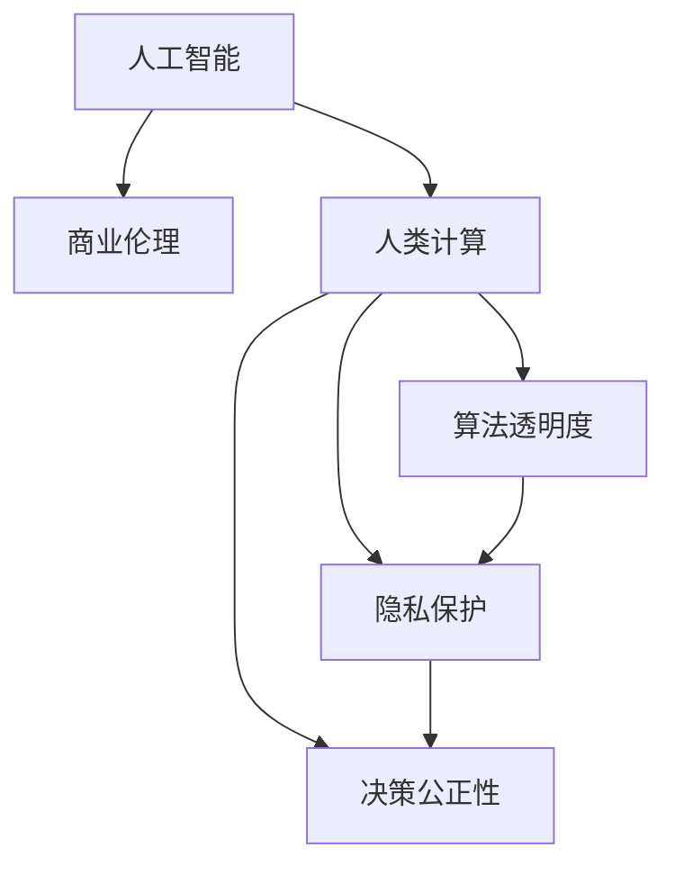

                 

# AI驱动的创新：人类计算在商业中的道德考虑因素与应用趋势预测

> 关键词：人工智能,商业伦理,道德责任,人类计算,算法透明度,隐私保护,应用趋势

## 1. 背景介绍

### 1.1 问题由来
随着人工智能技术的迅猛发展，其在商业中的应用也越来越广泛，从简单的自动化工具到复杂的决策支持系统，人工智能正在逐步改变传统商业运作方式。然而，在带来便利的同时，人工智能技术也引发了一系列道德问题，如算法透明度、数据隐私、决策公正性等。这些问题如果不能妥善解决，将严重制约人工智能技术的进一步发展。

### 1.2 问题核心关键点
本文将探讨人工智能在商业应用中的道德考虑因素，包括算法透明度、隐私保护、决策公正性等，同时对未来应用趋势进行预测。

1. **算法透明度**：消费者和企业都期望了解人工智能系统的决策过程和依据，确保其公正、透明。
2. **隐私保护**：在收集和使用数据的过程中，必须确保用户数据的安全和隐私。
3. **决策公正性**：人工智能系统应保证决策的公正和无歧视，避免对某些群体的不公平待遇。

## 2. 核心概念与联系

### 2.1 核心概念概述

为了更好地理解人工智能在商业中的道德考虑因素，本节将介绍几个密切相关的核心概念：

- **人工智能**：通过模拟人类的认知、学习、推理等能力，使计算机能够完成复杂任务的技术。
- **商业伦理**：商业活动中应遵循的道德规范和行为准则，确保商业行为的公正性和合法性。
- **人类计算**：将人类智慧和经验与计算能力相结合，解决复杂问题的一种方式。
- **算法透明度**：人工智能系统的决策过程和依据应公开透明，让使用者了解其工作机制。
- **隐私保护**：在数据收集和使用过程中，确保用户数据的安全和隐私。
- **决策公正性**：人工智能系统应保证决策的公正和无歧视，避免对某些群体的不公平待遇。

这些核心概念之间的逻辑关系可以通过以下Mermaid流程图来展示：



这个流程图展示了大语言模型的核心概念及其之间的关系：

1. 人工智能通过模拟人类智慧，实现复杂任务处理。
2. 商业伦理指导人工智能的应用，确保其道德性。
3. 人类计算结合了人类智慧和计算能力，提升了人工智能的决策能力。
4. 算法透明度、隐私保护和决策公正性是人工智能在商业应用中的三个关键道德考虑因素。
5. 这三者共同构成了一个平衡的系统，确保人工智能在商业中的健康发展。

## 3. 核心算法原理 & 具体操作步骤
### 3.1 算法原理概述

人工智能在商业中的应用，本质上是通过算法来处理数据、做出决策的。因此，算法的道德考虑因素也是至关重要的。算法应具备以下特点：

1. **透明度**：算法的决策过程应公开透明，让用户能够理解其工作机制。
2. **可解释性**：算法的决策依据应可解释，用户能够理解算法做出某个决策的原因。
3. **公正性**：算法应保证决策的公正和无歧视，避免对某些群体的不公平待遇。
4. **可信赖性**：算法的输出应稳定可靠，避免因为数据偏差或算法漏洞导致错误决策。

### 3.2 算法步骤详解

人工智能在商业应用中，通常包括以下几个关键步骤：

**Step 1: 数据收集与处理**
- 收集与业务相关的数据，如客户行为数据、市场环境数据等。
- 对数据进行清洗和预处理，确保数据的质量和完整性。

**Step 2: 算法设计**
- 根据业务需求选择合适的算法模型，如决策树、神经网络等。
- 对算法进行训练和调优，确保其性能和稳定性。

**Step 3: 模型部署与监控**
- 将训练好的模型部署到生产环境中，进行实时处理。
- 监控模型的运行状态，及时发现和解决问题。

**Step 4: 结果评估与优化**
- 对模型的输出结果进行评估，确保其符合业务需求。
- 根据评估结果，不断优化算法和模型。

### 3.3 算法优缺点

人工智能在商业中的应用，具有以下优点：

1. **效率提升**：通过算法自动化处理数据，大幅提升工作效率。
2. **决策精准**：算法能够基于数据做出精准决策，提高业务成功率。
3. **数据驱动**：通过数据分析，发现业务规律，优化决策过程。

同时，也存在以下缺点：

1. **数据依赖**：算法的性能很大程度上依赖于数据的数量和质量。
2. **技术复杂**：算法设计和实现复杂，需要专业知识。
3. **可解释性差**：某些算法模型如深度学习，其决策过程复杂，难以解释。
4. **伦理问题**：算法可能存在偏见，影响决策公正性。

### 3.4 算法应用领域

人工智能在商业中的应用领域非常广泛，包括但不限于以下几方面：

1. **客户服务**：通过智能客服机器人，提供7x24小时服务，提升客户体验。
2. **市场分析**：利用算法进行市场趋势分析和预测，指导业务决策。
3. **风险管理**：利用算法进行风险评估和预测，降低业务风险。
4. **供应链管理**：通过算法优化供应链流程，提高运营效率。
5. **个性化推荐**：利用算法进行用户行为分析，提供个性化推荐服务。

## 4. 数学模型和公式 & 详细讲解

### 4.1 数学模型构建

在商业应用中，人工智能通常涉及大量的数学模型和算法。以下以决策树算法为例，进行详细讲解。

**决策树算法**：一种基于树形结构的分类算法，通过递归地将数据集分割为更小的子集，直到每个子集仅包含一个类别或达到某个停止条件。

决策树算法的数学模型可以表示为：

$$
T = \{(T_1, S_1, \theta_1), (T_2, S_2, \theta_2), ..., (T_n, S_n, \theta_n)\}
$$

其中，$T$ 表示决策树，$T_i$ 表示第 $i$ 个节点，$S_i$ 表示第 $i$ 个节点的子集，$\theta_i$ 表示第 $i$ 个节点的阈值。

### 4.2 公式推导过程

决策树算法的推导过程如下：

1. 从数据集中选取一个最优的特征作为根节点，将数据集分成若干子集。
2. 对每个子集递归执行步骤1，直到子集无法再分割。
3. 停止条件通常为叶子节点的样本数小于某个阈值，或叶节点包含单一类别。

**节点选择准则**：选择最优特征的标准通常是信息增益或信息增益比，计算公式为：

$$
Gain(X, Y) = \sum_{j=1}^{c} \frac{|S_j|}{|S|} \times Entropy(S_j)
$$

$$
GainRatio(X, Y) = \frac{Gain(X, Y)}{IV(X)}
$$

其中，$S$ 表示原始数据集，$S_j$ 表示第 $j$ 个特征的数据子集，$c$ 表示特征的取值数量，$Entropy$ 表示信息熵，$IV$ 表示信息增益比。

### 4.3 案例分析与讲解

以下通过一个简单的案例，分析决策树算法的应用：

**案例**：某电商企业希望通过客户购买记录预测客户的退货行为。

**数据集**：包含客户购买记录、退货记录、客户属性等数据。

**算法步骤**：

1. 收集数据集，并进行预处理。
2. 选择最优特征作为根节点，如客户购买次数、订单金额等。
3. 对子集进行递归分割，如将购买次数大于10的客户标记为“高风险”，小于10的标记为“低风险”。
4. 对叶子节点进行评估，如“高风险”客户的退货率较高，需要进行重点关注。
5. 对模型进行部署和监控，实时预测客户的退货行为。

## 5. 项目实践：代码实例和详细解释说明
### 5.1 开发环境搭建

在进行人工智能项目实践前，我们需要准备好开发环境。以下是使用Python进行Scikit-learn开发的Python环境配置流程：

1. 安装Anaconda：从官网下载并安装Anaconda，用于创建独立的Python环境。

2. 创建并激活虚拟环境：
```bash
conda create -n sklearn-env python=3.8 
conda activate sklearn-env
```

3. 安装Scikit-learn：
```bash
pip install scikit-learn
```

4. 安装各类工具包：
```bash
pip install numpy pandas scikit-learn matplotlib tqdm jupyter notebook ipython
```

完成上述步骤后，即可在`sklearn-env`环境中开始项目实践。

### 5.2 源代码详细实现

下面以决策树算法为例，给出使用Scikit-learn进行客户退货行为预测的Python代码实现。

```python
from sklearn.tree import DecisionTreeClassifier
from sklearn.metrics import accuracy_score
from sklearn.model_selection import train_test_split
from sklearn.datasets import load_iris

# 加载数据集
iris = load_iris()
X = iris.data
y = iris.target

# 数据划分
X_train, X_test, y_train, y_test = train_test_split(X, y, test_size=0.2, random_state=42)

# 创建决策树模型
clf = DecisionTreeClassifier()

# 训练模型
clf.fit(X_train, y_train)

# 预测并评估
y_pred = clf.predict(X_test)
accuracy = accuracy_score(y_test, y_pred)
print("Accuracy:", accuracy)
```

### 5.3 代码解读与分析

让我们再详细解读一下关键代码的实现细节：

**数据加载**：使用Scikit-learn的`load_iris`函数加载鸢尾花数据集，包含特征`X`和标签`y`。

**数据划分**：使用`train_test_split`函数将数据集划分为训练集和测试集，比例为80%和20%。

**模型创建**：使用`DecisionTreeClassifier`函数创建决策树模型。

**模型训练**：使用`fit`函数对模型进行训练，输入训练集数据`X_train`和标签`y_train`。

**预测和评估**：使用`predict`函数对测试集进行预测，并使用`accuracy_score`函数计算预测准确率。

**输出结果**：打印模型的预测准确率。

以上代码展示了使用Scikit-learn进行决策树模型训练和评估的基本流程。开发者可以根据具体需求，进一步调整模型参数和优化算法性能。

## 6. 实际应用场景
### 6.1 智能客服系统

人工智能在智能客服系统中得到了广泛应用，通过智能客服机器人，企业能够提供7x24小时不间断服务，显著提升客户体验。

**应用场景**：某电商企业的智能客服系统，通过决策树算法预测客户咨询意图，自动匹配最合适的回复模板，回答客户问题。

**关键步骤**：

1. 收集历史客服咨询数据，包括客户提问、回复和满意度等。
2. 对数据进行清洗和预处理，提取特征如关键词、情感等。
3. 设计决策树模型，识别出常见问题类型和回复模板。
4. 部署模型到生产环境，实时处理客户咨询请求。
5. 监控模型性能，不断优化模型参数。

### 6.2 金融舆情监测

金融舆情监测是人工智能在金融领域的重要应用之一，通过分析市场舆情，帮助金融机构及时应对潜在风险。

**应用场景**：某银行通过决策树算法分析社交媒体上的金融舆情，预测市场情绪变化，为投资决策提供参考。

**关键步骤**：

1. 收集社交媒体上的金融舆情数据，提取文本特征。
2. 使用决策树模型分析舆情变化趋势，识别异常情况。
3. 对异常情况进行预警，帮助银行及时应对市场变化。
4. 不断优化模型，提高舆情分析的准确性和及时性。

### 6.3 个性化推荐系统

个性化推荐系统是人工智能在电商、视频等领域的经典应用，通过算法分析用户行为，推荐个性化的产品或内容。

**应用场景**：某视频平台通过决策树算法分析用户观看历史和行为数据，推荐用户感兴趣的视频。

**关键步骤**：

1. 收集用户观看历史、点击记录、评论等数据。
2. 使用决策树模型分析用户行为，预测其兴趣偏好。
3. 根据用户兴趣，推荐相关视频内容。
4. 对推荐结果进行评估，优化算法性能。

### 6.4 未来应用展望

随着人工智能技术的不断进步，未来人工智能在商业中的应用将更加广泛和深入。以下是对未来应用趋势的预测：

1. **自动化决策**：人工智能将深入参与企业的自动化决策过程，如财务、采购、营销等。
2. **个性化服务**：通过数据分析，人工智能将提供更加精准的个性化服务，提升用户体验。
3. **智能合约**：结合区块链技术，人工智能将开发智能合约系统，实现自动化的合同管理和执行。
4. **AI嵌入系统**：人工智能将深度嵌入企业系统，实现业务流程自动化和优化。
5. **跨行业应用**：人工智能将突破行业边界，实现多领域跨行业的应用，如智能城市、智能医疗等。

## 7. 工具和资源推荐
### 7.1 学习资源推荐

为了帮助开发者系统掌握人工智能在商业中的道德考虑因素和应用技术，这里推荐一些优质的学习资源：

1. 《人工智能伦理》系列博文：由人工智能伦理专家撰写，深入浅出地介绍了人工智能伦理的基本概念和核心问题。

2. 《人工智能在商业中的应用》课程：由知名大学开设的AI应用课程，涵盖商业数据分析、智能客服、金融科技等多个领域。

3. 《深度学习在商业中的应用》书籍：介绍深度学习技术在商业中的具体应用案例，包括客户服务、市场分析等。

4. 《商业人工智能》书籍：全面介绍人工智能在商业中的应用，包括算法选择、模型训练、应用场景等。

5. AI全球大会：每年举办多次，汇集全球顶尖AI专家，分享最新的研究成果和技术趋势。

通过对这些资源的学习实践，相信你一定能够全面掌握人工智能在商业中的道德考虑因素和应用技术，并用于解决实际的商业问题。
###  7.2 开发工具推荐

高效的开发离不开优秀的工具支持。以下是几款用于人工智能项目开发的常用工具：

1. Python：开源编程语言，拥有丰富的库和框架，是人工智能项目开发的主流语言。

2. Scikit-learn：开源机器学习库，提供了多种经典算法和工具函数，方便开发者快速开发。

3. TensorFlow：由Google主导开发的深度学习框架，支持分布式计算，适合大规模项目开发。

4. Keras：高层次神经网络API，易于上手，适合快速原型开发。

5. PyTorch：由Facebook开发的深度学习框架，支持动态计算图，适合研究和原型开发。

6. Jupyter Notebook：交互式编程环境，方便开发者进行数据探索和算法验证。

合理利用这些工具，可以显著提升人工智能项目的开发效率，加快创新迭代的步伐。

### 7.3 相关论文推荐

人工智能在商业应用的研究方向非常广泛，以下是几篇奠基性的相关论文，推荐阅读：

1. "The Moral Landscape of Artificial Intelligence"：一篇关于人工智能伦理的综述性论文，探讨了人工智能在商业中的伦理问题。

2. "Ethical Considerations in AI-driven Decision Support Systems"：研究了AI决策支持系统中的伦理问题，包括数据隐私、决策公正性等。

3. "Human-in-the-loop: A New Paradigm for AI-driven Decision Making"：探讨了人类计算在AI决策中的应用，强调了AI系统与人类协作的重要性。

4. "Privacy-Preserving Machine Learning for Business Applications"：介绍了隐私保护在商业AI中的应用，包括数据加密、差分隐私等技术。

5. "Fairness in AI: A Survey of Approaches and Challenges"：综述了AI系统中的公平性问题，提出了多种解决方案。

这些论文代表了大语言模型微调技术的发展脉络。通过学习这些前沿成果，可以帮助研究者把握学科前进方向，激发更多的创新灵感。

## 8. 总结：未来发展趋势与挑战
### 8.1 总结

本文对人工智能在商业应用中的道德考虑因素进行了全面系统的介绍。首先阐述了人工智能在商业中的应用背景和道德问题，明确了算法透明度、隐私保护、决策公正性等关键因素。其次，从原理到实践，详细讲解了人工智能在商业中的数学模型和操作步骤，给出了项目实践的完整代码实例。同时，本文还广泛探讨了人工智能在智能客服、金融舆情、个性化推荐等多个行业领域的应用前景，展示了人工智能的巨大潜力。

通过本文的系统梳理，可以看到，人工智能在商业中的应用正在不断拓展，其带来的便利和高效不可忽视。然而，人工智能在商业中的道德考虑因素和应用挑战也需要引起重视。只有平衡好商业效益和社会责任，才能实现人工智能的可持续发展。

### 8.2 未来发展趋势

展望未来，人工智能在商业中的应用将呈现以下几个发展趋势：

1. **自动化决策**：人工智能将深度参与企业的自动化决策过程，提升决策效率和准确性。
2. **个性化服务**：通过数据分析，人工智能将提供更加精准的个性化服务，提升用户体验。
3. **智能合约**：结合区块链技术，人工智能将开发智能合约系统，实现自动化的合同管理和执行。
4. **跨行业应用**：人工智能将突破行业边界，实现多领域跨行业的应用，如智能城市、智能医疗等。
5. **伦理与安全**：人工智能的应用将更加注重伦理与安全，确保算法的透明性和公正性。

以上趋势凸显了人工智能在商业中的巨大潜力和发展方向。这些方向的探索发展，必将进一步推动人工智能技术在商业中的普及应用，为经济发展带来新的动力。

### 8.3 面临的挑战

尽管人工智能在商业中的应用前景广阔，但在迈向更加智能化、普适化应用的过程中，仍面临诸多挑战：

1. **数据隐私保护**：在数据收集和处理过程中，必须确保用户数据的安全和隐私，避免数据泄露。
2. **算法透明度**：算法的决策过程应公开透明，让用户能够理解其工作机制。
3. **决策公正性**：人工智能系统应保证决策的公正和无歧视，避免对某些群体的不公平待遇。
4. **资源消耗**：大规模AI系统的运行需要大量的计算资源，如何提高资源利用效率，是一个重要的挑战。
5. **算法鲁棒性**：在面对复杂多变的数据和环境时，算法应具备较强的鲁棒性和适应性。
6. **伦理与社会责任**：在人工智能的应用过程中，必须考虑到伦理和社会责任，避免对社会造成负面影响。

这些挑战需要学界和产业界的共同努力，才能实现人工智能在商业中的健康发展。

### 8.4 研究展望

面对人工智能在商业应用中面临的挑战，未来的研究需要在以下几个方面寻求新的突破：

1. **数据隐私保护**：开发更加高效的数据加密和隐私保护技术，确保用户数据的安全和隐私。
2. **算法透明度**：研究更加透明和可解释的算法，让用户能够理解其决策依据。
3. **决策公正性**：开发更加公正和无偏见的算法，确保算法的公平性。
4. **资源优化**：优化AI系统的计算资源利用效率，降低运行成本。
5. **鲁棒性增强**：提高AI系统的鲁棒性和适应性，应对复杂多变的数据和环境。
6. **伦理与社会责任**：建立伦理导向的算法评估标准，确保AI系统符合社会责任。

这些研究方向将为人工智能在商业中的应用提供新的思路和方法，推动人工智能技术的可持续发展。

## 9. 附录：常见问题与解答

**Q1：人工智能在商业应用中存在哪些道德问题？**

A: 人工智能在商业应用中主要存在以下道德问题：

1. **算法透明度**：用户和监管机构期望了解算法的决策过程和依据，确保其公正透明。
2. **隐私保护**：在数据收集和使用过程中，必须确保用户数据的安全和隐私。
3. **决策公正性**：人工智能系统应保证决策的公正和无歧视，避免对某些群体的不公平待遇。

**Q2：人工智能在商业应用中的主要优势是什么？**

A: 人工智能在商业应用中的主要优势包括：

1. **效率提升**：通过算法自动化处理数据，大幅提升工作效率。
2. **决策精准**：算法能够基于数据做出精准决策，提高业务成功率。
3. **数据驱动**：通过数据分析，发现业务规律，优化决策过程。

**Q3：如何应对人工智能在商业应用中的道德问题？**

A: 应对人工智能在商业应用中的道德问题，可以从以下几个方面入手：

1. **算法透明度**：确保算法的决策过程和依据公开透明，让用户能够理解其工作机制。
2. **隐私保护**：在数据收集和处理过程中，确保用户数据的安全和隐私，避免数据泄露。
3. **决策公正性**：开发更加公正和无偏见的算法，确保算法的公平性。
4. **伦理与社会责任**：建立伦理导向的算法评估标准，确保AI系统符合社会责任。

**Q4：人工智能在商业应用中面临的主要挑战是什么？**

A: 人工智能在商业应用中面临的主要挑战包括：

1. **数据隐私保护**：在数据收集和处理过程中，必须确保用户数据的安全和隐私。
2. **算法透明度**：算法的决策过程应公开透明，让用户能够理解其工作机制。
3. **决策公正性**：人工智能系统应保证决策的公正和无歧视，避免对某些群体的不公平待遇。
4. **资源消耗**：大规模AI系统的运行需要大量的计算资源，如何提高资源利用效率，是一个重要的挑战。
5. **算法鲁棒性**：在面对复杂多变的数据和环境时，算法应具备较强的鲁棒性和适应性。
6. **伦理与社会责任**：在人工智能的应用过程中，必须考虑到伦理和社会责任，避免对社会造成负面影响。

**Q5：未来人工智能在商业应用中的发展趋势是什么？**

A: 未来人工智能在商业应用中的发展趋势包括：

1. **自动化决策**：人工智能将深度参与企业的自动化决策过程，提升决策效率和准确性。
2. **个性化服务**：通过数据分析，人工智能将提供更加精准的个性化服务，提升用户体验。
3. **智能合约**：结合区块链技术，人工智能将开发智能合约系统，实现自动化的合同管理和执行。
4. **跨行业应用**：人工智能将突破行业边界，实现多领域跨行业的应用，如智能城市、智能医疗等。
5. **伦理与安全**：人工智能的应用将更加注重伦理与安全，确保算法的透明性和公正性。

---

作者：禅与计算机程序设计艺术 / Zen and the Art of Computer Programming

