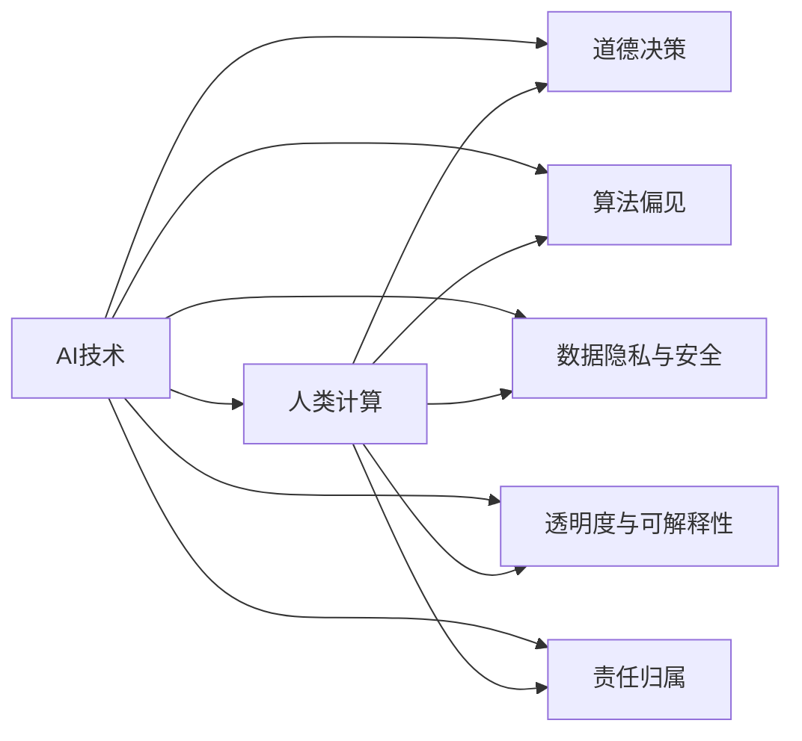

                 

# AI驱动的创新：人类计算在商业中的道德考虑因素与策略分析

## 1. 背景介绍

### 1.1 问题由来

随着人工智能(AI)技术的迅猛发展，其在商业领域的应用也日益广泛。从智能客服、推荐系统到自动驾驶、供应链管理，AI技术正在以前所未有的速度和深度，改变着商业模式的方方面面。然而，AI技术的广泛应用也带来了诸多伦理道德问题，引发了社会各界的广泛关注和深入讨论。

近年来，学术界和产业界开始将AI技术在商业应用中的伦理道德问题提上日程。例如，自动驾驶中的道德决策问题、算法偏见与歧视问题、数据隐私与安全性问题等。这些问题不仅关系到技术的可行性和公正性，还关乎到商业运营的可持续性和社会信任。

### 1.2 问题核心关键点

AI技术在商业中的应用，特别是基于大数据和机器学习的AI技术，带来了许多新的伦理道德挑战。主要包括以下几个方面：

- **算法偏见与歧视**：AI算法可能会因训练数据中的偏见导致不公平的结果，如性别歧视、种族偏见等。
- **数据隐私与安全**：商业应用中广泛收集和使用个人数据，如何保护用户隐私，防止数据泄露，成为重要议题。
- **道德决策问题**：在复杂场景下，AI系统需要做出符合人类道德规范的决策，例如自动驾驶中的行人优先原则。
- **透明度与可解释性**：用户和监管机构需要理解AI决策的依据和过程，以避免“黑盒”模型的不透明性。
- **责任归属**：当AI系统出现错误或违法行为时，如何确定责任归属，是一个亟待解决的问题。

### 1.3 问题研究意义

研究AI技术在商业应用中的伦理道德问题，对于推动AI技术的健康发展，保障社会公正与公平，具有重要的理论和现实意义。具体而言：

- 提升AI系统的公正性与可接受性。通过识别和纠正算法偏见，增强AI决策的公正性和可接受性。
- 保护用户隐私与安全。建立科学合理的数据使用和保护机制，确保用户数据的安全性和隐私性。
- 促进道德决策能力的提升。探索AI系统如何能够辅助人类做出符合道德规范的决策，避免伦理困境。
- 提高系统透明度与可解释性。使AI决策过程透明化，增强用户和监管机构的信任。
- 明确责任归属与追责机制。建立合理的责任归属机制，确保AI系统的安全与可控。

## 2. 核心概念与联系

### 2.1 核心概念概述

为更好地理解AI技术在商业应用中的伦理道德问题，本节将介绍几个核心概念及其相互关系：

- **AI技术**：基于大数据、机器学习和深度学习的技术，包括但不限于图像识别、自然语言处理、语音识别等。
- **人类计算**：利用AI技术增强人类的计算能力，提升工作效率和生活质量。
- **道德决策**：基于AI系统辅助的人类决策，确保决策符合道德规范。
- **算法偏见**：指AI算法因训练数据中的偏见导致的不公平结果。
- **数据隐私与安全**：涉及数据收集、存储、传输和使用过程中的隐私保护和安全防护。
- **透明度与可解释性**：指AI系统的决策过程和依据应尽可能透明，便于理解与解释。
- **责任归属**：指AI系统在出现错误或违法行为时，如何确定责任主体。

这些核心概念之间的逻辑关系可以通过以下Mermaid流程图来展示：



这个流程图展示了几大核心概念及其之间的联系：

1. AI技术通过增强人类计算能力，提升工作效率和生活质量。
2. 在提升效率的同时，AI系统需具备道德决策能力，确保决策公正合理。
3. 算法偏见、数据隐私与安全、透明度与可解释性、责任归属等问题，是AI技术在商业应用中需重点考虑的伦理道德问题。

## 3. 核心算法原理 & 具体操作步骤
### 3.1 算法原理概述

AI技术在商业应用中的伦理道德问题，通常涉及算法设计、数据处理、系统架构等多个层面。本节将从算法层面，探讨如何在设计和实现AI系统时，考虑其伦理道德问题。

基于AI技术的商业系统，其核心算法原理大致包括以下几个步骤：

1. **数据预处理**：收集、清洗、标注数据，确保数据的质量和代表性。
2. **模型训练**：选择合适的算法和模型结构，在大规模数据上进行训练。
3. **系统部署**：将训练好的模型部署到实际应用中，进行线上运行。
4. **监控与评估**：实时监控系统运行状态，评估系统性能和伦理表现。

这些步骤中，每一步都需要考虑伦理道德问题。例如，数据预处理中的数据收集与标注，需要确保数据的多样性和代表性，避免因数据偏见导致不公平的结果。模型训练中的算法选择与参数调整，需要避免算法偏见和歧视。系统部署中的隐私保护与安全防护，需要确保用户数据的安全。系统监控与评估中的透明性与可解释性，需要提供系统的决策依据。

### 3.2 算法步骤详解

**数据预处理**

数据预处理是AI系统中的重要环节，涉及到数据收集、清洗、标注等步骤。在数据预处理阶段，应采取以下措施：

- **多样性数据收集**：确保数据集的多样性，避免因数据单一导致的算法偏见。例如，在性别、种族、年龄等方面保持多样性。
- **数据清洗与标注**：使用数据清洗技术去除噪声和异常数据，确保标注数据的质量和准确性。标注过程中，应采用多标注员标注和一致性检查等手段，确保标注结果的一致性。
- **数据隐私保护**：在数据收集和存储过程中，应采取加密、匿名化等手段，保护用户隐私。例如，使用差分隐私技术，确保用户数据在统计分析中的隐私保护。

**模型训练**

模型训练是AI系统的核心环节，涉及到算法选择、超参数调整、模型评估等步骤。在模型训练阶段，应采取以下措施：

- **选择合适的算法与模型结构**：根据具体应用场景，选择合适的算法和模型结构。例如，在推荐系统中选择协同过滤或深度神经网络模型。
- **避免算法偏见**：在算法设计和训练过程中，采取去偏技术，避免因数据偏见导致的不公平结果。例如，使用对抗样本训练技术，去除数据中的偏见。
- **正则化与约束**：使用L2正则、Dropout等技术，防止模型过拟合，提高模型的泛化能力。

**系统部署**

系统部署是AI系统的应用阶段，涉及到系统架构、安全防护、用户交互等步骤。在系统部署阶段，应采取以下措施：

- **合理架构设计**：设计合理的系统架构，确保系统的高效、可靠和安全。例如，使用微服务架构，提高系统的扩展性和可维护性。
- **数据加密与安全防护**：在系统部署中，采取数据加密、访问控制等手段，保护用户数据的安全。例如，使用SSL/TLS协议加密数据传输，使用身份认证技术保护系统访问。
- **用户交互设计**：在系统设计中，注重用户体验，确保用户界面的友好性与易用性。例如，提供简单易用的交互界面，支持用户反馈与投诉。

**监控与评估**

系统监控与评估是AI系统的维护阶段，涉及到实时监控、性能评估、用户反馈等步骤。在系统监控与评估阶段，应采取以下措施：

- **实时监控系统运行状态**：通过日志记录、性能指标等手段，实时监控系统运行状态。例如，使用ELK Stack进行日志收集与分析，使用Prometheus进行系统性能监控。
- **定期评估系统性能**：定期评估系统性能和伦理表现，及时发现和解决问题。例如，定期进行模型性能评估，使用伦理评估指标评估系统公平性与公正性。
- **用户反馈与投诉**：收集用户反馈与投诉，及时改进系统。例如，建立用户反馈机制，及时回应用户投诉。

### 3.3 算法优缺点

AI技术在商业应用中的伦理道德问题处理，具有以下优点：

1. **提高决策公正性**：通过科学合理的算法设计和数据预处理，减少算法偏见和歧视，提高决策的公正性与可接受性。
2. **增强系统安全性**：通过合理的数据加密与安全防护，确保用户数据的安全性，防止数据泄露与滥用。
3. **提升系统透明度**：通过透明化决策过程，增强用户和监管机构的信任，减少对系统的误解和质疑。
4. **明确责任归属**：通过建立合理的责任归属机制，确保系统在出现错误或违法行为时的可追责性。

然而，该方法也存在一定的局限性：

1. **数据多样性不足**：在数据预处理阶段，如果数据单一，可能无法覆盖所有场景，导致算法偏见。
2. **算法复杂性高**：一些复杂的算法和模型结构，可能难以解释，增加系统的复杂性和维护成本。
3. **实时性要求高**：系统部署和监控阶段，需要实时响应和处理用户请求，对系统架构和性能要求较高。
4. **伦理标准不一**：不同行业和地区对伦理道德标准的要求不一，系统设计和评估需要考虑多方利益。

尽管存在这些局限性，但通过合理的算法设计和实践，AI技术在商业应用中的伦理道德问题处理，仍然可以取得显著的效果。

### 3.4 算法应用领域

AI技术在商业中的应用，涵盖了许多领域。以下是几个典型的应用领域：

- **智能客服**：使用AI技术提升客服响应速度和效率，减少人工干预，提高客户满意度。
- **推荐系统**：通过分析用户行为和兴趣，推荐个性化的商品和服务，提高用户粘性和购买率。
- **供应链管理**：利用AI技术进行库存管理、需求预测、物流优化等，提高供应链效率和灵活性。
- **金融风险控制**：使用AI技术进行信用评估、风险识别、欺诈检测等，提升金融系统的安全性和可靠性。
- **医疗诊断**：通过AI技术进行医学影像分析、疾病预测、个性化治疗等，提高医疗诊断的准确性和效率。
- **智能交通**：利用AI技术进行交通流量预测、智能调度、自动驾驶等，提升交通安全与效率。

这些应用领域中，AI技术在提升效率、降低成本、优化决策等方面具有巨大潜力，但也带来了诸多伦理道德问题。如何平衡技术发展与伦理道德，成为当前和未来需要深入探讨的问题。

## 4. 数学模型和公式 & 详细讲解 & 举例说明
### 4.1 数学模型构建

本节将使用数学语言对AI技术在商业应用中的伦理道德问题处理进行更加严格的刻画。

假设AI系统需要处理一个复杂的商业决策问题，其模型为 $M_{\theta}(x)$，其中 $x$ 为输入特征，$\theta$ 为模型参数。假设系统输出的决策结果 $y$ 为分类变量，可能的取值为 $\{1, 2, 3\}$。系统在训练集 $D=\{(x_i, y_i)\}_{i=1}^N$ 上进行训练，定义模型的损失函数为：

$$
\mathcal{L}(\theta) = \frac{1}{N} \sum_{i=1}^N \ell(M_{\theta}(x_i), y_i)
$$

其中 $\ell$ 为损失函数，通常采用交叉熵损失。在模型训练过程中，最小化损失函数 $\mathcal{L}(\theta)$，以使模型输出的决策结果尽可能接近真实标签 $y_i$。

### 4.2 公式推导过程

以推荐系统为例，推导其损失函数及梯度更新公式。

推荐系统通过学习用户历史行为数据，预测用户对未购买商品/服务的兴趣。假设用户历史行为数据为 $(x_i, y_i)$，其中 $x_i$ 为历史行为特征，$y_i \in \{1, 0\}$ 表示用户是否购买过该商品/服务。推荐系统模型的目标是为每个用户推荐最感兴趣的商品/服务，即最大化推荐系统的点击率预测准确度。

定义推荐系统模型为 $M_{\theta}(x)$，其中 $x$ 为用户历史行为特征，$y$ 为推荐结果，可能的取值为 $\{1, 0\}$。推荐系统的损失函数为交叉熵损失：

$$
\ell(y, \hat{y}) = -y\log \hat{y} - (1-y)\log(1-\hat{y})
$$

其中 $\hat{y} = M_{\theta}(x)$ 为模型预测的推荐结果。推荐系统在训练集 $D=\{(x_i, y_i)\}_{i=1}^N$ 上进行训练，最小化损失函数：

$$
\mathcal{L}(\theta) = \frac{1}{N} \sum_{i=1}^N \ell(y_i, M_{\theta}(x_i))
$$

在模型训练过程中，最小化损失函数 $\mathcal{L}(\theta)$，使用梯度下降等优化算法更新模型参数 $\theta$。具体来说，模型参数 $\theta$ 的梯度更新公式为：

$$
\theta \leftarrow \theta - \eta \nabla_{\theta}\mathcal{L}(\theta)
$$

其中 $\eta$ 为学习率，$\nabla_{\theta}\mathcal{L}(\theta)$ 为损失函数对模型参数 $\theta$ 的梯度。通过反向传播算法，可以高效计算梯度。

### 4.3 案例分析与讲解

以医疗诊断系统为例，分析其在伦理道德问题处理中的应用。

医疗诊断系统通过分析患者的影像数据和病历信息，预测疾病的诊断结果。假设系统输出的诊断结果 $y$ 为分类变量，可能的取值为 $\{1, 2, 3\}$，其中 $y=1$ 表示疾病确诊，$y=2$ 表示疾病疑似，$y=3$ 表示疾病排除。

在医疗诊断系统中，伦理道德问题主要体现在以下几个方面：

- **数据隐私保护**：医疗数据包含大量敏感信息，如患者的病历、影像等。如何保护患者数据隐私，防止数据泄露，是一个重要议题。
- **算法偏见与歧视**：如果训练数据存在性别、种族、年龄等偏见，会导致诊断结果的不公平。例如，某算法在处理特定种族的疾病时，可能出现高误诊率。
- **决策透明度与可解释性**：医疗诊断系统需提供透明的决策依据，使医生和患者理解系统推荐的诊断结果。例如，系统应提供详细的诊断理由和依据。
- **责任归属**：如果诊断结果出现错误，如何确定责任归属，是医疗诊断系统需要解决的重要问题。例如，在自动驾驶系统中，车辆出现事故时，如何确定是否由系统导致。

## 5. 项目实践：代码实例和详细解释说明
### 5.1 开发环境搭建

在进行AI技术在商业应用中的伦理道德问题处理实践前，我们需要准备好开发环境。以下是使用Python进行TensorFlow开发的环境配置流程：

1. 安装Anaconda：从官网下载并安装Anaconda，用于创建独立的Python环境。

2. 创建并激活虚拟环境：
```bash
conda create -n tf-env python=3.8 
conda activate tf-env
```

3. 安装TensorFlow：根据CUDA版本，从官网获取对应的安装命令。例如：
```bash
conda install tensorflow -c tf -c conda-forge
```

4. 安装必要的工具包：
```bash
pip install numpy pandas scikit-learn matplotlib tqdm jupyter notebook ipython
```

完成上述步骤后，即可在`tf-env`环境中开始伦理道德问题处理的实践。

### 5.2 源代码详细实现

这里我们以推荐系统为例，给出使用TensorFlow对AI模型进行训练的PyTorch代码实现。

首先，定义推荐系统模型的输入特征和目标变量：

```python
import tensorflow as tf
from tensorflow.keras.layers import Dense, Input
from tensorflow.keras.models import Model

# 定义输入层
input_layer = Input(shape=(n_features,))

# 定义推荐模型
hidden_layer = Dense(64, activation='relu')(input_layer)
output_layer = Dense(1, activation='sigmoid')(hidden_layer)

# 定义推荐系统模型
model = Model(inputs=input_layer, outputs=output_layer)

# 编译模型
model.compile(optimizer='adam', loss='binary_crossentropy', metrics=['accuracy'])
```

然后，定义数据生成器和模型训练流程：

```python
# 定义数据生成器
def data_generator(x, y, batch_size):
    while True:
        for i in range(0, len(x), batch_size):
            batch_x = x[i:i+batch_size]
            batch_y = y[i:i+batch_size]
            yield (batch_x, batch_y)

# 定义模型训练函数
def train_model(model, x_train, y_train, x_val, y_val, batch_size, epochs):
    model.fit_generator(generator=data_generator(x_train, y_train, batch_size),
                        steps_per_epoch=len(x_train) // batch_size,
                        epochs=epochs,
                        validation_data=(data_generator(x_val, y_val, batch_size),
                                        len(x_val) // batch_size))

# 训练模型
x_train, y_train = generate_train_data()
x_val, y_val = generate_val_data()
train_model(model, x_train, y_train, x_val, y_val, batch_size, epochs)
```

最后，定义模型评估函数：

```python
# 定义模型评估函数
def evaluate_model(model, x_test, y_test, batch_size):
    score = model.evaluate_generator(generator=data_generator(x_test, y_test, batch_size),
                                    steps=len(x_test) // batch_size)
    return score
```

启动训练流程并在测试集上评估：

```python
# 定义测试集数据
x_test, y_test = generate_test_data()

# 在测试集上评估模型
score = evaluate_model(model, x_test, y_test, batch_size)
print(f'Test loss: {score[0]:.4f}, Test accuracy: {score[1]:.4f}')
```

以上就是使用TensorFlow对AI模型进行训练的完整代码实现。可以看到，TensorFlow提供了强大的深度学习框架，可以方便地构建和训练推荐系统模型。

### 5.3 代码解读与分析

让我们再详细解读一下关键代码的实现细节：

**数据生成器**：
- 定义了一个无限生成器，用于在训练过程中生成批量的训练数据。
- 使用while循环生成批量数据，使用yield语句返回数据。

**模型训练函数**：
- 使用TensorFlow的`fit_generator`函数进行模型训练。
- 将数据生成器作为输入，指定训练轮数和批次大小。

**模型评估函数**：
- 使用TensorFlow的`evaluate_generator`函数进行模型评估。
- 将数据生成器作为输入，返回损失和准确度。

**训练流程**：
- 定义训练集和验证集数据，调用`train_model`函数进行模型训练。
- 在测试集上调用`evaluate_model`函数进行模型评估。

可以看到，TensorFlow提供了便捷的API和强大的工具，可以快速实现AI模型的训练和评估。开发者可以将更多精力放在数据处理、模型改进等高层逻辑上，而不必过多关注底层的实现细节。

当然，工业级的系统实现还需考虑更多因素，如模型的保存和部署、超参数的自动搜索、更灵活的任务适配层等。但核心的伦理道德问题处理基本与此类似。

## 6. 实际应用场景
### 6.1 智能客服系统

基于AI技术的智能客服系统，可以广泛应用于各行各业，提升客户体验和运营效率。智能客服系统通过学习历史客服数据，构建客服知识库，提高客服响应速度和处理效率，减少人工干预。

在智能客服系统中，伦理道德问题主要体现在以下几个方面：

- **数据隐私保护**：系统需要处理大量的用户数据，如聊天记录、用户信息等。如何保护用户隐私，防止数据泄露，是一个重要议题。
- **算法偏见与歧视**：如果历史客服数据存在偏见，会导致客服响应不公正。例如，某算法在处理特定客户群体时，可能出现高误判率。
- **决策透明度与可解释性**：智能客服系统需提供透明的决策依据，使客户理解系统推荐的客服策略。例如，系统应提供详细的决策理由和依据。
- **责任归属**：当客服系统出现错误或违法行为时，如何确定责任归属，是智能客服系统需要解决的重要问题。例如，在自动驾驶系统中，车辆出现事故时，如何确定是否由系统导致。

### 6.2 推荐系统

推荐系统通过分析用户历史行为数据，推荐个性化的商品和服务，提升用户体验和运营效益。推荐系统在电商、新闻、视频等诸多领域得到广泛应用，是AI技术的重要应用场景之一。

在推荐系统中，伦理道德问题主要体现在以下几个方面：

- **数据隐私保护**：系统需要处理大量的用户行为数据，如浏览记录、购买历史等。如何保护用户隐私，防止数据泄露，是一个重要议题。
- **算法偏见与歧视**：如果用户数据存在偏见，会导致推荐结果的不公平。例如，某算法在处理特定用户的推荐时，可能出现高误判率。
- **决策透明度与可解释性**：推荐系统需提供透明的决策依据，使用户理解系统推荐的商品和服务。例如，系统应提供详细的推荐理由和依据。
- **责任归属**：当推荐系统出现错误或违法行为时，如何确定责任归属，是推荐系统需要解决的重要问题。例如，在自动驾驶系统中，车辆出现事故时，如何确定是否由系统导致。

### 6.3 医疗诊断系统

医疗诊断系统通过分析患者的影像数据和病历信息，预测疾病的诊断结果。医疗诊断系统在医疗领域得到广泛应用，是AI技术的重要应用场景之一。

在医疗诊断系统中，伦理道德问题主要体现在以下几个方面：

- **数据隐私保护**：医疗数据包含大量敏感信息，如患者的病历、影像等。如何保护患者隐私，防止数据泄露，是一个重要议题。
- **算法偏见与歧视**：如果训练数据存在性别、种族、年龄等偏见，会导致诊断结果的不公平。例如，某算法在处理特定种族的疾病时，可能出现高误诊率。
- **决策透明度与可解释性**：医疗诊断系统需提供透明的决策依据，使医生和患者理解系统推荐的诊断结果。例如，系统应提供详细的诊断理由和依据。
- **责任归属**：当诊断结果出现错误时，如何确定责任归属，是医疗诊断系统需要解决的重要问题。例如，在自动驾驶系统中，车辆出现事故时，如何确定是否由系统导致。

### 6.4 未来应用展望

随着AI技术的不断进步，其在商业应用中的伦理道德问题处理也将得到更多关注和改进。以下是几个未来应用展望：

- **算法偏见与歧视的消除**：通过科学合理的数据收集和处理，使用去偏技术，减少算法偏见和歧视，提高系统的公正性与可接受性。
- **数据隐私与安全的保护**：采用先进的加密和匿名化技术，确保用户数据的安全和隐私保护，防止数据泄露与滥用。
- **决策透明度与可解释性**：通过透明化决策过程，增强用户和监管机构的信任，减少对系统的误解和质疑。
- **责任归属的明确**：建立合理的责任归属机制，确保系统在出现错误或违法行为时的可追责性，提升系统的可靠性和安全性。

## 7. 工具和资源推荐
### 7.1 学习资源推荐

为了帮助开发者系统掌握AI技术在商业应用中的伦理道德问题处理，这里推荐一些优质的学习资源：

1. 《人工智能伦理》系列博文：由伦理学家撰写，深入浅出地介绍了AI伦理的基本概念和前沿话题。

2. 《数据科学与机器学习》课程：斯坦福大学开设的机器学习课程，有Lecture视频和配套作业，带你入门机器学习的基本概念和经典模型。

3. 《机器学习实战》书籍：Hands-On Machine Learning实战指南，详细介绍了机器学习算法的实现和应用，包括数据预处理、模型训练等关键环节。

4. 《深度学习与人工智能》课程：由Google等公司提供的深度学习课程，涵盖深度学习的基本概念和实践，适合初学者学习。

5. 《人工智能道德手册》书籍：提供AI伦理与道德的全面解析，涵盖数据隐私、算法偏见、责任归属等多个方面。

通过对这些资源的学习实践，相信你一定能够快速掌握AI技术在商业应用中的伦理道德问题处理，并用于解决实际的商业问题。

### 7.2 开发工具推荐

高效的开发离不开优秀的工具支持。以下是几款用于AI系统开发的常用工具：

1. TensorFlow：由Google主导开发的开源深度学习框架，生产部署方便，适合大规模工程应用。同样有丰富的预训练语言模型资源。

2. PyTorch：基于Python的开源深度学习框架，灵活动态的计算图，适合快速迭代研究。大部分预训练语言模型都有PyTorch版本的实现。

3. Jupyter Notebook：轻量级的交互式Python环境，方便开发者快速迭代和共享代码。

4. Kaggle：数据科学竞赛平台，提供丰富的数据集和工具，适合数据分析和模型训练。

5. Visual Studio Code：开源的跨平台开发工具，支持多种语言和环境，适合快速开发和调试代码。

合理利用这些工具，可以显著提升AI系统开发的效率，加快创新迭代的步伐。

### 7.3 相关论文推荐

AI技术在商业应用中的伦理道德问题处理，源于学界的持续研究。以下是几篇奠基性的相关论文，推荐阅读：

1. 《人工智能伦理研究》：系统介绍了AI伦理的基本概念和原则，探讨了AI伦理与人类社会的关系。

2. 《数据隐私保护技术综述》：详细介绍了数据隐私保护的基本技术和方法，探讨了数据隐私在AI系统中的应用。

3. 《算法偏见与歧视的研究》：研究了算法偏见和歧视的成因和消除方法，探讨了AI系统的公平性与公正性。

4. 《透明性与可解释性的提升》：探讨了提升AI系统透明性和可解释性的技术手段，确保系统决策过程的可理解和可解释。

5. 《责任归属与法律问题》：研究了AI系统责任归属的法律问题，探讨了如何在法律框架下处理AI系统的责任问题。

这些论文代表了大语言模型微调技术的发展脉络。通过学习这些前沿成果，可以帮助研究者把握学科前进方向，激发更多的创新灵感。

## 8. 总结：未来发展趋势与挑战
### 8.1 总结

本文对AI技术在商业应用中的伦理道德问题处理进行了全面系统的介绍。首先阐述了AI技术在商业领域的应用背景和伦理道德问题，明确了伦理道德问题处理的独特价值。其次，从原理到实践，详细讲解了伦理道德问题处理的数学原理和关键步骤，给出了伦理道德问题处理的完整代码实例。同时，本文还广泛探讨了伦理道德问题处理在智能客服、推荐系统、医疗诊断等各个行业领域的应用前景，展示了伦理道德问题处理的巨大潜力。此外，本文精选了伦理道德问题处理的各类学习资源，力求为读者提供全方位的技术指引。

通过本文的系统梳理，可以看到，AI技术在商业应用中的伦理道德问题处理，正在成为AI技术应用的重要范式，极大地提升了AI系统的公正性、安全性和可接受性。尽管如此，AI系统在商业应用中仍面临诸多伦理道德挑战，如何平衡技术发展与伦理道德，仍需进一步探讨和解决。

### 8.2 未来发展趋势

展望未来，AI技术在商业应用中的伦理道德问题处理，将呈现以下几个发展趋势：

1. **算法的公正性与可接受性提升**：通过科学合理的数据收集和处理，使用去偏技术，减少算法偏见和歧视，提高系统的公正性与可接受性。
2. **数据隐私与安全保护的强化**：采用先进的加密和匿名化技术，确保用户数据的安全和隐私保护，防止数据泄露与滥用。
3. **决策透明度与可解释性的增强**：通过透明化决策过程，增强用户和监管机构的信任，减少对系统的误解和质疑。
4. **责任归属机制的完善**：建立合理的责任归属机制，确保系统在出现错误或违法行为时的可追责性，提升系统的可靠性和安全性。
5. **跨领域伦理道德标准的应用**：在不同行业和地区，建立统一且符合伦理道德标准的AI应用规范，确保AI技术的公平性与公正性。

以上趋势凸显了AI技术在商业应用中的伦理道德问题处理的重要性和紧迫性。这些方向的探索发展，必将进一步提升AI系统的性能和应用范围，为商业运营和社会治理带来新的突破。

### 8.3 面临的挑战

尽管AI技术在商业应用中的伦理道德问题处理已经取得了一定进展，但在迈向更加智能化、普适化应用的过程中，仍面临诸多挑战：

1. **数据多样性与代表性不足**：在数据预处理阶段，如果数据单一，可能无法覆盖所有场景，导致算法偏见。
2. **算法复杂性高**：一些复杂的算法和模型结构，可能难以解释，增加系统的复杂性和维护成本。
3. **实时性要求高**：系统部署和监控阶段，需要实时响应和处理用户请求，对系统架构和性能要求较高。
4. **伦理标准不一**：不同行业和地区对伦理道德标准的要求不一，系统设计和评估需要考虑多方利益。
5. **法律与政策的不完善**：当前法律法规对AI技术的伦理道德问题处理尚不完善，需要进一步推动相关法律法规的制定和完善。

尽管存在这些挑战，但通过合理的算法设计和实践，AI技术在商业应用中的伦理道德问题处理，仍然可以取得显著的效果。

### 8.4 研究展望

面对AI技术在商业应用中的伦理道德问题处理所面临的挑战，未来的研究需要在以下几个方面寻求新的突破：

1. **科学合理的数据预处理**：采用科学合理的数据收集和处理技术，确保数据的多样性和代表性，避免因数据偏见导致的不公平结果。
2. **参数高效与计算高效的微调方法**：开发更加参数高效与计算高效的微调方法，在固定大部分预训练参数的同时，只更新极少量的任务相关参数，减少系统复杂性和维护成本。
3. **跨领域伦理道德标准的研究**：在不同行业和地区，建立统一且符合伦理道德标准的AI应用规范，确保AI技术的公平性与公正性。
4. **伦理道德与法律政策结合的研究**：推动伦理道德与法律政策相结合，建立科学合理的法律法规体系，规范AI技术的应用。
5. **AI伦理与人工智能伦理学研究**：加强AI伦理与人工智能伦理学的研究，提升AI技术应用的社会责任感和伦理意识。

这些研究方向的探索，必将引领AI技术在商业应用中的伦理道德问题处理走向更高的台阶，为构建安全、可靠、可解释、可控的智能系统铺平道路。面向未来，AI技术在商业应用中的伦理道德问题处理，还需要与其他人工智能技术进行更深入的融合，如知识表示、因果推理、强化学习等，多路径协同发力，共同推动人工智能技术的进步。

## 9. 附录：常见问题与解答

**Q1：如何避免算法偏见和歧视？**

A: 避免算法偏见和歧视，主要可以从以下几个方面入手：
1. **数据预处理**：确保数据的多样性，去除数据中的噪声和异常值，避免因数据单一导致的偏见。
2. **数据清洗与标注**：使用数据清洗技术去除数据中的偏见，确保标注数据的质量和准确性。
3. **去偏技术**：使用对抗样本训练、公平性约束等技术，减少算法偏见。
4. **模型监控与评估**：定期监控模型的性能，使用伦理评估指标评估模型的公平性与公正性，及时发现和解决问题。

**Q2：如何保护用户数据隐私与安全？**

A: 保护用户数据隐私与安全，主要可以从以下几个方面入手：
1. **数据加密**：在数据传输和存储过程中，使用加密技术保护数据安全。例如，使用AES加密算法保护数据。
2. **匿名化处理**：在数据处理过程中，使用匿名化技术去除个人标识信息，防止数据泄露。例如，使用差分隐私技术保护用户隐私。
3. **访问控制**：在数据访问过程中，使用身份认证技术保护数据安全。例如，使用OAuth2协议进行身份认证。
4. **安全审计**：定期进行系统安全审计，发现和修复安全漏洞，确保系统安全。

**Q3：如何提升AI系统的决策透明度与可解释性？**

A: 提升AI系统的决策透明度与可解释性，主要可以从以下几个方面入手：
1. **透明化决策过程**：确保决策过程透明化，使系统决策逻辑清晰可理解。例如，提供详细的决策理由和依据。
2. **可解释性模型**：选择可解释性强的模型，如决策树、线性回归等，使决策过程可解释。例如，使用LIME、SHAP等工具进行模型可解释性分析。
3. **用户交互设计**：设计易用的用户界面，提供详细的决策依据和解释，增强用户对系统的信任。

**Q4：如何处理AI系统中的伦理道德问题？**

A: 处理AI系统中的伦理道德问题，主要可以从以下几个方面入手：
1. **伦理标准制定**：制定科学合理的伦理道德标准，确保系统符合伦理道德规范。例如，制定AI伦理守则，规范AI系统应用。
2. **伦理道德评估**：建立伦理道德评估机制，定期评估系统的伦理表现，发现和解决问题。例如，使用伦理评估指标评估系统公平性与公正性。
3. **用户反馈机制**：建立用户反馈机制，收集用户对系统的意见和建议，及时改进系统。例如，提供用户反馈渠道，回应用户投诉。
4. **法律政策结合**：推动伦理道德与法律政策相结合，建立科学合理的法律法规体系，规范AI技术的应用。

**Q5：如何处理AI系统中的数据多样性与代表性问题？**

A: 处理AI系统中的数据多样性与代表性问题，主要可以从以下几个方面入手：
1. **多样性数据收集**：确保数据集的多样性，避免因数据单一导致的偏见。例如，在性别、种族、年龄等方面保持多样性。
2. **数据增强技术**：使用数据增强技术扩充训练集，增加数据多样性。例如，使用数据扩增技术生成多样化数据。
3. **多任务学习**：使用多任务学习技术，在多个任务上共同训练模型，提升模型的泛化能力。例如，使用多任务学习技术处理多种问题。
4. **模型验证与评估**：定期验证和评估模型性能，确保模型在多种场景下表现良好。例如，使用交叉验证技术评估模型泛化能力。

这些方法可以有效处理AI系统中的伦理道德问题，提升系统的公正性、安全性和可接受性。

---

作者：禅与计算机程序设计艺术 / Zen and the Art of Computer Programming

