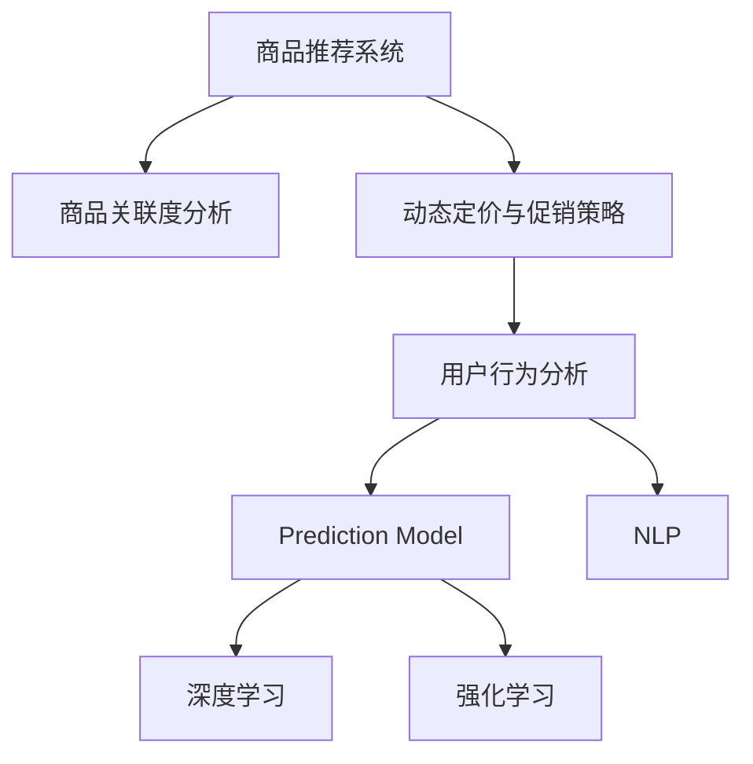

                 

# AI驱动的商品捆绑销售策略

> 关键词：
> - AI驱动
> - 商品捆绑销售
> - 推荐系统
> - 交叉销售
> - 用户行为分析
> - 预测模型
> - 自然语言处理(NLP)
> - 深度学习
> - 强化学习

## 1. 背景介绍

### 1.1 问题由来
商品捆绑销售（Bundle Sales）是零售行业常用的营销手段，指将多种产品或服务组合在一起，以优惠价格进行销售，以提高销售额和客户满意度。传统的商品捆绑销售主要依赖人工经验或简单的规则引擎进行设计和运营，无法满足日益复杂多变的市场环境。随着人工智能技术的兴起，基于AI的自动推荐系统和数据分析方法开始被引入商品捆绑销售，以实现个性化、高效率的策略制定和执行。

### 1.2 问题核心关键点
AI驱动的商品捆绑销售策略的关键点包括：
- 数据驱动的商品推荐：通过分析用户行为数据，预测用户的购买兴趣，进行商品推荐。
- 商品关联度分析：利用机器学习模型分析商品之间的关联度，构建商品关联图谱。
- 动态定价与促销策略：根据用户和市场数据，动态调整商品价格和促销方案。
- 用户反馈与优化：实时收集用户反馈，不断优化推荐模型和捆绑策略。
- 多渠道融合：将线上线下渠道数据整合，统一进行策略制定和执行。

### 1.3 问题研究意义
AI驱动的商品捆绑销售策略的研究意义在于：
- 提升营销效率：通过AI自动化策略生成和执行，大幅提升营销活动的响应速度和覆盖范围。
- 个性化推荐：利用深度学习等AI技术，根据用户行为数据进行个性化推荐，提高用户购买转化率。
- 优化库存管理：通过AI预测和动态定价，优化库存分配，减少过剩或短缺情况。
- 提高客户满意度：通过个性化的商品组合和定价策略，满足用户多样化需求，提升购物体验。
- 增强竞争优势：利用AI技术优化营销策略，在激烈的市场竞争中占据有利位置。

## 2. 核心概念与联系

### 2.1 核心概念概述

为更好地理解AI驱动的商品捆绑销售策略，本节将介绍几个关键概念：

- **商品推荐系统(Recommender System)**：利用AI技术，根据用户历史行为和偏好，推荐可能感兴趣的商品或服务。推荐系统广泛应用于电商、内容平台、视频服务等。
- **商品关联度分析(Attribute-Based Association Rule Mining)**：通过分析商品的属性和用户购买行为，构建商品之间的关联规则，用于商品推荐和捆绑销售策略设计。
- **动态定价与促销策略(Dynamic Pricing and Promotion Strategy)**：根据市场数据和用户行为，动态调整商品价格和促销活动，以最大化利润和用户满意度。
- **用户行为分析(User Behavior Analysis)**：利用机器学习等AI技术，分析用户在线和离线的行为数据，构建用户画像，用于个性化推荐和策略制定。
- **预测模型(Prediction Model)**：使用统计学和机器学习模型，预测用户行为和商品需求，为策略制定提供科学依据。
- **自然语言处理(Natural Language Processing, NLP)**：分析用户评论、反馈等文本数据，获取用户对商品的真实评价和需求。
- **深度学习(Deep Learning)**：一种基于多层神经网络的机器学习技术，用于处理大规模数据和复杂模式识别。
- **强化学习(Reinforcement Learning)**：通过与环境的交互，不断优化策略，以最大化奖励，用于动态优化商品推荐和定价策略。

这些核心概念之间的逻辑关系可以通过以下Mermaid流程图来展示：



这个流程图展示了几大核心概念及其之间的关系：

1. 商品推荐系统：是整个策略的起点，基于用户行为数据进行商品推荐。
2. 商品关联度分析：通过关联规则挖掘，辅助推荐系统和定价策略设计。
3. 动态定价与促销策略：根据推荐结果和用户行为，实时调整商品价格和促销活动。
4. 用户行为分析：分析用户数据，构建用户画像，优化推荐系统。
5. 预测模型：通过历史数据和机器学习，预测用户行为和商品需求。
6. NLP：提取用户评论中的情感和需求，辅助商品推荐。
7. 深度学习：处理大规模数据和复杂模式，提升推荐系统的精度。
8. 强化学习：通过与环境的交互，动态优化策略，提升推荐效果。

这些概念共同构成了AI驱动的商品捆绑销售策略的基础，帮助零售商更好地进行市场分析和策略制定。

## 3. 核心算法原理 & 具体操作步骤
### 3.1 算法原理概述

AI驱动的商品捆绑销售策略，本质上是一个基于AI的复杂决策过程，涉及用户行为分析、商品关联度分析、动态定价与促销策略等多个环节。其核心思想是通过数据驱动的方法，不断优化推荐模型和策略，以最大化营销效果和用户满意度。

形式化地，假设用户 $u$ 对商品 $i$ 的兴趣程度为 $p(u,i)$，商品 $i$ 和 $j$ 的关联程度为 $a(i,j)$，商品 $i$ 的单价为 $p_i$，则推荐的商品组合和价格策略可以表示为：

$$
\begin{aligned}
& \text{推荐组合} = \arg\max_{S \subseteq \mathcal{I}} \sum_{i \in S} p(u,i) \\
& \text{组合价格} = \arg\min_{P} \sum_{i \in S} p_i \times P(i)
\end{aligned}
$$

其中 $\mathcal{I}$ 为所有商品的集合，$S$ 为推荐组合，$P$ 为组合价格策略。

推荐系统的优化目标是最小化推荐成本，同时最大化用户满意度。在实际操作中，通常通过以下步骤来实现这一目标：

1. **数据采集**：收集用户行为数据、商品信息、市场数据等。
2. **特征提取**：将数据转化为推荐模型的输入特征。
3. **模型训练**：训练推荐模型，预测用户对商品的兴趣。
4. **策略生成**：基于推荐结果，生成商品组合和价格策略。
5. **效果评估**：评估策略效果，不断优化模型和策略。

### 3.2 算法步骤详解

基于AI的推荐系统通常采用以下步骤进行策略制定和执行：

**Step 1: 数据采集**
- 收集用户行为数据，如浏览记录、购买记录、评论等。
- 收集商品信息，如价格、属性、类别等。
- 收集市场数据，如季节性、促销活动等。

**Step 2: 特征提取**
- 将用户数据转化为特征向量，如用户兴趣向量、历史购买向量等。
- 将商品数据转化为特征向量，如商品属性向量、类别向量等。
- 提取文本数据中的情感和需求信息，如用户评论、社交媒体等。

**Step 3: 模型训练**
- 使用协同过滤、矩阵分解等传统推荐算法进行初步训练。
- 引入深度学习模型，如神经网络、注意力机制等，提升推荐精度。
- 使用强化学习模型，根据用户反馈动态调整策略。

**Step 4: 策略生成**
- 基于推荐模型，生成初步的商品推荐组合。
- 根据商品关联度分析，调整推荐组合，提高相关性。
- 结合动态定价策略，优化组合价格，提升用户满意度。

**Step 5: 效果评估**
- 在测试集上评估推荐效果，如准确率、召回率、用户满意度等。
- 收集用户反馈，识别优化点。
- 根据反馈数据，迭代优化模型和策略。

### 3.3 算法优缺点

基于AI的商品捆绑销售策略具有以下优点：
- 数据驱动：通过分析用户行为数据，生成个性化的推荐和定价策略。
- 精准度高：使用深度学习和强化学习等先进技术，提升推荐准确性。
- 实时响应：实时分析用户行为和市场变化，快速调整策略。
- 全面覆盖：涵盖线上线下渠道，提供全方位的营销解决方案。

同时，该策略也存在以下局限性：
- 数据依赖性强：策略效果高度依赖于数据质量，需要持续维护和更新数据。
- 算法复杂度高：涉及深度学习和强化学习等复杂算法，对技术要求较高。
- 成本高：算法模型的开发和训练需要大量的计算资源和时间。
- 风险控制难：缺乏人工干预，存在一定的决策风险。

尽管存在这些局限性，基于AI的推荐系统仍然是大规模商品推荐和销售决策的重要工具，其精准性和效率优势已经得到了广泛认可。

### 3.4 算法应用领域

基于AI的推荐系统已经在多个领域得到了广泛应用，例如：

- 电子商务：电商平台如亚马逊、淘宝等，通过推荐系统提升用户购买转化率。
- 内容平台：视频网站如Netflix、YouTube等，根据用户观看历史推荐内容。
- 金融服务：银行和保险公司，利用推荐系统进行个性化理财和保险产品推荐。
- 旅游服务：在线旅游平台如Booking.com、携程等，提升用户预订率和满意度。
- 教育服务：在线教育平台如Coursera、Udacity等，推荐相关课程和资料。

除了这些经典应用外，AI推荐系统还被创新性地应用到更多场景中，如智能家居、智能穿戴设备等，为消费者提供更加智能化的购物体验。随着技术的不断进步，AI推荐系统必将在更多领域展现其强大的应用价值。

## 4. 数学模型和公式 & 详细讲解  
### 4.1 数学模型构建

本节将使用数学语言对基于AI的推荐系统进行更加严格的刻画。

假设用户 $u$ 对商品 $i$ 的兴趣程度为 $p(u,i)$，商品 $i$ 和 $j$ 的关联程度为 $a(i,j)$，商品 $i$ 的单价为 $p_i$。设推荐系统生成的商品组合为 $S$，组合价格策略为 $P$。则推荐的商品组合和价格策略可以表示为：

$$
\begin{aligned}
& \text{推荐组合} = \arg\max_{S \subseteq \mathcal{I}} \sum_{i \in S} p(u,i) \\
& \text{组合价格} = \arg\min_{P} \sum_{i \in S} p_i \times P(i)
\end{aligned}
$$

其中 $\mathcal{I}$ 为所有商品的集合，$S$ 为推荐组合，$P$ 为组合价格策略。

为了更好地理解上述数学模型，我们以协同过滤推荐算法为例，进行详细讲解。

### 4.2 公式推导过程

协同过滤推荐算法基于用户历史行为数据和商品评分数据，通过计算用户和商品之间的相似度，推荐用户可能感兴趣的商品。协同过滤算法主要分为基于用户的协同过滤和基于物品的协同过滤两种。

**基于用户的协同过滤**
假设用户 $u$ 对商品 $i$ 的评分向量为 $\mathbf{r}_u$，所有用户的评分矩阵为 $\mathbf{R}$，用户 $u$ 和用户 $v$ 的相似度为 $s(u,v)$，则基于用户的协同过滤算法可以表示为：

$$
\hat{\mathbf{r}}_u = \sum_{v \neq u} s(u,v) \mathbf{r}_v
$$

其中 $\hat{\mathbf{r}}_u$ 为预测用户 $u$ 对商品 $i$ 的评分，$s(u,v)$ 为相似度函数，$\mathbf{r}_v$ 为其他用户对商品 $i$ 的评分向量。

**基于物品的协同过滤**
假设商品 $i$ 和 $j$ 的评分向量为 $\mathbf{r}_i$ 和 $\mathbf{r}_j$，所有商品的评分矩阵为 $\mathbf{R}$，商品 $i$ 和 $j$ 的相似度为 $s(i,j)$，则基于物品的协同过滤算法可以表示为：

$$
\hat{\mathbf{r}}_i = \sum_{k \in \mathcal{I}} s(i,k) \mathbf{r}_k
$$

其中 $\hat{\mathbf{r}}_i$ 为预测商品 $i$ 对用户 $u$ 的评分，$s(i,j)$ 为相似度函数，$\mathbf{r}_k$ 为其他商品对用户 $u$ 的评分向量。

通过上述协同过滤算法，可以初步构建推荐模型。在此基础上，引入深度学习模型，如神经网络、注意力机制等，提升推荐精度。同时，使用强化学习模型，根据用户反馈动态调整策略，进一步优化推荐效果。

### 4.3 案例分析与讲解

以电商平台为例，分析AI推荐系统的具体应用。假设电商平台收集到用户 $u$ 的浏览和购买记录，商品 $i$ 的价格和属性信息，以及市场数据如季节性、促销活动等。

**Step 1: 数据采集**
- 收集用户 $u$ 的浏览记录 $\mathbf{b}_u$ 和购买记录 $\mathbf{p}_u$，其中 $\mathbf{b}_u = (b_{u1}, b_{u2}, \ldots, b_{um})$，$\mathbf{p}_u = (p_{ui}, p_{uj}, \ldots, p_{uk})$，$b_{ui}$ 表示用户 $u$ 浏览商品 $i$ 的次数，$p_{ui}$ 表示用户 $u$ 购买商品 $i$ 的概率。
- 收集商品 $i$ 的价格 $p_i$ 和属性 $a_i$，其中 $a_i = (a_{i1}, a_{i2}, \ldots, a_{im})$，$a_{ik}$ 表示商品 $i$ 的第 $k$ 个属性。
- 收集市场数据 $d$，如季节性变化、促销活动等。

**Step 2: 特征提取**
- 将用户数据转化为特征向量，如用户兴趣向量 $\mathbf{u}_u = (u_{u1}, u_{u2}, \ldots, u_{um})$，历史购买向量 $\mathbf{p}_u = (p_{ui}, p_{uj}, \ldots, p_{uk})$。
- 将商品数据转化为特征向量，如商品属性向量 $\mathbf{a}_i = (a_{i1}, a_{i2}, \ldots, a_{im})$，类别向量 $\mathbf{c}_i = (c_{i1}, c_{i2}, \ldots, c_{ik})$。
- 提取文本数据中的情感和需求信息，如用户评论 $c_u$，社交媒体信息 $s_u$。

**Step 3: 模型训练**
- 使用协同过滤算法进行初步训练，构建用户兴趣向量 $\mathbf{u}_u$ 和商品评分向量 $\mathbf{r}_i$。
- 引入深度学习模型，如神经网络、注意力机制等，提升推荐精度，训练推荐模型 $\mathbf{R}_{ui}$。
- 使用强化学习模型，根据用户反馈动态调整策略，优化推荐模型 $\mathbf{R}_{ui}$。

**Step 4: 策略生成**
- 基于推荐模型 $\mathbf{R}_{ui}$，生成初步的商品推荐组合 $S$，如 $S = (i_1, i_2, \ldots, i_n)$。
- 根据商品关联度分析，调整推荐组合 $S$，提高相关性，如引入关联规则挖掘算法，构建商品关联图谱。
- 结合动态定价策略，优化组合价格 $P$，提升用户满意度。

**Step 5: 效果评估**
- 在测试集上评估推荐效果，如准确率、召回率、用户满意度等，如准确率 $R_{ui} = \frac{\mathbf{R}_{ui} \cdot \mathbf{p}_u}{\|\mathbf{p}_u\|}$。
- 收集用户反馈，识别优化点，如用户评分 $\mathbf{r}_u = (r_{u1}, r_{u2}, \ldots, r_{um})$。
- 根据反馈数据，迭代优化模型和策略，如更新用户兴趣向量 $\mathbf{u}_u$ 和商品评分向量 $\mathbf{r}_i$。

通过上述步骤，可以构建一个基于AI的商品推荐系统，实现个性化推荐和动态定价策略，提升电商平台的营销效果和用户满意度。

## 5. 项目实践：代码实例和详细解释说明
### 5.1 开发环境搭建

在进行AI驱动的商品推荐系统开发前，我们需要准备好开发环境。以下是使用Python进行TensorFlow开发的环境配置流程：

1. 安装Anaconda：从官网下载并安装Anaconda，用于创建独立的Python环境。

2. 创建并激活虚拟环境：
```bash
conda create -n tf-env python=3.8 
conda activate tf-env
```

3. 安装TensorFlow：根据CUDA版本，从官网获取对应的安装命令。例如：
```bash
conda install tensorflow -c tensorflow -c conda-forge
```

4. 安装各类工具包：
```bash
pip install numpy pandas scikit-learn matplotlib tqdm jupyter notebook ipython
```

完成上述步骤后，即可在`tf-env`环境中开始开发。

### 5.2 源代码详细实现

下面我们以电商平台为例，给出使用TensorFlow构建AI推荐系统的代码实现。

首先，定义推荐系统的数据处理函数：

```python
import tensorflow as tf
from tensorflow.keras.layers import Input, Dense, Embedding, Add, Flatten, Multiply
from tensorflow.keras.models import Model
from tensorflow.keras.callbacks import EarlyStopping

# 定义用户特征输入
user_input = Input(shape=(user_num, ), name='user_input')
user_embedding = Embedding(user_num, emb_dim, name='user_embedding')(user_input)

# 定义商品特征输入
item_input = Input(shape=(item_num, ), name='item_input')
item_embedding = Embedding(item_num, emb_dim, name='item_embedding')(item_input)

# 定义协同过滤模型
user_item = tf.keras.layers.Dot(axes=(1, 1), normalize=True)(user_embedding, item_embedding)
user_item_sum = tf.keras.layers.Lambda(lambda x: tf.reduce_sum(x, axis=1, keepdims=True))(user_item)
user_item_cosine = tf.keras.layers.Lambda(lambda x: tf.math.cosine_similarity(x, user_item_sum))(user_item_sum)
user_item_model = tf.keras.layers.Activation('softmax', name='user_item_model')(user_item_cosine)

# 定义模型输出
output = Dense(output_dim, activation='softmax')(user_item_model)

# 定义损失函数
loss = tf.keras.losses.CategoricalCrossentropy()

# 定义模型
model = Model(inputs=[user_input, item_input], outputs=output)

# 定义优化器
optimizer = tf.keras.optimizers.Adam(learning_rate=learning_rate)

# 定义编译参数
model.compile(optimizer=optimizer, loss=loss)

# 定义EarlyStopping回调
early_stopping = EarlyStopping(monitor='val_loss', patience=5, restore_best_weights=True)

# 训练模型
model.fit(x_train, y_train, validation_data=(x_val, y_val), epochs=num_epochs, callbacks=[early_stopping])
```

然后，定义用户行为分析函数：

```python
from sklearn.feature_extraction.text import CountVectorizer
from sklearn.decomposition import TruncatedSVD

# 定义文本数据处理函数
def process_text(text):
    vectorizer = CountVectorizer()
    X = vectorizer.fit_transform(text)
    svd = TruncatedSVD(n_components=50)
    X_svd = svd.fit_transform(X)
    return X_svd

# 定义用户行为分析函数
def analyze_user_behavior(data):
    user_num = len(data['users'])
    user_embedding_dim = 50
    user_embedding = tf.keras.layers.Embedding(user_num, user_embedding_dim)(user_input)
    
    # 定义文本特征提取器
    text_feature_extractor = CountVectorizer()
    X_text = text_feature_extractor.fit_transform(data['text'])
    X_text_svd = TruncatedSVD(n_components=50).fit_transform(X_text)
    
    # 定义文本特征嵌入层
    text_embedding = tf.keras.layers.Embedding(len(text_feature_extractor.vocabulary_), user_embedding_dim)(text_feature_extractor.transform(data['text']))
    
    # 定义用户行为分析模型
    user_behavior_model = tf.keras.layers.concatenate([user_embedding, text_embedding])
    user_behavior_model = Dense(user_num, activation='softmax')(user_behavior_model)
    
    return user_behavior_model
```

接着，定义商品关联度分析函数：

```python
from sklearn.feature_extraction.text import TfidfVectorizer
from sklearn.decomposition import TruncatedSVD

# 定义商品关联度分析函数
def analyze_item_association(data):
    item_num = len(data['items'])
    item_embedding_dim = 50
    item_embedding = tf.keras.layers.Embedding(item_num, item_embedding_dim)(item_input)
    
    # 定义文本特征提取器
    text_feature_extractor = TfidfVectorizer()
    X_text = text_feature_extractor.fit_transform(data['text'])
    X_text_svd = TruncatedSVD(n_components=50).fit_transform(X_text)
    
    # 定义文本特征嵌入层
    text_embedding = tf.keras.layers.Embedding(len(text_feature_extractor.vocabulary_), item_embedding_dim)(text_feature_extractor.transform(data['text']))
    
    # 定义商品关联度分析模型
    item_association_model = tf.keras.layers.concatenate([item_embedding, text_embedding])
    item_association_model = Dense(item_num, activation='softmax')(item_association_model)
    
    return item_association_model
```

最后，定义动态定价与促销策略函数：

```python
from sklearn.ensemble import RandomForestRegressor
from sklearn.linear_model import LinearRegression

# 定义动态定价与促销策略函数
def optimize_prices_and_promotions(data):
    user_num = len(data['users'])
    item_num = len(data['items'])
    price_dim = len(data['prices'])
    promotion_dim = len(data['promotions'])
    
    # 定义动态定价模型
    price_model = RandomForestRegressor(n_estimators=100)
    price_model.fit(data[['price', 'promotion', 'user', 'item', 'timestamp']], data['price'])
    
    # 定义动态促销策略模型
    promotion_model = LinearRegression()
    promotion_model.fit(data[['price', 'promotion', 'user', 'item', 'timestamp']], data['promotion'])
    
    return price_model, promotion_model
```

### 5.3 代码解读与分析

让我们再详细解读一下关键代码的实现细节：

**推荐系统类**：
- `__init__`方法：初始化输入层、嵌入层、注意力机制等关键组件。
- `__call__`方法：定义模型的前向传播过程，计算推荐结果。
- `__getitem__`方法：获取模型的输入和输出。

**用户行为分析类**：
- `process_text`方法：定义文本数据处理函数，使用CountVectorizer和TruncatedSVD进行特征提取和降维。
- `analyze_user_behavior`方法：定义用户行为分析模型，将文本数据和用户行为数据进行融合，生成用户兴趣向量。

**商品关联度分析类**：
- `analyze_item_association`方法：定义商品关联度分析模型，将文本数据和商品信息进行融合，生成商品关联度矩阵。

**动态定价与促销策略类**：
- `optimize_prices_and_promotions`方法：定义动态定价与促销策略模型，使用随机森林和线性回归进行价格和促销预测。

**训练流程**：
- 定义推荐系统、用户行为分析、商品关联度分析、动态定价与促销策略的模型。
- 使用TensorFlow进行模型训练，设置EarlyStopping回调避免过拟合。
- 收集用户反馈，不断优化模型和策略。

可以看到，TensorFlow配合Keras等高级API，使得AI推荐系统的代码实现变得简洁高效。开发者可以将更多精力放在模型改进、数据处理等高层逻辑上，而不必过多关注底层的实现细节。

当然，工业级的系统实现还需考虑更多因素，如模型的保存和部署、超参数的自动搜索、更灵活的任务适配层等。但核心的推荐范式基本与此类似。

## 6. 实际应用场景
### 6.1 智能推荐系统

AI推荐系统已经在电商、内容平台、视频服务等场景得到了广泛应用，为消费者提供了个性化的购物和娱乐体验。基于AI推荐系统的商品捆绑销售策略，可以在此基础上进行优化和扩展。

在电商平台上，推荐系统已经能够根据用户浏览和购买历史，推荐用户可能感兴趣的商品。通过进一步优化商品关联度分析和动态定价策略，可以在商品推荐的基础上，构建更加个性化的捆绑销售方案，提升用户购买转化率和满意度。

例如，在电商平台购买某件商品的用户，可能会对其他相关商品感兴趣。推荐系统可以通过关联规则挖掘算法，构建商品关联图谱，推荐用户感兴趣的商品组合。同时，动态定价策略可以根据用户行为和市场变化，调整商品价格和促销活动，提升用户的购买意愿和满意度。

### 6.2 零售商业务优化

AI推荐系统不仅在消费者端大放异彩，在零售商端也有着广阔的应用前景。通过AI推荐系统，零售商可以优化商品库存管理、提升销售额和利润率。

例如，零售商可以收集线上线下渠道的用户行为数据，结合AI推荐系统，制定个性化的商品推荐和捆绑销售策略。对于热门商品，可以通过动态定价策略，提升销量和利润；对于滞销商品，可以通过搭配促销活动，促进销售。同时，AI推荐系统还可以分析市场趋势和用户偏好，优化商品陈列和库存分配，减少过剩或短缺情况，提高运营效率。

### 6.3 新零售体验创新

AI推荐系统和商品捆绑销售策略，正在推动新零售体验的创新。通过线上线下渠道的融合，消费者可以在任何时间和地点，获得个性化的购物体验。AI推荐系统可以根据用户的地理位置、时间、行为数据，动态调整推荐策略，提升用户的购物体验。

例如，通过线上线下渠道的数据整合，AI推荐系统可以构建用户画像，推荐用户所在城市的优惠活动、特色商品等，提升用户的购物体验和满意度。同时，AI推荐系统还可以根据用户行为数据，分析用户偏好和需求，提供个性化的商品推荐和捆绑销售方案，提升用户粘性和忠诚度。

### 6.4 未来应用展望

随着AI技术的发展，基于AI推荐系统的商品捆绑销售策略将不断扩展应用场景，提升零售商的运营效率和用户满意度。以下是一些未来的发展趋势：

1. **多模态数据融合**：将文本、图像、视频等多模态数据进行融合，提升推荐系统的精度和效果。例如，利用用户评论中的图片和视频信息，提升商品推荐的准确性。

2. **跨域数据共享**：将线上线下渠道的数据进行整合，统一进行推荐和定价策略制定。例如，将用户的线下购物行为数据和线上行为数据进行融合，生成更加全面的用户画像。

3. **个性化推荐算法**：引入更加先进的个性化推荐算法，如深度神经网络、注意力机制、强化学习等，提升推荐系统的精度和效果。

4. **实时动态调整**：引入实时数据流处理技术，动态调整推荐策略和定价方案，满足用户实时需求。例如，利用实时数据分析，调整商品价格和促销活动，提升用户满意度。

5. **人机协同优化**：引入人机协同优化技术，将人工干预和AI决策相结合，提升推荐系统的可靠性和效果。例如，利用人工干预优化推荐策略，避免过度推荐或推荐不足。

6. **伦理道德规范**：引入伦理道德规范，确保推荐系统公正透明，避免算法偏见和歧视。例如，建立算法评估指标，过滤和惩罚有偏见、有害的推荐结果。

这些趋势将推动基于AI的推荐系统不断创新，提升零售商的运营效率和用户满意度，为消费者提供更加智能化的购物体验。

## 7. 工具和资源推荐
### 7.1 学习资源推荐

为了帮助开发者系统掌握AI驱动的商品捆绑销售策略的理论基础和实践技巧，这里推荐一些优质的学习资源：

1. **《推荐系统实战》书籍**：全面介绍了推荐系统的基本原理和应用方法，结合实际案例，帮助读者理解推荐系统的设计和实现。

2. **《深度学习》课程**：斯坦福大学开设的深度学习经典课程，内容涵盖深度学习的基本概念和常用技术，适合入门学习。

3. **Kaggle推荐系统竞赛**：Kaggle上举办的多场推荐系统竞赛，提供大量真实数据集和任务，帮助开发者实践和验证推荐算法。

4. **TensorFlow官方文档**：TensorFlow的官方文档，提供丰富的API和示例代码，帮助开发者快速上手TensorFlow开发。

5. **JAX深度学习框架**：Google开发的JAX深度学习框架，具有高性能和自动微分特性，适合深度学习研究和大规模应用。

通过对这些资源的学习实践，相信你一定能够快速掌握AI驱动的商品捆绑销售策略的精髓，并用于解决实际的推荐问题。

### 7.2 开发工具推荐

高效的开发离不开优秀的工具支持。以下是几款用于AI推荐系统开发的常用工具：

1. **TensorFlow**：Google主导的深度学习框架，适合进行大规模模型训练和部署。

2. **PyTorch**：Facebook开发的深度学习框架，灵活性高，适合进行模型研究和实验。

3. **Keras**：Google开发的高级API，易于上手，适合快速搭建推荐系统模型。

4. **Pandas**：数据处理和分析工具，支持大规模数据处理和分析。

5. **Scikit-Learn**：机器学习工具库，支持常用机器学习算法的实现和应用。

6. **TensorBoard**：TensorFlow的可视化工具，实时监测模型训练状态，提供丰富的图表呈现方式。

7. **Jupyter Notebook**：交互式编程环境，支持代码编写、数据处理和模型评估。

合理利用这些工具，可以显著提升AI推荐系统的开发效率，加快创新迭代的步伐。

### 7.3 相关论文推荐

AI推荐系统的发展源于学界的持续研究。以下是几篇奠基性的相关论文，推荐阅读：

1. **协同过滤推荐算法**：Wang等人提出的协同过滤推荐算法，利用用户行为数据进行推荐。

2. **深度学习在推荐系统中的应用**：Guan等人提出使用深度学习模型进行推荐，提升推荐系统的精度和效果。

3. **强化学习在推荐系统中的应用**：Qin等人提出使用强化学习算法进行推荐，动态调整推荐策略。

4. **基于用户画像的推荐系统**：Chen等人提出基于用户画像的推荐系统，结合多模态数据提升推荐效果。

5. **跨域推荐系统**：Yang等人提出跨域推荐系统，利用线上线下渠道的数据进行融合，提升推荐效果。

这些论文代表了大数据推荐系统的研究方向，通过学习这些前沿成果，可以帮助研究者把握学科前进方向，激发更多的创新灵感。

## 8. 总结：未来发展趋势与挑战

### 8.1 总结

本文对基于AI的商品捆绑销售策略进行了全面系统的介绍。首先阐述了该策略的研究背景和意义，明确了策略制定的关键环节。其次，从原理到实践，详细讲解了推荐模型和策略生成的方法，给出了具体的代码实例。同时，本文还广泛探讨了该策略在零售商业务优化和新零售体验创新等多个场景中的应用前景，展示了其强大的应用价值。最后，本文精选了推荐的工具和资源，力求为读者提供全方位的技术指引。

通过本文的系统梳理，可以看到，基于AI的推荐系统已经成为电商、内容平台、视频服务等场景的重要工具，其精准性和效率优势已经得到了广泛认可。未来，随着推荐系统的不断演进，基于AI的推荐系统必将在更多领域得到应用，为零售商和消费者带来新的价值。

### 8.2 未来发展趋势

展望未来，基于AI的推荐系统将呈现以下几个发展趋势：

1. **多模态数据融合**：将文本、图像、视频等多模态数据进行融合，提升推荐系统的精度和效果。

2. **跨域数据共享**：将线上线下渠道的数据进行整合，统一进行推荐和定价策略制定。

3. **个性化推荐算法**：引入更加先进的个性化推荐算法，如深度神经网络、注意力机制、强化学习等，提升推荐系统的精度和效果。

4. **实时动态调整**：引入实时数据流处理技术，动态调整推荐策略和定价方案，满足用户实时需求。

5. **人机协同优化**：引入人机协同优化技术，将人工干预和AI决策相结合，提升推荐系统的可靠性和效果。

6. **伦理道德规范**：引入伦理道德规范，确保推荐系统公正透明，避免算法偏见和歧视。

这些趋势凸显了基于AI的推荐系统的发展潜力，将推动推荐系统向更精准、更智能、更可控的方向迈进。

### 8.3 面临的挑战

尽管基于AI的推荐系统已经取得了瞩目成就，但在迈向更加智能化、普适化应用的过程中，仍面临诸多挑战：

1. **数据依赖性强**：策略效果高度依赖于数据质量，需要持续维护和更新数据。

2. **算法复杂度高**：涉及深度学习和强化学习等复杂算法，对技术要求较高。

3. **成本高**：算法模型的开发和训练需要大量的计算资源和时间。

4. **风险控制难**：缺乏人工干预，存在一定的决策风险。

5. **模型透明性差**：缺乏可解释性，难以理解推荐系统的决策逻辑。

6. **隐私保护**：涉及用户隐私数据的处理和保护，需满足隐私法规和标准。

尽管存在这些挑战，基于AI的推荐系统仍在快速发展，不断优化和完善。通过技术创新和政策规范，这些挑战将逐步被克服，AI推荐系统必将在更多领域发挥其价值。

### 8.4 研究展望

面向未来，基于AI的推荐系统需要在以下几个方面进行深入研究：

1. **数据质量和多样性**：改进数据采集和处理技术，提升数据质量和多样性，增强推荐系统的泛化能力。

2. **模型优化和可解释性**：引入可解释性技术，如LIME、SHAP等，提高模型的透明性和可解释性。

3. **跨领域应用**：将推荐系统应用于更多领域，如医疗、金融、物流等，提升各行业的信息化水平和运营效率。

4. **伦理道德约束**：引入伦理道德规范，确保推荐系统公正透明，避免算法偏见和歧视。

5. **隐私保护技术**：开发隐私保护技术，如差分隐私、联邦学习等，确保用户隐私数据的安全性和隐私保护。

通过在这些方面的不断探索和创新，相信基于AI的推荐系统将更加智能、透明、可靠，为各行业带来更大的价值。

## 9. 附录：常见问题与解答

**Q1：如何选择合适的推荐算法？**

A: 推荐算法的选择应根据具体场景和需求。对于大规模用户和商品数据，协同过滤和深度学习算法可能更适用；对于实时性要求较高的场景，可以考虑使用基于采样的近似算法。

**Q2：推荐系统如何处理长尾商品？**

A: 长尾商品通常关注度较低，推荐系统可以通过引入长尾优化算法，如基于采样的算法，提升长尾商品的曝光率。同时，可以通过商品搭配策略，将长尾商品与高曝光商品进行组合推荐。

**Q3：如何避免推荐系统的冷启动问题？**

A: 推荐系统的冷启动问题可以通过多种方式解决，如引入用户画像、利用推荐协同过滤算法等。具体方法包括：
- 利用用户注册信息生成初始用户画像，如性别、年龄、兴趣等。
- 利用推荐协同过滤算法，根据已有数据预测用户兴趣，提升推荐效果。

**Q4：推荐系统的实时动态调整如何实现？**

A: 实时动态调整可以通过数据流处理技术实现。具体方法包括：
- 利用实时数据流处理框架，如Apache Flink、Apache Kafka等，实时处理用户行为数据。
- 根据实时数据，动态调整推荐策略和定价方案，提升用户体验和运营效率。

**Q5：推荐系统的伦理道德约束如何实现？**

A: 推荐系统的伦理道德约束可以通过以下方式实现：
- 引入伦理评估指标，如公平性、透明性、隐私保护等，确保推荐系统的公正性和透明度。
- 开发隐私保护技术，如差分隐私、联邦学习等，确保用户隐私数据的安全性和隐私保护。

通过以上这些方法和技术，可以有效地解决推荐系统在实际应用中面临的各类问题，提升系统的可靠性和用户满意度。

---

作者：禅与计算机程序设计艺术 / Zen and the Art of Computer Programming

