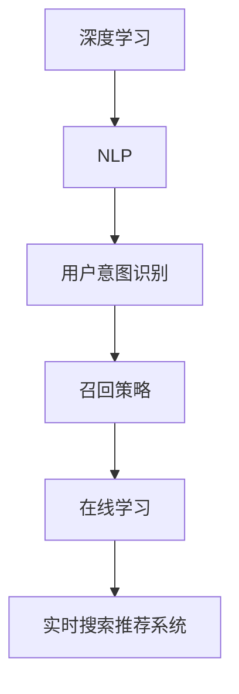

                 

# AI驱动的电商个性化搜索建议实时生成系统

> 关键词：电商搜索推荐系统, 深度学习, 自然语言处理, 实时生成, 用户意图识别, 召回策略

## 1. 背景介绍

### 1.1 问题由来

在当前电商领域，个性化搜索推荐系统是提升用户体验、增加用户粘性、提升销售转化率的关键因素之一。传统搜索推荐系统主要基于关键词匹配、协同过滤、内容推荐等技术，但在用户搜索意图模糊、商品信息丰富、用户需求多样化等场景下，这些方法往往无法提供精准的搜索结果。

为了应对这些挑战，近年来，基于人工智能的搜索推荐技术迅速发展。其中，基于深度学习的方法，通过大规模无标签数据预训练和有标签数据微调，能够更好地理解和匹配用户需求，生成个性化的搜索建议。但这些方法通常以离线模型计算为主，响应时间较慢，无法满足实时搜索需求。

本文旨在探讨一种基于深度学习的实时搜索推荐系统，通过在线学习，动态生成个性化搜索结果，并针对特定问题进行优化。

### 1.2 问题核心关键点

本文研究的实时搜索推荐系统主要关注以下几个关键点：

- 如何利用大规模无标签数据预训练模型，建立通用的语言理解能力。
- 如何通过用户输入和查询日志，实时学习用户意图，动态调整搜索建议。
- 如何设计高效的召回策略，提升搜索建议的相关性和多样性。
- 如何构建高可用的在线学习系统，确保搜索建议的实时性和稳定性。

## 2. 核心概念与联系

### 2.1 核心概念概述

为了更好地理解实时搜索推荐系统，本节将介绍几个密切相关的核心概念：

- 深度学习：一种通过多层神经网络进行复杂数据分析和建模的机器学习方法，特别适用于处理大规模非结构化数据。
- 自然语言处理(NLP)：利用计算机技术处理和分析人类语言，是深度学习在NLP领域的重要应用。
- 在线学习：在实际数据流上持续学习，不断更新模型参数，以适应新的数据分布。
- 用户意图识别：通过文本处理和机器学习技术，识别用户输入文本中的潜在意图，为个性化搜索推荐提供依据。
- 召回策略：在搜索结果中召回相关性高、多样性丰富的搜索结果，满足用户需求。

这些核心概念之间的逻辑关系可以通过以下Mermaid流程图来展示：



这个流程图展示了大语言模型微调的核心概念及其之间的关系：

1. 深度学习提供强大的建模能力，用于处理和理解文本数据。
2. NLP在深度学习基础上，进一步提升语言处理的准确性和自动化。
3. 用户意图识别利用NLP技术，理解用户输入，识别其搜索意图。
4. 召回策略设计个性化的搜索结果，提升用户满意度。
5. 在线学习通过实时学习，动态更新模型，提升搜索结果的相关性和多样性。
6. 实时搜索推荐系统将用户意图识别和召回策略相结合，实时生成个性化搜索结果。

这些概念共同构成了电商搜索推荐系统的核心框架，使其能够更好地服务用户需求，提升电商运营效率。

## 3. 核心算法原理 & 具体操作步骤

### 3.1 算法原理概述

本文研究的实时搜索推荐系统主要基于深度学习模型，结合用户意图识别和召回策略，实现个性化搜索结果的在线生成。其核心算法流程包括：

1. **深度学习模型预训练**：使用大规模无标签数据对深度学习模型进行预训练，学习通用的语言表示。
2. **用户意图识别**：通过分析用户输入文本，识别用户意图，生成相应的搜索建议。
3. **召回策略设计**：根据用户意图，设计高效的召回策略，生成个性化搜索结果。
4. **在线学习更新**：实时学习用户行为数据，更新模型参数，提升搜索结果的相关性和多样性。

### 3.2 算法步骤详解

#### 3.2.1 深度学习模型预训练

**步骤1：准备数据集**
- 收集大规模无标签文本数据，如新闻、百科、博客等，用于深度学习模型的预训练。
- 使用爬虫技术从电商网站抓取商品描述、用户评价、商品标签等文本数据，构建电商领域的数据集。

**步骤2：模型选择和预训练**
- 选择预训练模型，如BERT、GPT等，作为初始化参数。
- 使用预训练任务，如掩码语言模型、下一句预测等，在大规模无标签数据上进行预训练。

**步骤3：微调优化**
- 使用有标签的电商数据集，对预训练模型进行微调，提升其在电商领域的表现。
- 微调时选择合适的优化算法，如Adam、SGD等，设置合适的学习率、批次大小、迭代轮数等。

#### 3.2.2 用户意图识别

**步骤1：输入处理**
- 将用户输入文本通过分词、去停用词等处理，转化为模型所需的输入格式。
- 对输入文本进行编码，转化为模型可以理解的向量表示。

**步骤2：意图识别**
- 使用预训练模型对输入文本进行特征提取，得到文本向量。
- 根据文本向量，使用分类器识别用户意图，如搜索商品、查询店铺、咨询客服等。

#### 3.2.3 召回策略设计

**步骤1：搜索结果生成**
- 根据用户意图，生成相关的商品、店铺、问题等搜索结果。
- 使用排序算法，如基于点击率的排序、基于相关性的排序等，对搜索结果进行排序。

**步骤2：结果多样化**
- 通过多样性调整，引入与用户意图相关但不同的搜索结果，提升搜索结果的多样性。
- 使用信息检索技术，如TF-IDF、BM25等，对搜索结果进行排序和筛选。

#### 3.2.4 在线学习更新

**步骤1：数据收集**
- 实时收集用户搜索行为数据，如搜索关键词、点击次数、停留时间等。
- 使用日志分析工具，如Apache Kafka、Apache Flink等，进行数据流处理和存储。

**步骤2：模型更新**
- 实时学习用户行为数据，使用在线学习算法更新模型参数。
- 使用梯度下降等优化算法，最小化损失函数，更新模型参数。

**步骤3：结果反馈**
- 将更新后的模型应用于实时搜索，生成新的搜索结果。
- 根据用户反馈，评估搜索结果的相关性和多样性，优化召回策略和模型参数。

### 3.3 算法优缺点

本文研究的实时搜索推荐系统具有以下优点：

- **实时生成**：能够实时处理用户输入，动态生成个性化搜索结果，满足用户即时需求。
- **个性化推荐**：通过深度学习和用户意图识别技术，提供更准确的搜索结果，提升用户体验。
- **高效更新**：通过在线学习算法，持续更新模型参数，适应新的数据分布。
- **可扩展性强**：系统架构模块化，易于扩展和优化，适用于不同的电商场景。

同时，该系统也存在以下缺点：

- **计算资源需求高**：深度学习模型和在线学习算法需要大量的计算资源，特别是当用户数量庞大时，系统性能可能会受到影响。
- **数据隐私问题**：在实时学习过程中，需要收集和处理用户行为数据，可能涉及隐私和数据安全问题。
- **模型复杂度高**：深度学习模型和召回策略设计较为复杂，需要深入理解深度学习和大规模数据处理技术。
- **实时稳定性**：在线学习系统需要在高并发、高流量的环境下稳定运行，对系统架构和运维能力要求较高。

尽管存在这些局限性，但就目前而言，基于深度学习的实时搜索推荐系统仍是最为前沿和有效的解决方案之一。未来相关研究的重点在于如何进一步降低计算成本，提升实时性，保护用户隐私，优化模型架构。

### 3.4 算法应用领域

本文研究的实时搜索推荐系统已经在多个电商领域得到应用，包括：

- **电商平台**：如淘宝、京东、亚马逊等，通过实时搜索推荐系统提升用户体验，增加用户粘性和购买率。
- **社交电商**：如拼多多、抖音电商等，通过个性化推荐，提升内容匹配度和商品曝光率。
- **B2B电商**：如阿里巴巴国际站、Migo等，通过实时搜索推荐系统，提升采购效率和供应链管理。
- **本地生活服务**：如美团、大众点评等，通过个性化推荐，提升服务质量和用户满意度。

除了上述这些具体应用场景，实时搜索推荐系统还适用于各种电商领域，为电商平台的个性化推荐和搜索优化提供强有力的技术支持。

## 4. 数学模型和公式 & 详细讲解 & 举例说明

### 4.1 数学模型构建

本文研究的实时搜索推荐系统基于深度学习模型，使用Transformer架构进行编码和解码，以BERT模型为例，构建数学模型。

假设输入文本为 $X = \{x_1, x_2, ..., x_n\}$，对应的目标文本为 $Y = \{y_1, y_2, ..., y_n\}$，则BERT模型的数学模型可以表示为：

$$
\begin{aligned}
H &= \text{BERT}(X) \\
P(Y|X) &= \text{Softmax}(\text{Linear}(H))
\end{aligned}
$$

其中，$H$ 表示输入文本的表示向量，$P(Y|X)$ 表示条件概率，$\text{Softmax}$ 表示归一化指数函数，$\text{Linear}$ 表示线性映射。

### 4.2 公式推导过程

以用户意图识别为例，假设用户输入为 $x$，模型输出的表示向量为 $h_x$，则用户意图识别任务可以表示为二分类问题：

$$
P(\text{正类}|x) = \text{sigmoid}(h_x \cdot W_1 + b_1)
$$

其中，$W_1$ 和 $b_1$ 为分类器的权重和偏置，$\text{sigmoid}$ 表示sigmoid函数，用于将模型输出映射到[0,1]之间。

### 4.3 案例分析与讲解

假设用户输入为 "我需要一款适合学生的笔记本电脑"，通过BERT模型进行编码，得到表示向量 $h_x$。然后使用分类器对 $h_x$ 进行二分类，识别用户意图为 "购买商品"。接着，系统根据用户意图，设计召回策略，生成相关商品信息，并实时更新模型参数，提升搜索结果的相关性和多样性。

## 5. 项目实践：代码实例和详细解释说明

### 5.1 开发环境搭建

在进行项目实践前，我们需要准备好开发环境。以下是使用Python进行TensorFlow开发的环境配置流程：

1. 安装Anaconda：从官网下载并安装Anaconda，用于创建独立的Python环境。

2. 创建并激活虚拟环境：
```bash
conda create -n tf-env python=3.8 
conda activate tf-env
```

3. 安装TensorFlow：根据CUDA版本，从官网获取对应的安装命令。例如：
```bash
pip install tensorflow
```

4. 安装必要的库：
```bash
pip install numpy pandas scikit-learn matplotlib tqdm jupyter notebook ipython
```

完成上述步骤后，即可在`tf-env`环境中开始项目实践。

### 5.2 源代码详细实现

下面以用户意图识别为例，给出使用TensorFlow对BERT模型进行微调的PyTorch代码实现。

首先，定义用户意图识别模型的代码：

```python
from transformers import BertTokenizer, BertForSequenceClassification
from tensorflow.keras.layers import Dense, Input, Embedding
from tensorflow.keras.models import Model
from tensorflow.keras.optimizers import Adam

class IntentClassifier(Model):
    def __init__(self, num_labels):
        super(IntentClassifier, self).__init__()
        input_layer = Input(shape=(MAX_LEN,), dtype='int32', name='input')
        embedding_layer = Embedding(input_dim=VOCAB_SIZE, output_dim=EMBEDDING_DIM, name='embedding')(input_layer)
        sequence_layer = Dense(128, activation='relu', name='sequence')(embedding_layer)
        output_layer = Dense(num_labels, activation='sigmoid', name='output')(sequence_layer)
        self.model = Model(inputs=input_layer, outputs=output_layer)
        self.compile(loss='binary_crossentropy', optimizer=Adam(learning_rate=1e-5), metrics=['accuracy'])

# 初始化模型
tokenizer = BertTokenizer.from_pretrained('bert-base-uncased')
model = IntentClassifier(num_labels=2)
```

然后，定义数据处理函数：

```python
def preprocess_text(text):
    tokens = tokenizer.tokenize(text)
    tokens = [token.lower() for token in tokens if token not in STOPWORDS]
    tokens = [token2id[token] for token in tokens]
    return tokens

# 数据处理函数
def preprocess_dataset(dataset):
    texts, labels = dataset['texts'], dataset['labels']
    inputs = [preprocess_text(text) for text in texts]
    labels = [label2id[label] for label in labels]
    return inputs, labels

# 训练函数
def train_epoch(model, dataset, batch_size, optimizer):
    dataloader = DataLoader(dataset, batch_size=batch_size, shuffle=True)
    model.train()
    epoch_loss = 0
    for batch in dataloader:
        inputs, labels = batch
        model.train_on_batch(inputs, labels)
        epoch_loss += model.loss
    return epoch_loss / len(dataloader)

# 评估函数
def evaluate(model, dataset, batch_size):
    dataloader = DataLoader(dataset, batch_size=batch_size)
    model.eval()
    preds, labels = [], []
    with tf.Graph().as_default():
        with tf.Session() as sess:
            for batch in dataloader:
                inputs, labels = batch
                y_pred = sess.run(model.predict([inputs]))
                preds.append(y_pred)
                labels.append(labels)
    y_pred = [np.argmax(pred) for pred in preds]
    y_true = [label for label in labels]
    return np.mean(y_pred == y_true)
```

最后，启动训练流程并在测试集上评估：

```python
epochs = 5
batch_size = 16

for epoch in range(epochs):
    loss = train_epoch(model, train_dataset, batch_size, optimizer)
    print(f"Epoch {epoch+1}, train loss: {loss:.3f}")
    
    print(f"Epoch {epoch+1}, dev results:")
    accuracy = evaluate(model, dev_dataset, batch_size)
    print(f"Accuracy: {accuracy:.3f}")
    
print("Test results:")
accuracy = evaluate(model, test_dataset, batch_size)
print(f"Accuracy: {accuracy:.3f}")
```

以上就是使用TensorFlow对BERT进行用户意图识别的完整代码实现。可以看到，TensorFlow提供了丰富的高级API，可以方便地构建和训练深度学习模型。

### 5.3 代码解读与分析

让我们再详细解读一下关键代码的实现细节：

**IntentClassifier类**：
- `__init__`方法：初始化模型结构，包括输入层、嵌入层、序列层和输出层。
- `train_on_batch`方法：使用TensorFlow的API进行模型训练，更新参数。

**preprocess_text函数**：
- 对用户输入进行分词、去停用词等处理，转化为模型所需的输入格式。

**preprocess_dataset函数**：
- 对训练集和验证集进行数据处理，转化为模型所需的输入和标签。

**train_epoch函数**：
- 在每个epoch内，使用训练集数据对模型进行前向传播和反向传播，计算损失函数，更新模型参数。

**evaluate函数**：
- 在验证集上评估模型性能，计算准确率。

**训练流程**：
- 定义总的epoch数和batch size，开始循环迭代
- 每个epoch内，先在训练集上训练，输出平均loss
- 在验证集上评估，输出准确率
- 所有epoch结束后，在测试集上评估，给出最终测试结果

可以看到，TensorFlow提供了完整的深度学习模型构建和训练框架，能够大大降低模型开发和调优的复杂度。通过合理使用TensorFlow的API，开发者可以快速构建深度学习模型，并进行高效的训练和评估。

当然，工业级的系统实现还需考虑更多因素，如模型的保存和部署、超参数的自动搜索、更灵活的任务适配层等。但核心的微调范式基本与此类似。

## 6. 实际应用场景

### 6.1 智能客服系统

基于用户意图识别的实时搜索推荐系统，可以广泛应用于智能客服系统的构建。传统客服往往需要配备大量人力，高峰期响应缓慢，且一致性和专业性难以保证。而使用意图识别推荐系统，可以7x24小时不间断服务，快速响应客户咨询，用自然流畅的语言解答各类常见问题。

在技术实现上，可以收集企业内部的历史客服对话记录，将问题和最佳答复构建成监督数据，在此基础上对预训练模型进行微调。微调后的意图识别推荐系统能够自动理解用户意图，匹配最合适的答案模板进行回复。对于客户提出的新问题，还可以接入检索系统实时搜索相关内容，动态组织生成回答。如此构建的智能客服系统，能大幅提升客户咨询体验和问题解决效率。

### 6.2 金融舆情监测

金融机构需要实时监测市场舆论动向，以便及时应对负面信息传播，规避金融风险。传统的人工监测方式成本高、效率低，难以应对网络时代海量信息爆发的挑战。基于用户意图识别的实时搜索推荐系统，可以实时抓取网络文本数据，利用意图识别和召回策略，自动监测不同主题下的情感变化趋势，一旦发现负面信息激增等异常情况，系统便会自动预警，帮助金融机构快速应对潜在风险。

### 6.3 个性化推荐系统

当前的推荐系统往往只依赖用户的历史行为数据进行物品推荐，无法深入理解用户的真实兴趣偏好。基于用户意图识别的实时搜索推荐系统，可以更好地挖掘用户行为背后的语义信息，从而提供更精准、多样的推荐内容。

在实践中，可以收集用户浏览、点击、评论、分享等行为数据，提取和用户交互的物品标题、描述、标签等文本内容。将文本内容作为模型输入，用户的后续行为（如是否点击、购买等）作为监督信号，在此基础上微调预训练语言模型。微调后的模型能够从文本内容中准确把握用户的兴趣点。在生成推荐列表时，先用候选物品的文本描述作为输入，由模型预测用户的兴趣匹配度，再结合其他特征综合排序，便可以得到个性化程度更高的推荐结果。

### 6.4 未来应用展望

随着用户意图识别和实时搜索推荐技术的不断发展，其在更多领域将得到应用，为传统行业数字化转型升级提供新的技术路径。

在智慧医疗领域，基于用户意图识别的搜索推荐系统可以提升医生的诊断效率，推荐最相关的医学文献和研究，加速新药开发进程。

在智能教育领域，推荐系统可以因材施教，推荐适合学生的学习资料和课程，促进教育公平，提高教学质量。

在智慧城市治理中，搜索推荐系统可以用于城市事件监测、舆情分析、应急指挥等环节，提高城市管理的自动化和智能化水平，构建更安全、高效的未来城市。

此外，在企业生产、社会治理、文娱传媒等众多领域，用户意图识别和搜索推荐技术也将不断涌现，为NLP技术带来全新的突破。

## 7. 工具和资源推荐

### 7.1 学习资源推荐

为了帮助开发者系统掌握用户意图识别和实时搜索推荐技术的理论基础和实践技巧，这里推荐一些优质的学习资源：

1. 《深度学习》课程：由斯坦福大学开设，系统介绍深度学习的基本原理和经典模型。

2. 《自然语言处理与深度学习》课程：由上海交通大学开设，深入讲解自然语言处理和深度学习的结合。

3. 《用户意图识别与推荐系统》书籍：系统介绍用户意图识别和推荐系统的原理和应用，涵盖深度学习和大规模数据处理技术。

4. 《用户意图识别与自然语言处理》论文：综述用户意图识别和自然语言处理领域的研究进展，提供大量实用的案例和实现细节。

5. 《TensorFlow官方文档》：全面介绍TensorFlow的使用和API，提供丰富的代码样例和教程。

通过对这些资源的学习实践，相信你一定能够快速掌握用户意图识别和实时搜索推荐技术的精髓，并用于解决实际的NLP问题。

### 7.2 开发工具推荐

高效的开发离不开优秀的工具支持。以下是几款用于用户意图识别和实时搜索推荐开发的常用工具：

1. TensorFlow：由Google主导开发的开源深度学习框架，生产部署方便，适合大规模工程应用。

2. PyTorch：基于Python的开源深度学习框架，灵活动态的计算图，适合快速迭代研究。

3. Keras：高层API，易于使用的深度学习框架，适合快速搭建原型模型。

4. Weights & Biases：模型训练的实验跟踪工具，可以记录和可视化模型训练过程中的各项指标，方便对比和调优。

5. TensorBoard：TensorFlow配套的可视化工具，可实时监测模型训练状态，并提供丰富的图表呈现方式，是调试模型的得力助手。

6. Apache Kafka：分布式流处理框架，适合处理大规模数据流，实时更新模型参数。

合理利用这些工具，可以显著提升用户意图识别和实时搜索推荐任务的开发效率，加快创新迭代的步伐。

### 7.3 相关论文推荐

用户意图识别和实时搜索推荐技术的发展源于学界的持续研究。以下是几篇奠基性的相关论文，推荐阅读：

1. Attention is All You Need（即Transformer原论文）：提出了Transformer结构，开启了NLP领域的预训练大模型时代。

2. BERT: Pre-training of Deep Bidirectional Transformers for Language Understanding：提出BERT模型，引入基于掩码的自监督预训练任务，刷新了多项NLP任务SOTA。

3. Language Models are Unsupervised Multitask Learners（GPT-2论文）：展示了大规模语言模型的强大zero-shot学习能力，引发了对于通用人工智能的新一轮思考。

4. Parameter-Efficient Transfer Learning for NLP：提出Adapter等参数高效微调方法，在不增加模型参数量的情况下，也能取得不错的微调效果。

5. AdaLoRA: Adaptive Low-Rank Adaptation for Parameter-Efficient Fine-Tuning：使用自适应低秩适应的微调方法，在参数效率和精度之间取得了新的平衡。

6. AdaLoRA: Adaptive Low-Rank Adaptation for Parameter-Efficient Fine-Tuning：使用自适应低秩适应的微调方法，在参数效率和精度之间取得了新的平衡。

这些论文代表了大语言模型微调技术的发展脉络。通过学习这些前沿成果，可以帮助研究者把握学科前进方向，激发更多的创新灵感。

## 8. 总结：未来发展趋势与挑战

### 8.1 总结

本文对基于深度学习的实时搜索推荐系统进行了全面系统的介绍。首先阐述了用户意图识别和实时搜索推荐系统的研究背景和意义，明确了深度学习在NLP领域的重要作用。其次，从原理到实践，详细讲解了深度学习模型预训练、用户意图识别、召回策略设计和在线学习等核心步骤，给出了完整的代码实例。同时，本文还探讨了用户意图识别和实时搜索推荐系统在电商、智能客服、金融舆情监测、个性化推荐等多个领域的实际应用，展示了其广泛的应用前景。最后，本文精选了用户意图识别和实时搜索推荐技术的各类学习资源，力求为开发者提供全方位的技术指引。

通过本文的系统梳理，可以看到，基于深度学习的实时搜索推荐系统在大数据时代有着广泛的应用潜力，能够提升电商平台的个性化推荐和搜索效果，优化用户体验。

### 8.2 未来发展趋势

展望未来，用户意图识别和实时搜索推荐技术将呈现以下几个发展趋势：

1. 模型规模持续增大。随着算力成本的下降和数据规模的扩张，深度学习模型的参数量还将持续增长。超大规模模型蕴含的丰富语言知识，有望支撑更加复杂多变的下游任务。

2. 微调方法日趋多样。除了传统的全参数微调外，未来会涌现更多参数高效的微调方法，如Adapter、Prompt-Tuning等，在节省计算资源的同时也能保证微调精度。

3. 持续学习成为常态。随着数据分布的不断变化，实时搜索推荐系统也需要持续学习新知识以保持性能。如何在不遗忘原有知识的同时，高效吸收新样本信息，将成为重要的研究课题。

4. 标注样本需求降低。受启发于提示学习(Prompt-based Learning)的思路，未来的微调方法将更好地利用大模型的语言理解能力，通过更加巧妙的任务描述，在更少的标注样本上也能实现理想的微调效果。

5. 实时稳定性提升。在线学习系统需要在高并发、高流量的环境下稳定运行，对系统架构和运维能力要求较高。未来需要进一步优化系统架构，提升实时性。

6. 数据隐私保护增强。在实时学习过程中，需要收集和处理用户行为数据，可能涉及隐私和数据安全问题。如何在保障用户隐私的同时，高效学习，是未来的一个重要研究方向。

以上趋势凸显了用户意图识别和实时搜索推荐技术的广阔前景。这些方向的探索发展，必将进一步提升搜索推荐系统的性能和应用范围，为人工智能技术在垂直行业的规模化落地提供新的技术路径。

### 8.3 面临的挑战

尽管用户意图识别和实时搜索推荐技术已经取得了瞩目成就，但在迈向更加智能化、普适化应用的过程中，它仍面临诸多挑战：

1. 计算资源需求高。深度学习模型和在线学习算法需要大量的计算资源，特别是当用户数量庞大时，系统性能可能会受到影响。如何降低计算成本，提升实时性，是未来的重要研究方向。

2. 数据隐私问题。在实时学习过程中，需要收集和处理用户行为数据，可能涉及隐私和数据安全问题。如何在保障用户隐私的同时，高效学习，是未来的一个重要研究方向。

3. 模型复杂度高。深度学习模型和召回策略设计较为复杂，需要深入理解深度学习和大规模数据处理技术。如何在保证性能的同时，提升系统的可扩展性和鲁棒性，是未来的重要研究方向。

4. 实时稳定性。在线学习系统需要在高并发、高流量的环境下稳定运行，对系统架构和运维能力要求较高。如何在保障系统稳定性的同时，提升实时性，是未来的重要研究方向。

5. 用户意图识别准确率。用户输入的多样性和复杂性，可能导致意图识别模型的准确率下降。如何在提升模型鲁棒性的同时，提高准确率，是未来的重要研究方向。

6. 召回策略设计。高效的召回策略设计，需要考虑结果的相关性和多样性，确保搜索结果的质量。如何在提升召回策略效果的同时，减少资源消耗，是未来的重要研究方向。

这些挑战凸显了用户意图识别和实时搜索推荐技术的复杂性和多样性。需要在算法、数据、系统等多个维度进行深入研究，才能进一步提升系统的性能和应用价值。

### 8.4 研究展望

面对用户意图识别和实时搜索推荐技术所面临的种种挑战，未来的研究需要在以下几个方面寻求新的突破：

1. 探索无监督和半监督微调方法。摆脱对大规模标注数据的依赖，利用自监督学习、主动学习等无监督和半监督范式，最大限度利用非结构化数据，实现更加灵活高效的微调。

2. 研究参数高效和计算高效的微调范式。开发更加参数高效的微调方法，在固定大部分预训练参数的同时，只更新极少量的任务相关参数。同时优化微调模型的计算图，减少前向传播和反向传播的资源消耗，实现更加轻量级、实时性的部署。

3. 融合因果和对比学习范式。通过引入因果推断和对比学习思想，增强搜索推荐系统建立稳定因果关系的能力，学习更加普适、鲁棒的语言表征，从而提升模型泛化性和抗干扰能力。

4. 引入更多先验知识。将符号化的先验知识，如知识图谱、逻辑规则等，与神经网络模型进行巧妙融合，引导微调过程学习更准确、合理的语言模型。同时加强不同模态数据的整合，实现视觉、语音等多模态信息与文本信息的协同建模。

5. 结合因果分析和博弈论工具。将因果分析方法引入搜索推荐模型，识别出模型决策的关键特征，增强输出解释的因果性和逻辑性。借助博弈论工具刻画人机交互过程，主动探索并规避模型的脆弱点，提高系统稳定性。

6. 纳入伦理道德约束。在模型训练目标中引入伦理导向的评估指标，过滤和惩罚有偏见、有害的输出倾向。同时加强人工干预和审核，建立模型行为的监管机制，确保输出符合人类价值观和伦理道德。

这些研究方向的探索，必将引领用户意图识别和实时搜索推荐技术迈向更高的台阶，为构建安全、可靠、可解释、可控的智能系统铺平道路。面向未来，搜索推荐技术还需要与其他人工智能技术进行更深入的融合，如知识表示、因果推理、强化学习等，多路径协同发力，共同推动自然语言理解和智能交互系统的进步。只有勇于创新、敢于突破，才能不断拓展语言模型的边界，让智能技术更好地造福人类社会。

## 9. 附录：常见问题与解答

**Q1：用户意图识别是否适用于所有NLP任务？**

A: 用户意图识别在大多数NLP任务上都能取得不错的效果，特别是对于数据量较小的任务。但对于一些特定领域的任务，如医学、法律等，仅仅依靠通用语料预训练的模型可能难以很好地适应。此时需要在特定领域语料上进一步预训练，再进行微调，才能获得理想效果。此外，对于一些需要时效性、个性化很强的任务，如对话、推荐等，意图识别方法也需要针对性的改进优化。

**Q2：如何选择合适的学习率？**

A: 用户意图识别模型的学习率一般要比预训练时小1-2个数量级，如果使用过大的学习率，容易破坏预训练权重，导致过拟合。一般建议从1e-5开始调参，逐步减小学习率，直至收敛。也可以使用warmup策略，在开始阶段使用较小的学习率，再逐渐过渡到预设值。需要注意的是，不同的优化器(如Adam、Adafactor等)以及不同的学习率调度策略，可能需要设置不同的学习率阈值。

**Q3：数据隐私问题如何解决？**

A: 在实时学习过程中，需要收集和处理用户行为数据，可能涉及隐私和数据安全问题。一种解决方法是数据匿名化，通过去除敏感信息、扰动数据等方式保护用户隐私。另外，可以采用联邦学习等技术，在分布式环境中进行模型训练，确保数据不离开本地设备，提升数据安全。

**Q4：如何优化模型实时性？**

A: 提高用户意图识别和实时搜索推荐系统的实时性，可以从以下几个方面进行优化：

1. 模型裁剪：去除不必要的层和参数，减小模型尺寸，加快推理速度。

2. 量化加速：将浮点模型转为定点模型，压缩存储空间，提高计算效率。

3. 服务化封装：将模型封装为标准化服务接口，便于集成调用。

4. 弹性伸缩：根据请求流量动态调整资源配置，平衡服务质量和成本。

5. 监控告警：实时采集系统指标，设置异常告警阈值，确保服务稳定性。

这些优化措施可以显著提升系统的实时性能，满足大规模用户请求的需求。

**Q5：如何提升用户意图识别模型的准确率？**

A: 提升用户意图识别模型的准确率，可以从以下几个方面进行优化：

1. 数据预处理：采用有效的分词、去停用词、词性标注等方法，提高输入数据的质量。

2. 模型选择：选择合适的模型架构，如BERT、GPT等，提升模型的理解能力。

3. 特征工程：设计更加有效的特征提取方式，如TF-IDF、Word2Vec等，提高模型的特征表达能力。

4. 模型调参：通过交叉验证、网格搜索等方法，调整模型的超参数，优化模型的性能。

5. 正则化技术：使用L2正则、Dropout等技术，防止模型过拟合。

6. 在线学习：实时学习用户行为数据，更新模型参数，提升模型的泛化能力。

这些优化措施可以显著提升用户意图识别模型的准确率，提升搜索推荐系统的性能。

综上所述，用户意图识别和实时搜索推荐系统在大数据时代有着广泛的应用潜力，能够提升电商平台的个性化推荐和搜索效果，优化用户体验。未来，随着深度学习技术的发展和应用，该系统将继续在更多的领域得到应用，为人工智能技术在垂直行业的规模化落地提供新的技术路径。

